# С. Фарлоу

# РІВНЯННЯ З ПОХІДНИМИ ПОХІДНИМИ ДЛЯ НАУКОВЦІВ І ІНЖЕНЕРІВ

# Фарлоу С.

24 Рівняння з частими похідними для науковців та інженерів. Москва, видавництво Мир, 1985, 384 с.

King's American Mathematician, який є підручником з теорії диференціальних рівнянь у похідних похідних. Він характеризується компактністю, ясністю та ясністю подачі, а також неформальним підходом до подачі матеріалу. Вона містить багато ілюстрацій, графіків і діаграм, але замість суворих доказів часто даються роздуми, засновані на інтуїції або аналогіях.

Для інженерів і нематематиків — біологів, диміків, а також студентів університету. $\Phi = \frac{1702050000-380}{041(01)-85} 26-85, \text{ q. 1}$ BBK 22.161.6
# З РЕДАКТОРА ПЕРЕКЛАДУ

Книга, запропонована для читачів, слід розглядати як підручник для курсів: «Диференціальні рівняння в похідних похідних» та «Рівняння математичної фізики» для студентів технічних університетів. Вона також буде корисною для інженерів різних спеціальностей. У книзі представлено традиційні методи розв'язання диференціальних рівнянь у похідних похідних, включаючи деякі чисельні методи. Водночас особлива увага приділяється методу розділення змінних і методу інтегральних перетворень, і цю частину книги можна використовувати на практичних заняттях в університетах

Орієнтація книги на широку «нематематичну» аудиторію визначила стиль викладання розглянутих питань: інтуїтивний підхід і велика увага до фізичного значення не лише самих рівнянь, а й меж і початкових умов для різних задач. Вважається, що читачі знайомі лише з основами диференціального та інтегрального числення та елементами теорії звичайних диференціальних рівнянь.

Фахівці можуть не задовольнитися інтуїтивним описом певних понять і методів автором, але більш суворий виклад неминуче призведе до ускладнення книги і звузить коло її читачів, що, очевидно, не було наміром автора.

Більшим запереченням може бути відсутність загальних результатів щодо задач для диференціальних рівнянь у похідних з змінними коефіцієнтами, включно з рівняннями вищого порядку. Однак читач має чітко розуміти, що ця книга є вступним курсом з теорії диференціальних рівнянь у часткових похідних. Питання лінійної теорії диференціальних рівнянь, які автор не включив, можна знайти в літературі, наведеній наприкінці книги.

Матеріал книги подається автором з великою методологічною майстерністю. Однак не все було однаково успішним, і винний читач знайде це, наприклад, у вивченні принципу Дюамеля, сферичних заповітів та деяких інших уривків у книзі.

Без сумніву, запропонована книга С. Фарлоу знайде читача не лише серед студентів і інженерів, а й серед викладачів, які можуть багато чого навчитися з конкретного способу презентації та розробки спеціальних математичних курсів.

# ПЕРЕДМОВА

За останні кілька років спостерігається значне зростання кількості учнів, які починають вивчати диференціальні рівняння з похідними у своїх одинадцятих класах. Крім того, багато з них спеціалізуються на сферах, де інтуїція важливіша за математичну строгість. Тому, пишучи цю книгу, я прагнув створити текст, який стимулює інтуїтивне мислення читачів, не втрачаючи при цьому значної математичної строгості. Можливо, на одному полюсі, подати предмет на високому рівні «епсилон-дельта», але тоді, як це зазвичай буває, студенти не знатимуть, що робити з отриманою інформацією. Інша крайність — повне ігнорування математичних тонкощів, але тоді ні учні, ні вчителі не знатимуть, як діяти. Я намагався знайти розумний компроміс між цими крайнощами.

Ця книга виникла з курсу лекцій, які я читав протягом останніх п'яти років. Розташування матеріалу не є загальноприйнятим — вони майже незалежні один від одного

Друг лекцій.

Головна сміливість походить від двох найважливіших аналітичних методів: розділення заміни та інтегрованих розваг. Наприклад, метод Монте-Карло, чисельна варіація, керуваніальна теорія, теорія потенціалу та теорія інтегрування. Важливо, щоб більше учнів мали справу з ними одночасно, і малоймовірно, що вони зможуть працювати з ними систематично.

Цю книгу можна використовувати як навчальний посібник для одно- або двосеместрового курсу як для початківців, так і для старших студентів. Читачі повинні знати лише диференціальне та інтегральне числення та звичайні диференціальні рівняння. Матеріал більшості лекцій подається в одному-двох уроках. Типовий односеместровий курс може включати лекції 1-13, 15-17, 19-20, 22-23, 25-27, 30-32, 37-39. Усі 47 лекцій легко читати протягом двох семестрів. Водночас часу буде достатньо для вирішення проблем.

Автор вдячний Вайлі за пропозицію написати книгу, а також рецензентам — професорам Крісу Рорресу та М. Куршиду Алі, які зробили низку корисних коментарів до тексту книги. Будь-які пропозиції щодо подальшого покращення цього підручника будуть вдячні як від учнів, так і від викладачів. Я також вдячний Дороті, Сюзан, Александер і Дезі Фарлоу.

Стенлі Дж. Фарлоу

# ЗМІСТ

## Частина 1. Вступ

1. Вступ до теорії диференціальних рівнянь у частинних похідних

## Частина 2. Дифузійні задачі

2. Задачі типу дифузії (параболічні рівняння)
3. Граничні умови в задачах дифузії
4. Виведення рівняння теплопровідності
5. Розділення змінних
6. Перетворення неоднорідних граничних умов в однорідні
7. Розв'язання складніших задач методом розділення змінних
8. Перетворення складних рівнянь у простішу форму
9. Розв'язання неоднорідних УЧП методом власних функцій
10. Інтегральні перетворення (синусне і косинусне)
11. Ряди і перетворення Фур'є
12. Перетворення Фур'є та його застосування до УЧП
13. Перетворення Лапласа
14. Принцип Дюамеля
15. Конвективний член $u_x$ в дифузійній задачі

## Частина 3. Хвильові задачі

16. Одномирне хвілове ривняня (giperbolichni rivnyannya)
17. Формула Д'Аламбера
18. Формула Д'Аламбера (продовження)
19. Хвилове рівняня і гранічні умови
20. Kolivnya obmezhenoj struni (stoyanchi hvyli)
21. Колівня ярка (четвертий порядок)
22. Перехід до безмирних змінних змінних
23. Klasifikatsia rivnyan' z CHP (канонічна форма гіперболічного рівня)
24. Hvilové rivnyannya u vilnomu prosty (2D i 3D)
25. Скинченний перев'язкова Фур'є (синус- і косинус-пере-переведення)
26. Принцип суперпозиції є основою теорії лінгвістичних систем
27. Перший порядок (метод характеристик)
28. Нелінгвістичний рівень першого порядку (Закон про захист)
29. Частинний похідним Системі Рівнян
30. Мембранна колокація (hvilové rivnyannya v polarennykh colocatates)

## Частина 4. Еліптичні задачі

31. Лапласіан (інтуїтивний опис)
32. Загальні властивості крайових задач
33. Внутрішня задача Діріхле для круга
34. Задача Діріхле в кільці
35. Рівняння Лапласа в сферичних координатах (сферичні гармоніки)
36. Неоднорідна задача Діріхле (функція Гріна)

## Частина 5. Чисельні та наближені методи

37. Числицьні розв'язки (еліптихні задачі)
38. Явні схеми
39. Неявні схеми (схема Кранка–Нікольсона)
40. Вплив аналітичних і чисельних зв'язків
41. Класифікація (параболічний та еліптичний рівень)
42. Метод Монте-Карло (вступ)
43. Монте-Карло ECP
44. Варіація чисел (рівень Ейлера–Лагранжа)
45. Змінні методи розробки методу UCP / Ritz
46. Rozv'yazannya uchp metodom teorii zburen
47. Комунікація UCP методом конформування

# Лекція 1. ВСТУП ДО ТЕОРІЇ ДИФЕРЕНЦІАЛЬНИХ РІВНЯНЬ У ПОХІДНИХ ПОХІДНИХ

МЕТА ЛЕКЦІЇ: Показати, що таке диференціальні рівняння в похідних похідних, де і як вони виникають і як їх розв'язують. Коротко розгляньте методи класифікації рівнянь і надайте список базових понять, які будуть детально вивчені на наступних лекціях.

Більшість фізичних явищ у таких сферах, як гідродинаміка, електрика та магнетизм, механіка, оптика та теплопередача, загалом можна описати за допомогою рівнянь у похідних похідних (PNP). Більшість рівнянь у математичній фізиці є диференціальними рівняннями з похідними похідними. Правда, з деякими спрощеними припущеннями ці рівняння зводяться до звичайних диференціальних рівнянь, але повний опис таких систем неминуче призводить до використання диференціальних рівнянь у похідних похідних.

# Що таке часткові диференціальні рівняння?

Рівняння з частковими похідними — це рівняння, яке містить диференціали у похідних похідних. На відміну від звичайних диференціальних рівнянь (TAC), де невідома функція залежить лише від однієї змінної, у рівняннях часткових похідних вона залежить від кількох змінних (наприклад, температура u(x, t) залежить від координати x і часу t).

Тепер наведемо деякі з найважливіших диференціальних рівнянь у похідних похідних. Для спрощення запису ми використаємо наступні нотації $u_t \equiv \frac{\partial u}{\partial t}$ , $u_x \equiv \frac{\partial u}{\partial x}$ , $u_{xx} \equiv \frac{\partial^2 u}{\partial x^2}$ , ...

# Деякі диференціальні рівняння в похідних похідних

$$u_t = u_{xx}$$

(одновимірне рівняння теплопровідності), $u_t = u_{xx} + u_{yy}$ (двовимірне рівняння теплопровідності), $u_{rr} + \frac{1}{r}u_r + \frac{1}{r^2}u_{00} = 0$ (рівняння Лапласа за полярними координатами), $u_{tt} = u_{xx} + u_{yy} + u_{zz}$ (тривимірне хвильове рівняння), $u_{tt} = u_{xx} + zu_t + \beta u$ (телеграфне рівняння).

# Примітки щодо наведених прикладів

У всіх наведених вище прикладах функція невідома і залежить від більше ніж однієї змінної. Змінна і (яку ми диференціюємо) називається залежною змінною. Змінні, за якими відбувається диференціювання, називаються незалежними змінними. Наприклад, у рівнянні.

$$u_t = u_{xx}$$

Залежна змінна u(x, t) є функцією двох незалежних змінних x і t; та в рівнянні

$$u_t = u_{rr} + \frac{1}{r} u_r + \frac{1}{r^2} u_{00}$$

змінна $u(r, \theta, t)$ залежить від $r, \theta, t$ .

# Чому необхідно вивчати диференціальні рівняння частинних похідних?

Більшість фізичних законів природи можна сформулювати через рівняння з похідними похідними. Прикладами є рівняння Максвелла, закон теплопередачі Ньютона, рівняння Нав'є-Стокса, рівняння руху Ньютона та рівняння Шредінгера в кватичній механіці. У всіх цих рівняннях фізичні явища описуються мовою просторових і часових похідних. Похідні з'являються в рівняннях, оскільки вони описують найважливіші фізичні величини (такі як швидкість, прискорення, сила, тертя, потік, струм тощо). Таким чином, виникають диференціальні рівняння в частинних похідних, які містять невідому функцію, яку потрібно визначити.

Мета цієї книги — показати читачеві:

1. Як сформулювати фізичну задачу у формі диференціального рівняння у похідних похідних (побудова математичної моделі).

2. Як розв'язати диференціальне рівняння в похідних (з урахуванням початкових і граничних умов).

Перш ніж перейти до побудови математичних моделей, давайте коротко розглянемо методи розв'язання рівнянь у похідних похідних.

# Як розв'язати диференціальні рівняння в похідних похідних?

Гарне питання. Виявляється, існує цілий арсенал методів, придатних для практичного використання. Найважливішими є ті, у яких диференціальні рівняння з похідними похідними зводяться до звичайних диференціальних рівнянь. Перелічимо десять методів розв'язання диференціальних рівнянь у похідних похідних:

1. Метод розділення змін. Рівень факторів, які відрізняються від незалежних змінних, можна звести до n значущих диференціальних рівнів.

2. Метод інтегрованого відпочинку. Рівень прийому незалежних (n-1) незалежних замінників зводиться до рівня відносної (n-1) незалежної заміни; По-друге, рівень часткового часткового з двома незалежними замінниками можна підняти до значущого диференціального рівня).

3. Метод перекладу координат. Диференціальний рівень у старих методах можна звести до найвищого рівня частково хорошими або до іншого, простого рівня у другому способі другого способу другого відтворення координат (при нанесенні, обгортання осей координат).

4. Перетворення залежної змінної. Початкове диференціальне рівняння в похідних похідних перетворюється у таке рівняння з похідними похідними для іншої невідомої функції, яку легше розв'язати, ніж початкові 3).

5. Чисельні методи. Початкове диференціальне рівняння в похідних похідних зводиться до системи різницей, яку розв'язують методом ітерацій на комп'ютері. У багатьох випадках це єдиний спосіб розв'язати диференціальне рівняння з похідними похідними. Окрім різницьких методів для розв'язання рівнянь з частковими про-

e) Ефективніше використовувати загальні перетворення незалежних і залежних змінних, включаючи похідні. Ед.

<sup>4)</sup> Це стосується повного розділення змінних. При частковому розділенні змінних одне диференціальне рівняння в похідних похідних зводиться до кількох рівнянь у часткових похідних з меншою кількістю незалежних змінних. — Ед. Ед.

<sup>2)</sup> Це відбувається у випадку одномірного інтегрального перетворення. У випадку k-вимірного інтегрального перетворення LCP з n незалежними змінними зводиться до рівняння часткових з n—k незалежними змінними. — Ед. Ед.

Існують також інші чисельні методи, зокрема ті, що базуються на наближенні розв'язків за поліноміальними поверхнями (наближення за сплайнами).

6. Метод теорії збурен'. Нелінійне завдання Початкова зводиться до останніх лінійних завдань, про-

<sup>нелінійна задача 1</sup>).

- 7. Метод функцій Грина. Початкові та пограничні розуми замінюються системою найпростіших херелів, і завдання полягає в тому, щоб розробити для найпростішого гелелю шкіри. Поза розвитком COB завдання мають вирішуватися шляхом розвитку зв'язків елементів.
- 8. Метод рівнів інтеграції. Рівень із частковими перевагами підноситься до рівня інтегрування (рівня, де функція не збігається з знаком інтеграції). Існує багато різних методів розв'язанні інтегралних ривнян.
- 9. Методи змінних. Підстановка рівня на часткові диференціальні різниці для зв'язку завдання мінімізації. Очевидно, що функція, яка дає мінімум співаючій системі (на прикладі — основну енергію системи), безпосередньо зумовлена розвитком початкового<sup>рівня початкової двійки</sup>.
- 10. Метод розкладання за внутрішніми функціями. Розвиток рівня часткових жартів як наслідків основних функцій. Ці функції відомі як розробка так званих завдань великої важливості, оскільки вони є найкращими завданнями для виконання наступних завдань.

# Типи рівнянь у похідних похідних

Рівняння в похідних похідних можна класифікувати за багатьма характеристиками. Класифікація рівнянь важлива, оскільки, як виявилося, кожен клас має свою загальну теорію та методи розв'язання рівнянь.

Тут ми наведемо шість основних методів класифікації

рівняння.

1. Порядок рівняння. Порядок рівняння — це найвищий порядок часткових похідних, включених до рівняння. Наприклад,

Примітка. Ед.

<sup>1)</sup> Саме так, це метод лінеаризації нелінійних задач. Основна теорія бурі полягає в тому, щоб замінити лініанські та нелініанські теорії про траву, які є шкірою зі своєї черги, як регулярної, так і особливої. — Ед. Підрозділ

Ці методи застосовні до спеціальних задач, що зумовлено існуванням відповідних виразів — функціоналів для цих задач.

Застосовувався раніше

$$u_t = u_{xx}$$

(рівняння другого порядку), $u_t = u_x$ (рівняння першого порядку), $u_1 = uu_{xxx} + \sin x$ (рівняння трьох порядків).

2. Кількість змінних. Кількість змінних — це кількість незалежних змінних. Наприклад,

$$u_t = u_{xx}$$

(рівняння з двома змінними $x$ і $t$ ), $u_t = u_{rr} + \frac{1}{r} u_r + \frac{1}{r^2} u_{\theta\theta}$ (рівняння з трьома змінними $r$ ,

3. Лінійність. Рівняння з частковими похідними можуть бути лінійними та нелінійними. У лінійних рівняннях залежна змінна та всі її часткові похідні включаються лінійно, зокрема, вони не множаться одна на одну, не множаться в квадраті тощо). Точніше, лінійне рівняння другого порядку з двома незалежними змінними є рівнянням вигляду

$$(1.1) Au_{xx} + Bu_{xy} + Cu_{yy} + Du_x + Eu_y + Fu = G$$

де A, B, C, D, E, F і G — це константи або задані функції пояснювальних змінних x і y.

$$u_{tt} = e^{-t}u_{xx} + \sin t$$

(лінійне рівняння), $uu_{xx} + u_t = 0$ (нелінійне рівняння), $u_{xx} + yu_{yy} = 0$ (лінійне рівняння), $xu_x + yu_y + u^2 = 0$ (нелінійне рівняння).

- 4. Однорідність. Рівняння (1.1) називають однорідним, якщо права частина G(x, y) ідентична нулю для всіх x і y. Якщо G(x, y) не ідентичне нулю, то рівняння називають неоднорідним.
- 5. Типи шансів. Якщо коефіцієнти A, B, C, D, E і F рівняння (1.1) є сталими, то це рівняння називається рівнянням зі сталими коефіцієнтами (інакше рівнянням зі змінними коефіцієнтами).
- 6. Три основні типи лінійних рівнянь. Усі лінійні рівняння з частковими похідними другого порядку виду (1.1) належать до одного з трьох типів: а) параболічних, б) гіперболічних, в) еліптичних.

Параболічний тип. Рівняння параболічного типу описують процеси теплопровідності та дифузії і визначаються умовою $B^2 - 4AC = 0$ .

Гіперболічний тип. Рівняння гіперболічного типу описів

осцилюючі системи та хвильові рухи визначаються умовою $B^2-4AC>0$ .

Еліпічний тип. Рівняння еліптичного типу описують усталені процеси і визначаються умовним $B^2-4AC<0$ . Приклади

a)

$$u_i = u_{xx}$$, $B^2 - 4AC = 0$ (параболічна), (гіперболічна), (гіперболічна), (гіперболічна $y > 0$ ), (гіперболічна), (еліптична), (еліптична), параболічна на $y = 0$ , гіперболічна на $y < 0$ .

(У випадку змінних коефіцієнтів тип рівняння може змінюватися від точки до точки.)

# ЗАУВАЖЕННЯ

- 1. Загалом, значення $B^2-4AC$ є функцією незалежних змінних. Відповідно, базовий тип рівняння може змінюватися в межах визначення рівняння, хоча це не є обов'язковим.
- 2. У рівнянні (1.1) незалежними змінними є x і y. У багатьох задачах однією з двох незалежних змінних є час, і рівняння (1.1) можна записати через x і t.

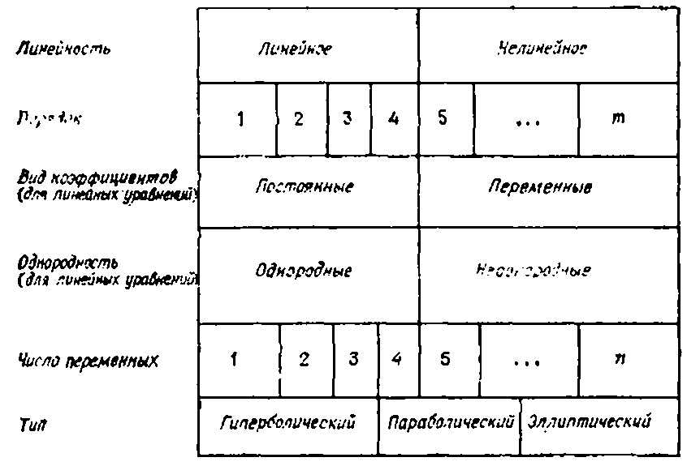

PHC 1.1. Діаграма класифікації диференціальних рівнянь у похідних похідних.

3. Рис. 1.1. Наведено наступну класифікацію.

# ЗАВДАННЯ

- 1. Класифікація початку рівня відповідає всім характеристикам, зазначеним у даних на рис. 1.1:
 - a) $u_t = u_{xx} + 2u_x + u$ ,

6) $u_t = u_{xx} + e^{-t}$ , B) $u_{xx} + 3u_{xy} + u_{yy} = \sin x$ , $u_{tt} = uu_{xxx} + e^{-t}$ .

- 2. Скільки розв'язків $u_1 = u_{xx}$ рівняння існує? Спробуйте знайти рішення, як $u(x, t) = e^{a\lambda + bt}$ .
- 3. Якщо функції $u_1(x, t)$ і $u_2(x, t)$ задовольняють рівняння (1.1), чи задовольняє сума цих функцій його? Доведи це.
- 4. Ймовірно, найпростіше диференціальне рівняння в похідних —

$$\frac{\partial u(x, y)}{\partial x} = 0.$$

Чи можете ви розв'язати це рівняння? (Знайдіть усі функції, що задовольняють це рівняння.)

5. Що можна сказати про рівняння

$$\frac{\partial^2 u(x, y)}{\partial x \partial y} = 0$$

Чи можете ви знайти всі розв'язки цього рівняння? Скільки їх? Порівняйте з кількістю розв'язків звичайного диференціального рівняння

$$\frac{d^2y}{dx^2} = 0.$$

# Лекція 2. ЗАДАЧІ ТИПУ ДИФУЗІЇ (ПАРАБОЛІЧНІ РІВНЯННЯ)

МЕТА ЛЕКЦІЇ: Показати, як параболічні рівняння використовуються для розв'язання задач теплопровідності та дифузії. Наведено кілька прикладів параболічних рівнянь, а також пояснюється фізичне значення різних членів $(u_1, u_2, u_3, u_4, u_6)$ , включених у ці рівняння.

На конкретному прикладі розглядається основна ідея зміщеної задачі для параболічного рівняння. Одна з головних цілей цієї лекції — надати читачеві інтуїтивне уявлення

Розуміння параболічних проблем.

Почнемо з розгляньмо просту фізичну задачу і те, як її можна описати математичною моделлю з рівнянням у похідних похідних.

Потім ми ускладнимо задачу і покажемо, як нові фізичні умови призводять до появи нових рівнянь у похідних похідних. У цій лекції диференціальні рівняння не виводяться і не розв'язуються. Про це ми поговоримо пізніше.

# Простий експеримент з теплопровідністю

Припустимо, що ми провели простий експеримент, який розбили на такі кроки:

КРОК 1. Візьміть достатньо довгий (скажімо, $L=2\,\mathrm{m}$ ) стрижень (наприклад, мідний) діаметром $2\,\mathrm{cm}$ , бічна поверхня (але не кінці) якої термічно ізольована. Замість стрижня можна використовувати мідну трубку, покриту теплоізоляцією зовні та зсередини.

Іншими словами, тепло може проходити лише через кінці стрижня і не може проходити через його бічну поверхню.

КРОК 2. Тепер помістимо цей стрижень у пристрій із фіксованою температурою $T_{\mathfrak{o}}$ (градуси Цельсія) на достатньо довгий час, щоб температура всередині стрижня стала

Так само, як і температура пристрою. Для простоти припустимо, що температура пристрою $T_0 = 10^{\circ}$ C.

КРОК 3. Давайте витягнемо стрижень з нашого пристрою у певний момент часу, що зручно взяти як нуль t = 0, і приєднаємо до нього дві термопари з кінців. Завдання цих елементів — підтримувати фіксовані температури $T_1$ і $T_2$ на кінцях (наприклад, $T_1=0^{\circ}$ C і $T_2=50^{\circ}$ C). Іншими словами, два термостати постійно контролюють температуру на кінцях стрижня, і якщо температура відхиляється від встановлених значень $T_1$ і $T_2$ , активуються потужні нагрівальні або охолоджувальні елементи (пристрої) для відповідного регулювання температури. Наш експеримент ілюструє RPS, 2 1,

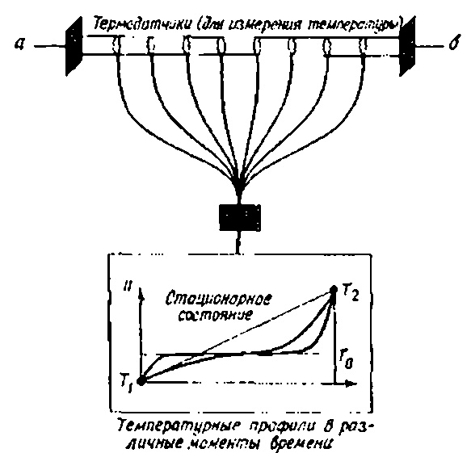

Фіг. 2.1. Схема експерименту: a – температура термопари, яка є температурою $T_1$ на левовому вітрі стрижа; $\delta$ — це ціна термопари, тобто температура $T_2$ на правій лаві стрижка.

КРОК 4. Тепер ми будемо слідкувати за температурним профілем у стрижні за допомогою пристрою візуалізації. Чому ми хочемо провести такий експеримент? Це інше питання, про яке ми поговоримо пізніше.

Це кінець опису нашого експерименту.

Головна мета цієї лекції — показати, як цю фізичну проблему та її модифікації можна змоделювати мовою параболічних рівнянь.

# Математична модель теплопровідності

Опис нашої фізичної проблеми вимагає трьох типів відносин.

- 1. Рівняння з частковими похідними, які описують фізичне явище теплопровідності.
- 2. Граничні умови, що описують процеси теплопередачі на межах.
- 3. Початкові твердження, які описують стан системи на початку процесу.

# Рівняння теплопровідності

Базове одновимірне рівняння теплопровідності записується у вилці

(2.1)

$$u_t = \alpha^2 u_{xx}, \quad 0 < x < L, \quad 0 < t < \infty.$$

Це рівняння пов'язує значення $u_t$ — швидкість зміни температури з часом (виміряна в градусах/с)

та величину $u_{xx}$ — це увігнутий профілю температури u(x, t) (який є мірою різниці між температурою в заданій точці та температурою в сусідніх точках).

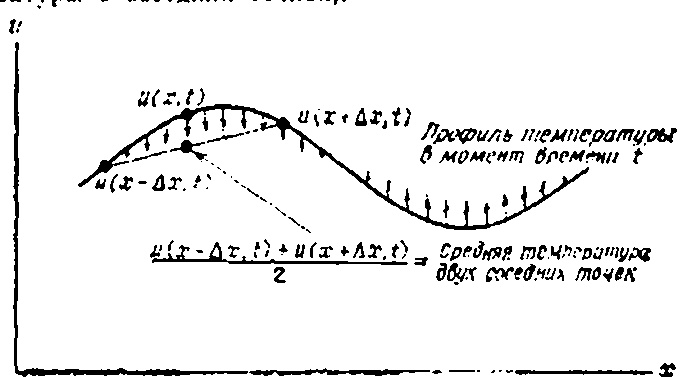

Фіг. 2.2. Стрілки показують зміну температури від часу до рівня $u_t = \alpha^2 u_{xx}$ .

Мета буде видно з базового рівня збереження тепла у наступних лекціях, які стануть початком нашого погляду. Температура $u\left(x,\ t\right)$ (у точках співу t у точках співу x стрижня) $(u_t>0)$ змінювати $(u_t<0)$ різниці між $u_{xx}$ позитивним і негативним. Фіг. Рисунок 2.2 показує зміну температури в різних точках елемента.

Давайте подивимось, як значення $u_{xx}$ можна інтерпретувати мовою теплопровідності. Припустимо, ми наблизимо значення $u_{xx}$ фінальних постів

$$u_{xx}(x, t) \cong \frac{1}{\Delta x^2} [u(x + \Delta x, t) - 2u(x, t) + u(x - \Delta x, t)].$$

Це співвідношення можна переписати у вигляді

$$u_{\lambda x}(x, t) \simeq \frac{2}{\Delta x^2} \left[ \frac{u(x + \Delta x, t) + u(x - \Delta x, t)}{2} - u(x, t) \right].$$

Тепер ми можемо дати наступну інтерпретацію значення $u_{xx}$ .

1. Якщо температура u(x, t) менша за середнє значення температури у двох сусідніх точках, то $u_{xx} > 0$ (тут загальний тепловий потік по осі x додатний).

2. Якщо температура u(x, t) дорівнює середньому значенню температур у двох сусідніх точках, то $u_{xx} = 0$ (тут загальний тепловий потік по осі x дорівнює нулю).

3. Якщо температура $u\left(x,\ t\right)$ вища за середню температуру у двох сусідніх точках, то $u_{xx}<0$ (тут — повний потік

тепла вздовж осі x є від'ємною).

Див. рис. 2.2. Іншими словами, якщо температура в точках x більша за середню температуру у двох точках $x - \Delta x$ і $x + \Delta x$ , то температура в точках x зміниться. По-друге, значення зниження температури є точним, а значення самого $u_t$ — частка підйому. Коефіцієнт пропорції $\alpha^2$ бути представлений потужністю матеріалу. Ми детально розглядаємо константу в лекціях про майбутнє.

# Граничні умови (ГУ)

Усі фізичні проблеми характеризуються наявністю певних меж. Отже, щоб рухатися вперед, ми повинні включити межі в математичну модель, щоб адекватно описати фізичну проблему. У нашому експерименті граничні умови (ГІ) дуже прості. Оскільки температура на кінцях x=0 і x=L завжди залишається сталою і дорівнює $T_1$ та $T_2$ , можливо записати

(2.2)

$$\left\{ \begin{array}{l} u\left(0,\ t\right) = T_{t}, \\ u\left(L,\ t\right) = T_{2}, \end{array} \right. \quad 0 < t < \infty,$$

# Початкові умови (ПУ)

Усі фізичні процеси мають починатися у певний момент часу (зазвичай приймається як нуль t=0), тому ми повинні встановити фізичні умови саме в цю точку. Відтоді, як ми почали контролювати температуру з моменту, коли паличка мала постійну температуру $T_{\mathrm{ }o}$ , ми

(2.3)

$$u(x, 0) = T_0, \quad 0 \le x \le L$$

Тепер ми створили математичну модель експерименту. Система співвідношень (2.1), (2.2) та (2.3) називається задачею зміщення для рівняння теплопровідності і зазвичай записується як

(2.4)

$$\begin{aligned} & (\text{УЧП}) \quad u_t = \alpha^2 u_{xx}, & 0 < x < L, \ 0 < t < \infty, \\ & (\text{ГУ}) \quad \begin{cases} u \ (0, \ t) = T_1, \\ u \ (L, \ t) = T_2, \end{cases} & 0 < t < \infty, \\ & (\text{НУ}) \quad u \ (x, \ 0) = T_0, \quad 0 \leqslant x \leqslant L. \end{aligned}$$

Цікаво, що це зовсім не очевидно: чи існує одна функція u(x, t), яка задовольняє умови (2.4), і чи описує ця функція температуру в стрижні? Отже, наше безпосереднє завдання — знайти цю функцію u(x, t) з (2.4).

Перш ніж завершити цю лекцію, давайте розглянемо деякі варіації основної проблеми. Почнемо з невеликих змін рівняння теплопровідності.

# Деякі рівняння дифузійного типу

Теплопередача через бічну поверхню пропорційна різниці температур

Рівняння

$$u_t = \alpha^2 u_{xx} - \beta (u - u_0)$$

Описує теплопровідність елемента, враховуючи не лише дифузію теплових $\alpha^2 u_{xx}$ вздовж елемента, а й теплопередачу через бічну поверхню елемента. Відтік тепла ( $\beta > 0$ ) або його приплив ( $\beta < 0$ ) пропорційний різниці між температурою u стрижня та температурою навколишнього середовища $u_0$ ( $\beta$ — це сталий коефіцієнт пропорційності). Якщо коефіцієнт $\beta$ великий порівняно з $\alpha^2$ , то теплопотік уздовж стрижня буде малим порівняно з

Протікання через бічну поверхню, і тому тепло буде проходити через неї відповідно до закону $u_t = -\beta (u - u_a)$ .

У хімії, де величина відіграє роль концентрації, рівняння

$$u_1 = \alpha^2 u_{xx} - \beta (u - u_0)$$

означає, що швидкість зміни $u_i$ кількості речовини залежить як від дифузії $\alpha^2 u_{xx}$ (у напрямку осі x), так і від появи ( $\beta < 0$ ) або розпаду ( $\beta > 0$ ) речовини в хімічній реакції, і пропорційна різниці між двома концентраціями u і $u_{\theta}$ .

# Внутрішнє джерело тепла

Неоднородне рівняння

$$u_t = \alpha^2 u_{xx} + f(x, t)$$

відповідає випадку, коли всередині елемента є джерело тепла (розташоване вздовж усього елемента і діє в будь-який момент t). Наприклад, може бути так, що дріт з електричним струмом проходить через стрижень і опір є постійним джерелом тепла f(x,t) = K.

# Рівняння конвективної дифузії

Припустимо, що домішка поширюється вздовж потоку, що рухається зі швидкістю v. Очевидно, що концентрація $u\left(x,\,t\right)$ домішок змінюється залежно від x (позитивний напрямок осі x обирається вздовж потоку) і часу t. Швидкість зміни концентрації $u_t$ визначається рівнянням конвективної дифузії

$$u_t = \alpha^2 u_{xx} - v u_x.$$

Термін $\alpha^2 u_{xx}$ описує внесок дифузії, а $vu_x$ — конвективний компонент. Що важливіше, дифузія або конвекція залежить від співвідношення $\alpha^2$ до v. Димові частинки піднімаються конвективно через рух гарячого повітря і одночасно розсіюють через вихорові рухи повітря. Окрім цих модифікацій рівняння теплопровідності, можливо змінювати граничні умови на кінцях стрижня відповідно до фізичної ситуації. Деякі з цих змін ми обговоримо у третій лекції.

# ЗАУВАЖЕННЯ

Рівняння теплопровідності $u_t = \alpha^2(x) u_{xx}$ з змінним коефіцієнтом $\alpha(x)$ відповідає задачі, в якій дифузія залежить від x (тобто матеріал є гетерогенним). Наприклад, мідь і сталь—

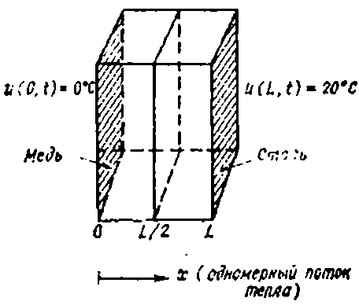

PHC. 2.3.

Пластини контактують, як показано на рис. 2.3. Припускається, що температура $u(0,t)=0^{\circ}$ C очікується на лівому боці світу, а температура $u(L,t)=20^{\circ}$ C — на правому боці світу, тому температура системи описується так:

$$u_t = \alpha^2(x) \, u_{_{\! A \, X}}, \quad 0 < x < L,$$

де

$$
\alpha(x) = \begin{cases}
\alpha_1, & \text{коефіцієнт дифузії в міді}, \quad 0 < x < L/2, \\
\alpha_2, & \text{коефіцієнт дифузії в сталі}, \quad L/2 < x < L.
\end{cases}
$$

# ЗАВДАННЯ

1. Якщо початкова температура в стрижні

$$u(x, 0) = \sin \pi x, \quad 0 \leqslant x \leqslant 1,$$

а граничні умови такі:

$$
u(0, t) = 0, \qquad u(1, t) = 0.
$$

Тоді як поводитиметься температура в стрижні $U(x, t)$ при $t > 0$ ? 2. Припустимо, що в стрижні є постійне внутрішнє джерело тепла, так що рівняння теплопровідності в стрижні записується як

$$u_t = \alpha^2 u_{xx} + 1, \quad 0 < x < 1.$$

Припустимо, що ми зафіксували температуру на межі з значеннями u(0, t) = 0 і u(1, t) = 1. Якою буде стаціонарна температура у стрижні? Іншими словами, який c-незалежний розподіл U(x, t) перешкоджує u(x, t)?

3. Припустимо, що металевий стрижень втрачає тепло через бічну поверхню згідно з рівнянням

$$u_1 = \alpha^2 u_{xx} - \beta u$$ $0 < x < 1$ .

І припустимо, що ми підтримуємо кінці стрижня при температурах U(0, T) = 1, U(1, T) = 1. Знайдіть стаціонарний розподіл температури по стрижню. Побудуйте графік цього розподілу. У яких моментах відбувається тепловий потік?

4. Припустимо, що термоізольований металевий стрижень довжини L = 1 має початкову температуру $\sin(3\pi x)$ , а фіксовану температуру — 0 і $10\,^{\circ}$ C на лівому та правому кінцях.

# Лекція 3. ГРАНИЧНІ УМОВИ В ЗАДАЧАХ ДИФУЗІЙНОГО ТИПУ

МЕТА ЛЕКЦІЇ: Показати, як виникають різні граничні умови у задачах теплопровідності та дифузії, а також ввести важливе поняття теплового потоку.

Розглядаються три найважливіші типи граничних умов:

- 1. u = g(t) (температура задається на межі),
- $2. \ \frac{\partial u}{\partial n} + \lambda u = g\left(t\right)$ (встановлення температури навколишнього середовища);

n — вектор зовнішньої нормалі до межі), $3. \frac{\partial u}{\partial n} = g(t)$ (визначений тепловий потік через межу).

У задачах теплопровідності зазвичай використовують три основні типи граничних умов. Ця лекція наводить приклади того, як різні фізичні умови експерименту призводять до різних типів граничних умов.

# Граничні умови першого виду (температура задається на межі)

Тепловий потік у односвітового стрижа видно, як показано на рис. 3 1, і вважається, що температура печей змінюватиметься відповідно до законів $g_1(t)$ і $g_2(t)$ .

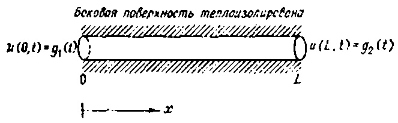

Фіг. 3,.1. Температура буде оновлена на кордоні.

Як згадувалося в попередній лекції, кожен пристрій, що підтримує встановлену температуру на кінцях, складається з термостата та нагрівального елемента для підтримки відповідних теплових умов. Проблеми з граничними умовами першого виду дуже поширені. У деяких випадках складність полягає у пошуку контролерів граничних умов, тобто температур $g_1(t)$ та $g_2(t)$ меж, які призводять до певної зміни температури всередині стрижня. Наприклад, у металургії часто необхідно обирати граничні умови контролю, щоб температура металу всередині печі змінювалася з часом, а температурний градієнт був невеликим.

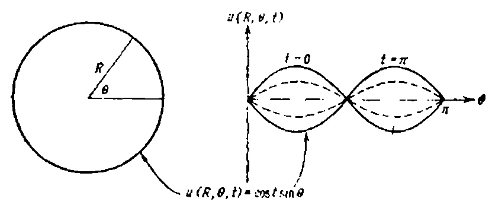

Фіг. 3.2. Зниження температури на межі.

Прикордонні розуми першого типу також використовуються у найважливіших завданнях поширення тепла. Як приклад, можна вказати задачу визначення температурного поля посередині круглого диска з радіусом *R* (див. рис. 3.2), якщо гранична температура задається на полярних координатах формулою $u(R, \theta, t) = \cos t \sin \theta$ .

Звісно, щоб розв'язати задачу, потрібно знати початкову температуру, але в цьому випадку початкові умови перестають впливати на розв'язок через дуже короткий час, і отримана температура всередині диска визначається лише значеннями температури на межі.

# Граничні умови другого виду (задана температура навколишнього середовища)

Припускається, що ми можемо побачити теплове розв'язання мідного стрижня по-новому, і тепер можна побачити заданий температурний режим на свіфтових областях. Natomist'st dat nablizimo kintsi strizhnya do kontaktu s dvoma seredovishchamy. Температура в одному з них $g_1(t)$ , а в іншому $g_2(t)$ . Іншими словами, вважається, що пік зсуву в контейнері зумовлений місцем народження, температура ніби змінюється за законом $g_1(t)$ . А правильна температура розміщується в іншій області з температурою $g_2(t)$ (рис. 3, 3)

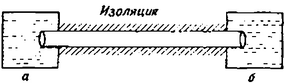

Фіг. 3.3. Конвективний теплообмін через межу, a — джерело радіну при температурі $g_1(t)$ , $\delta$ — радін при температурі $g_2(t)$ .

Задаючи граничні умови такого типу, ми не можемо вважати, що граничні температури стрижня збігаються з температурами рідини. Але ми знаємо закон Ньютона: якщо температура одного з кінців стрижня менша за температуру відповідної рідини, тепло потече в стрижень зі швидкістю, пропорційною різницям температур. Іншими словами, для одномірного стрижня з межами x=0 і x=1 закон теплопередачі Ньютона формулюється так:

(3.1)

вихідний тепловий потік на $x=0$ дорівнює $h\left[u\left(0,\,t\right)-g_{1}\left(t\right)\right]$ , вихідний тепловий потік при $x=L$ дорівнює $h\left[u\left(L,\,t\right)-g_{2}\left(t\right)\right]$ ,

де h — коефіцієнт теплопередачі, який показує, скільки калорій проходить через межу за одну секунду при різниці температур у один градус. Вихідний потік дорівнює кількості кало-

Відріжте список стіків за одну секунду. Щоб відновити якість, щоб внутрішній тепловий потік був позитивним у ножицях, а температура ножиць була вищою за температуру ножиць. Рівень (3.1) одразу, завдяки високому закону теплового руху, Фур'є тепер можна використати для створення Фіг

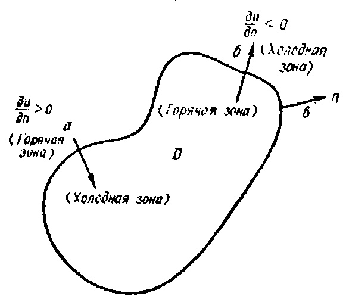

. 3.4. Ілюстрація закону Фур'є: $\frac{\partial u}{\partial n} > 0$ означає, що тепло надходить у цю область; $\frac{\partial u}{\partial n} < 0$ означає, що тепло виходить із цієї зони; n — напрямок зовнішньої нормалі; $\frac{\partial u}{\partial n} -$ Зміна температури в напрямку N; $\frac{\partial u}{\partial n} = -\frac{\partial u}{\partial (-n)}$ є похідною у напрямку внутрішньої нормальної — це похідна, взята $\mathbf{e}$ протилежному знаку протилежного знака пормалі.

граничні умови. Закон Фур'є дає друге представлення (перше міститься у (3.1)) для вихідного теплового потоку. Прирівнюючи ці два вирази до потоку, ми отримуємо граничні умови, які шукаємо. Сформулюємо закон Фур'є (встановлений експериментально):

(3.2) Тепловий потік, що проходить через межу площі, пропорційний нормальній похідній температури у напрямку внутрішньої норми.

Згідно з цим законом, якщо температура температури досягає межі D (рисунок 3.4), то потік буде течіти з середини в область D.

У нашій одновимірній задачі закон Фур'є має вигляд:

(3.3)

$$
\begin{cases}
\text{вихідний тепловий потік при } x=0 \text{ дорівнює } k \frac{\partial u}{\partial x}, \\
\text{вихідний тепловий потік при } x=L \text{ дорівнює } -k \frac{\partial u}{\partial x}.
\end{cases}
$$

де k — теплопровідність матеріалу, яка є мірою того, наскільки добре матеріал проводить тепло. Погано провідні матеріали мають коефіцієнт близький до нуля в одиницях GHS, тоді як мідь та алюміній мають значення значно вище нуля.

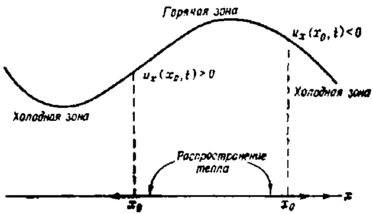

Фіг. 3.5. Ще одна ілюстрація закону Чотирьох.

Закон Хутра (3.3) насправді описує тепловий потік усього посередині стрижа, а не депривацію на її межі; Щодо заявки (розділ, рис. 3.5).

(3.4) Потік, що проходить через точку

$$x$$

зліва направо $=-k\frac{\partial n}{\partial x}$ Закон Фур'є (3.4) стверджує: якщо $u_x < 0$ , то в точці $x_0$ тепло тече зліва направо, якщо $u_x > 0$ , то в точці $x_0$ тепло тече справа наліво. (Тепло завжди переходить від вищих температур до нижчих.)

Щоб використати тепловий потік (3.1) і (3.3) для теплового потоку, можна використати граничні умови для задачі, описаної на рис. 3.3, у чисто математичній формі

$$(\Gamma Y) \quad \begin{cases} \frac{\partial u\left(0,\,t\right)}{\partial x} = \frac{h}{k}\left[u\left(0,\,t\right) - g_{1}\left(t\right)\right], \\ \frac{\partial u\left(L,\,t\right)}{\partial x} = -\frac{h}{k}\left[u\left(L,\,t\right) - g_{2}\left(t\right)\right]. \end{cases} \quad 0 < t < \infty,$$

Дуже часто константа h/k позначається як $\lambda$ , а граничні умови теплового потоку на межі записуються у вигляді

(3.5)

$$u_{x}(0, t) = \lambda [u(0, t) - g_{1}(t)], u_{x}(L, t) = -\lambda [u(L, t) - g_{2}(t)].$$

Для випадку вищих розмірностей отримують подібні граничні умови. Наприклад, якщо межа кругового диска осяяна рухомою рідиною з температурою $g(\theta,t)$ , то граничні умови записуються як

$$\frac{\partial u}{\partial r}(R, \theta, t) = -\frac{h}{k} [u(R, \theta, t) - g(\theta, t)].$$

Тут $\frac{\partial u}{\partial r}(R, \theta, t)$ позначає зовнішню нормальну похідну (у позитивному напрямку r-осі) значення u, обчислену в точці $(R, \theta)$ межі. Ми назвемо такі граничні умови лінійними (оскільки вони лінійні в U і $u_r$ ), але неоднорідними, оскільки функція $g(\theta, t)$ знаходиться праворуч.

# Граничні умови третього виду (враховуючи потік; зокрема, враховується випадок термічно ізольованих меж)

Жоден потік не проходить через термоізольовані межі, тому нормальна похідна (зовнішня чи внутрішня) має зрівнятися з нулем на межі, оскільки потік пропорційний нормальній похідній. У випадку одномірного елемента з ізольованими кінцями x=0 і x=L, граничні умови мають вигляд

$$u_{\lambda}(0, t) = 0,$$ $u_{\lambda}(L, t) = 0.$ $0 < t < \infty,$ У двовимірній області ізоляція межі означає, що нормальна похідна температури на межі перетворюється на нуль. Припустимо, наприклад, що круглий диск термічно ізольований уздовж межі. Тоді граничну умову слід записати так: $u_r(R, \theta, t) = 0$ для всіх $0 \le \theta < 2\pi$ і всіх $0 < t < \infty$ .

З іншого боку, якщо вказати кількість тепла, що проходить через межу нашого диска, то граничні умови набувають вигляду

$$u_r(R, \theta, t) = f(\theta, t),$$

де f(0, t) — це кількість тепла, що переходить у круглий диск із зовнішнього джерела.

Тепер проілюструємо різні типи граничних умов.

# Типові граничні умови для задачі одномірної теплопровідності

Припускається, що у нас мідний стриж довжиною 200 см, верхня сторона зсуву термічно вкритий попелом, а температура качана становить 0 °C. Дозволяється, що верхня голова стрижа має x=0 термічне засолювання, а нижня порода x=200 заповнена проточною водою, оскільки поточна температура становить $g_2(t)=20$ °C (див. рис. 3.6).

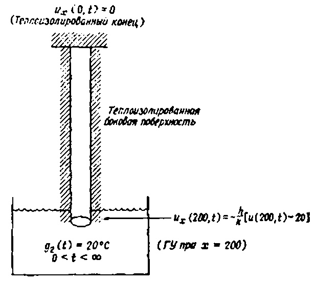

Фіг. 3.6. Змішане завдання.

Математична модель цієї задачі описується наступними чотирма відношеннями:

$$(3.6)
\begin{aligned}
(\text{УЧП})\quad & u_t = \alpha^2 u_{xx}, && 0 < x < 200,\ 0 < t < \infty, \\
(\text{ГУ})\quad & u_x(0,t) = 0, && 0 < t < \infty, \\
& u_x(200,t) = -\frac{h}{k}\left[u(200,t) - 20\right], && 0 < t < \infty, \\
(\text{НУ})\quad & u(x,0) = 0^\circ\mathrm{C}, && 0 \leqslant x \leqslant 200.
\end{aligned}
$$

де $\alpha^2 = 1,16$ <sup>см 2</sup>/с — теплова дифузія міді;

k = 0,93 кал/см·с·°C — теплопровідність міді;

h — коефіцієнт теплопередачі. Визначення цього співвідношення — велика проблема. Він вимірюється швидкістю виходу тепла від другого кінця стрижня до води. Це залежить від швидкості потоку води, стану поверхні, яку слід змивати тощо.

Читач може спробувати провести експеримент, щоб визначити ділення значення цього коефіцієнта.

# ЗАУВАЖЕННЯ

1. Типова задача внутрішнього тепловиділення для квадрата показана на рис. 3.7.

У цій задачі початкова температура $u\left(x,\,y,\,t\right)$ при t = 0 задається всередині квадрата, і рівняння з похідними з частковими має вигляд Р и с

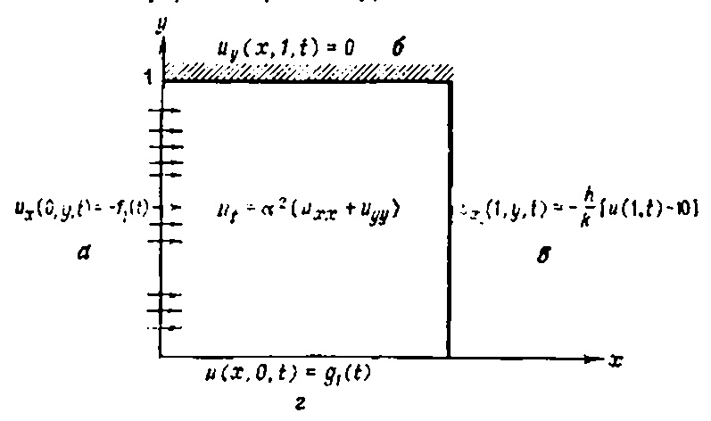

. 3.7. Типові граничні умови для задачі дифузії в квадраті: a — кількість тепла, $f_1(t)$ проходить через межу; b — термоізольована межа; a — це навколишня температура Равії $10^{\circ}$ C; z — температура підтримується рівною $10^{\circ}$ C.

І граничні умови будуть $0 < t < \infty$ , а температура — на початку моменту. Щодо температури, це вина прикордонних розумів, що показано на рис. 3.7.

2. Зверніть увагу, що гранична умова

$$u_r(R, \theta, t) = -\frac{h}{k} [u(R, \theta, t) - g(\theta, t)]$$

На колі не означає, що гранична температура дорівнює $g(\theta,t)$ , але якщо коефіцієнт теплопередачі h великий, то ці умови фактично еквівалентні вимогі $g(\theta,t)$ температури на межі.

# ЗАВДАННЯ

1. Намалюйте контури графіків для розв'язання змішаної задачі (3.6) для різних моментів часу. Чи відповідають ваші графи визначеним граничним умовам? Яка стаціонарна температура стрижня? Очевидно, ваша відповідь базується на інтуїції?

2. Як би ви інтерпретували наступне змішане завдання?

$$
\begin{aligned}
(\text{УЧП})\quad & u_t = \alpha^2 u_{xx}, && 0 < x < 1,\ 0 < t < \infty, \\
(\text{ГУ})\quad & u(0,t) = 0,\quad u_x(1,t) = 1, && 0 < t < \infty, \\
(\text{НУ})\quad & u(x,0) = \sin(\pi x), && 0 \leqslant x \leqslant 1.
\end{aligned}
$$

Чи можете ви графічно показати рішення цієї проблеми в різні моменти часу? Чи буде це рішення, як правило, стаціонарним? Це очевидно?

3. Яку фізичну інтерпретацію ви можете дати проблемі

$$
\begin{aligned}
(\text{УЧП})\quad & u_t = \alpha^2 u_{xx}, && 0 < x < 1,\ 0 < t < \infty, \\
(\text{ГУ})\quad & u_x(0,t) = 0,\quad u_x(1,t) = 0, && 0 < t < \infty, \\
(\text{НУ})\quad & u(x,0) = \sin(\pi x), && 0 \leqslant x \leqslant 1.
\end{aligned}
$$

Чи можете ви графічно показати рішення цієї проблеми в різні моменти часу?

Що можна сказати про стабільну температуру?

4. Припустимо, що бічна поверхня металевого стрижня не ізольована і має початкову температуру 20°C, але температура одного кінця стає 50°C. Потім стрижень промивають рідиною з температурою 30°C. Як виглядає змішана задача, що відповідає цьому випадку?

# Лекція 4. ВИВЕДЕННЯ РІВНЯННЯ ТЕПЛОПРОВІДНОСТІ

МЕТА ЛЕКЦІЇ: Показати, як можна отримати одномірне рівняння теплопровідності

$$u_t = \alpha^2 u_{xx} + f(x, t),$$

спираючись лише на фундаментальний закон збереження кількості тепла. Розглядається залежність швидкості теплопередачі від основних термофізичних параметрів: теплопровідності, теплоємності та густини матеріалу. Розглядаються різні модифікації базового рівняння теплопровідності.

У кожній галузі знань існує набір базових принципів, правильність яких очевидна. Усі інші твердження мають бути виведені з цих базових принципів. Звісно, те, що очевидно одній людині, може здатися сумнівним для іншої. Історія будь-якої науки полягає у постійному пошуку більш фундаментальних принципів, що лежать в основі цієї науки. Основні принципи мають бути настільки універсальними, щоб ніхто не сумнівався.

? – Пушення А – Припушення Б – Припушення Ц – Припушення Д – ?
Фіг. 4.1. Аксіоматичний метод.

На основі застосування B можна вивести теорему C, яка буде викликана до теорем D, а також як чергу — до висновку інших теорем (див. Рисунок 4.1). Вісь як погляд у науці розвивається — дослідник може бачити все більше нових результатів. Найвідатніші фізікі, хімікі та білогі або саме на ц'ому шлях.

З іншого боку, замість доведення нових теорем можна спробувати, якщо можливо, знайти новий принцип (назвемо його A), який є більш фундаментальним за B. Припущення A природно вважається більш фундаментальним, ніж B.

Так само можливо знайти новий принцип А, щоб межі нашого знання можна простежити до сфери більш фундаментальних ідей про науку співу. У теорії тепловиробництва основним принципом є закон збереження енергії (теплова енергія). Використовуються такі основні принципи (рис. 4.2).

Закон збереження енергії

$$u_t = \alpha^2 u_{xx} + f(x,t)$$

Інша сила тепла забезпечує Рис. 4.2. Енергозбереження: поширений камінь теплопродуктивності.

Звісно, ми могли б забути цю лекцію і використати рівняння теплопровідності як фундаментальне поняття (дехто може так подумати, якщо це очевидно), але тоді ми обдуримо більш серйозних студентів, адже закон збереження вважається найфундаментальнішим принципом у науці. Науковці, моделюючи свої задачі, часто записують відношення, що виражають закони збереження, а потім переписують їх у вигляді рівнянь у похідних похідних.

Повернемося до головної мети нашої лекції — вивести рівняння теплопровідності з рівняння збереження енергії.

# Виведення рівняння теплопровідності

Розглянемо однорідний стрижень довжини L, щодо якого зробимо такі припущення:

1. Стрижень виготовлений з одного однорідного провідного матеріалу.

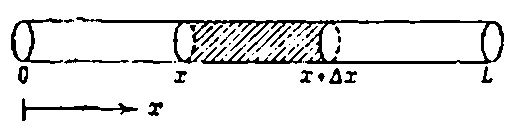

Фіг. 4.3. Тонкий тепловий стержень.

2. Бікова поверхня стрижня термічно ізольована (тепло може поширюватися лише вздовж осі x).

3. Стрижень тонка, тобто температура всіх точок у кожному поперечному перерізі стрижня є сталою. Якщо розглядати частину вудки на сегменті $[x, x+\Delta x]$ і використовувати

закон збереження кількості тепла, тоді можна написати:

(4.1) Загальна зміна кількості тепла на сегменті $[x, x + \Delta x] =$ дорівнює загальній кількості тепла, що пройшло через межі + Нульова кількість тепла, утвореного всередині сегмента $[x, x + \Delta x]$ .

Оскільки загальна кількість тепла (у калоріях) всередині сегмента $\{x, x + \Delta x\}$ в будь-який момент часу t обчислюється формулою:

Загальна кількість тепла всередині сегмента $[x, x+\Delta x] = \int\limits_{-\infty}^{x+\Delta x} coAu$ (s, t) ds,

де c — питома теплоємність матеріалу (показує здатність матеріалу накопичувати тепло),

Щільність матеріалу,

A — це площа поперечного перерізу стрижня.

**va**con збереження енергії (4.1) можна надати у такій математичній формі:

(4.2)

$$\frac{d}{dt} \int_{x}^{x+\Delta x} c\rho Au(s, t) ds = c\rho A \int_{x}^{x+\Delta x} u_{t}(s, t) ds = eA \left[ u_{x}(x+\Delta x, t) - u_{x}(x, t) \right] + A \int_{x+\Delta x}^{x+\Delta x} f(s, t) ds.$$

**де** k — теплопровідність матеріалу (вказує на здатність матеріалу проводити тепло), f(x, t) — об'ємна потужність зовнішнього джерела тепла (калорії/см·с).

Задача полягає в тому, щоб записати рівняння (4.2) у формі, яка не містить інтегралів. Щоб розв'язати цю задачу, нагадаємо читачеві теорему про середнє значення з ходу інтегральної нечисельності.

# Теорема про значення

Якщо функція f(x) є неперервною на сегменті [a, b], то існує принаймні одна точка $\xi \in [a, b]$ така, що

$$\int_{a}^{b} f(x) dx = f(\xi) (b-a).$$

Застосовуючи цей результат до рівняння (4.2), ми отримуємо наступний результат

$$
coA\,u_t(\xi, t)\,\Delta x = kA\left[u_x(x + \Delta x, t) - u_x(x, t)\right] + Af(\xi, t)\,\Delta x,
$$

де $x < \xi < x + \Delta x$ , тобто

$$
u_t(\xi, t) = \frac{k}{c\rho}\left[\frac{u_x(x + \Delta x, t) - u_x(x, t)}{\Delta x}\right] + \frac{1}{c\rho} f(\xi, t).
$$

Спрямовуючи $\Delta x$ до 0, отримуємо потрібне рівняння

(4.3)

$$u_t(x, t) = \alpha^2 u_{xx}(x, t) + F(x, t).$$

де

$$\alpha^{2}=\frac{k}{c\rho}$$

— коефіцієнт теплової дифузії, $F\left(x,\ t\right)=\frac{1}{c\rho}f\left(x,\ t\right)$ — густина джерел тепла.

Ми могли б зупинитися на цьому. Однак ми також розглянемо випадок, коли бічна поверхня стрижня не термічно ізольована. Припустимо, що кількість теплового потоку через бічну поверхню стрижня в цьому випадку пропорційна різниці між температурою стрижня u(x,t) і температурою навколишнього середовища, яка залишається сталою і дорівнює нулю. У цьому випадку закон збереження кількості тепла веде до рівняння

$$

(4.4) u_t = \alpha^2 u_{xx} - \beta u + F(x, t),

$$

де $\beta$ — коефіцієнт пропорційності потоку через бічну поверхню.

# ЗАУВАЖЕННЯ

1. Як зазначалося вище, константа k називається теплопровідністю речовини і чисельно дорівнює кількості тепла (у калоріях), що проходить за секунду через пластину товщиною 1 см і площею поперечного перерізу 1 см³ при різниці температур на протилежних гранях пластини рівною 1°C. Числові значення теплопровідності для різних матеріалів можна знайти в довідниках з фізики або хімії. Типові значення теплопровідності варіюються від 1 (для міді) до значень, близьких до нуля для хороших теплоізоляторів. Якщо стрижень зроблений із однорідного матеріалу, то значення k не залежить від x. Для деяких матеріалів значення k залежить від температури, і тому рівняння теплопровідності в цьому випадку стає нелінійним:

$$u_{t} = \frac{1}{c\rho} \frac{\partial}{\partial x}\left(k(u)\,u_{x}\right).$$

Однак найчастіше теплопровідність k дуже слабо впливає на температуру u, і цю нелінійність можна ігнорувати.

2. Значення c зазвичай називають питомою теплоємністю речовини. Він характеризує здатність речовини зберігати теплову енергію. Наприклад, запечена картопля має високу теплоємність, оскільки може зберігати велику кількість тепла на одиницю маси (саме тому вона зберігає високу температуру так довго). Чисельна теплоємність дорівнює кількості калорій тепла, які потрібно передати 1 граму речовини, щоб підвищити її температуру на 1°C. Для більшості розглянутих задач значення c можна вважати сталим, не записуючи ні x, ні i. Значення питомої теплоємності для конкретних матеріалів можна знайти у фізичних довідниках.

3. Одиниці вимірювання основних величин, включених у рівняння

теплопровідність (у системі GHS) наступна:

i-температура (градуси Цельсія), $u_t$ — швидкість зміни температури (°C/s), $u_x$ — нахил температурної кривої (°C/см), $u_{xx}$ — опуклість температурної кривої (°C/см²),

c = щільність тепла (калор/г $\cdot$ °C)

k — теплопровідність (кал/см $\cdot$ при $\cdot$ °C), $\rho$ — щільність (г/<sup>см3</sup>), $\alpha^2$ — це теплова дифузія (см<sup>²</sup>/с).

4. Слід зазначити, що теплова дифузія матеріалу $\alpha^2 = \frac{k}{\epsilon \rho}$ прямо пропорційна теплопровідності матеріалу і обернено пропорційна густині $\rho$ та питому теплоємності $\epsilon$ Ми сподіваємося, що цей зв'язок відповідає інтуїтивним ідеям читача.

# ЗАВДАННЯ

1. Підставити розмірність кожної з $u,\ u_t,\ \dots$ величин у рівняння

$$

u_t = \alpha^2 u_{xx} - \beta u

$$

і переконайтеся, що всі терміни мають однаковий розмір ${}^{\circ}\mathrm{C}/c$ .

2. Підставити розмірність кожної з величин у рівняння

$$

u_t = \alpha^2 u_{xx} - v u_x,

$$

де $\upsilon$ вимірюється в одиницях швидкості, і переконайтеся, що всі терми мають однакову розмірність.

3. Отримаємо рівняння теплопровідності

$$
u_t = \frac{1}{c\rho}\frac{\partial}{\partial x}\left[h(x)u_x\right] + f(x,t).
$$

для випадку, коли коефіцієнт теплопровідності залежить від координати $x$ .

4. Припустимо, що $u(x,t)$ — концентрація речовини в потоці, який рухається зі швидкістю $v$ . Якщо концентрація змінюється внаслідок дифузії та конвекції, то відповідне рівняння має вигляд

$$
u_t = \alpha^2 u_{xx} - v u_x.
$$

Виходячи з того, що в будь-який момент часу в певному $[x, x + \Delta x]$ сегменті матерії не з'являється і не зникає.

ПРИМІТКА. Закон збереження матерії виглядає так:

Зміни маси речовини на сегменті $[x, x + \Delta x] =$ = Зміна внаслідок дифузії через межі + Зміна внаслідок переносу через межі.

# Лекція 5. ЗМІННЕ РОЗДІЛЕННЯ

МЕТА ЛЕКЦІЇ: Вивчати читача, намагаючись розрізнити засоби та показати, як метод можна використати для вирішення хороших проблем дифузії. Методи цього методу створюють труднощі для роботи людей (основний порядок — через величезні алгебраномічні перетворення), які супроводжуються подачею інтенсивних підготовк світу.

Основна ідея методу полягає в тому, щоб розкласти початкову умову на найпростіші компоненти, знайти відгук системи на кожен найпростіший компонент і підсумувати всі відповіді. Таким чином можна знайти відповідь на довільну початкову умову.

Базовий метод заміни мелодійного світу менш можливий для такого методу перехоплення, але він все одно не виключається з йоги.

Метод поділу взаємозамінних завдань одним із найкращих способів розробки важливих завдань і їх використання такий:

- 1. Рівняння є лінійним і однорідним (не обов'язково з постійними коефіцієнтами).
 - 2. Граничні умови визначаються як

$$

\alpha u_x(0, t) + \beta u(0, t) = 0, \qquad \gamma u_x(1, t) + \delta u(1, t) = 0.

$$

де $\alpha$ , $\beta$ , $\gamma$ і $\delta$ — константи (граничні умови, задані в такій формі, називаються лінійними однорідними граничними умовами).

Метод роботи у години Fur'je (зазвичий відомий як мідє Фєє) і, здаєть, є напополярімім (деце застосовно).

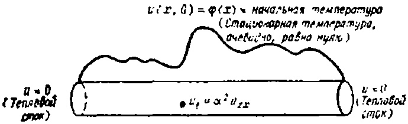

Фіг. 5.1. Схематичне представлення проблеми дифузії.

Для підстановки того, що є методом у загальному віпадку, розглянемо конкретну задачу (загальний вибір основного письма). Розглянемо проблему типу дифузії: знайти зв'язок

$$
\begin{aligned}
(\text{УЧП})\quad & u_t = \alpha^2 u_{xx}, && 0 < x < 1,\quad 0 < t < \infty, \\
(\text{ГУ})\quad & u(0,t)=0,\quad u(1,t)=0, && 0 < t < \infty, \\
(\text{НУ})\quad & u(x,0)=\varphi(x), && 0 \le x \le 1.
\end{aligned}
$$

Перш ніж почати розділяти змінні, давайте дамо фізичну інтерпретацію нашої проблеми. Отже, існує стрижень скінченної довжини, кінці якого підтримуються при сталій температурі, рівній нулю (насправді кінці можна підтримувати при значно вищій температурі, значення якої вважається початковою точкою). Додаткові дані про завдання подаються як початкова умова. Наша мета — знайти розподіл температури $u\left(x,t\right)$ в наступний час.

# Загальні принципи методу розділення змінних

Для найпростішого диференціального рівняння в похідних похідних розділення змінних є пошуком розв'язків у вигляді

$$

u(x, t) = X(x)T(t),

$$

de X(x) — це функція функції лежати на світлі зміни x, а T(t) — функція функції права лежати посередині t. Ce rozv'yazok u singing sensi є najproshim, oskolki temperature u(x, t), представлено у такій формі, zberigatime «form» до профілю u rizniy hour h t (див. рисунок 5.2).

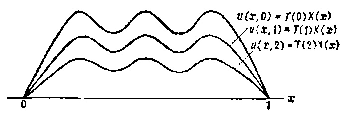

РИСУНОК 5.2 Графік функції X(x) T(t) у різних точках часу t.

Загальна ідея полягає в тому, щоб знайти нескінченну кількість таких часткових розв'язків, які задовольняють граничні умови

$$
u(0, t) = 0, \qquad u(1, t) = 0.
$$

Для цього підставляємо розв'язки (5.1) у ці граничні умови. У результаті отримуємо

$$
u(0, t) = B e^{-\lambda^2 \alpha^2 t} = 0 \Rightarrow B = 0,
$$

u(1, t) = A e^{-\lambda^2 \alpha^2 t}\sin \lambda = 0 \Rightarrow \sin \lambda = 0.

$$

Отже,

$$

\lambda_n = n\pi, \qquad n = 1, 2, \ldots

$$

Зверніть увагу, що друга гранична умова могла б виконуватися і при $A=0$, але тоді розв'язок (5.1) був би тривіально нульовим.

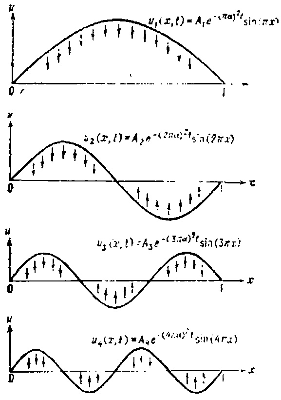

Рис. 5.3. Фундаментальне рішення $n_n(x, t) = A_n e^{-(\pi n \alpha)^{n/t}} \sin{(\pi n x)}$ .

Тепер, коли ми зробили другий крок, маємо нескінченний набір ознак

(5.2)

$$

u_n(x, t) = A_n e^{-(n\pi\alpha)^2 t} \sin(n\pi x), \quad n = 1, 2 \dots

$$

кожна з яких задовольняє рівняння з частковими похідними та граничними умовами). Отримані функції — це будівельні блоки, з яких ми будемо створювати рішення нашої проблеми. Це рішення буде певною сумою

<sup>2)</sup> Зверніть увагу, що функції $u_n$ і $u_{-n}$ відрізняються лише знаком.

цих найпростіших функцій. Конкретний тип суми залежить від початкового стану. Фіг. Рисунок 5.3 показує графіки кількох таких фундаментальних функцій

КРОК 3. (Пошук розв'язку, який задовольняє рівняння, межу та початкові умови.)

Останній (і, ймовірно, найцікавіший з математичної точки зору) крок — знайти таку суму фундаментальних розв'язків

$$

u(x, t) = \sum_{n=1}^{\infty} A_n e^{-(n\pi\alpha)^n t} \sin(n\pi x),

$$

тобто при виборі таких коефіцієнтів $A_n$ , що функція задовольнятиме початкову умову

$$

u\left( x,\ 0\right) =\varphi\left( x\right) .

$$

Підставляючи суму в початковому стані, отримуємо

(5.3)

$$

q(x) = \sum_{n=1}^{\infty} A_n \sin(n\pi x).

$$

Це рівняння підводить нас до цікавого питання: чи можна розкласти початкову температуру $\phi(x)$ на ряд елементарних функцій вигляду?

$$

A_1 \sin(\pi x) + A_2 \sin(2\pi x) + A_3 \sin(3\pi x) + \dots

$$

Позитивну відповідь на це питання дав французький математик Жозеф Фур'є. Виявилося, що для достатньо хороших функцій така декомпозиція можлива 
$^1$ ). Тоді виникає нове питання: знайти коефіцієнти розкладу $A_n$ ?

Насправді це дуже просто. Для цього використаємо властивість системи функцій

$$

\{\sin(n\pi x)\}_{n=1}^{\infty}.

$$

відомий як ортогональність.

У нашому випадку (див. завдання 2) ці функції задовольняють умови

$$

\int_{0}^{1} \sin(m\pi x) \sin(n\pi x) dx = \begin{cases} 0, & m \neq n, \\ 1/2, & m = n. \end{cases}

$$

Умови розкладу функцій у рядах Фур'є наведені в лекції 11. Для глибшого ознайомлення з цим питанням можна звернутися до численних освітніх літератур (див., наприклад: Г. П. Толстов, Серія Фур'є. — Москва: Наука, 1980). — Ед. Ед.

Ця властивість чітко показана на рис. 5.4, яка показує графіки деяких функцій із цієї системи.

Отже, ми хочемо знайти коефіцієнти у розкладі

$$

\varphi(x) = A_1 \sin(\pi x) + A_2 \sin(2\pi x) + A_3 \sin(3\pi x) + \dots

$$

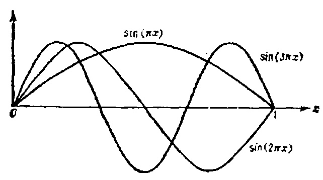

РИСУНОК 5.4. Послідовність ортогональних функцій

Помножте обидві сторони цього співвідношення на $\sin{(m\pi x)}$ (m — довільне ціле число) і інтегруйте від нуля до одиниці. У результаті ми отримуємо

$$

\int_{0}^{1} \varphi(x) \sin(m\pi x) \, dx = A_{m} \int_{0}^{1} \sin^{2}(m\pi x) \, dx = \frac{A_{m}}{2}

$$

(усі інші члени зрівнялися з нулем через ортогональність). Розв'язуючи рівняння відносно $A_m$ , отримуємо

$$

A_m = 2 \int_0^1 \varphi(x) \sin(m\pi x) dx.

$$

Отже, отримано, що розв'язок записується у вигляді

(5.4)

$$

u(x, t) = \sum_{n=1}^{\infty} A_n e^{-(n\pi\alpha)^2 t} \sin(\pi n x),

$$

де коефіцієнти $A_n$ визначаються формулами

$$

A_n = 2\int_0^1 \varphi(x) \sin(\pi nx) dx

$$

Ви можете переконатися, що отримане рішення задовольняє всі умови початкової задачі. На цьому завершується третій крок.

Багато студентів розчаровані, коли бачать, наскільки складним виглядає рішення, і майже не намагаються дивитися на нього знову (виглядає дуже погано). Однак це рішення не здаватиметься таким складним, якщо ви витратите час на його аналіз. Насправді, складніша форма розв'язку робить його більш інформативним. Нижче наведено кілька нотаток, які допоможуть вам інтерпретувати це рішення.

# ЗАУВАЖЕННЯ

Зверніть увагу, що єдина різниця між синусоїдальним розкладом функції φ(x) і розв'язком (5.4) — це наявність часового фактора e<sup>-(nπα)<sup>3</sup>1</sup> у кожному члені ряду. Отже, якщо початкова умова має просту декомпозицію, наприклад, вигляду

$$

\varphi(x) = \sin(\pi x) + \frac{1}{2}\sin(3\pi x),

$$

тоді рішення можна негайно записати

$$

u(x, t) = e^{-(\pi\alpha)^2 t} \sin(\pi x) + \frac{1}{2} e^{-(3\pi\alpha)^2 t} \sin(3\pi x).

$$

У цьому випадку очевидно, що якщо ми розкладемо $\phi(x)$ на ряд Фур'є вздовж синусів, то отримуємо

$$

A_1 = 1,

$$ $A_2 = 0,$ $A_3 = 1/2,$ $A_4 = A_5 = \dots = 0.$ - 2. Розв'язок (5.4) можна інтерпретувати так: ми представляємо початкову температуру $\varphi(x)$ як суму найпростіших функцій виду $A_n \sin(\pi nx)$ ; кожна така функція породжує відповідь $A_n e^{-(\pi n\alpha)^2 t} \sin(\pi nx)$ . Сумуючи всі такі відповіді, отримуємо розв'язок, який відповідає початковій умові $u(x, 0) = \varphi(x)$ .
- 3. Кожен член у декомпозиції

$$

u(x, t) = A_1 e^{-(\pi\alpha)^2 t} \sin(\pi x) + A_2 e^{-(2\pi\alpha)^2 t} \sin(2\pi x) + \cdots

$$

є функцією від x і t. Зверніть увагу, що внесок членів з великими числами в t>0 дуже малий через множник $e^{-(n\pi\alpha)^2 t}$ . Відповідно, після закінчення досить великого Р и с.

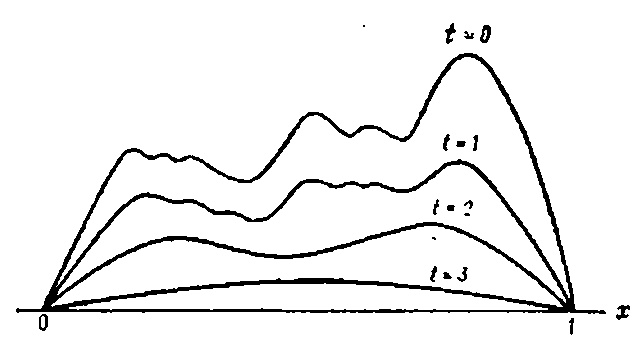

5.5. У задачах дифузії вищі порядки терміни швидко затухають; $\phi(x)$ — початкова температура. Слід зазначити, що по-перше, у розчині зникають високі частоти — по-перше, зникли найбільші коливання міді.

Повний розв'язок приблизно збігається з першим членом, який є півхвилі синусоїди, що з часом згасає (рис. 1). 5.5.)

# ЗАВДАННЯ

1. Показати, що функції

$$

u(x, t) = e^{-\lambda^2 \alpha' t} \left[ A \sin(\lambda x) + B \cos(\lambda x) \right]

$$

задовольняють рівняння $u_l = \alpha^2 u_{xx}$ для довільних значень A, B і $\lambda$ .

2. Покажи це

$$

\int_0^1 \sin(m\pi x) \sin(n\pi x) dx = \begin{cases} 0, & m \neq n, \\ 1/2, & m = n. \end{cases}

$$

ПРИМІТКА. Використання ідентичності

$$

\sin(mx)\sin(nx) = \frac{1}{2}[\cos(m-n)x - \cos(m+n)x].

$$

3. Знайти розклад у рядах Фур'є синусами функції $\varphi(x) = 1$ на сегменті [0, 1]. Побудуйте перші три терміни розкладу.

Використовуючи результати завдання 3, знайдіть розв'язок наступної змішаної задачі:

(PЧА)

$$

u_t = u_{xx}

$$ $0 < x < 1$ , 
(ГУ)

$$

\begin{cases} u(0, t) = 0, \\ u(1, t) = 0, \end{cases}

$$ $0 < t < \infty$ , 
(ПУ) $u(x, 0) = 1, \quad 0 \le x \le 1$ .

(Зверніть увагу, що ця проблема фізично не має значення, оскільки припускається, що температура на кінцях стрижня миттєво знижується з одного до нуля $\phi(x)$ .

5. Знайти розв'язок проблеми 4, якщо початкова умова встановлена у вигляді

$$

u(x, 0) = \sin(2\pi x) + \frac{1}{3}\sin(4\pi x) + \frac{1}{5}\sin(6\pi x).

$$

6. Розв'яжіть задачу 4, якщо початкова умова $u\left( x,\ 0\right) =x-x^{2},\quad 0< x<1.$ 
# Лекція 6. ПЕРЕТВОРЕННЯ НЕОДНОРІДНИХ ГРАНИЧНИХ УМОВ У ОДНОРІДНІ ГРАНИЧНІ УМОВИ

МЕТА ЛЕКЦІЇ: Показати, як змішану задачу з неоднорідними граничними умовами можна звести до задачі з однорідними граничними умовами.

$$

\begin{aligned}
(\text{УЧП})\quad & u_t - \alpha^2 u_{xx} = f(x,t), \\
(\text{ГУ})\quad & \alpha_1 u_x(0,t) + \beta_1 u(0,t) = g_1(t), \\
& \alpha_2 u_x(L,t) + \beta_2 u(L,t) = g_2(t), \\
(\text{НУ})\quad & u(x,0) = \varphi(x).
\end{aligned}

$$

Після відповідної заміни невідомої функції ця задача часто зводиться до задачі вигляду

$$

\begin{aligned}
U_t - \alpha^2 U_{xx} &= F(x,t), \\
\alpha_1 U_x(0,t) + \beta_1 U(0,t) &= 0, \\
\alpha_2 U_x(L,t) + \beta_2 U(L,t) &= 0, \\
U(x,0) &= \overline{\varphi}(x),
\end{aligned}

$$

тобто до задачі з нульовими граничними умовами. Якщо $F(x,t)=0$, нову задачу можна розв'язувати методом розділення змінних; якщо ж $F(x,t)\neq 0$, доводиться використовувати інші методи, зокрема інтегральні перетворення або розклади за власними функціями.

Щоб метод розділення змінних був застосовним, граничні умови мають бути лінійними та однорідними, тобто мати вигляд

(6.1)

$$

\begin{aligned}
\alpha_1 u_x(0,t) + \beta_1 u(0,t) &= 0, \\
\alpha_2 u_x(L,t) + \beta_2 u(L,t) &= 0.
\end{aligned}

$$

Мета цієї лекції — пояснити, як задачі з неоднорідними граничними умовами форми

(6.2)

$$

\begin{aligned}
(\text{УЧП})\quad & u_t = \alpha^2 u_{xx}, \\
(\text{ГУ})\quad & \alpha_1 u_x(0,t) + \beta_1 u(0,t) = g_1(t), \\
& \alpha_2 u_x(L,t) + \beta_2 u(L,t) = g_2(t), \\
(\text{НУ})\quad & u(x,0) = \varphi(x),
\end{aligned}

$$

можна звести до задач з однорідними граничними умовами.

Почнемо з найпростішого прикладу, коли кінці стрижня підтримуються при сталих температурах.

# Перетворення неоднорідних граничних умов у однорідні граничні умови

Розглянемо проблему поширення тепла в термоізольованому стрижні, кінці якого підтримуються при сталих температурах $k_1$ і $k_2$, тобто

$$
\begin{aligned}
(\text{УЧП})\quad & u_t = \alpha^2 u_{xx}, && 0 < x < L,\ 0 < t < \infty, \\
(6.3)\ (\text{ГУ})\quad & u(0,t) = k_1,\quad u(L,t) = k_2, && 0 < t < \infty, \\
(\text{НУ})\quad & u(x,0) = \varphi(x), && 0 \leqslant x \leqslant L.
\end{aligned}
$$

Складність цієї задачі полягає в тому, що неоднорідні граничні умови не дозволяють безпосередньо застосувати метод розділення змінних. Однак очевидно, що при $t \to \infty$ розв'язок має наближатися до стаціонарного лінійного профілю температури. Тому природно шукати розв'язок у вигляді суми стаціонарної та перехідної частин:

$$

u(x,t)=\left[k_1+\frac{x}{L}(k_2-k_1)\right]+U(x,t).

$$

У цьому випадку достатньо знайти перехідну температуру $U(x,t)$.

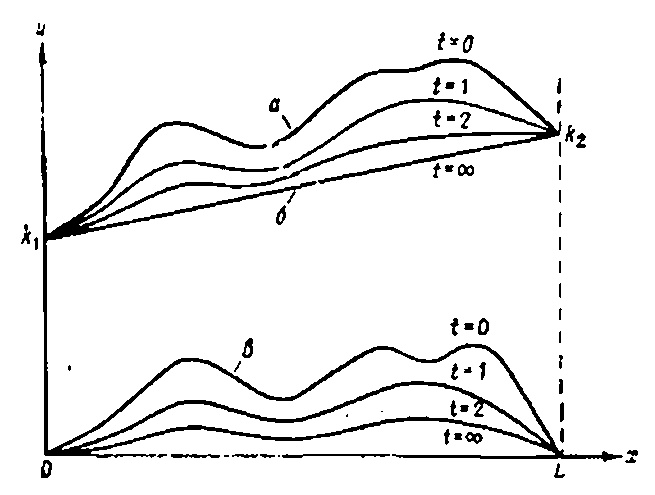

Рис. 6.1. Розв'язання задачі (6.3) у різні моменти часу:
а) початкова температура $u(x,0)=\varphi(x)$;
б) стаціонарна температура $u(x,\infty)=k_1+\frac{x}{L}(k_2-k_1)$;
в) перехідна температура.

Після цієї заміни задача (6.3) зводиться до нової задачі для функції $U(x,t)$:

(6.4)

$$

\begin{aligned}
U_t &= \alpha^2 U_{xx}, && 0 < x < L, \\
U(0,t) &= 0,\quad U(L,t) = 0, && 0 < t < \infty, \\
U(x,0) &= \varphi(x) - \left[k_1 + \frac{x}{L}(k_2 - k_1)\right] = \overline{\varphi}(x).
\end{aligned}

$$

де $\overline{\varphi}(x)$ — нова, але відома початкова умова.

Це вже задача з однорідними граничними умовами, отже її можна розв'язувати методом розділення змінних. Розв'язок має вигляд

(6.5)

$$

U(x,t)=\sum_{n=1}^{\infty} a_n e^{-(n\pi\alpha/L)^2 t}\sin\!\left(\frac{n\pi x}{L}\right),

$$

де

$$

a_n=\frac{2}{L}\int_0^L \overline{\varphi}(\xi)\sin\!\left(\frac{n\pi \xi}{L}\right)\,d\xi.

$$

Це все для сердечників із фіксованою температурою на кінцях. А як щодо більш реалістичних ПУ з правою стороною, залежною від часу? Основні ідеї тут ті ж, що й у попередній задачі, але вони набагато складніші.

# Перетворення граничних умов, залежних від часу, у нульові

Розглянемо типову задачу

$$

\begin{aligned}
(\text{PPP})\quad & u_t = \alpha^2 u_{xx}, && 0 < x < L,\quad 0 < t < \infty, \\
(\text{ГУ})\quad & u(0,t)=g_1(t),\quad u_x(L,t)+h\,u(L,t)=g_2(t), && 0 < t < \infty, \\
(\text{НУ})\quad & u(x,0)=\varphi(x), && 0 \le x \le L.
\end{aligned}

$$
Щоб перетворити ці граничні умови на нульові умови, ми, після деяких спроб і помилок, зупинилися на такій формі розв'язку:

(6.7)

$$

u(x, t)=A(t)\left(1-\frac{x}{L}\right)+B(t)\frac{x}{L}+U(x, t).

$$

де функції $A\left(t\right)$ і $B\left(t\right)$ обираються так, що «квазі-стаціонарна» частина розв'язку (6.7)

(6.8)

$$

S(x, t)=A(t)\left(1-\frac{x}{L}\right)+B(t)\frac{x}{L}.

$$

задовольняє граничні умови початкової задачі. У цьому випадку функція $U\left(x,\ t\right)$ задовольнятиме однорідні граничні умови.

Підставляючи функцію S(x, t) у граничні умови

$$

S(0, t)=g_1(t), \qquad S_x(L, t)+hS(L, t)=g_2(t).

$$

одержуємо два рівняння для $A(t)$ і $B(t)$. У результаті маємо

(6.9)

$$

A(t)=g_1(t), \qquad B(t)=\frac{g_1(t)+Lg_2(t)}{1+Lh}.

$$

Отже,

$$

u(x, t)=g_1(t)\left(1-\frac{x}{L}\right)+\frac{g_1(t)+Lg_2(t)}{1+Lh}\frac{x}{L}+U(x, t).

$$

Якщо підставити ці вирази для $u(x,t)$ у початкову задачу, то отримаємо нову задачу для невідомої функції $U(x,t)$:

$$

\begin{aligned}
(\text{УЧП})\quad & U_t = \alpha^2 U_{xx} - S_t(x,t), && 0 < x < L,\quad 0 < t < \infty, \\
(\text{ГУ})\quad & U(0,t) = 0,\quad U_x(L,t) + hU(L,t) = 0, && 0 < t < \infty, \\
(\text{НУ})\quad & U(x,0) = \varphi(x) - S(x,0), && 0 \leqslant x \leqslant L.
\end{aligned}

$$

Тепер ми стикаємося з новою проблемою однорідних граничних умов (на жаль, рівняння стало гетерогенним). Ми не можемо розв'язати цю задачу методом розділення змінних, але якщо читач погоджується чекати, то за кілька лекцій він ознайомиться з розв'язком цієї задачі методом цілісних перетворень і розкладання за власними функціями.

# ЗАУВАЖЕННЯ .

1. Як зазначалося раніше, мета цієї лекції — навчити читача, як перетворювати задачі з неунірольними граничними умовами на задачі з нульовими граничними умовами. Після цього може статися, що нове диференціальне рівняння в похідних похідних стане однорідним. Якщо це станеться, ми можемо вважати себе щасливцями, оскільки в цьому випадку проблему можна розв'язати методом розділення змінних (див. перший приклад з цієї лекції). Якщо перетворене рівняння виявиться гетерогенним, тоді нову задачу потрібно розв'язати іншим методом.

2. Лінійні неоднорідні граничні умови найзагальної форми

$$

\alpha_1 u_x(0,t) + \beta_1 u(0,t) = g_1(t), \qquad \alpha_2 u_x(L,t) + \beta_2 u(L,t) = g_2(t).

$$

Ви також можете перетворити ці умови на нульові граничні умови, використовуючи метод, описаний у другому прикладі. Звісно, нове рівняння при цьому, як правило, буде гетерогенним.

- 3. Деякі методи розв'язку не містять вимог щодо унікальності граничних умов і, отже, не потребують попередніх перетворень. Пізніше, коли ми ознайомимося з перетворенням Лапласа, побачимо, що нульові граничні умови є необов'язковими (у випадку нульових граничних умов розв'язок дещо простіший, ніж в інших випадках).
- 4. Для граничних умов типу

$$

u(0, t)=g_1(t), \qquad u(L, t)=g_2(t).

$$

Метод, описаний у другому прикладі, призводить до наступної форми розв'язання задачі:

$$

u(x, t)=g_1(t)+\frac{x}{L}\left[g_2(t)-g_1(t)\right]+U(x, t).

$$

# ЗАВДАННЯ

1. Знайти розв'язок наступної змішаної задачі:

$$

\begin{aligned}
(\text{РЧП})\quad & u_t = \alpha^2 u_{xx} + x\cos t, && 0 < x < 1,\quad 0 < t < \infty, \\
(\text{ГУ})\quad & u(0,t) = 1,\quad u_x(1,t) + hu(1,t) = 1, && 0 < t < \infty, \\
(\text{ПУ})\quad & u(x,0) = \sin(\pi x), && 0 \leqslant x \leqslant 1.
\end{aligned}

$$

попередньо перетворюючи його на задачу з нульовими граничними умовами. Чи відповідає рішення, яке ви отримуєте, вашим задумам щодо цієї проблеми?

2. Перетворіть у задачу з нульовими граничними умовами і розв'яжіть задачу

$$

\begin{aligned}
(\text{РЧП})\quad & u_t = u_{xx}, && 0 < x < 1,\quad 0 < t < \infty, \\
(\text{ГУ})\quad & u(0,t)=0,\quad u(1,t)=1, && 0 < t < \infty, \\
(\text{ПУ})\quad & u(x,0)=x^2, && 0 \le x \le 1.
\end{aligned}

$$

Як виглядатиме розв'язок у різні моменти часу? Чи відповідає він вашим інтуїтивним уявленням? Що таке стаціонарний розв'язок і як виглядає перехідна частина?

3. Завдання

$$
\begin{aligned}
(\text{УЧП})\quad & u_t = u_{xx}, && 0 < x < 1,\ 0 < t < \infty, \\
(\text{ГУ})\quad & u_x(0,t) = 0,\quad u_x(1,t) + h u(1,t) = 1, && 0 < t < \infty, \\
(\text{НУ})\quad & u(x,0) = \sin(\pi x), && 0 \leqslant x \leqslant 1.
\end{aligned}
$$

Перетворимо на задачу з нульовими граничними умовами. Чи буде нове рівняння однорідним?
# Лекція 7. РОЗВ'ЯЗАННЯ СКЛАДНІШИХ ЗАДАЧ ШЛЯХОМ РОЗДІЛЕННЯ ЗМІННИХ

МЕТА ЛЕКЦІЇ: Показати, як більш складні проблеми теплопровідності можна розв'язати методом розділення змінних. У цій лекції ми головним чином розглядаємо такі задачі, розв'язання яких дозволить читачеві краще ознайомитися з методом ділення змінних. Сподіваємося, що читач зможе екстраполювати викладені тут ідеї для власних завдань.

У тій же лекції читач ознайомиться з задачею за її власними функціями, або, як її ще називають, проблемою Штурма-Ліувіля. Обговорюються деякі властивості проблеми Штурма-Ліувіля.

Як згадувалося вище, мета цієї лекції — розв'язати змішану задачу шляхом розділення змінних. Можливо, саме таким методом читач вирішить свою проблему. Водночас ми сподіваємося, що він зможе перенести метод, розглянутий у цій лекції, для власних завдань.

Почнемо з одномірної задачі теплопровідності, в якій одна з граничних умов містить похідну.

# Задача теплопровідності з похідною в граничній умові

Розглянемо пристрій, показаний на рис. 7.1. Припустимо, що верхній кінець стрижня підтримується при нульовій температурі, тобто u(0, t) = 0, а нижній кінець занурений у воду, температура якої також стала і дорівнює нулю (у цьому випадку — нуль)

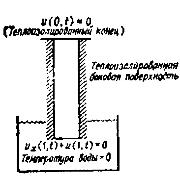

Рис. 7.1. Схематичне представлення зсувної задачі.

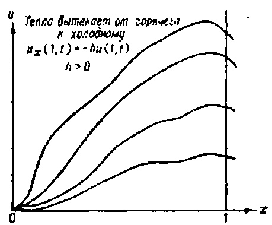

Рис. 7.2. Природа шахраїв, як бути задоволеними

$$

(\text{ГУ})\quad
\begin{cases}
u(0,t)=0,\\
u_x(1,t)=-h\,u(1,t).
\end{cases}

$$

відповідає певній еталонній температурі). Теплообмін між стрижнем і водою відбувається згідно із законом Ньютона, який записується у x=1 як наступна гранична умова:

$$

u_x(1, t) = -hu(1, t).

$$

Тепер припустимо, що початкова температура стрижня дорівнює u(x, 0) = x, але одразу при t > 0 включаємо граничні умови. Щоб визначити температуру в стрижні, необхідно розв'язати проблему зміщення

$$

\begin{aligned}
(\text{УЧП})\quad & u_t = \alpha^2 u_{xx}, && 0 < x < 1,\ 0 < t < \infty, \\
(7.1)\ (\text{ГУ})\quad & u(0,t) = 0,\quad u_x(1,t) + h u(1,t) = 0, && 0 < t < \infty, \\
(\text{НУ})\quad & u(x,0) = x, && 0 \leq x \leq 1.
\end{aligned}

$$

Щоб використати метод розділення змінних, розбиємо процес розв'язання на кілька етапів.

**КРОК** 1. (Перетворення диференціального рівняння в похідних у два звичайних диференціальних рівняння)

Підставляючи $u(x,t)=X(x)T(t)$ у рівняння (7.1), отримуємо

$$

XT'=\alpha^2X''T.

$$

Поділивши обидві частини на $\alpha^2XT$, маємо

$$

\frac{T'}{\alpha^2 T} = \frac{X''}{X} .

$$

Оскільки ліва частина останнього рівняння залежить лише від часу, а права — лише від x (і оскільки x і t незалежні), обидві сторони рівняння мають бути константами. Прирівнюючи обидві частини до однієї сталої $\mu$ , отримуємо

(7.2)

$$

T' - \mu \alpha^{2} T = 0, X'' - \mu X = 0.

$$

Процес розщеплення змінних завершено.

КРОК 2. (Визначення константи відокремлення)

По-перше, константа і не повинна бути додатною, інакше функція $T\left( t\right)$ буде зростати експоненційно, що призведе до нескінченного підвищення температури u=XT. Очевидно, що таке рішення не має фізичного значення.

По-друге, припустимо, що $\mu = 0$ . Тоді

$$

X'' = 0

$$

і, отже.

$$

X(x) = A + \hat{B}x.

$$

Однак, оскільки граничні умови вимагають, що

$$

u(0, t) = X(0) T(t) = 0, \qquad u(1,t)=\bigl(X'(1)+hX(1)\bigr)T(t)=0.

$$

Ми одразу дійшли висновку, що

$$

X(0)=0\Rightarrow A=0,\qquad X'(1)+hX(1)=0\Rightarrow B=0.

$$

Це означає, що $u(x, t) \equiv 0$ . Іншими словами, лише нульове розв'язання відповідає нульовій константі розділення. Ми відкинемо його, оскільки нас цікавлять ненульові розв'язки.

Якщо, нарешті, $\mu < 0$ , можна поставити $\mu = -\lambda^2$ і переписати рівняння (7.2) у вигляді

$$

T' + \lambda^2 \alpha^2 T = 0, \qquad X'' + \lambda^2 X = 0.

$$

<sup>1)</sup> Розв'язок X(x) відповідної задачі з граничним значенням буде лише тривіальним, X(x) = 0. 
Загальні розв'язки цих рівнянь легко знайти:

$$

T(t) = Ae^{-(\lambda \alpha)^2 t},
\qquad X(x) = B\sin(\lambda x) + C\cos(\lambda x).

$$

Отже, будь-яка функція провідника

(7.3)

$$

u(x, t) = e^{-(\lambda \alpha)^2 t} [A \sin(\lambda x) + B \cos(\lambda x)]

$$

при будь-яких значеннях $\lambda$ A і B задовольняє рівняння (читач може перевірити це самостійно простою заміною).

Тепер нам потрібно з'ясувати, які з цих функцій задовольняють граничним умовам

(7.4)

$$

u(0, t) = 0, u_x(1, t) + hu(1, t) = 0.

$$

Підстановка розв'язків виду (7.3) у граничні умови (7.4) дозволяє знайти відношення, яким мають задовольняти значення $\lambda$ , $\Lambda$ та B:

$$

Be^{-(\lambda\alpha)^2 t} = 0 \Rightarrow B = 0,

$$

$A\lambda e^{-(\lambda\alpha)^2 t} \cos \lambda + hAe^{-(\lambda\alpha)^2 t} \sin \lambda = 0.$ Після простих алгебранхічних перетворень останнє рівняння зводиться до вигляду

$$

\tan \lambda = -\lambda/h

$$
Іншими словами, щоб визначити $\lambda$ , потрібно знайти точки перетину графів функцій tg $\lambda$ і — $\lambda/h$ (рисунок 7.3).

Числові значення значень $\lambda_1$ , $\lambda_2$ , ... можна знайти за допомогою комп'ютера, якщо задано значення h Р и с Р и с

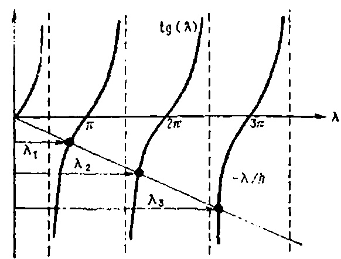

. 7.3. Перетин графів функцій $tg(\lambda)$ і $-\lambda/h$ .

викликати власні значення задачі граничного значення

(7.5)

$$

X''+\lambda^{2}X=0,\qquad
\begin{cases}
X(0)=0,\\
X'(1)+hX(1)=0.
\end{cases}

$$

Іншими словами, з цими значеннями параметра $\lambda$ існують нетривіальні розв'язки задачі (7.5). Власні значення задачі (7.5) визначаються як корені рівняння

$$

\tan\lambda = -\frac{\lambda}{h}.

$$

Їхні числові значення знаходилися на комп'ютері для випадку $h=1$. Таблиця 7.1 показує результати розрахунків перших кількох власних значень.

| n | $\lambda_B$ | rt . | $\lambda_n$ |
|-------------|----------------------|--------|----------------|
| 1<br>2<br>3 | 2,02<br>4,91<br>7,98 | 4<br>5 | 11,08<br>14,20 |

Розв'язки задачі (7.5), що відповідають власним значенням $\lambda_n$ , називаються власними функціями $X_n(x)$ . Для розглянутого завдання власні функції виглядають так:

$$

X_n(x) = \sin(\lambda_n x)

$$

 зображені на рис. 7.4.

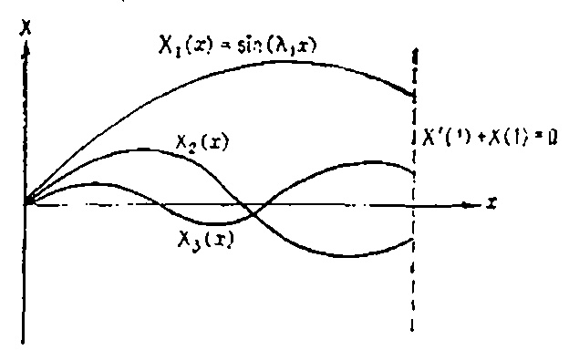

Рис. 7.4. Власні функції $X_n(x)$ завдання (7.5) при h=1; Усі власні функції задовольняють граничні умови.

КРОК 3  (Пошук фундаментальних рішень)

Тепер у нас є нескінченний набір функцій (фундаментальних розв'язків) у нашому розпорядженні

$$

u_n(x, t) = X_n(x) T_n(t) = e^{-(\lambda_n\alpha)^2 t} \sin(\lambda_n x),

$$

кожна з яких задовольняє рівняння та граничні умови. Залишився ще один крок — загалом

$$

u(x, t) = \sum_{n=1}^{\infty} a_n X_n(x) T_n(t)
= \sum_{n=1}^{\infty} a_n e^{-(\lambda_n \alpha)^2 t}\sin(\lambda_n x)

$$

Вибрати коефіцієнти $a_n$ так, щоб функція u(x, t) задовольняла початкову умову u(x, 0) = x (у цьому випадку функція u(x, t) задовольнятиме рівняння та граничні умови, оскільки, по-перше, кожен член суми їх задовольняє, а по-друге, і рівняння, і граничні умови є лінійними та однорідними).

Отже, ймовірність $a_n$ слід визначати з цієї умови

(7 6)

$$

u(x, 0) = x = \sum_{n=1}^{\infty} a_n \sin(\lambda_n x).

$$

Ми маємо зробити останній крок.

КРОК 4. (Розклад початкової умови на ряд за власними функціями)

Щоб знайти коефіцієнти $a_n$ у розкладі (7,6) на власні функції, помножте обидві частини цього співвідношення на $\sin(\lambda_m x)$ і інтегруйте від 0 до 1. У результаті ми отримуємо

$$

\int_{0}^{1} x \sin(\lambda_m x)\,dx = \sum_{n=1}^{\infty} a_{n} \int_{0}^{1} \sin(\lambda_{n} \xi) \sin(\lambda_{m} \xi) d\xi
= a_{m} \int_{0}^{1} \sin^{2}(\lambda_{m} \xi) d\xi
= a_{m} \left( \frac{\lambda_{m} - \sin \lambda_{m} \cos \lambda_{m}}{2\lambda_{m}} \right).

$$

Розв'язавши останнє відношення відносно $a_m$ і замінивши m на n, отримуємо бажаний результат:

(7.7)

$$

a_n = \frac{2\lambda_n}{(\lambda_n - \sin \lambda_n \cos \lambda_n)} \int_0^1 x \sin(\lambda_n x)\,dx.

$$

Таблиця 7.2.
# Шанси $a_n$ у формулі (7.8)

| n | an | n | $a_n$ |
|-------------|-----------------------|---------------|----------------|
| 1<br>2<br>3 | 0,24<br>0,22-0,03 <br>| <b>4</b><br>5 | -0.11-0.09 <br>|

Отже, розв'язок задачі (7.1) записується у вигляді

(7.8)

$$

u(x, t) = \sum_{n=1}^{\infty} a_n e^{-(\lambda_n \alpha)^2 t} \sin(\lambda_n x),

$$

де коефіцієнти $a_n$ задаються формулами (7.7). Перші п'ять коефіцієнтів $a_n$ нашої задачі були знайдені чисельно. Їхні значення наведені в Таблиці 1. 7.2.

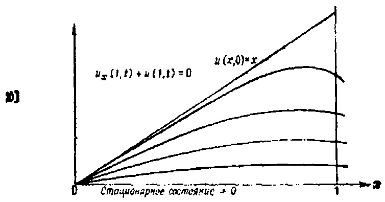

Рис. 7.5. Графічне представлення функції (7.8); межа умовно задовольняється у всі моменти часу.

Відповідно, перші три члени розв'язання змішаної задачі

(7.9)

$$

\begin{aligned}
(\text{УЧП})\quad & u_t=u_{xx}, && 0<x<1,\ 0<t<\infty,\\
(\text{ГУ})\quad & u(0,t)=0,\quad u_x(1,t)+h\,u(1,t)=0, && 0<t<\infty,\\
(\text{НУ})\quad & u(x,0)=x, && 0\le x\le1.
\end{aligned}

$$

мають вигляд

$$

u(x, t) = = 0.24e^{-4t} \sin(2.02x) + 0.22e^{-24t} \sin(4.9x) - 0.03e^{-48.3t} \sin(7.98x) + \dots

$$
 На рисунку 7-5 показані графіки цього розв'язку для кількох точок часу. Рекомендуємо читачеві відповісти на такі питання: Чи відповідає тип рішення, яке ви отримуєте, з вашими інтуїтивними ідеями? Чи виконуються граничні умови?

# ЗАУВАЖЕННЯ

Задача власних значень (7.5) є особливим випадком більш загальної задачі, яку зазвичай називають проблемою Штурма-Ліувіля:

(7.10)

$$

\begin{aligned}
(\text{ОДУ})\quad & [p(x)y']' - q(x)y + \lambda r(x)y = 0,\qquad 0<x<1,\\
(\text{ГУ})\quad & \alpha_1 y(0) + \beta_1 y'(0)=0,\\
& \alpha_2 y(1) + \beta_2 y'(1)=0.
\end{aligned}

$$

Якщо розв'язати задачу з однорідними граничними умовами методом розділення змінних, то функції X(x) завжди знаходяться як розв'язки деякої задачі Штурма–Ліувіля. Очевидно, що задача власних значень (7.5) є особливим випадком задачі (7.10).

Перелічимо основні властивості задачі (7.10), які були встановлені Штурмом і Ліувілем за певних природних обмежень.

функції p(x), q(x) та r(x).

1. Існує нескінченна послідовність власних значень, що задовольняють нерівності.

$$

\lambda_1 < \lambda_2 < \lambda_3 < \ldots < \lambda_n < \ldots \to \infty

$$
2. Кожне власне значення $\lambda_n$ відповідає одній (точній до константного множника) ненульовій власній функції $y_n(x)$ .
3. Якщо $y_n(x)$ і $y_m(x)$ дві різні власні функції, що відповідають різним власним значенням $\lambda_n$ і $\lambda_m$ , то вони є ортогональними з вагою r(x) на сегменті [0, 1], тобто вони задовольняють це відношення

$$

\int_{0}^{1} r(x) y_{n}(x) y_{m}(x) dx = 0.

$$

Більше деталей про проблему Штурма-Ліувіля можна знайти в літературі, наведеній наприкінці книги.
<sup>1)</sup> Див., наприклад, Тіхоног А. Н., Самарський А. А. Рівняння математичної фізики. — Москва: Наука, 1972. — ред. Ед.

# ЗАВДАННЯ
1. Розв'язати наступну задачу для рівняння теплопровідності методом розкладу
(PЧП)

$$

u_1 = u_{xx}, \quad 0 < x < 1, \quad 0 < t < \infty,

$$

(ГУ)

$$

\begin{cases} u(0, t) = 0, \\ u_x(1, t) = 0, \\ u(x, 0) = x, \quad 0 \le x \le 1. \end{cases}

$$

Чи відповідає рішення, яке ви знаходите, з інтонативними представленнями? Що таке стаціонарне рішення?
2. Знайдіть власні цінності та функції проблеми Ассолта-Ліувіля
(ОДУ)

$$

X' + \lambda X = 0, \quad 0 < x < 1,

$$

(ГУ) $\begin{cases} X(0) = 0, \\ X'(1) = 0. \end{cases}$ Задайте специфічні вирази для функцій p(x), q(x) та r(x) із загальної задачі Штурма–Ліувіля для цього випадку.
3. Розв'язати задачу теплопровідності для планки з термоізольованими межами
(РЧП)

$$

u_t = u_{xx}, \quad 0 < x < 1, \quad 0 < t < \infty,

$$

(ГУ)

$$

\begin{cases} u_x (0, t) = 0, \\ u_x (1, t) = 0, \end{cases} \quad 0 < t < \infty,

$$

(ГУ) $u(x, 0) = x, \quad 0 \le x \le.$ 
1.Чи відповідає рішення, яке ви отримуєте, з вашою інтерпретацією цієї проблеми? Що таке стаціонарне рішення? Яке його фізичне значення?
4. Знайдіть власні цінності та функції завдань
(ОДА)

$$

X'' + \lambda X = 0, \quad 0 < x < 1,

$$

(ГУ) $\begin{cases} X'(0) = 0, \\ X'(1) = 0. \end{cases}$

# Лекція 8. ПЕРЕТВОРЕННЯ СКЛАДНИХ РІВНЯНЬ У ПРОСТІШУ ФОРМУ МЕТА ЛЕКЦІЇ: Показати, як рівняння теплопровідності з додатковими членами можна звести до стандартного рівняння для нової функції $w(x,t)$.

У цій лекції ми розглядаємо два типові приклади:

$$

u_t = \alpha^2 u_{xx} - \beta u,

$$ та $$

u_t = \alpha^2 u_{xx} - v u_x, \qquad v=\text{const}.

$$

Обидва рівняння можна перетворити до найпростішого рівняння теплопровідності

$$

w_t = \alpha^2 w_{xx}

$$

за допомогою відповідних замін:

$$

\begin{aligned}
u(x,t)&=e^{-\beta t}w(x,t),\\
u(x,t)&=\exp\!\left[\frac{v}{2\alpha^2}\!\left(x-\frac{vt}{2}\right)\right]w(x,t).
\end{aligned}

$$

Розв'язавши просте рівняння для $w(x,t)$, ми повертаємося до початкової функції $u(x,t)$ за цими формулами. Те саме перетворення, звісно, треба послідовно застосовувати і до початкових, і до граничних умов.

Після прочитання двох останніх лекцій читач може створити враження, що метод розділення змінних застосовується *лише* до рівняння

$$

u_t = \alpha^2 u_{xx}.

$$

Насправді рівняння теплопотоку є найпростішим, але не єдиним параболічним рівнянням, яке можна розв'язати методом розділення змінних. Як уже згадувалося, якщо рівняння є лінійним і однорідним, його можна розв'язати, поділивши змінні. Наприклад, двовимірна задача теплопровідності в колі описується рівнянням

$$

u_t = \alpha^2 \left[ u_{rr} + \frac{1}{r} u_r + \frac{1}{r^2} u_{\theta\theta} \right],

$$

І хоча це рівняння з *змінними коефіцієнтами*, його можна звести до трьох звичайних диференціальних рівнянь.
У цій лекції ми покажемо читачеві, що іноді, замість того, щоб безпосередньо розв'язувати диференціальне рівняння в похідних, краще перетворити його на простіше рівняння, яке можна розв'язати методом розділення змінних або іншим методом. Наступний приклад ілюструє цей підхід.

# Перетворення проблеми з перенесенням бічної поверхні у проблему з термічно ізольованою бічною поверхнею Розглянемо наступне завдання:
(8.1)

$$

\begin{aligned}
u_{t} &= \alpha^{2}u_{xx} - \beta u, \quad 0 < x < 1, \quad 0 < t < \infty,\\
u(0, t) &= 0, \quad u(1, t) = 0, \quad 0 < t < \infty,\\
u(x, 0) &= \varphi(x), \quad 0 \le x \le 1.
\end{aligned}

$$

де термін $-\beta u$ описує потік тепла через бічну поверхню стрижня (рис. 8.1).

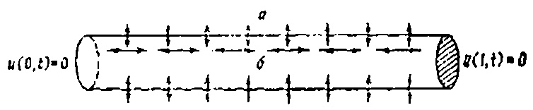

Рис. 8.1. Задача теплопровідності, описана рівнянням $u_t=\alpha^2u_{xx}-\beta u$; член $-\beta u$ відповідає втратам тепла через бічну поверхню стрижня.
Наша мета — ввести нову температурну $w\left(x,\ t\right)$ замість $u\left(x,\ t\right)$ , щоб рівняння для $w\left(x,\ t\right)$ стало простішим за початкове рівняння

$$

u_t = \alpha^2 u_{xx} - \beta u.

$$

Це досить загальний метод розв'язання диференціальних рівнянь у частинних похідних, але вибір відповідного перетворення базується на інтуїтивних уявленнях про поведінку розв'язків початкового рівняння. Наприклад, у задачі (8.1) температура u(x, t) у кожній точці $x_0$ змінюється внаслідок двох факторів:

- 1) дифузія тепла вздовж стрижня (через компонентний $\alpha^2 u_{xx}$ ),
- 2) теплопередача через бічну поверхню стрижня (через член $-\beta u$).

Найважливішим елементом нашого міркування є наступне: якщо не було дифузії вздовж стрижня ( $\alpha = 0$ ),

тоді температура в кожній точці стрижня експоненційно знижується до нуля згідно із законом

$$

u(x_0,t)=u(x_0,0)e^{-\beta t}.

$$
Виходячи з цього спостереження, запитаємо, чи можна розв'язок проблеми (8.1) представити як утворення двох факторів

$$

(8.2)\quad u(x,t)=e^{-\beta t}w(x,t).

$$

де $w(x,t)$ описує розподіл температури, що виникає лише через дифузію. Після підстановки цього виразу у задачу (8.1) отримуємо перетворену задачу без члена $-\beta u$.
(8.4)

$$

\begin{aligned}
w(x,t)&=\sum_{n=1}^{\infty} a_n e^{-(n\pi\alpha)^2 t}\sin(n\pi x),\\
a_n&=2\int_0^1 \varphi(\xi)\sin(n\pi \xi)\,d\xi.
\end{aligned}

$$

і, отже, розв'язок початкової задачі (8.1) має вигляд

$$

u(x, t) = e^{-\beta t}w(x, t).

$$

Нижче, у розділі «Нотатки», наведено ще один приклад проблеми, розв'язаної цим методом.

# ПРИМІТКИ
1. Вирішити проблему

$$
\begin{aligned}
u_t &= u_{xx} - u, && 0 < x < 1,\ 0 < t < \infty, \\
u(0,t) &= 0,\quad u(1,t) = 0, && 0 < t < \infty, \\
u(x,0) &= \sin(\pi x) + 0.5\sin(3\pi x), && 0 \leqslant x \leqslant 1.
\end{aligned}
$$

За методом, описаним вище, ми - a) тимчасово відкинути конвективний член u у початковому рівнянні.
- b) записати розв'язок змішаної задачі без конвективного члена

$$

u(x, t) = e^{-\pi^2 t} \sin(\pi x) + 0.5e^{-(3\pi)^2 t} \sin(3\pi x),

$$

c) помножимо це розв'язання на конвективний фактор $e^{-\beta t}=e^{-t}$ отримаємо остаточне розв'язання початкової задачі

$$

u(x, t) = e^{-t} \left[ e^{-\pi^2 t} \sin(\pi x) + 0.5e^{-(3\pi)^2 t} \sin(3\pi x) \right].

$$

2. Рівняння конвективної дифузії

$$

u_t = \alpha^2 u_{xx} - v u_x

$$

(коефіцієнт і є константою) також можна перетворити у вигляд

$$

w_t = \alpha^2 w_{xx}.

$$

Відповідне перетворення має вигляд

$$

u(x, t) = e^{v(x-vt/2)/2\alpha^2}w(x, t).

$$

Це перетворення підкреслює експоненціальний фактор, який повністю зумовлений рухом середовища. Зверніть увагу, що цей множник описує хвилю, що поширюється зліва направо зі швидкістю $\upsilon/2$ . Читач матиме можливість скористатися цією трансформацією.

# ЗАВДАННЯ
1. Розв'язати задачу конвективної дифузії

$$

\begin{aligned}
(\text{РЧП})\quad & u_t = u_{xx} - u_x, && 0 < x < 1,\ 0 < t < \infty, \\
(\text{ГУ})\quad & u(0,t) = 0,\quad u(1,t) = 0, && 0 < t < \infty, \\
(\text{ПУ})\quad & u(x,0) = e^{x/2}, && 0 \leqslant x \leqslant 1.
\end{aligned}

$$

методом перетворення до простішого рівняння. На що схожий розв'язок? Можна дати таку інтерпретацію цієї задачі: $u(x,t)$ — концентрація деякої речовини в рухомому середовищі, яке рухається зліва направо зі швидкістю $v = 1$; початковий розподіл концентрації задається функцією $e^{x/2}$, а на межах концентрація підтримується нульовою. Чи відповідає ваш розв'язок такій інтерпретації?
2. Розв'язати задачу

$$

\begin{aligned}
(\text{РЧП})\quad & u_t = u_{xx} - u + x, && 0 < x < 1,\ 0 < t < \infty, \\
(\text{ГУ})\quad & u(0,t) = 0,\quad u(1,t) = 1, && 0 < t < \infty, \\
(\text{ГУ})\quad & u(x,0) = 0, && 0 \leqslant x \leqslant 1.
\end{aligned}

$$

- а) перетворивши неоднорідні граничні умови на однорідні;
- б) перетворивши вихідне рівняння на нове рівняння без члена $-u$;
- в) розв'язавши задачу, що виникає після цих перетворень.
3. Розв'язати задачу

$$

\begin{aligned}
(\text{РЧП})\quad & u_t = u_{xx} - u, && 0 < x < 1,\ 0 < t < \infty, \\
(\text{ГУ})\quad & u(0,t) = 0,\quad u(1,t) = 0, && 0 < t < \infty, \\
(\text{ПУ})\quad & u(x,0) = \sin(\pi x), && 0 \leqslant x \leqslant 1.
\end{aligned}

$$

застосовуючи метод розділення змінних безпосередньо до вихідного рівняння, не виконуючи жодних попередніх перетворень. Чи збігається отриманий розв'язок з розв'язком, знайденим раніше після заміни?

$$

u(x,t) = e^{-t}w(x,t)

$$

# Лекція 9. РОЗВ'ЯЗАННЯ НЕОДНОРІДНИХ УЧП МЕТОДОМ РОЗКЛАДУ ЗА ВЛАСНИМИ ФУНКЦІЯМИ ЦІЛЬ ЛЕКЦІЇ: Навчитися розв'язувати змішані задачі вигляду

$$

\begin{aligned}
(\text{РЧП})\quad & u_t = \alpha^2 u_{xx} + f(x,t), && 0 < x < 1,\ 0 < t < \infty, \\
(\text{ГУ})\quad & \alpha_1 u_x(0,t) + \beta_1 u(0,t) = 0, && 0 < t < \infty, \\
& \alpha_2 u_x(1,t) + \beta_2 u(1,t) = 0, && 0 < t < \infty, \\
(\text{ПУ})\quad & u(x,0) = \varphi(x), && 0 \leqslant x \leqslant 1.
\end{aligned}

$$

Розв'язок неоднорідного УЧП можна шукати у вигляді ряду

$$

u(x,t) = \sum_{n=1}^{\infty} T_n(t) X_n(x).

$$

де $X_n(x)$ — власні функції відповідної однорідної задачі

$$

\begin{aligned}
(\text{УЧП})\quad & u_t = \alpha^2 u_{xx}, && 0 < x < 1,\ 0 < t < \infty, \\
(\text{ГУ})\quad & \alpha_1 u_x(0,t) + \beta_1 u(0,t) = 0, && 0 < t < \infty, \\
& \alpha_2 u_x(1,t) + \beta_2 u(1,t) = 0, && 0 < t < \infty, \\
(\text{НУ})\quad & u(x,0) = \varphi(x), && 0 \leqslant x \leqslant 1.
\end{aligned}

$$

А функції $T_n(t)$ визначаються як розв'язки деяких звичайних диференціальних рівнянь.
На лекції 6 ми ознайомилися з тим, як перетворювати неоднорідні граничні умови на однорідні. На жаль, рівняння залишається гетерогенним, і ми стоїмо перед завданням

$$

\begin{aligned}
u_{t} &= \alpha^{2} u_{xx} + f(x, t), \quad 0 < x < 1, \quad 0 < t < \infty,\\
\alpha_{1} u_{x}(0, t) + \beta_{1} u(0, t) &= 0, \\
\alpha_{2} u_{x}(1, t) + \beta_{2} u(1, t) &= 0, \\
u(x, 0) &= \varphi(x), \quad 0 \le x \le 1.
\end{aligned}

$$

Мета нашої лекції — опанувати метод розв'язання таких задач. Цей метод аналогічний методу варіації довільних констант.
теорія звичайних диференціальних рівнянь називається методом розкладу за власними функціями.
Ідея методу надзвичайно проста. Відомо, що розв'язок задачі (9.1) при f(x, t) = 0 (так звана відповідна однорідна задача) записується як ряд

$$

u\left(x,\ t\right)=\sum_{n=1}^{\infty}a_{n}e^{-\left(\lambda_{n}\alpha\right)^{2}}/X_{n}\left(x\right),

$$

де $X_n(x)$ — власні функції задачі Штурма-Ліувіля,
(9.2)

$$

X'' + \lambda^2 X = 0, \\ \alpha_1 X'(0) + \beta_1 X(0) = 0, \\ \alpha_2 X'(1) + \beta_2 X(1) = 0.

$$

Запитаймо себе, чи можна також шукати розв'язок гетерогенної проблеми (9.1) у вигляді серії власних функцій, але більш загальної форми

$$

u(x, t) = \sum_{n=1}^{\infty} T_n(t) X_n(x).

$$

Існують певні фізичні підстави для такого припущення. Насправді терміни f(x,t) описують джерело тепла, розташоване всередині стрижня. Це означає, що залежність рішення від часу не буде виражена показниками.

$$

e^{-(\lambda_n\alpha)^2 t}

$$

Це стосувалося однорідного завдання, але з деякими іншими функціями.

Щоб показати цей метод у дії і не ускладнювати подання деталями, ми застосуємо його до розв'язання однієї дуже простої задачі.

# Построзв'язання методом демаркації за власними функціями,

Розглянемо гетерогенну проблему

(9.3) (ГУ)

$$

\begin{aligned} u_t &= \alpha^2 u_{xx} + f(x, t), & 0 < x < 1, & 0 < t < \infty, \\ u(0, t) &= 0, & 0 < t < \infty, \\ u(1, t) &= 0, & 0 < t < \infty, \\ u(x, 0) &= \varphi(x), & 0 \leqslant x \leqslant 1. \end{aligned}

$$

Процес розв'язання задачі подається у вигляді послідовності наступних кроків.
КРОК 1. Основна ідея методу полягає в розкладанні густини джерела f(x, t) на ряд власними функціями

$$

f(x, t) = f_1(t) X_1(x) + f_2(t) X_2(x) + \dots + f_n(t) X_n(x) + \dots

$$

а також визначити реакції системи $u_n\left(x,\,t\right)$ на вплив кожного компонента $f_n\left(t\right)X_n\left(x\right)$ . Якщо знайти всі відповіді, рішення проблеми виглядатиме так:

$$

u(x, t) = \sum_{n=1}^{\infty} u_n(x, t).

$$

Головна складність цього методу — розклад густини джерела на компоненти $f_n(t)\,X_n(x)$ . Виявляється, що $X_n(x)$ факторами в цій задачі є власними векторами системи Штурма–Ліувіля, які виникають при розв'язанні відповідної однорідної задачі методом розділення змінних, а саме

$$

\begin{array}{c} u_t = \alpha^2 u_{xx} \quad \text{(помітим, що } f(x, \ t) = 0), \\ u(0, \ t) = 0, \\ u(1, \ t) = 0, \\ u(x, \ 0) = \varphi(x). \end{array}

$$

Завдання Штурма-Ліувіля в цьому випадку виглядає так:

$$

X'' + \lambda^2 X = 0,

$$

$X(0) = 0,$ $X(1) = 0,$ а його розв'язки є функціями

$$

X_n(x) = \sin(n\pi x), \quad n = 1, 2, 3 \dots

$$

Отже, розклад на густину джерела представлений як ряд

$$

(9.5) \ f(x,t) = f_1(t) \sin(\pi x) + f_2(t) \sin(2\pi x) + \dots + f_n(t) \sin(n\pi x) + \dots

$$

$\mathcal{U}$ нарешті, щоб знайти функції $f_n(t)$ , помножте обидві сторони останнього відношення на $\sin(m\pi x)$ і інтегруйте від 0 до 1 за координатою x.

У результаті ми отримуємо

$$

\int_{0}^{1} f(x, t) \sin(m\pi x)\,dx = \sum_{n=1}^{\infty} f_{n}(t) \int_{0}^{1} \sin(m\pi x) \sin(n\pi x)\,dx = \frac{1}{2} f_{m}(t)

$$

або (після заміни t на p)

(9.6)

$$

f_{n}(t) = 2 \int_{0}^{1} f(x, t) \sin(n\pi x)\,dx.

$$

Останнє співвідношення встановлює співвідношення між коефіцієнтами $f_n(t)$ і часткою джерела тепла f(x, t).

КРОК 2. (Пошук $u_n(x, t) = X_n(x) T_n(t)$ реакції на вхідний вплив $f_n(t) X_n(x)$ .)

Замінимо густину джерела на його розклад у рядок

$$

f(x, t) = \sum_{n=1}^{\infty} f_n(t) \sin(n\pi x)

$$

і намагатися знайти індивідуальні відповіді, тобто функції, $T_{\mathbf{n}}(t)$ у

$$

u(x, t) = \sum_{n=1}^{\infty} T_n(t) \sin(n\pi x).

$$

Оскільки розв'язок задачі має вигляд

$$

u(x, t) = \sum_{n=1}^{\infty} T_n(t) \sin(n\pi x),

$$

потім підставимо цей вираз у початкову задачу

$$

u_{t} = \alpha^{2} u_{xx} + \sum_{n=1}^{\infty} f_{n}(t) \sin(n\pi x),
\quad u(0, t) = 0, \quad u(1, t) = 0, \quad u(x, 0) = \varphi(x),

$$

У результаті ми отримаємо

$$

\sum_{n=1}^{\infty} T'_n(t) \sin(n\pi x) = -\alpha^2 \sum_{n=1}^{\infty} (n\pi)^2 T_n(t) \sin(n\pi x) + + \sum_{n=1}^{\infty} f_n(t) \sin(\pi n\lambda),

$$

(9.7)

$$

\sum_{n=1}^{\infty} T_n(t) \sin 0 = 0

$$

(задовольняється ідентично), $\sum_{n=1}^{\infty} T_n(t) \sin (n\pi) = 0$ (задовольняється ідентично), $\sum_{n=1}^{\infty} T_n(0) \sin (n\pi x) = \phi(x)$ .

Переписування рівняння та початкової умови

(РЧП)

$$

\sum_{n=1}^{\infty} [T'_n + (n\pi\alpha)^2 T_n - f_n(t)] \sin(n\pi x) = 0,

$$

(ПУ)

$$

\sum_{n=1}^{\infty} T_n(0) \sin(n\pi x) = \varphi(x),

$$

можна побачити, що функції $T_n(\ell)$ є розв'язками задачі Коші

(9.8)

$$

\begin{aligned}
T_n' + (n\pi\alpha)^2 T_n &= f_n(t), \\
T_n(0) &= 2 \int_0^1 \varphi(\xi)\sin(n\pi \xi)\,d\xi = a_n.
\end{aligned}

$$

Усі ці TAC легко розв'язати, а їхні рішення записуються у вигляді

(9.9)

$$

T_n(t) = a_n e^{-(n\pi\alpha)^2 t} + \int_0^t e^{-(n\pi\alpha)^2 (t-\tau)} f_n(\tau)\,d\tau.

$$

З того місця, де легко отримати повне розв'язання проблеми (9.3):

(9.10)

$$

\begin{aligned}
u(x, t) &= \sum_{n=1}^{\infty} T_n(t)\sin(n\pi x) \\
&= \sum_{n=1}^{\infty} a_n e^{-(n\pi\alpha)^2 t}\sin(n\pi x) \\
&\quad + \sum_{n=1}^{\infty} \sin(n\pi x)\int_0^t e^{-(n\pi\alpha)^2 (t-\tau)} f_n(\tau)\,d\tau.
\end{aligned}

$$

Перехідна частина (обумовлена стаціонарною частиною (умовлена початковою умовою) правою частиною f(x, t)).

Розв'язок (9.10) показує, що температурна реакція складається з двох частин: перша частина зумовлена початковими умовами, а друга — густиною джерела f(x,t). Зверніть увагу, що термін «стаціонарна частина» не є найкращим описом другої частини температурної реакції, оскільки він не означає, що ця частина не залежить від часу (стаціонарний стан може бути періодичним, якщо f(x, t) є періодичною функцією часу t).

Проблема повністю вирішена. Перш ніж перейти до наступної теми, давайте покажемо, як використовувати описаний вище метод для розв'язання

Конкретне завдання.

# Розв'язання конкретної задачі методом декомпозиції за власними функціями

Розглянемо просту задачу

(9.11)

$$

\begin{aligned}
(\text{УЧП})\quad & u_t = \alpha^2 u_{xx} + \sin(3\pi x), && 0 < x < 1,\quad 0 < t < \infty, \\
(\text{ГУ})\quad & u(0,t)=0,\quad u(1,t)=0, && 0 < t < \infty, \\
(\text{НУ})\quad & u(x,0)=\sin(\pi x), && 0 \le x \le 1.
\end{aligned}

$$

Наша мета — обчислити коефіцієнти $T_n(t)$ при розкладі

$$

u\left(x,\,t\right)=\sum_{n=1}^{\infty}T_n(t)\sin(n\pi x)

$$

(Власні функції цієї задачі $X_n(x)$ збігатися з власними функціями попереднього). Якщо підставити цю декомпозицію на початкову задачу, отримаємо наступну задачу Коші для визначення функцій $T_n(t)$ :

$$

\begin{aligned}
T_n' + (n\pi\alpha)^2 T_n &= f_n(t), \\
f_n(t) &= 2 \int_0^1 \sin(3\pi x)\sin(n\pi x)\,dx
= \begin{cases}
1, & n = 3, \\
0, & n \ne 3,
\end{cases} \\
T_n(0) &= 2 \int_0^1 \sin(\pi \xi)\sin(n\pi \xi)\,d\xi
= \begin{cases}
1, & n = 1, \\
0, & n \ne 1.
\end{cases}
\end{aligned}

$$

Перепишемо ці рівняння послідовно для $n=1,2,\dots$.

$$

\begin{aligned}
(n=1)\quad & T_1' + (\pi\alpha)^2 T_1 = 0, && T_1(0) = 1, && T_1(t) = e^{-(\pi\alpha)^2 t}, \\
(n=2)\quad & T_2' + (2\pi\alpha)^2 T_2 = 0, && T_2(0) = 0, && T_2(t) = 0, \\
(n=3)\quad & T_3' + (3\pi\alpha)^2 T_3 = 4, && T_3(0) = 0, && T_3(t) = \frac{1}{(3\pi\alpha)^2}\left[1 - e^{-(3\pi\alpha)^2 t}\right], \\
(n\geqslant 4)\quad & T_n' + (n\pi\alpha)^2 T_n = 0, && T_n(0) = 0, && T_n(t) = 0.
\end{aligned}

$$

Отже, розв'язок задачі можна записати у вигляді

$$

u(x, t) = e^{-(\pi\alpha)^2 t} \sin(\pi x) + \frac{1}{(3\pi\alpha)^2} [1 - e^{-(3\pi\alpha)^2 t}] \sin(3\pi x).

$$

(9.12)

# ЗАУВАЖЕННЯ

1. Метод розкладу власних функцій є одним із найпотужніших методів розв'язання неоднорідних диференціальних рівнянь у похідних похідних. Пізніше, коли ми ознайомимося з інтегральними перетвореннями, побачимо, що існують й інші методи розв'язання задач такого типу.

2. Власні функції $X_n(x)$ , за допомогою якої виконується розклад, залежать від задачі, яку потрібно розв'язати, точніше від рівнянь і граничних умов. Читача просять розв'язати задачу 4 наприкінці лекції, щоб перевірити, чи дійсно він навчився знаходити власні функції $X_n(x)$ .

3. Якщо читач пам'ятає основні факти з теорії звичайних диференціальних рівнянь, то він знає, що розв'язки, що відповідають неоднорідним членам вигляду

$$

P_n(x) e^{\alpha x} \cdot
\begin{cases} \sin{(\beta x)}, \\ \cos{(\beta x)}, \end{cases}

$$

можна знайти методом невизначених коефіцієнтів. Те саме і тут. Задача (9.11) може бути розв'язана таким самим способом.

# ЗАДАЧІ

# 1. Рішення задачі

$$

\begin{aligned}
(\text{УЧП}) \quad & u_t = u_{xx} + \sin(3\pi x), && 0 < x < 1, \\
(\Gamma \text{У}) \quad & u(0,t) = 0,\quad u(1,t) = 0, && 0 < t < \infty, \\
(\text{НУ}) \quad & u(x,0) = \sin(\pi x), && 0 \leqslant x \leqslant 1.
\end{aligned}

$$

Отже, розв'язок задається формулою (9.12). Чи відповідає це рішення вашим інтуїтивним уявленням? Що саме означає отриманий розв'язок?
2. Вирішіть задачу

$$

\begin{aligned}
(\text{РЧП})\quad & u_t = u_{xx} + \sin(\pi x) + \sin(2\pi x), && 0 < x < 1,\ 0 < t < \infty,\\
(\text{ГУ})\quad & u(0,t)=0,\quad u(1,t)=0, && 0 < t < \infty,\\
(\text{ПУ})\quad & u(x,0)=0, && 0 \le x \le 1.
\end{aligned}

$$

# 3. Розв'яжіть задачу
(PЧП)

$$

u_t = u_{xx} + \sin(\pi x), \quad 0 < x < 1, \quad 0 < t < \infty,

$$

(гУ)

$$

\begin{cases} u(0, t) = 0, \\ u(1, t) = 0, \\ u(x, 0) = 1, \quad 0 < x < 1, \end{cases}

$$

методом розкладу за власними функціями.
4. Найдіть рішення задачі

$$

\begin{aligned}
(\text{УЧП})\quad & u_t = u_{xx} + \sin(\lambda_1 x), && 0 < x < 1,\ 0 < t < \infty, \\
(\text{ГУ})\quad & u(0,t) = 0,\quad u_x(1,t) + u(1,t) = 0, && 0 < t < \infty, \\
(\text{НУ})\quad & u(x,0) = 0, && 0 \leqslant x \leqslant 1.
\end{aligned}

$$

Методом розкладу за власними функціями, якщо $\lambda_1$ — перший корінь рівняння $\operatorname{tg}\lambda = -\lambda$. Які власні функції цієї задачі?

# 5. Розв’яжіть задачу

$$

\begin{aligned}
(\text{РЧП})\quad & u_t = u_{xx}, && 0 < x < 1,\ 0 < t < \infty, \\
(\text{ГУ})\quad & u(0,t) = 0,\quad u(1,t) = \cos t, && 0 < t < \infty, \\
(\text{ПУ})\quad & u(x,0) = \varphi(x), && 0 \leqslant x \leqslant 1.
\end{aligned}

$$

Спочатку перетворивши граничні умови в нуль. Отримана задача розв'язується методом розкладу за власними функціями.

# Лекція 10. ІНТЕГРАЛЬНІ ПЕРЕТВОРЕННЯ (СИНУСНІ ТА КОСИНУСНІ ПЕРЕТВОРЕННЯ)

**МЕТА ЛЕКЦІЇ:** Ввести поняття інтегрального перетворення та показати, як його застосування дозволяє перейти від ЧПР з $n$ змінними до нового рівняння з $n - 1$ змінною.

Лекція демонструє, що інтегральні перетворення можна інтерпретувати як розклад вхідного впливу на елементарні (частотний розклад), визначення реакції системи на елементарні впливи та подальше підсумовування всіх отриманих результатів.

В інтегральних перетвореннях операція диференціювання переходить в операцію множення, і, відповідно, деякі частинні похідні переходять в алгебраїчні вирази.

Для розв’язання задач дифузії на необмежених інтервалах вводять синусні та косинусні перетворення. Розв’язок, отриманий у цьому випадку, цікавий тим, що містить функцію, яка є доповненням до ймовірнісного інтеграла.

Інтегральним перетворенням зазвичай називають перетворення, яке кожній функції $f(t)$ ставить у відповідність нову функцію $F(s)$ згідно з формулою

$$

F(s) = \int_{A}^{B} K(s, t) f(t) dt.

$$

Зверніть увагу, що початкова функція залежить від $t$, а отримана функція — від $s$. Функція $K(s,t)$ називається ядром перетворення. Це головний елемент, який відрізняє одне перетворення від іншого. Зазвичай ядро обирають так, щоб перетворення мало певні задані властивості. Межі інтегрування також залежать від типу перетворення.

Основною ідеєю, що лежить в основі інтегральних перетворень, є можливість позбутися часткових похідних за однією з незалежних змінних. Це означає, що перетворене рівняння матиме на одну змінну менше, ніж початкове. Наприклад, якщо застосувати інтегральне перетворення до рівняння, то

щоб позбутися похідної за часом, отримуємо звичайне диференціальне рівняння з незалежною змінною $x$.

$$

u_{xx} + u_{cy} + u_{zz} = 0

$$

застосувати перетворення Фур'є до змінної x, тоді похідна $u_{xx}$ буде усунена, і в новому рівнянні залишаться лише дві незалежні змінні y та z. Тоді отримуємо звичайне диференціальне рівняння з однією незалежною змінною. Іншими словами, інтегральні перетворення спрощують початкове завдання. Потім розв'язується перетворення задачі, і, застосовуючи обернене перетворення до її розв'язку, отримується розв'язок початкового перетворення. Схема описаного алгоритму показана на рис. 10.1

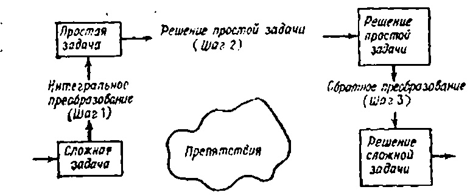

Рис. 10.1. Загальна схема застосування інтегральних перетворень.  

Як видно з рис. 10.1, кожному прямому інтегральному перетворенню відповідає обернене перетворення, яке відновлює початкову функцію з перетвореної.  

Пряме та обернене перетворення зазвичай називають парою перетворень. У таблиці 10.1 наведено кілька пар перетворень, які ми будемо використовувати під час розв’язування рівнянь.  

Слід зазначити, що в цих перетвореннях використовуються два типи позначень. Наприклад, у випадку перетворення Лапласа запис $\mathcal{L}[f]$ означає, що функцію $f$ перетворено, тоді як позначення $F(s)$ вказує, що результатом є функція, яка залежить від $s$.
У цій лекції ми не прагнемо розглянути всі пари перетворень. Ми зосередимося лише на синусному та косинусному перетвореннях Фур’є (пари 1 і 2). Пізніше ми розглянемо також інші пари. Ознайомлюючись із перетвореннями, ми з’ясуємо їхні переваги та недоліки.  

## Таблиця 10.1. Деякі пари інтегральних перетворень

**1. Синусне перетворення Фур’є:**
$$

\mathcal{F}_s[f](\omega) = \frac{2}{\pi}\int_0^\infty f(t)\sin(\omega t)\,dt

$$ \mathcal{F}_s^{-1}[F](t) = \int_0^\infty F(\omega)\sin(\omega t)\,d\omega
$$

**2. Косинусне перетворення Фур’є:**

$$
\mathcal{F}_c[f](\omega) = \frac{2}{\pi}\int_0^\infty f(t)\cos(\omega t)\,dt
$$

\mathcal{F}_c^{-1}[F](t) = \int_0^\infty F(\omega)\cos(\omega t)\,d\omega

$$

**3. Перетворення Фур’є:**
$$

\mathcal{F}[f](\omega) = \frac{1}{\sqrt{2\pi}}\int_{-\infty}^{\infty} f(x)e^{-i\omega x}\,dx

$$ \mathcal{F}^{-1}[F](x) = \frac{1}{\sqrt{2\pi}}\int_{-\infty}^{\infty} F(\omega)e^{i\omega x}\,d\omega
$$

**4. Скінченне синусне перетворення:**

$$
S_n = \frac{2}{L}\int_0^L f(x)\sin\left(\frac{n\pi x}{L}\right)\,dx
$$

f(x) = \sum_{n=1}^{\infty} S_n \sin\left(\frac{n\pi x}{L}\right)

$$

**5. Скінченне косинусне перетворення:**
$$

C_n = \frac{2}{L}\int_0^L f(x)\cos\left(\frac{n\pi x}{L}\right)\,dx

$$ f(x) = \frac{C_0}{2} + \sum_{n=1}^{\infty} C_n \cos\left(\frac{n\pi x}{L}\right)
$$

**6. Перетворення Лапласа:**

$$
\mathcal{L}[f](s) = \int_0^\infty e^{-st}f(t)\,dt
$$

\mathcal{L}^{-1}[F](t) = \frac{1}{2\pi i}\int_{\gamma-i\infty}^{\gamma+i\infty} e^{st}F(s)\,ds

$$

**7. Перетворення Ханкеля:**
$$

H\{f\}(\xi) = F_n(\xi) = \int_0^\infty r J_n(\xi r) f(r)\,dr

$$ H^{-1}[F_n](r) = \int_0^\infty \xi J_n(\xi r) F_n(\xi)\,d\xi
$$

Однак перед тим, як перейти до вивчення інтегральних перетворень, буде корисно зрозуміти, що зазвичай називають спектром функції (або спектральним розкладом функції).

# Спектральна функція Інтегральні перетворення та спектр функції тісно пов'язані. Насправді інтегральне перетворення можна інтерпретувати як розклад функції на певний спектр компонент. Цей спектр залежить від обраного перетворення, але кожна функція має певний спектр відносно цього перетворення Р и с Р Е д

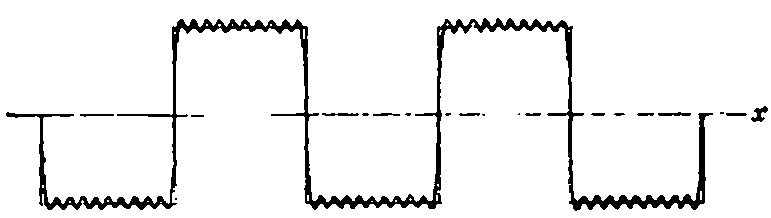

. 10.2 Розпад періодичної функції на серію синусів і косинусів; Послідовність квадратних імпульсій наближається синусами та косинусами Application, розташуванням періодичної функції послідовно після синусів і косинусів (ряд Фур'е):

$$  
f(x) = \sum_{n=0}^{\infty} \left[ A_n \cos(nx) + B_n \sin(nx) \right]  
$$

(див. рис. 10.2).  

Тут коефіцієнти $A_n$ і $B_n$ визначають внесок $\cos(nx)$ та $\sin(nx)$ у функцію $f(x)$ , тоді як величина

$$  
\sqrt{A_n^2 + B_n^2}  
$$

(яку називають спектром функції) показує амплітуду складової функції $f(x)$ , що відповідає частоті $n$ .  

<sup>1)</sup> Ряди Фур’є детальніше розглядаються у лекції 11.  

Наприклад, якщо функція $f(x)$ має вигляд

$$  
f(x) = 1 + \sin x + \frac{1}{5}\sin(3x) + \cos x + \frac{1}{2}\cos(2x) + \frac{1}{4}\cos(4x)  
$$

Спектр (дискретний) такий, як показано на рис. 10.3.
Значення значення графа $\sqrt{A_n^2 + B_n^2}$ можна використати для визначення значення компоненти функції f(x), а також частоти n.

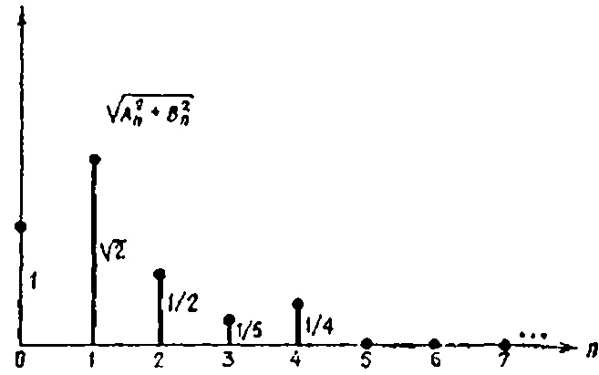

Фіг. 10 3. Дискретний спектр функції f(r).
Періодичні функції організовані у недискретні ряди (дискретний спектр), тобто недискретний спектр. Функція базується лише на екранованому інтерфейсі, який може періодично підтримуватися протягом усього періоду і розподілятися у серії Чотирьох, що представляють функції в межах регіону.

Хоча неперіодичну функцію не можна подати у вигляді нескінченного ряду синусів і косинусів, можна записати неперервний аналог ряду Фур’є:

$$
f(x) = \int_{-\infty}^{+\infty} \left[C(\omega)\cos(\omega x) + S(\omega)\sin(\omega x)\right]\,d\omega
$$

де функції $S(\omega)$ і $C(\omega)$ слугують мірою спектральної густини синуса і косинуса у функції $f(x)$ а величина

$$
\sqrt{S^2(\omega) + C^2(\omega)}
$$

слугує мірою загального внеску частоти $\omega$ у функцію $f(x)$ і називається неперервним спектром функції $f(x)$ . Виходячи з наведеного вище інтуїтивного визначення спектра функції, давайте проаналізуємо інтегральні перетворення «гвинт за гвинтом». Спершу запишемо кілька властивостей цих перетворень, які ми будемо широко використовувати.

## Синусне та косинусне перетворення похідних

Для подальших застосувань нам знадобляться такі властивості:

$$
\mathcal{F}_s[f'] = -\omega \mathcal{F}_c[f],
\qquad
\mathcal{F}_s[f''] = \frac{2}{\pi}\omega f(0) - \omega^2 \mathcal{F}_s[f]
$$

\mathcal{F}_c[f'] = -\frac{2}{\pi}f(0) + \omega \mathcal{F}_s[f],
\qquad
\mathcal{F}_c[f''] = -\frac{2}{\pi}f'(0) - \omega^2 \mathcal{F}_c[f]

$$

Деякі інші властивості прямих і обернених синусних та косинусних перетворень наведено в таблиці наприкінці книги. Тепер покажемо, як синусне перетворення можна використати для розв’язання важливої змішаної задачі.

# Розв’язання задачі дифузії на напівпрямій

Задача, яку ми хочемо розв’язати, формулюється так:

**(Задача Коші):**
$$

\begin{aligned}
(\text{РЧП})\quad & u_t = \alpha^2 u_{xx}, && 0 < x < \infty,\quad 0 < t < \infty, \\
(\text{ГУ})\quad & u(0,t) = A, && 0 < t < \infty, \\
(\text{ПУ})\quad & u(x,0) = 0, && 0 \le x < \infty.
\end{aligned}

$$

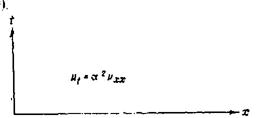

*Рис. 10.4. Задача дифузії в напівнескінченній області: $u(0,t)=A$, $u(x,0)=0$.*  

## КРОК 1  

Застосуємо синусне перетворення Фур’є за змінною $x$ до обох частин рівняння. Тоді отримаємо:  
$$

\mathcal{F}_s[u_t] = \alpha^2 \mathcal{F}_s[u_{xx}]

$$  

Оскільки перетворення виконується за змінною $x$, змінна $t$ розглядається як параметр. Тому:  
$$

\mathcal{F}_s[u_t]  
= \frac{2}{\pi}\int_{0}^{\infty} u_t(x,t)\sin(\omega x)\,dx  
= \frac{d}{dt}\mathcal{F}_s[u]  
= \frac{dU}{dt},

$$  

де $U = U(\omega, t) = \mathcal{F}_s[u]$.  

Для другого доданка, використовуючи властивості синусного перетворення та граничну умову $u(0,t)=A$, маємо:  
$$

\mathcal{F}_s[u_{xx}] = \frac{2}{\pi}\omega u(0,t) - \omega^2 \mathcal{F}_s[u]  
= \frac{2A\omega}{\pi} - \omega^2 U(\omega,t)

$$
Підставляючи ці вирази у рівняння $u_t = \alpha^2 u_{xx}$, отримуємо звичайне диференціальне рівняння:
$$

\frac{dU}{dt} = \alpha^2\left[-\omega^2 U + \frac{2A\omega}{\pi}\right].

$$

Початкова умова для $U$ випливає з умови $u(x,0)=0$:
$$

\mathcal{F}_s[u(x,0)] = U(\omega,0) = 0.

$$

Отже, замість початкової змішаної задачі ми отримали задачу Коші для звичайного диференціального рівняння:

**(10.2)**
$$

\begin{aligned}
\frac{dU}{dt} + \omega^2 \alpha^2 U &= \frac{2A\omega \alpha^2}{\pi}, \\
U(\omega,0) &= 0.
\end{aligned}

$$
КРОК 2. Щоб розв'язати отриману задачу Коші, можна використати будь-який елементарний метод розв'язання звичайних диференціальних рівнянь. У результаті маємо

$$

U(\omega,t)=\frac{2A}{\pi\omega}\left(1-e^{-\omega^2\alpha^2 t}\right).

$$

Отже, перед нами результат застосування синусного перетворення до шуканої функції $u(x,t)$. Останній крок полягає в застосуванні оберненого перетворення:

$$

u(x,t)=\mathcal{F}_s^{-1}[U].

$$

КРОК 3. Скориставшись таблицями перетворень, отримуємо

$$

u(x,t)=A\operatorname{erfc}\!\left(\frac{x}{2\alpha\sqrt{t}}\right),

$$

де $\operatorname{erfc}(x)$ — доповнююча функція помилки:

$$

\operatorname{erfc}(x)=\frac{2}{\sqrt{\pi}}\int_x^\infty e^{-s^2}\,ds.

$$

Графік цієї функції показано на рис. 10.5. Вона не виражається через елементарні функції, але широко табульована в довідниках.

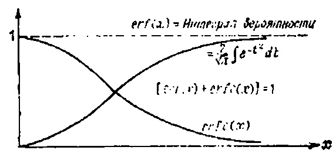

Рис. 10.5. Графіки функцій $\operatorname{erf}(x)$ та $\operatorname{erfc}(x)$.

# Інтерпретація рішення Розв'язок

$$

u(x,t)=A\operatorname{erfc}\!\left(\frac{x}{2\alpha\sqrt{t}}\right)

$$

дає багато їжі для роздумів. На рисунку 10.6 показані графіки ймовірнісної комплементарної функції на різних значеннях часу t.

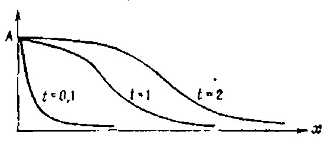

Рис. 10.6. Розподіл температури в напівнескінченному стрижні, на кінці якого підтримується постійна температура.
Вони відрізняються один від одного лише характеристичною шкалою вздовж осі x.

# ЗАВДАННЯ - 1. Довести ідентичності (10.1).
- 2. Розв'яжіть задачу Коші (10.2).
- 3. Використайте синусоїдальне або косинусне перетворення для розв'язання задачі

$$

\begin{aligned}
(\text{УЧП})\quad & u_t = \alpha^2 u_{xx}, && 0 < x < \infty,\ 0 < t < \infty, \\
(\text{ГУ})\quad & u_x(0,t) = 0, && 0 < t < \infty, \\
(\text{НУ})\quad & u(x,0) = H(1-x), && 0 \leqslant x < \infty.
\end{aligned}

$$

де $H(x)$ — функція Хевісайду:

$$

H(x)=
\begin{cases}
0, & x<0,\\
1, & x\ge 0.
\end{cases}

$$

Вхідна до початкової умови функція зображена на рисунку.

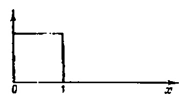

Як виглядатиме графік розв'язку в різні моменти часу?
5. Знайдіть прообраз константи при синусному перетворенні, тобто знайдіть $f(x)$, якщо $F(\omega)=c=\mathrm{const}$.

# Лекція 11. РЯДИ І ПЕРЕТВОРЕННЯ ФУР'Є МЕТА ЛЕКЦІЇ: Ввести поняття ряду Фур'є і показати, як періодичну функцію $f(x)$ можна подати рядом за синусами і косинусами. Якщо ж функція $f(x)$ є неперіодичною і визначена на всій дійсній осі, то ряд Фур'є природно переходить у перетворення Фур'є.
Важлива роль рядів Фур'є в теорії рівнянь з частинними похідними пов'язана з тим, що періодичні функції, а також функції, визначені на скінченному відрізку, можна розкладати в ряди за синусами і косинусами. Це часто дозволяє звести початкову задачу до задач для окремих гармонік.
Наприклад, пилкоподібну функцію
```{=latex}
\[
f(x)=x, \qquad -L < x < L, \qquad f(x+2L)=f(x),
\]
```
можна подати рядом Фур'є
(11.1)
```{=latex}
\[
f(x) = \frac{a_0}{2} + \sum_{n=1}^{\infty} \left[a_n \cos\!\left(\frac{n\pi x}{L}\right) + b_n \sin\!\left(\frac{n\pi x}{L}\right)\right].
\]
```
Коефіцієнти Фур'є $a_n$ і $b_n$ знаходяться за формулами Ейлера. Для цієї функції маємо
```{=latex}
\[
a_n = \frac{1}{L}\int_{-L}^{L} f(x)\cos\!\left(\frac{n\pi x}{L}\right)\,dx = 0, \qquad n=0,1,2,\dots,
\]
```
```{=latex}
\[
b_n = \frac{1}{L}\int_{-L}^{L} f(x)\sin\!\left(\frac{n\pi x}{L}\right)\,dx
= -(-1)^n \frac{2L}{n\pi}, \qquad n=1,2,\dots.
\]
```

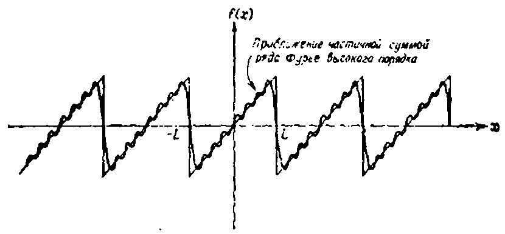

Рис. 11.1. Розклад пилкоподібної функції в ряд Фур'є.
Тому розклад цієї функції набирає вигляду
(11.3)
```{=latex}
\[
f(x) = \frac{2L}{\pi}\left[\sin\!\left(\frac{\pi x}{L}\right) - \frac{1}{2}\sin\!\left(\frac{2\pi x}{L}\right) + \frac{1}{3}\sin\!\left(\frac{3\pi x}{L}\right) - \dots \right].
\]
```
Кожен доданок цього ряду називається гармонікою, а всі гармоніки мають частоти, кратні основній частоті.
У теорії рядів Фур'є важливу роль відіграє теорема Діріхле: якщо обмежена періодична функція на кожному періоді має лише скінченне число максимумів, мінімумів і точок розриву, то її ряд Фур'є збігається до самої функції в точках неперервності і до півсуми односторонніх границь у точках розриву.
Перед переходом до перетворення Фур'є корисно ввести поняття дискретного частотного спектра періодичної функції. Якщо
```{=latex}
\[
c_n = \sqrt{a_n^2 + b_n^2}, \qquad n=0,1,2,\dots,
\]
```
то числа $c_n$ показують внесок відповідних частотних компонент у функцію $f(x)$. Для пилкоподібної функції
```{=latex}
\[
c_n = \frac{2L}{n\pi}, \qquad n=1,2,\dots, \qquad c_0 = 0.
\]
```

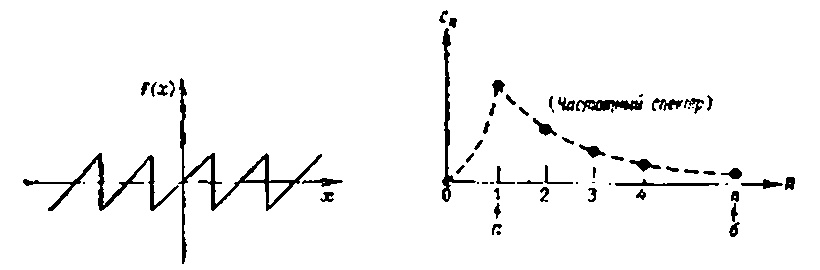

Рис. 11.2. Дискретний частотний спектр пилкоподібної функції: a — основна частота (період $2L$), b — $n$-та гармоніка (період $2L/n$).
Послідовність $\{c_n\}$ нагадує спектральний розклад білого світла на кольори.
Введемо тепер поняття перетворення Фур'є. Для неперіодичних функцій, визначених на всій дійсній осі, роль ряду Фур'є відіграє інтеграл Фур'є
(11.4)
```{=latex}
\[
f(x) = \int_{0}^{\infty} a(\xi)\cos(\xi x)\,d\xi + \int_{0}^{\infty} b(\xi)\sin(\xi x)\,d\xi,
\]
```
де
(11.5)
```{=latex}
\[
a(\xi) = \frac{1}{\pi}\int_{0}^{\infty} f(x)\cos(\xi x)\,dx, \qquad b(\xi) = \frac{1}{\pi}\int_{0}^{\infty} f(x)\sin(\xi x)\,dx.
\]
```
За аналогією з рядом Фур'є визначимо неперервний частотний спектр
```{=latex}
\[
C(\xi) = \sqrt{a^2(\xi) + b^2(\xi)}.
\]
```
Частотний спектр є мірою внеску частоти $\xi$ у функцію $f(x)$.

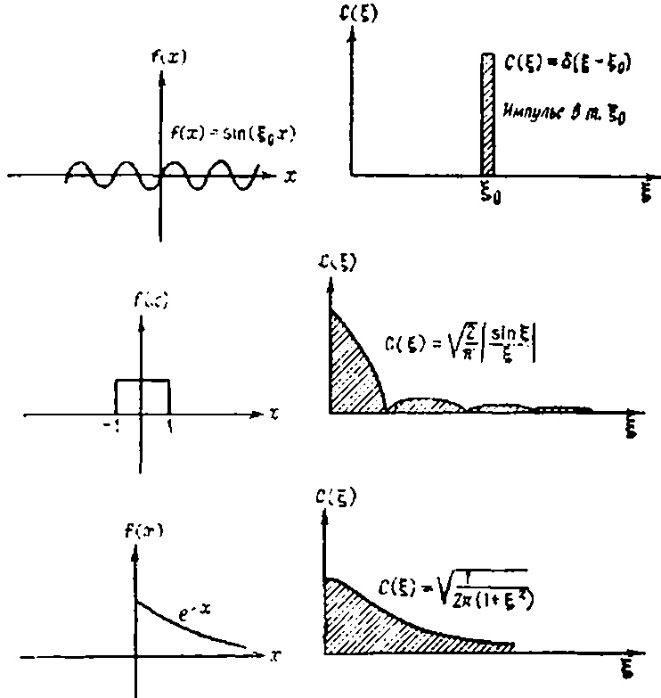

Рис. 11.3. Частотні спектри деяких функцій.
Тепер перейдемо до перетворення Фур'є.

# Преобразование Фурье Як уже зазначалося раніше, неперіодичні функції, задані на $(-\infty,+\infty)$, не розкладаються у звичайні ряди Фур'є. Проте для деяких таких функцій можна побудувати аналог ряду Фур'є у вигляді інтеграла Фур'є, тобто розкладу за неперервним спектром частот:
(11.4)
```{=latex}
\[
f(x) = \int_{0}^{\infty} a(\xi)\cos(\xi x)\,d\xi + \int_{0}^{\infty} b(\xi)\sin(\xi x)\,d\xi,
\]
```
де
(11.5)
```{=latex}
\[
a(\xi) = \frac{1}{\pi}\int_{0}^{\infty} f(x)\cos(\xi x)\,dx, \qquad b(\xi) = \frac{1}{\pi}\int_{0}^{\infty} f(x)\sin(\xi x)\,dx.
\]
```
З формули (11.4) видно, що інтеграл Фур'є розкладає функцію $f(x)$ у спектр за всіма частотами $0<\xi<\infty$, а не лише за частотами, кратними основній, як це було для періодичних функцій. За аналогією з рядами Фур'є визначимо частотний спектр формулою
```{=latex}
\[
C(\xi) = \sqrt{a^2(\xi) + b^2(\xi)}.
\]
```
Частотний спектр є мірою внеску частоти $\xi$ у функцію $f(x)$.
На рис. 11.3 зображено кілька функцій та їхні спектри. Функції з різкими зламами мають широкий частотний спектр, тоді як для простої гармоніки $f(x)=\sin(\xi_0 x)$ спектр зосереджується поблизу однієї частоти $\xi=\xi_0$.
Тепер ми готові перейти до експоненціальної форми перетворення Фур'є. Скориставшись формулою Ейлера
```{=latex}
\[
e^{i\theta} = \cos\theta + i\sin\theta,
\]
```
після нескладних перетворень приходимо до інтегрального представлення Фур'є
(11.6)
```{=latex}
\[
f(x) = \frac{1}{\sqrt{2\pi}} \int_{-\infty}^{+\infty}
\left[\frac{1}{\sqrt{2\pi}} \int_{-\infty}^{+\infty} f(s)e^{-i\xi s}\,ds \right]
e^{i\xi x}\,d\xi.
\]
```
Звідси отримуємо пару інтегральних перетворень
(11.7)
```{=latex}
\[
\mathcal{F}[f] = F(\xi) = \frac{1}{\sqrt{2\pi}} \int_{-\infty}^{+\infty} f(x)e^{-i\xi x}\,dx
\]
```
(пряме перетворення Фур'є) та
```{=latex}
\[
\mathcal{F}^{-1}[F] = f(x) = \frac{1}{\sqrt{2\pi}} \int_{-\infty}^{+\infty} F(\xi)e^{i\xi x}\,d\xi
\]
```
(обернене перетворення Фур'є).
У наступній лекції ми вивчатимемо властивості цих перетворень.

# ЗАУВАЖЕННЯ
1. Образ Фур'є $F(\xi)$ функції $f(x)$ може бути комплекснозначною функцією. Наприклад, для функції
```{=latex}
\[
f(x)=
\begin{cases}
0, & x \le 0,\\
e^{-x}, & x > 0,
\end{cases}
\]
```
образ Фур'є має вигляд
```{=latex}
\[
F(\xi) = \frac{1}{\sqrt{2\pi}} \frac{1-i\xi}{1+\xi^2}.
\]
```
2. Абсолютне значення образу Фур'є називається частотним спектром функції $f(x)$. Наприклад, якщо позначити $C(\xi)=|F(\xi)|$, то маємо
```{=latex}
\[
C(\xi) = \sqrt{\frac{1}{2\pi(1+\xi^2)}}.
\]
```
3. Не всі функції допускають перетворення Фур'є, тобто інтеграл (11.7) може не існувати. Наприклад, функції $f(x)=c$, $\sin x$ і $e^x$ не мають класичного образу Фур'є. У прикладних задачах перетворення Фур'є зазвичай застосовують до температурних, хвильових та інших фізичних полів, які прямують до нуля при $|x|\to\infty$.

# ЗАВДАННЯ
1. Розкласти у ряд Фур'є за синусами функцію
```{=latex}
\[
f(x)=
\begin{cases}
-1, & -1 < x < 0,\\
1, & 0 \le x < 1,
\end{cases}
\qquad f(x+2)=f(x).
\]
```
Побудуйте суми перших 2, 3 і 4 членів ряду, щоб простежити його збіжність до $f(x)$. Побудуйте також графіки частотного спектра цієї функції.
2. Показати, що якщо почленно диференціювати ряд Фур'є (11.3) для пилкоподібної функції, то отримаємо послідовність, яка не збігається до похідної цієї функції.
3. Побудувати частотний спектр таких періодичних функцій:
 - a) $f(x)=\sin x$,
 - б) $f(x)=\sin x+\cos 2x$,
 - в) $f(x)=\sin x+\cos x+0.5\sin 3x$.
4. Знайти образ Фур'є $F(\xi)$ та частотний спектр $C(\xi)=|F(\xi)|$ для функції
```{=latex}
\[
f(x)=
\begin{cases}
1, & -1 < x < 1,\\
0, & \text{в інших точках.}
\end{cases}
\]
```
5. Показати, що абсолютне значення функції $F(\xi)=\dfrac{1}{1+i\xi}$ дорівнює
```{=latex}
\[
\left|F(\xi)\right| = \sqrt{\frac{1}{1+\xi^2}}.
\]
```
ПРИМІТКА. Спочатку помножте чисельник і знаменник на $1-i\xi$, а потім позбудьтеся уявної одиниці $i$ у знаменнику.
6. Перевірити ортогональність функцій $\{\sin(n\pi x/L)\}$ та $\{\cos(n\pi x/L)\}$ на відрізку $[-L,L]$:
```{=latex}
\[
\int_{-L}^{L} \sin\!\left(\frac{m\pi x}{L}\right)\sin\!\left(\frac{n\pi x}{L}\right)\,dx =
\begin{cases}
0, & m \neq n,\\
L, & m = n,
\end{cases}
\]
```
```{=latex}
\[
\int_{-L}^{L} \cos\!\left(\frac{m\pi x}{L}\right)\cos\!\left(\frac{n\pi x}{L}\right)\,dx =
\begin{cases}
0, & m \neq n,\\
L, & m = n,
\end{cases}
\]
```
```{=latex}
\[
\int_{-L}^{L} \sin\!\left(\frac{m\pi x}{L}\right)\cos\!\left(\frac{n\pi x}{L}\right)\,dx = 0
\quad \text{для всіх } m,n=1,2,\dots
\]
```

# Лекція 12. ПЕРЕТВОРЕННЯ ФУР'Є ТА ЙОГО ЗАСТОСУВАННЯ ДО РОЗВ'ЯЗАННЯ ДИФЕРЕНЦІАЛЬНИХ РІВНЯНЬ У ПОХІДНИХ

## МЕТА ЛЕКЦІЇ Проілюструвати основні властивості перетворення Фур'є та показати, як ці властивості застосовуються до розв'язання рівнянь з частинними похідними. Зокрема, ми побачимо, як під дією перетворення Фур'є операція диференціювання замінюється множенням, а диференціальні рівняння переходять в алгебраїчні.

**(12.1)**
$$

\mathcal{F}[f] = F(\xi) = \frac{1}{\sqrt{2\pi}} \int_{-\infty}^{+\infty} f(x)e^{-i\xi x}\,dx.

$$

Отже, якщо функція $f(x)$ визначена на всій дійсній осі, то підставляючи її у формулу (12.1), ми отримуємо нову функцію $F(\xi)$, визначену для $-\infty < \xi < \infty$.

Таблиця 1. 12.1 показує деякі функції та їхні фур'є-образи. Більш розгорнута таблиця наведена в додатку. З наведеної таблиці видно, що образ Фур'є може бути комплекснозначною функцією аргументу $\xi$. У першому прикладі функція $F(\xi)$ містить уявну одиницю $i$, тобто є комплексною функцією. Аргумент $\xi$ — дійсний, але значення функції — комплексні.

Перетворення Фур'є дуже корисне, оскільки воно замінює диференціювання множенням і перетворює диференціальні рівняння на алгебраїчні.

## Таблиця 12.1. Приклади перетворень Фур'є

1. Для непарної функції  
$$

f(x)=
\begin{cases}
e^{-x}, & x\ge 0,\\
-e^{x}, & x<0,
\end{cases}
\qquad F(\xi)=-i\sqrt{\frac{2}{\pi}}\frac{\xi}{1+\xi^2}.

$$

2. Для прямокутного імпульсу  
$$

f(x)=
\begin{cases}
1, & |x|<1,\\
0, & |x|\ge 1,
\end{cases}
\qquad F(\xi)=\sqrt{\frac{2}{\pi}}\frac{\sin\xi}{\xi}.

$$

3. Для гауссової функції  
$$

f(x)=e^{-x^2},
\qquad F(\xi)=\frac{1}{\sqrt{2}}e^{-\xi^2/4}.

$$

# Основні властивості перетворення Фур'є

## Властивість 1 (Пара перетворень Фур'є)

$$

\mathcal{F}[f] = F(\xi) = \frac{1}{\sqrt{2\pi}} \int_{-\infty}^{+\infty} f(x)e^{-i\xi x}\,dx.

$$

Обернене перетворення:

$$

\mathcal{F}^{-1}[F] = f(x) = \frac{1}{\sqrt{2\pi}} \int_{-\infty}^{+\infty} F(\xi)e^{i\xi x}\,d\xi.

$$

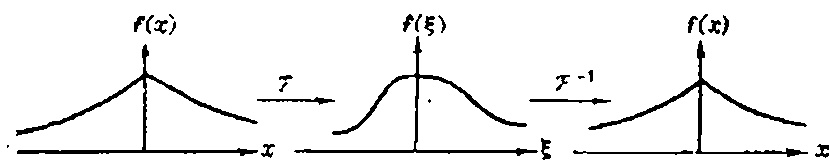

Рис. 12.1. Графіки функції та її образу Фур'є.

Приклад:
$$

e^{-|x|} \xrightarrow{\mathcal{F}} \sqrt{\frac{2}{\pi}}\frac{1}{1+\xi^2} \xrightarrow{\mathcal{F}^{-1}} e^{-|x|}.

$$

## Властивість 2 (Лінійність)

$$

\mathcal{F}[af+bg] = a\mathcal{F}[f] + b\mathcal{F}[g].

$$

Наприклад:
$$

\mathcal{F}\left[e^{-|x|} + 3e^{-x^2}\right]
= \mathcal{F}\left[e^{-|x|}\right] + 3\mathcal{F}\left[e^{-x^2}\right].

$$

## Властивість 3 (Перетворення похідних)

Для похідних за $x$:

$$

\mathcal{F}[u_x] = i\xi \mathcal{F}[u],

$$ \mathcal{F}[u_{xx}] = -\xi^2 \mathcal{F}[u].
$$

Для похідних за $t$ :

$$
\mathcal{F}[u_t] = \frac{\partial}{\partial t}\mathcal{F}[u],
$$

\mathcal{F}[u_{tt}] = \frac{\partial^2}{\partial t^2}\mathcal{F}[u].

$$

## Властивість 4 (Згортка)

$$

\mathcal{F}[f(x)g(x)] \neq \mathcal{F}[f]\mathcal{F}[g].

$$

**(12.2)**
$$

\mathcal{F}[f*g] = \mathcal{F}[f]\mathcal{F}[g].

$$

**(12.3)**
$$

(f*g)(x) = \frac{1}{\sqrt{2\pi}} \int_{-\infty}^{+\infty} f(x-\xi)g(\xi)\,d\xi.

$$
## Приклад згортки

Нехай:
$$

f(x) = x, \qquad g(x) = e^{-x^2}.

$$

Тоді:
$$

(f*g)(x) = \frac{1}{\sqrt{2\pi}} \int_{-\infty}^{+\infty} (x-\xi)e^{-\xi^2}\,d\xi = \frac{x}{\sqrt{2}}.

$$

Використано:
$$

\int_{-\infty}^{+\infty} e^{-\xi^2}\,d\xi = \sqrt{\pi}.

$$

## Інтерпретація

**(12.4)**
$$

\mathcal{F}^{-1}\left\{\mathcal{F}[f]\mathcal{F}[g]\right\}.

$$

Із властивості згортки:
$$

f * g = \mathcal{F}^{-1}\left\{\mathcal{F}[f]\mathcal{F}[g]\right\}.

$$

Тепер ми готові розв'язувати рівняння з частинними похідними за допомогою перетворення Фур'є.
# Розв'язання проблеми Коші Розглянемо проблему поширення тепла в *нескінченному* стрижні, якщо задано початкову температуру $u(x, 0) = \varphi(x)$ .
Цю задачу зазвичай називають задачою Коші для рівняння теплопровідності або задачою початкових умов

$$

\begin{aligned}
(\text{РЧП})\quad & u_t=\alpha^2u_{xx}, && -\infty<x<\infty,\ 0<t<\infty,\\
(\text{НУ})\quad & u(x,0)=q(x), && -\infty<x<\infty.
\end{aligned}

$$

Розв'язання задачі можна поділити на три основні етапи.
КРОК 1 (Конверсія завдань).
Оскільки просторова змінна x змінюється між $-\infty$ і $+\infty$ , ми піддамо рівняння та початкову умову (12,6) перетворенню Фур'є на змінній $x^{(1)}$ (x — інтегрована змінна у перетворенні). Після цього ми отримуємо

$$

\mathcal{F}[u_t] = \alpha^2 \mathcal{F}[u_{xx}],\qquad
\mathcal{F}[u(x,0)] = \mathcal{F}[\varphi(x)].

$$

Використовуючи властивості перетворення Фур'є, отримуємо задачу Коші

$$

\begin{cases}
\dfrac{dU}{dt}=-\alpha^2\xi^2U,\\
U(0)=\Phi(\xi).
\end{cases}

$$

де $U=U(\xi,t)=\mathcal{F}[u(x,t)]$ та $\Phi(\xi)=\mathcal{F}[\varphi(x)]$.
## КРОК 2 (Розв’язання перетвореної задачі)

Оскільки нова змінна відіграє роль константи в задачі (12.7), її розв’язок легко знаходиться:

**(12.8)**
$$

U(\xi,t)=\Phi(\xi)e^{-\alpha^2\xi^2 t}.

$$

## КРОК 3 (Знаходження оберненого перетворення)

Шуканий розв’язок $u(x,t)$ знаходиться за формулою:

$$

u(x, t) = \mathcal{F}^{-1}\!\left[U(\xi, t)\right]
= \mathcal{F}^{-1}\!\left[\Phi(\xi)e^{-\alpha^2 \xi^2 t}\right].

$$

Припускається, що існує перетворення Фур'є цих функцій.

Тут застосовується теорема про згортку. Використовуючи її, отримуємо:

**(12.9)**
$$

\begin{aligned}
u(x, t)
&= \mathcal{F}^{-1}\!\left[\Phi(\xi)e^{-\alpha^{2}\xi^{2} t}\right] \\
&= \mathcal{F}^{-1}\!\left[\Phi(\xi)\right] * \mathcal{F}^{-1}\!\left[e^{-\alpha^{2}\xi^{2} t}\right] \\
&= \Phi(x) * \left[\frac{1}{2\alpha \sqrt{\pi t}} e^{-x^{2}/4\alpha^{2} t}\right] \\
&= \frac{1}{2\alpha \sqrt{\pi t}} \int_{-\infty}^{+\infty} \Phi(\xi)\,e^{-(x-\xi)^{2}/4\alpha^{2} t}\,d\xi.
\end{aligned}

$$

## Інтерпретація результату

Формула (12.9) дає розв’язок задачі. Підінтегральна функція складається з двох множників:

1. Початкова температура $q(x)$  
2. Функція  
$$

G(x, t) = \frac{1}{2\alpha \sqrt{\pi t}} e^{-(x-\xi)^2/4\alpha^2 t},

$$
яка називається **функцією Гріна** (або функцією джерела).

Функція $G(x,t)$ описує відгук системи на початковий температурний одиничний імпульс.

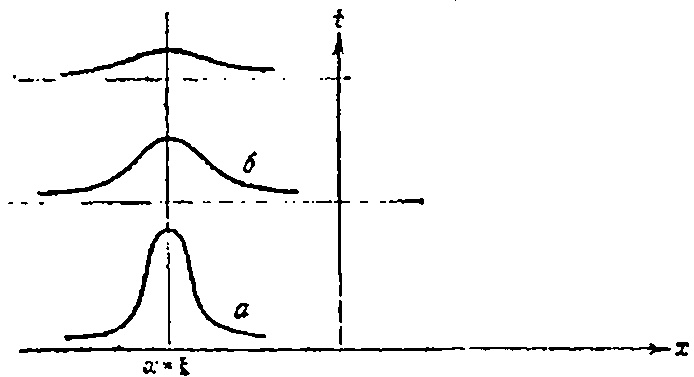

Рис. 12.2. Відгук $G(x,t)$ на температурний імпульс у точці $x=\xi$.

Графік $G(x,t)$ подібний до нормального розподілу, причому час $t$ відіграє роль дисперсії. При малих значеннях $t$ функція вузька і висока, а при збільшенні $t$ — розширюється і «розмивається».

Ідея інтерпретації:  
початкова температура $u(x,0)=\phi(x)$ може розглядатися як неперервна сукупність точкових імпульсів. Кожен імпульс дає внесок $G(x,t)$, а загальний розв’язок отримується як інтеграл усіх внесків.

Це є проявом **принципу суперпозиції**.

## ЗАУВАЖЕННЯ

Головний недолік перетворення Фур'є полягає в тому, що воно не застосовується до всіх функцій.

Наприклад:
$$

f(x)=\text{const}, \qquad f(x)=e^x, \qquad f(x)=\sin x

$$

не мають фур'є-образу, оскільки інтеграл

$$

\mathcal{F}[f] = \frac{1}{\sqrt{2\pi}} \int_{-\infty}^{+\infty} f(x)e^{-i\xi x}\,dx

$$

розходиться.

Перетворення Фур'є застосовується лише до функцій, які достатньо швидко прямують до нуля при $|x|\to\infty$.

Крім того, не можна застосовувати перетворення Фур'є за часом для задач із початковими умовами, оскільки змінна часу обмежена:
$$

0 < t < \infty.

$$
# ЗАДАЧІ
1. Найдите фурье-образ функции

$$

f(x)=
\begin{cases}
0, & x \le 0, \\
e^{-x}, & x > 0.
\end{cases}

$$

використовуючи таблиці, наведені в додатку.
- 2. На 10м переконайтеся, що прямі та обернені перетворення Фур'є є лінійними перетвореннями.
- 3. Використовуючи перетворення Фур'є, розв'яжете задачу Коші

$$

\begin{aligned}
(\text{РЧП})\quad & u_t = \alpha^2 u_{xx}, && -\infty < x < \infty,\\
(\text{ПУ})\quad & u(x,0)=e^{-x^2}, && -\infty < x < \infty.
\end{aligned}

$$

4. Перевірте справедливість співвідношень

$$

\begin{aligned}
\mathcal{F}\left[u_{x}\right] &= i\xi \mathcal{F}\left[u\right], \\
\mathcal{F}\left[u_{xx}\right] &= -\xi^{2} \mathcal{F}\left[u\right].
\end{aligned}

$$

ВКАЗІВКА. Скористайтеся інтегруванням частинами.
5. Перевірити, чи можна записати згортку двох функцій f і g у двох еквівалентних формах

$$

(f * g)(x) = \frac{1}{\sqrt{2\pi}} \int_{-\infty}^{+\infty} f(\xi)\, g(x - \xi)\, d\xi

$$ або $$

(f * g)(x) = \frac{1}{\sqrt{2\pi}} \int_{-\infty}^{+\infty} f(x-\xi)\, g(\xi)\, d\xi.

$$
# Лекція 13. ПЕРЕТВОРЕННЯ ЛАПЛАСА МЕТА ЛЕКЦІЇ: Ввести перетворення Лапласа, ознайомити читача з формулою оберненого перетворення та показати, як ці інструменти застосовуються до диференціальних рівнянь.

Перетворення Лапласа має важливу перевагу над перетворенням Фур'є: завдяки згасаючому множнику $e^{-st}$ воно застосовується до значно ширшого класу функцій. Крім того, перетворення Лапласа природно працює на півосі $0 \le t < \infty$, що особливо зручно для задач з початковими умовами.

# Властивості перетворення Лапласа Властивість 1 (Пряме і обернене перетворення)
Перетворення Лапласа та формула його інверсії мають вигляд

$$

\mathscr{L}[f] = F(s) = \int_{0}^{\infty} f(t) \, e^{-st} \, dt
\quad \text{(перетворення Лапласа).}

$$

(13.2)

$$

\mathscr{L}^{-1}[F] = f(t) = \frac{1}{2\pi i} \int_{c-i\infty}^{c+i\infty} F(s) \, e^{st} \, ds
\quad \text{(формула інверсії).}

$$

Перетворення Лапласа має велику перевагу над перетворенням Фур'є: множник $e^{-st}$ забезпечує збіжність для ширшого класу функцій. Більш точний опис цього класу дає наступна теорема.

# Достатні умови існування перетворення Лапласа Нехай
1. для будь-якого додатного числа $A$ функція $f(t)$ є кусково-неперервною на інтервалі $0 \le t \le A$;
2. існують такі константи $M$, $a$ і $T$, що $|f(t)| \le Me^{at}$ для всіх $t > T$.
Тоді перетворення Лапласа

$$

\mathscr{L}[f] = F(s) = \int_0^\infty f(t)e^{-st}\,dt

$$

існує для всіх $s > a$.
Наведемо приклади деяких функцій та їхніх перетворень Лапласа.
У визначенні перетворення Лапласа зазвичай вважають, що $s$ — дійсна змінна. Однак часто корисно розширити це визначення на комплексні значення $s$, а обернене перетворення записати як

$$

\mathscr{L}^{-1}[F] = \frac{1}{2\pi i} \int_{\epsilon - i\infty}^{\epsilon + i\infty} F(s)e^{st}\,ds.

$$

Використання цієї формули передбачає знайомство з технікою інтегрування вздовж контурів у комплексній площині та теорією дедукцій. Ми не будемо відволікатися на вивчення цих питань тут, і коли йдеться про перетворення Лапласа, ми використаємо таблицю, наведену в додатку.

# Властивість 2 (Перетворення часткових похідних)
Нехай $u(x,t)$ — функція двох змінних, а

$$

U(x,s)=\mathcal{L}\!\left[u(x,t)\right].

$$

Оскільки перетворення Лапласа виконується за змінною $t$, маємо формули

$$

\begin{aligned}
\mathcal{L}\!\left[u_t\right]
&=\int_0^\infty u_t(x,t)e^{-st}\,dt
=sU(x,s)-u(x,0),\\
\mathcal{L}\!\left[u_{tt}\right]
&=\int_0^\infty u_{tt}(x,t)e^{-st}\,dt
=s^2U(x,s)-su(x,0)-u_t(x,0),\\
\mathcal{L}\!\left[u_x\right]
&=\int_0^\infty u_x(x,t)e^{-st}\,dt
=\frac{\partial U}{\partial x}(x,s),\\
\mathcal{L}\!\left[u_{xx}\right]
&=\int_0^\infty u_{xx}(x,t)e^{-st}\,dt
=\frac{\partial^2 U}{\partial x^2}(x,s).
\end{aligned}

$$
Нижче наведено кілька простих прикладів функцій та їхніх образів Лапласа.

1. $f(t)=1$, $0<t<\infty$.

$$

F(s)=\int_0^\infty e^{-st}\,dt=\frac{1}{s}.

$$

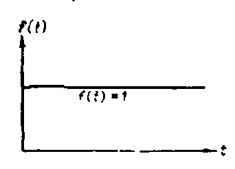

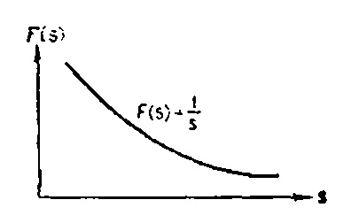

2. $f(t)=e^{2t}$, $0<t<\infty$.

$$

F(s)=\frac{1}{s-2}, \qquad s>2.

$$

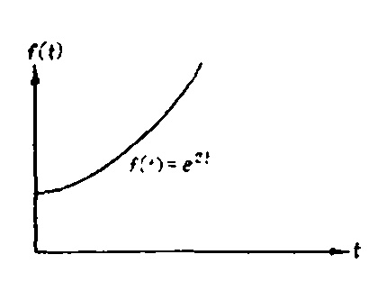

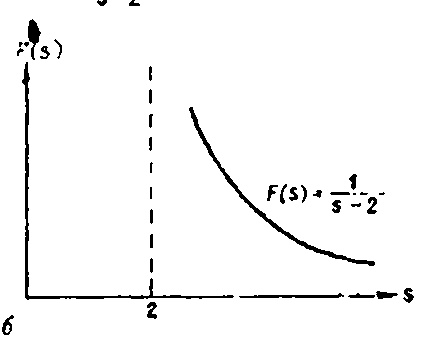

3. $f(t)=\sin(\omega t)$.

$$

F(s)=\frac{\omega}{s^2+\omega^2}.

$$

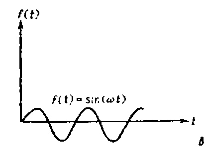

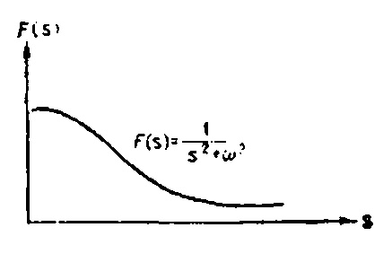

4. $f(t)=e^{t^2}$ не має перетворення Лапласа.
Рис. 13.1. Графіки деяких функцій та їхніх зображень за Лапласом.
Правила перетворення просторових похідних випливають із теореми про диференціювання інтеграла за параметром:

$$

\frac{d}{dx}\int_{a}^{b}f\left(x,\ y\right)dy=\int_{a}^{b}\frac{df}{dx}\left(x,\ y\right)dy,

$$

а формули для перетворення похідних $u_t$ і $u_{tt}$ можна отримати інтегруванням частинами.

# Властивість 3 (Теорема про згортку)

Згортка відіграє тут ту ж роль, що і в теорії перетворення Фур'є, але вводиться дещо інакше.

# Визначення скінченної згортки

Скінчена згортка двох функцій $f$ і $g$ визначається формулами

$$

(f * g)(t)
= \int_0^t f(\tau)g(t-\tau)\,d\tau
= \int_0^t f(t-\tau)g(\tau)\,d\tau.

$$

(Можна довести, що ці інтеграли рівні). Тут інтегрування здійснюється вздовж скінченного інтервалу від 0 до t, а не вздовж нескінченної ( $\infty$ , $+\infty$ ), як це було раніше з визначенням нескінченної згортки.
Ось приклад скінченної згортки двох функцій. Нехай

$$

f(t)=t,\qquad g(t)=t.

$$

тоді

$$

(f * g)(t)=\int_0^t \tau(t-\tau)\,d\tau=\frac{t^3}{6}.

$$

Як і у випадку нескінченної згортки, її найважливіша властивість визначається формулою
(13.4)

$$

\mathcal{L}[f*g]=\mathcal{L}[f]\mathcal{L}[g].

$$

або еквівалентна формула
(13.5)

$$

\mathcal{L}^{-1}\!\left(\mathcal{L}[f]\mathcal{L}[g]\right)=f*g.

$$

Ці формули дозволяють застосовувати перетворення Лапласа у випадках, коли образ можна подати як добуток $\mathcal{L}[f]$ і $\mathcal{L}[g]$.
Функції $F$ і $G$ легко знайти. Після знаходження функцій $f$ і $g$ можна знайти їхню згортку. Наприклад,

$$

\mathcal{L}^{-1}\!\left(\frac{1}{s(s^2+1)}\right)=1-\cos t.

$$

Тут використано пари

$$

\mathcal{L}^{-1}\!\left(\frac{1}{s}\right)=1,\qquad
\mathcal{L}^{-1}\!\left(\frac{1}{s^2+1}\right)=\sin t.

$$

Тепер ми готові до важливого змішаного виклику.

# Теплопровідність у напівнескінченному середовищі Розглянемо глибокий резервуар з рідиною, і нехай бічна поверхня резервуара буде теплоізольованою. Нехай $u_0$ буде початковою температурою рідини, а температура повітря над рідиною —

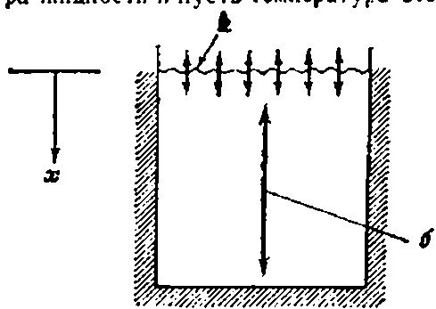

Рис. 13.2. Схематичне представлення проблеми теплопровідності:  
a — тепло тече всередину, якщо $u_x(0, t) < 0$, і назовні, якщо $u_x(0, t) > 0$;  
b — резервуар настільки глибокий, що гранична умова внизу не впливає на розв’язок при значеннях $x$.

кістка дорівнює нулю (орієнтир температур) (див. рис. 13.2).  
Наше завдання — знайти температурне поле в рідині на різних глибинах і в різний час.  
Іншими словами, нам потрібно розв’язати проблему

(13.6)

$$

\begin{aligned}
(\text{УЧП})\quad & u_t = u_{xx}, && 0 < x < \infty,\; 0 < t < \infty, \\
(\Gamma \text{У})\quad & u_x(0,t) - u(0,t) = 0, && 0 < t < \infty, \\
(\text{НУ})\quad & u(x,0) = u_0, && 0 < x < \infty.
\end{aligned}

$$

Щоб розвинути це завдання, ми можемо відтворити Лапласа у мінливу t. Відновити повагу, щоб можна було зупинити перетворення Лапласа на зміну x, змінити з 0 на $\infty$ . Обробка розмноження

Ми отримуємо звичайне диференціальне рівняння за змінною $x$.

**(13.7)**

$$

sU(x) - u_0 = \frac{d^2U}{dx^2}, \quad 0 < x < \infty.

$$

Гранична умова:

$$

\frac{dU}{dx}(0) = U(0).

$$

(Ми перетворили лише рівняння та граничну умову, а не початкову умову.)

Маємо звичайне диференціальне рівняння другого порядку з однією граничною умовою при $x=0$. Насправді існує ще одна гранична умова, яка визначається фізичними міркуваннями:

$$

U(x) \to 0 \quad \text{при} \quad x \to +\infty.

$$

Зверніть увагу, що для спрощення позначення параметр $s$ опущено в аргументах функції $U(x)$.

Щоб розв’язати задачу (13.7), запишемо загальний розв’язок (сума однорідного і часткового):

$$

U(x) = c_1 e^{\sqrt{s}x} + c_2 e^{-\sqrt{s}x} + \frac{u_0}{s}.

$$

Підставляючи цей вираз у граничні умови, визначаємо сталі $c_1$ і $c_2$.

Оскільки при $x \to +\infty$ температура не повинна зростати нескінченно, маємо:

$$

c_1 = 0.

$$

Після використання граничної умови при $x=0$ отримуємо остаточний вираз для $U(x)$:

**(13.8)**

$$

U(x) = \frac{u_0}{s} \left( \frac{e^{-\sqrt{s}x}}{1 + \sqrt{s}} \right) + \frac{1}{s}.

$$

Залишається зробити останній крок. Щоб визначити температурне поле, потрібно обчислити:

$$

u(x, t) = \mathcal{L}^{-1}[U(x, s)].

$$

Ми повертаємося до запису $U(x, s)$ із явним аргументом $s$.

Використовуючи таблиці оберненого перетворення Лапласа, отримуємо:

**(13.9)**

$$

u(x, t) = u_0 - u_0 \left[ \operatorname{erfc}\!\left( \frac{x}{2\sqrt{t}} \right) + \operatorname{erfc}\!\left( \frac{x}{2\sqrt{t}} + \sqrt{t} \right) e^{x+t} \right].

$$

де

$$

\operatorname{erfc}(x) = \frac{2}{\sqrt{\pi}} \int_{x}^{\infty} e^{-\xi^2} d\xi

$$

— функція, спряжена до інтеграла ймовірностей.
Графіки цієї функції показані на рис. 13.3.

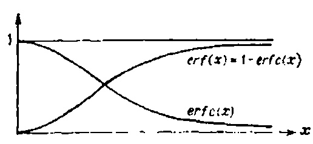

Рис. 13.3. Графік ймовірнісного інтеграла та його доповнюючої функції.

Аналіз цього рішення показує розподіл температури всередині напівнескінченного середовища в різні моменти часу (див. рис. 13.4).

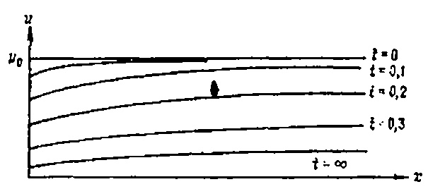

# ПРИМІТКИ

1. Перетворення Лапласа можна звести до диференціального рівняння з частковими похідними або використовувати метод розділення змінних.

2. Для розв’язання задач також використовуються перетворення Ганкеля та Мелліна. Наприклад:

$$

\mathscr{L}[y'] = s\mathscr{L}[y] - y(0),

$$ H[y] = \int_{0}^{\infty} r J_0(\xi r) y(r)\,dr,
$$

H\left[y''(r)+\frac{1}{r}y'(r)\right] = -\xi^2 H[y].

$$

# ЗАВДАННЯ

1. Перевірити формулу:

$$

\mathscr{L}[u_t(x,t)] = sU(x,s) - u(x,0).

$$

2. Розв’язати задачу:

$$

\begin{aligned}
u_t &= \alpha^2 u_{xx}, \\
u(x,0) &= \sin x.
\end{aligned}

$$

3. Розв’язати задачу:

$$

\begin{aligned}
u_t &= u_{xx}, \\
u(0,t) &= \sin t, \\
u(x,0) &= 0.
\end{aligned}

$$

4. Розв’язати задачу:

$$

\frac{d^2U}{dx^2} - sU = A, \quad 0 < x < 1,

$$ \begin{cases}
\frac{dU}{dx}(0) = 0, \\
U(1) = 0.
\end{cases}
$$

# Лекція 14. ПРИНЦИП ДЮАМЕЛЯ

МЕТА ЛЕКЦІЇ: Показати, як переклад Лапласа можна використовувати для ідентифікації характеристик диференціальних рівнів. Зокрема, за допомогою алгебранічного перетворення образів Лапласа, розвиток рівня частково обгорнутого може бути під впливом принципу погляду Дюамеля. Інтерпретація цього принципу в теорії найвищих диференціальних рівнів світу має використовуватися для розробки методів співу RFP.

технології.

Давайте подивимось, як трансформація Лапласа впливає на розвиток часткових диференціальних ліній, що дозволяє нам розкрити фізичну сутність різних розвитків. За допомогою трансформації Лапласа ми вже розробили принцип Дюамеля. По-перше, що необхідно, щоб звернутися до принципу Дюамеля, ми маємо проблему, яка часто є проблемою

# Теплопровідність у стрижні, кінці якого підтримуються при заданій температурі

Дуже часто необхідно знайти температуру всередині області, якщо відомо, що на межі області вона змінюється з часом відповідно до певного закону (граничні умови, залежні від часу).

Зліва температура задається $u(0,t)=0$ , а справа — функцією $f(t)$ .
Фіг. 14.1. Граничні умови, щоб лежати годину.

Під час нанесення можна побачити термозоляційний стержень, праві кінети якого підтримуються f(t) (чудова рисунок 14.1). Потреба проблеми

(14.1)

$$
u_t = u_{xx}, \quad 0 < x < 1, \quad 0 < t < \infty.
$$

Граничні умови:

$$
\begin{cases}
u(0, t) = 0, \\
u(1, t) = f(t),
\end{cases}
\quad 0 < t < \infty.
$$

Початкова умова:

$$
u(x, 0) = 0, \quad 0 \le x \le 1.
$$

Сподіваємося, що розв'язання цієї задачі (14.1) буде легким, оскільки ми знаємо розв'язок простішої задачі, де температура в кінці є сталою:

Насправді, якщо обидві задачі ((14.1) і (14.2)) розв'язуються одночасно за допомогою перетворення Лапласа, то отримаємо визначний результат: розв'язок задачі (14.1) виражається через розв'язання задачі (14.2).

Отже, розв'язуючи обидві задачі одночасно, ми отримуємо

# Легке завдання (14.2) (Постійні солдати)

# Застосуванння перетворення Лаласа до задаі (14.2)

$$
\frac{d^2 W}{dx^2} - s W(x) = 0,
$$

W(0) = 0, \quad W(1) = \frac{1}{s}.

$$

## Розв’язання ОДУ

$$

W(x, s) = \frac{1}{s} \cdot \frac{\sinh(x \sqrt{s})}{\sinh(\sqrt{s})}.

$$

## Пошук оберненого перетворення

$$

w(x, t) = x + \frac{2}{\pi} \sum_{n=1}^{\infty} \frac{(-1)^n}{n} e^{-(n\pi)^2 t} \sin(n\pi x).

$$

(це розв’язок задачі з постійними граничними умовами)

# Важке завдання (14.1) (граничні умови, що залежать від часу)

## Застосування перетворення Лапласа до задачі (14.1)

$$

\frac{d^2 U}{dx^2} - s U(x) = 0,

$$ U(0) = 0, \quad U(1) = F(s).
$$

U(x, s) = F(s)\cdot \frac{\sinh(x \sqrt{s})}{\sinh(\sqrt{s})}.

$$

## Представлення через оператор Лапласа

Запишемо:

$$

U(x, s) = F(s) \cdot \left( \mathcal{L}[w_t] \right).

$$

Використовуючи співвідношення:

$$

\mathcal{L}[w_t] = s W - w(x, 0),

$$

отримуємо зв’язок для подальшого оберненого перетворення.

## Обернене перетворення Лапласа

$$

u(x, t) = \mathcal{L}^{-1}\{F(s)\cdot \mathcal{L}[w_t]\}.

$$

За теоремою про згортку:

$$

u(x, t) = \mathcal{L}^{-1}[F(s)] * \mathcal{L}^{-1}[w_t].

$$

Отже,

$$

u(x, t) = f(t) * w_t(t),

$$ u(x, t) = \int_0^t w_t(x, t-\tau)\, f(\tau)\, d\tau.
$$

Після інтегрування частинами:

$$
u(x, t) = \int_{0}^{t} w(x, t-\tau)\, f'(\tau)\, d\tau + f(0)\, w(x, t).
$$

## Висновок

Розв’язок задачі з граничними умовами, що змінюються в часі, можна виразити через розв’язок задачі з постійними граничними умовами.
(14.3)

Плутанина у наступних формулах. Записати диференціальне рівняння у частинних похідних у нових координатах $(\xi, \eta)$ , ми скористаємося наступними формулами переходу.

Наприклад, якщо $\frac{dy}{dx} = \frac{B}{2A} = 3$ , то $y - 3x = c$ , а отже $\xi(x, y) = y - 3x$ . Ця функція задовольняє умову $\frac{\xi_x}{\xi_y} = -3$ і, відповідно, занулює коефіцієнт $\overline{A}$ .

Отже, половина роботи виконана: ми знайшли нову координату $\xi = \xi(x, y)$ , яка забезпечує рівність $\overline{A} = 0$ .  
Залишається знайти $\eta(x, y)$ так, щоб коефіцієнт $\overline{B}$ також дорівнював нулю.

Виявляється, що якщо вибрати $B^2 - 4AC = 0$ і $\xi$ так, щоб $\overline{A} = 0$ , то коефіцієнт $\overline{B}$ автоматично стане нульовим.

Коефіцієнт $\overline{B}$ задається виразом:

$$
\overline{B}^2 - 4\overline{A}\overline{C} = (B^2 - 4AC)\,(\xi_x \eta_y - \xi_y \eta_x)^2
$$

\overline{B} = 2\left( \overline{A}\,\xi_x + \overline{C}\,\xi_y \right)
\left( \overline{A}\,\eta_x + \overline{C}\,\eta_y \right).

$$

Функціональна діаграма робить ці формули зрозумілішими. Вона особливо корисна при обчисленні частинних похідних функцій $\xi$ та $\eta$.

## Подальші перетворення

Підставляємо знайдені вирази $u_t$, $u_x$ та $u_{xx}$ у вихідне рівняння:

$$

\overline{B} = 2\sqrt{\overline{A}} \left[ \sqrt{\overline{A}}\, \eta_x + \sqrt{\overline{C}}\, \eta_y \right].

$$

Звідси отримуємо:

$$

u_{xx} + 2u_{xy} + u_{yy} = 0.

$$

## Нова задача

Отже, нова задача у змінних $\xi$ та $\eta$ має вигляд:

$$

\frac{dy}{dx} = -\frac{\xi_x}{\xi_y} = \frac{B}{2A} = 1.

$$

(ПУ)
$$

u(\xi, 0) = 1 - H(\xi), \quad -\infty < \xi < \infty.

$$

Оскільки $\xi = x$ при $t = 0$, граничні умови збігаються зі старими.

## Розв’язок

Після перетворення:

$$

u(\xi, \eta) = \eta f(\xi) + g(\xi),

$$

переходимо до змінних $x$ і $y$:

$$

u(x, y) = y f(y - x) + g(y - x).

$$

Для конкретного випадку:

$$

u(x, y) = y \sin(y - x) + (y - x)^2.

$$

## Параметри рівняння

$$

A u_{xx} + B u_{xy} + C u_{yy} + D u_x + E u_y + F u = G

$$ u_t = u_{xx} - 2u_x, \quad -\infty < x < \infty, \quad 0 < t < \infty,
$$

u(x, 0) = \sin x, \quad -\infty < x < \infty.

$$

## Інші форми запису

$$

\frac{dy}{dx} = \frac{B - \sqrt{B^2 - 4AC}}{2A}.

$$ \xi(x, y) = \text{const}, \quad \eta(x, y) = \text{const}.
$$

\frac{dy}{dx} = -\sqrt{-4x^2} = -2ix.

$$

## Додаткові зауваження

Перехід до рухомої системи координат дозволяє усунути член $V u_x$ у рівнянні конвективної дифузії.

Після розв’язання нової задачі:

$$

\text{(узагальнене рівняння у нових змінних)}

$$

де $\phi$ позначає праві частини рівнянь у загальному вигляді.

Замість доведення складних перетворень, розглянемо простий приклад.

# Зведення рівняння $y^2 u_{xx} + x^2 u_{yy} = 0$ до канонічної форми

Розглянемо рівняння:

$$

y^2 u_{xx} + x^2 u_{yy} = 0,

$$

де $A = y^2$, $B = 0$, $C = x^2$, $D = E = F = G = 0$.

Дискримінант:

$$

B^2 - 4AC = -4x^2 y^2,

$$

і ми зведемо це рівняння до канонічної форми в першому квадранті $x > 0$, $y > 0$.

## КРОК 1. Перше перетворення

Характеристичне рівняння:

$$

\frac{dy}{dx} = \frac{B + \sqrt{B^2 - 4AC}}{2A} = \frac{\sqrt{-4x^2 y^2}}{2y^2} = i \frac{x}{y}.

$$

Інтегруючи, отримуємо:

$$

y^2 + i x^2 = \text{const}.

$$

Вводимо змінні:

$$

\xi = y^2 + i x^2, \quad \eta = y^2 - i x^2.

$$

(можна міняти місцями $\xi$ та $\eta$)

## КРОК 2. Друга трансформація

Після другої заміни отримуємо:

$$

\begin{cases}
u_{tt} = \alpha^2 u_{xx} + F(x,t), \\
u_{tt} = \alpha^2 u_{xx} - \beta u_t - \lambda u + F(x,t).
\end{cases}

$$

(де $\beta = x^2$ — уявна частина відповідних змінних)

## КРОК 3. Отримання нового рівняння

Канонічна форма:

$$

\overline{A}u_{\xi\xi} + \overline{B}u_{\xi\eta} + \overline{C}u_{\eta\eta} + \overline{D}u_{\xi} + \overline{E}u_{\eta} + \overline{F}u = \overline{G}.

$$

## Хвильове рівняння (гіперболічний тип)

Одновимірне хвильове рівняння:

$$

u_{tt} = c^2 u_{xx}.

$$

## Вібрації струни

Сила натягу:

$$

\text{Сила} \approx T \left[ u_x(x + \Delta x, t) - u_x(x, t) \right].

$$

Закон Ньютона приводить до:

$$

\rho u_{tt} = T u_{xx} + F(x,t) - \beta u_t - \gamma u.

$$

Поділивши на $\rho$, отримуємо телеграфне рівняння.

## Примітки

1. Класифікація рівнянь:
   - параболічні,
   - гіперболічні,
   - еліптичні.

2. Це важливо, бо кожен тип описує різні фізичні процеси.

# ЗАВДАННЯ

1. Які з цих параболічних і еліптичних рівнянь записані у канонічній формі?

a) $u_t = u_{xx} + hu$,

б) $u_{xy} + u_{xx} + 3u = \sin x$,

в) $u_{xx} + 2u_{yy} = 0$,

г) $u_{xx} = \sin^2 x$?

2. Перетворіть параболічне рівняння $u_{xx} + 2u_{xy} + u_{yy} + u = 2$ до канонічної форми.

3. Перетворіть еліптичне рівняння $u_{xx} + 2u_{yy} + x^2 u_x = e^{-x^2/2}$ до канонічної форми.

# МЕТОД МОНТЕ-КАРЛО (ВСТУП)

МЕТА ЛЕКЦІЇ: Пояснити основні ідеї, що лежать в основі методу Монте-Карло, і показати, як цей метод можна використовувати для розв’язання різних задач. Виявляється, що за допомогою випадкових експериментів можна змоделювати (загалом, на комп’ютері) наближені розв’язки реальних задач. Як простий приклад можна вказати обчислення інтеграла

$$

\int_a^b f(x)\,dx

$$

на основі інтуїтивних міркувань.

# Інтуїтивна інтерпретація хвильового рівняння

Читач може запитати: чому рівняння типу (16.2) описує вібрації струни? Щоб зрозуміти це, необхідно розглянути фізичний зміст величин.

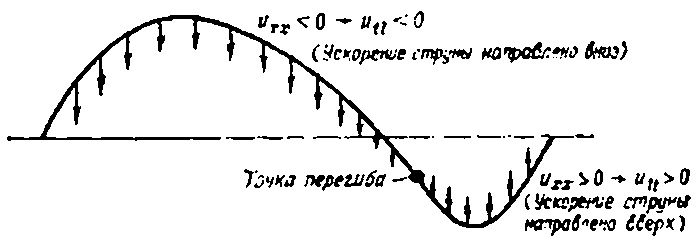

Рівняння (16.2) можна інтерпретувати так: прискорення струни, викликане натягом, у кожній точці пропорційне вигину струни:

$$

u_{tt} = \alpha^2 u_{xx}, \quad \alpha^2 = \frac{T}{\rho}

$$

(див. рис. 13.3).

# Пояснення

1. Хвильове рівняння  
$$

u_{tt} = \alpha^2 u_{xx}

$$  
також описує поздовжні та крутильні коливання стрижня.

У поздовжніх коливаннях зміщення паралельні осі стрижня, і поздовжнє зміщення позначається як $u(x,t)$. Такі коливання виникають, наприклад, коли ударяють по кінцю стрижня.

# Ймовірнісна інтерпретація (Метод Монте-Карло)

Приклад: кидаємо дротик у одиничний квадрат  
$\{(x, y): 0 < x < 1,\; 0 < y < 1\}$.

Після приблизно 100 кидків відносна частка точок, що лежать нижче кривої $y = x^2$, дає наближення інтеграла.

Узагальнення такої гри передбачає генерацію випадкових чисел.

# Загальна ідея методу

Методи Монте-Карло — це група методів розв’язання детермінованих задач, у яких використовуються випадкові величини.

Загальна схема:

Ймовірнісна гра → випадкова модель  
Детермінована задача → шуканий результат  
Наближення: $\hat{p} \approx p$

# Обчислення інтеграла

Припустимо, потрібно обчислити інтеграл:

$$

\int_a^b f(x)\,dx

$$

Для цього вводимо прямокутну область:

$$

R = \{(x,y): a \le x \le b,\; 0 \le y \le \max f(x)\}

$$

(див. рис. 42.2)

# Фізичний зміст хвиль

Модуль Юнга $k$ характеризує пружність матеріалу. Чим більший $k$, тим вищі частоти коливань.

Звукові хвилі — це поздовжні хвилі.

# Узагальнене хвильове рівняння

Якщо густина $\rho(x)$ залежить від координати, хвильове рівняння має вигляд:

$$

\rho(x)\,u_{tt} = \frac{\partial}{\partial x}\left( T \frac{\partial u}{\partial x} \right)

$$

# Розв’язки хвильового рівняння

Типові розв’язки мають вигляд хвиль, що рухаються:

$$

u(x,t) = e^{-(x - ct)^2}

$$

Хвилі можуть рухатися у різних напрямках зі швидкістю $c$.

# Варіаційний підхід

$$

\int_a^b \left( \frac{\partial F}{\partial u} \eta(x) + \frac{\partial F}{\partial u'} \eta'(x) \right) dx = 0

$$

Звідси отримуємо:

$$

\frac{\partial F}{\partial u} - \frac{d}{dx}\left( \frac{\partial F}{\partial u'} \right) = 0

$$

# Висновок

Рівняння хвильового типу описує процеси, які мають вигляд хвиль, що поширюються в просторі.

КРОК 4 (Урахування початкових умов).

Нагадаємо читачеві загальний метод розв'язання задачі Коші в теорії звичайних диференціальних рівнянь. Спочатку знаходять загальний розв'язок рівняння, а потім підставляють його в початкові умови, щоб визначити конкретні значення довільних сталих. У нас ситуація аналогічна. Для розв'язання задачі Коші для хвильового рівняння ми підставимо загальний розв'язок

$$

\frac{\partial F}{\partial y} - \frac{d}{dx}\!\left(\frac{\partial F}{\partial y'}\right) = 0

$$

(який містить дві довільні функції) у початкові умови

$$

J[y] = \int_{0}^{1} [y^{2} + y'^{2}] dx.

$$

\(u_1(x, 0) = g(x)\) допомагає знайти конкретні вирази для довільних функцій φ і ψ. Після підстановки отримуємо

(17.5)

$$

F_y - \frac{d}{dx} F_{y'} = 0,

$$

Якщо тепер проінтегрувати друге рівняння (17.5), отримаємо алгебраїчну систему двох рівнянь відносно невідомих функцій $ \varphi(x) $ і $ \psi(x) $. Дійсно, після інтегрування в межах від $ x_0 $ до $ x $ маємо

(17.6)

$$

\begin{aligned}
F_y &= 2y, \\
F_{y'} &= 2y'.
\end{aligned}

$$

Тепер розв’язуємо рівняння (17.6) разом із першим рівнянням (17.5) і отримуємо такі вирази для функцій $ \varphi(x) $ і $ \psi(x) $:

(17.7)

$$

2y - \frac{d}{dx}(2y') = 0,

$$ y'' - y = 0.
$$

Отже, загальний розв’язок задачі (17.1) задається формулою

(17.8)

$$
\overline{y}(x) = 0.42e^x - 0.42e^{-x}
$$

Мета досягнута. Ми отримали загальний розв’язок задачі (17.1). Розв’язок у вигляді (17.8) зазвичай називають формулою Д’Аламбера. Читача запрошують самостійно простежити за межами інтегрування, щоб переконатися, що вони змінюються з $x-ct$ на $x+ct$ . Проблему повністю розв’язано.

Перед завершенням лекції наведемо кілька прикладів застосування формули Д’Аламбера.

# Приклади застосування формули Д’Аламбера

# 1. Рух синусоїдальних хвиль

Розглянемо початкові умови вигляду

$$
J[y] = \int_a^b y \sqrt{1 + y'^2} \, dx,
$$

u_1(x, 0) = 0.

$$

За формулою Д’Аламбера отримуємо розв’язок

$$

\overline{y}(x) = \alpha \operatorname{ch}\left(\frac{x - \beta}{\alpha}\right),

$$

Його можна інтерпретувати так: початкове зміщення струни $u(x, 0) = \sin x$ розкладається на дві однакові частини

$$

\overline{y}(x) = 0.42e^x - 0.42e^{-x}

$$

та $\frac{\sin x}{2}$.

Кожна з цих частин поширюється зі швидкістю $c$ у вигляді хвиль. Одна хвиля рухається зліва направо, інша — у протилежному напрямку. Читача запрошують замислитися, як виглядає отримана хвиля в цьому випадку.

# 2. Розповсюдження найпростішого прямокутного імпульсу

У цьому випадку початкові умови задаються так:

$$

J[y] = \int_0^1 (y^2 + y'^2)\,dx,

$$ u_t(x, 0) = 0.
$$

Уламки качана поділяються на дві частини, які руйнуються на протитанкових лініях, як показано на рис. 17.2.

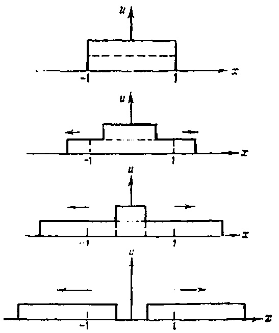

Фіг. 17.2. Початкове збурення розділяється на дві хвилі, що рухаються.

# 3. Задана початкова швидкість

Тепер припустимо, що в початковий момент струна перебуває у стані рівноваги. Надамо їй початкову швидкість форми $\sin x$ , тобто

$$
\int\limits_{t_1}^{t_2} J[u] = \iint\limits_D F(x, y, u, u_x, u_y)\,dx\,dy,
$$

Розв’язок знаходимо за формулою Д’Аламбера:

$$
F_u - \frac{\partial}{\partial x}F_{ux} - \frac{\partial}{\partial y}F_{uy} = 0.
$$

Це рішення представляє суму двох хвиль, що рухаються у вигляді косинусоїдальних хвиль. Читач може самостійно оцінити, чи є цей результат фізично зрозумілим.

На цьому лекція 17 завершується. У наступній лекції буде показано, як формула Д’Аламбера інтерпретується в площині змінних $x$ і $t$ .
# ЗАУВАЖЕННЯ

1. Загальний розв’язок диференціального рівняння в частинних похідних другого порядку містить дві довільні функції, тоді як загальний розв’язок звичайного диференціального рівняння містить дві довільні сталі. Отже, рівняння з частинними похідними має більше розв’язків, ніж звичайне диференціальне рівняння.

2. Заміна змінних для зведення рівняння з частинними похідними до простішого вигляду є одним із загальних методів теорії. Нові координати $(\xi, \eta)$ прийнято називати канонічними координатами. Ми будемо звертатися до них і надалі, особливо при вивченні гіперболічних рівнянь.

3. Метод визначення рівня розвитку за допомогою часткових методів і встановлення такого зв'язку в початковій частині мозку не є тим самим методом встановлення таких рівнів. Пояснення цієї лекції — єдиний спосіб використати суть цього методу. Неможливо знайти розрив між рівнем і частковими перевагами, але знайти спосіб увійти, поставити це в граничні умови — це виконати завдання складання.

# ЗАВДАННЯ

1. Перевірте, що розв’язок Д’Аламбера (17.8) задовольняє початкові умови задачі (17.1).

2. Підставте (17.7) у загальний розв’язок $ u(x, t) = \psi(x - ct) + \psi(x + ct) $ і отримайте формулу Д’Аламбера.

3. Знайдіть розв’язок задачі Коші:

$$
J[y] = \int_{0}^{1} \sqrt{1 + y'^{2}}\,dx.
$$

Як виглядає цей розв’язок у різні моменти часу?

4. Знайдіть розв’язок задачі Коші:

(УЧП)

$$
\int_{t_{1}}^{t_{2}} (KE - PE)\,dt = \frac{1}{2} \int_{t_{1}}^{t_{2}} (m\dot{y}^{2} - ky^{2})\,dt
$$

(НУ)

$$
J[y] = \int_{0}^{\pi/2} (y'^{2} - y^{2})\,dx
$$

Побудуйте графік розв’язку в різні моменти часу.

5. Розв’язуючи спільно рівняння (17.6) і перше рівняння з (17.5), отримайте формули (17.7).

# Лекція 15. КОНВЕКТИВНИЙ ЧЛЕН $u_x$ У ДИФУЗІЙНІЙ ЗАДАЧІ МЕТА ЛЕКЦІЇ: Показать, каким образом слагаемое $u_x$ в диффузионной задаче

$$

u_t = Du_{xx} - Vu_x

$$

Диффузионный член Конвективный член

описує явище конвекції. Наведене вище рівняння конвективної дифузії зустрічається у багатьох задачах і описує як дифузію, так і конвекцію. Роль кожного з цих механізмів визначається співвідношенням коефіцієнтів D і V.

Оскільки конвекція речовини спричинена її рухом разом із навколишнім середовищем, природно перейти у систему координат, яка рухається разом із середовищем. Внаслідок такого перетворення конвективний член буде виключено, і отримане рівняння можна розв'язати одним із відомих методів. Перетворивши отриманий розв'язок у фіксовану систему відліку, отримуємо розв'язок початкової задачі.

Поки що ми розглядали теплопровідність (або певний вид дифузії) в одномірних системах. Тепер розглянемо проблему розподілу концентрації певної речовини, що виходить із землі і входить у висхідні повітряні потоки. Ми врахуємо як дифузію матерії, так і конвективний транспорт повітрям, який рухається зі швидкістю V. Очевидно, що в цьому випадку конвективний механізм передачі речовини відіграє важливішу роль, ніж механізм дифузії (роль кожного механізму визначається співвідношенням коефіцієнтів дифузії та швидкості повітря). Наше завдання — вивести рівняння конвективної дифузії

$$

u_t = Du_{xx} - Vu_x

$$

Щоб переконатися, що рівняння конвективної дифузії правильне, ми використаємо два базові факти.

1. Поток, обусловленный конвекцией.

Конвективний потік речовини зліва направо через поперечний переріз у цій точці дорівнює Vu(x, t), де V — швидкість середовища (см/с), а u(x, t) — концентрація речовини (г/см) (рис. 15.1).

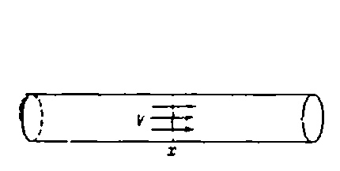

$\begin{array}{c} \vdots \\ \vdots \\ \vdots \\ \vdots \\ \vdots \\ \vdots \\ \vdots \\ \vdots \\ \vdots \\ u_i + Vu_x = 0 \\ (\textit{SpaBhenue nepenoca nep8ozo nops@ka}) \\ \vdots \\ u(x,0) = 0 \end{array}$ ФІГ. 15.1. Кількість речовини, що транспортується за одну секунду через поперечний розріз у точці x шляхом конвекції, становить $Vu\left( v,\ t \right).$ Фіг. 15.2. Проблема суто конвективного переносу.

2. Поток, обусловленный диффузией. ${\it Диффузионный поток}$ речовини зліва направо через переріз у заданій точці дорівнює - $Du_x(x, t)$ , де D — коефіцієнт дифузії.

Якщо підставити ці два вирази у закон збереження з лекції 3, отримаємо базове диференціальне рівняння в частинних похідних

$$

u_t = Du_{xx} - Vu_x.

$$

Щоб зрозуміти, як конвективний член впливає на природу рішення, спочатку розглянемо лише конвективний механізм переносу. Типовим прикладом є проблема скидання речовини в річку (швидкість течії річки V). Нехай x — це відстань нижче за течією від місця скидання. Якщо речовина не дифундує у воді, то концентрація u(x, t) речовини є розв'язком наступної проблеми (рис. 15.2):

(УЧП)

$$

u_t = -Vu_x

$$, $0 < x < \infty$ , $0 < t < \infty$ , $(\Gamma Y)$ $u(0, t) = P \leftarrow$ Постоянная концентрация в месте сброса,

(НУ) $u(x, 0) = 0 \leftarrow$ Чистая река в начальный момент.

Перед розв'язуванням проблеми слід подумати, яким має бути її рішення. Очевидно, забруднення річки

(кількість речовини у воді) спочатку буде нуль, а потім, підтримувана константою x=0, рухатиметься вниз за течією зі швидкістю V. Щоб переконатися в цьому, розв'яжемо задачу (15.1). Оскільки рівняння (15.1) є лінійним, а гранична умова також лінійна, можна сподіватися розв'язати цю задачу методом розділення змінних або методом інтегральних перетворень. Однак, оскільки координата x тут не обмежена, метод розділення змінних не застосовується. Використайте трансформацію Лапласа у часі t.

#### Розв'язок рівняння транспорту за допомогою перетворення Лапласа

С помощью преобразования Лапласа

$$

U(x) = \int_{0}^{\infty} u(x, t) e^{-st} dt

$$

задачу конвективного переноса (15.1) можно свести к виду $sU(x) = -V \frac{dU}{dx}, \quad 0 < x < \infty$ $U(0) = P/s$ .

Решая эту очень простую задачу Коши, получаем $U(x) = Pe^{-(sx/V)}/s$ .

Використовуючи таблиці обернених перетворень, ми знаходимо розв'язок задачі $u(x, t) = \mathcal{L}^{-1}[U] = PH(t-x/V),$ где Н (ξ) -- ступенчатая функция Хевисайда

$$

H(\xi) = \begin{cases} 0, & \xi < 0, \\ 1, & \xi \geqslant 0. \end{cases}

$$

Отже, розв'язок нашої проблеми можна надати такій формі:

$$

u(x, t) = \begin{cases} 0, &t < x/V, \\ P, & t \ge x/V. \end{cases}

$$

Звісно, все дуже просто! Не складніше, ніж кинути щось на конвеєр і спостерігати, як це рухається. Однак ситуація стає дуже цікавою, якщо домішки розповсюджуються в середовище. Щоб зрозуміти, що відбувається з рухомою хвилею у присутності дифузії, розв'яжемо

следующую задачу

(15.2)

$$
u_t = Du_{xx} - Vu_x, \quad -\infty < x < \infty,
$$

u(x, 0) = 1 - H(x), \quad -\infty < x < \infty.

$$

где, как обычно, H(x) — функция Хевисайда Начальное распределение концентрации изображено на рис 15 4.

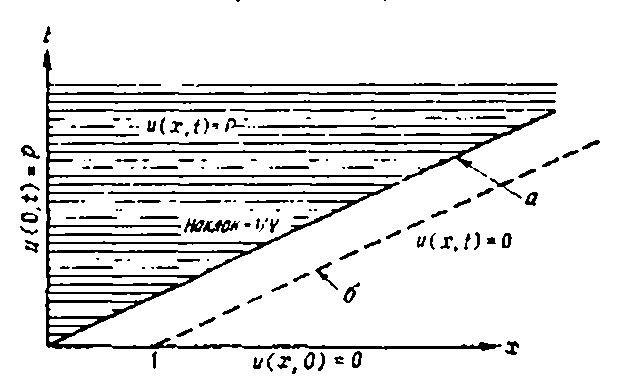

Рис. 15.3 Конвективная волна a—передиції фронт примеси,  $\delta$ —на одну единицу вперед волнового фронта

Обратим внимание на то, что в задаче (15.2) мы отодвинули границу в —  $\infty$  (теперь решается задача Коши), так что она не оказывает теперь влияние на оценку решение. Чтобы решить задачу (15.2), можно воспользоваться преобразованием Лапласа Р И С

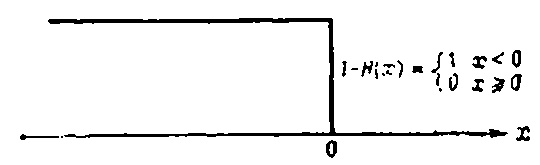

. 15 4 Начальные условия в задаче конвективной диффузии.

ло переменной t или преобразованием Фурье по переменной x. Однако в этом случае гораздо интереснее поступить совсем по-другому Введем новую систему координат, которая движется вдоль старой со скоростью V. Другими словами, вместо системы координат, привязанной к берегу реки, мы рассмотрим систему координат, которая движется со скоростью фронта примеси (конечно, при налични диффузии фронт будет «смазан»). С точки зрения математики это означает, что мы заменяем пространственную координату x на новую  $\xi = x - Vt$ .

Теперь ясно, что

когда  $\xi = 0$ , мы находимся па фронте распространяющейся примеси.

когда  $\xi = 1$ , мы находимся на одну единицу длины впереди фронта.

когда  $\xi = -1$ , мы находимся на одну единицу длины позади фронта.

Наша задача — преобразовать исходную задачу с НУ

$$

\begin{array}{llll} (\mathrm{Y} + \Pi) & u_t = Du_{xx} - Vu_x, & -\infty < x < \infty, \\ (\mathrm{H} \mathrm{Y}) & u(x, 0) = 1 - H(x), & -\infty < x < \infty, \end{array}

$$

в новую задачу в движущейся системе координат, решить новую задачу, а затем полученное решение преобразовать к старым координатам (x, t). Проведем сначала замену переменных (замену независимых переменных). Вместо старых координат (x, t) вводим новые  $(\xi, \tau)$  по формулам

$$

\xi = x - Vt,

$$ \tau = t.

$$

Слід зазначити, що літери $\tau$ і t позначають одну й ту ж Ведичіну. Такі позначення вводяться для уникнення

плутанина у наступних формулах. Записати диференціальне рівняння в похідних у нових координатах (\ $, т), мы воспользуемся следующими формулами перехода;


$$
u(x, 0) = 0, \quad 0 \le x \le 1.
$$


 u_{x} = u_{\xi} \, \xi_{x} = u_{\xi},


$$
\frac{d^2 W}{dx^2} - s W(x) = 0,
$$


Функциональная диаграмма на рис. 15.5 делает эти формулы совсем очевидными. Эта диаграмма особенно полезна при вычислении частных производных функций и и и по переменным Р И С

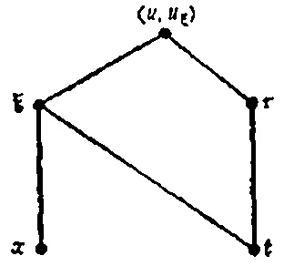

15.5 Диаграмма, иллюстрирующая функциональную зависимость переменных

 $ \xi $  и  $ \tau $ , поскольку  $ \xi $  зависит и от x, и от t. Переменная  $ \tau $  зависит только от t. Это все, что касается преобразований. Теперь подставим найденные выражения  $ u_t $ ,  $ u_x $  и  $ u_{vx} $  в уравнение (15 2) и получим


$$
W(0) = 0, \quad W(1) = \frac{1}{s}.
$$


откуда


$$
W(x, s) = \frac{1}{s} \cdot \frac{\sinh(x \sqrt{s})}{\sinh(\sqrt{s})}.
$$

.

Следовательно, новая задача с начальным условием в персменных  $ \xi $  и  $ \tau $  имеет вид

(УЧП) 


$$
w(x, t) = x + \frac{2}{\pi} \sum_{n=1}^{\infty} \frac{(-1)^n}{n} e^{-(n\pi)^2 t} \sin(n\pi x).
$$


(НУ)  $ u(\xi, 0) = 1 - H(\xi), \quad -\infty < \xi < \infty. $ 

Так как  $ \xi = x $  при t = 0, то новые граничные условия совпадают со старыми. Эта задача была решена в лекции 12 с помощью интегрального преобразования Фурье, и ее решение записывается в виде


$$
\frac{d^2 U}{dx^2} - s U(x) = 0,
$$


где  $ \phi(\beta) $  — начальное условие. Следовательно, в нашем случае


$$
U(0) = 0, \quad U(1) = F(s).
$$


После подстановки


$$
U(x, s) = F(s)\cdot \frac{\sinh(x \sqrt{s})}{\sinh(\sqrt{s})}.
$$


получаем окончательный результат

(15.3) 


$$
U(x, s) = F(s) \cdot \left( \mathcal{L}[w_t] \right).
$$


Графики этого решения для различных моментов времени изображены на рис. 15.6. Осталось сделать последний шаг — записать решение нашей задачи в координатах x и t. Подставляя


$$
\mathcal{L}[w_t] = s W - w(x, 0),
$$

,  $ \tau = t $ 

в формулы (15.3), получаем

(15.4) 


$$
u(x, t) = \mathcal{L}^{-1}\{F(s)\cdot \mathcal{L}[w_t]\}.
$$


Перед нами решение задачи конвективной диффузии (15.2). Его очень легко интерпретировать, если представить, что мы движемся относительно графика, изображенного на рис. 15.6.

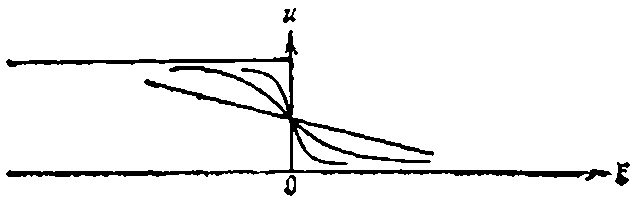

Рис. 15.6. Диффузня из области высокой концентрации в область низкой концентрации. Чем больше коэффициент диффузии, тем быстрее установится стационарное значение.

Другими словами, в зависимости от относительной величины D (коэффициента диффузии) и V (скорости потока) решение движется слева направо со скоростью V и в то же самое время передний фронт расплывается со скоростью, определяемой величиной D.

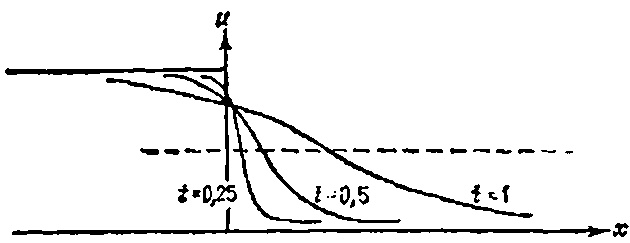

Рис. 15.7. Решение задачи конвективнои диффузии. Вещество одновременно движется и диффундирует.

(На рис. 15.7 показано, как расплывается передний фронт концентрации.)
#### ЗАУВАЖЕННЯ Преобразование координат является важным методом решения уравнений с частными производными. Выбрав подходящую систему координат, можно существенно упростить уравнение.
#### ЗАДАЧІ
1. Решите задачу Коши:


$$
u(x, t) = \mathcal{L}^{-1}[F(s)] * \mathcal{L}^{-1}[w_t].
$$


2. Найдите решение задачи Коши для уравнения конвективной диффузии:


$$
u(x, t) = f(t) * w_t(t),
$$


Воспользуйтесь преобразованием из лекции 8.

3. Найдите решение задачи переноса:


$$
u(x, t) = \int_0^t w_t(x, t-\tau)\, f(\tau)\, d\tau.
$$


Проверьте ваш ответ.

4. Решите задачу


$$
u(x, t) = \int_{0}^{t} w(x, t-\tau)\, f'(\tau)\, d\tau + f(0)\, w(x, t).
$$


 u(x, 0) = e^{-x^2}, \quad -\infty < x < \infty.


$$
\overline{B}^2 - 4\overline{A}\overline{C} = (B^2 - 4AC)\,(\xi_x \eta_y - \xi_y \eta_x)^2
$$


\begin{array}{llll} (\text{HV}) & u_{\tau} = Du_{\xi\xi}, & -\infty < \xi < \infty, & 0 < \tau < \infty, \\ (\text{HV}) & u(\xi, 0) = e^{-\xi^2}, & -\infty < \xi < \infty, \end{array}


$$
\overline{B} = 2\left( \overline{A}\,\xi_x + \overline{C}\,\xi_y \right)
\left( \overline{A}\,\eta_x + \overline{C}\,\eta_y \right).
$$


u(\xi, \tau) = \frac{1}{2\sqrt{D\pi\tau}} \int_{-\infty}^{+\infty} e^{-\beta^2} e^{-(\xi-\beta)^2/4D\tau} d\beta.


$$
\overline{B} = 2\sqrt{\overline{A}} \left[ \sqrt{\overline{A}}\, \eta_x + \sqrt{\overline{C}}\, \eta_y \right].
$$


u_{tt} = \alpha^2 u_{xx}


$$
u_{xx} + 2u_{xy} + u_{yy} = 0.
$$


\begin{split} u_{tt} &= \alpha^2 u_{xx} + F\left(x, \ t\right), \\ u_{tt} &= \alpha^2 u_{xx} - \beta u_t - \lambda u + F\left(x, \ t\right). \end{split}


$$
\frac{dy}{dx} = -\frac{\xi_x}{\xi_y} = \frac{B}{2A} = 1.
$$


Т \сін \theta_2 - Т \сін \theta_1 =


$$
u(\xi, 0) = 1 - H(\xi), \quad -\infty < \xi < \infty.
$$


\Delta x \rho u_{tt} = T \left[ u_x \left( x + \Delta x, \ t \right) - u_x \left( x, \ t \right) \right] + \Delta x F \left( x, \ t \right) - \Delta x \beta u_t \left( x, \ t \right) - \Delta x \gamma u \left( x, \ t \right)


$$
u(\xi, \eta) = \eta f(\xi) + g(\xi),
$$


u_{tt} = \alpha^{2} u_{xx} - \beta u_{t} - \gamma u + F(x, t).


$$
u(x, y) = y f(y - x) + g(y - x).
$$


(16.2) u_{tt} = \alpha^2 u_{xx},


$$
u(x, y) = y \sin(y - x) + (y - x)^2.
$$


u_{tt} = ku_{xx}


$$
A u_{xx} + B u_{xy} + C u_{yy} + D u_x + E u_y + F u = G
$$


u_{tt} = \frac{\partial}{\partial x} [\alpha^2(x) u_x],


$$
u_t = u_{xx} - 2u_x, \quad -\infty < x < \infty, \quad 0 < t < \infty,
$$


u(x, 0) = f(x)


$$
u(x, 0) = \sin x, \quad -\infty < x < \infty.
$$


i_x + Cv_t + Gv = 0, \\ v_x + Li_t + Ri = 0,


$$
\frac{dy}{dx} = \frac{B - \sqrt{B^2 - 4AC}}{2A}.
$$


i_{xx} + Gv_x - CLi_{tt} - CRi_t = 0.


$$
\xi(x, y) = \text{const}, \quad \eta(x, y) = \text{const}.
$$


v_{x} = -Li_{t} - Ri,


$$
\frac{dy}{dx} = -\sqrt{-4x^2} = -2ix.
$$


i_{xx} = CLi_{tt} + (CR + GL)i_t + GRi.


$$
\text{(узагальнене рівняння у нових змінних)}
$$


v_{xx} = CLv_{tt} + (CR + GL)v_t + GRv.


$$
y^2 u_{xx} + x^2 u_{yy} = 0,
$$


v_{tt} = \alpha^2 v_{xx}, \\ i_{tt} = \alpha^2 i_{xx}, \qquad \alpha^2 = 1/CL,


$$
B^2 - 4AC = -4x^2 y^2,
$$


u_{tt} = u_{xx} - u_t


$$
\frac{dy}{dx} = \frac{B + \sqrt{B^2 - 4AC}}{2A} = \frac{\sqrt{-4x^2 y^2}}{2y^2} = i \frac{x}{y}.
$$


\begin{cases} u(0, t) = 0, & 0 < t < \infty, \\ u(1, t) = 0, & 0 < t < \infty, \end{cases}


$$
y^2 + i x^2 = \text{const}.
$$


\begin{cases} u(x, 0) = \sin(\pi x), & 0 \le x \le 1, \\ u_t(x, 0) = 0. & 0 \le x \le 1, \end{cases}


$$
\xi = y^2 + i x^2, \quad \eta = y^2 - i x^2.
$$


\begin{aligned} & (\text{УЧП}) & u_{tt} = u_{xx}, & 0 < x < 1, \\ & (\text{GU}) & \begin{cases} u(0, t) = 0, & 0 < t < \infty, \\ u(1, t) = \sin t, & 0 < t < \infty, \end{cases} \\ & (\text{NU}) & \begin{cases} u(x, 0) = 0, & 0 \le x \le 1, \\ u_t(x, 0) = 0 \end{cases}


$$
\begin{cases}
u_{tt} = \alpha^2 u_{xx} + F(x,t), \\
u_{tt} = \alpha^2 u_{xx} - \beta u_t - \lambda u + F(x,t).
\end{cases}
$$


u(x, t) = e^{ax+bt}


$$
\overline{A}u_{\xi\xi} + \overline{B}u_{\xi\eta} + \overline{C}u_{\eta\eta} + \overline{D}u_{\xi} + \overline{E}u_{\eta} + \overline{F}u = \overline{G}.
$$


(\text{УЧП}) \qquad u_{tt} = c^2 u_{xx}, \quad -\infty < x < \infty, \quad 0 < t < \infty,


$$
u_{tt} = c^2 u_{xx}.
$$


Эта задача описывает движение бесконечной струны с заданными начальными условиями. Она была решена в 1750 году французским математиком Даламбером. Формула Даламбера


$$
\text{Сила} \approx T \left[ u_x(x + \Delta x, t) - u_x(x, t) \right].
$$


позволяет легко найти решение, если известны начальные условия. Кроме того, она позволяет дать интересную физическую интерпретацию решения на языке бегущих волн.

Как, наверное, помнит читатель, в параболническом случае мы сначала решали диффузионные задачи на конечном отрезке (методом разделения переменных), а уже затем перешли к неограниченным промежуткам (—  $ \infty < x < \infty $ ), где применяли преобразование Фурье. В гиперболическом случае мы поступим наоборот. Начнем с решения одномерного волнового уравнения на всей действительной оси, т. е. с задачи Коши

(17.1) 


$$
\rho u_{tt} = T u_{xx} + F(x,t) - \beta u_t - \gamma u.
$$


 (17.1) \quad (\text{НУ}) \quad \begin{cases} u(x, 0) = f(x), \\ u_{t}(x, 0) = g(x), \end{cases} \quad -\infty < x < \infty,


$$
\int_a^b f(x)\,dx
$$


\xi = x + ct,


$$

$$


то уравнение


$$
u_{tt} = \alpha^2 u_{xx}, \quad \alpha^2 = \frac{T}{\rho}
$$


преобразуется в уравнение


$$
u_{tt} = \alpha^2 u_{xx}
$$

.

В этом легко убедиться, если воспользоваться формулами преобразования координат:

(17.2) 


$$
\int_a^b f(x)\,dx
$$


Подставляя эти выражения для производных в волновое уравнение, получим


$$
R = \{(x,y): a \le x \le b,\; 0 \le y \le \max f(x)\}
$$

.. Первый шаг сделан.

ШАГ 2 (Решение преобразованного уравнения).

Преобразованное уравнение легко решить двумя последовательными интегрированиями (сначала по переменной ξ, а затем по η). После интегрирования по ξ получаем


$$
\rho(x)\,u_{tt} = \frac{\partial}{\partial x}\left( T \frac{\partial u}{\partial x} \right)
$$


 — произвольная функция от  $ \eta $ .

Интегрирование последнего соотношения по **η** приводит к общему решению


$$
u(x,t) = e^{-(x - ct)^2}
$$


где  $ \phi(\eta) $  — первообразная функция  $ \phi_1(\eta) $ , а  $ \psi(\xi) $  — произвольная функция. Итак, общее решение уравнения


$$
\int_a^b \left( \frac{\partial F}{\partial u} \eta(x) + \frac{\partial F}{\partial u'} \eta'(x) \right) dx = 0
$$


записывается в виде

(17.3) 


$$
\frac{\partial F}{\partial u} - \frac{d}{dx}\left( \frac{\partial F}{\partial u'} \right) = 0
$$


где  $ \phi(\eta) $  и  $ \psi(\xi) $  — произвольные функции своих аргументов. Папример, читатель может проверить, что функции


$$
\frac{\partial F}{\partial y} - \frac{d}{dx}\!\left(\frac{\partial F}{\partial y'}\right) = 0
$$


 $ u(\xi, \eta) = 1/\eta + tg \xi, $  $ u(\xi, \eta) = \eta^2 + e $ 

являются решениями уравнения  $ u_{\mathrm{ }nh}=0 $ . Второй шаг сделан.

 $ \text{IIIA}\Gamma $  3 (Возвращение к старым координатам x и t).

Для нахождения общего решения, т. е. всех решений уравнения  $ u_{tt} = c^2 u_{xx} $ , подставим


$$

J[y] = \int_{0}^{1} [y^{2} + y'^{2}] dx.

$$


 n = x + ct


$$
F_y - \frac{d}{dx} F_{y'} = 0,
$$


u(\xi, \eta) = \varphi(\eta) + \psi(\xi).


$$
\begin{aligned}
F_y &= 2y, \\
F_{y'} &= 2y'.
\end{aligned}
$$


u(x, t) = \varphi(x-ct) + \psi(x+ct).


$$
2y - \frac{d}{dx}(2y') = 0,
$$


u(x, t) = \sin(x-ct)


$$
y'' - y = 0.
$$


u(x, t) = (x + ct)^2


$$
\overline{y}(x) = 0.42e^x - 0.42e^{-x}
$$


u(x, t) = \sin(x - ct) + (x + ct)^2


$$
J[y] = \int_a^b y \sqrt{1 + y'^2} \, dx,
$$


u(x, t) = \varphi(x - ct) + \psi(x + ct)


$$
u_1(x, 0) = 0.
$$


u(x, 0) = f(x),


$$
\overline{y}(x) = \alpha \operatorname{ch}\left(\frac{x - \beta}{\alpha}\right),
$$


\varphi(x) + \psi(x) = f(x), \\ -c\varphi'(x) + c\psi'(x) = g(x).


$$
\overline{y}(x) = 0.42e^x - 0.42e^{-x}
$$


-c\varphi(x) + c\psi(x) = \int_{x_0}^{x} g(\xi) d\xi + K.


$$
J[y] = \int_0^1 (y^2 + y'^2)\,dx,
$$


\psi(x) = \frac{1}{2} f(x) + \frac{1}{2c} \int_{x_0}^{x} g(\xi) d\xi + K/2c,


$$
u_t(x, 0) = 0.
$$


Следовательно, общее решение задачи (17.1) дается формулой

(17.8) 


$$

$$


Цель достигнута. Мы получили общее решение вадачи (17.1). Решение вида (17.8) принято называть формулой Даламбера. Читателю предлагается самостоятельно проследить за расстановкой пределов интегрирования, чтобы убедиться в том, что они меняются от x-ct до x+ct. Задача полностью решена.

Прежде чем завершить лекцию, приведем несколько примеров, показывающих, как применять формулу Даламбера в конкретных валачах.

## Примеры применения формулы Даламбера

## 1. Движение синусондальной волны

Рассмотрим начальные условия вида


$$
\int\limits_{t_1}^{t_2} J[u] = \iint\limits_D F(x, y, u, u_x, u_y)\,dx\,dy,
$$


 $ u_t(x,  0) = 0. $ По формуле Даламбера получаем решение


$$
F_u - \frac{\partial}{\partial x}F_{ux} - \frac{\partial}{\partial y}F_{uy} = 0.
$$


Его можно интерпретировать следующим образом. Начальное смещение струны  $ u(x, 0) = \sin x $  делится на две одинаковые части


$$
J[y] = \int_{0}^{1} \sqrt{1 + y'^{2}}\,dx.
$$


 H  $ \frac{\sin x}{2} $ .

Каждая из частей распространяется со скоростью с в виде бегущих волн. Одна из волн перемещается слева направо, а вторая—в противоположном направлении. Читателю предлагается подумать над тем, как выглядит в этом случае результирующая волна.

# 2. Распространение простейшего прямоугольного импульса

В этом случае начальные условия задаются следующим образом:


$$
\int_{t_{1}}^{t_{2}} (KE - PE)\,dt = \frac{1}{2} \int_{t_{1}}^{t_{2}} (m\dot{y}^{2} - ky^{2})\,dt
$$


 $ u_t(x, 0) = 0 $  (в остальных точках).

Поскольку начальное смещение расшепляется на две полуволны, движущиеся в противоположных направлениях, результирующее движение будет таким, как показано на рис. 17.2.


Рис. 17.2. Начальное возмущение распадается на две бегущие волны.

#### 3. Задана начальная скорость

Предположим теперь, что в начальный момент струна находится в положении равновесия. Придадим струне начальную скорость (как в фортепиано) вида  $ \sin x $ , т. е.


$$
J[y] = \int_{0}^{\pi/2} (y'^{2} - y^{2})\,dx
$$


 u_t(x, 0) = \sin x.


$$

u_t = Du_{xx} - Vu_x

$$


u(x, t) = \frac{1}{2c} \int_{x-ct}^{x+ct} \sin \xi \, d\xi = \frac{1}{2c} \left[ \cos (x+ct) - \cos (x-ct) \right].


$$

u_t = Du_{xx} - Vu_x

$$


(\text{УЧП}) \qquad u_{tt} = u_{xx}, \quad -\infty < x < \infty, \quad 0 < t < \infty, \\ (\text{HV}) \qquad \left\{ \begin{array}{llll} u(x, \ 0) = e^{-x^2} \\ u_t(x, \ 0) = 0. \end{array} \right. \quad -\infty < x < \infty, \\ \end{array}


$$

$$


u_{tt} = u_{xx}, -\infty < x < \infty, 0 < t < \infty,


$$

u_t = Du_{xx} - Vu_x.

$$


\begin{cases} u(x, 0) = 0, \\ u_t(x, 0) = xe^{-\lambda^2}, -\infty < x < \infty, \end{cases}


$$

u_t = -Vu_x

$$


J[u] = \iint_D F(x, y, u, u_x, u_y)\,dx\,dy,


$$

U(x) = \int_{0}^{\infty} u(x, t) e^{-st} dt

$$


F_u - \frac{\partial}{\partial x}F_{ux} - \frac{\partial}{\partial y}F_{uy} = 0.


$$

H(\xi) = \begin{cases} 0, & \xi < 0, \\ 1, & \xi \geqslant 0. \end{cases}

$$


u(x,t)=\frac{1}{2}\big[f(x-ct)+f(x+ct)\big]+\frac{1}{2c}\int_{x-ct}^{x+ct} g(\xi)\,d\xi


$$

u(x, t) = \begin{cases} 0, &t < x/V, \\ P, & t \ge x/V. \end{cases}

$$


u_{tt} = c^2 u_{xx}, \quad -\infty < x < \infty,\quad t > 0


$$
u_t = Du_{xx} - Vu_x, \quad -\infty < x < \infty,
$$


u(x,0)=0,\quad u_t(x,0)=g(x).


$$
u(x, 0) = 1 - H(x), \quad -\infty < x < \infty.
$$


u_1(x,y)=a_1xy(1-x)(1-y),


$$

$$


і так далі.

Відповідний функціонал:


$$

$$


Умови мінімуму:


$$

\begin{array}{llll} (\mathrm{Y} + \Pi) & u_t = Du_{xx} - Vu_x, & -\infty < x < \infty, \\ (\mathrm{H} \mathrm{Y}) & u(x, 0) = 1 - H(x), & -\infty < x < \infty, \end{array}

$$


Після цього задача зводиться до системи лінійних алгебраїчних рівнянь для коефіцієнтів $ a_1,\dots,a_n $.

Розв’язавши систему, отримуємо наближений розв’язок задачі.

# ЗАУВАЖЕННЯ

1. У цій лекції методом Рітца мінімізувався функціонал, що залежить від функції двох змінних. Аналогічно можна мінімізувати функціонали інших типів, наприклад:


$$

\xi = x - Vt,

$$


2. Для хвильового рівняння


$$

\tau = t.

$$


з граничними та початковими умовами:


$$
\begin{cases} u_{\xi\xi} - u_{\eta\eta} = \Psi(\xi, \eta, u, u_{\xi}, u_{\eta}) & \text{(две канонические формы для гиперболического уравнения),} \end{cases}
$$


розв’язок будується за допомогою формули Д’Аламбера.
# Розв’язання задачі для напівнескінченної струни за допомогою формули Д’Аламбера

Наше завдання — знайти хвильові рухи напівнескінченної струни, лівий кінець якої закріплений, за заданих початкових умов. Для розв’язання задачі (18.6) ми використаємо той самий метод, що й при знаходженні загального розв’язку хвильового рівняння на всій прямій.

Замість загального розв’язку


$$
$
- 2.  $u_{\eta\eta} = \Phi(\xi, \eta, u, u_{\xi}, u_{\eta})$  (каноническая форма параболического уравнения),
- 3.  $u_{\xi\xi} + u_{\eta\eta} = \Phi(\xi, \eta, u, u_{\xi}, u_{\eta})$  (каноническая форма эллиптического уравнения),

где  $\Phi$  и  $\Psi$ —функции от частных производных первого порядка, зависимой переменной u и новых независимых переменных  $\xi$  и  $\eta$ . Конкретный вид функций  $\Phi$  и  $\Psi$  зависит от исходного уравнения.

У читателя может возникнуть мысль, что глава, посвященная классификации уравнений, должна размещаться в самом начале книги. Вероятно, это правильно, и многие книги действительно начинаются с этого материала. Однако правда и то, что многие студенты не могут с энтузиазмом изучать нечто такое, о чем у них нет никакого представления. Именно по этой причине мы отложили изучение темы, посвященной классификации уравнений с частными производными, до настоящего момента.

Наша задача - классифицировать все уравнения вида

(23 1) 
HIDEfb8bc5029ff54a52b8d10a1ff31175d1X

где A, B, C, D, E, F и G—вообще говоря, функции [x и y. Согласно предлагаемой схеме классификации уравнение называется

1) гиперболическим в точке  $(x_0, y_0)$ , если  $B^2(x_0, y_0) - 4A(x_0, y_0) \times$  $\times C(x_0, y_0) > 0$ 2) параболнческим в точке  $(x_0, y_0)$ , если  $B^2(x_0, y_0) - 4A(x_0, y_0) \times C(x_0, y_0) = 0$ ,

3) эллиптическим в точке  $(x_0, y_0)$ , если  $B^2(x_0, y_0) - 4A(x_0, y_0) \times$  $\times C(x_0, y_0) < 0$ и в зависимости от типа его можно привести к одной из канонических форм. Для того чтобы было легче разобраться в классификационной схеме, мы приведем четыре примера гиперболических, параболических и эллиптических уравнений.

## Примеры гиперболических, параболических и эллиптических уравнений 10

1. У равнение теплопроводности  $u_t = u_{xx}$  — линейное уравнение второго порядка вида (23.1) с коэффициентами

HIDE9d33cabb0bfd45f0a9305c41aa3b1facX,  $B=0$ ,  $C=0$ ,  $D=0$ ,  $E=-1$ ,  $F=0$ ,  $G=0$ ,

так что  $B^2-4AC=0$  при всех x и t. Следовательно, это уравнение будет параболическим при всех x и t. В общем уравнении (23 1) переменная y играет роль времени t. Результат не изменится, если в общем уравнении поменять местами x и y.

2. Волновое уравнение  $u_{tt} = u_{xx}$  также принадлежит классу уравнений вида (23.1) с коэффициентами

HIDE8fcddf2675cc4b71bba929d4a1b6c8b3X,  $B=0$ ,  $C=-1$ ,  $D=E=F=G=0$ .

Так как  $B^2 - 4AC = 4$  для всех x и t, то это уравнение является еиперболическим при всех x и t.

<sup>1)</sup> Следует указать, что приведенные в примерах уравнения являются частными случаями более общих параболических, гиперболических в эллиптических уравнений, а основные их свойства характерны и для общего случая.

3. У равнение Лапласа  $u_{xx} + u_{yy} = 0$  является эллиптическим при всех x и y, так как  $B^2 - 4AC = -4 < 0$ .

4. Линейное уравнение  $xu_{xx} + u_{yy} = \sin x$  с переменными коэффициентами также принадлежит классу уравнений вида (23.1), но для него  $B^2-4AC=-4x$  и, следовательно, уравнение будет эллиптическим при x > 0,

лараболическим при x=0, гиперболическим при x < 0.

Этот пример иллюстрирует тот факт, что тип уравнения о переменными коэффициентами может изменяться от точки к точке.

Читатель должен обратить внимание на следующее: тип уравнения (23.1) определяется только коэффициентами при вторых првизводных и никак не зависит ни от коэффициентов при первых производных и самой функции, ни от свободного члена.

Обратимся теперь к главной теме нашей лекции — приведению гиперболических уравнений к каноническому виду. Известно, что если в данной области пространства уравнение является гиперболическим, то вместо x и y можно ввести координаты  $\xi$  и  $\eta$ (характеристические переменные) таким образом, что уравнение примет простейшую форму

(23.2) 
HIDE4897d3da5fa44a5fadb142d94fa3f865X

Это уравнение содержит только одну производную второго порядка  $u_{\xi\eta}$ , а функция  $\Phi(\xi,\eta,u,u_{\xi},u_{\eta})$  зависит только от новых независимых переменных § и η, зависимой переменной и и первых производных из и ип. Конкретный вид функции Ф зависит, конечно, от исходного уравнения и формул перехода к новым координатам § и п. Научимся отыскивать эти функции.

## Каноническая форма гиперболического уравнения

Рассмотрим уравнение общего вида

(23.3) 
HIDE5df35f98519b44659c7948663f913225X

и пусть в интересующей нас области  $B^2 - 4AC > 0$ . Нам нужно ввести новые координаты 1)

HIDEa2b880b240bf486cb5b89ccf7a12f2a3X

HIDE30401513a9c84b9989580375043f6c1eX

так, чтобы в уравнении (23.3) осталась только одна частная производная второго порядка  $u_{\xi\eta}$  (не следует пытаться искать такую замену переменных, с помощью которой гиперболическое уравне-

<sup>1)</sup> Необходимо, чтобы это преобразование координат было локально обратимо и дважды дифференцируемо. — Прим. ред.

ние можно было бы привести и параболической или заливитической канонической форме, это невозможно сделать).

Вычислим сначала частные производные

HIDE135f51d8fda84f4f958d34db49d2090eX

Подставляя эти соотношения в исходное уравнение (23.3), после простых, но громоздких вычислений получаем

(23.5) 
HIDE5e23b397d4b045a69b74efb75c46cab6X

HIDE5899905179b147ca8e340b7c9898963aX

HIDEf9450d5febda42478133f97f77cfdd3eX

HIDEc783a67f61644357b406a7532b8c9891X

HIDEaddf0efef7324453a8bef2849b350130X

HIDE6eaa974954f7409e93ecee9fb89701d0X

HIDE50f7ce6550a546869925cf9c0e728e96X

HIDEc479b6f0633a4524b4fcc414291465c2X

Читателю предоставится возможность проделать эти выкладки при решении задач.

Наш следующий шаг—выбрать функции  $\xi = \xi(x, y)$  и  $\eta = \eta(x, y)$  таким образом, чтобы коэффициенты  $\overline{A}$  и  $\overline{C}$  обратились в нуль. Это позволит нам привести исходное уравиение к канонической форме. Итак, необходимо потребовать, чтобы

HIDE0618fe4f24124787bb43f040085aa53cX $\bar{C} = A\eta_x^2 + B\eta_x\eta_y + C\eta_y^2 = 0.$ Эти уравнения можно представить в виде

HIDE3509de91ebc6497b92a90c513a2da785X

Разрешив их относительно  $[\xi_x/\xi_y]$  и  $[\eta_x/\eta_y]$ , получаем

(23.7) 
HIDE1d0acc9321554135a87cbf9c3f9fcab8X
 (характеристические 
HIDE0d6595ca21d2463695c69a2894c25ac7X
 уравнения).

Kaждое из квадратных уравнений для  $[\xi_x/\xi_y]$  и  $[\eta_x/\eta_y]$  имеет два кория, но мы оставляем только по одному, но так чтобы они были различны.

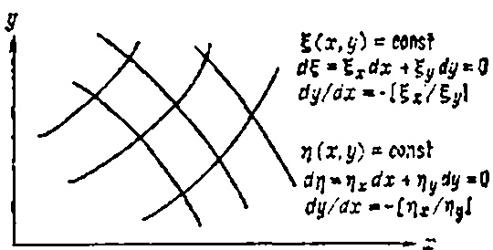

РИС. 23.1. Характеристики  $\xi(x, y) = c$  и  $\eta(x, y) = c$ .

Задача свелась к нахождению двух функций  $\xi(x, y)$  и  $\eta(x, y)$ , таких, чтобы отношения  $[\xi_x/\xi_y]$  и  $[\eta_x/\eta_y]$  удовлетворяли уравнению (23.7). Найти такие функции очень просто 1), если обратить внимание на рис. 23.1. Чтобы понять, каким образом можно это сделать, рассмотрим простое уравнение

HIDEcc25c44137954a1f80362d8df3edd229X

Его характеристики определяются из уравнений

HIDE176fc00827c34eae963c61b605f8a83dX

Решая эти уравнения относительно у, получаем

HIDEf179ccca5a3c4d0aa9ea6307d26d65adX

HIDEc2c6bf66abf14fddb75926ecd2f7c527X

Чтобы найти  $\xi$  и  $\eta$ , разрешим полученные уравнения относительно констант  $c_1$  и  $c_2$ , оставляя их в правой части и перенося остальные слагаемые в левую.

Выражения, стоящие в левых частях, примем за искомые функции § и пр

HIDE7c9d42168aec4ce28500d177ccfa1b4fX

HIDE5a66907e61a447e5993c1ce328da7877X

<sup>1)</sup> См., например, Тихонов А. Н., Самарский А. А. Уравнения математической физики. — М.: Наука, 1972 и др. издания. — Прим. ред.

Очевидно, введенные таким образом функции  $\xi$  и  $\eta$  удовлетворяют уравнениям характеристик. Эти новые координаты изображены на рис. 23.2. На этом мы заканчиваем обсуждение вопроса о том, как найти новые координаты. Осталось последнее — определить новый вид исходного уравнения.

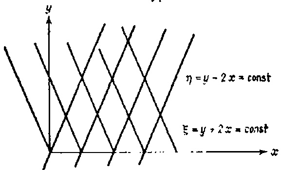

РИС. 23.2. Характеристические координаты для уравнения  $u_{xx} - 4u_{yy} + u_x = 0$ .

Это совсем просто: чтобы найти каноническую форму уравнения с частными производными, подставим новые координаты  $\xi(x,y)$  и  $\eta(x,y)$  в уравнение

HIDEbcb0b096cf57498fad6a8d4063f22988X,

где  $\overline{A}$ ,  $\overline{B}$ ,  $\overline{C}$ ,  $\overline{D}$ ,  $\overline{E}$ ,  $\overline{F}$  и  $\overline{G}$  определены формулами (23.6).

Прежде чем закончить лекцию, давайте на конкретном примере посмотрим, как «работает» общий метод приведения к каноническому виду.

Приведение гиперболического уравнения  $y^2u_{xx}-x^2u_{yy}=0$  к канонической форме

Рассмотрим уравнение

HIDE5852869c69ed4d15be2a0afb18c6c3deX,  $x>0$ ,  $y>0$ ,

которое является гиперболическим в первом квадранте. Найдем новые координаты таким образом, чтобы привести исходное уравнение к канонической форме.

ШАГ 1. Решаем уравнения характеристик

HIDEb824293c505344cc8b2ab56f0ea95e45X
 (напомним, что этот шаг 
HIDE36998d84cf88413fac241896e7a2a244X
 обеспечивает  $\overline{A} = \overline{C} = 0$ ),

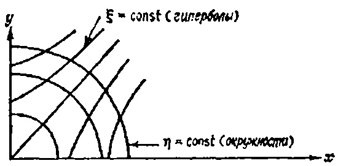

РИС, 23.3. Новые карактеристические координаты.

Проинтегрировав эти обыкновенные дифференциальные уравнения методом разделения переменных, получаем два неявных соотнощения (при желании можно было бы явно выразить у через х)

HIDE30368984962644f2afff53f5bcce62cfX

HIDE32e63ec0a2d34374832900181d4a3c82X

Следовательно, новые координаты следует вводить по формулам

HIDEfd2dad44f6a7489086f57c52e2de1bc3X,  
 $\eta = y^2 + x^2$ .

Эти новые координаты изображены на рис. 23.3. Теперь следует получить новое уравнение. Вычислим все коэффициенты

 $\overline{A} = 0$  (так и должно быть; мы специально выбирали  $\xi$  и  $\eta$  так, чтобы этот коэффициент обращался в нуль).

HIDE549b6bffb54f44d4827dada9cac8aa9aX,

 $\overline{C} = 0$  (по той же причине, что и  $\overline{A} = 0$ ),

HIDE717720c5bb504dada259d19d115196d6X

HIDE7eed2d9900ce478bb39c047f843d4b02X

HIDEf84c14a36e1e4ecfa95c1eb7ad41e948X,

HIDEc53aa386d2e749908ce323d85730daacX,

подставим их в уравнение

HIDEc89cc39e80bc48f3a0ac7a21505b89aaX

и получим

HIDEefd7948de7384207ae939013c7fba591X

ШАГ 2. Выражая, наконец, x и y через  $\xi$  и  $\eta$ , окончательно получаем

(23.8) 
HIDE8f6f156e08f548bba7f4f5bb8de65a75X

Задача решена. Теперь мы знаем, что нужно сделать, чтобы найти новые координаты и привести уравнение к канонической форме.

### ЗАМЕЧАНИЯ

1. На самом деле для гиперболических уравнений существует две канонические формы. Вторую можно получить из первов заменой переменных вида

HIDE31907986cf53480baa800fe8ab29589eX $\beta = \beta (\xi, \eta) = \xi - \eta.$ Воспользуемся этой заменой для преобразования уравнения (23.8). Так как

HIDE047108c836f1419a8816086d518efa01X

TO

(23 9) 
HIDE3faff088058842f6a76c42d8c1c32f82X

При желании можно выразить  $\alpha$  и  $\beta$  через исходные координаты x и y. В результате получаем

HIDE0b19a6eee5c8435aa8d00c96bfcf93f9X

HIDEdce93cccb5f0403e9e0ea1777e487a16X

- Читатель может спросить, зачем нужно классифицировать и приводить к канонической форме уравнения с частными производными.
  - а) Разбиение уравнений на классы гиперболических, параболических и эллиптических соответствует разбиению физических процессов на три основных класса: волновых, диффузионных и стационарных. Математические особенности решений уравнений этих трех типов совершенно различны.
  - б) В большинстве работ, посвященных решению гиперболических задач, предполагается, что исходное уравнение записано в канонической форме, т. е. в виде

HIDE3110d0e804674c6f958c501ddef5c98cX

Если у нас есть уравнение и мы хотим получить его решение, мы должны преобразовать его к канонической форме и воспользоваться известными результатами.

в) Для численного решения канонического гиперболического уравнения создано много различных программ для ЭВМ.

Функция  $\Phi$  ( $\xi$ ,  $\eta$ , u,  $u_{\xi}$ ,  $u_{\eta}$ ) вводится в  $\Theta$ ВМ в виде подпрограммы, так что сначала необходимо привести уравнение к канонической форме. После того как решение в новых координатах найдено, его всегда можно преобразовать обратно к исходным координатам.

## ЗАДАЧИ

- 1. Выясните, являются ли приведенные ниже уравнения гиперболическими, параболическими или эллиптическими:
  - a) $u_{xx}+u_{xy}=0$,
  - б) $u_{tt}=u_{xx}+u_x+hu$,
  - в) $u_{xx}+3u_{yy}=\sin x$,
  - г) $u_{xx}+u_{yy}=f(x,y)$,
  - д) $u_{rr}+\frac{1}{r}u_r+\frac{1}{r^2}u_{\theta\theta}=f(r,\theta)$.
- 2. Получите соотношения (23.4), (23.5) и (23.6).
- 3. Убедитесь в том, что уравнение

HIDEb85d8dd878bd4f6297d33ba449128029X

гиперболического типа при всех $x$ и $y$ и найдите характеристики.
- 4. Приведите уравнение из предыдущей задачи к каноническому виду

HIDE6adf9827e69c4082ac6a507aadfdac5dX

- 5. Продолжите задачу 4 и приведите уравнение ко второй канонической форме

HIDE8e4a11dfbdca4db7b5dc4d4435d3b661X

- 6. Найдите характеристики уравнения

HIDE8602ab8b7f1f43cca8dd92fce248c583X

Преобразуйте уравнение к новым координатам, решите и, вернувшись к координатам $x$ и $y$, получите решение исходной задачи.

# Лекція 24. ХВИЛЬОВЕ РІВНЯННЯ У ВІЛЬНОМУ ПРОСТОРІ (ДВОВИМІРНІ ТА ТРИВИМІРНІ ЗАДАЧІ)
МЕТА ЛЕКЦІЇ: Узагальнити формулу д'Аламбера на двовимірний і тривимірний випадки та пояснити геометричний зміст відповідних розв'язків.

Розглянемо задачу Коші для хвильового рівняння у тривимірному просторі:

HIDEc76ed1ace10d4ba1bb374de1bc46e954X

HIDE76adb99880b842abaf94634dd4fc5ab3X

Тут оператор Лапласа має вигляд

HIDEcb73f1666fea4d788cc3b161c8ead48aX

Одновимірні хвилі в просторі називають плоскими, двовимірні — циліндричними, а тривимірні — сферичними. Для сферичних хвиль роль формули д'Аламбера відіграє **формула Пуассона**.

## Формула Пуассона

Розв'язок задачі Коші у $\mathbb{R}^3$ можна подати у вигляді

HIDEa2573f5b04cc44df980af96246292d88X

де $\overline{\varphi}$ та $\overline{\psi}$ позначають середні значення початкових функцій по сфері радіуса $ct$ з центром у точці $(x,y,z)$.

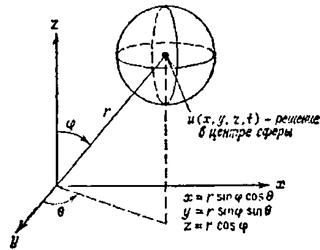

Фіг. 24.1. Середнє значення початкових даних береться по сфері радіуса $ct$.

Геометричний зміст формули простий: значення розв'язку в точці $(x,y,z)$ у момент часу $t$ залежить лише від тих початкових даних, що лежать на сфері радіуса $ct$.

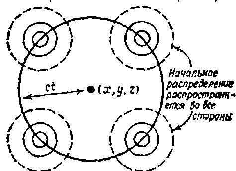

Фіг. 24.2. Початкове збурення поширюється сферично в усіх напрямках.

## Принцип Гюйгенса

Якщо початкове збурення локалізоване в обмеженій області, то в тривимірному випадку розв'язок має чітко визначений передній і задній фронт. Це означає, що після проходження хвильового фронту через точку простору вплив збурення зникає. Такий ефект називають **принципом Гюйгенса**.

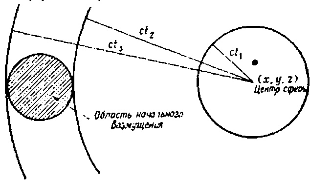

Фіг. 24.3. Точка починає реагувати лише тоді, коли сфера радіуса $ct$ перетинає область початкового збурення.

У двовимірному випадку аналогічна задача розв'язується методом спуску, але там за хвильовим фронтом лишається «хвіст», тому принцип Гюйгенса вже не виконується.

## Конформні відображення

Тепер перейдемо до одного важливого класу функцій комплексної змінної, які широко використовують у теорії потенціалу.

### Визначення

Відображення $w=f(z)$ називається **конформним** у точці $z_0$, якщо похідна $f'(z_0)\neq 0$. Якщо ця умова виконується в кожній точці області $D$, то відображення є конформним у всій області $D$.

Прості приклади:

- $f(z)=z^2$ є конформним всюди, крім точки $z=0$;
- $f(z)=e^z$ є конформним у всій комплексній площині, бо $f'(z)=e^z\neq 0$.

Головна причина, чому ці відображення важливі в задачах математичної фізики, полягає в тому, що вони переносять складні області у простіші, не руйнуючи гармонічну структуру. Саме тому рівняння Лапласа в нових координатах часто набуває зручнішого вигляду.

### Приклад: задача Діріхле у верхній півплощині

Нехай потрібно розв’язати задачу:

HIDE9e7a38c1e232482e9d222491b765a318X

із граничною умовою:

HIDE76d3f54efb6b444cb78f6d4b5c80937dX


Для переходу до простішої області використовують комплексне відображення:

HIDEe512c6d71e114503b6bc7d1700dadd16X

Це відображення переводить верхню півплощину у смугу, для якої гранична задача має простіший вигляд.


Далі:

1. Розв’язують задачу у новій області (у змінних \(w\)),
2. Повертаються до початкових змінних \(x, y\),
3. Отримують шуканий розв’язок \(\varphi(x,y)\).

### Ідея методу

- складна область → простіша область (через конформне відображення),
- розв’язання у новій області,
- зворотне відображення до початкової області.

# Лекція 25. СКІНЧЕННІ ПЕРЕТВОРЕННЯ ФУР’Є (СИНУС- І КОСИНУС-ПЕРЕТВОРЕННЯ)

ЦЕЛЬ ЛЕКЦИИ: Ввести два новых интегральных преобразования (конечные спиус- и косинус-преобразования):

HIDE14f017a61d8e4bc181ec94a3b8a48e31X
 (конечное синус-преобразование),

HIDE7a69cfa115994a3c9fc3db451936cbfdX
 (конечное косинус-преобразование),

HIDE609fcb0c74ea4f49acb6e7b8124f3415X
 (обратное синус-преобразование),

HIDEc626f3b05d5644d380a3539f45fd3050X
 (обратное косинус-преобразование),

и показать, как с помощью этих преобразований решать краевые задачи (в частности, неоднородные). Ранее мы познакомились с регулярными преобразованиями Фурье и Лапласа и увидели, как применение этих преобразований к уравнению с частными производными сводит задачу к решению обыкновениого дифференциального уравнения. Обычное преобразование Фурье подразумевает, что преобразуемая переменная изменяется от  $-\infty$  до  $+\infty$ , и, следовательно, оно применяется для решения задач в свободном пространстве (без границ). В этой лекции мы покажем, как решать краевые задачи (с границами), преобразуя ограниченные переменные (с таким преобразованием мы встречаемся впервые).

Давайте на время забудем о наших задачах, а займемся самими преобразованнями. Дадим определение преобразований, приведем формулы обращения и основные свойства. Для чего нужны преобразования и как ими пользоваться, мы узнаем несколько позже. Впрочем, если говорить кратко, то суть интегральных преобразований в разложении входящих в задачу функций по

частотам, решении семейства задач для каждой частоты и после-

дующем суммировании всех полученных результатов.

Начнем с функции f(x), определенной на интервале [0, L]. Конечные синус- и косинус-преобразования этой функции определяются формулами

Конечное синус-преобразование  $S[f] = S_n = \frac{2}{L} \int_{\sigma}^{L} f(x) \sin(n\pi x/L) dx$   $n = 1, 2, \dots$   $C[f] = C_n = \frac{2}{L} \int_{\sigma}^{L} f(x) \cos(n\pi x/L) dx$   $n = 0, 1, \dots$ 

Конечное косинус-преобразование

Читатель, наверное, заметил, что эти преобразования не отличаются от формул для определения коэффициентов Фурье при разложении их в ряд по синусам или косинусам. Формулы обращения для этих преобразований—это обычные ряды Фурье по синусам и косинусам.

Обратное синус-преобразование

HIDE09002380de4f4cf6b6d2aed8cc87111dX
HIDE421937f2840a49a6bf35f4103a8e43c8X

Обратное косинус-преобразование

Отметим, что в обратном косинус-преобразовании суммирование начинается с n=0, а в синус-преобразовании — с n=1.

## Примеры синус-преобразования

Пусть

HIDEa80afa19a4ab47ed861a2fe024d1e0b1X

тогда

HIDEa62a0763102243c1b0e122bd05171b56X

График функции f(x) и ее преобразования изображены на рис. 25.1. Обратное преобразование записывается в виде

HIDEb88206a6655e4fd8b938186f288af169X

Знаете ли вы, как выглядит график этой функции ене отрезка [0, 1]? Подумайте над этим. Отметим также, что синус-преобразование функции f(x) определено только для положительных целых n. Другими словами, конечные синус- и косинус-преобразования преобразуют функции в числовые последовательности.

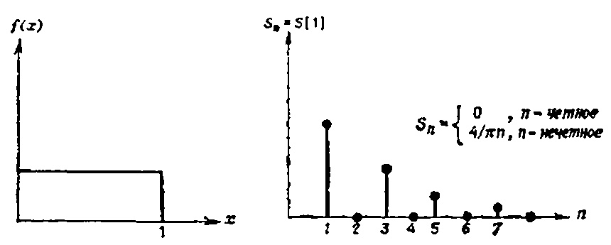

РИС. 25.1. Графики функции f(x) = 1 и ее преобразования.

## Свойства преобразований

Прежде чем приступить к решению задач, мы должны получить некоторые свойства этих преобразований.

Если u(x, t) — функция  $\partial \theta yx$  переменных и мы проводим преобразование по переменной x, то

HIDEd142247fb5c4486b8942ac0f20e11480X

HIDE81eaaf944eb84bf09c8fe6318babb0a7X

(Заметим, что преобразование проводилось по переменной x, и полученная последовательность зависит только от времени t.)

А как быть с производными? Ниже приводятся несколько полезных формул

HIDE82a1a96b8077441c8982538e6f74f644X

Решение неоднородной краевой задачи с помощью синус-преобразования

Рассмотрим неоднородное волновое уравнение

HIDEabfee18d6e674393bb718afae88f3be6X

HIDEd32ce6f5a9154726890138f033e708bdX

HIDEd719bdc21a74425786a1739d3ca38cd8X

Решение задачи выполним за три следующих шага:

ШАГ І (Определение подходящего преобразования.)

Поскольку переменная x меняется от 0 до 1, мы воспользуемся конечным преобразованием, а именно синус-преобразованием; позже станет ясно почему. Мы могли бы решить эту задачу с помощью преобразования Лапласа по переменной t (по трудоемкости этот метод не отличается от конечного синус-преобразования).

ШАГ 2 (Выполнение преобразования).

Для удобства будем использовать обозначение  $S_n(t) = S[u]$ . Применим синус-преобразование к исходному уравнению

HIDE10a1b70a85dd4c00a07c981e9880f9a9X

и воспользуемся тождеством для синус-преобразования, получим

HIDE6a8866d7a2e04feaa50b9f931587ebadX

где

HIDE86a8030597e54614a400d4c8079ad21eX

Если теперь преобразовать начальные условия краевой задачи, то получим начальные условия для обыкновенного дифференциального уравнения

HIDE69988875d51a43d1803214334d020e85X
HIDEedf2efa9ea6640fa805da7e1808b39efX

Итак, решим теперь новое семейство задач Кощи:

(ОДУ) 
HIDE51431d0f44b24009bb6a61a8df65b5dbX

HIDEfed9953bf15f4dccb140af7bbe991650X

HIDEeb9c538b20784356aefe4c03593c34b4X

В результате получаем

HIDE0f4ed1a8fd2945428cb32e01e384817bX,

где

HIDEa790926bda0c4776ae38c8fd2b1197f2X

HIDE479f4112758e4e82a0db143f5a79411dX

Следовательно, решение нашей задачи можно представить в виде

HIDEe4a7fcfd9dbf4ce48696993552bea051X

#### ЗАМЕЧ АНИЯ

1. Для решения задачи методом конечного синус- или косинуспреобразования краевые условия при x=0 и x=L должны иметь вид

HIDEd45c4908dd9c42e3b994acb75929a767X
 (используется синус-преобразование),  $
$$


підставляємо в початкові умови та отримуємо (як у попередній лекції):

(18.7)


$$
$$


 z(x) = (1 - x)\, y(x).


$$
$$


\varphi(x-ct), \quad \psi(x+ct)


$$
$  (используется косинус-преобразование).

Другими словами, если заданы граничные условия u(0, t) = f(t) и  $u_x(L, t) = g(t)$ , то эти преобразования неприменимы. Неприменимы они и при граничных условиях вида  $u_x(0, t) + hu(0, t) = 0$ . В этих случаях используются другие преобразования. С обобщенными синус- и косинус-преобразованиями можно познакомиться по литературе, указанной в конце книги.

2. Для того чтобы можно было применять конечные синус- или косинус-преобразования, исходные уравнения не должны содержать первых производных по x (поскольку синус-преобра-

нию второй и наоборот).

3. В методах конечных синус- и косинус-преобразований существенно то, что все функции задачи, включая  $u_{ti}$ ,  $u_{xx}$ , начальные условия, граничные условия, разлагаются в ряд Фурье по синусам или косинусам, решается последовательность ОДУ для коэффициентов Фурье, а затем все результаты суммируются.

## ЗАДАЧИ

1. Решите диффузионную задачу с изолированными границами, т. е.

HIDEbfd03f14bdb44a1d8ce82f735eb46431X

2. Решите в общем виде задачу

HIDE1a88595067e542da9ebacb4da6536545X

3. Выведите основные правила вычисления  $S[u_{xx}]$  и  $C[u_{xx}]$ , которые были приведены в замечаниях. Понимаете ли вы, почему трудно решить дифференциальное уравнение, содержащее первую производную?

**4.** Чему равно конечное синус-преобразование функции  $f(x) = \sin{(\pi x)} + 0.5 (3\pi x)$ ? Постройте график преобразования при

L=1.

**5.** Найдите косинус-преобразование функции f(x) = x,  $0 \le x \le 1$ . Изобразите график обратного преобразования при всех значениях x. (Конечно, внутри отрезка  $0 \le x \le 1$  восстановится функция f(x) = x, а что будет вне отрезка [0, 1]?)

6. Решите задачу

HIDE11ebf4e374174c6dbf34986685ebea41X

# Лекція 26. ПРИНЦИП СУПЕРПОЗИЦІЇ — ОСНОВА ТЕОРІЇ ЛІНІЙНИХ СИСТЕМ

ЦЕЛЬ ЛЕКЦИИ: Познакомить читателя с принципом суперпозиции и показать, как с его помощью исходную задачу можно разложить на подзадачи, затем решить сразу все подзадачи и, сложив полученные результаты, найти решение исходной задачи. Мы хотим также показать, что два основных метода решения линейных уравнений—метод разделения переменных и метод интегральных преобразований—используют принцип суперпозиции.

Предположим, что инженеру нужно найти отклик линейной системы и на входное воздействие f. Общий подход к решению задачи таков:

- 1) разложить f на элементарные воздействия  $f = \sum f_k$ ;
- 2) найти отклик системы  $u_k$  на воздействие  $f_k$ ;

3) сложить отклики  $u = \sum_{i=1}^{n} u_{i}$ .

Если система линейная, то полученная сумма и является откликом системы на входное воздействие f. В этом состоит принцип суперпоэиции (см. рнс. 26.1).

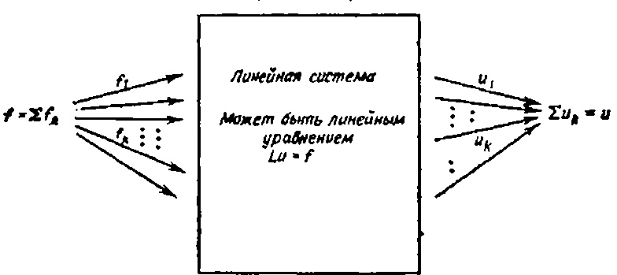

РИС, 26.1. Основная идея принципа суперпоэнции; L—дифференциальный оператор; f—вход; u—выход.

Эту основную идею можно использовать при решении сложных смешанных задач, разбивая их на простые подзадачи, ре-

шая каждую из них и затем суммируя полученные результаты (конечно, дифференциальное уравнение и граничные условия должны быть линейны).

## Разложение смешанной задачи на две более простые

Предположим, нам необходимо решить линейную задачу (обозначим ее P)

(УЧП) 
HIDE367629b0f8e74c3a963134396df48bcaX

(Р) (ГУ) 
HIDE3cf12d74afbc4543a0fced498587608bX

Перед нами неоднородное уравнение теплопроводности, так что метод разделения переменных неприменим. Можпо, конечно, воспользоваться конечным синус-преобразованием по переменной x или преобразованием Лапласа по переменной t, но вместо этого мы рассмотрим две подзадачи

# Лекція 27. РІВНЯННЯ ПЕРШОГО ПОРЯДКУ (МЕТОД ХАРАКТЕРИСТИК)

МЕТА ЛЕКЦІЇ: Ввести поняття диференціального рівняння в частинних похідних першого порядку і ознайомитися з методом характеристик для задач із початковими умовами.

Розглянемо типову задачу Коші для лінійного рівняння першого порядку:

- (УЧП): $a(x,t)u_x + b(x,t)u_t = c(x,t)$, $-\infty < x < \infty$, $0 < t < \infty$.
- (НУ): $u(x,0) = \varphi(x)$, $-\infty < x < \infty$.

На відміну від рівняння теплопровідності, де початкове збурення миттєво впливає на весь простір, для рівнянь першого порядку інформація поширюється вздовж спеціальних кривих у площині $(x,t)$. Такі криві називаються характеристиками.

Ідея методу характеристик така: замість того, щоб розв'язувати рівняння одразу в координатах $(x,t)$, ми переходимо до параметра $s$, який біжить уздовж характеристики. Уздовж правильно вибраної характеристики частинні похідні поєднуються так, що задача зводиться до звичайного диференціального рівняння.

Якщо характеристику записати у вигляді $x=x(s)$, $t=t(s)$, то природно вимагати, щоб вона задовольняла співвідношення:

- $\dfrac{dx}{ds} = a(x,t)$,
- $\dfrac{dt}{ds} = b(x,t)$.

Після цього значення $u(x,t)$ уздовж характеристики визначається ще одним звичайним диференціальним рівнянням. Саме тому метод характеристик перетворює складну задачу для УЧП на послідовність простіших задач для звичайних рівнянь.

Геометрично це означає, що початкові дані з лінії $t=0$ не розмазуються по всій площині, а переносяться вздовж характеристичних кривих. У наступному фрагменті лекції ці криві буде побудовано явно, а тоді з їхньою допомогою буде отримано розв'язок задачі Коші.

# Лекція 28. НЕЛІНІЙНІ РІВНЯННЯ ПЕРШОГО ПОРЯДКУ (ЗАКОНИ ЗБЕРЕЖЕННЯ)

МЕТА ЛЕКЦІЇ: Показати, як закони збереження приводять до нелінійних рівнянь першого порядку і як метод характеристик описує появу ударних хвиль у задачі дорожнього руху.

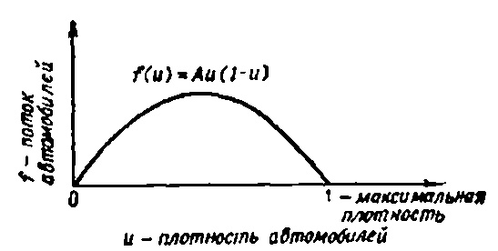

Рис. 28.1. Типова залежність потоку від густини.

Тепер ми готові застосувати закон збереження до задачі дорожнього руху. Якщо потік
$f(u)$ залежить від густини $u$, то

HIDEd502b1a2acb3432b8a3faf3dcb62173cX

Отже, рівняння збереження

HIDE9de5d818d6a34eec8e4d3eb72da16efbX

можна переписати у вигляді

HIDE58a903e880654d22b6b5958ef39625f3X

де $g(u)=f'(u)$.

Наприклад, якщо залежність потоку від густини квадратична, тобто
$f(u)=u^2$, то закон збереження набуває форми

HIDE6c61207890264f8981434838ac56685eX

Якщо початкова густина розподілу автомобілів задається функцією
$u(x,0)=\varphi(x)$, то потрібно розв'язати задачу Коші

HIDE9074092a281b4127ad94712830d6a540X

Тепер розглянемо загальну нелінійну задачу Коші.

# Нелінійна задача з початковою умовою (задача Коші)

Розглянемо задачу

HIDEf7a9bb647a5842d19733970a195710d4X

Нагадаємо, що для рівняння переносу

HIDE27a89ef0377d433fbe4475a3bb4beff5X

розв'язок є сталим уздовж прямих $x=x_0+vt$. У нелінійному випадку відбувається те саме,
але швидкість тепер залежить від самого розв'язку. Якщо частинка середовища стартує з
точки $(x_0,0)$ і рухається зі швидкістю $g(u)$, то її траєкторія має вигляд

HIDE46a3eb345b664609b2b066cb7e39613dX

Це і є рівняння характеристики. Вздовж характеристики значення $u(x,t)$ залишається
сталим і дорівнює початковому значенню $u(x_0,0)$.

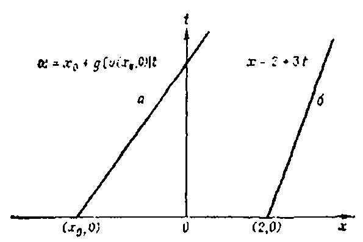

Фіг. 28.2. Характеристики рівняння $u_t + g(u)u_x = 0$; вздовж кожної характеристики
розв'язок залишається сталим і дорівнює значенню в точці $(x_0,0)$, з якої ця
характеристика виходить.

Отже, характеристика, що починається в точці $(x_0,0)$, задається формулою

HIDEad3bf0a740de4d9281fe03b836f4e014X

Наприклад, для рівняння

HIDEfa897679a7934a7391ec286ff791d941X

якщо $u(2,0)=1$, то характеристика, що виходить із точки $(2,0)$, визначається
співвідношенням

HIDEa32b1d6180cc48688beecb1ce69e9c0bX

Отже, на прямій $x=2+3t$ розв'язок зберігає значення $u=1$. Саме так читається зміст
характеристик у нелінійній задачі Коші.

Тепер зрозуміло, що, знаючи характеристики в кожній точці і знаючи, що розв'язок за характеристиками не змінюється, можна отримати розв'язок $ u\left(x,\ t\right) $ у будь-який момент часу t. Ми не отримали явного виразу для $ u\left(x,\ t\right) $ через змінні x і t, але знання характеристик рівняння дозволяє розв'язати деякі цікаві задачі.

# Задача дорожнього руху

Розглянемо модель руху, у якій потік задається формулою $f(u)=u^2$, а початкова густина
має вигляд, показаний на рис. 28.3.

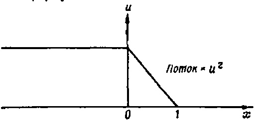

. 28.3. Початкова густина автомобілів, що рухаються зліва направо.

Іншими словами, нам потрібно розв'язати задачу

HIDEed52b6daa1584adfb8221fcf830e5571X

Почнемо з визначення характеристик, що виходять із точок $(x_0,0)$.

Якщо $x_0<0$, то $u(x_0,0)=1$, отже

HIDE4bb8a0e4c0814d93a91ba77efc6d79fcX

або, що те саме,

HIDEbeb9febc742c47bc8aac6de13ac17f12X

Тепер розглянемо точки $0<x_0<1$. Тут $u(x_0,0)=1-x_0$, тому

HIDE877c2d0f107249debabc41243ea11833X

звідки

HIDE35e84552f8074da09020811f97a79b5aX

Нарешті, якщо $1\le x_0<\infty$, то $u(x_0,0)=0$, і характеристики є вертикальними:

HIDEa561e27ad0b8463894192554b0fa9c22X

Усі ці характеристики показані на рис. 28.4.

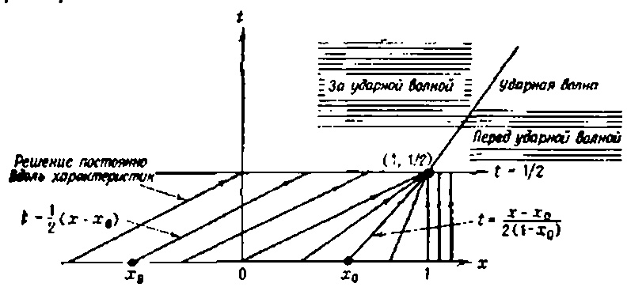

Фіг. 28.4. Характеристики рівняння $ u_t + 2uu_x = 0 $ .

Ситуація на дорозі при $0<t<1/2$ досить зрозуміла. Рис. 28.5 показує розв'язок у різні
моменти часу. Зверніть увагу, що характеристики сходяться в одній точці при $t=1/2$.
Отже, для $t>1/2$ виникає ударна хвиля, тобто розрив розв'язку. Потрібно визначити
швидкість руху її фронту.

Виявляється, що швидкість поширення розриву задається формулою
$S=\dfrac{f(u_R)-f(u_L)}{u_R-u_L}$, де $u_R$ і $u_L$ — значення розв'язку
праворуч і ліворуч від фронту хвилі, а $f(u_R)$ і $f(u_L)$ — значення потоку
при цих густинах.

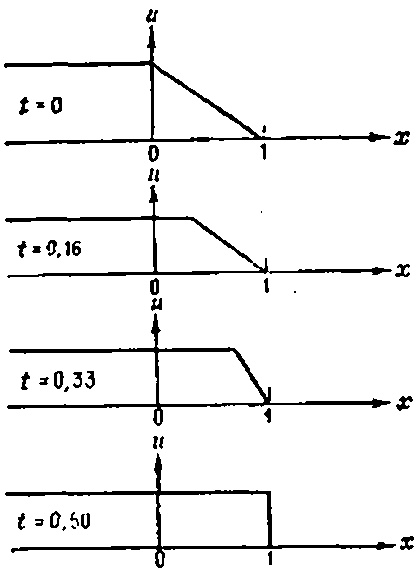

Фіг. 28.5. Щільність руху в різний час.

У нашому прикладі швидкість поширення щілини виявляється рівною одиниці. Справді,
для $f(u)=u^2$ маємо

HIDE1043ef7435ca4686b2c7c6dd95cba048X

Це означає, що при $t>1/2$ фронт хвилі рухатиметься зліва направо зі швидкістю
одиниці. Повне розв'язання цієї задачі показано на рис. 28.5.

# ЗАУВАЖЕННЯ

1. Ударна хвиля в нашому прикладі виникає через те, що потік швидко зростає зі
збільшенням густини $u$. Якщо б потік задавався формулою $f(u)=u$, то рівняння мало б
вигляд $u_t+u_x=0$, а розв'язок був би просто хвилею, що рухається вправо без
спотворення форми.

2. Прямою підстановкою розв'язку вигляду

HIDEdb407203af1347f5b46e7d3a139dcfc2X

можна перевірити, що ця формула неявно задає розв'язок задачі

HIDE4b6dd38f0d154ea3964109760b6224aaX

Наприклад, для задачі Коші

HIDE6e5467e0441b4b2187794c59777ca2adX

неявний розв'язок задається співвідношенням

HIDE8f2bd8e6fafd46f3a9f5c6b8d99d3994X

У нашому конкретному випадку можливо отримати рішення у явній формі
(у багатьох інших випадках це неможливо):

HIDEd74ae6c14a5040fca4ccaed9f2239455X

Переконайтеся, що ця функція справді є розв'язком нашої задачі.

# ЗАВДАННЯ

1. Розв'яжіть задачу Коші

HIDE1c2cdc1ce413477b8501ad2c5fdba8e0X

Побудуйте графіки розв'язку для різних моментів часу і поясніть їх фізичний зміст.

2. Розв'яжіть задачу

HIDE7603c0c366b94bb0bbfc81316a16d9e1X

Порівняйте поведінку цього розв'язку з результатом задачі 1.

3. Припустимо, що нев'язка рідина тече по трубі і водночас просочується крізь стінки
згідно із законом $F(u)=ku$. Тоді закон збереження набуває вигляду

HIDEc7bcf0876eb94b4eb0fb21bfcb73c14fX

Знайдіть розв'язок, якщо $f(u)=u$, а початковий розподіл задається довільною функцією
$u(x,0)=\varphi(x)$.

4. Розв'яжіть попередню задачу, якщо втрати задаються функцією $F(x,t)=1/x$.

5. Перевірте, що неявно задана функція

HIDEa2428080befd4bc39c4a0ab6b6ba6c32X

є розв'язком нелінійної задачі

HIDE024a539f5d08426da587ddc964fdcc23X

# Лекція 29. СИСТЕМИ РІВНЯНЬ З ЧАСТКОВИМИ ПОХІДНИМИ

ЦЕЛЬ ЛЕКЦИИ: Познакомить читателя с тем фактом, что многие физические системы (особенно в динамике жидкости) нельзя описать одним уравнением. Для описания таких систем требуются системы связанных уравнений. В эти системы входят некоторые неизвестные функции, такие, как давление p(x, y, z, t), плотность  $\rho(x, y, z, t)$ , температура T(x, y, z, t) и их частные производные. Связи между этими функциями определяются физическими законами и наша задача — найти все эти функции одновременно.

В лекции будет показано, как можно решить линейную систему уравнений

HIDEd50d0d42558e4a1bb21b794d25b97185X

если преобразовать ее в новую систему независимых уравнений

HIDE97ba769145b544f3a6c5b43359c01490X

а затем независимо решить каждое уравнение этой системы.

Во многих областях науки встречаются системы величин, которые связаны между собой не одним, а сразу несколькими соотношениями. Например, в динамике жидкостей—это четыре уравнения

HIDE0b184bdc13b5489ab3c091ad6694264aX
 (сохранение импульса вдоль оси  $x$ ), (29.1)  $v_t + uv_x + vv_y + \frac{1}{\rho} p_y = 0$  (сохранение импульса вдоль оси  $y$ ), (сохранение массы), (сохранение массы), (сохранение массы),  $\left(\frac{p}{\rho^{\gamma}}\right)_t + u\left(\frac{p}{\rho^{\gamma}}\right)_x + v\left(\frac{p}{\rho^{\gamma}}\right)_y = 0$  (сохранение энергии),  $p(x, y, z, t)$  — давление в жидкости,  $u(x, y, z, t)$  —  $x$ -компонента скорости,  $v(x, y, z, t)$  —  $y$ -компонента скорости,  $\rho(x, y, z, t)$  — плотность жидкости.

Приведенная нелинейная система уравнений называется уравнениями Эйлера движения жидкости. Задача состоит в одновременном отыскании всех неизвестных функций р, и, v и р, которые удовлетворяли бы всем четырем уравнениям (вместе с начальными и граничными условиями).

Есть и другие причины для изучения систем уравнений. В теории обыкновенных дифференциальных уравнений (если читатель помнит) показано, что одно уравнение второго порядка можно представить в виде системы двух уравнений первого порядка. И хотя в теории уравнений с частными производными все не так просто, очень часто одно уравнение с частными производными высокого порядка можно свести к системе уравнений с частными производными первого порядка. Например, телеграфное уравнение

HIDEf9c1aa1234ad40c98b930f677ee33d41X

путем введения трех новых переменных

HIDEdb09a07888bd45e7a317d94a9e34fa9fX

HIDEf995193f5d744c45a7bcd9c9c2c88e0eX

HIDE0ab72730ad6245f7b0d6cece2b5e8280X

можно свести к системе уравнений первого порядка

(29.2) 
HIDEadd72156785d454c981abbe8f642a6afX

Для того чтобы решать системы типа (29.2), необходимо хорошо знать такие понятия, как собственные значения и собственные векторы матрицы. По эфой причине мы предлагаем вниманию читателя краткий обзор линейной алгебры.

### Обзор линейной алгебры

Общий случай

Частный случай

Определение. Если А—квадратная матрица порядка n, то собственными значениями матрицы называются n корней характе-

Пусть 
HIDE759f71c14ae544b38094b29780298468X.

ристического уравнения

HIDE8401d30255354e7bba647087dff97a61X

где  $\det(A-\lambda I)$ — определитель матрицы  $A-\lambda I$ .

Некоторые собственные значения могут совпадать.

Тогда собственные значения являются корнями уравнения

HIDE6f588ca27fdb4e08bf602dc469fcbb21X

HIDEf19c5360a4f348e59423997bd8d26ffbX

Откуда 
HIDE8ab768e3baa44d23be5d8e9023a8c13bX,  $\lambda_2 = 3$ .

Определение. Если  $\lambda$ —собственное значение матрицы A, то соответствующим ему собственным вектором называется такой ненулевой вектор, который удовлетворяет соотношению

HIDE3cbd94402579434f9aa58fa9a8c2fe71X.

Пример. Вектор  $X =
$$


J[u] = \int_{0}^{1} \int_{0}^{1} (u_{x}^{2} + u_{y}^{2})\,dx\,dy,


$$
\begin{bmatrix} 1 \\ 2 \end{bmatrix}
$$


Для напівнескінченної струни розв’язок зручно записати у вигляді:


$$
$  является собственным вектором, соответствующим собственному значению  $\lambda_2 = 3$ , так как

HIDE29c15e72f12e429f8372aa6a35fe4569X

Определение. Матрица  $A^{-1}$  называется обратной к матрице A, если

HIDE966010b88f924a02a995738212c01381X

Пример, Обратной к

HIDEb419302f83e142f1b5a96fedbc4fbae5X

является матрица

HIDEa10b0e389f984b6db31bbf20f49d43b0X

где 1-единичная матрица.

поскольку

HIDE7521940aa2104139a7828a3f3e25a1b1X

# Диагонализация матрицы

Пусть A — квадратная матрина порядка n и пусть все ее собственные значения  $\lambda_1$ ,  $\lambda_2$  ...  $\lambda_n$  различны. Составим матрицу P так, чтобы у нее *столбцами* были координаты собственных векторов (в k-м столбце стоит собственный вектор  $X_k$ , соответствующий собственному значению  $\lambda_k$ ), т. е.

HIDEe8980f242fba4466a0c9544ad2bcbfd4X

Тогда матрица Л, определяемая соотношением

HIDE9a1a8f17bb294078911ce2ad5b983e32X

где  $P^{-1}$  — обратная к матрице P, будет диагональной матрицей вида

HIDE064194654b3d443cbe3f036c01f39d85X

Например, у матрицы

HIDE9f86e6fd03d24e6fb7899fcfd5748140X

собственные числа равны  $\lambda_1 = 4$  и  $\lambda_2 = -4$ , а собственные векторы соответственно

HIDEd36ef5f081dc49b085ef7308951f227fX
 in  $X_2 =
$$


Якщо $ x \ge ct $, ця формула збігається зі звичайною формулою Д’Аламбера для нескінченної струни. Якщо ж $ x < ct $, необхідно враховувати граничну умову $ u(0,t)=0 $, тобто відбиття хвилі від закріпленого кінця.

У результаті для напівнескінченної струни маємо:


$$
\begin{bmatrix} -2 \\ 1 \end{bmatrix}
$$


Цим завершується побудова розв'язку. Його геометрична інтерпретація подана на рис. 18.6.

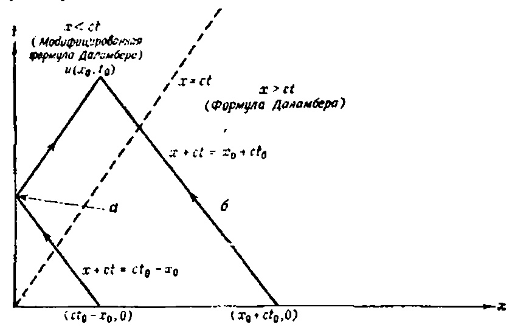

Рис. 18.6. Інтерпретація задачі Коші для півобмеженої струни в $ xt $-площині: $ a $ — збурення відбивається від межі; $ \delta $ — збурення поширюється вздовж характеристики з точки $ (x_0+ct_0,\,0) $.
# ЗАУВАЖЕННЯ
1. Формула для півобмеженої струни повністю узгоджується з фізичною картиною: при $ x \ge ct $ хвиля ще не встигла відбитися від межі, а при $ x<ct $ у розв'язку з'являється відбита хвиля зі зміненим знаком.

2. Якщо замінити граничну умову $ u(0,t)=0 $ на іншу, то явний вигляд розв'язку теж зміниться. Але сама ідея побудови - доозначення хвильових складових за допомогою граничної умови - залишається тією самою.

3. Прямі


$$
$$


називаються характеристиками хвильового рівняння. Саме вздовж цих прямих поширюється збурення.

# ЗАВДАННЯ

1. Побудуйте графіки розв'язку для напівнескінченної струни в різні моменти часу та поясніть, як хвиля відбивається від закріпленої межі.

2. Опишіть алгоритм побудови такого розв'язку:
   - продовжити початкові дані на всю вісь,
   - побудувати ліву і праву хвилі,
   - врахувати відбиття від межі $ x=0 $.

3. Розв'яжіть змішану задачу для напівнескінченної струни, коли початкові дані задано графічно.

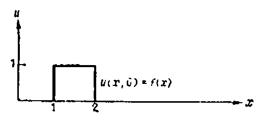

# Розв'язання нелінійного рівняння $ \Delta u + u^2 = 0 $ методом збурень

Розглянемо нелінійну задачу Діріхле як збурення простішої лінійної задачі. Для цього вводять сімейство задач


$$
$$


і шукають розв'язок у вигляді ряду


$$
$   $0 \le \theta \le 2\pi,$ 

Здесь мы опять воспользуемся методом разделения переменных, но в отличие от внутренней зодачи Дирихле мы не станем отбрасывать решения вида

HIDEe53563d4b2874ce2a8e7259e98bfd757X

Следовательно, решение должно записываться в виде  $u(r, \theta) = a_0 + b_0 \ln r +$ 

HIDE6bfc83d4ef364e8195fe0a9a7d67e2f8X

Мы также кратко обсудим решение внешней задачи Дирихле. В этом случае нам придется отбросить слагаемые, неограниченные при  $r=\infty$ . Следовательно, решение внешней задачи Дирихле

HIDE909a73edce9343ca819f882ec3dfc6feX

следует искать в виде

HIDE2705dcf175b04489ae8b8897826b17d9X

Существует множество разнообразных по форме областей, для которых можно в явном виде выписать решение задачи Дирихле. Мы перечислим только некоторые из них:

- а) в круге (лекция 33),
- б) в кольце (данная лекция),
- в) вне круга (данная лекция),
- г) в шаре (в последующих лекциях),
- д) в сферическом слое (в последующих лекциях),
- е) в полосе (двумерный случай),
- ж) в слое между плоскостями (трехмерный случай).

Эгот список можно продолжать до бесконечности. Мы хотим решить простую, но достаточно типичную задачу Дприхле, так чтобы читатель освоил общие принципы и мог при необходимости решить свою задачу.

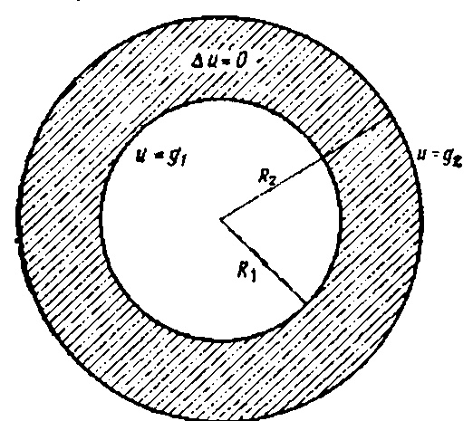

РИС. 34.1. Уравнение Лапласа в кольце.

Здесь наша цель—найти форму мыльной пленки, натинутой между двумя проволочными ободками. Вероятно, в этой задаче интунция уже не играет такой роли, как во внутренней задаче Дирихле. Математическую модель задачи запишем следующим образом:

(34.1) 
HIDE6a3cf678ea2f4087bc1a39b9a47df49dX

Общая схема этой задачи изображена на рис. 34.1.

Задача состоит в том, чтобы найти решение  $u(r, \theta)$  между окружностями  $r = R_1$  и  $r = R_2$ , совпадающее на окружностях с  $g_1(\theta)$  и соответственно с  $g_2(\theta)$ . Будем искать решения вида

HIDE45ed18c441394d2e8502115f28fa9b8dX.

Подставляя их в уравнение Лапласа, приходим к двум обыкновенным дифференциальным уравнениям для функций R(r) и  $\Theta(\theta)$ 

HIDE0dd272e818b247b1ad46ae38df34ced5X
 (уравнение Эйлера),  $\Theta'' + \lambda^2\Theta = 0$ .

Отметим, что константа разделения в этих уравнениях должна быть больше или равна нулю (мы обозначили ее  $\lambda^2$ ), иначе реше-

ние для  $\Theta$  ( $\theta$ ) не будет периодическим. Далее мы решим оба этих уравнения, а затем перемножим эти решения, в результате получим все решения уравнения Лапласа, которые представимы в виде R (r)  $\Theta$  ( $\theta$ ).

Из этих двух уравнений наибольший интерес представляет уравнение Эйлера. К счастью, это одно из немногих обыкновенных дифференциальных уравнений с переменными коэффициентами, которые решаются сравнительно легко.

#### РЕШЕНИЕ УРАВНЕНИЯ ЭЙЛЕРА

HIDEa67f5a080d0940af870a39639afd56daX

СЛУЧАЙ I ( $\lambda = 0$ ). В этом случае уравнение Эйлера принимает вид

HIDE373937c5d3524a63a91347538908ef33X

общее решение которого легко находится:

HIDEbecf877edd374d29858ff612a6eab214X

В самом деле, сделав подстановку  $V\left(r\right) \Rightarrow R'\left(r\right)$ , получаем для V уравнение с разделяющимися переменными

HIDE4fba105b26f04d498641edb484e17c75X.

Решив это уравнение, находим  $V\left(r\right)=c_{1}/r$ , откуда

HIDEe838bd5025fd460488a75861fec10388X.

СЛУЧАЙ 2. ( $\lambda > 0$ ). В этом случае уравнение Эйлера имеет вид

HIDEc433efdd8fcf4b6bbe2493312fe99710X

Будем искать решение этого уравнения в виде  $R(r)=r^{\alpha}$ . Наша цель—найти два значения  $\alpha$  (скажем,  $\alpha_1$  и  $\alpha_2$ ), таких, чтобы функция

HIDEf70ff478622141aab182c6245867535aX

являлась общим решением уравнения. Подстановка  $R(r) = r^{\alpha}$  в уравнение Эйлера приводит к  $\alpha = \lambda$  и  $\alpha = -\lambda$ . Следовательно,

HIDE7df731f8932848009e5d6628e8f28668X

Итак, используя решение уравнения Эйлера, мы получили

HIDE9099e294fde34761bdb3cdb7918de1cdX

HIDE4ffe722f445249e99063d364aa226604X

Функция  $\Theta(\theta)$  должна быть *периодической* с периодом  $2\pi$ . Значит, величина  $\lambda$  должна принимать значения  $0, 1, 2, 3, \ldots$ . Теперь мы можем с помощью произведения составить следующие решения.

# Решения уравнения Лапласа

HIDE7c041752d48b472690e3baeb12cab245X $c \ln r,$  $cr^n \cos(n\theta) \ (n = 1, 2, ...),$    $cr^n \sin(n\theta) \ (n = 1, 2, ...),$  $cr^{-n} \cos(n\theta) \ (n = 1, 2, ...),$    $cr^{-n} \sin(n\theta) \ (n = 1, 2, ...).$ Поскольку сумма этих решений также является решением, то делаем вывод, что общее решение уравнения Лапласа в нашем случае должно иметь вид

(34.2) 
HIDEafc3cee1a8924e2a8d750ca0b2093712X

Осталось только найти все коэффициенты в сумме (34.2) так, чтобы удовлетворить граничным условиям

HIDEc8be5d9201e644fc94272f7bcb564059X

Подстановка (34.2) в граничные условия приводит к следующим уравнениям:

HIDE4367461979e2466ea00a7ebac89ede47X
 (решаются относительно  $a_0$  и  $b_0$ ), 
HIDEfcef42ffecc841a79aca9761a8302433X
 (решаются относительно  $a_n$  и  $b_n$ ),

HIDEd2d2644a12e748289f2fe3fd44cdb668X

Тем самым из этих уравнений находятся все неизвестные коэффициенты  $a_0$ ,  $b_0$ ,  $a_n$ ,  $b_n$ ,  $c_n$  и  $d_n$ . Теперь задача (34.1) полностью решена. Решение дается выражением (34.2), коэффициенты которого определяются по формулам (34.3).

Чтобы лучше понять полученные результаты, рассмотрим

несколько примеров.

# Некоторые варианты задачи Дирихле в кольце

ПРИМЕР 1.

Предположим, что потенциал на внутренней окружности равен нулю, а потенциал на внешней равен  $\sin\theta$ . Тогда

(УЧП) 
HIDE2eb9587010b84cb28db63d75f6bee0d1X,  $1 < r < 2$ ,  
(ГУ) 
HIDE3928fdc9b3ae4cbfa25a063be0dedbe4X
  $0 \le \theta \le 2\pi$ ,

Первое, что мы должны сделать—это вычислить все интегралы в (34.3) и решить соответствующие уравнения для  $a_0$ ,  $b_0$ ,  $a_n$ ,  $b_n$ ,  $c_n$  и  $d_n$ . Целесообразно сначала попытаться подобрать такие частные решения (из выписанных выше), линейная комбинация которых удовлетворяет граничным условням (здесь  $u = Ar \sin \theta + Br^{-1} \sin \theta$ ). Затем из граничных условий найти коэффициенты (здесь A = 2/3, B = -2/3). В результате этих простых вычислений получаем

HIDE5809777c66f44ab0a9c45a83ad798767X

HIDE34c4c23bc3d24adda65b4e64c3383820X

Зная все коэффициенты, выпишем решение задачи

HIDE3fc5c01e78284d5ab5cfc39fa9d18c1aX

Легко проверить, что эта функция удовлетворяет обоим граничным условиям. Очевидно и то, что она удовлетворяет уравнению Лапласа, так как принадлежит классу функций вида (34.2).

#### ПРИМЕР 2.

Рассмотрим задачу с *постоянными потенциалами* на гранинах кольца

(УЧП) 
HIDEe11102bcd0754ec2abce3ca54a7bded2X,  $1 < r < 2$ .  
(ГУ) 
HIDE750f4d6338804862bf97ef43338a6c48X

В этом случае можно сэкономить массу времени, поскольку очевидно, что решение не зависит от  $\theta$  (так как граничные условия не зависят от  $\theta$ ). Другими словами, наше решение следует искать среди функций вида  $a_0 + b_0 \ln r$ . Подставляя эту функцию в граничные условия, получаем

HIDE914e1a76c93e45e38772925bc04b163eX,  
 $a_0 + b_0 \ln 2 = 5$ ,

откуда  $a_0 = 3$ ,  $b_0 = 2/\ln 2 = 2.9$ . Следовательно, решением будет функция

HIDEad967caa296e49e6bc5f0ef2c5461d75X.

Ее график изображен на рис. 342.

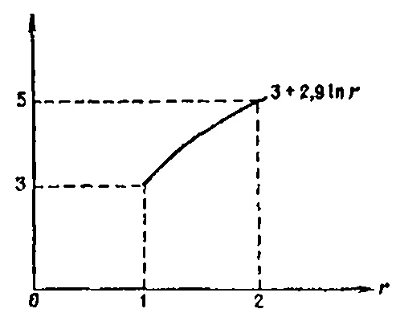

РИС. 34.2. Зависимость потенциала от радиуса внутри кольца.

#### ПРИМЕР 3

Решим еще одну интересную задачу

(УЧП) 
HIDEf5c136803068483aad52be02921927b8X,  $1 < r < 2$ ,  
(ГУ) 
HIDEa1a6ecafe5264c408c7695e28126c3f8X

Можно быстро проверить, что все коэффициенты  $a_0$ ,  $b_0$ ,  $a_n$ ,  $b_n$ ,  $c_n$  и  $d_n$  равны нулю, а коэффициенты  $c_i$  и  $d_i$  определяются из системы уравнений

HIDE9d21bfcf2f38478293eb34eb8eb4f70dX
HIDE40cbfeef86e44392a3648e5daaa9fd41X

Решая эту систему, получаем  $c_1=1/3$  и  $d_1=2/3$ . Следовательно, решением задачи является функция

HIDEcf33f933273f4f968796cf8811957108X

Форма кривых при различных значениях  $\theta$  показана на рис. 34.3.

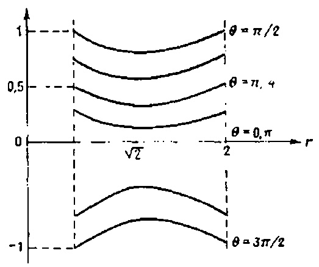

РИС. 34.3 Мыльная оченка между  $u\left(1,\;\theta\right)=\sin\theta$  и  $u\left(2,\;\theta\right)=\sin\theta$ .

Наша лекция завершается кратким обсуждением внешней за-дачи Дирихле для круга.

# Внешняя задача Дирихле

Внешняя задача Дирихле

HIDEd9f95a91d01b40c78b39678f9c2750ecX

решается точно так же, как решалась внутренняя задача в лекции 33. За исключением того, что теперь необходимо отбросить те решения, которые не ограничены при стремлении г к бесконечности, т. е.

HIDE006ddaccdc1e4d2aa88a51085ad0d926X,  $r^n \cos(n\theta)$   $H$   $r^n \sin(n\theta)$ .

Следовательно, в качестве решения остается взять функцию

(34.4) 
HIDE42242a6e3bef43eb97ade13f15778bc0X

где коэффициенты  $a_n$  и  $b_n$  вычисляются по тем же формулам, что и раньше:

HIDEa36ba15716f74b9ca1e21f722579ccdbX

HIDE59b6a9ae906c4c7eb3ebcc2fc848b89dX

Другими словами, мы просто разлагаем функцию  $u\left(1,\;\theta\right)=g\left(\theta\right)$  в ряд Фурье

HIDE2da17d56a2284417bec2535684812fd3X

а затем каждый член этого ряда домножаем на коэффициент  $r^{-n}$ . Чтобы теснее познакомиться с этим решением, приведем два примера.

Примеры внешней задачи Дирихле

Внешняя задача

(УЧП) 
HIDE241cffa00087410b8469803f55f85513X,  $1 < r < \infty$ ,  
(ГУ)  $u(1, \theta) = 1 + \sin \theta + \cos (3\theta)$ ,  $0 \le \theta \le 2\pi$ ,

имеет решение

HIDEe745a467d7b342d5bd849e212f35e06aX

ПРИМЕР 2

Внешняя задача

(УЧП) 
HIDEb8dde95b4f0a45b69123fa85bcc93e3dX,  $1 < r < \infty$ ,  
(ГУ)  $u(r, \theta) = \cos(4\theta)$ ,  $0 \le \theta \le 2\pi$ ,

имеет решение

HIDEd578903c78be48f6b4cfbeb5746e4893X

Читатель должен попытаться представить, как выглядит это решение

#### ЗАМЕЧАНИЯ

Решение внешней задачи Дирихле при произвольном радиусе R

HIDE9e059136fe014b38aafe795dfaf478ceX

имеет вид

HIDE818770e0e9d040ce8f42a94dc6528a37X

2 Существует только два решения двумерного уравнения Лапласа, которые не зависят от  $\theta$ , а зависят только от r. Это константа c и  $\ln r$  Потенциал  $\ln r$  играет большую роль в теорин и называется логарифмическим потенциалом. Ниже мы подробнее остановимся на его свойствах

#### ЗАДАЧИ

1 Решите задачу Дирихле

(УЧП) 
HIDE94dd95d50d2f432292940aced3014b72X,  $1 < r < 2$ ,  
(ГУ) 
HIDE9c82dbe94cab4b8aa4ca6a3df0084cd7X

2. Найдите решение внешней задачи Дирихле

HIDEe212b624fb1e47b8bd4816d7c1b01e67X

при следующих граничных условиях:

a) 
HIDEc88dbe3932cd40859d7e9b3ba58630f8X,

6) 
HIDE164b6effa15a4d0aadc69d10439af0feX,

B) 
HIDEf24845c785de40bea6c93c3228388dfcX,

B) 
HIDE020d63f5d3d140a595e963ba34878db1X,  
r)  $u(1, \theta) =
$$


Нульове наближення $ u_0 $ обирають як розв'язок відповідної лінійної задачі. Далі, підставляючи ряд у рівняння і прирівнюючи коефіцієнти при однакових степенях $ \ varepsilon $, послідовно знаходять поправки $ u_1, u_2, \ldots $.

(46.4)

Використайте метод, аналогічний розглянутому в лекції. Дайте фізичну інтерпретацію цієї задачі.

**4.** Припустимо, що коливання струни описуються рівнянням  


$$
\begin{cases} 1, & 0 \le \theta < \pi, \\ 0, & \pi \le \theta < 2\pi. \end{cases}
$$


початкове зміщення зображене на рисунку, а початкова швидкість дорівнює нулю. Зобразіть розв’язок цієї задачі в $ x $–$ t $ площині. Зверніть увагу, що початкові умови в цій задачі є розривними.

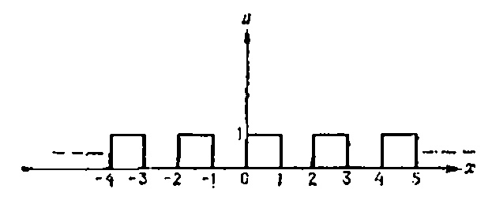

# Лекція 19. ХВИЛЬОВЕ РІВНЯННЯ І ГРАНИЧНІ УМОВИ

**Мета лекції.** Ознайомити читача з основними типами граничних умов для хвильового рівняння на скінченному відрізку.

Розглянемо одномірне хвильове рівняння:


\[
f(x)=x, \qquad -L < x < L, \qquad f(x+2L)=f(x),
\]


Найчастіше виникають три типи граничних умов:

1. **Умови першого роду**:


\[
f(x) = \frac{a_0}{2} + \sum_{n=1}^{\infty} \left[a_n \cos\!\left(\frac{n\pi x}{L}\right) + b_n \sin\!\left(\frac{n\pi x}{L}\right)\right].
\]


2. **Умови другого роду**:


\[
a_n = \frac{1}{L}\int_{-L}^{L} f(x)\cos\!\left(\frac{n\pi x}{L}\right)\,dx = 0, \qquad n=0,1,2,\dots,
\]


3. **Умови третього роду**:


\[
b_n = \frac{1}{L}\int_{-L}^{L} f(x)\sin\!\left(\frac{n\pi x}{L}\right)\,dx
= -(-1)^n \frac{2L}{n\pi}, \qquad n=1,2,\dots.
\]


У фізичному сенсі це відповідає заданим переміщенням, силам або пружному закріпленню кінців струни.

Далі розглянемо задачу:


\[
f(x) = \frac{2L}{\pi}\left[\sin\!\left(\frac{\pi x}{L}\right) - \frac{1}{2}\sin\!\left(\frac{2\pi x}{L}\right) + \frac{1}{3}\sin\!\left(\frac{3\pi x}{L}\right) - \dots \right].
\]


Щоб розв’язати таку неоднорідну задачу, зручно подати розв’язок як суму спеціально підібраної функції, що задовольняє граничні умови, і нової невідомої функції з однорідними граничними умовами. Саме цей підхід використовується далі.

Правильні частини виду $ r^n $, $ r^n \cos(n\theta) $, $ r^n \sin(n\theta) $ ведуть до розв’язків  
$ Ar^{n+2} $, $ Br^{n+2} \cos(n\theta) $, $ Cr^{n+2} \sin(n\theta) $ відповідно.

Підставляючи функції $ u_p(r,\theta) $ у неоднорідне рівняння, отримуємо:


\[
c_n = \sqrt{a_n^2 + b_n^2}, \qquad n=0,1,2,\dots,
\]


Отже,


\[
c_n = \frac{2L}{n\pi}, \qquad n=1,2,\dots, \qquad c_0 = 0.
\]


Щоб розв’язати задачу, потрібно підставити загальний розв’язок  


\[
f(x) = \int_{0}^{\infty} a(\xi)\cos(\xi x)\,d\xi + \int_{0}^{\infty} b(\xi)\sin(\xi x)\,d\xi,
\]


у граничні умови $ u(1,\theta)=0 $ і знайти коефіцієнти $ a_n $ та $ b_n $.

Після цього отримуємо:


\[
a(\xi) = \frac{1}{\pi}\int_{0}^{\infty} f(x)\cos(\xi x)\,dx, \qquad
b(\xi) = \frac{1}{\pi}\int_{0}^{\infty} f(x)\sin(\xi x)\,dx.
\]


Отже, $ a_0=1/32 $, $ a_2=1/24 $, а всі інші $ a_n $ і $ b_n $ дорівнюють нулю. Таким чином, розв’язок задачі знайдено:


\[
C(\xi) = \sqrt{a^2(\xi) + b^2(\xi)}.
\]


Функція $ u_1(r,\theta) $ називається збуренням першого порядку. Додавши $ u_0 $ і $ u_1 $, отримуємо новий підхід до розв’язання задачі (46.2):

(46.5)


\[
f(x) = \int_{0}^{\infty} a(\xi)\cos(\xi x)\,d\xi + \int_{0}^{\infty} b(\xi)\sin(\xi x)\,d\xi,
\]


Щоб знайти збурення наступного порядку $ u_z(r,\theta) $, потрібно розв’язати задачу:


\[
a(\xi) = \frac{1}{\pi}\int_{0}^{\infty} f(x)\cos(\xi x)\,dx, \qquad
b(\xi) = \frac{1}{\pi}\int_{0}^{\infty} f(x)\sin(\xi x)\,dx.
\]


разом із системою:


\[
C(\xi) = \sqrt{a^2(\xi) + b^2(\xi)}.
\]


де функції $ u_{\phi}(r,\theta) $ та $ u_{1}(r,0) $ вже відомі.

Звісно, виконувати такі алгебраїчні перетворення без комп’ютера дуже складно. На щастя, вираз (46.5) є майже точним розв’язком задачі. Насправді, підставивши його в рівняння $ \Delta u + u^{2} $, отримаємо вираз, який майже всюди дорівнює нулю в області $ 0 < r < 1 $.

Окрім нелінійних задач, теорія збурень може використовуватися для задач у областях зі складною межею (якщо нерегулярність незначна). Розглянемо приклад.

# Приклад задачі з порушеною межею

Розглянемо задачу Лапласа в деформованій області. Нехай на межі задано:
(46.6)


\[
e^{i\theta} = \cos\theta + i\sin\theta,
\]


Узагальнено:


\[
f(x) = \frac{1}{\sqrt{2\pi}} \int_{-\infty}^{+\infty}
\left[\frac{1}{\sqrt{2\pi}} \int_{-\infty}^{+\infty} f(s)e^{-i\xi s}\,ds \right]
e^{i\xi x}\,d\xi.
\]


Таким чином, ми завершуємо розгляд основних граничних умов для гіперболічних задач. Наступні лекції будуть присвячені методам розв’язання задач з такими умовами.# Лекція 47

# РОЗВ'ЯЗАННЯ ДИФЕРЕНЦІАЛЬНИХ РІВНЯНЬ У ПОХІДНИХ ПОХІДНИХ ЗА ДОПОМОГОЮ МЕТОДУ КОНФОРМНИХ ВІДОБРАЖЕНЬ

МЕТА ЛЕКЦІЇ: Показати, як деякі двовимірні граничні задачі можна перетворити на інші, простіші задачі за допомогою конформного відображення. Припустимо, наприклад, що ми хочемо розв'язати рівняння Лапласа


\[
\mathcal{F}[f] = F(\xi) = \frac{1}{\sqrt{2\pi}} \int_{-\infty}^{+\infty} f(x)e^{-i\xi x}\,dx
\]


З граничною умовою в області комплексної форми (площина змінних $ x $ і $ y $) цю задачу можна перетворити на нову, в якій потрібно знайти розв’язок рівняння Лапласа


\[
\mathcal{F}^{-1}[F] = f(x) = \frac{1}{\sqrt{2\pi}} \int_{-\infty}^{+\infty} F(\xi)e^{i\xi x}\,d\xi
\]


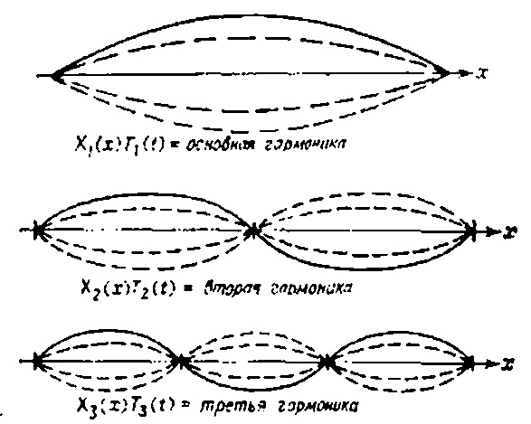

## 20.1. Три типові стоячі хвилі: $ X(x)T(t) $

Декілька прикладів стоячих хвиль показано на рис. 20.1. Якщо профілі цих стоячих хвиль відомі $ X_n(x) $ і природа коливань кожної хвилі $ T_n(t) $, то розв’язок задачі коливань гітарної струни є суперпозицією елементарних коливань $ X_n(x)T_n(t) $.

Залишається лише обрати коефіцієнти $ c_n $ так, щоб при $ t = 0 $ початкові умови


\[
f(x)=
\begin{cases}
0, & x \le 0,\\
e^{-x}, & x > 0,
\end{cases}
\]


були виконані.

Задачу коливань гітарної струни розв’яжемо методом розділення змінних.

## Розв’язання задачі методом розділення змінних

Щоб розв’язати змішану задачу:


\[
F(\xi) = \frac{1}{\sqrt{2\pi}} \frac{1-i\xi}{1+\xi^2}.
\]


розглянемо розв’язок у вигляді добутку:


\[
C(\xi) = \sqrt{\frac{1}{2\pi(1+\xi^2)}}.
\]


Підстановка дає:


\[
f(x)=
\begin{cases}
-1, & -1 < x < 0,\\
1, & 0 \le x < 1,
\end{cases}
\qquad
f(x+2)=f(x).
\]


звідки


\[
f(x)=
\begin{cases}
1, & -1 < x < 1,\\
0, & \text{в інших точках.}
\end{cases}
\]


(випадок $ n=0 $ дає тривіальний розв’язок).

Отже, маємо послідовність елементарних коливань струни:


\[
\left|F(\xi)\right| = \sqrt{\frac{1}{1+\xi^2}}.
\]

 або 

\[
\int_{-L}^{L} \sin\!\left(\frac{m\pi x}{L}\right)\sin\!\left(\frac{n\pi x}{L}\right)\,dx =
\begin{cases}
0, & m \neq n,\\
L, & m = n,
\end{cases}
\]


Тут $ a_n $, $ b_n $, $ R_ n $, $ \delta_n $ — довільні сталі.

## Комплексні потенціали та конформні відображення

Розглянемо функцію:


\[
\int_{-L}^{L} \cos\!\left(\frac{m\pi x}{L}\right)\cos\!\left(\frac{n\pi x}{L}\right)\,dx =
\begin{cases}
0, & m \neq n,\\
L, & m = n,
\end{cases}
\]


Тоді:


\[
\int_{-L}^{L} \sin\!\left(\frac{m\pi x}{L}\right)\cos\!\left(\frac{n\pi x}{L}\right)\,dx = 0
\quad \text{для всіх } m,n=1,2,\dots
\]


## Характеристичне рівняння

Для параболічного випадку характеристика має вигляд:

MATHBLK0500X

Для прикладу рівняння:

MATHBLK0501X

характеристичне рівняння:

MATHBLK0502X

Тому вводимо нові змінні:

MATHBLK0503X

У цих координатах рівняння набуває вигляду:

MATHBLK0504X

Загальний розв’язок:

MATHBLK0505X

де $ f $ і $ g $ — довільні функції.

## ЗАВДАННЯ

1. Розв’яжіть задачу Коші методом характеристик для лінійного рівняння першого порядку.

2. Зведіть рівняння

MATHBLK0506X

до канонічної форми.

3. Зведіть рівняння

MATHBLK0507X

до канонічної форми.

4. Для хвильового рівняння запишіть граничні умови першого, другого і третього роду та поясніть їх фізичний зміст.

5. Знайдіть розв’язок задачі переносу методом переходу до рухомої координати.

Щоб завершити перетворення, потрібно так само перенести початкові умови на нову невідому функцію. Після цього задача для хвильового рівняння з неоднорідними граничними умовами зводиться до задачі з однорідними граничними умовами, але вже з модифікованими правими частинами.

На практиці це означає, що складність переноситься з межі в саме рівняння, зате далі можна застосовувати стандартні методи: розділення змінних, розкладання за власними функціями або інтегральні перетворення.

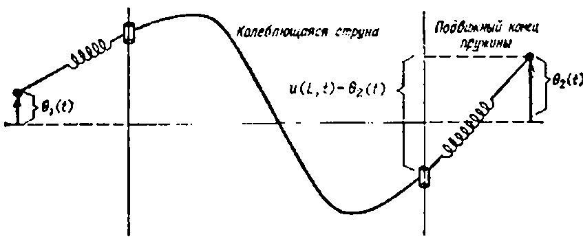

Рис. 19.6. Виникнення неоднорідних граничних умов пружного закріплення: $ h $ - коефіцієнт жорсткості пружини.

Для умов пружного закріплення однорідні граничні умови часто записують у вигляді

MATHBLK0508X

Саме з такого запису зазвичай починають побудову власних функцій і відповідних спектральних розкладів для подальшого розв'язання задачі.

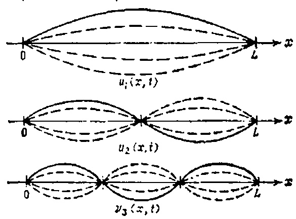

Фіг. 20.3. Стоячи $ u_n(x, t) = X_n(x)T_n(t) $ .

У нашій задачі рівняння і граничні умови є лінійними та однорідними, тому довільна сума елементарних стоячих хвиль також є розв'язком хвильового рівняння і задовольняє граничним умовам. Тепер ми повинні знайти таку суперпозицію стоячих хвиль, щоб вона також задовольняла початкові умови, і тоді отримаємо розв'язок нашої проблеми. Заміна кількості

MATHBLK0509X Г о

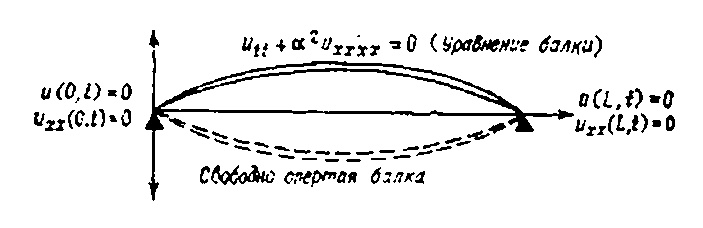

ловна різниця між поперечними коливаннями тонкої балки та поперечними коливаннями струни полягає в тому, що промінь чинить опір згину. Не заглиблюючись у механіку тонких балок, припустимо, що, враховуючи опір згинання (замість рівняння хвилі) веде до рівняння четвертого порядку

(21.1)

MATHBLK0510X

# Лекція 20. КОЛИВАННЯ ОБМЕЖЕНОЇ СТРУНИ (СТОЯЧІ ХВИЛІ)
МЕТА ЛЕКЦІЇ: Показать, что решение смешанной задачи для поперечных колебаний струны

MATHBLK0511X

можно найти стандартным методом разделения переменных. При этом оказывается, что решение  $ u\left(x,\t\right) $ , представленное в виде ряда

MATHBLK0512X

является суперпозицией простейших колебаний. Пространственная часть  $ X_n(x) $  каждого элементарного колебания является решением (собственной функцией) некоторой краевой задачи Штурма—Лиувилля.

Итак, мы научились решать волновое уравнение  $ u_{tt}=c^2u_{xx} $  на всей прямой  $ -\infty < x < \infty $ . Формула Даламбера представляет решение в виде суммы двух бегущих волн, распространяющихся в противоположные стороны. Если же рассматривать это же уравнение на ограниченном промежутке 0 < x < L, то бегущих волн уже не станет, так как они будут взаимодействовать с границами. Вместо них возникают другие волны, которые называют стоячими волнами. Посмотрим, например, что случится, если гитарную струну, закрепленную в точках x=0, x=L, привести в движение. Для ответа на этот вопрос нам необходимо решить следующую смешанную задачу гиперболического типа:

MATHBLK0513X

Оказывается, в этом случае бегущие волны отражаются от границ таким образом, что результирующие колебания становятся не бегущими, а сохраняющими форму в одном положении, т. е.


Рис. 20.1. Три типичных стоячих волны X(x) T(t).

превращаются в стоячие волны Несколько примеров стоячих волн показано на рис. 20.1. Если известны профили этих стоячих волн  $ X_n(x) $  и характер колебаний каждой волны  $ T_n(t) $ , то решение задачи о колебаниях гитарной струны представляет собой суперпозицию простейших колебаний  $ X_n(x)\,T_n(t) $  и запи-

сывается в виде

MATHBLK0514X

Единственное, что остается сделать нам,— это подобрать коэффициенты  $ c_n $  так, чтобы при t=0 удовлетворялись начальные условия  $ u\left(x,\  0\right)=f\left(x\right) $  и  $ u_t\left(x,\ 0\right)=g\left(x\right) $ .

Задачу о колебаниях гитарной струны мы решим методом разделения переменных.

#### Решение задачи о колебаниях ограниченной струны методом разделения переменных

Чтобы решить смешанную задачу

(УЧП) 

MATHBLK0515X

 (\Gamma Y) \begin{cases} u(0, t) = 0, \\ u(L, t) = 0, \end{cases} \quad 0 < t < \infty,

MATHBLK0516X

найдем сначала стоячне волны, т. е. решения вида

MATHBLK0517X

Подставив это выражение в уравнение (20.1) и разделив переменные, получим два обыкновенных дифференциальных уравнения

MATHBLK0518X

 X'' - \lambda X = 0,

MATHBLK0519X

u(x, t) = [C \sin(\beta x) + D \cos(\beta x)][A \sin(\alpha \beta t) + B \cos(\alpha \beta t)]

MATHBLK0520X

\beta_n = \frac{n\pi}{L}, \quad n = 0, 1, 2, \ldots

MATHBLK0521X

u_n(x, t) = X_n(x) T_n(t) = \sin(n\pi x/L) [a_n \sin(n\pi at/L) + b_n \cos(n\pi at/L)],

MATHBLK0522X

u_n(x, t) = R_n \sin(n\pi x/L) \cos(n\pi\alpha (t - \delta_n)/L],

MATHBLK0523X

u(x, t) = \sum_{n=1}^{\infty} \sin(n\pi x/L) \left[ a_n \sin(n\pi \alpha t/L) + b_n \cos(n\pi \alpha t/L) \right]

MATHBLK0524X

u(x, \theta) = f(x),

MATHBLK0525X

\sum_{n=1}^{\infty} b_n \sin(n\pi x/L) = f(x),

MATHBLK0526X

Воспользовавшись соотношениями ортогональности

MATHBLK0527X

находим коэффициенты  $ a_n $  и  $ b_n $ 

(20.5) 

MATHBLK0528X

Итак, задача решена. Ее решение записывается в виде

(20.6) 

MATHBLK0529X

а коэффициенты  $ a_n $  и  $ b_n $  находятся по формулам (20.5). Прежде чем закончить лекцию, сделаем несколько замечаний.
## ЗАУВАЖЕННЯ
1. Если начальная *скорость* струны равна нулю, то решение (20.6) принимает вид

MATHBLK0530X

и его можно интерпретировать следующим образом. Предположим, что мы разложили начальное смещение струны

MATHBLK0531X

в ряд по синусам

MATHBLK0532X

Тогда каждый член такого разложения должен совершать колебания

MATHBLK0533X

Если теперь просуммировать все эти колебания, то получится решение нашей задачи. Например, предположим, что

начальное смещение струны задается функцией  $ f(x) = \sin(\pi x/L) + 0.5 \sin(3\pi x/L) + 0.25 \sin(5\pi x/L) $ .

Полный отклик системы на начальное условие такого вида равен сумме откликов на каждое слагаемое, т. е.

MATHBLK0534X

2. Слагаемое с номером n в разложении (20.6) называется **п-й модой колебаний** или **п-й гармоникой**. Используя тригонометрические формулы, можно записать эти гармоники в виде

MATHBLK0535X

где  $ R_n $  и  $ \delta_n $  — новые произвольные постоянные (амплитуда и фазовый угол). Эта новая форма представления n-й моды оказывается более полезной при анализе колебаний. Частота колебаний од (рад/с) и-й моды находится по формуле

MATHBLK0536X

где Т — натяжение струны, р — линейная плотность струны. Отметим, также, что частота n-й гармоники в n раз больше основной частоты (n=1). Это свойство частоты характерно не для всех типов колебаний. Приятный звук скривичной или гитарной струны обусловлен кратностью частогы обертонов основной частоте. В барабане частоты гармоник высокого порядка не кратны основной частоте колебаний.
## ЗАДАЧІ
1. Найдите решение задачи (20.1), если начальные условия задаются формулами

MATHBLK0537X

 $ u_t(x,  0) = 0. $ Постройте графики решения для различных моментов времени. Является ли это решение периодическим по времени? Каков его период?

2. Найдите решение задачи о колебаниях струны (20.1) при начальных условиях вида

MATHBLK0538X

 $ u_t(x, 0) = \sin(3\pi x/L). $ Как выглядит график решения в различные моменты времени?

- 3. Покажите, что если на рис. 20.2 величина  $ \lambda \geqslant 0 $ , то решения X(x) T(t) будут либо не ограничены, либо тождественно равны нулю.
- Найдите решение задачи о колебаниях струны при начальных условиях вида

MATHBLK0539X

 $ u_t(x, 0) = (3\pi \alpha/L)\sin(3\pi x/L). $ 5. Гитарная струна длины L=1 оттягивается за среднюю точку на величину h (см. рис.) Начальное положение струны можно задать в виде

MATHBLK0540X К а

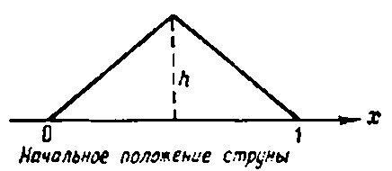

кие движения будет совершать струна, если ее отпустить? 6. Решите задачу о затухающих колебаниях струны

MATHBLK0541X

Представляется ли вам разумным полученное решение? Удовлетворяет ли оно уравнению с частными производными, граничным и начальным условиям?

7. Как вы будете решать неоднородное уравнение с заданными начальными и граничными условиям?

MATHBLK0542X

# Лекція 21. ШАРНІРНО ОПЕРТА БАЛКА

Розглянемо малі коливання тонкої балки, кінці якої вільно спираються на дві опори. Це означає, що кінці балки не зміщуються, але можуть вільно повертатися.

Тому на кінцях балки мають виконуватися граничні умови

MATHBLK0543X

а також умови нульового згинального моменту

MATHBLK0544X

Із теорії тонких балок випливає, що згинальний момент пропорційний $ u_{xx} $, тому для вільно опертих кінців саме ці умови є природними.

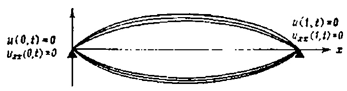

Рис. 21.1. Шарнірно оперта балка.

Отже, коливання балки описуються такою змішаною задачею (для простоти відповідний коефіцієнт вважаємо рівним одиниці):

(21.2)

MATHBLK0545X

Щоб розв’язати цю задачу, використаємо метод розділення змінних. Будемо шукати періодичні розв’язки (гармонічні флуктуації).

(21.3)

MATHBLK0546X

Підставляючи у рівняння, отримуємо:

MATHBLK0547X

Звідси маємо дві задачі:

MATHBLK0548X

Загальний розв’язок для просторової частини:

MATHBLK0549X

Підставляємо граничні умови:

**1.** $ u(0,t)=0 \Rightarrow X(0)=0 $.

MATHBLK0550X

**2.** $ u_{xx}(0,t)=0 \Rightarrow X''(0)=0 $.

MATHBLK0551X

**3.** $ u(1,t)=0 \Rightarrow X(1)=0 $.

MATHBLK0552X

**4.** $ u_{xx}(1,t)=0 \Rightarrow X''(1)=0 $.

MATHBLK0553X

Із перших двох умов:

MATHBLK0554X

Підставляючи у решту умов, отримуємо систему для визначення констант та власних значень $ \omega $.

Нетривіальний розв’язок існує тоді, коли:

MATHBLK0555X

звідки:

MATHBLK0556X

## Розклад розв’язку

Загальний розв’язок можна подати у вигляді суперпозиції:

MATHBLK0557X

де $ X_n(x) $ — власні функції задачі.

Коефіцієнти $ A_n $, $ B_n $ визначаються з початкових умов:

MATHBLK0558X

# Лекція 22. ПЕРЕХІД ДО БЕЗРОЗМІРНИХ ЗМІННИХ

**Мета лекції:** показати, як крайові, початкові та фізичні задачі можна записати у безрозмірному вигляді.

Перехід до безрозмірних змінних дозволяє привести рівняння до універсального вигляду без явної залежності від фізичних параметрів. Це спрощує аналіз і підкреслює математичну структуру задачі.

Після такого переходу багато різних задач (у фізиці, хімії, біології) зводяться до однієї і тієї ж канонічної форми.

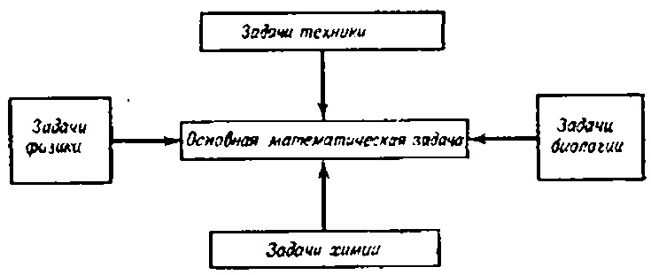

Рис. 22.1. Різні задачі, що приводяться до безрозмірної форми.

## Приведення дифузійної задачі до безрозмірного вигляду

Почнемо зі змішаної задачі для відрізка з початковою умовою на температуру  
\( u(x,0)=\sin\left(\frac{\pi x}{L}\right) \)  
та граничними температурами на кінцях \(T_1\) і \(T_2\). Іншими словами, ми розв'язуємо задачу

(22.1)

MATHBLK0559X

(см. рис. 22.2).

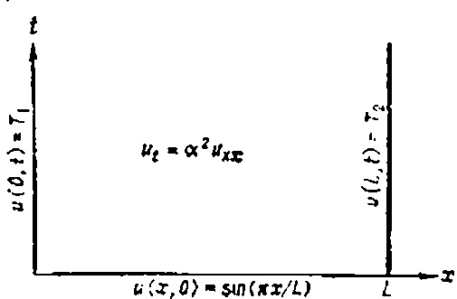

Рис. 22.2. Задача теплопровідності в площині змінних \((x,t)\).

## Перехід до безрозмірних змінних

Введемо безрозмірні змінні:
- \( U \) — безрозмірна температура,
- \( \xi \) — безрозмірна координата,
- \( \tau \) — безрозмірний час.

## Перетворення залежної змінної

Визначимо:

MATHBLK0560X

Тоді граничні умови стають:

MATHBLK0561X

Рівняння:

MATHBLK0562X

## Перетворення просторової змінної

Вводимо:

MATHBLK0563X

Тоді:

MATHBLK0564X

Отже задача набуває вигляду:

MATHBLK0565X

## Перетворення часу

Введемо безрозмірний час:

MATHBLK0566X

Тоді:

MATHBLK0567X

Отримуємо остаточну безрозмірну задачу:

MATHBLK0568X

## Відновлення початкової змінної

MATHBLK0569X

## Висновки

1. Рівняння не містить фізичних параметрів.
2. Граничні умови спрощені.
3. Початкова задача стала універсальною.
4. Розв’язок легко повертається до фізичних змінних.

## ДОДАТКОВО

Для хвильового рівняння:

MATHBLK0570X

використовують заміну:

MATHBLK0571X

що приводить до:

MATHBLK0572X

## ЗАВДАННЯ

1. Перетворити задачу (22.5) до безрозмірного вигляду.
2. Записати задачу теплопровідності у безрозмірній формі.
3. Довести усунення параметра \(\alpha\) заміною часу.
4. Вибрати змінну \(\xi\) для рівняння переносу \(u_t + v u_x = 0\).
5. вона відокремлює хвильові, дифузійні та стаціонарні процеси;
6. саме для канонічних форм існує найбільше готових аналітичних методів;
7. чисельні схеми для гіперболічних задач зазвичай теж будують уже після такого перетворення.

Як тільки розв'язок знайдено в нових координатах, його завжди можна перетворити назад у початкові координати $ (x,y) $.

# ЗАВДАННЯ

1. Визначте, чи є наступні рівняння гіперболічними, параболічними чи еліптичними:
   $ u_{xx}u_{xy}=0 $; $ u_{tt}=u_{xx}+u_x+hu $; $ u_{xx}+3u_{yy}=\ sin x $; $ u_{xx}+u_{yy}=f(x,y) $; $ u_{rr}+\frac{1}{r}u_r+\frac{1}{r^2}u_{\theta\theta}=f(r,\theta) $.

2. Отримайте співвідношення (23.4), (23.5) та (23.6).

3. Переконайтеся, що рівняння

MATHBLK0573X

є гіперболічним при всіх $ x $ та $ y $, і знайдіть його характеристики.

4. Зведіть рівняння з попередньої задачі до канонічної форми

MATHBLK0574X

5. Продовжте задачу 4 і приведіть це рівняння до другої канонічної форми

MATHBLK0575X

6. Найдите характеристики уравнения

MATHBLK0576X

Перетворіть рівняння на нові координати, розв'яжіть його і поверніться до координат x і y, щоб отримати розв'язок початкової здогадки.

# Лекція 23. КЛАСИФІКАЦІЯ РІВНЯНЬ З ЧАСТКОВИМИ ПОХІДНИМИ (КАНОНІЧНА ФОРМА ГІПЕРБОЛІЧНОГО РІВНЯННЯ)
МЕТА ЛЕКЦІЇ: Показать, что линейное уравнение второго порядка с двумя независимыми переменными

MATHBLK0577X

(A, B, C, D, E, F и G являются функциями x и y или могут быть константами) относится к одному из следующих типов:

- 1) гиперболическому (если  $ B^2 - 4AC > 0 $ ),
- 2) параболическому (если  $ B^2 - 4AC = 0 $ ),
- 3) эллиптическому (если  $ B^2 - 4AC < 0 $ ).

Показать, какие новые переменные  $ \xi = \xi(x, y) $  и  $ \eta = \eta(x, y) $  можно ввести вместо x и y, чтобы упростить исходное уравнение. В новых переменных  $ \xi $  и  $ \eta $  уравнение с частными производными приводится к одному из следующих видов (в вависимости от того, будет ли величина  $ B^2 - 4AC $  положительна, равна нулю или отрицательна):

- 1.  $ \begin{case} u_{\xi\xi} - u_{\eta\eta} = \Psi(\xi, \eta, u, u_{\xi}, u_{\eta}) & \text{(дві канонічні форми гіперболічного рівняння),,} \end{cases} $
- 2.  $ u_{\eta\eta} = \Phi(\xi, \eta, u, u_{\xi}, u_{\eta}) $  (каноническая форма параболического уравнения),
- 3.  $ u_{\xi\xi} + u_{\eta\eta} = \Phi(\xi, \eta, u, u_{\xi}, u_{\eta}) $  (каноническая форма эллиптического уравнения),

где  $ \Phi $  и  $ \Psi $ —функции от частных производных первого порядка, зависимой переменной u и новых независимых переменных  $ \xi \xi $  и  $ \eta $ . Конкретный вид функций  $ \Phi $  и  $ \Psi $  зависит от исходного уравнения.

У читателя может возникнуть мысль, что глава, посвященная классификации уравнений, должна размещаться в самом начале книги. Вероятно, это правильно, и многие книги действительно начинаются с этого материала. Однако правда и то, что многие студенты не могут с энтузиазмом изучать нечто такое, о чем у них нет никакого представления. Именно по этой причине мы отложили изучение темы, посвященной классификации уравнений с частными производными, до настоящего момента.

Наша задача - классифицировать все уравнения вида

(23 1) 

MATHBLK0578X

где A, B, C, D, E, F и G—вообще говоря, функции [x и y. Согласно предлагаемой схеме классификации уравнение называется

1) гиперболическим в точке  $ (x_0,  y_0) $ , если  $ B^2(x_0, y_0) - 4A(x_0, y_0) \помножити на $  $ \помножити на C(x_0, y_0) > 0 $ 2) параболнческим в точке  $ (x_0, y_0) $ , если  $ B^2(x_0, y_0) - 4A(x_0, y_0) \помножити на C(x_0, y_0) = 0 $ ,

3) эллиптическим в точке  $ (x_0, y_0) $ , если  $ B^2(x_0,  y_0) - 4A(x_0, y_0) \помножити на $  $ \помножити на C(x_0, y_0) < 0 $ и в зависимости от типа его можно привести к одной из канонических форм. Для того чтобы было легче разобраться в классификационной схеме, мы приведем четыре примера гиперболических, параболических и эллиптических уравнений.

## Примеры гиперболических, параболических и эллиптических уравнений 10

1. У равнение теплопроводности  $ u_t = u_{xx} $  — линейное уравнение второго порядка вида (23.1) с коэффициентами

MATHBLK0579X,  $ B=0 $ ,  $ C=0 $ ,  $ D=0 $ ,  $ E=-1 $ ,  $ F=0 $ ,  $ G=0 $ ,

так что  $ B^2-4AC=0 $  при всех x и t. Следовательно, это уравнение будет параболическим при всех x и t. В общем уравнении (23 1) переменная y играет роль времени t. Результат не изменится, если в общем уравнении поменять местами x и y.

2. Волновое уравнение  $ u_{tt} = u_{xx} $  также принадлежит классу уравнений вида (23.1) с коэффициентами

MATHBLK0580X,  $ B=0 $ ,  $ C=-1 $ ,  $ D=E=F=G=0 $ .

Так как  $ B^2 - 4AC = 4 $  для всех x и t, то это уравнение является еиперболическим при всех x и t.

<sup>1)</sup> Следует указать, что приведенные в примерах уравнения являются частными случаями более общих параболических, гиперболических в эллиптических уравнений, а основные их свойства характерны и для общего случая.

3. У равнение Лапласа  $ u_{xx} + u_{yy} = 0 $  является эллиптическим при всех x и y, так как  $ B^2 - 4AC = - - 4 < 0 $ .

4. Линейное уравнение  $ xu_{xx} + u_{yy} = \sin x $  с переменными коэффициентами также принадлежит классу уравнений вида (23.1), но для него  $ B^2-4AC=-4x $  и, следовательно, уравнение будет эллиптическим при x > 0,

лараболическим при x=0, гиперболическим при x < 0.

Этот пример иллюстрирует тот факт, что тип уравнения о переменными коэффициентами может изменяться от точки к точке.

Читатель должен обратить внимание на следующее: тип уравнения (23.1) определяется только коэффициентами при вторых првизводных и никак не зависит ни от коэффициентов при первых производных и самой функции, ни от свободного члена.

Обратимся теперь к главной теме нашей лекции — приведению гиперболических уравнений к каноническому виду. Известно, что если в данной области пространства уравнение является гиперболическим, то вместо x и y можно ввести координаты  $ \xi $  и  $ \eta $ (характеристические переменные) таким образом, что уравнение примет простейшую форму

(23.2) 

MATHBLK0581X

Это уравнение содержит только одну производную второго порядка  $ u_{\xi\eta} $ , а функция  $ \Phi(\xi,\eta,u,u_{\xi},u_{\eta}) $  зависит только от новых независимых переменных § и η, зависимой переменной и и первых производных из и ип. Конкретный вид функции Ф зависит, конечно, от исходного уравнения и формул перехода к новым координатам § и п. Научимся отыскивать эти функции.

## Каноническая форма гиперболического уравнения

Рассмотрим уравнение общего вида

(23.3) 

MATHBLK0582X

и пусть в интересующей нас области  $ B^2 - 4AC > 0 $ . Нам нужно ввести новые координаты 1)

MATHBLK0583X

 \eta = \eta(x, y)

MATHBLK0584X

\begin{array}{c} u_x = u_\xi \xi_x + u_\eta \eta_x, \\ u_y = u_\xi \xi_y + u_\eta \eta_y, \\ (23.4) \ u_{xx} = u_{\xi\xi} \xi_x^2 + 2u_{\xi\eta} \xi_x \eta_x + u_{\eta\eta} \eta_x^2 + u_{\xi} \xi_{xx} + u_{\eta} \eta_{xx}, \\ u_{xy} = u_{\xi\xi} \xi_x \xi_y + u_{\xi\eta} (\xi_x \eta_y + \xi_y \eta_x) + u_{\eta\eta} \eta_x \eta_y + u_{\xi} \xi_{xy} + u_{\eta} \eta_{xy}, \\ u_{yy} = u_{\xi\xi} \xi_y^2 + 2u_{\xi\eta} \xi_y \eta_y + u_{\eta\eta} \eta_y^2 + u_{\xi} \xi_{yy} + u_{\eta} \eta_{yy}. \end{array}

MATHBLK0585X

\overline{A}u_{\xi\xi} + \overline{B}u_{\xi\eta} + \overline{C}u_{\eta\eta} + \overline{D}u_{\xi} + \overline{E}u_{\eta} + \overline{F}u = \overline{G},

MATHBLK0586X

 \overline{B} = 2A\xi_{x}\eta_{x} + B(\xi_{x}\eta_{y} + \xi_{y}\eta_{x}) + 2C\xi_{y}\eta_{y},

MATHBLK0587X

 \overline{D} = A\xi_{xx} + B\xi_{xy} + C\xi_{yy} + D\xi_{x} + E\xi_{y},

MATHBLK0588X

 \overline{F} = F,

MATHBLK0589X

Читателю предоставится возможность проделать эти выкладки при решении задач.

Наш следующий шаг—выбрать функции  $ \xi = \xi(x, y) $  и  $ \eta = \eta(x, y) $  таким образом, чтобы коэффициенты  $ \overline{A} $  и  $ \overline{C} $  обратились в нуль. Это позволит нам привести исходное уравиение к канонической форме. Итак, необходимо потребовать, чтобы

MATHBLK0590X

 $ \bar{C} = A\eta_x^2 + B\eta_x\eta_y + C\eta_y^2 = 0. $ Эти уравнения можно представить в виде

MATHBLK0591X

Разрешив их относительно  $ [\xi_x/\xi_y] $  и  $ [\eta_x/\eta_y] $ , получаем

(23.7) 

MATHBLK0592X

 (характеристические 

MATHBLK0593X

 уравнения).

Kaждое из квадратных уравнений для  $ [\xi_x/\xi_y] $  и  $ [\eta_x/\eta_y] $  имеет два кория, но мы оставляем только по одному, но так чтобы они были различны.


Рис. 23.1. Характеристики  $ \xi(x, y) = c $  и  $ \eta(x, y) = c $ .

Задача свелась к нахождению двух функций  $ \xi(x, y) $  и  $ \eta(x, y) $ , таких, чтобы отношения  $ [\xi_x/\xi_y] $  и  $ [\eta_x/\eta_y] $  удовлетворяли уравнению (23.7). Найти такие функции очень просто 1), если обратить внимание на рис. 23.1. Чтобы понять, каким образом можно это сделать, рассмотрим простое уравнение

MATHBLK0594X

Его характеристики определяются из уравнений

MATHBLK0595X

Решая эти уравнения относительно у, получаем

MATHBLK0596X

 y = 2x + c_2.

MATHBLK0597X

\xi = y + 2x = c_1,

MATHBLK0598X

<sup>1)</sup> См., например, Тихонов А. Н., Самарский А. А. Уравнения математической физики. — М.: Наука, 1972 и др. издания. — Прим. ред.

Очевидно, введенные таким образом функции  $ \xi $  и  $ \eta $  удовлетворяют уравнениям характеристик. Эти новые координаты изображены на рис. 23.2. На этом мы заканчиваем обсуждение вопроса о том, как найти новые координаты. Осталось последнее — определить новый вид исходного уравнения.


Рис. 23.2. Характеристические координаты для уравнения  $ u_{xx} - 4u_{yy} + u_x = 0 $ .

Это совсем просто: чтобы найти каноническую форму уравнения с частными производными, подставим новые координаты  $ \xi(x, y) $  и  $ \eta(x,) y) $  в уравнение

MATHBLK0599X,

где  $ \overline{A} $ ,  $ \overline{B} $ ,  $ \overline{C} $ ,  $ \overline{D} $ ,  $ \overline{E} $ ,  $ \overline{F} $  и  $ \overline{G} $  определены формулами (23.6).

Прежде чем закончить лекцию, давайте на конкретном примере посмотрим, как «работает» общий метод приведения к каноническому виду.

Приведение гиперболического уравнения  $ y^2u_{xx}-x^2u_{yy}=0 $  к канонической форме

Рассмотрим уравнение

MATHBLK0600X,  $ x>0  x $ ,  $ 0  y>0 $ ,

которое является гиперболическим в первом квадранте. Найдем новые координаты таким образом, чтобы привести исходное уравнение к канонической форме.

ШАГ 1. Решаем уравнения характеристик

MATHBLK0601X

 (напомним, что этот шаг 

MATHBLK0602X

 обеспечивает  $ \overline{A} = \overline{C} = 0 $ ),


Рис. 23.3. Новые карактеристические координаты.

Проинтегрировав эти обыкновенные дифференциальные уравнения методом разделения переменных, получаем два неявных соотнощения (при желании можно было бы явно выразить у через х)

MATHBLK0603X

 y^2 + x^2 = \text{const}.

MATHBLK0604X

\xi = y^2 - x^2

MATHBLK0605X

\overline{B} = 2A\xi_x\eta_x + B(\xi_x\eta_y + \xi_y\eta_x) + 2C\xi_y\eta_y = -16x^2y^2

MATHBLK0606X

\bar{D} = A\xi_{xx} + B\xi_{xy} + C\xi_{yy} + D\xi_x + E\xi_y = -2(x^2 + y^2)

MATHBLK0607X

 \overline{F} = F = 0

MATHBLK0608X

\overline{G} = G = 0

MATHBLK0609X

\overline{A}u_{\xi\xi} + \overline{B}u_{\xi\eta} + \overline{C}u_{\eta\eta} + \overline{D}u_{\xi} + \overline{E}u_{\eta} + \overline{F}u = \overline{G}

MATHBLK0610X

u_{\xi\eta} = \frac{-(x^2 + y^2) u_{\xi} + (y^2 - x^2) u_{\eta}}{8x^2y^2}.

MATHBLK0611X

u_{\xi\eta} = \frac{\eta u_{\xi} - \xi u_{\eta}}{2(\xi^2 - \eta^2)}.

MATHBLK0612X

\alpha = \alpha (\xi, \eta) = \xi + \eta,

MATHBLK0613X

\begin{array}{l} u_{\xi} = u_{\alpha}\alpha_{\xi} + u_{\beta}\beta_{\xi} = u_{\alpha} + u_{\beta}. \\ u_{\eta} = u_{\alpha}\alpha_{\eta} + u_{\beta}\beta_{\eta} = u_{\alpha} - u_{\beta}, \\ u_{\xi\eta} = u_{\alpha\alpha}\alpha_{\eta} + u_{\alpha\beta}\beta_{\eta} + u_{\beta\alpha}\alpha_{\eta} + u_{\beta\beta}\beta_{\eta} = u_{\alpha\alpha} - u_{\beta\beta}, \end{array}

MATHBLK0614X

u_{\alpha\alpha} - u_{\beta\beta} = \frac{-\beta u_{\alpha} - \alpha u_{\beta}}{2\alpha\beta}.

MATHBLK0615X

\alpha = \xi + \eta = (y^2 - x^2) + (y^2 + x^2) = 2y^2,

MATHBLK0616X

- Читатель может спросить, зачем нужно классифицировать и приводить к канонической форме уравнения с частными производными.
  - а) Разбиение уравнений на классы гиперболических, параболических и эллиптических соответствует разбиению физических процессов на три основных класса: волновых, диффузионных и стационарных. Математические особенности решений уравнений этих трех типов совершенно различны.
  - б) В большинстве работ, посвященных решению гиперболических задач, предполагается, что исходное уравнение записано в канонической форме, т. е. в виде

MATHBLK0617X

Если у нас есть уравнение и мы хотим получить его решение, мы должны преобразовать его к канонической форме и воспользоваться известными результатами.

в) Для численного решения канонического гиперболического уравнения создано много различных программ для ЭВМ.

Функция  $ \Phi $  ( $ \xi $ ,  $ \eta $ , u,  $ u_{\xi} $ ,  $ u_{\eta} $ ) вводится в  $ \Theta $ ВМ в виде подпрограммы, так что сначала необходимо привести уравнение к канонической форме. После того как решение в новых координатах найдено, его всегда можно преобразовать обратно к исходным координатам.
## ЗАДАЧІ - 1. Выясните, являются ли приведенные ниже уравнения гиперболическими, параболическими или эллиптическими:
  - a) $ u_{xx}+u_{xy}=0 $,
  - б) $ u_{tt}=u_{xx}+u_x+hu $,
  - в) $ u_{xx}+3u_{yy}=\sin x $,
  - г) $ u_{xx}+u_{yy}=f(x,y) $,
  - д) $ u_{rr}+\frac{1}{r}u_r+\frac{1}{r^2}u_{\theta\theta}=f(r,\theta) $.
- 2. Получите соотношения (23.4), (23.5) и (23.6).
- 3. Убедитесь в том, что уравнение

MATHBLK0618X

гиперболического типа при всех $ x $ и $ y $ и найдите характеристики.
- 4. Приведите уравнение из предыдущей задачи к каноническому виду

MATHBLK0619X

- 5. Продолжите задачу 4 и приведите уравнение ко второй канонической форме

MATHBLK0620X

- 6. Найдите характеристики уравнения

MATHBLK0621X

Преобразуйте уравнение к новым координатам, решите и, вернувшись к координатам $ x $ и $ y $, получите решение исходной задачи.

# Лекція 24. ХВИЛЬОВЕ РІВНЯННЯ У ВІЛЬНОМУ ПРОСТОРІ (ДВОВИМІРНІ ТА ТРИВИМІРНІ ЗАДАЧІ)
МЕТА ЛЕКЦІЇ: Узагальнити формулу д'Аламбера на двовимірний і тривимірний випадки та пояснити геометричний зміст відповідних розв'язків.

Розглянемо задачу Коші для хвильового рівняння у тривимірному просторі:

MATHBLK0622X

 u(x,y,z,0)=\varphi(x,y,z),
\qquad u_t(x,y,z,0)=\psi(x,y,z).

MATHBLK0623X

\Delta u=u_{xx}+u_{yy}+u_{zz}.

MATHBLK0624X

u(x,y,z,t)=\frac{\partial}{\partial t}\!\left[t\,\overline{\varphi}(x,y,z,t)\right]+t\,\overline{\psi}(x,y,z,t),

MATHBLK0625X

\varphi_{xx} + \varphi_{yy} = 0, \qquad -\infty < x < \infty,\quad y > 0,

MATHBLK0626X

\varphi(x,0) =
\begin{cases}
1, & |x| \le 1, \\
0, & |x| > 1.
\end{cases}

MATHBLK0627X

w = \ln\!\left(\frac{z - 1}{z + 1}\right), \qquad z = x + iy.

MATHBLK0628X

S_n = S[f] = \frac{2}{L} \int_0^L f(x) \sin(n\pi x/L) dx

MATHBLK0629X

C_n = C[f] = \frac{2}{L} \int_0^L f(x) \cos(n\pi x/L) dx

MATHBLK0630X

f(x) = \sum_{n=1}^{\infty} S_n \sin(n\pi x/L)

MATHBLK0631X

f(x) = \frac{C_0}{2} + \sum_{n=1}^{\infty} C_n \cos(n\pi x/L)

MATHBLK0632X

f(x) = \sum_{n=1}^{\infty} S_n \sin(n\pi x/L)

MATHBLK0633X

Обратное косинус-преобразование

Отметим, что в обратном косинус-преобразовании суммирование начинается с n=0, а в синус-преобразовании — с n=1.

## Примеры синус-преобразования

Пусть

MATHBLK0634X

тогда

MATHBLK0635X

График функции f(x) и ее преобразования изображены на рис. 25.1. Обратное преобразование записывается в виде

MATHBLK0636X

Знаете ли вы, как выглядит график этой функции ене отрезка [0, 1]? Подумайте над этим. Отметим также, что синус-преобразование функции f(x) определено только для положительных целых n. Другими словами, конечные синус- и косинус-преобразования преобразуют функции в числовые последовательности.


Рис. 25.1. Графики функции f(x) = 1 и ее преобразования.

## Свойства преобразований

Прежде чем приступить к решению задач, мы должны получить некоторые свойства этих преобразований.

Если u(x, t) — функция  $ \partial \theta yx $  переменных и мы проводим преобразование по переменной x, то

MATHBLK0637X

 C[u] = C_n(t) = \frac{2}{L} \int_0^L u(x, t) \cos(\pi nx/L) dx.

MATHBLK0638X

\begin{split} S\left[u_{t}\right] &= \frac{dS\left[u\right]}{dt}, \quad S\left[u_{tt}\right] = \frac{d^{2}S\left[u\right]}{dt^{2}}, \\ S\left[u_{xx}\right] &= -\left[n\pi/L\right]^{2}S\left[u\right] + \frac{2n\pi}{L^{2}}\left[u\left(0,\ t\right) + (-1)^{n+2}u\left(L,\  t\right)\right], \\ C\left[u_{xx}\right] &= -\left[n\pi/L\right]^{2}C\left[u\right] - \frac{2}{L}\left[u_{x}\left(0,\ t\right) + (-1)^{n+1}u_{x}\left(L,\ t\right)\right]. \end{split}

MATHBLK0639X

(\text{УЧП}) \quad u_{tt} = u_{xx} + \sin(\pi x), \quad 0 < x < 1, \quad 0 < t < \infty,

MATHBLK0640X

 (\text{HV}) \quad \begin{cases} u(x, 0) = 1, \\ u_t(x, 0) = 0, \end{cases} \quad 0 \leqslant x \leqslant 1.

MATHBLK0641X

S[u_{tt}] = S[u_{xx}] + S[\sin(\pi x)]

MATHBLK0642X

\begin{split} \frac{d^2S_n\left(t\right)}{dt^2} &= -\left(\pi n\right)^2S_n\left(t\right) + 2n\pi\left[u\left(0,\ t\right) + \left(-1\right)^{n+1}u\left(1,\ t\right)\right] + D_n\left(t\right) = \\ &= -\left(n\pi\right)^2S_n\left(t\right) + D_n\left(t\right),  \end{split}

MATHBLK0643X

D_n(t) = S[\sin(\pi x)] = \begin{cases} 1, & n = 1 \ \text{(це коефіцієнти розкладу} \\0, &n = 2, 3, \dots \end{cases}

MATHBLK0644X

S[u(x, 0)] = S_n(0) = \begin{cases} 4/n\pi, & n = 1, 3, \dots, \\ 0, &n = 2, 4, \dots, \end{cases}

MATHBLK0645X

Итак, решим теперь новое семейство задач Кощи:

(ОДУ) 

MATHBLK0646X

 S_n(0) = \begin{cases}
4/n\pi, & n = 1, 3, \dots, \\
0, & n = 2, 4, \dots,
\end{cases}

MATHBLK0647X

В результате получаем

MATHBLK0648X,

где

MATHBLK0649X

 S_n(t) = \begin{cases} 0, &n = 2, 4, \dots, \\ (4/n\pi)\cos(n\pi t), &n = 3, 5, 7, \dots \end{cases}

MATHBLK0650X

u(x, t) = [A\cos(\pi t) + (1/\pi)^2] \sin(\pi x) + \frac{4}{\pi} \sum_{n=1}^{\infty} \frac{1}{2n+1} \cos[(2n+1)\pi t] \sin[(2n+1)\pi x].

MATHBLK0651X

\begin{cases} u(0, t) = f(t) \\ u(L, t) = g(t) \end{cases}

MATHBLK0652X

\begin{array}{llll} (\mathrm{Y} \mathrm{U} \Pi) & u_t = u_{xx}, \quad 0 < x < 1, \quad 0 < t < \infty, \\ (\mathrm{\Gamma} \mathrm{Y} & \left\{ \begin{array}{ll u_x} �  \left( 0, \ t \right) = 0 \\ u_x \left( 1, \ t \right) = 0, \end{array} \right. & 0 < t < \infty, \\ (\mathrm{H} \mathrm{Y}) & u \left( x, \ 0 \right) = 1 + \cos \left( \pi x \right) + 0.. 5 \cos \left( 3\pi x \right),  \quad 0 \leqslant x \leqslant 1. \end{array}

MATHBLK0653X

\begin{array}{llll} (\text{PHP}) & u_t = \alpha^2 u_{xx} + bu + f(x, t), \quad 0 < x < 1, \quad 0 < t < \infty, \\ (\text{GU}) & \left\{ \begin{array}{llll} u(0, t) = 0, \\ u(1, t) = 0, \end{array} \right. & 0 < t < \infty, \\ (\text{NU}) & u(x, 0) = 0, \quad 0 \leqslant x \leqslant 1. \end{array}

MATHBLK0654X

\begin{array}{llll} (\text{PHP}) & u_t = u_{xx} + \sin{(3\pi x)}, & 0 < x < 1, & 0 < t < \infty, \\ (\text{GU}) & \begin{cases} u(0, \ t) = 0, \\ u(1, \ t) = 1, \end{cases} & 0 < t < \infty, \\ (\text{NU}) & u(x, \ 0) = \sin{(\pi x)}, & 0 \leqslant x \leqslant 1. \end{array}

MATHBLK0655X

u_t = u_{xx} + \sin(\pi x), \quad 0 < x < 1, \quad 0 < t < \infty,

MATHBLK0656X

\begin{cases} u(0, t) = 0, \\ u(1, t) = 0, \\ u(x, 0) = \sin(2\pi x), \quad 0 \le x \le \le 1. \end{cases}

MATHBLK0657X

f_x=\frac{df}{du}\,u_x.

MATHBLK0658X

u_t + f_x = 0

MATHBLK0659X

u_t + \frac{df}{du}u_x = u_t + g(u)u_x = 0,

MATHBLK0660X

u_t + 2u\,u_x = 0.

MATHBLK0661X

\begin{aligned}
(\text{УЧП})\quad & u_t + 2u\,u_x = 0, && -\infty < x < \infty,\ 0 < t < \infty, \\
(\text{НУ})\quad & u(x,0)=\varphi(x), && -\infty < x < \infty.
\end{aligned}

MATHBLK0662X

\begin{aligned}
(\text{УЧП})\quad & u_t + g(u)u_x = 0, && -\infty < x < \infty,\ 0 < t < \infty, \\
(\text{НУ})\quad & u(x,0)=\varphi(x), && -\infty < x < \infty.
\end{aligned}

MATHBLK0663X

u_t + v u_x = 0

MATHBLK0664X

x = x_0 + g(u)\,t.

MATHBLK0665X

x = x_0 + g\!\bigl[u(x_0,0)\bigr]\,t.

MATHBLK0666X

u_t + 3u\,u_x = 0

MATHBLK0667X

x = 2 + g[1]\,t = 2 + 3t.

MATHBLK0668X

\begin{aligned}
(\text{УЧП})\quad & u_t + 2u\,u_x = 0, && -\infty < x < \infty,\ 0 < t < \infty, \\
(\text{НУ})\quad &
u(x,0)=
\begin{cases}
1, & x \le 0,\\
1-x, & 0 < x < 1,\\
0, & 1 \le x,
\end{cases}
&& -\infty < x < \infty.
\end{aligned}

MATHBLK0669X

x = x_0 + g[1]\,t = x_0 + 2t,

MATHBLK0670X

t = \frac{x-x_0}{2}.

MATHBLK0671X

x = x_0 + g(1-x_0)t = x_0 + 2(1-x_0)t,

MATHBLK0672X

t = \frac{x-x_0}{2(1-x_0)}.

MATHBLK0673X

x = x_0.

MATHBLK0674X

S=\frac{0-1}{0-1}=1.

MATHBLK0675X

u=\varphi(x-g(u)t)

MATHBLK0676X

\begin{aligned}
(\text{РЧП})\quad & u_t + g(u)u_x = 0, && -\infty < x < \infty,\quad 0 < t < \infty,\\
(\text{ПУ})\quad & u(x,0)=\varphi(x), && -\infty < x < \infty.
\end{aligned}

MATHBLK0677X

\begin{aligned}
(\text{РЧП})\quad & u_t + u\,u_x = 0, && -\infty < x < \infty,\quad 0 < t < \infty,\\
(\text{ПУ})\quad & u(x,0)=x, && -\infty < x < \infty,
\end{aligned}

MATHBLK0678X

u=\varphi[x-g(u)t]=x-ut.

MATHBLK0679X

u(x,t)=\frac{x}{1+t}.

MATHBLK0680X

\begin{aligned}
(\text{УЧП})\quad & u_t + u\,u_x = 0, && -\infty < x < \infty,\quad 0 < t < \infty, \\
(\text{НУ})\quad &
u(x,0)=
\begin{cases}
0, & x < 0,\\
x, & 0 \le x.
\end{cases}
\end{aligned}

MATHBLK0681X

\begin{aligned}
(\text{УЧП})\quad & u_t + u^2 u_x = 0, && -\infty < x < \infty,\quad 0 < t < \infty, \\
(\text{НУ})\quad &
u(x,0)=
\begin{cases}
0, & x < 0,\\
x, & 0 \le x.
\end{cases}
\end{aligned}

MATHBLK0682X

u_t + f_x = -F(u).

MATHBLK0683X

u = \varphi[x-g(u)t]

MATHBLK0684X

\begin{aligned}
(\text{УЧП})\quad & u_t + g(u)u_x = 0,\\
(\text{НУ})\quad & u(x,0)=\varphi(x).
\end{aligned}

MATHBLK0685X

u_t + Au_x = 0

MATHBLK0686X

v_1 + \Lambda v_x = 0,

MATHBLK0687X

u_t + uu_x + vu_y + \frac{1}{\rho} p_x = 0

MATHBLK0688X

u_{tt} = c^2 u_{xx} + a u_t + b u

MATHBLK0689X

u_1 = u_1

MATHBLK0690X

 u_3 = u_4

MATHBLK0691X

\begin{cases} \frac{\partial u_1}{\partial x} = u_2, \\ \frac{\partial a_1}{\partial t} = u_3, \\ \frac{\partial u_3}{\partial t} = c^2 \frac{\partial u_2}{\partial x} + au_3 + bu_4. \end{cases}

MATHBLK0692X

A = \begin{bmatrix} 1 & 1 \\ 4 & 1 \end{bmatrix}

MATHBLK0693X

\det\left(A-\lambda I\right)=0,

MATHBLK0694X

\det \begin{bmatrix} 1-\lambda & 1\\ 4 & 1-\lambda \end{bmatrix} = (1-\lambda)^2 - 4 =

MATHBLK0695X

Откуда 

MATHBLK0696X,  $ \lambda_2 = 3 $ .

Определение. Если  $ \lambda $ —собственное значение матрицы A, то соответствующим ему собственным вектором называется такой ненулевой вектор, который удовлетворяет соотношению

MATHBLK0697X.

Пример. Вектор  $ X = \begin{bmatrix} 1 \\ 2 \end{bmatrix} $  является собственным вектором, соответствующим собственному значению  $ \lambda_2 = 3 $ , так как

MATHBLK0698X

Определение. Матрица  $ A^{-1} $  называется обратной к матрице A, если

MATHBLK0699X

Пример, Обратной к

MATHBLK0700X

является матрица

MATHBLK0701X

де I - одинична матриця.

поскольку

MATHBLK0702X

# Диагонализация матрицы

Пусть A — квадратная матрина порядка n и пусть все ее собственные значения  $ \lambda_1 $ ,  $ \lambda_2 $  ...  $ \lambda_n $  различны. Составим матрицу P так, чтобы у нее *столбцами* были координаты собственных векторов (в k-м столбце стоит собственный вектор  $ X_k $ , соответствующий собственному значению  $ \lambda_k $ ), т. е.

MATHBLK0703X

Тогда матрица Л, определяемая соотношением

MATHBLK0704X

где  $ P^{-1} $  — обратная к матрице P, будет диагональной матрицей вида

MATHBLK0705X

Например, у матрицы

MATHBLK0706X

собственные числа равны  $ \lambda_1 = 4 $  и  $ \lambda_2 = -4 $ , а собственные векторы соответственно

MATHBLK0707X

 in  $ X_2 = \begin{bmatrix} -2 \\ 1 \end{bmatrix} $ .

Значит, произведение

MATHBLK0708X

дорівнює діагональній матриці

MATHBLK0709X

(Читатель может проверить это самостоятельно.)

Теперь можно решить простую систему двух уравнений с частными производными (с соответствующими начальными условиями).

# Решение линейной системы $ u_t + Au_x = 0 $ .

Рассмотрим задачу Коши для системы, содержащей два уравнения и два начальных условия:

(УЧП 1) 

MATHBLK0710X,  
(29.3) (УЧП 2)  $ \frac{\partial u_2}{\partial t} + 2 \frac{\partial u_1}{\partial x} = 0 $ ,  $ -\infty < x < \infty $ ,  $ 0 < t < \infty $ ,  
(HУ 1)  $ u_1(x, 0) = f(x) $ ,  
(HУ 2)  $ u_2(x, 0) = g(x) $ ,  $ -\infty < x < \infty $ .

Эта задача может соответствовать определению давления  $ u_1(x, t) $  и плотности  $ u_2(x, t) $  как функции пространственной координаты x и времени t по известным распределениям этих величин в начальный момент.

Запишемо систему рівнянь у матричній формі

MATHBLK0711X

или $ (29 \ 4) $ 

MATHBLK0712X

где

MATHBLK0713X

Введем новые неизвестные функции

MATHBLK0714X

с помощью преобразования

MATHBLK0715X.

где P—матрица, по столбцам которой стоят собственные векторы матрицы A (матрица P нам уже известна). Оказывается, что после такого преобразования для определения v получится очень простая система (два уравнения относительно новых неизвестных  $ v_1 $  и  $ v_2 $  оказываются независимыми). Значит,  $ v_1 $  и  $ v_2 $  легко находятся. После того как  $ v_1 $  и  $ v_2 $  найдены, по формуле

MATHBLK0716X

находятся искомые функции и, и и2.

Сначала, однако, выясним, как выглядит система для определения v. Чтобы разобраться в этом, читатель должен обратиться к матричному исчислению. Продифференцировав обе части соотношения u = Pv, получаем

(29 5) 

MATHBLK0717X

 \frac{\partial u}{\partial x} = P \frac{\partial v}{\partial x}.

MATHBLK0718X

u_t + Au_x = 0

MATHBLK0719X

Pv_t + APv_x = 0.

MATHBLK0720X

v_t + P^{-1}APv_x = 0,

MATHBLK0721X

(29,6) v_t + \Lambda v_x = 0.

MATHBLK0722X

\Lambda = \begin{bmatrix} 4 & 0 \\ 0 & -4 \end{bmatrix}.

MATHBLK0723X

\frac{\frac{\partial v_1}{\partial t} + 4 \frac{\partial v_1}{\partial x} = 0, \\ \frac{\partial v_2}{\partial t} - 4 \frac{\partial v_2}{\partial x} = 0.

MATHBLK0724X

v_1(x, t) = \varphi(x-4t),

MATHBLK0725X

u = Pv = \begin{bmatrix} 2 & -2 \\ 1 & 1 \end{bmatrix} \begin{bmatrix} v_1 \\ v_2 \end{bmatrix} =

MATHBLK0726X

 = \begin{bmatrix} 2\varphi(x - 4t) - 2\psi(x + 4t) \\ \varphi(x - 4t) + \psi(x + 4t) \end{bmatrix}.

MATHBLK0727X

u_1(x, t) = 2\varphi(x-4t) - 2\psi(x+4t), u_2(x, t) = \varphi(x-4t) + \psi(x+4t).

MATHBLK0728X

\phi(\xi) = \sin \xi, \ \psi(\xi) = \xi^2

MATHBLK0729X

u_1(x, t) = 2 \sin(x-4t) - 2(x+4t)^2,

MATHBLK0730X

u_1(x, 0) = f(x),

MATHBLK0731X

2\varphi(x) - 2\psi(x) = f(x),

MATHBLK0732X

откуда функци і ф и ф легко находятся:

MATHBLK0733X

 \psi(x) = \frac{1}{4} \left[ 2g(x) - f(x) \right].

MATHBLK0734X

u_{1}(x, t) = 2\varphi(x-4t) - 2\psi(x+4t) =

MATHBLK0735X

(29.9)

MATHBLK0736X

 = \frac{1}{4} \left[ f(x-4t) + 2g(x-4t) \right] + \frac{1}{4} \left[ 2g(x+4t) - f(x+4t) \right].

MATHBLK0737X

u_t + A(x, t) u_x + B(x, t) u = 0

MATHBLK0738X

Au_t + Bu_x + Cu = 0,

MATHBLK0739X

A = \begin{bmatrix} 1 & 1 \\ 4 & 1 \end{bmatrix}.

MATHBLK0740X

\begin{cases} \frac{\partial u_1}{\partial t} + \frac{\partial u_1}{\partial x} + \frac{\partial u_2}{\partial x} = 0, \\ \frac{\partial u_2}{\partial t} + 4 \frac{\partial u_1}{\partial x} + \frac{\partial u_2}{\partial x} = 0. \end{cases}

MATHBLK0741X

u_{tt} = c^2 \left( u_{rr} + \frac{1}{r} u_r + \frac{1}{r^2} u_{\theta\theta} \right)

MATHBLK0742X

u(r, \theta, t) = P(r) \Theta(\theta) T(t),

MATHBLK0743X

T'' + \lambda^2 c^2 T = 0

MATHBLK0744X

\begin{array}{llll} (\text{UPP}) & u_{tt} = c^2 \left( u_{rr} + \frac{1}{r} u_r + \frac{1}{r^2} u_{\theta\theta} \right), & 0 < r < 1, \ 0 <t < \infty, \\ (\text{GU}) & u = 0 & \text{when} r = 1, & 0 < t < \infty, \\ (\text{NU}) & \begin{cases} u = f(r, \ \theta) \\ u_t = g(r, \ \theta) \end{cases} & \text{when} t = 0. \end{array}

MATHBLK0745X

u(r, \theta, t) = U(r, \theta) T(t)

MATHBLK0746X

\Delta U + \lambda^2 U = 0

MATHBLK0747X

T'' + \lambda^2 c^2 T = 0

MATHBLK0748X

\Delta U = U_{rr} + \frac{1}{r} U_r + \frac{1}{r^2} U_{\theta\theta}.

MATHBLK0749X

u(1, \theta, t) = U(1, \theta) T(t) = 0, \quad 0 < t < \infty,

MATHBLK0750X

U(1, \theta) = 0.

MATHBLK0751X

\Delta U + \lambda^2 U = 0,

MATHBLK0752X

 \begin{cases} \Delta U + \mu u = 0 & \text{у колі,} \\ U = 0 & \text{на межі кола} \end{cases}

MATHBLK0753X

\begin{array}{llll} (\mathsf{Y}\mathsf{H}\mathsf{\Pi}) & \Delta U + \lambda^2 U = 0, \\ (\mathsf{\Gamma}\mathsf{Y}) & U(1, \theta) = 0, \end{array}

MATHBLK0754X

U(r, \theta) = R(r) \Theta(\theta)

MATHBLK0755X

r^2R'' + rR' + (\lambda^2r^2 - n^2)R = 0

MATHBLK0756X

r^2R'' + rR' + (\lambda^2r^2 - n^2) R = 0

MATHBLK0757X

r^2R'' + rR' + (\lambda^2r^2 - n^2)R = 0

MATHBLK0758X

R(r) = AJ_n(\lambda r) + BY_n(\lambda r).

MATHBLK0759X

R(r) = AJ_n(\lambda r).

MATHBLK0760X

\lambda = k_{nm}

MATHBLK0761X

U_{nm}(r, \theta) = J_n(k_{nm}r) [A \sin(n\theta) + B \cos(n\theta)].

MATHBLK0762X

f_{nm} = k_{nm}c/2\pi.

MATHBLK0763X

T_{nm}(t) = A \sin(k_{nm}ct) + B \cos(k_{nm}ct)

MATHBLK0764X

T'' + k_{nm}^2 c^2 T = 0.

MATHBLK0765X

\frac{f_{nm}}{f_{01}} = \frac{k_{nm}}{k_{01}} ,

MATHBLK0766X

\frac{k_{01}}{k_{0m}}

MATHBLK0767X

T_{nm}(t) = A \sin(k_{nm}ct) + B \cos(k_{nm}ct)

MATHBLK0768X

u(r, \theta, t) = \sum_{n=0}^{\infty} \sum_{m=1}^{\infty} J_n(k_{nm}r) \cos(n\theta) [A_{nm}\sin(k_{nm}ct) + B_{nm}\cos(k_{nm}ct)].

MATHBLK0769X

u(r, \theta, 0) = f(r),

MATHBLK0770X

u(r, t) = \sum_{m=1}^{\infty} A_m J_0(k_{nm}r) \cos(k_{nm}ct).

MATHBLK0771X

F(R) = \sum_{M=1}^{\infty} A_m J_0(k_{0M}R)

MATHBLK0772X

\int_{0}^{1} r J_{0}(k_{0i}r) J_{0}(k_{0f}r) dr = \begin{cases} 0, & i \neq j, \\ \frac{1}{2} J_{1}^{2}(k_{0i}), & i = j, \end{cases}

MATHBLK0773X

A_{f}\int_{0}^{1}rJ_{\theta}^{2}(k_{\theta f}r)dr=\int_{0}^{1}rf(r)J_{\theta}(k_{\theta f}r)dr.

MATHBLK0774X

A_{j} = 2 \int_{0}^{1} r f(r) J_{0}(k_{0j}r) dr / J_{1}^{2}(k_{0j}), \quad j = 1, 2, \dots

MATHBLK0775X

f(r) = A_1 J_0(k_{01}r) + A_2 J_0(k_{02}r) + A_3 J_0(k_{03}r) + \dots,

MATHBLK0776X

u(r, t) = A_1 J_0(k_{01}r) \cos(k_{01}ct) + A_2 J_0(k_{02}r) \cos(k_{02}ct) + \dots

MATHBLK0777X

u(r, \theta, 0) = J_0(2.4 \ r) + 0.5 \ J_0(8.65 \ r),

MATHBLK0778X

u(r, t) = J_0(2, 4 r) \cos(2, 4 ct) + 0,5 J_0(8,65 r) \cos(8,65 ct).

MATHBLK0779X

\begin{cases} u\left(r,\;\theta,\; 0\right) = J_{\phi}\left(2,4\; r\right) + 0.10\;\; J_{\phi}\left(5,52\; r\right),\\ u_{t}\left(r,\;\theta,\; 0\right) = 0 \qquad \text{(нульова початкова швидкість)}. \end{cases}

MATHBLK0780X

u(r, t) = J_0(2.4 r) \cos(2.4 t) + 0.10 J_0(5.52 r) \cos(5.52 t).

MATHBLK0781X

A_m J_0(k_{0m}r)\cos(k_{0m}ct)

MATHBLK0782X

u_{tt} = c^2 \left( u_{rr} + \frac{1}{r} u_r + \frac{1}{r^2} u_{\theta\theta} \right)

MATHBLK0783X

\Delta U + \lambda^2 U = 0,

MATHBLK0784X

2. Подстановкой  $ U\left(r,\;\theta\right)=R\left(r\right)\Theta\left(\theta\right) $  приведите задачу Гельмгольца

MATHBLK0785X

 U(1, \theta) = 0

MATHBLK0786X

r^2R'' + rR' + (\lambda^2r^2 - n^2)R = 0,

MATHBLK0787X

\begin{array}{llll} \text{(GU)} & u_{tt} = \Delta u, & 0 < r < 1, & 0 < t < \infty, \\ \text{(GU)} & u\left(1, \; \theta, \; t\right) = 0, & 0 < t < \infty, \\ \text{(\text{НУ})} & \begin{cases} u\left(r, \; \theta, \; \theta\right) = 1 - r^2, \\ u_t\left(r, \; \theta, \; \theta\right) = 0. \end{cases} & 0 \leqslant r \leqslant 1, \\ \end{array}

MATHBLK0788X

\begin{array}{llll} \text{(GU)} & u_{tt} = \Delta u, & 0 < r < 1, & 0 < t < \infty, \\ \text{(GU)} & u\left(1, & \theta, & t\right) = 0, & 0 <t < \infty, \\ \text{(NU)}} & \begin{cases} u\left(r, & \theta, & 0\right) = J_0\left(2, 4 \r\right), \\ u_t\left(r, & \theta, & 0\right) = 0. \end{cases} & 0 \leqslant r \leqslant 1, \\ \end{array}

MATHBLK0789X

\Delta u = u_{xx} + u_{yy} \qquad \qquad \qquad \qquad \qquad \qquad \qquad \qquad \qquad

MATHBLK0790X

\Delta = \frac{\partial^2}{\partial x^2} + \frac{\partial^2}{\partial y^2} + \frac{\partial^2}{\partial z^2},

MATHBLK0791X

\Delta u = u_{xx} + u_{yy}

MATHBLK0792X

\begin{array}{|c|c|c|c|}
\hлінія r^2 = x^2 + y^2, & x = r \cos \theta, \\
\text{tg } \theta = y/x, & y = r \sin \theta.
\end{array}

MATHBLK0793X

r^2 = x^2 - y^2

MATHBLK0794X

r^2 = x^2 + y^2 + z^2

MATHBLK0795X

\Delta u = u_{xx} + u_{yy}.

MATHBLK0796X

u_x = u_r r_x + u_\theta \theta_x = u_r (\cos \theta) - u_\theta (\sin \theta/r).

MATHBLK0797X

u_y = u_r r_y + u_\theta \theta_y = u_r \sin \theta + u_\theta (\cos \theta/r).

MATHBLK0798X

u_{xx} = (u_x)_x =

MATHBLK0799X

 = (u_r \cos \theta - u_\theta \sin \theta/r)_r \cos \theta + (u_r \cos \theta - u_\theta \sin \theta/r)_\theta (\sin \theta/r) =

MATHBLK0800X

 + (u_{r\theta} \cos \theta - u_r \sin \theta - u_{\theta\theta} \sin \theta/r - u_\theta \cos \theta/r) (-\sin \theta/r).

MATHBLK0801X

u_{yy} = (u_{rr}\sin\theta + u_{r\theta}\cos\theta/r - \cos\theta/r^2)\sin\theta + + (u_{r\theta}\sin\theta + u_{r}\cos\theta + u_{\theta\theta}\cos\theta/r - u_{\theta}\sin\theta/r)(\cos\theta/r).

MATHBLK0802X

\Delta u = u_{xx} + u_{yy} = u_{rr} + \frac{1}{r} u_r + \frac{1}{r^2} u_{\theta\theta},

MATHBLK0803X

\Delta u = u_{xx} + u_{yy} + u_{zz}.

MATHBLK0804X

\Delta u = u_{rr} + \frac{1}{r} u_r + \frac{1}{r^2} u_{\theta\theta} + u_{zz},

MATHBLK0805X

\Delta u = u_{rr} + \frac{2}{r} u_r + \frac{1}{r^2} u_{\varphi\varphi} + \frac{\operatorname{ctg} \varphi}{r^2} u_{\varphi} + \frac{1}{r^2 \sin^2 \varphi} u_{\theta\theta}.

MATHBLK0806X

u_i = \alpha^2 \Delta u

MATHBLK0807X

\Delta u = 0

MATHBLK0808X

\begin{array}{llll} (\text{УЧП}) & u_t = u_{xx} + \sin{(\pi x)}, & 0 < x < 1, & 0 < t < \infty, \\ (32.1) & (\Gamma \text{Y}) & \begin{cases} u(0, t) = 0, \\ u(1, t) = 0, \\ u(x, 0) = \sin{(3\pi x)}, & 0 \le x \le \le 1. \end{cases} \\ \end{array}

MATHBLK0809X

\begin{cases} \frac{d^{2}u}{dx^{2}} = -\sin(\pi x), & 0 < x < 1, \\ u(0) = 0, \\ u(1) = 0. \end{cases}

MATHBLK0810X

u(x, \infty) = \frac{1}{\pi^2} \sin{(\pi x)}.

MATHBLK0811X

\frac{1}{\pi^2}\sin{(\pi x)}.

MATHBLK0812X

u_{tt} = \Delta u, \quad 0 \le r < 1,

MATHBLK0813X

\begin{cases} u(r, \theta, 0) = f(r, \theta), \\ u_t(r, \theta, 0) = g(r, \theta) \end{cases}

MATHBLK0814X

\begin{array}{llll} (\mathrm{Y}\mathrm{H}\mathrm{\Pi}) & \Delta U + \lambda^2 U = 0, \\ (\mathrm{H}\mathrm{Y}) & U\left(1,\,\theta\right) = 0. \end{array}

MATHBLK0815X

u_i = \Delta u

MATHBLK0816X

u_{rr} + \frac{1}{r}u_r + \frac{1}{r^2}u_{\theta\theta} = 0, \quad 0 < r < 1,

MATHBLK0817X

\frac{\partial u}{\partial r} = \sin \theta.

MATHBLK0818X

\begin{cases} \Delta u = 0, & 0 < r < 1, \\ \frac{\partial u}{\partial r} = \sin \theta, & r = 1,\ 0 \le \theta < 2\pi. \end{cases}

MATHBLK0819X

\int_{0}^{2\pi} \frac{\partial u}{\partial r} d\theta = \int_{0}^{2\pi} \sin\theta \, d\theta = 0

MATHBLK0820X

\int_{C} \frac{\partial u}{\partial n} = 0,

MATHBLK0821X

\begin{cases} \Delta u = 0, & 0 < r < 1, \\ \frac{\partial u}{\partial r}(1, \theta) = 1, & r = 1,\ 0 \le \theta < 2\pi, \end{cases}

MATHBLK0822X

\begin{cases} \Delta u = 0, & 0 < r < 1, \\ \frac{\partial u}{\partial r}(1, \theta) = \cos(2\theta), & r = 1,\ 0 \le \theta < 2\pi, \end{cases}

MATHBLK0823X

u(r,\theta)=r^2\cos{(2\theta)}.

MATHBLK0824X

\frac{\partial u}{\partial n} + h (u - g) = 0,

MATHBLK0825X

\frac{\partial u}{\partial n} = -h (u - g).

MATHBLK0826X

\frac{\partial u}{\partial r} = -h(u - \sin \theta), \quad r = 1, \quad 0 \le \theta < 2\pi.

MATHBLK0827X

\begin{array}{llll} (\text{УЧП}) & \Delta u = 0, \quad 0 < r < 1, \\ (\Gamma \text{Y}) & \frac{\partial u}{\partial r} + h \left( u - \sin \theta \right) = 0, \quad 0 \leqslant \theta < 2\pi. \end{array}

MATHBLK0828X

\frac{\partial u}{\partial r} = 0.

MATHBLK0829X

\begin{array}{llll} (\text{УЧП}) & \Delta u = 0, & 0 < r < 1, \\ (\text{GU}) & u(1, \theta) = \sin \theta, & 0 \leqslant \theta < 2\pi. \end{array}

MATHBLK0830X

(\forall \Pi)

MATHBLK0831X

\Delta u = 0

MATHBLK0832X

\begin{array}{llll} (\text{PHP}) & u_{tt} = u_{xx} - u_t + u, \quad 0 < x < 1, \quad 0 < t < \infty, \\ (\text{GU}) & \left\{ \begin{array}{llll} u\left(0, \t\right) = 0, \\ u\left(1, \t\right) = 0, \end{array} \right. \quad 0 < t < \infty, \\ (\text{NU}) & \left\{ \begin{array}{llll} u\left(x, \ 0\right) = \sin\left(3\pi x\right), \\ u_t\ left(x, \ 0\right) = 0? \end{array} \right. \quad 0 \leqslant x \leqslant 1, \end{array}

MATHBLK0833X

\Delta u = -\lambda^2 u

MATHBLK0834X

u_{xx} + u_{yy} = 0, \quad 0 < x < 1, \quad 0 < y < 1,

MATHBLK0835X

(FY) 

MATHBLK0836X

# Лекція 33. ВНУТРІШНЯ ЗАДАЧА ДІРІХЛЕ ДЛЯ КРУГА МЕТА ЛЕКЦІЇ: Показать, как методом разделения переменных решигь внутреннюю задачу Дирихле для круга

(УЧП) 

MATHBLK0837X

(ГУ)  $ u(1, \theta) = g(\theta), \quad 0 \le \theta < 2\pi. $ 

Сначала граничное условие разлагается в ряд

MATHBLK0838X

а затем ищется решение каждой из задач

MATHBLK0839X

 $ \Delta u = 0, $  $ u(1, \theta) = \sin(n\theta), $   $ u(1, \theta) = \cos n\theta. $ 

Решения этих задач записываются в виде

MATHBLK0840X

откуда получается решение задачи Дирихле

MATHBLK0841X

После того как решение в виде ряда получено, путем алгебраических преобразований решению можно придать другую, интегральную форму, которая называется интегральной формулой Пуассона. В этой лекции предлагается множество новых идей, как решить задачу Дирихле

(33.1) 

MATHBLK0842X

Сначала мы будем решать эту задачу методом разделения переменных, а затем, когда решение в виде ряда будет найдено, мы преобразуем его к другому виду (интегральная формула Пуассона).

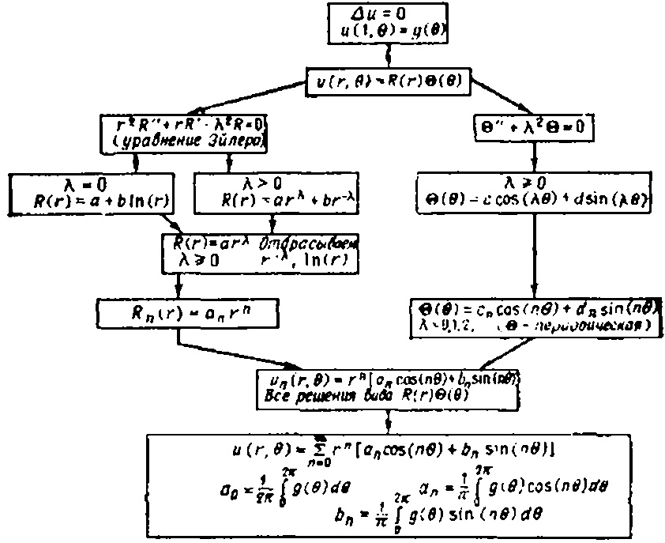

Рис. 33.1. Схема решения внутренней задачи Дирихле.

Задача (33.1) очень важна в физических приложениях. Ее можно интерпретировать как задачу нахождения электростатического потенциала внутри круга по известному распределению потенциала на границе. Другая интерпретация — модель мыльной пленки. Если сделать из проволоки кольцо и изотнуть его так, чтобы изгиб задавался функцией  $ g(\theta) $ , а затем погрузить в мыльный раствор, то мыльная пленка натянется в соответствии с формой проволоки. Возвышения точек пленки описываются решением задачи (33.1), если смещения  $ g(\theta) $  малы.

Читатель должен хорошо разобраться в методе разделения переменных, в общих чертах изображенном на рис. 33.1, и тщательно проработать его.

Дадим несколько пояснений к рис. 33.1.

- 1. Читатель должен проверить, что константа разделения должна быть неотрицательной (вот почему она обозначена  $ \lambda^2 $ ). Если бы константа разделения была отрицательной, то функции  $ \Theta(\theta) $  не были бы периодическими. Если же константа разделения нулевая, то в решение необходимо ввести логарифмический член, т. е.  $ R(r) = a + \ln r $ .
- 2. Читатель должен знать, как получить константы  $ a_n $  и  $ b_n $ . Итак, решение внутренней задачи Дирихле записывается в виде

(33.2) 

MATHBLK0843X

Прежде чем перейти к другой форме представления решения, проведем анализ формулы (33.2).

# Анализ решения задачи Дирихле

1. Остановимся сначала на структуре решения (33.2). Согласно этому решению, мы в первую очередь должны разложить граничную функцию в ряд Фурье

MATHBLK0844X

а затем решить задачу для каждого синуса и косинуса, входящих в ряд. Каждое из этих слагаемых порождает решения вида  $ r^n \sin{(n\theta)} $  и  $ r^n \cos{(n\theta)} $ , так что по принцицу суперпозиции

MATHBLK0845X

2. Рішення, наприклад, задачі:

(УЧП) $ \Delta u = 0 $, $ 0 < r < 1 $.

(ГУ) $ u(1, \theta) = 1 + \sin \theta + \frac{1}{2} \sin 3\theta + \cos (4\theta) $.

Должно иметь вид:

MATHBLK0846X

поскольку  $ g(\theta) $  в данном случае уже разложена в ряд Фурье с коэффициентами  $ a_0=1,\  a_4=1,\ b_1=1,\ b_3=0,5, $  все остальные значения  $ a_n $  и  $ b_n $  равны нулю, поэтому для их вычисления нет необходимости пользоваться формулами.

3. Если радиус круга произволен (скажем, R), то решение запишется в виде

MATHBLK0847X

4. Заметим, что константа  $ a_{\theta} $  в решении (33.2) представляет собой среднее значение функции  $ g\left(\theta\right) $ 

MATHBLK0848X

Этим завершается решение задачи методом разделения переменных. Перейдем теперь к весьма интересной интегральной формуле Пуассона.

# Интегральная формула Пуассона

Возьмем решение задачи Дирихле, полученное методом разделения переменных

MATHBLK0849X

(мы взяли случай произвольного радиуса круга) и подставим в него формулы для вычисления коэффициентов  $ a_n $  и  $ b_n $ . После ряда выкладок с применением алгебры, интегрального исчисления и тригонометрии получаем

MATHBLK0850X

Последнее выражение и называется интегральной формулой Пуассона. Итак, мы получили еще одну форму представления реше-

ния внутренией задачи Дирихле

(33.3) 

MATHBLK0851X

# Анализ интегральной формы решения

1. Можно считать, что по формуле Пуассона (33.3) потенциал u в точке  $ (r,\theta) $  является взвещенным средним граничного потенциала. Весовая функция называется ядром Пуассона и имеет вид

Ядро Пуассона = 

MATHBLK0852X

Это говорит нам кое-что о физике системы, а именно: потенциал в точке является взвешенным средним потенциалов соседних точек.

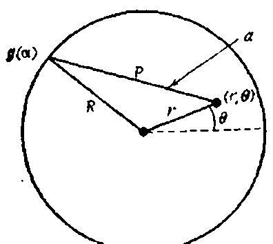

Рис. 33.2. Решение  $ a\left(r,\theta\right) $  — взвешенная сумма граничных потенциалов. a — Квадрат этон длины является знаменателем ядра Пуассона.

Ядро Пуассона показывает только, каков вклад каждой точки в общий потенциал (рис. 33.2).

Для граничных значений  $ (R, \alpha) $ , близких к  $ (r, \theta) $ , ядро Пуассона становится большим, так как значенатель ядра равен квадрату расстояния между точками  $ (r, \theta) $  и  $ (R, \alpha) $  и, значит, мал (рис. 33.2) Благодаря этому больший вклад в интеграл дают значения  $ g(\alpha) $ , для которых  $ (R, \alpha) $  близки к  $ (r,  \theta) $ . К сожалению, если точка  $ (r, \theta) $  как угодно близко подходит к границе r = R, то ядро Пуассона также неограниченно возрастает. Поэтому

численные вначения решения вблизи границы удобнее вычислять с помощью рядов.

2. Если вычислить потенциал в центре круга по формуле Пуассона, то получим

MATHBLK0853X

Другими словами, потенциал в центре равен среднему значению потенциала на окружности.

Этим мы завершаем обсуждение задачи Дирихле. Читателю может показаться, что на самом деле эта задача и не так уж важна, поскольку область, в которой она решается, так проста. Действительно, уравнение Лапласа упрощается, если область, в которой ищется решение, представляет собой круг, квадрат, полуплоскость и т. д. Однако здесь существенны два момента.

Во многих случаях экспериментатор, разрабатывая свою физическую аппаратуру, может выбирать форму границы по своему

усмотрению (в том числе и в виде окружности).

2. Далее мы будем изучать конформные отображения, которые позволяют преобразовывать сложные области в области простой формы (например, круга). Следовательно, чтобы решить задачу Дирихле в произвольной области, можно конформно отобразить ее на круг, воспользоваться решением, полученным в этой лекции, и преобразовать затем его к исходным координатам.
#### ЗАУВАЖЕННЯ
1. Краевую задачу для неоднородного уравнения

MATHBLK0854X

  $ \Delta u = f $ , внутри  $ D $ ,  $ (GI) $   $ u = 0 $ , на границе  $ D $ ,

всегда можно рещить следующим приемом.

Найдем частное решение V уравнения  $ \Delta V = f $  и решим краевую задачу

MATHBLK0855X, внутри  $ D $ ,  $ W = V $ , на границе  $ D $ .

Тогда решение исходной задачи находится по формуле u=V-W. Другими словами, неоднородность уравнения можно перенести в граничное условие.

2. Краевую вадачу с неоднородными граничными условиями

MATHBLK0856X

  $ \Delta u = 0 $ , внутри  $ D $ ,  $ (G $   $ I  ) you = f $ , на границе  $ D $ ,

можно решить следующим способом:

- а) найти любую функцию V, которая удовлетворяет на границе D условию V=f;
- б) решить новую краевую задачу

MATHBLK0857X, внутри  $ D $ ,  $ W = 0 $ , на границе  $ D $ ;

в) найти решение исходной задачи по формуле u = V - W. Другими словами, неоднородность из граничного условия можно перенести в уравнение.
#### ЗАДАЧІ
1. Тщательно разберитесь во всех деталях применения метода разделения переменных при решении задачи Дирихле (33.1). Это важно потому, что, когда вы будете решать следующие задачи, возникнут интересные отличия. Вы должны особенно хорошо понимать, почему константа разделения не может быть отрицательной, и при  $ \lambda=0 $  отбрасывается очень важное решение. Почему? Посмотрите внимательно на рис. 33.1.

2. Найдите решение внутренней задачи Дирихле

(УЧП) 

MATHBLK0858X,  $ 0 < r < 1 $ ,

при следующих граничных условиях:

a) 

MATHBLK0859X,

- 6)  $ u(1, \theta) = 2 $ ,
- B)  $ u(1, \theta) = \sin \theta $ ,
- r)  $ u(1, \theta) = \sin 3\ тета $ .

Как выглядят ваши решения? Удовлетворяют ли они уравнению Лапласа?

3. Найдите решение внутренней задачи Дирихле в круге радиусом R=2.

(УЧП) 

MATHBLK0860X,  $ 0 < r < 2 $ ,  
(ГУ)  $ u(2, \theta) = \sin \theta $ ,  $ 0 \le \theta \le 2\pi $ .

Как выглядит график этого решения?

- 4. Как изменится решение задачи 3, если граничное условие заменить на  $ u(2, \theta) = \sin(2\theta) $ ? Как выглядит график этого решения?
- 5. Решите задачу

MATHBLK0861X

 (\mathsf{\Gamma}\mathsf{Y}) \quad u(1, \, \theta) = \begin{cases} \sin \theta, & 0 \le \theta < \pi, \\ 0, & \pi \le \theta < 2\pi. \end{cases}

MATHBLK0862X

u_{rr} + \frac{1}{r} u_r + \frac{1}{r^2} u_{\theta\theta} = 0, \quad R_1 < r < R_2,

MATHBLK0863X

\frac{1}{r^n}\sin{(n\theta)}, \quad \frac{1}{r^n}\cos{(n\theta)}, \quad \ln r.

MATHBLK0864X

+\sum_{n=1}^{\infty} \left[ (a_n r^n + b_n r^{-n}) \cos(n\theta) + (c_n r^n + d_n r^{-n}) \sin(n\theta) \right].

MATHBLK0865X

\begin{array}{llll} (\text{PHP}) & \Delta u = 0, \quad 1 < r < \infty, \\ (\text{GU}) & u\left(1, \; \theta\right) = g_1\left(\theta\right), \quad 0 \leqslant \theta < 2\pi, \end{array}

MATHBLK0866X

u(r, \theta) = \sum_{n=0}^{\infty} r^{-n} [a_n \cos(n\theta) + b_n \sin(n\theta)].

MATHBLK0867X

\begin{aligned} & (\text{УЧП}) \quad u_{rr} + \frac{1}{r} u_r + \frac{1}{r^2} u_{\theta\theta} = 0, \quad R_1 < r < R_2, \\ & (\text{GU}) \quad \begin{cases} u(R_1, \ \theta) = g_1(\theta), \\ u(R_2, \ \theta) = g_2(\theta). \end{cases} \quad 0 \leqslant \theta \leqslant 2\pi, \end{aligned}

MATHBLK0868X

u(r, \theta) = R(r) \Theta(\theta)

MATHBLK0869X

r^2R'' + rR' - \lambda^2R = 0

MATHBLK0870X

(r^2R'' + rR' - \lambda^2R = 0)

MATHBLK0871X

r^2R'' + rR' = 0,

MATHBLK0872X

R(r) = a + b \ln r.

MATHBLK0873X

rV' + V = 0

MATHBLK0874X

R(r) = c_1 \ln r + c_2

MATHBLK0875X

r^2R'' + rR' - \lambda^2R = 0.

MATHBLK0876X

R(r) = ar^{\alpha_1} + br^{\alpha}

MATHBLK0877X

R(r) = ar' + br^{-\lambda}.

MATHBLK0878X

\lambda = 0 \begin{cases} R(r) = a + b \ln r, \\ \Theta(\theta) = c + d\theta, \\ \lambda > 0 \end{cases}

MATHBLK0879X

Функция  $ \Theta(\theta) $  должна быть *периодической* с периодом  $ 2\pi $ . Значит, величина  $ \lambda $  должна принимать значения  $ 0, 1, 2, 3, \ldots $ . Теперь мы можем с помощью произведения составить следующие решения.

# Решения уравнения Лапласа

MATHBLK0880X

 $ c \ln r, $  $ cr^n \cos(n\theta) \ (n = 1, 2, ...), $    $ cr^n \sin(n\theta) \ (n = 1,  2, ...), $  $ cr^{-n} \cos(n\theta) \ (n = 1, 2, ...), $    $ cr^{-n} \sin(n\theta) \ (n = 1, 2, ...). $ Поскольку сумма этих решений также является решением, то делаем вывод, что общее решение уравнения Лапласа в нашем случае должно иметь вид

(34.2) 

MATHBLK0881X

Осталось только найти все коэффициенты в сумме (34.2) так, чтобы удовлетворить граничным условиям

MATHBLK0882X

Подстановка (34.2) в граничные условия приводит к следующим уравнениям:

MATHBLK0883X

 (решаются относительно  $ a_0 $  и  $ b_0 $ ), 

MATHBLK0884X

 (решаются относительно  $ a_n $  и  $ b_n $ ),

MATHBLK0885X

Тем самым из этих уравнений находятся все неизвестные коэффициенты  $ a_0 $ ,  $ b_0 $ ,  $ а

_n $ ,  $ b_n $ ,  $ c_n $  и  $ d_n $ . Теперь задача (34.1) полностью решена. Решение дается выражением (34.2), коэффициенты которого определяются по формулам (34.3).

Чтобы лучше понять полученные результаты, рассмотрим

несколько примеров.

# Некоторые варианты задачи Дирихле в кольце

ПРИМЕР 1.

Предположим, что потенциал на внутренней окружности равен нулю, а потенциал на внешней равен  $ \sin\theta $ . Тогда

(УЧП) 

MATHBLK0886X,  $ 1 < r < 2 $ ,  
(ГУ) 

MATHBLK0887X

  $ 0 \le \theta \le 2\pi $ ,

Первое, что мы должны сделать—это вычислить все интегралы в (34.3) и решить соответствующие уравнения для  $ a_0 $ ,  $ b_0 $ ,  $ a_n $ ,  $ b_n $ ,  $ c_n $  и  $ d_n $ . Целесообразно сначала попытаться подобрать такие частные решения (из выписанных выше), линейная комбинация которых удовлетворяет граничным условням (здесь  $ u = Ar \sin \theta + Br^{-1} \sin \theta $ ). Затем из граничных условий найти коэффициенты (здесь A = 2/3, B = -2/3). В результате этих простых вычислений получаем

MATHBLK0888X

 c_n=\begin{cases}
2/3, & n=1, \\
0 & \text{для всіх інших } n,
\end{cases}
\qquad d_n=\begin{cases}
-2/3, & n=1, \\
0 & \text{для всіх інших } n.
\end{cases}

MATHBLK0889X

u(r, \theta) = \frac{2}{3} \left(r - \frac{1}{r}\right) \sin \theta.

MATHBLK0890X

\Delta u = 0

MATHBLK0891X

\begin{cases} u(1, \theta) = 3, \\ u(2, \theta) = 5. \end{cases} 0 \le \theta \le 2\pi,

MATHBLK0892X

a_0 + b_0 \ln 1 = 3

MATHBLK0893X

u(r, \theta) = 3 + 2.9 \ln r

MATHBLK0894X

\Delta u = 0

MATHBLK0895X

\begin{cases} u(1, \theta) = \sin \theta, \\ u(2, \theta) = \sin \theta. \end{cases} \quad 0 \le \theta \le 2\pi,

MATHBLK0896X

c_1 + d_1 = \frac{1}{\pi} \int_0^{2\pi} \sin^2 \theta \ d\theta = 1,

MATHBLK0897X

Решая эту систему, получаем  $ c_1=1/3 $  и  $ d_1=2/3 $ . Следовательно, решением задачи является функция

MATHBLK0898X

Форма кривых при различных значениях  $ \theta $  показана на рис. 34.3.


Рис. 34.3 Мыльная оченка между  $ u\left(1,\ ;\theta\right)=\sin\theta $  и  $ u\left(2,\;\theta\right)=\sin\theta $ .

Наша лекция завершается кратким обсуждением внешней за-дачи Дирихле для круга.

# Внешняя задача Дирихле

Внешняя задача Дирихле

MATHBLK0899X

решается точно так же, как решалась внутренняя задача в лекции 33. За исключением того, что теперь необходимо отбросить те решения, которые не ограничены при стремлении г к бесконечности, т. е.

MATHBLK0900X,  $ r^n \cos(n\theta) $   $ H $   $ r^n \sin(n\theta) $ .

Следовательно, в качестве решения остается взять функцию

(34.4) 

MATHBLK0901X

где коэффициенты  $ a_n $  и  $ b_n $  вычисляются по тем же формулам, что и раньше:

MATHBLK0902X

 a_n = \frac{1}{\pi} \int_0^{2\pi} g(\theta) \cos(n\theta) d\theta, \quad b_n = \frac{1}{\pi} \int_0^{2\pi} g(\theta) \sin(n\theta) d\theta.

MATHBLK0903X

g(\theta) = \sum_{n=0}^{\infty} [a_n \cos(n\theta) + b_n \sin(n\theta)],

MATHBLK0904X

\Delta u = 0

MATHBLK0905X

u(r, \theta) = 1 + \frac{1}{r} \sin \theta + \frac{1}{r^3} \cos (3\theta).

MATHBLK0906X

\Delta u = 0

MATHBLK0907X

u(r, \theta) = \frac{1}{r^4} \cos(4\theta)

MATHBLK0908X

\begin{array}{llll} (\text{УЧП}) & \Delta u = 0, & R < r < \infty, \\ (\text{ГУ}) & u (R, \theta) = g (\theta), & 0 \leqslant \theta \leqslant 2\pi, \end{array}

MATHBLK0909X

u(r, \theta) = \sum_{n=0}^{\infty} (r/R)^{-n} [a_n \cos(n\theta) + b_n \sin(n\theta)].

MATHBLK0910X

\Delta u = 0

MATHBLK0911X

\begin{cases} u(1, \theta) = \cos \theta, \\ u(2, \theta) = \sin \theta. \end{cases}

MATHBLK0912X

(\forall \Pi) \quad \Delta u = 0, \quad 1 < r < \infty,

MATHBLK0913X

u(1, \theta) = 1

MATHBLK0914X

u(1, \theta) = 1 + \cos(3\theta)

MATHBLK0915X

u(1, \theta) = \sin(\theta) + \cos(3\theta)

MATHBLK0916X

u(1, \theta) = \sin(\theta) + \cos(3\theta)

MATHBLK0917X

\begin{array}{llll} (\forall \Pi \Pi) & \Delta u = 0, \quad 1 < r < \infty, \\ (\Gamma \forall) & \frac{\partial u}{\partial r} (1, \theta) = g(\theta), \quad 0 \leqslant \theta \leqslant 2\pi, \end{array}

MATHBLK0918X

u(r, \theta) = \sum_{n=0}^{\infty} r^{-n} [a_n \cos(n\theta) + b_n \sin(n\theta)],

MATHBLK0919X

\frac{\partial u}{\partial r}(1, \theta) = \sin \theta

MATHBLK0920X

\begin{cases} \Delta u = 0, & 1 < r < \infty, \\ \frac{\partial u}{\partial r}(1, \theta) = \sin \theta. \end{cases}

MATHBLK0921X

\begin{cases} u(R_1, \theta) = g_1(\theta), \\ u(R_2, \theta) = g_2(\theta) \end{cases}

MATHBLK0922X

(r^2u_r)_r + \frac{1}{\sin\varphi} \left[\sin\varphi u_q\right]_{\varphi} + \frac{1}{\sin^2\varphi} u_{\theta\theta} = 0^{-1}

MATHBLK0923X

u(1, \theta, \varphi) = g(\varphi), \quad 0 \le \varphi \le \pi,

MATHBLK0924X

g(\varphi) = \sum_{n=0}^{\infty} a_n P_n(\cos \varphi),

MATHBLK0925X

U(R, \varphi) = \sum_{n=0}^{\infty} a_n r^n P_n(\cos \varphi).

MATHBLK0926X

U(R, \varphi) = \sum_{n=0}^{\infty} \frac{a_n}{r^{n+1}} P_n(\cos \varphi).

MATHBLK0927X

(Y \Psi \Pi) \quad (r^2 u_r)_r + \frac{1}{\sin \varphi} [\sin \varphi \, u_\varphi]_\varphi + \frac{1}{\sin^2 \varphi} \, u_{\theta\theta} = 0,

MATHBLK0928X

Обратим внимание на то, что сферический лапласнан записан не так, как раньше. Эта форма записи более компактна и более удобна для использования. Другая типичная интерпретация этой задачи такова: найти распределение температуры внутри сферы, если температура на границе сферы задана. Очень часто функция  $ g(\theta, \phi) $  имеет специальный вид, так что нет необходимости решать задачу в самом общем виде.

В этой лекции мы остановимся на двух важных частных случаях. В одном случае функция  $ g(\theta, \phi) $  будет константой, а в другом — будет зависеть только от угла  $ \phi $  (этот угол отсчитывается от северного полюса сферы).

#### Частные случаи задачи Дирихле

Частный случай  $ I(g(\theta, \phi) = \text{const}) $ 

Ясно, что в этом случае решение не зависит от углов ф и 0 и уравнение Лапласа переходит в обыкновенное дифференциальное уравнение

MATHBLK0929X

Это очень простое уравнение, и читатель может легко решить его. Общее решение этого уравнения имеет вид

(35.2) 

MATHBLK0930X.

Другими словами, среди всех потенциалов существует только два таких, которые не зависят от углов, а зависят только от r. Эти потенциалы— константа и c/r. Потенциал 1/r играет очень важную роль в физике и называется ньютоновским потенциалом.

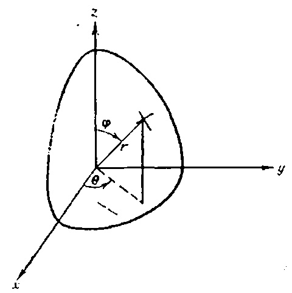

Рис. 35.1. Задача Дирихле в щаре

Теперь мы решим две задачи, в каждой из которых потенциал зависит только от r.

ЗАДАЧА 1 (Потенциал внутри сферы)

(УЧП) 

MATHBLK0931X,  $ 0 < r < 1 $ , (ГУ)  $ u(1, \theta, \varphi) = 3 $ .

Согласно (35.2), получаем ограниченное решение  $ u(r, \theta, \phi) = 3 $ .  $ 3A \квадрат A \ квадрат A = 2 $  (Потенциал между двумя сферами, каждая из которых обладает постоянным потенциалом)

Предположим, что мы хотим найти стационарное распределение температуры между двумя сферами, которые поддерживаются при различных температурах:

MATHBLK0932X

 (\text{ГУ}) \quad \begin{cases} u(R_1, \theta, \varphi) = A, \\ u(R_2, \theta, \varphi) = B. \end{cases}

MATHBLK0933X

u(r) = \frac{a}{r} + b,

MATHBLK0934X

a = \frac{(A-B)R_1R_2}{R_2-R_1}

MATHBLK0935X

(r^2u_r)_r + \frac{1}{\sin\varphi} [\sin\varphi u_\varphi]_\varphi = 0

MATHBLK0936X

u(r, \varphi) = R(r) \Phi(\varphi).

MATHBLK0937X

r^2R'' + 2rR' - n(n+1)R = 0

MATHBLK0938X

\alpha = \begin{cases} n \\ -(n+1). \end{cases}

MATHBLK0939X

x = \cos \varphi

MATHBLK0940X

(1-x^2)\frac{d^2\Phi}{dx^2} - 2x\frac{d\Phi}{dx} + (n+1)n\Phi = 0, \quad -1 < x < 1.

MATHBLK0941X

\begin{array}{llll} n=0, & P_{0}(x)=1, \\ n=1, & P_{1}(x)=x, \\ n=2, & P_{2}(x)=\frac{1}{2}(3x^{2}-1), \\ n=3, & P_{3}(x)=\frac{1}{2}(5x^{3}-3x), & -1\leqslant x\leqslant 1, \\ & \vdots & \vdots & \vdots \\ n, & P_{n}(x)=\frac{1}{2^{n}n!}\frac{d^{n}}{dx^{n}}[(x^{2}-1)^{n}] & \left(\frac{\text{formula}}{\text{Rodriga}}\right). \end{array}

MATHBLK0942X

r^2R'' + 2rR' - n(n+1)R = 0,

MATHBLK0943X

R(r) = ar^n

MATHBLK0944X

U(R, \varphi) = \sum_{N=0}^{\infty} a_n r^n P_n(\cos \varphi),

MATHBLK0945X

\sum_{n=0}^{\infty} a_n P_n (\cos \varphi) = g(\varphi).

MATHBLK0946X

\int_{0}^{\pi} g(\varphi) P_{m}(\cos \varphi) \sin \varphi \, d\varphi = \sum_{n=0}^{\infty} a_{n} \int_{0}^{\pi} P_{n}(\cos \varphi) P_{m}(\cos \varphi) \sin \varphi \, d\varphi =

MATHBLK0947X

 = \begin{cases} 0, & n \neq m, \\ \frac{2a_{m}}{2m+1}, & n = m. \end{cases}

MATHBLK0948X

a_m = \frac{2m+1}{2} \int_0^{\pi} g(\varphi) P_m(\cos \varphi) \sin \varphi \, d\varphi \quad (m=0, 1, 2, \ldots).

MATHBLK0949X

U(R, \varphi) = \sum_{N=0}^{\infty} a_n r^n P_n(\cos \varphi),

MATHBLK0950X

g(\varphi) = 1 - \cos(2\varphi), \quad 0 \leqslant \varphi \leqslant \pi,

MATHBLK0951X

\Delta u = 0

MATHBLK0952X

\cos(2\varphi) = 2\cos^2\varphi - 1,

MATHBLK0953X

1 - \cos(2\varphi) = 1 - [2\cos^2\varphi - 1] =

MATHBLK0954X

 = \frac{4}{3}P_{\theta}(\cos\varphi) - \frac{4}{3}P_{\theta}(\cos\varphi).

MATHBLK0955X

\begin{aligned}(36.1)\quad (\text{УЧП})\quad &u_{rr} + \frac{1}{r}u_r + \frac{1}{r^2}u_{\theta\theta} = f(r,\theta),&& 0 \le r < 1,\quad 0 \le \theta < 2\pi, \\(\text{ГУ})\quad &u(1,\theta)=0,&& 0 \le \theta \le 2\pi.\end{aligned}

MATHBLK0956X

\begin{aligned}(\text{УЧП})\quad & \Delta u = -q, && 0 < r < 1,\quad 0 \le \theta \le 2\pi, \\(\text{ГУ})\quad & u(1,\theta)=0, && 0 \le \theta \le 2\pi,\end{aligned}

MATHBLK0957X

-\int_0^{2\pi} u_r(r)\,r\,d\theta = -2\pi r\,u_r(r).

MATHBLK0958X

-2\pi r\,u_r(r)=q.

MATHBLK0959X

u(r) = \frac{-q}{2\pi} \ln r = \frac{q}{2\pi} \ln \frac{1}{r}.

MATHBLK0960X

u\left(r\right)=-\frac{q}{2\pi}\ln\frac{1}{r}.

MATHBLK0961X

(36.2)\qquad\begin{aligned}(\text{УЧП})\quad & u_{rr} + \frac{1}{r} u_r + \frac{1}{r^2} u_{\theta\theta} = f(r, \theta), && 0 < r < 1,\ 0 \le \theta \le 2\pi, \\(\text{ГУ})\quad & u(1, \theta) = 0, && 0 \le \theta \le 2\pi.\end{aligned}

MATHBLK0962X

u\left(r,\theta\right) = \int_{0}^{2\pi} \int_{0}^{1} G\left(r,\theta,\rho,\varphi\right) f\left(\rho,\varphi\right)\rho\, d\rho\, d\varphi.

MATHBLK0963X

\frac{1}{2\pi} \ln \left( \frac{1}{r} \right),

MATHBLK0964X

\frac{1}{2\pi} \ln \frac{1}{R}

MATHBLK0965X

u(r, \theta) = \frac{1}{2\pi} \ln \frac{1}{R} - \frac{1}{2\pi} \ln \frac{1}{\overline{R}}

MATHBLK0966X

-\frac{1}{2\pi}\ln\rho

MATHBLK0967X

(36.3)\qquad G(r, \theta, \rho, \phi) =\frac{1}{2\pi} \ln \frac{1}{R}- \frac{1}{2\pi} \ln \frac{1}{\overline{R}}+ \frac{1}{2\pi} \ln \rho

MATHBLK0968X

\begin{aligned}R &= \sqrt{r^2 - 2\rho r \cos(\theta - \phi) + \rho^2},\\\overline{R} &= \sqrt{r^2 - 2\frac{r}{\rho}\cos(\theta - \phi) + \frac{1}{\rho^2}}.\end{aligned}

MATHBLK0969X

u(r, \theta) = \int_{0}^{2\pi} \int_{0}^{1} G(r, \theta, \rho, \varphi) f(\rho, \varphi) \rho\, d\rho\, d\varphi

MATHBLK0970X

(36.4)\qquad u(r, \theta) = \frac{1}{2\pi} \int_{0}^{2\pi} \int_{0}^{1}\ln \left(\frac{\rho \overline{R}}{R}\right) f(\rho, \varphi)\,\rho\, d\rho\, d\varphi.

MATHBLK0971X

\begin{aligned}(\text{УЧП}) \quad & \Delta u = 0, \quad 0 < r < 1, \quad 0 \leqslant \theta < 2\pi, \\(\text{ГУ}) \quad & u(1, \theta) = g(\theta), \quad 0 \leqslant \theta \leqslant 2\pi.\end{aligned}

MATHBLK0972X

u(r, \theta) = \int_{0}^{2\pi} \frac{\partial G}{\partial r}(r, \theta, 1, \varphi)\, g(\varphi)\, d\varphi.

MATHBLK0973X

(36.5)\qquad u(r, \theta) = \frac{1}{2\pi} \int_{0}^{2\pi}\left[ \frac{1 - r^2}{1 - 2r\cos(\theta - \varphi) + r^2} \right] g(\varphi)\, d\varphi.

MATHBLK0974X

\begin{aligned}(\text{УЧП}) \quad & \Delta u = f(r, \theta), \quad 0 < r < 1, \quad 0 \le \theta < 2\pi, \\(\text{ГУ}) \quad & u(1, \theta) = g(\theta), \quad 0 \le \theta \le 2\pi.\end{aligned}

MATHBLK0975X

\begin{aligned}(\text{УЧП})\quad & \Delta u = 1, && 0 < r < 1,\quad 0 \le \theta < 2\pi,\\(\text{ГУ})\quad & u(1,\theta)=\sin\theta, && 0 \le \theta \le 2\pi.\end{aligned}

MATHBLK0976X

u_p(r,\theta)=Ar^2.

MATHBLK0977X

f(x+h)=f(x)+f'(x)h+\frac{f''(x)}{2!}h^2+\dots

MATHBLK0978X

f(x+h)\cong f(x)+f'(x)h,

MATHBLK0979X

(37.1)\qquad f'(x)\cong \frac{f(x+h)-f(x)}{h}.

MATHBLK0980X

(37.2)\qquad f'(x)\cong \frac{f(x)-f(x-h)}{h}.

MATHBLK0981X

(37.3)\qquad f'(x)\simeq \frac{f(x+h)-f(x-h)}{2h}.

MATHBLK0982X

(37.4)\qquad f''(x)\cong \frac{f(x+h)-2f(x)+f(x-h)}{h^2}.

MATHBLK0983X

\begin{aligned}u(x+h,y)&=u(x,y)+u_x(x,y)h+u_{xx}(x,y)\frac{h^2}{2!}+\dots,\\u(x-h,y)&=u(x,y)-u_x(x,y)h+u_{xx}(x,y)\frac{h^2}{2!}-\dots.\end{aligned}

MATHBLK0984X

\begin{aligned}u_x(x,y) &\cong \frac{u(x+h,y)-u(x,y)}{h},\\u_{xx}(x,y) &\cong \frac{u(x+h,y)-2u(x,y)+u(x-h,y)}{h^2},\\u_y(x,y) &\cong \frac{u(x,y+k)-u(x,y)}{k},\\u_{yy}(x,y) &\cong \frac{u(x,y+k)-2u(x,y)+u(x,y-k)}{k^2}.\end{aligned}

MATHBLK0985X

\begin{aligned}(\text{УЧП})\quad & u_{xx}+u_{yy}=0, && 0<x<1,\quad 0<y<1,\\(\text{ГУ})\quad & u=0, && \text{на верхній та бічних сторонах квадрата},\\& u(x,0)=\sin(\pi x), && 0\le x\le 1.\end{aligned}

MATHBLK0986X

\begin{aligned}u(x,y)&=u_{ij},\\u(x,y+k)&=u_{i+1,j},\\u(x,y-k)&=u_{i-1,j},\\u(x-h,y)&=u_{i,j-1},\\u(x+h,y)&=u_{i,j+1},\\u_x(x,y)&\cong \frac{u_{i,j+1}-u_{i,j-1}}{2h},\\u_y(x,y)&\cong \frac{u_{i+1,j}-u_{i-1,j}}{2k},\\u_{xx}(x,y)&\cong \frac{u_{i,j+1}-2u_{i,j}+u_{i,j-1}}{h^2},\\u_{yy}(x,y)&\cong \frac{u_{i+1,j}-2u_{i,j}+u_{i-1,j}}{k^2}.\end{aligned}

MATHBLK0987X

\Delta u \cong\frac{u_{i,j+1}-2u_{i,j}+u_{i,j-1}}{h^2}+\frac{u_{i+1,j}-2u_{i,j}+u_{i-1,j}}{k^2}=0.

MATHBLK0988X

u_{i+1,j}+u_{i-1,j}+u_{i,j+1}+u_{i,j-1}-4u_{ij}=0.

MATHBLK0989X

u_{ij}=\frac{1}{4}\left(u_{i+1,j}+u_{i-1,j}+u_{i,j+1}+u_{i,j-1}\right).

MATHBLK0990X

\begin{aligned}-4u_{22} + u_{23} + u_{32} &= -\sin(\pi/3),\\u_{22} - 4u_{23} + u_{33} &= -\sin(2\pi/3),\\u_{22} - 4u_{32} + u_{33} &= 0,\\u_{23} + u_{32} - 4u_{33} &= 0.\end{aligned}

MATHBLK0991X

\begin{bmatrix}-4 & 1 & 1 & 0 \\1 & -4 & 0 & 1 \\1 & 0 & -4 & 1 \\0 & 1 & 1 & -4\end{bmatrix}\begin{bmatrix}u_{22}\\u_{23}\\u_{32}\\u_{33}\end{bmatrix}=\begin{bmatrix}-\sin(\pi/3)\\-\sin(2\pi/3)\\0\\0\end{bmatrix}\approx\begin{bmatrix}-0.86\\-0.86\\0\\0\end{bmatrix}.

MATHBLK0992X

f''(x)\approx \frac{f(x+h)-2f(x)+f(x-h)}{h^2}.

MATHBLK0993X

\begin{aligned}(\text{УЧП})\quad & u_{xx}+u_{yy}=f(x,y), && 0<x<1,\quad 0<y<1,\\(\text{ГУ})\quad & u(x,y)=g(x,y), && \text{на межі квадрата},\end{aligned}

MATHBLK0994X

u_{xx}+u_{yy}+2u=0,\qquad 0<x<1,\quad 0<y<1,

MATHBLK0995X

\begin{aligned}(\text{УЧП})\quad & u_{xx}+u_{yy}=0, && 0<x<1,\quad 0<y<1,\\(\text{ГУ})\quad & u=0 && \text{на трьох сторонах квадрата},\\& \frac{\partial u}{\partial x}(1,y)=1, && 0\le y\le 1,\end{aligned}

MATHBLK0996X

\begin{aligned}(\text{УЧП})\quad & u_{xx}+u_{yy}=f(x,y), && 0<x<1,\quad 0<y<1,\\(\text{ГУ})\quad & u(x,y)=g(x,y), && \text{на межі квадрата},\end{aligned}

MATHBLK0997X

\begin{aligned}(38.1)\quad (\text{УЧП})\quad & u_t=u_{xx}, && 0<x<1,\quad 0<t<\infty,\\(\text{ГУ})\quad & u(0,t)=1,\quad u_x(1,t)=-\left[u(1,t)-g(t)\right], && 0<t<\infty,\\(\text{НУ})\quad & u(x,0)=0, && 0\le x\le 1.\end{aligned}

MATHBLK0998X

\begin{aligned}x_j&=jh,\qquad j=0,1,2,\dots,n,\\t_i&=ik,\qquad i=0,1,2,\dots,m.\end{aligned}

MATHBLK0999X

\begin{aligned}u_t(x_j,t_i)&\approx \frac{u_{i+1,j}-u_{i,j}}{k},\\u_{xx}(x_j,t_i)&\approx \frac{u_{i,j+1}-2u_{i,j}+u_{i,j-1}}{h^2}.\end{aligned}

MATHBLK1000X

(38.2)\qquad u_{i+1,j}=u_{i,j}+\frac{k}{h^2}\left[u_{i,j+1}-2u_{i,j}+u_{i,j-1}\right].

MATHBLK1001X

\frac{u_{i,n}-u_{i,n-1}}{h}=-\left[u_{i,n}-g_i\right],\qquad g_i=g(ik).

MATHBLK1002X

(38.4)\qquad u_{i,n}=\frac{u_{i,n-1}+h g_i}{1+h}.

MATHBLK1003X

u_{2,j}=u_{1,j}+\frac{k}{h^2}\left[u_{1,j+1}-2u_{1,j}+u_{1,j-1}\right],\qquad j=2,3,\dots,n-1.

MATHBLK1004X

u_{2,n}=\frac{u_{2,n-1}+h g_2}{1+h}.

MATHBLK1005X

\frac{k}{h^2}\le 0.5.

MATHBLK1006X

\begin{aligned}(\text{УЧП})\quad & u_{tt}=u_{xx}, && 0<x<1,\quad 0<t<\infty,\\(\text{ГУ})\quad & u(0,t)=g_1(t),\quad u(1,t)=g_2(t), && 0<t<\infty,\\(\text{НУ})\quad & u(x,0)=\varphi(x),\quad u_t(x,0)=\psi(x), && 0\le x\le 1\end{aligned}

MATHBLK1007X

\begin{aligned}u_{tt}(x,t)&\approx \frac{u(x,t+k)-2u(x,t)+u(x,t-k)}{k^2},\\u_{xx}(x,t)&\approx \frac{u(x+h,t)-2u(x,t)+u(x-h,t)}{h^2}.\end{aligned}

MATHBLK1008X

u_t(x,0)\approx \frac{u(x,k)-u(x,0)}{k}=\frac{u(x,k)-\varphi(x)}{k}.

MATHBLK1009X

(38.5)\qquad u(x,t+k)=2u(x,t)-u(x,t-k)+\left(\frac{k}{h}\right)^2\left[u(x+h,t)-2u(x,t)+u(x-h,t)\right].

MATHBLK1010X

u(x,k)=\varphi(x)+k\psi(x).

MATHBLK1011X

\begin{aligned}(\text{УЧП})\quad & u_t=u_{xx}, && 0<x<1,\quad 0<t<\infty,\\(\text{ГУ})\quad & u(0,t)=0,\quad u(1,t)=0, && 0<t<\infty,\\(\text{НУ})\quad & u(x,0)=\sin(\pi x), && 0\le x\le 1.\end{aligned}

MATHBLK1012X

u_x(1,t)=-\left[u(1,t)-1\right].

MATHBLK1013X

\frac{\Delta t}{(\Delta x)^2}\le 0.5.

MATHBLK1014X

\begin{aligned}(39.2)\quad (\text{УЧП})\quad & u_t=u_{xx}, && 0<x<1,\quad 0<t<\infty,\\(\text{ГУ})\quad & u(0,t)=0,\quad u(1,t)=0, && 0<t<\infty,\\(\text{НУ})\quad & u(x,0)=1, && 0<x<1.\end{aligned}

MATHBLK1015X

\begin{aligned}u_t(x,t) &\cong \frac{u(x,t+k)-u(x,t)}{k},\\u_{xx}(x,t) &\cong\frac{\lambda}{h^2}\bigl[u(x+h,t+k)-2u(x,t+k)+u(x-h,t+k)\bigr]\\&\qquad +\frac{1-\lambda}{h^2}\bigl[u(x+h,t)-2u(x,t)+u(x-h,t)\bigr].\end{aligned}

MATHBLK1016X

\frac{u_{i+1,j}-u_{i,j}}{k}=\frac{\lambda}{h^2}\left(u_{i+1,j+1}-2u_{i+1,j}+u_{i+1,j-1}\right)+\frac{1-\lambda}{h^2}\left(u_{i,j+1}-2u_{i,j}+u_{i,j-1}\right).

MATHBLK1017X

(39.4)\qquad-\lambda r\,u_{i+1,j+1}+(1+2\lambda r)u_{i+1,j}-\lambda r\,u_{i+1,j-1}=r(1-\lambda)u_{i,j+1}+[1-2r(1-\lambda)]u_{i,j}+r(1-\lambda)u_{i,j-1}.

MATHBLK1018X

\begin{aligned}3u_{22}-u_{23} &= 1,\\-u_{22}+3u_{23}-u_{24} &= 1,\\-u_{23}+3u_{24}-u_{25} &= 1,\\-u_{24}+3u_{25} &= 1.\end{aligned}

MATHBLK1019X

(39.5)\qquad\begin{bmatrix}3 & -1 & 0 & 0\\-1 & 3 & -1 & 0\\0 & -1 & 3 & -1\\0 & 0 & -1 & 3\end{bmatrix}\begin{bmatrix}u_{22}\\u_{23}\\u_{24}\\u_{25}\end{bmatrix}=\begin{bmatrix}1\\1\\1\\1\end{bmatrix}.

MATHBLK1020X

\begin{bmatrix}b_1 & c_1 & 0 & \cdots & 0\\a_1 & b_2 & c_2 & \cdots & 0\\0 & a_2 & b_3 & \ddots & \vdots\\\vdots & \ddots & \ddots & \ddots & c_{n-1}\\0 & \cdots & 0 & a_{n-1} & b_n\end{bmatrix}\begin{bmatrix}x_1\\x_2\\x_3\\\vdots\\x_n\end{bmatrix}=\begin{bmatrix}d_1\\d_2\\d_3\\\vdots\\d_n\end{bmatrix}

MATHBLK1021X

c_1^*=\frac{c_1}{b_1},\qquad d_1^*=\frac{d_1}{b_1},

MATHBLK1022X

c_j^*=\frac{c_j}{b_j-a_{j-1}c_{j-1}^*},\qquad d_j^*=\frac{d_j-a_{j-1}d_{j-1}^*}{b_j-a_{j-1}c_{j-1}^*},\qquad j=2,3,\dots,n.

MATHBLK1023X

x_n=d_n^*,\qquad x_j=d_j^*-c_j^*x_{j+1},\qquad j=n-1,n-2,\dots,1.

MATHBLK1024X

u_{22}=0.60,\qquad u_{23}=0.80,\qquad u_{24}=0.80,\qquad u_{25}=0.60.

MATHBLK1025X

\begin{aligned}(\text{УЧП})\quad & u_t=u_{xx}, && 0<x<1,\quad 0<t<\infty,\\(\text{ГУ})\quad & u(0,t)=1,\quad u_x(1,t)+u(1,t)=g(t), && 0<t<\infty,\\(\text{НУ})\quad & u(x,0)=0, && 0\le x\le 1.\end{aligned}

MATHBLK1026X

\begin{aligned}(\text{УЧП})\quad & u_t=u_{xx}+u, && 0<x<1,\quad 0<t<\infty,\\(\text{ГУ})\quad & u(0,t)=0,\quad u(1,t)=0, && 0<t<\infty,\\(\text{НУ})\quad & u(x,0)=\sin(\pi x), && 0\le x\le 1?\end{aligned}

MATHBLK1027X

u = \text{функція від параметрів}.

MATHBLK1028X

\text{Параметри} = \text{функція від } u = \text{функція вхідних даних}.

MATHBLK1029X

u(x, 0) = A \, e^{-x^2/a},

MATHBLK1030X

(40.3)\qquad\begin{cases}u_t = D u_{xx} - V u_x, \quad -\infty < x < \infty,\ t > 0, \\u(x, 0) = A\, e^{-x^2/a}.\end{cases}

MATHBLK1031X

u_0(x, t) = \frac{A\sqrt{a}}{\sqrt{a+4Dt}}\, e^{-x^2/(a+4Dt)},

MATHBLK1032X

u(x, t) = \frac{A\sqrt{a}}{\sqrt{a+4Dt}}\, e^{-[(x-Vt)^{2}/(a+4Dt)]}.

MATHBLK1033X

SS = \sum_{i=1}^{n} [y_i - (a + bx_i)]^2.

MATHBLK1034X

A u_{xx} + B u_{xy} + C u_{yy} + D u_x + E u_y + F u = G,

MATHBLK1035X

(41.2)\qquad\overline{A} u_{\xi\xi} + \overline{B} u_{\xi\eta} + \overline{C} u_{\eta\eta} + \overline{D} u_{\xi} + \overline{E} u_{\eta} + \overline{F} u = \overline{G},

MATHBLK1036X

\overline{A} = A\xi_x^2 + B\xi_x\xi_y + C\xi_y^2,

MATHBLK1037X

 \overline{C} = A\eta_x^2 + B\eta_x\eta_y + C\eta_y^2,

MATHBLK1038X

 \overline{E} = A\eta_{xx} + B\eta_{xy} + C\eta_{yy} + D\eta_x + E\eta_y,

MATHBLK1039X

## Приклад зведення до канонічної форми (гіперболічний випадок)

Розглянемо рівняння

MATHBLK1040X

Знаходимо: $ A = 1 $, $ B = 0 $, $ C = -x^2 $, значить $ B^2 - 4AC = 4x^2 > 0 $ — рівняння гіперболічне. Характеристичні рівняння:

MATHBLK1041X

Нові координати:

MATHBLK1042X

Після підстановки в формули для $ \overline{A} $, $ \overline{B} $, $ \overline{C} $:

MATHBLK1043X

і рівняння набирає канонічної гіперболічної форми:

MATHBLK1044X

## Нова система координат для параболічного прикладу

Нова система координат $ \xi = y - x $, $ \eta =  y $ (рис. 41.1).

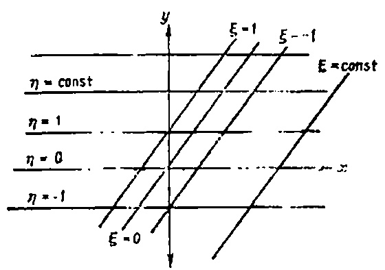

Рис. 41.1. Нова система координат $ \xi = y - x $, $ \eta = y $.

**ШАГ 2.** Залишилось знайти канонічну форму рівняння. Підставляючи $ \xi $ і $ \xi \eta $ у формули для коефіцієнтів $ \overline{A} $, $ \overline{B} $, $ \overline{C} $, $ \overline{D} $, $ \overline{E} $, $ \overline{F} $ і $ \overline{G} $, отримуємо:

MATHBLK1045X

 \overline{B} = 0 \quad (\text{ми вже раніше показали, що цей коефіцієнт теж обертається в нуль}),

MATHBLK1046X

Нові допоміжні коефіцієнти (41.5):

MATHBLK1047X

 \overline{E} = A\eta_{xx} + B\eta_{xy} + C\eta_{yy} + D\eta_x + E\eta_y = 2(y^2 - x^2),

MATHBLK1048X

Отже, нове рівняння

MATHBLK1049X

є загальним розв'язком відповідного рівняння.

## Конвективна дифузія — приклад застосування канонічних координат

Задача (15.2):

MATHBLK1050X

де $ H(x) $ — функція Хевісайда. Замінимо змінні:

MATHBLK1051X

Розв'язок задачі конвективної дифузії:

MATHBLK1052X

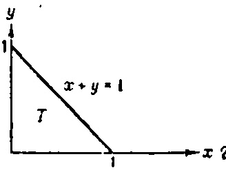

# Лекція 42. ОБЧИСЛЕННЯ ЗА МЕТОДОМ МОНТЕ-КАРЛО

**МЕТА ЛЕКЦІЇ:** Показати, що деякі інтеграли можна оцінити імовірнісним шляхом — методом Монте-Карло — і що ця ідея переноситься на розв'язок рівнянь в частинних похідних.

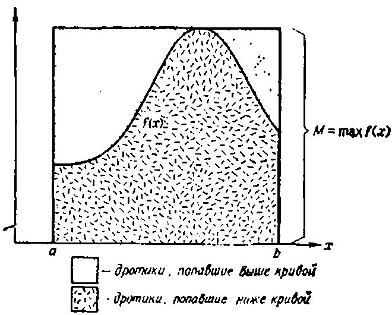

Фіг. 42.2. Обчислення інтеграції Монте-Карло.

Очевидно, якщо випадковим чином кинути близько 100 дротиків у прямокутник $ R $, що містить графік функції, можна отримати оцінку значення інтеграла, помноживши площу прямокутника $ R $ на відносну кількість дротиків під графіком функції. Результат нашої гри:

MATHBLK1053X

Щоб виконати ці обчислення на комп'ютері, нам потрібно якимось чином отримати послідовність випадкових точок, тобто наказати комп'ютеру «кидати дротики». Блок-схема на рис. 42.3 показує, як комп'ютер вирішить цю проблему.

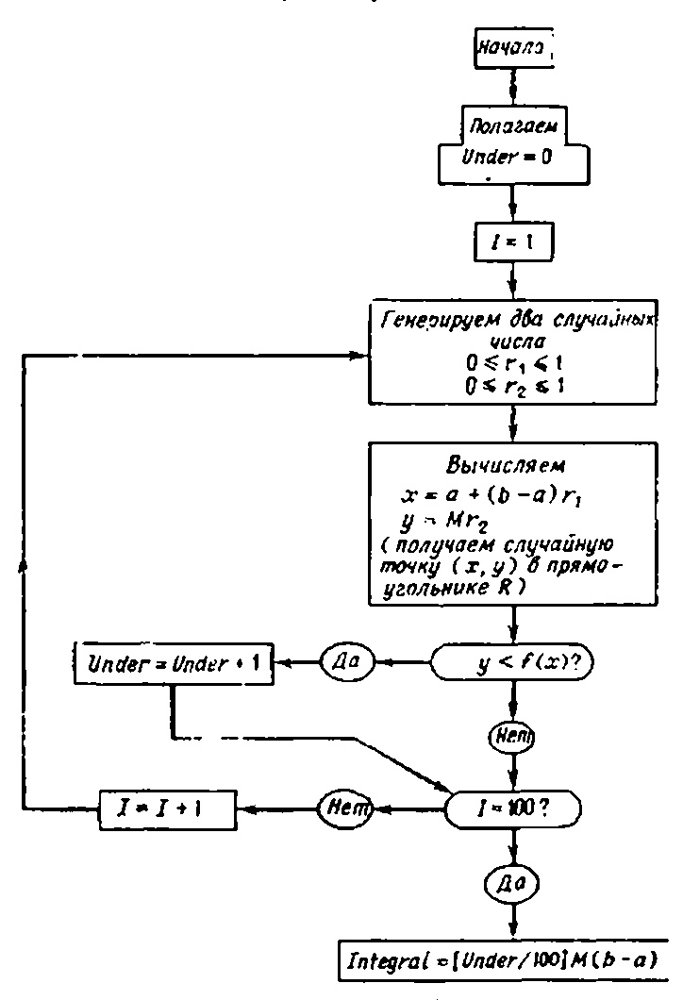

**РИС. 42.3.** Блок-схема розрахунку інтегралу $ \int_{a}^{b} f(x)\,dx $ методом Монте-Карло (100 кидків); $ M = \max_a f(x) $.

## Випадкові числа

Перш ніж перейти до методу Монте-Карло для рівнянь з частковими похідними, зупинимося на важливому питанні — випадкових числах. Щойно, обчислюючи інтеграл, нам потрібно було побудувати послідовність випадкових точок $ P_i = (x_i, y_i) $ всередині прямокутника $ R $. Іншими словами, $ x $-координата точки $ P $ має бути випадковим числом з інтервалу $ [a, b] $, а $ y_i $ — з інтервалу $ [0, M] $. Щоб знайти випадкові числа з цих інтервалів, звертаємося до послідовності випадкових чисел, рівномірно розподілених на відрізку $ [0, 1] $. Тоді числа, рівномірно розподілені на відрізку $ [a, b] $, можна обчислити за формулою

MATHBLK1054X

де $ r_i \in [0, 1] $ — рівномірно розподілене випадкове число.

Тепер, звичайно, виникає питання: як отримати послідовність випадкових чисел $ \{r_i:  i=1,2,\ldots\} $, рівномірно розподілених на $ [0,1] $? Найпоширенішим методом сьогодні є **метод конгруентних відрахувань**. Використовуючи цей метод, ми отримуємо послідовність випадкових цілих чисел, наприклад: $ 2120,\ 1401,\ 177,\ 3013, \ldots $, а потім ліворуч від кожного числа розміщуємо десяткову крапку: $ 0{,}212;\ 0{,}1401;\ 0{,}0177;\ 0{,}3013; \ldots $

## Отримання випадкових чисел за допомогою методу відрахування

1. Як перше випадкове ціле число, оберіть будь-яке число між $ 0 $ і $ P $ (число $ P $ обирається наперед).
2. Помножте це випадкове число на деяке фіксоване число — попередньо обраний множник $ M $.
3. Додайте до добутку деяке фіксоване ціле число $ K $, обране заздалегідь.
4. Поділіть отриману суму на $ P $ і візьміть залишок — це і є нове випадкове число.

Метод відрахування записується у вигляді формули:

MATHBLK1055X

Це означає, що для отримання наступного $ r_{i+1} $ потрібно взяти попередній $ r_i $, помножити його на $ M $, додати $ K $, поділити суму на $ P $ і взяти решту ділення.

**Наприклад**, якщо $ P = 100 $, $ M = 37 $, $ K = 16 $, $ r_0 = 15 $:

MATHBLK1056X

 M r_1 + K = 37 \cdot 71 + 16 = 2643, \quad r_2 = 2643 \bmod 100 = 43, \quad \ldots

MATHBLK1057X

I = \int_{0}^{1} e^{\sin x}\, dx.

MATHBLK1058X

 I = \int_{0}^{1}\int_{0}^{1}\int_{0}^{1}\int_{0}^{1} e^{-(x^{2}+y^{2}+z^{2}+\omega^{2})}\, dx\, dy\, dz\, d\omega.

MATHBLK1059X

\begin{cases}u_{xx} + u_{yy} = 0, & 0 < x < 1,\ 0 < y < 1, \\u(x,y) = g(x,y), & \text{на межі квадрата.}\end{cases}

MATHBLK1060X

R(A) = g_1 P_A(p_1) + g_2 P_A(p_2) + \dots + g_{12} P_A(p_{12}).

MATHBLK1061X

R(A) = 1\cdot(0{,}04) + 1\cdot(0{,}15) + 1\cdot(0{,}03) + 0\cdot(0{,}06) + \dots + 0\cdot(0{,}04).

MATHBLK1062X

R(A) = \frac{1}{4}\bigl[R(B) + R(C) + R(D) + R(E)\bigr].

MATHBLK1063X

R(A) = \frac{1}{4}\bigl[R(B) + R(C) + R(D) + R(E)\bigr] \quad \text{(у внутрішніх точках)},

MATHBLK1064X

Якщо $ g_i $ — значення функції $ g(x, y) $ з граничної умови у граничних точках $ p_i $, то наші два рівняння точно збігаються з двома рівняннями, отриманими при розв'язанні задачі Діріхле методом скінченних різниць:

MATHBLK1065X

 u_{ij} = g_{ij}, \quad (i,j) \text{ — гранична точка}.

MATHBLK1066X

u(A) = g_1 P_A(p_1) + g_2 P_A(p_2) + \dots + g_N P_A(p_N),

MATHBLK1067X

u_{xx} + (\sin x)\, u_{yy} = 0, \quad 0 < x < \pi,\ 0 < y < \pi,

MATHBLK1068X

Щоб розв'язати цю задачу, замінимо $ u_{xx} $, $ u_{yy} $ центральними різницевими похідними:

MATHBLK1069X

Підставляємо у рівняння і розв'язуємо за $ u_{i, j} $:

MATHBLK1070X

Коефіцієнти при $ u_{i+1,j} $, $ u_{i,j+1} $, $ u_{i,j-1} $, $ u_{i-1,j} $ є додатними і в сумі дорівнюють одиниці. Отже, $ u_{i,j} $ є зваженим середнім значень у чотирьох сусідніх точках.

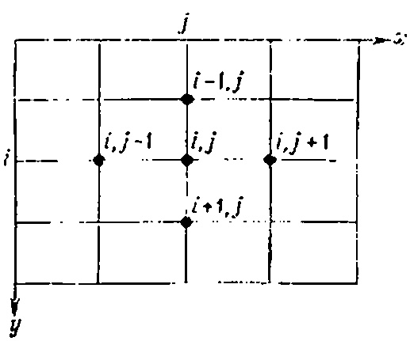

Рис. 43.2. Вузли сітки для випадкового маршруту.

Можна **модифікувати Блукаючого П'яницю** так, щоб ймовірності переміщення до сусідніх точок дорівнювали коефіцієнтам відповідних членів. Якщо п'яниця знаходиться в точці $ (i, j) $, то він переходить у точку:

MATHBLK1071X

Інакше гра не змінюється. Модифікація для інших задач може бути більш винахідливою, але основна ідея залишається незмінною.

## ЗАВДАННЯ

1. Побудуйте блок-схему гри «Блукаючий п'яниця», щоб розв'язати задачу $ u_{xx} + u_{yy} = 0 $ у вузлах внутрішньої сітки.

2. Напишіть програму для розв'язання задачі відповідно до блок-схеми з завдання 1.

3. Як модифікувати гру для вирішення задачі:

MATHBLK1072X

Як виглядає в цій грі випадкова прогулянка?

4. Чи можна так модифікувати гру, щоб розв'язати задачу:

MATHBLK1073X

5. Як модифікувати гру для розв'язання задачі:

MATHBLK1074X

(ПРИМІТКА. Замінимо це рівняння скінченною різницею Кранка–Ніколсона, виразимо $ u_{i+1,j} $ через п'ять значень у суміжних точках.)

# Лекція 44. ВАРІАЦІЙНЕ ЧИСЛЕННЯ (РІВНЯННЯ ЕЙЛЕРА–ЛАГРАНЖА)

**МЕТА ЛЕКЦІЇ:** Ввести поняття функціоналу (функції від функції) і пояснити, як функціонали природно виникають у фізиці. Типовий функціонал є інтегралом

MATHBLK1075X

що є функцією від функції $ y $ (припускається, що підінтегральна функція $ F(x, y, y') $ задана). Ми покажемо, як знайти функцію $ \overline{y}(x) $, яка мінімізує функціонал $ J[y] $. Виявляється, що мінімізуюча функція $ \overline{y} $ має задовольняти так зване **рівняння Ейлера–Лагранжа**.

## Вступ. Задача брахістохрони

Варіаційне числення виникло одночасно з математичним аналізом у зв'язку з розв'язанням задач максимізації та мінімізації функцій функцій (функціоналів). Першою задачею варіаційного числення була задача брахістохрони, сформульована Йоганном Бернуллі у 1696 році.

Бернуллі показав, що час сходження записується у вигляді:

MATHBLK1076X

і, отже, є функцією від функції. Оскільки багато функціоналів мають такий вигляд, ми зосередимося на вивченні загального функціоналу

MATHBLK1077X Ф і

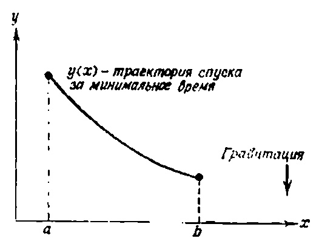

г. 44.1. Задача брахістохрони (час сходження треба мінімізувати).

## Мінімізація функціоналу

Розглянемо задачу пошуку функції $ y(x) $, яка мінімізує функціонал $ J[y] $ у класі гладких функцій, що задовольняють граничні умови $ y(a) = A $, $ y(b) = B $ (рис. 44.2).

Нехай існує $ y = \overline{y}(x) $ — потрібна функція, і розглянемо малу варіацію функції $ \overline{ y} $, тобто функцію $ \overline{y} + \varepsilon\,\eta(x) $, де $ \varepsilon $ — мале число, а $ \eta(x) $ — гладка функція, яка задовольняє граничні умови $ \eta(a) = \eta(b) = 0 $ (рис. 44.2).

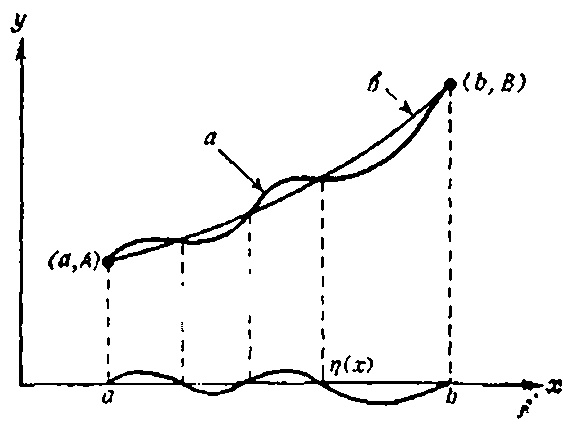

Рис. 44.2. Варіація функції: а — варіація функції $ \overline{y} + \varepsilon\,\eta(x) $; б — мінімізуюча функція $ \overline{y}(x) $.

Оскільки $ \overline{y} $ мінімізує $ J $, то

MATHBLK1078X

Іншими словами, графік $ \phi(\varepsilon) = J[\overline{y}+\varepsilon\eta] $ як функція $ \varepsilon $ буде виглядати як рис. 44.3.

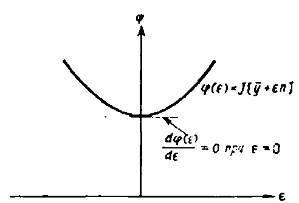

Рис. 44.3. Графік функції $ J[\overline{y}+\varepsilon\eta] $ в околиці $ \varepsilon = 0 $.

З рис. 44.3 очевидно, що в точці мінімуму:

MATHBLK1079X

Диференціюючи під знаком інтеграла й інтегруючи за частинами, приходимо до висновку, що друга частина підінтегрального виразу має дорівнювати нулю.

MATHBLK1108X

**Рівняння Ейлера–Лагранжа.**

Рівняння (44.2) називається **рівнянням Ейлера–Лагранжа**, і хоча загалом воно виглядає складно, коли в нього підставляється конкретна функція $ F(x, y,  y') $, воно стає звичайним диференціальним рівнянням другого порядку відносно невідомої функції $ \overline{y}(x) $.

## Теорема (необхідна умова мінімуму функціоналу)

Якщо функція $ y(x) $ мінімізує функціонал

MATHBLK1080X

у класі гладких функцій з граничними умовами $ y(a) = A $, $ y(b) = B $, то вона повинна задовольняти рівняння Ейлера–Лагранжа:

MATHBLK1081X

## Приклад: мінімальний функціонал $ J[y] = \int_{0}^{1}[y^2 + y'^2]\,dx $

Спробуємо знайти функцію $ y(x) $, яка проходить через точки $ (0,0) $ і $ (1,1) $ і мінімізує функціонал:

MATHBLK1082X

Тут $ F(x, y, y') = y^2 + y'^2 $, отже:

MATHBLK1083X

Рівняння Ейлера–Лагранжа набирає вигляду:

MATHBLK1084X

Загальний розв'язок — $ y = C_1 e^x + C_2 e^{-x} $. Розв'язуючи з граничними умовами $ y(0)=0 $ та $ y(1)=1 $, отримуємо:

MATHBLK1085X Ф і

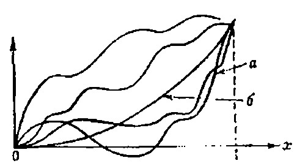

г. 44.4. Усі допустимі гладкі криві задовольняють граничні умови $ y(0)=0 $ та $ y(1)=1 $: а — допустима крива; б — мінімізуюча функція $ y(x) = 0{, }42\,e^x - 0{,}42\,e^{-x} $.

## Зауваження

1. Рівняння Ейлера–Лагранжа аналогічне рівності нульової похідної в диференціальному численні. Рівність нульової похідної є лише **необхідною**, але не достатньою умовою екстремуму. Те саме стосується рівняння Ейлера–Лагранжа. Однак дуже часто розв'язок рівняння Ейлера–Лагранжа фактично дає локальний або навіть глобальний мінімум.

2. Якщо $ y(x) $ мінімізує функціонал

MATHBLK1086X

тоді площа поверхні, утворена обертанням кривої $ y(x) $ навколо осі $ x $, буде мінімальною (рис. 44.5). Розв'язок рівняння Ейлера–Лагранжа в цьому випадку:

MATHBLK1087X

де константи $ \alpha $ і $ \beta $ визначаються з умов $ y(a) = A $ та $ y(b) = B $.

3. У цій лекції ми виявили, що функція $ \Delta u = 0 $ доставляє мінімум функціоналу $ \Phi[u] $.

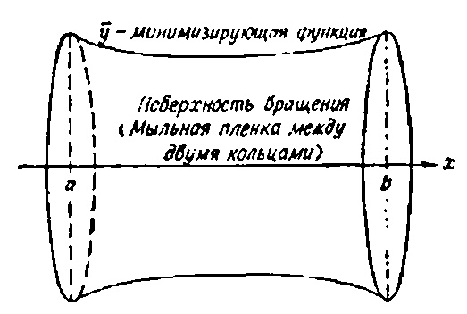

Рис. 44.5. Мінімальна поверхня обертання.

4. Основні закони фізики найчастіше формулюються мовою варіаційних принципів, а не диференціальних рівнянь. Прикладами є:

- **Принцип Ферма**: світло, поширюючись з однієї точки в іншу, обирає шлях, якому відповідає найкоротший час поширення.
- **Принцип Гамільтона**: у консервативному полі частинка рухається так, що інтеграл дії

MATHBLK1088X

буде стаціонарним. Звідси отримують диференціальне рівняння руху матеріальної точки.

Основні ідеї варіаційного числення можна розширити на функціонали, які залежать від функцій кількох незалежних змінних.

## ЗАВДАННЯ

1. Показати, що в класі гладких функцій, що задовольняють граничні умови $ y(0)=0 $ та $ y(\pi/2)=1 $, мінімальний функціонал має вигляд:

MATHBLK1089X

2. Якщо $ y(x) $ мінімізує функціонал $ J[y] = \int_a^b \sqrt{1+y'^2}\, dx $, то крива $ y(x) $ між двома точками є відрізком прямої лінії.

3. Покажіть, що ланцюгова лінія $ y(x) = \alpha\cosh((x-\beta)/\alpha) $ задовольняє рівняння Ейлера–Лагранжа для функціоналу $ J[y] = \int_a^b y\sqrt{1+y'^2}\,,dx $.

4. Принцип Гамільтона стверджує, що матеріальна точка рухатиметься так, що інтеграл дії буде стаціонарним. Отримайте диференціальне рівняння руху матеріальної точки.

# Лекція 45. МЕТОД РІТЦА

**Мета лекції:** Показати, як задачі на мінімум функціоналів можна розв'язувати наближено, замінюючи нескінченновимірний простір допустимих функцій скінченновимірним підпростором.

**Наближений розв'язок** шукається у вигляді:

MATHBLK1090X

де $ \{\varphi_k\} $ — вибрані базисні функції (наприклад, тригонометричні поліноми або поліноми Лежандра). Коефіцієнти $ a_k $ обираються так, щоб значення функціоналу $ J[u_n] $ було мінімальним.

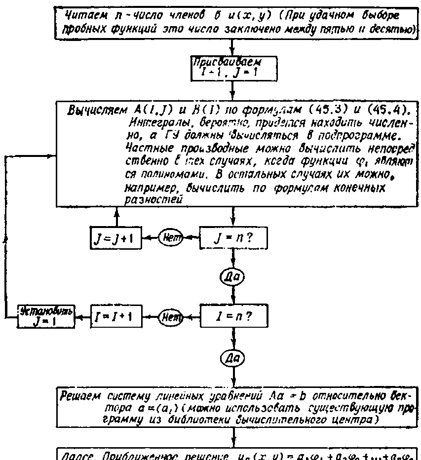

Рис. 45.2. Блок-схема методу Рітца.

## ЗАВДАННЯ

1. Підставте розклад (46.8) у задачу (46.7) і отримайте послідовність задач $ P_0,\ P_1,\ P_2,\ldots $

2. Покажіть, що нелінійну задачу можна наближено розв'язати методом збурень.

# Лекція 46. РОЗВ'ЯЗАННЯ РІВНЯНЬ З ЧАСТКОВИМИ ПОХІДНИМИ МЕТОДАМИ ТЕОРІЇ ЗБУРЕНЬ

**Мета лекції** — показати, як складні задачі з нелінійностями, змінними коефіцієнтами або нерегулярними областями можна розв'язувати як збурення простіших задач.

Наприклад, можна розглядати задачу Діріхле в деформованій області:

MATHBLK1091X

з граничною умовою:

MATHBLK1092X

Дуже часто задачу, розв'язок якої невідомий, можна шляхом неперервної зміни деяких параметрів звести до близької, але легко розв'язуваної задачі. Тоді і розв'язок вихідної задачі буде близьким до розв'язку модифікованої задачі.

Наприклад, рівняння Лапласа можна неперервно модифікувати в нелінійне рівняння $ \Delta u + \varepsilon u^2 = 0 $ за допомогою сімейства задач, параметризованих числом $ \varepsilon $, де $ 0 \le \varepsilon \le 1 $.

Розглядається область $ 0 < r < 1 $, $ 0 \le \theta < 2\pi $ з граничною умовою $ u(1,\theta) = g(\theta) $.

Розв'язок у вигляді ряду за степенями $ \varepsilon $:

MATHBLK1093X

Підстановка цього розкладу дає послідовність лінійних задач $ P_0, P_1, P_2, \ldots $, кожна з яких розв'язується аналітично.

Перше наближення:

MATHBLK1094X

де:

MATHBLK1095X

Отже,

MATHBLK1096X

За деяких граничних умов (наприклад, $ g(\theta) = \cos\theta $) задача має два різних матеріальні розв'язки, тоді як за інших (наприклад, $ g(\theta) = A\cos\theta $ з $ A > 20{,}65 $) задача не має реального розв'язку.

## ЗАВДАННЯ

1. Отримайте перший доданок розкладу для задачі:

MATHBLK1097X

 u(1+\epsilon\sin\theta, \theta) = \cos\theta, \quad 0 \le \epsilon \le 1/4.

MATHBLK1098X

f(x+h) = f(x) + f'(x)\,h + f''(x)\frac{h^2}{2!} + \dots

MATHBLK1099X

\begin{cases}u_t = \alpha^2 u_{xx}, \quad 0 < x < 1,\ 0 < t < \infty, \\u(0,t) = 0, \quad u(1,t) = 0, \quad 0 < t < \infty, \\u(x,0) = \sin(\pi x), \quad u_t(x,0) = 0, \quad 0 \le x \le 1.\end{cases}

MATHBLK1100X

z = x + iy, \qquad w = u + iv.

MATHBLK1101X

w = f(z).

MATHBLK1102X

w = z^2

MATHBLK1103X

w = (x+iy)^2 = x^2 - y^2 + 2ixy.

MATHBLK1104X

u = x^2 - y^2, \qquad v = 2xy.

MATHBLK1105X

w = \ln\left(\frac{z-1}{z+1}\right).

MATHBLK1106X

-\infty < u < \infty, \qquad 0 < v < \pi.

MATHBLK1107X

\varphi(u,v) = \frac{v}{\pi}.$$

Далі потрібно виразити $ v $ через початкові координати $ x $ і $ y$ ta pіdstaviti tsey viraz u znaynu formula.

## Область між двома колами

Другий типовий приклад полягає у відображенні області між двома неконцентричними колами на кільце. Після такого перетворення задача Діріхле зводиться до стандартної задачі в кільці, яку вже можна розв'язувати у полярних координатах.

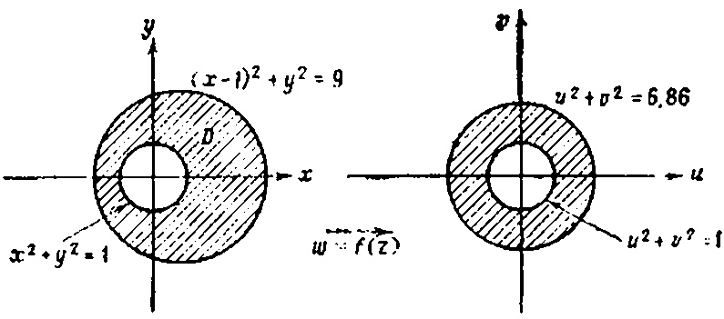

Фіг. 47.5. Відповідність регіону в країні.

Суть методу лишається тією самою:

1. знайти зручне конформне відображення;
2. перенести задачу у простішу область;
3. розв'язати її в нових координатах;
4. повернутися до початкових змінних.

Саме тому конформні відображення є одним із найсильніших інструментів для двовимірних гармонічних задач.
