ЧАСТКОВО ДИФЕРЕНЦІАЛ РІВНЯННЯ для Вчені та Інженери

Стенлі Дж. Фарлоу, професор математики, Університет Мену

# С. Фарлоу

# РІВНЯННЯ З ПОХІДНИМИ ПОХІДНИМИ ДЛЯ НАУКОВЦІВ І ІНЖЕНЕРІВ

Перекладено з англійської **A.I.** Плісом

Редактор

С. І. Похожаєва

5| 66K 22.161.6 φ24 υ ΥΠΚ 517.2

# Фарлоу С.

F 24 Рівняння з частими похідними для науковців та інженерів. Москва, видавництво Мир, 1985, 384 с.

King's American Mathematician, який є підручником з теорії диференціальних рівнянь у похідних похідних. Він характеризується компактністю, ясністю та ясністю подачі, а також неформальним підходом до подачі матеріалу. Вона містить багато ілюстрацій, графіків і діаграм, але замість суворих доказів часто даються роздуми, засновані на інтуїції або аналогіях.

Для інженерів і нематематиків — біологів, диміків, а також студентів університету. $\Phi = \frac{1702050000-380}{041(01)-85} 26-85, \text{ q. 1}$ BBK 22.161.6

Редакційна колегія журналу Literature on Mathematical Sciences

© переклад російською, Мир, 1985

© John Wiley & Sons, Inc. 1982. Всі права захищені. Авторизований переклад з англомовного видання, опублікований John Wiley & Sons, Inc.

# З РЕДАКТОРА ПЕРЕКЛАДУ

Книга, запропонована для читачів, слід розглядати як підручник для курсів: «Диференціальні рівняння в похідних похідних» та «Рівняння математичної фізики» для студентів технічних університетів. Вона також буде корисною для інженерів різних спеціальностей. У книзі представлено традиційні методи розв'язання диференціальних рівнянь у похідних похідних, включаючи деякі чисельні методи. Водночас особлива увага приділяється методу розділення змінних і методу інтегральних перетворень, і цю частину книги можна використовувати на практичних заняттях в університетах

Орієнтація книги на широку «нематематичну» аудиторію визначила стиль викладання розглянутих питань: інтуїтивний підхід і велика увага до фізичного значення не лише самих рівнянь, а й меж і початкових умов для різних задач. Вважається, що читачі знайомі лише з основами диференціального та інтегрального числення та елементами теорії звичайних диференціальних рівнянь.

Фахівці можуть не задовольнитися інтуїтивним описом певних понять і методів автором, але більш суворий виклад неминуче призведе до ускладнення книги і звузить коло її читачів, що, очевидно, не було наміром автора.

Більшим запереченням може бути відсутність загальних результатів щодо задач для диференціальних рівнянь у похідних з змінними коефіцієнтами, включно з рівняннями вищого порядку. Однак читач має чітко розуміти, що ця книга є вступним курсом з теорії диференціальних рівнянь у часткових похідних. Питання лінійної теорії диференціальних рівнянь, які автор не включив, можна знайти в літературі, наведеній наприкінці книги.

Матеріал книги подається автором з великою методологічною майстерністю. Однак не все було однаково успішним, і винний читач знайде це, наприклад, у вивченні принципу Дюамеля, сферичних заповітів та деяких інших уривків у книзі.

Без сумніву, запропонована книга С. Фарлоу знайде читача не лише серед студентів і інженерів, а й серед викладачів, які можуть багато чого навчитися з конкретного способу презентації та розробки спеціальних математичних курсів.

# ПЕРЕДМОВА

За останні кілька років спостерігається значне зростання кількості учнів, які починають вивчати диференціальні рівняння з похідними у своїх одинадцятих класах. Крім того, багато з них спеціалізуються на сферах, де інтуїція важливіша за математичну строгість. Тому, пишучи цю книгу, я прагнув створити текст, який стимулює інтуїтивне мислення читачів, не втрачаючи при цьому значної математичної строгості. Можливо, на одному полюсі, подати предмет на високому рівні «епсилон-дельта», але тоді, як це зазвичай буває, студенти не знатимуть, що робити з отриманою інформацією. Інша крайність — повне ігнорування математичних тонкощів, але тоді ні учні, ні вчителі не знатимуть, як діяти. Я намагався знайти розумний компроміс між цими крайнощами.

Ця книга виникла з курсу лекцій, які я читав протягом останніх п'яти років. Розташування матеріалу не є загальноприйнятим — вони майже незалежні один від одного

Друг лекцій.

Основна увага приділяється двом найважливішим аналітичним методам: розділенню змінних та інтегральним перетворенням. Також представлені деякі нестандартні розділи, такі як метод Монте-Карло, варіаційне числення, теорія керування, теорія потенціалів, інтегральні рівняння. Це пов'язано з тим, що більшості студентів доведеться стикатися з цими питаннями під час навчання, і якщо вони не ознайомляться з ними зараз, навряд чи коли-небудь систематично їх вивчатимуть.

Цю книгу можна використовувати як навчальний посібник для одно- або двосеместрового курсу як для початківців, так і для старших студентів. Читачі повинні знати лише диференціальне та інтегральне числення та звичайні диференціальні рівняння. Матеріал більшості лекцій подається в одному-двох уроках. Типовий односеместровий курс може включати лекції 1-13, 15-17, 19-20, 22-23, 25-27, 30-32, 37-39. Усі 47 лекцій легко читати протягом двох семестрів. Водночас часу буде достатньо для вирішення проблем.

Автор вдячний Вайлі за пропозицію написати книгу, а також рецензентам — професорам Крісу Рорресу та М. Куршиду Алі, які зробили низку корисних коментарів до тексту книги. Будь-які пропозиції щодо подальшого покращення цього підручника будуть вдячні як від учнів, так і від викладачів. Я також вдячний Дороті, Сюзан, Александер і Дезі Фарлоу.

Стенлі Дж. Фарлоу

# ВСТУП ДО ТЕОРІЇ ДИФЕРЕНЦІАЛЬНИХ РІВНЯНЬ У ПОХІДНИХ ПОХІДНИХ

МЕТА ЛЕКЦІЇ: Показати, що таке диференціальні рівняння в похідних похідних, де і як вони виникають і як їх розв'язують. Коротко розгляньте методи класифікації рівнянь і надайте список базових понять, які будуть детально вивчені на наступних лекціях.

Більшість фізичних явищ у таких сферах, як гідродинаміка, електрика та магнетизм, механіка, оптика та теплопередача, загалом можна описати за допомогою рівнянь у похідних похідних (PNP). Більшість рівнянь у математичній фізиці є диференціальними рівняннями з похідними похідними. Правда, з деякими спрощеними припущеннями ці рівняння зводяться до звичайних диференціальних рівнянь, але повний опис таких систем неминуче призводить до використання диференціальних рівнянь у похідних похідних.

# Що таке часткові диференціальні рівняння?

Рівняння з частковими похідними — це рівняння, яке містить диференціали у похідних похідних. На відміну від звичайних диференціальних рівнянь (TAC), де невідома функція залежить лише від однієї змінної, у рівняннях часткових похідних вона залежить від кількох змінних (наприклад, температура u(x, t) залежить від координати x і часу t).

Тепер наведемо деякі з найважливіших диференціальних рівнянь у похідних похідних. Для спрощення запису ми використаємо наступні нотації

$$u_t \equiv \frac{\partial u}{\partial t}$$, $u_x \equiv \frac{\partial u}{\partial x}$ , $u_{xx} \equiv \frac{\partial^2 u}{\partial x^2}$ , ...

# Деякі диференціальні рівняння в похідних похідних

$$u_t = u_{xx}$$

(одновимірне рівняння теплопровідності), $u_t = u_{xx} + u_{yy}$ (двовимірне рівняння теплопровідності), $u_{rr} + \frac{1}{r}u_r + \frac{1}{r^2}u_{00} = 0$ (рівняння Лапласа за полярними координатами), $u_{tt} = u_{xx} + u_{yy} + u_{zz}$ (тривимірне хвильове рівняння), $u_{tt} = u_{xx} + zu_t + \beta u$ (телеграфне рівняння).

# Примітки щодо наведених прикладів

У всіх наведених вище прикладах функція невідома і залежить від більше ніж однієї змінної. Змінна і (яку ми диференціюємо) називається залежною змінною. Змінні, за якими відбувається диференціювання, називаються незалежними змінними. Наприклад, у рівнянні.

$$u_t = u_{xx}$$

Залежна змінна u(x, t) є функцією двох незалежних змінних x і t; та в рівнянні

$$u_t = u_{rr} + \frac{1}{r} u_r + \frac{1}{r^2} u_{00}$$

змінна $u(r, \theta, t)$ залежить від $r, \theta, t$ .

# Чому необхідно вивчати диференціальні рівняння у похідних похідних?

Більшість фізичних законів природи можна сформулювати через рівняння з похідними похідними. Прикладами є рівняння Максвелла, закон теплопередачі Ньютона, рівняння Нав'є-Стокса, рівняння руху Ньютона та рівняння Шредінгера в кватичній механіці. У всіх цих рівняннях фізичні явища описуються мовою просторових і часових похідних. Похідні з'являються в рівняннях, оскільки вони описують найважливіші фізичні величини (такі як швидкість, прискорення, сила, тертя, потік, струм тощо). Таким чином, виникають диференціальні рівняння в частинних похідних, які містять невідому функцію, яку потрібно визначити.

Мета цієї книги — показати читачеві:

1. Як сформулювати фізичну задачу у формі диференціального рівняння у похідних похідних (побудова математичної моделі).

2. Як розв'язати диференціальне рівняння в похідних (з урахуванням початкових і граничних умов).

Перш ніж перейти до побудови математичних моделей, давайте коротко розглянемо методи розв'язання рівнянь у похідних похідних.

# Як розв'язати диференціальні рівняння в похідних похідних?

Гарне питання. Виявляється, існує цілий арсенал методів, придатних для практичного використання. Найважливішими є ті, у яких диференціальні рівняння з похідними похідними зводяться до звичайних диференціальних рівнянь. Перелічимо десять методів розв'язання диференціальних рівнянь у похідних похідних:

1. Метод розділення змінних. Рівняння з факторами, отриманими з n незалежними змінними, зводиться до n звичайних-

диференціальнірівняння 1).

2. Метод інтегральних перетворень. Рівняння в похідних з n незалежними змінними зводиться до рівняння з похідними у (n-1) незалежних змінних; Відповідно, рівняння з частковими похідними з двома незалежними змінними можна звести до звичайного диференціального рівняння $^2$ ).

3. Метод перетворення координат. Початкове диференціальне рівняння в похідних похідних зводиться до звичайного рівняння з частковими похідними або до іншого, простішого рівняння у похідних похідних шляхом відповідного перетворення координат (наприклад, обертання осей координат тощо).

4. Перетворення залежної змінної. Початкове диференціальне рівняння в похідних похідних перетворюється у таке рівняння з похідними похідними для іншої невідомої функції, яка

легше розв'язати, ніж початкові 3).

5. Чисельні методи. Початкове диференціальне рівняння в похідних похідних зводиться до системи різницей, яку розв'язують методом ітерацій на комп'ютері. У багатьох випадках це єдиний спосіб розв'язати диференціальне рівняння з похідними похідними. Окрім різницьких методів для розв'язання рівнянь з частковими про-

e) Ефективніше використовувати загальні перетворення незалежних і залежних змінних, включаючи похідні. Ед.

4) Це стосується повного розділення змінних. При частковому розділенні змінних одне диференціальне рівняння в похідних похідних зводиться до кількох рівнянь у часткових похідних з меншою кількістю незалежних змінних. — Ед. Ед.

2) Це відбувається у випадку одномірного інтегрального перетворення. У випадку k-вимірного інтегрального перетворення LCP з n незалежними змінними зводиться до рівняння часткових з n—k незалежними змінними. — Ед. Ед.

Існують також інші чисельні методи, зокрема ті, що базуються на наближенні розв'язків за поліноміальними поверхнями (наближення за сплайнами).

6. Метод теорії збурень. Початкова нелінійна задача зводиться до послідовності лінійних задач, апрокенн-

нелінійна задача 1).

- 7. Метод функцій Гріна. Початкові та граничні умови замінюються системою найпростіших джерел, і задача розв'язується для кожного найпростішого джерела. Повне розв'язання початкової задачі отримується шляхом підсумовування розв'язків елементарних джерел.
- 8. Метод інтегральних рівнянь. Рівняння з частковими похідними зводяться до інтегрального рівняння (рівняння, в якому невідома функція знаходиться під знаком інтеграла). Існує багато різних методів розв'язання інтегральних рівнянь.
- 9. Варіаційні методи. Замість рівняння з частковими похідними диференціальними розв'язують задачу мінімізації. Виявляється, що функція, яка дає мінімум певному виразу (наприклад, загальній енергії системи), одночасно є розв'язком початкового рівняння похідниху похідних 2.
- 10. Метод розкладу за власними функціями. Розв'язок рівняння часткових похідних шукається як послідовність власних функцій. Ці власні функції знаходяться як розв'язки так званої задачі власних значень, що відповідає початковій задачі для рівняння часткових похідних.

# Типи рівнянь у похідних похідних

Рівняння в похідних похідних можна класифікувати за багатьма характеристиками. Класифікація рівнянь важлива, оскільки, як виявилося, кожен клас має свою загальну теорію та методи розв'язання рівнянь.

Тут ми наведемо шість основних методів класифікації

рівняння.

1. Порядок рівняння. Порядок рівняння — це найвищий порядок часткових похідних, включених до рівняння. Наприклад,

Примітка. Ед.

1) Точніше, це метод лінеаризації нелінійних задач. Загальна теорія збурень містить лінійні та нелінійні теорії збурень, кожна з яких, у свою чергу, є регулярною та особливою. — Ед. Ед.

Ці методи застосовні до спеціальних задач, що зумовлено існуванням відповідних виразів — функціоналів для цих задач.

Застосовувався раніше

$$u_t = u_{xx}$$

(рівняння другого порядку), $u_t = u_x$ (рівняння першого порядку), $u_1 = uu_{xxx} + \sin x$ (рівняння трьох порядків).

2. Кількість змінних. Кількість змінних — це кількість незалежних змінних. Наприклад,

$$u_t = u_{xx}$$

(рівняння з двома змінними $x$ і $t$ ), $u_t = u_{rr} + \frac{1}{r} u_r + \frac{1}{r^2} u_{\theta\theta}$ (рівняння з трьома змінними $r$ ,

3. Лінійність. Рівняння з частковими похідними можуть бути лінійними та нелінійними. У лінійних рівняннях залежна змінна та всі її часткові похідні включаються лінійно, зокрема, вони не множаться одна на одну, не множаться в квадраті тощо). Точніше, лінійне рівняння другого порядку з двома незалежними змінними є рівнянням вигляду

$$(1.1) Au_{xx} + Bu_{xy} + Cu_{yy} + Du_x + Eu_y + Fu = G$$

де A, B, C, D, E, F і G — це константи або задані функції пояснювальних змінних x і y.

$$u_{tt} = e^{-t}u_{xx} + \sin t$$

(лінійне рівняння), $uu_{xx} + u_t = 0$ (нелінійне рівняння), $u_{xx} + yu_{yy} = 0$ (лінійне рівняння), $xu_x + yu_y + u^2 = 0$ (нелінійне рівняння).

- 4. Однорідність. Рівняння (1.1) називають однорідним, якщо права частина G(x, y) ідентична нулю для всіх x і y. Якщо G(x, y) не ідентичне нулю, то рівняння називають неоднорідним.
- 5. Типи шансів. Якщо коефіцієнти A, B, C, D, E і F рівняння (1.1) є сталими, то це рівняння називається рівнянням зі сталими коефіцієнтами (інакше рівнянням зі змінними коефіцієнтами).
- 6. Три основні типи лінійних рівнянь. Усі лінійні рівняння з частковими похідними другого порядку виду (1.1) належать до одного з трьох типів: а) параболічних, б) гіперболічних, в) еліптичних.

Параболічний тип. Рівняння параболічного типу описують процеси теплопровідності та дифузії і визначаються умовою $B^2 - 4AC = 0$ .

Гіперболічний тип. Рівняння гіперболічного типу описів

осцилюючі системи та хвильові рухи визначаються умовою $B^2-4AC>0$ .

Еліпічний тип. Рівняння еліптичного типу описують усталені процеси і визначаються умовним $B^2-4AC<0$ . Приклади

a)

$$u_i = u_{xx}$$, $B^2 - 4AC = 0$ (параболічна), (гіперболічна), (гіперболічна), (гіперболічна $y > 0$ ), (гіперболічна), (еліптична), (еліптична), параболічна на $y = 0$ , гіперболічна на $y < 0$ .

(У випадку змінних коефіцієнтів тип рівняння може змінюватися від точки до точки.)

# ЗАУВАЖЕННЯ

- 1. Загалом, значення $B^2-4AC$ є функцією незалежних змінних. Відповідно, базовий тип рівняння може змінюватися в межах визначення рівняння, хоча це не є обов'язковим.
- 2. У рівнянні (1.1) незалежними змінними є x і y. У багатьох задачах однією з двох незалежних змінних є час, і рівняння (1.1) можна записати через x і t.

PHC 1.1. Діаграма класифікації диференціальних рівнянь у похідних похідних.

3. Рис. 1.1. Представлено діаграму класифікації для диференціальних рівнянь у похідних похідних.

# ЗАВДАННЯ

- 1. Класифікуємо наступні рівняння відповідно до всіх характеристик, зазначених у днаграмі на рис. 1.1:
 - a) $u_t = u_{xx} + 2u_x + u$ ,

6) $u_t = u_{xx} + e^{-t}$ , B) $u_{xx} + 3u_{xy} + u_{yy} = \sin x$ , $u_{tt} = uu_{xxx} + e^{-t}$ .

- 2. Скільки розв'язків $u_1 = u_{xx}$ рівняння існує? Спробуйте знайти рішення, як $u(x, t) = e^{a\lambda + bt}$ .
- 3. Якщо функції $u_1(x, t)$ і $u_2(x, t)$ задовольняють рівняння (1.1), чи задовольняє сума цих функцій його? Доведи це.
- 4. Ймовірно, найпростіше диференціальне рівняння в похідних —

$$\frac{\partial u(x, y)}{\partial x} = 0.$$

Чи можете ви розв'язати це рівняння? (Знайдіть усі функції, що задовольняють це рівняння.)

5. Що можна сказати про рівняння

$$\frac{\partial^2 u(x, y)}{\partial x \partial y} = 0$$

?

Чи можете ви знайти всі розв'язки цього рівняння? Скільки їх? Порівняйте з кількістю розв'язків звичайного диференціального рівняння

$$\frac{d^2y}{dx^2} = 0.$$

# ЗАДАЧІ ТИПУ ДИФУЗІЇ (ПАРАБОЛІЧНІ РІВНЯННЯ)

МЕТА ЛЕКЦІЇ: Показати, як параболічні рівняння використовуються для розв'язання задач теплопровідності та дифузії. Наведено кілька прикладів параболічних рівнянь, а також пояснюється фізичне значення різних членів $(u_1, u_2, u_3, u_4, u_6)$ , включених у ці рівняння.

На конкретному прикладі розглядається основна ідея зміщеної задачі для параболічного рівняння. Одна з головних цілей цієї лекції — надати читачеві інтуїтивне уявлення

Розуміння параболічних проблем.

Почнемо з розгляньмо просту фізичну задачу і те, як її можна описати математичною моделлю з рівнянням у похідних похідних.

Потім ми ускладнимо задачу і покажемо, як нові фізичні умови призводять до появи нових рівнянь у похідних похідних. У цій лекції диференціальні рівняння не виводяться і не розв'язуються. Про це ми поговоримо пізніше.

# Простий експеримент з теплопровідністю

Припустимо, що ми провели простий експеримент, який розбили на такі кроки:

КРОК 1. Візьміть достатньо довгий (скажімо, $L=2\,\mathrm{m}$ ) стрижень (наприклад, мідний) діаметром $2\,\mathrm{cm}$ , бічна поверхня (але не кінці) якої термічно ізольована. Замість стрижня можна використовувати мідну трубку, покриту теплоізоляцією зовні та зсередини.

Іншими словами, тепло може проходити лише через кінці стрижня і не може проходити через його бічну поверхню.

КРОК 2. Тепер помістимо цей стрижень у пристрій із фіксованою температурою $T_{\mathfrak{o}}$ (градуси Цельсія) на достатньо довгий час, щоб температура всередині стрижня стала

Так само, як і температура пристрою. Для простоти припустимо, що температура пристрою $T_0 = 10^{\circ}$ C.

КРОК 3. Давайте витягнемо стрижень з нашого пристрою у певний момент часу, що зручно взяти як нуль t = 0, і приєднаємо до нього дві термопари з кінців. Завдання цих елементів — підтримувати фіксовані температури $T_1$ і $T_2$ на кінцях (наприклад, $T_1=0^{\circ}$ C і $T_2=50^{\circ}$ C). Іншими словами, два термостати постійно контролюють температуру на кінцях стрижня, і якщо температура відхиляється від встановлених значень $T_1$ і $T_2$ , активуються потужні нагрівальні або охолоджувальні елементи (пристрої) для відповідного регулювання температури. Наш експеримент ілюструє RPS, 2 1,

Рис. 2.1. Схема експерименту: a — це термопара, яка підтримує встановлену температуру $T_1$ на лівому кінці стрижня; $\delta$ — це термопара, яка підтримує встановлену температуру $T_2$ на правому кінці стрижня.

КРОК 4. Тепер ми будемо слідкувати за температурним профілем у стрижні за допомогою пристрою візуалізації. Чому ми хочемо провести такий експеримент? Це інше питання, про яке ми поговоримо пізніше.

Це кінець опису нашого експерименту.

Головна мета цієї лекції — показати, як цю фізичну проблему та її модифікації можна змоделювати мовою параболічних рівнянь.

# Математична модель теплопровідності

Опис нашої фізичної проблеми вимагає трьох типів відносин.

- 1. Рівняння з частковими похідними, які описують фізичне явище теплопровідності.
- 2. Граничні умови, що описують процеси теплопередачі на межах.
- 3. Початкові твердження, які описують стан системи на початку процесу.

# Рівняння теплопровідності

Базове одновимірне рівняння теплопровідності записується у вилці

(2.1)

$$u_t = \alpha^2 u_{xx}, \quad 0 < x < L, \quad 0 < t < \infty.$$

Це рівняння пов'язує значення $u_t$ — швидкість зміни температури з часом (виміряна в градусах/с)

та величину $u_{xx}$ — це увігнутий профілю температури u(x, t) (який є мірою різниці між температурою в заданій точці та температурою в сусідніх точках).

Рис. 2.2. Стрілки показують зміну температури відповідно до рівняння $u_t = \alpha^2 u_{xx}$ .

Це рівняння буде виведено з базового рівняння збереження тепла в наступних лекціях, але наразі ми розглянемо його заданим. Це рівняння каже, що температура $u\left(x,\ t\right)$ (у певній точці t у певній точці x стрижня) зростає $(u_t>0)$ або зменшується $(u_t<0)$ залежно від того, чи є друга похідна $u_{xx}$ позитивною чи негативною. Фіг. Рисунок 2.2 ілюструє зміну температури в різних точках на елементі.

Давайте подивимось, як значення $u_{xx}$ можна інтерпретувати мовою теплопровідності. Припустимо, ми наблизимо значення $u_{xx}$ фінальних постів

$$u_{xx}(x, t) \cong \frac{1}{\Delta x^2} [u(x + \Delta x, t) - 2u(x, t) + u(x - \Delta x, t)].$$

Це співвідношення можна переписати у вигляді

$$u_{\lambda x}(x, t) \simeq \frac{2}{\Delta x^2} \left[ \frac{u(x + \Delta x, t) + u(x - \Delta x, t)}{2} - u(x, t) \right].$$

Тепер ми можемо дати наступну інтерпретацію значення $u_{xx}$ .

1. Якщо температура u(x, t) менша за середнє значення температури у двох сусідніх точках, то $u_{xx} > 0$ (тут загальний тепловий потік по осі x додатний).

2. Якщо температура u(x, t) дорівнює середньому значенню температур у двох сусідніх точках, то $u_{xx} = 0$ (тут загальний тепловий потік по осі x дорівнює нулю).

3. Якщо температура $u\left(x,\ t\right)$ вища за середню температуру у двох сусідніх точках, то $u_{xx}<0$ (тут — повний потік

тепла вздовж осі x є від'ємною).

Усе це ілюструється на рис. 2.2. Іншими словами, якщо температура в точці x більша за середню температуру у двох сусідніх точках $x - \Delta x$ і $x + \Delta x$ , то температура в точці x зменшиться. Відповідно, точна швидкість зниження температури, а саме величина $u_t$ , пропорційна цій різниці. Коефіцієнт пропорційності $\alpha^2$ визначається властивостями матеріалу. Ми розглянемо цю константу детальніше у майбутніх лекціях.

# Граничні умови (ГІ)

Усі фізичні проблеми характеризуються наявністю певних меж. Отже, щоб рухатися вперед, ми повинні включити межі в математичну модель, щоб адекватно описати фізичну проблему. У нашому експерименті граничні умови (ГІ) дуже прості. Оскільки температура на кінцях x=0 і x=L завжди залишається сталою і дорівнює $T_1$ та $T_2$ , можливо записати

(2.2)

$$\left\{ \begin{array}{l} u\left(0,\ t\right) = T_{t}, \\ u\left(L,\ t\right) = T_{2}, \end{array} \right. \quad 0 < t < \infty,$$

# Початкові умови (NU)

Усі фізичні процеси мають починатися у певний момент часу (зазвичай приймається як нуль t=0), тому ми повинні встановити фізичні умови саме в цю точку. Відтоді, як ми почали контролювати температуру з моменту, коли паличка мала постійну температуру $T_{\mathrm{ }o}$ , ми

(2.3)

$$u(x, 0) = T_0, \quad 0 \le x \le L$$

Тепер ми створили математичну модель експерименту. Система співвідношень (2.1), (2.2) та (2.3) називається задачею зміщення для рівняння теплопровідності і зазвичай записується як

(2.4)

$$\begin{aligned} & (\text{YUII}) \quad u_t = \alpha^2 u_{xx}, & 0 < x < L, \ 0 < t < \infty, \\ & \left( \Gamma \text{Y} \right) \quad \begin{cases} u \ (0, \ t) = T_1, \\ u \ (L, \ t) = T_2, \end{cases} & 0 < t < \infty, \\ & (\text{HY}) \quad u \ (x, \ 0) = T_0, \quad 0 \leqslant x \leqslant L. \end{aligned}$$

Цікаво, що це зовсім не очевидно: чи існує одна функція u(x, t), яка задовольняє умови (2.4), і чи описує ця функція температуру в стрижні? Отже, наше безпосереднє завдання — знайти цю функцію u(x, t) з (2.4).

Перш ніж завершити цю лекцію, давайте розглянемо деякі варіації основної проблеми. Почнемо з невеликих змін рівняння теплопровідності.

# Деякі рівняння дифузійного типу

Теплопередача через бічну поверхню пропорційна різниці температур

Рівняння

$$u_t = \alpha^2 u_{xx} - \beta (u - u_0)$$

Описує теплопровідність елемента, враховуючи не лише дифузію теплових $\alpha^2 u_{xx}$ вздовж елемента, а й теплопередачу через бічну поверхню елемента. Відтік тепла ( $\beta > 0$ ) або його приплив ( $\beta < 0$ ) пропорційний різниці між температурою u стрижня та температурою навколишнього середовища $u_0$ ( $\beta$ — це сталий коефіцієнт пропорційності). Якщо коефіцієнт $\beta$ великий порівняно з $\alpha^2$ , то теплопотік уздовж стрижня буде малим порівняно з

Протікання через бічну поверхню, і тому тепло буде проходити через неї відповідно до закону $u_t = -\beta (u - u_a)$ .

У хімії, де величина відіграє роль концентрації, рівняння

$$u_1 = \alpha^2 u_{xx} - \beta (u - u_0)$$

означає, що швидкість зміни $u_i$ кількості речовини залежить як від дифузії $\alpha^2 u_{xx}$ (у напрямку осі x), так і від появи ( $\beta < 0$ ) або розпаду ( $\beta > 0$ ) речовини в хімічній реакції, і пропорційна різниці між двома концентраціями u і $u_{\theta}$ .

# Внутрішнє джерело тепла

Неоднородне рівняння

$$u_t = \alpha^2 u_{xx} + f(x, t)$$

відповідає випадку, коли всередині елемента є джерело тепла (розташоване вздовж усього елемента і діє в будь-який момент t). Наприклад, може бути так, що дріт з електричним струмом проходить через стрижень і опір є постійним джерелом тепла f(x,t) = K.

# Рівняння конвективної дифузії

Припустимо, що домішка поширюється вздовж потоку, що рухається зі швидкістю v. Очевидно, що концентрація $u\left(x,\,t\right)$ домішок змінюється залежно від x (позитивний напрямок осі x обирається вздовж потоку) і часу t. Швидкість зміни концентрації $u_t$ визначається рівнянням конвективної дифузії

$$u_t = \alpha^2 u_{xx} - v u_x.$$

Термін $\alpha^2 u_{xx}$ описує внесок дифузії, а $vu_x$ — конвективний компонент. Що важливіше, дифузія або конвекція залежить від співвідношення $\alpha^2$ до v. Димові частинки піднімаються конвективно через рух гарячого повітря і одночасно розсіюють через вихорові рухи повітря. Окрім цих модифікацій рівняння теплопровідності, можливо змінювати граничні умови на кінцях стрижня відповідно до фізичної ситуації. Деякі з цих змін ми обговоримо у третій лекції.

# ЗАУВАЖЕННЯ

Рівняння теплопровідності $u_t = \alpha^2(x) u_{xx}$ з змінним коефіцієнтом $\alpha(x)$ відповідає задачі, в якій дифузія залежить від x (тобто матеріал є гетерогенним). Наприклад, мідь і сталь—

PHC. 2.3.

Пластини контактують, як показано на рис. 2.3. Припустимо, що температура $u(0,t)=0^{\circ}$ C підтримується на лівому боці міді, а температура $u(L,t)=20^{\circ}$ C — з правого боку сталі, тоді рівняння, що описує теплопровідність у цій системі, виглядає так:

$$u_t = \alpha^2(x) \, u_{_{\! A \, X}}, \quad 0 < x < L,$$

де

$$
\alpha(x) = \begin{cases}
\alpha_1, & \text{коефіцієнт дифузії в міді}, \quad 0 < x < L/2, \\
\alpha_2, & \text{коефіцієнт дифузії в сталі}, \quad L/2 < x < L.
\end{cases}
$$

# ЗАВДАННЯ

1. Якщо початкова температура в стрижні

$$u(x, 0) = \sin \pi x, \quad 0 \leqslant x \leqslant 1,$$

а граничні умови такі:

$$
u(0, t) = 0, \qquad u(1, t) = 0.
$$

Тоді як поводитиметься температура в стрижні $U(x, t)$ при $t > 0$ ? 2. Припустимо, що в стрижні є постійне внутрішнє джерело тепла, так що рівняння теплопровідності в стрижні записується як

$$u_t = \alpha^2 u_{xx} + 1, \quad 0 < x < 1.$$

Припустимо, що ми зафіксували температуру на межі з значеннями u(0, t) = 0 і u(1, t) = 1. Якою буде стаціонарна температура у стрижні? Іншими словами, який c-незалежний розподіл U(x, t) перешкоджує u(x, t)?

3. Припустимо, що металевий стрижень втрачає тепло через бічну поверхню згідно з рівнянням

$$u_1 = \alpha^2 u_{xx} - \beta u$$, $0 < x < 1$ .

І припустимо, що ми підтримуємо кінці стрижня при температурах U(0, T) = 1, U(1, T) = 1. Знайдіть стаціонарний розподіл температури по стрижню. Побудуйте графік цього розподілу. У яких моментах відбувається тепловий потік?

4. Припустимо, що термоізольований металевий стрижень довжини L = 1 має початкову температуру $\sin(3\pi x)$ , а фіксовану температуру — 0 і $10\,^{\circ}$ C на лівому та правому кінцях.

# Лекція 3

# ГРАНИЧНІ УМОВИ В ЗАДАЧАХ ДИФУЗІЙНОГО ТИПУ

МЕТА ЛЕКЦІЇ: Показати, як виникають різні граничні умови у задачах теплопровідності та дифузії, а також ввести важливе поняття теплового потоку.

Розглядаються три найважливіші типи граничних умов:

- 1. u = g(t) (температура задається на межі),
- $2. \ \frac{\partial u}{\partial n} + \lambda u = g\left(t\right)$ (встановлення температури навколишнього середовища);

n — вектор зовнішньої нормалі до межі), $3. \frac{\partial u}{\partial n} = g(t)$ (визначений тепловий потік через межу).

У задачах теплопровідності зазвичай використовують три основні типи граничних умов. Ця лекція наводить приклади того, як різні фізичні умови експерименту призводять до різних типів граничних умов.

# Граничні умови першого виду (температура задається на межі)

Розглянемо тепловий потік в одномірному стрижні, показаний на рис. 3 1, і припустимо, що температура кінців змінюється відповідно до законів $g_1(t)$ і $g_2(t)$ .

Фіг. 31. Температура буде відновлена на межі.

Як згадувалося в попередній лекції, кожен пристрій, що підтримує встановлену температуру на кінцях, складається з термостата та нагрівального елемента для підтримки відповідних теплових умов. Проблеми з граничними умовами першого виду дуже поширені. У деяких випадках складність полягає у пошуку контролерів граничних умов, тобто температур $g_1(t)$ та $g_2(t)$ меж, які призводять до певної зміни температури всередині стрижня. Наприклад, у металургії часто необхідно обирати граничні умови контролю, щоб температура металу всередині печі змінювалася з часом, а температурний градієнт був невеликим.

Фіг. 3.2. Зниження температури на межі.

Граничні умови першого виду також виникають у багатовимірних задачах теплопровідності. Як приклад можна навести цікаву задачу визначення температурного поля всередині кругового диска з радіусом *R* (див. рис. 3.2), коли гранична температура задається у полярних координатах формулою $u(R, \theta, t) = \cos t \sin \theta$ .

Звісно, щоб розв'язати задачу, потрібно знати початкову температуру, але в цьому випадку початкові умови перестають впливати на розв'язок через дуже короткий час, і отримана температура всередині диска визначається лише значеннями температури на межі.

# Граничні умови другого виду (задана температура навколишнього середовища)

Припустимо, що ми знову розглядаємо термічно ізольований мідний стержень, але тепер відмовляємося від заданого температурного режиму на кінцях стрижня. Натомість давайте наблизимо кінці стрижня до контакту з двома середовищами. Нехай температура одного з них $g_1(t)$ , а іншого $g_2(t)$ . Іншими словами, припустимо, що лівий кінець стрижня поміщений у контейнер із рідиною, температура якої змінюється відповідно до закону $g_1(t)$ . А правий кінець поміщається в іншу рідину з температурою $g_2(t)$ (рис. 3, 3)

Рис. 3.3. Конвективна теплопередача через межі, a — це рідина при температурі $g_1(t)$ , $\delta$ — рідина при температурі $g_2(t)$ .

Задаючи граничні умови такого типу, ми не можемо вважати, що граничні температури стрижня збігаються з температурами рідини. Але ми знаємо закон Ньютона: якщо температура одного з кінців стрижня менша за температуру відповідної рідини, тепло потече в стрижень зі швидкістю, пропорційною різницям температур. Іншими словами, для одномірного стрижня з межами x=0 і x=1 закон теплопередачі Ньютона формулюється так:

(3.1)

$$\{$$

вихідний тепловий потік на $x=0$ дорівнює $h\left[u\left(0,\,t\right)-g_{1}\left(t\right)\right]$ , вихідний тепловий потік при $x=L$ дорівнює $h\left[u\left(L,\,t\right)-g_{2}\left(t\right)\right]$ ,

де h — коефіцієнт теплопередачі, який показує, скільки калорій проходить через межу за одну секунду при різниці температур у один градус. Вихідний потік дорівнює кількості кало-

Пройшов крізь палочний спис за одну секунду. Зверніть увагу, що вихідний тепловий потік буде позитивним на кінці стрижня, де температура стрижня вища за температуру навколишнього середовища. Рівняння (3.1) разом із відомим законом теплопровідності Фур'є тепер можна використовувати для отримання Р и с

. 3.4. Ілюстрація закону Фур'є: $\frac{\partial u}{\partial n} > 0$ означає, що тепло надходить у цю область; $\frac{\partial u}{\partial n} < 0$ означає, що тепло виходить із цієї зони; n — напрямок зовнішньої нормалі; $\frac{\partial u}{\partial n} -$ Зміна температури в напрямку N; $\frac{\partial u}{\partial n} = -\frac{\partial u}{\partial (-n)}$ є похідною у напрямку внутрішньої нормальної — це похідна, взята $\mathbf{e}$ протилежному знаку протилежного знака пормалі.

граничні умови. Закон Фур'є дає друге представлення (перше міститься у (3.1)) для вихідного теплового потоку. Прирівнюючи ці два вирази до потоку, ми отримуємо граничні умови, які шукаємо. Сформулюємо закон Фур'є (встановлений експериментально):

(3.2) Тепловий потік, що проходить через межу площі, пропорційний нормальній похідній температури у напрямку внутрішньої норми.

Цей закон стверджує, що якщо температура швидко підвищується у напрямку зовнішньої температури до межі D (рисунок 3.4), то потік буде текти з навколишнього середовища до області D.

У нашій одновимірній задачі закон Фур'є має вигляд:

(3.3)

$$\begin{cases} \text{вытекающий поток тепла при } x=0 \text{ равен } k \frac{\partial u}{\partial x}, \\ \text{вытекающий поток тепла при } x=' \text{ равен } -k \frac{\partial u}{\partial x}, \end{cases}$$

де k — теплопровідність матеріалу, яка є мірою того, наскільки добре матеріал проводить тепло. Погано провідні матеріали мають коефіцієнт близький до нуля в одиницях GHS, тоді як мідь та алюміній мають значення значно вище нуля.

Фіг. 3.5. Ще одна ілюстрація закону Чотирьох.

Закон Фур'є (3.3) фактично описує теплопровідність всюди всередині стрижня, а не лише на його межі; Наприклад, (див. рис. 3.5).

(3.4) Потік, що проходить через точку

$$x$$

зліва направо $=-k\frac{\partial n}{\partial x}$ Закон Фур'є (3.4) стверджує: якщо $u_x < 0$ , то в точці $x_0$ тепло тече зліва направо, якщо $u_x > 0$ , то в точці $x_0$ тепло тече справа наліво. (Тепло завжди переходить від вищих температур до нижчих.)

Нарешті, якщо використовувати вирази (3.1) і (3.3) для теплового потоку, то отримуємо бажані граничні умови для задачі, описаної на рис. 3.3, у чисто математичній формі

$$(\Gamma Y) \quad \begin{cases} \frac{\partial u\left(0,\,t\right)}{\partial x} = \frac{h}{k}\left[u\left(0,\,t\right) - g_{1}\left(t\right)\right], \\ \frac{\partial u\left(L,\,t\right)}{\partial x} = -\frac{h}{k}\left[u\left(L,\,t\right) - g_{2}\left(t\right)\right]. \end{cases} \quad 0 < t < \infty,$$

Дуже часто константа h/k позначається як $\lambda$ , а граничні умови теплового потоку на межі записуються у вигляді

(3.5)

$$u_{x}(0, t) = \lambda [u(0, t) - g_{1}(t)], u_{x}(L, t) = -\lambda [u(L, t) - g_{2}(t)].$$

Для випадку вищих розмірностей отримують подібні граничні умови. Наприклад, якщо межа кругового диска осяяна рухомою рідиною з температурою $g(\theta,t)$ , то граничні умови записуються як

$$\frac{\partial u}{\partial r}(R, \theta, t) = -\frac{h}{k} [u(R, \theta, t) - g(\theta, t)].$$

Тут $\frac{\partial u}{\partial r}(R, \theta, t)$ позначає зовнішню нормальну похідну (у позитивному напрямку r-осі) значення u, обчислену в точці $(R, \theta)$ межі. Ми назвемо такі граничні умови лінійними (оскільки вони лінійні в U і $u_r$ ), але неоднорідними, оскільки функція $g(\theta, t)$ знаходиться праворуч.

# Граничні умови третього виду (враховуючи потік; зокрема, враховується випадок термічно ізольованих меж)

Жоден потік не проходить через термоізольовані межі, тому нормальна похідна (зовнішня чи внутрішня) має зрівнятися з нулем на межі, оскільки потік пропорційний нормальній похідній. У випадку одномірного елемента з ізольованими кінцями x=0 і x=L, граничні умови мають вигляд

$$u_{\lambda}(0, t) = 0,$$ $u_{\lambda}(L, t) = 0.$ $0 < t < \infty,$ У двовимірній області ізоляція межі означає, що нормальна похідна температури на межі перетворюється на нуль. Припустимо, наприклад, що круглий диск термічно ізольований уздовж межі. Тоді граничну умову слід записати так: $u_r(R, \theta, t) = 0$ для всіх $0 \le \theta < 2\pi$ і всіх $0 < t < \infty$ .

З іншого боку, якщо вказати кількість тепла, що проходить через межу нашого диска, то граничні умови набувають вигляду

$$u_r(R, \theta, t) = f(\theta, t),$$

де f(0, t) — це кількість тепла, що переходить у круглий диск із зовнішнього джерела.

Тепер проілюструємо різні типи граничних умов.

# Типові граничні умови для задачі одномірної теплопровідності

Припустимо, що у нас є мідний стрижень довжиною 200 см, бікова поверхня якого термічно ізольована, а початкова температура становить 0 °C. Припустимо також, що верхній кінець стрижня x=0 термічно ізольований, а нижній кінець x=200 змивається рухомою водою, яка має постійну температуру $g_2(t)=20$ °C (див. рис. 3.6).

Фіг. 3.6. Змішане завдання.

Математична модель цієї задачі описується наступними чотирма відношеннями:

$$(3.6)
\begin{aligned}
(\text{УЧП})\quad & u_t = \alpha^2 u_{xx}, && 0 < x < 200,\ 0 < t < \infty, \\
(\text{ГУ})\quad & u_x(0,t) = 0, && 0 < t < \infty, \\
& u_x(200,t) = -\frac{h}{k}\left[u(200,t) - 20\right], && 0 < t < \infty, \\
(\text{НУ})\quad & u(x,0) = 0^\circ\mathrm{C}, && 0 \leqslant x \leqslant 200.
\end{aligned}
$$

де $\alpha^2 = 1,16$ см 2/с — теплова дифузія міді;

k = 0,93 кал/см·с·°C — теплопровідність міді;

h — коефіцієнт теплопередачі. Визначення цього співвідношення — велика проблема. Він вимірюється швидкістю виходу тепла від другого кінця стрижня до води. Це залежить від швидкості потоку води, стану поверхні, яку слід змивати тощо.

Читач може спробувати провести експеримент, щоб визначити

ділення значення цього коефіцієнта.

# ЗАУВАЖЕННЯ

1. Типова задача внутрішньої теплопровідності для квадрата показана на рис. 3.7.

У цій задачі початкова температура $u\left(x,\,y,\,t\right)$ при t = 0 задається всередині квадрата, і рівняння з похідними з частковими має вигляд Р и с

. 3.7. Типові граничні умови для задачі дифузії в квадраті: a — кількість тепла, $f_1(t)$ проходить через межу; b — термоізольована межа; a — це навколишня температура Равії $10^{\circ}$ C; z — температура підтримується рівною $10^{\circ}$ C.

а граничні умови будуть виконані на $0 < t < \infty$ і визначатимуть температуру в будь-який момент. Якою б не була ця температура, вона повинна відповідати граничним умовам, зазначеним на рис. 3.7.

2. Зверніть увагу, що гранична умова

$$u_r(R, \theta, t) = -\frac{h}{k} [u(R, \theta, t) - g(\theta, t)]$$

На колі не означає, що гранична температура дорівнює $g(\theta,t)$ , але якщо коефіцієнт теплопередачі h великий, то ці умови фактично еквівалентні вимогі $g(\theta,t)$ температури на межі.

# ЗАВДАННЯ

1. Намалюйте контури графіків для розв'язання змішаної задачі (3.6) для різних моментів часу. Чи відповідають ваші графи визначеним граничним умовам? Яка стаціонарна температура стрижня? Очевидно, ваша відповідь базується на інтуїції?

2. Як би ви інтерпретували наступне змішане завдання?

$$
\begin{aligned}
(\text{УЧП})\quad & u_t = \alpha^2 u_{xx}, && 0 < x < 1,\ 0 < t < \infty, \\
(\text{ГУ})\quad & u(0,t) = 0,\quad u_x(1,t) = 1, && 0 < t < \infty, \\
(\text{НУ})\quad & u(x,0) = \sin(\pi x), && 0 \leqslant x \leqslant 1.
\end{aligned}
$$

Чи можете ви графічно показати рішення цієї проблеми в різні моменти часу? Чи буде це рішення, як правило, стаціонарним? Це очевидно?

3. Яку фізичну інтерпретацію ви можете дати проблемі

$$
\begin{aligned}
(\text{УЧП})\quad & u_t = \alpha^2 u_{xx}, && 0 < x < 1,\ 0 < t < \infty, \\
(\text{ГУ})\quad & u_x(0,t) = 0,\quad u_x(1,t) = 0, && 0 < t < \infty, \\
(\text{НУ})\quad & u(x,0) = \sin(\pi x), && 0 \leqslant x \leqslant 1.
\end{aligned}
$$

Чи можете ви графічно показати рішення цієї проблеми в різні моменти часу?

Що можна сказати про стабільну температуру?

4. Припустимо, що бічна поверхня металевого стрижня не ізольована і має початкову температуру 20°C, але температура одного кінця стає 50°C. Потім стрижень промивають рідиною з температурою 30°C. Як виглядає змішана задача, що відповідає цьому випадку?

# ВИВЕДЕННЯ РІВНЯННЯ ТЕПЛОПРОВІДНОСТІ

МЕТА ЛЕКЦІЇ: Показати, як можна отримати одномірне рівняння теплопровідності

$$u_t = \alpha^2 u_{xx} + f(x, t),$$

спираючись лише на фундаментальний закон збереження кількості тепла. Розглядається залежність швидкості теплопередачі від основних термофізичних параметрів: теплопровідності, теплоємності та густини матеріалу. Розглядаються різні модифікації базового рівняння теплопровідності.

У кожній галузі знань існує набір базових принципів, правильність яких очевидна. Усі інші твердження мають бути виведені з цих базових принципів. Звісно, те, що очевидно одній людині, може здатися сумнівним для іншої. Історія будь-якої науки полягає у постійному пошуку більш фундаментальних принципів, що лежать в основі цієї науки. Основні принципи мають бути настільки універсальними, щоб ніхто не сумнівався.

? — Припущення A — Припущення B — Припущення C — Припущення D — ?
Рис. 4.1. Аксіоматичний метод.

Наприклад, одна людина може вважати, що всі факти певної науки можна вивести з одного базового припущення, яке ми позначимо як B. На основі припущення B вона або вона може довести теорему C, що призведе до теореми D, а яка, у свою чергу, призведе до доведення багатьох інших теорем (див. рисунок 4.1). Ось як виглядає прогрес у науці — дослідник може отримувати все більше нових результатів. Найвидатніші фізики, хіміки та біологи або саме на цьому шляху.

З іншого боку, замість доведення нових теорем можна спробувати, якщо можливо, знайти новий принцип (назвемо його A), який є більш фундаментальним за B. Припущення A природно вважається більш фундаментальним, ніж B.

Якщо B можна вивести з A. Отже, якщо можна знайти новий принцип A, тоді межа наших знань зміщується до сфери більш фундаментальних ідей про певну науку. У теорії теплопровідності основним принципом є закон збереження енергії (теплова енергія). Усі інші твердження випливають із цього базового принципу (рис. 4.2).

Закон збереження енергії

$$u_t = \alpha^2 u_{xx} + f(x,t)$$

Інші властивості теплопровідності Рис. 4.2. Енергозбереження: наріжний камінь теплопровідності.

Звісно, ми могли б забути цю лекцію і використати рівняння теплопровідності як фундаментальне поняття (дехто може так подумати, якщо це очевидно), але тоді ми обдуримо більш серйозних студентів, адже закон збереження вважається найфундаментальнішим принципом у науці. Науковці, моделюючи свої задачі, часто записують відношення, що виражають закони збереження, а потім переписують їх у вигляді рівнянь у похідних похідних.

Повернемося до головної мети нашої лекції — вивести рівняння теплопровідності з рівняння збереження енергії.

# Виведення рівняння теплопровідності

Розглянемо однорідний стрижень довжини L, щодо якого зробимо такі припущення:

1. Стрижень виготовлений з одного однорідного провідного матеріалу.

Фіг. 4.3. Тонкий тепловий стержень.

2. Бікова поверхня стрижня термічно ізольована (тепло може поширюватися лише вздовж осі x).

3. Стрижень тонка, тобто температура всіх точок у кожному поперечному перерізі стрижня є сталою. Якщо розглядати частину вудки на сегменті $[x, x+\Delta x]$ і використовувати

закон збереження кількості тепла, тоді можна написати:

(4.1) Загальна зміна кількості тепла на сегменті $[x, x + \Delta x] =$ дорівнює загальній кількості тепла, що пройшло через межі + Нульова кількість тепла, утвореного всередині сегмента $[x, x + \Delta x]$ .

Оскільки загальна кількість тепла (у калоріях) всередині сегмента $\{x, x + \Delta x\}$ в будь-який момент часу t обчислюється формулою:

Загальна кількість тепла всередині сегмента $[x, x+\Delta x] = \int\limits_{-\infty}^{x+\Delta x} coAu$ (s, t) ds,

де c — питома теплоємність матеріалу (показує здатність матеріалу накопичувати тепло),

Щільність матеріалу,

A — це площа поперечного перерізу стрижня.

**va**con збереження енергії (4.1) можна надати у такій математичній формі:

(4.2)

$$\frac{d}{dt} \int_{x}^{x+\Delta x} c\rho Au(s, t) ds = c\rho A \int_{x}^{x+\Delta x} u_{t}(s, t) ds = eA \left[ u_{x}(x+\Delta x, t) - u_{x}(x, t) \right] + A \int_{x+\Delta x}^{x+\Delta x} f(s, t) ds.$$

**де** k — теплопровідність матеріалу (вказує на здатність матеріалу проводити тепло), f(x, t) — об'ємна потужність зовнішнього джерела тепла (калорії/см·с).

Задача полягає в тому, щоб записати рівняння (4.2) у формі, яка не містить інтегралів. Щоб розв'язати цю задачу, нагадаємо читачеві теорему про середнє значення з ходу інтегральної нечисельності.

# Теорема про значення

Якщо функція f(x) є неперервною на сегменті [a, b], то існує принаймні одна точка $\xi \in [a, b]$ така, що

$$\int_{a}^{b} f(x) dx = f(\xi) (b-a).$$

Застосовуючи цей результат до рівняння (4.2), ми отримуємо наступний результат

$$coAu_{t}(\xi, t) \Delta x = kA\{u_{x}(x + \Delta x, t) - u_{x}(x, t)\} + Af(\xi, t) \Delta x,$$

x < \xi < x + \Delta x, або u_t(\xi, t) = \frac{k}{c\rho} \left\{ \frac{u_x(x + \Delta x, t) - u_x(x, t)}{\Delta x} \right\} + \frac{1}{c\rho} f(\xi, t).

$$

Спрямовуючи $\Delta x$ до 0, отримуємо потрібне рівняння

(4.3)

$$

u_t(x, t) = \alpha^2 u_{xx}(x, t) + F(x, t),

$$

де

$$

\alpha^{2}=\frac{k}{c\rho}

$$

— коефіцієнт теплової дифузії, $F\left(x,\ t\right)=\frac{1}{c\rho}f\left(x,\ t\right)$ — густина джерел тепла.

Ми могли б зупинитися на цьому. Однак ми також розглянемо випадок, коли бічна поверхня стрижня не термічно ізольована. Припустимо, що кількість теплового потоку через бічну поверхню стрижня в цьому випадку пропорційна різниці між температурою стрижня u(x,t) і температурою навколишнього середовища, яка залишається сталою і дорівнює нулю. У цьому випадку закон збереження кількості тепла веде до рівняння

$$

(4.4) u_t = \alpha^2 u_{xx} - \beta u + F(x, t),

$$

де $\beta$ — коефіцієнт пропорційності потоку через бічну поверхню.

# ЗАУВАЖЕННЯ

1. Як зазначалося вище, константа k називається теплопровідністю речовини і чисельно дорівнює кількості тепла (у калоріях), що проходить за секунду через пластину товщиною 1 см і площею поперечного перерізу 1 см³ при різниці температур на протилежних гранях пластини рівною 1°C. Числові значення теплопровідності для різних матеріалів можна знайти в довідниках з фізики або хімії. Типові значення теплопровідності варіюються від 1 (для міді) до значень, близьких до нуля для хороших теплоізоляторів. Якщо стрижень зроблений із однорідного матеріалу, то значення k не залежить від x. Для деяких матеріалів значення k залежить від температури, і тому рівняння теплопровідності в цьому випадку стає нелінійним:

$$

u_{t} = \frac{1}{c\rho} \frac{\partial}{\partial x} \{ k (u) | u_{x} \}.

$$

Однак найчастіше теплопровідність k дуже слабо впливає на температуру u, і цю нелінійність можна ігнорувати.

2. Значення c зазвичай називають питомою теплоємністю речовини. Він характеризує здатність речовини зберігати теплову енергію. Наприклад, запечена картопля має високу теплоємність, оскільки може зберігати велику кількість тепла на одиницю маси (саме тому вона зберігає високу температуру так довго). Чисельна теплоємність дорівнює кількості калорій тепла, які потрібно передати 1 граму речовини, щоб підвищити її температуру на 1°C. Для більшості розглянутих задач значення c можна вважати сталим, не записуючи ні x, ні i. Значення питомої теплоємності для конкретних матеріалів можна знайти у фізичних довідниках.

3. Одиниці вимірювання основних величин, включених у рівняння

теплопровідність (у системі GHS) наступна:

i-температура (градуси Цельсія), $u_t$ — швидкість зміни температури (°C/s), $u_x$ — нахил температурної кривої (°C/см), $u_{xx}$ — опуклість температурної кривої (°C/см²),

c = щільність тепла (калор/г $\cdot$ °C)

k — теплопровідність (кал/см $\cdot$ при $\cdot$ °C), $\rho$ — щільність (г/см3), $\alpha^2$ — це теплова дифузія (см²/с).

4. Слід зазначити, що теплова дифузія матеріалу $\alpha^2 = \frac{k}{\epsilon \rho}$ прямо пропорційна теплопровідності матеріалу і обернено пропорційна густині $\rho$ та питому теплоємності $\epsilon$ ; Ми сподіваємося, що цей зв'язок відповідає інтуїтивним ідеям читача.

# ЗАВДАННЯ

1. Підставити розмірність кожної з $u,\ u_t,\ \dots$ величин у рівняння

$$

u_t = \alpha^2 u_{xx} - \beta u

$$

і переконайтеся, що всі терміни мають однаковий розмір ${}^{\circ}\mathrm{C}/c$ .

2. Підставити розмірність кожної з величин у рівняння

$$

u_t = \alpha^2 u_{xx} - v u_x,

$$

де $\upsilon$ вимірюється в одиницях швидкості, і переконайтеся, що всі терми мають однакову розмірність.

3 Отримаємо рівняння теплопровідності

$$

u_{t} = \frac{1}{c\rho} \frac{\partial}{\partial x} [h(x) u_{x}] + f(x, t)

$$

Для випадку, коли теплопровідність $k\left( x\right)$ залежить від координати X.

4. Припустимо, що u(x, t) — це значення концентрації речовини в потоку, що рухається зі швидкістю v. Припустимо, що концентрація змінюється внаслідок процесів дифузії та конвекції. Виведемо рівняння

$$

u_1 = \alpha^2 u_{xx} - v u_x,

$$

Виходячи з того, що в будь-який момент часу в певному $[x, x + \Delta x]$ сегменті матерії не з'являється і не зникає.

ПРИМІТКА. Закон збереження матерії виглядає так:

Зміни маси речовини на сегменті $[x, x + \Delta x] =$ = Зміна внаслідок дифузії через межі + Зміна внаслідок переносу через межі.

Лекція 5

# ЗМІННЕ РОЗДІЛЕННЯ

МЕТА ЛЕКЦІЇ: Познайомити читача з потужним методом розділення змінних і показати, як цей метод можна використати для розв'язання добре відомої проблеми дифузії. Оскільки цей метод створює труднощі для деяких учнів (головним чином через громіздкі алгебранічні перетворення), ми супроводжуємо презентацію інтуїтивними міркуваннями.

Основна ідея методу полягає в тому, щоб розкласти початкову умову на найпростіші компоненти, знайти відгук системи на кожен найпростіший компонент і підсумувати всі відповіді. Таким чином можна знайти відповідь на довільну початкову умову.

Існуючий метод поділу змінних певною мірою зменшує можливість такої інтерпретації методу, але все ж не виключає його.

Метод розділення змінних є одним із найвідоміших методів розв'язання зсувних задач і використовується, якщо:

- 1. Рівняння є лінійним і однорідним (не обов'язково з постійними коефіцієнтами).
 - 2. Граничні умови визначаються як

$$

\alpha u_x(0, t) + \beta u(0, t) = 0, \qquad \gamma u_x(1, t) + \delta u(1, t) = 0.

$$

де $\alpha$, $\beta$, $\gamma$ і $\delta$ — константи (граничні умови, задані в такій формі, називаються лінійними однорідними граничними умовами).

Метод був створений за часів Фур'є (зазвичай відомий як метод Фур'є) і, здається, є найпопулярнішим (де це застосовно).

Рис. 5.1. Схематичне представлення задачі дифузії.

Замість того, щоб вивчати метод у загальному випадку, давайте спочатку розглянемо конкретну задачу (загальний випадок обговоримо пізніше). Розглянемо змішану задачу типу дифузії: щоб знайти розв'язок

(PPP)

$$

u_t = \alpha^2 u_{xx}

$$, $0 < x < 1$ , $0 < t < \infty$ ,

що задовольняє граничні умови

(GI)

$$

\begin{cases} u(0, t) = 0, & 0 < t < \infty, \\ u(1, t) = 0, & 0 < t < \infty, \end{cases}

$$

та початкова умова

(ГУ)

$$

u(x, 0) = \varphi(x), 0 \le x \le 1.

$$

Перш ніж почати розділяти змінні, давайте дамо фізичну інтерпретацію нашої проблеми. Отже, існує стрижень скінченної довжини, кінці якого підтримуються при сталій температурі, рівній нулю (насправді кінці можна підтримувати при значно вищій температурі, значення якої вважається початковою точкою). Додаткові дані про завдання подаються як початкова умова. Наша мета — знайти розподіл температури $u\left(x,t\right)$ в наступний час.

# Загальні принципи методу розділення змінних

Для найпростішого диференціального рівняння в похідних похідних розділення змінних є пошуком розв'язків у вигляді

$$

u(x, t) = X(x)T(t),

$$

де X(x) — це функція, що залежить лише від змінної x, а T(t) — функція, що залежить лише від t. Це розв'язок у певному сенсі є найпростішим, оскільки температура u(x, t), представлена у такій формі, зберігатиме «форму» профілю у різний час часу t (див. рисунок 5.2).

РИСУНОК 5.2 Графік функції X(x)T(t) у різних точках часу t.

Загальна ідея полягає в тому, щоб знайти нескінченну кількість таких часткових диференціальних розв'язків (які задовольняють граничні умови

$$

u(0, t) = 0, \qquad u(1, t) = 0.

$$

Для цього підставляємо розв'язки (5.1) у ці граничні умови. У результаті отримуємо

$$

u(0, t) = B e^{-\lambda^2 \alpha^2 t} = 0 \Rightarrow B = 0,

$$ u(1, t) = A e^{-\lambda^2 \alpha^2 t}\sin \lambda = 0 \Rightarrow \sin \lambda = 0.
$$

Отже,

$$
\lambda_n = n\pi, \qquad n = 1, 2, \ldots
$$

Зверніть увагу, що друга гранична умова могла б виконуватися і при $A=0$ , але тоді розв'язок (5.1) був би тривіально нульовим.

Фіг. 5.3. Фундаментальне рішення $n_n(x, t) = A_n e^{-(\pi n \alpha)^{n/t}} \sin{(\pi n x)}$ .

Тепер, коли ми зробили другий крок, маємо нескінченний набір ознак

(5.2)

$$u_n(x, t) = A_n e^{-(n\pi\alpha)^2 t} \sin(n\pi x), \quad n = 1, 2 \dots$$

кожна з яких задовольняє рівняння з частковими похідними та граничними умовами). Отримані функції — це будівельні блоки, з яких ми будемо створювати рішення нашої проблеми. Це рішення буде певною сумою

2) Зверніть увагу, що функції $u_n$ і $u_{-n}$ відрізняються лише знаком.

цих найпростіших функцій. Конкретний тип суми залежить від початкового стану. Фіг. Рисунок 5.3 показує графіки кількох таких фундаментальних функцій

КРОК 3. (Пошук розв'язку, який задовольняє рівняння, межу та початкові умови.)

Останній (і, ймовірно, найцікавіший з математичної точки зору) крок — знайти таку суму фундаментальних розв'язків

$$u(x, t) = \sum_{n=1}^{\infty} A_n e^{-(n\pi\alpha)^n t} \sin(n\pi x),$$

тобто при виборі таких коефіцієнтів $A_n$ , що функція задовольнятиме початкову умову

$$u\left( x,\ 0\right) =\varphi\left( x\right) .$$

Підставляючи суму в початковому стані, отримуємо

(5.3)

$$q(x) = \sum_{n=1}^{\infty} A_n \sin(n\pi x).$$

Це рівняння підводить нас до цікавого питання: чи можна розкласти початкову температуру $\phi(x)$ на ряд елементарних функцій вигляду

$$A_1 \sin(\pi x) + A_2 \sin(2\pi x) + A_3 \sin(3\pi x) + \dots$$

?

Позитивну відповідь на це питання дав французький математик Жозеф Фур'є. Виявилося, що для достатньо хороших функцій така декомпозиція можлива $^1$ ). Тоді виникає нове питання: знайти коефіцієнти розкладу $A_n$ ?

Насправді це дуже просто. Для цього використаємо властивість системи функцій

$$\{\sin(n\pi x)\}_{n=1}^{\infty}.$$

відомий як ортогональність.

У нашому випадку (див. завдання 2) ці функції задовольняють умови

$$\int_{0}^{1} \sin(m\pi x) \sin(n\pi x) dx = \begin{cases} 0, & m \neq n, \\ 1/2, & m = n. \end{cases}$$

Умови розкладу функцій у рядах Фур'є наведені в лекції 11. Для глибшого ознайомлення з цим питанням можна звернутися до численних освітніх літератур (див., наприклад: Г. П. Толстов, Серія Фур'є. — Москва: Наука, 1980). — Ед. Ед.

Ця властивість чітко показана на рис. 5.4, яка показує графіки деяких функцій із цієї системи.

Отже, ми хочемо знайти коефіцієнти у розкладі

$$\varphi(x) = A_1 \sin(\pi x) + A_2 \sin(2\pi x) + A_3 \sin(3\pi x) + \dots$$

РИСУНОК 5.4. Послідовність ортогональних функцій

Помножте обидві сторони цього співвідношення на $\sin{(m\pi x)}$ (m — довільне ціле число) і інтегруйте від нуля до одиниці. У результаті ми отримуємо

$$\int_{0}^{1} \varphi(x) \sin(m\pi x) \, dx = A_{m} \int_{0}^{1} \sin^{2}(m\pi x) \, dx = \frac{A_{m}}{2}$$

(усі інші члени зрівнялися з нулем через ортогональність). Розв'язуючи рівняння відносно $A_m$ , отримуємо

$$A_m = 2 \int_0^1 \varphi(x) \sin(m\pi x) dx.$$

Отже, отримано, що розв'язок записується у вигляді

(5.4)

$$u(x, t) = \sum_{n=1}^{\infty} A_n e^{-(n\pi\alpha)^2 t} \sin(\pi n x),$$

де коефіцієнти $A_n$ визначаються формулами

$$A_n = 2\int_0^1 \varphi(x) \sin(\pi nx) dx$$

Ви можете переконатися, що отримане рішення задовольняє всі умови початкової задачі. На цьому завершується третій крок.

Багато студентів розчаровані, коли бачать, наскільки складним виглядає рішення, і майже не намагаються дивитися на нього знову (виглядає дуже погано). Однак це рішення не здаватиметься таким складним, якщо ви витратите час на його аналіз. Насправді, складніша форма розв'язку робить його більш інформативним. Нижче наведено кілька нотаток, які допоможуть вам інтерпретувати це рішення.

# ЗАУВАЖЕННЯ

Зверніть увагу, що єдина різниця між синусоїдальним розкладом функції φ(x) і розв'язком (5.4) — це наявність часового фактора e-(nπα)31 у кожному члені ряду. Отже, якщо початкова умова має просту декомпозицію, наприклад, вигляду

$$\varphi(x) = \sin(\pi x) + \frac{1}{2}\sin(3\pi x),$$

тоді рішення можна негайно записати

$$u(x, t) = e^{-(\pi\alpha)^2 t} \sin(\pi x) + \frac{1}{2} e^{-(3\pi\alpha)^2 t} \sin(3\pi x).$$

У цьому випадку очевидно, що якщо ми розкладемо $\phi(x)$ на ряд Фур'є вздовж синусів, то отримуємо

$$A_1 = 1,$$ $A_2 = 0,$ $A_3 = 1/2,$ $A_4 = A_5 = \dots = 0.$ - 2. Розв'язок (5.4) можна інтерпретувати так: ми представляємо початкову температуру $\varphi(x)$ як суму найпростіших функцій виду $A_n \sin(\pi nx)$ ; кожна така функція породжує відповідь $A_n e^{-(\pi n\alpha)^2 t} \sin(\pi nx)$ . Сумуючи всі такі відповіді, отримуємо розв'язок, який відповідає початковій умові $u(x, 0) = \varphi(x)$ .
- 3. Кожен член у декомпозиції

$$u(x, t) = A_1 e^{-(\pi\alpha)^2 t} \sin(\pi x) + A_2 e^{-(2\pi\alpha)^2 t} \sin(2\pi x) + \cdots$$

є функцією від x і t. Зверніть увагу, що внесок членів з великими числами в t>0 дуже малий через множник $e^{-(n\pi\alpha)^2 t}$ . Відповідно, після закінчення досить великого Р и с

. 5.5. У задачах дифузії вищі порядки терміни швидко затухають; $\phi(x)$ — початкова температура. Слід зазначити, що по-перше, у розчині зникають високі частоти — по-перше, зникли найбільші коливання міді.

Повний розв'язок приблизно збігається з першим членом, який є півхвилі синусоїди, що з часом згасає (рис. 1). 5.5.)

# ЗАВДАННЯ

1. Показати, що функції

$$u(x, t) = e^{-\lambda^2 \alpha' t} \left[ A \sin(\lambda x) + B \cos(\lambda x) \right]$$

задовольняють рівняння $u_l = \alpha^2 u_{xx}$ для довільних значень A, B і $\lambda$ .

2. Покажи це

$$\int_0^1 \sin(m\pi x) \sin(n\pi x) dx = \begin{cases} 0, & m \neq n, \\ 1/2, & m = n. \end{cases}$$

ПРИМІТКА. Використання ідентичності

$$\sin(mx)\sin(nx) = \frac{1}{2}[\cos(m-n)x - \cos(m+n)x].$$

3. Знайти розклад у рядах Фур'є синусами функції $\varphi(x) = 1$ на сегменті [0, 1]. Побудуйте перші три терміни розкладу.

Використовуючи результати завдання 3, знайдіть розв'язок наступної змішаної задачі:

(PPP)

$$u_t = u_{xx}$$ $0 < x < 1$ , 
(GI)

$$\begin{cases} u(0, t) = 0, \\ u(1, t) = 0, \end{cases}$$ $0 < t < \infty$ , 
(НУ) $u(x, 0) = 1, \quad 0 \le x \le 1$ .

(Зверніть увагу, що ця проблема фізично не має значення, оскільки припускається, що температура на кінцях стрижня миттєво знижується з одного до нуля $\phi(x)$ .

5. Знайти розв'язок проблеми 4, якщо початкова умова встановлена у вигляді

$$u(x, 0) = \sin(2\pi x) + \frac{1}{3}\sin(4\pi x) + \frac{1}{5}\sin(6\pi x).$$

6. Розв'яжіть задачу 4, якщо початкова умова $u\left( x,\ 0\right) =x-x^{2},\quad 0< x<1.$ Лекція 6

# ПЕРЕТВОРЕННЯ НЕОДНОРІДНИХ ГРАНИЧНИХ УМОВ У ОДНОРІДНІ ГРАНИЧНІ УМОВИ

МЕТА ЛЕКЦІЇ: Показати, як виникає змішана задача

$$
\begin{aligned}
(\text{УЧП})\quad & u_t - a^2 u_{xx} = f(x,t), \\
(\text{ГУ})\quad & \alpha_1 u_x(0,t) + \beta_1 u(0,t) = g_1(t), \\
& \alpha_2 u_x(L,t) + \beta_2 u(L,t) = g_2(t), \\
(\text{НУ})\quad & u(x,0) = \varphi(x).
\end{aligned}
$$

можна звести до задачі вигляду

$$U_{t} - \alpha^{2}U_{xx} = F(x, t),$$

\alpha_{1}U_{x}(0, t) + \beta_{1}U(0, t) = 0,

$$ \alpha_{2}U_{x}(L, t) + \beta_{2}U(L, t) = 0,$$

U(x, 0) = \varphi(x)

$$

з нульовими граничними умовами. Цей новий виклик можна подолати

- 1. Шляхом ділення змінних (якщо нова задача виявиться однорідною, тобто F(x, t) = 0).
- 2. Методом інтегральних перетворень і розкладу власними функціями, якщо $F(x, t) \neq 0$ .

Метод розділення змінних, про який йшлося в попередній лекції, є досить потужним, а розв'язки, отримані за його допомогою, подаються у зручній формі. Однак читач повинен розуміти, що цей метод не застосовний до всіх задач. Щоб метод розділення змінних був застосовним, граничні умови мають бути лінійними, однорідними, тобто представленими як

(6.1)

$$

\begin{aligned} \alpha_1 u_x(0, t) + \beta_1 u(0, t) &= 0, \\ \alpha_2 u_x(L, t) + \beta_2 u(L, t) &= 0. \end{aligned}

$$

Мета цієї лекції — показати, як виникає задача з неоднорідними граничними умовами форми

(6.2)

$$

\begin{aligned} & (\mathsf{Y}\mathsf{Ch}\Pi) & u_t = \alpha^2 u_{xx}, \\ & (\mathsf{\Gamma}\mathsf{Y}) і \begin{case} \alpha_1 u_x \, (0, \, t) + \beta_1 u \, (0, \, t) = g_1 \, (t) \\ \alpha_2 u_x \, (L, \, t) + \beta_2 u \, (L, \, t) = g_2 \, (t) \end{case} \text{ (гетерогенний } \mathsf{\Gamma}\mathsf{Y}), \\ & (\mathsf{H}\mathsf{Y}) і u \,  (x, \, 0) = \varphi \, (x) \end{aligned}

$$

можна розв'язати, зведивши її до задачі з однорідними граничними умовами.

Нове завдання можна розв'язати іншими методами

(наприклад, шляхом розкладу за власними функціями).

Почнемо з надзвичайно простого прикладу перетворення гетерогенних граничних умов на однорідні.

# Перетворення неоднорідних граничних умов у однорідні граничні умови

Розглянемо проблему поширення тепла в термоізольованому стрижні, кінці якого підтримуються при сталих температурах $k_1$ і $k_2$, тобто

$$
\begin{aligned}
(\text{УЧП})\quad & u_t = \alpha^2 u_{xx}, && 0 < x < L,\ 0 < t < \infty, \\
(6.3)\ (\text{ГУ})\quad & u(0,t) = k_1,\quad u(L,t) = k_2, && 0 < t < \infty, \\
(\text{НУ})\quad & u(x,0) = \varphi(x), && 0 \leqslant x \leqslant L.
\end{aligned}
$$

Складність цієї задачі полягає в тому, що, оскільки граничні умови в ній є гетерогенними, ми не можемо розв'язати її шляхом розділення змінних. Однак очевидно, що в $t \to \infty$ розв'язок нашої задачі схиляється до стаціонарного розв'язку, який лінійно (вздовж x) змінюється від температури $k_1$ до температури $k_2$ (рис. 6.1). Іншими словами, розумно припустити, що температуру в нашій задачі можна представити як суму

# з двох термів

$$

u\left(x,\,t\right)=

$$

стаціонарна $+$ тимчасова $=$ $\uparrow$ $\uparrow$ Частина розв'язку, що залежить від $HY$ і має тенденцію до нуля з помноженням на $=\left[k_1+\frac{x}{L}\left(k_2-k_1\right)\right]+U\left(x,\,t\right).$ У цьому випадку наше завдання — знайти температуру переходу $U\left( x,\,t\right) .$ Заміна

$$

u(x, t) = \left[k_1 + \frac{x}{L}(k_2 - k_1)\right] + U(x, t)

$$

У початковій задачі (6.3) ми отримуємо нову задачу відносно невідомої функції $U\left(x,\ t\right)$ . Ви можете вирішити проблему Р и с

. 6.1. Розв'язання задачі (6.3) у різний час часу a- початкова температура $u\left(x,\ 0\right)=\phi\left(x\right);$ b - стаціонарна температура $u\left(x,\ \infty\right)=k_{1}+\frac{x}{L}\left(k_{2}-k_{1}\right);$ b - перехідна температура.

Відносно нова невідома функція $U\left(x,\,t\right)$ і додає її до стаціонарного розв'язку, що дає бажану функцію $u\left(x,\,t\right)$ . Виконавши ці прості перетворення з (6.3),

Ми отримаємо

(6.4)

$$

\begin{aligned}
U_t &= \alpha^2 U_{xx}, && 0 < x < L, \\
U(0,t) &= 0,\quad U(L,t) = 0, && 0 < t < \infty, \\
U(x,0) &= \varphi(x) - \left[k_1 + \frac{x}{L}(k_2 - k_1)\right] = \overline{\varphi}(x).
\end{aligned}

$$

де $\overline{\phi}(x)$ — нова, але відома початкова умова.

Ця задача стосується не лише однорідного рівняння, а, на щастя, однорідних граничних умов, що дозволяє розв'язувати її методом розділення змінних. Насправді, читач, ймовірно, пам'ятає рішення:

(6.5)

$$

U(x, t) = \sum_{n=1}^{\infty} a_n e^{-(n\pi\alpha)^4 t} \sin(n\pi x/L),

$$

рей

$$

a_n = \frac{2}{L} \int_{-\infty}^{L} \overline{\phi}(\xi) \sin(\pi n\xi/L) d\xi.

$$

Це все для сердечників із фіксованою температурою на кінцях. А як щодо більш реалістичних GU з правою стороною, залежною від часу? Основні ідеї тут ті ж, що й у попередній задачі, але вони набагато складніші.

# Перетворення граничних умов, залежних від часу, у нульові

Розглянемо типову задачу

(PPP)

$$

u_t = \alpha^2 u_{xx}

$$, $0 < x < L$ , $0 < t < \infty$ , $0 < t < \infty$ , $0 < t < \infty$ , $0 < t < \infty$ , $0 < t < \infty$ , $0 < t < \infty$ , $0 < t < \infty$ , $0 < t < \infty$ , $0 < t < \infty$ , $0 < t < \infty$ , $0 < t < \infty$ , $0 < t < \infty$ , $0 < t < \infty$ , $0 < t < \infty$ , $0 < t < \infty$ , $0 < t < \infty$ , $0 < t < \infty$ , $0 < t < \infty$ , $0 < t < \infty$ , $0 < t < \infty$ , $0 < t < \infty$ , $0 < t < \infty$ , $0 < t < \infty$ , $0 < t < \infty$ , $0 < t < \infty$ , $0 < t < \infty$ , , $0 < t < \infty$ , $0 < t < \infty$ , $0 < t < \infty$ , $0 < t < \infty$ , $0 < t < \infty$ , $0 < t < \infty$ , $0 < t < \infty$ , $0 < t < \infty$ , $0 < t < \infty$ , $0 < t < \infty$ , $0 < t < \infty$ , $0 < t < \infty$ , $0 < t < \infty$ , $0 < t < \infty$ , $0 < t < \infty$ , $0 < t < \infty$ , $0 < t < \infty$ , $0 < t < \infty$ , $0 < t < \infty$ , $0 < t < \infty$ , $0 < t < \infty$ , $0 < t < \infty$ , $0 < t < \infty$ , $0 < t < \infty$ , $0 < t < \infty$ , $0 < t < \infty$ , $0 < t < \infty$ , $0 < t < \infty$ , $0 < t < \infty$ , $0 < t < \infty$ , $0 < t < \infty$ , $0 < t < \infty$ , $0 < t < \infty$ , $0 < t < \infty$ , $0 < t < \infty$ , $0 < t < \infty$ , $0 < t < \infty$ , $0 < t < \infty$ , $0 < t < \infty$ , $0 < t < \infty$ , $0 < t < \infty$ , $0 < t < \infty$ , $0 < t < \infty$ , $0 < t < \infty$ , $0 < t < \infty$ , $0 < t < \infty$ , $0 < t < \infty$ , $0 < t < \infty$ , $0 < t < \infty$ , $0 < t < \infty$ , $0 < t < \infty$ , $0 < t < \infty$ , $0 < t < \infty$ , $0 < t < \infty$ , $0 < t < \infty$ , $0 < t < \infty$ , $0 < t < \infty$ , $0 < t < \infty$ , $0 < t < \infty$ , $0 < t < \infty$ , $0 < t < \infty$ , $0 < t < \infty$ , $0 < t < \infty$ , $0 < t < \infty$ , $0 < t < \infty$ , $0 < t < \infty$ , $0 < t < \infty$ , $0 < t < \infty$ , $0 < t < \infty$ , $0 < t < \infty$ , $0 < t < \infty$ , $0 < t < \infty$ , $0 < t < \infty$ , $0 < t < \infty$ , $0 < t < \infty$ , $0 < t < \infty$ , $0 < t < \infty$ , $0 < t < \infty$ , $0 < t < \infty$ , $0 < t < \infty$ , $0 < t < \infty$ , $0 < t < \infty$ , $0 < t < \infty$ , $0 < t < \infty$ , $0 < t < \infty$ , $0 < t < \infty$ , $0 < t < \infty$ , $0 < t < \infty$ , $0 < t < \infty$ , $0 < t < \infty$ , $0 < t < \infty$ , $0 < t < \infty$ , $0 < t < \infty$ , $0 < t < \infty$ , $0 < t < \infty$ , $0 < t < \infty$ , $0 < t < \infty$ , $0 < t < \infty$ , $0 < t < \infty$ , $0 < t < \infty$ , $0 < t < \infty$ , $0 < t < \infty$ , $0 < t < \infty$ , $0 < t < \infty$ , $0 < t < \infty$ , $0 < t < \infty$ , $0 < t < \infty$ , $0 < t < \infty$ , $0 < t < \infty$ , $0 < t < \infty$ , , $0 < t < \infty$ , $0 < t < \infty$ , $0 < t < \infty$ , $0 < t < \infty$ , $0 < t < \infty$ , $0 < t < \infty$ , $0 < t < \infty$ , $0 < t < \infty$ , $0 < t < \infty$ , $0 < t < \infty$ , $0 < t < \infty$ , $0 < t < \infty$ , $0 < t < \infty$ , $0 < t < \infty$ , $0 < t < \infty$ , $0 < t < \infty$ , $0 < t < \infty$ , $0 < t < \infty$ , $0 <$ Щоб перетворити ці граничні умови на нульові умови, ми (після деяких спроб і помилок) зупинилися на такій формі розв'язку:

(6.7)

$$

u(x, t) = A(t)[1-x/L] + B(t)[x/L] + U(x, t),

$$

де функції $A\left(t\right)$ і $B\left(t\right)$ обираються так, що «квазі-стаціонарна» частина розв'язку (6.7)

(6.8)

$$

S(x, t) = A(t)[1 - x/L] + B(t)[x/L]

$$

задовольняло граничні умови початкової задачі. У цьому випадку функція $U\left(x,\ t\right)$ задовольнятиме однорідні граничні умови.

Підставляючи функцію S(x, t) у граничні умови

$$

S(0, t) = g_1(t),

$$ $S_x(L, t) + hS(L, t) = g_2(t)$ призводить до двох рівнянь, з яких можна визначити A(t) і B(t). У результаті ми отримуємо

(6.9)

$$

A(t) = g_1(t), B(t) = \frac{g_1(t) + Lg_2(t)}{1 + Lh}.

$$

Отже.

$$

u(x, t) = g_1(t) [1 - x/L] + \frac{g_1(t) + Lg_2(t)}{1 + Lh} [x/L] + U(x, t).

$$

Якщо ми підставимо ці вирази для you(x, t) у початкову задачу (це просять читача), отримаємо нову задачу для невідомої функції U(x, t):

$$

\begin{array}{llllllllllllllllllllllllllllllllllll

$$

Тепер ми стикаємося з новою проблемою однорідних граничних умов (на жаль, рівняння стало гетерогенним). Ми не можемо розв'язати цю задачу методом розділення змінних, але якщо читач погоджується чекати, то за кілька лекцій він ознайомиться з розв'язком цієї задачі методом цілісних перетворень і розкладання за власними функціями.

# ЗАУВАЖЕННЯ .

1. Як зазначалося раніше, мета цієї лекції — навчити читача, як перетворювати задачі з неунірольними граничними умовами на задачі з нульовими граничними умовами. Після цього може статися, що нове диференціальне рівняння в похідних похідних стане однорідним. Якщо це станеться, ми можемо вважати себе щасливцями, оскільки в цьому випадку проблему можна розв'язати методом розділення змінних (див. перший приклад з цієї лекції). Якщо перетворене рівняння виявиться гетерогенним, тоді нову задачу потрібно розв'язати іншим методом.

2. Лінійні неоднорідні граничні умови найзагальної форми

$$

\alpha_1 u_x(0, t) + \beta_1 u(0, t) = g_1(t),

$$ $\alpha_2 u_x(L, t) + \beta_2 u(L, t) = g_2(t)$ Ви також можете перетворити умови на нульові граничні умови, використовуючи метод, описаний у другому прикладі. Звісно, нове рівняння, ймовірно, буде гетерогенним.

- 3. Деякі методи розв'язку не містять вимог щодо унікальності граничних умов і, отже, не потребують попередніх перетворень. Пізніше, коли ми ознайомимося з перетворенням Лапласа, побачимо, що нульові граничні умови є необов'язковими (у випадку нульових граничних умов розв'язок дещо простіший, ніж в інших випадках).
- 4. Для граничних умов типу

$$

u(0, t) = g_1(t),

$$ $u(L, t) = g_2(t)$ Метод, описаний у другому прикладі, призводить до наступної форми розв'язання задач:

$$

u(x, t) = \left\{ g_1(t) + \frac{x}{L} \left[ g_2(t) - g_1(t) \right] \right\} + U(x, t).

$$

# ЗАВДАННЯ

1. Знайти розв'язок наступної змішаної задачі:

$$

\begin{array}{lll} (\text{УЧП}) & u_t = \alpha^2 u_{xx} + x \cos t, & 0 < x < 1, \\ (\Gamma \text{У}) & \begin{cases} u \ (0, \ t) = 1, \\ u_x \ (1, \ t) + hu \ (1, \ t) = 1, \end{cases} & 0 < t < \infty, \\ (\text{HY}) & u \ (x, \ 0) = \sin (\pi x), & 0 \leqslant x \leqslant 1, \end{array}

$$

попередньо перетворюючи його на задачу з нульовими граничними умовами. Чи відповідає рішення, яке ви отримуєте, вашим задумам щодо цієї проблеми?

Завдання

(PPP)

$$

u_t = u_{xx}, \quad 0 < x < 1,

$$

(GI)

$$

\begin{cases} u(0, t) = 0, & 0 < t < \infty, \\ u(1, t) = 1, & 0 < t < \infty, \end{cases}

$$

(НУ) $u(x, 0) = x^2, \quad 0 \le x \le 1,$ Перетворіть у задачу з нульовими граничними умовами і розв'яжіть її. Як виглядатиме рішення у різних

Миті часу? Чи відповідає це вашим інтуїтивним ідеям? Що таке стаціонарне рішення? Як виглядає перехідне рішення?

3. Завдання

$$
\begin{aligned}
(\text{УЧП})\quad & u_t = u_{xx}, && 0 < x < 1,\ 0 < t < \infty, \\
(\text{ГУ})\quad & u_x(0,t) = 0,\quad u_x(1,t) + h u(1,t) = 1, && 0 < t < \infty, \\
(\text{НУ})\quad & u(x,0) = \sin(\pi x), && 0 \leqslant x \leqslant 1.
\end{aligned}
$$

Перетворимо на задачу з нульовими граничними умовами. Чи буде нове рівняння однорідним?

Лекція 7

# РОЗВ'ЯЗАННЯ СКЛАДНІШИХ ЗАДАЧ ШЛЯХОМ РОЗДІЛЕННЯ ЗМІННИХ

МЕТА ЛЕКЦІЇ: Показати, як більш складні проблеми теплопровідності можна розв'язати методом розділення змінних. У цій лекції ми головним чином розглядаємо такі задачі, розв'язання яких дозволить читачеві краще ознайомитися з методом ділення змінних. Сподіваємося, що читач зможе екстраполювати викладені тут ідеї для власних завдань.

У тій же лекції читач ознайомиться з задачею за її власними функціями, або, як її ще називають, проблемою Штурма-Ліувіля. Обговорюються деякі властивості проблеми Штурма-Ліувіля.

Як згадувалося вище, мета цієї лекції — розв'язати змішану задачу шляхом розділення змінних. Можливо, саме таким методом читач вирішить свою проблему. Водночас ми сподіваємося, що він зможе перенести метод, розглянутий у цій лекції, для власних завдань.

Почнемо з одномірної задачі теплопровідності, в якій одна з граничних умов містить похідну.

# Задача теплопровідності з похідною в граничній умові

Розглянемо пристрій, показаний на рис. 7.1. Припустимо, що верхній кінець стрижня підтримується при нульовій температурі, тобто u(0, t) = 0, а нижній кінець занурений у воду, температура якої також стала і дорівнює нулю (у цьому випадку — нуль Р и с

. 7.1. Схематичне представлення зсувної задачі.

Рис. 7.2. Природа кривих, які задовольняють

$$

(\Gamma Y) = \begin{cases} u(0, t) = 0, \\ u_x(1, t) = -hu(1, t). \end{cases}

$$

відповідає певній еталонній температурі). Теплообмін між стрижнем і водою відбувається згідно із законом Ньютона, який записується у x=1 як наступна гранична умова:

$$

u_x(1, t) = -hu(1, t).

$$

Тепер припустимо, що початкова температура стрижня дорівнює u(x, 0) = x, але одразу при t > 0 включаємо граничні умови. Щоб визначити температуру в стрижні, необхідно розв'язати проблему зміщення

$$

\begin{aligned}
(\text{УЧП})\quad & u_t = \alpha^2 u_{xx}, && 0 < x < 1,\ 0 < t < \infty, \\
(7.1)\ (\text{ГУ})\quad & u(0,t) = 0,\quad u_x(1,t) + h u(1,t) = 0, && 0 < t < \infty, \\
(\text{НУ})\quad & u(x,0) = x, && 0 \leq x \leq 1.
\end{aligned}

$$

Щоб використати метод розділення змінних, розбиємо процес розв'язання на кілька етапів.

**КРОК** 1. (Перетворення диференціального рівняння в похідних у два звичайних диференціальних рівняння)

Підставляючи u(x, t) = X(x)T(t) у рівняння (7.1), отримуємо $XT' = \alpha^2 X''T$ Поділивши інші частини цього рівняння на $\alpha^2 XT$ отримуємо

$$

\frac{T'}{\alpha^2 T} = \frac{X''}{X} .

$$

Оскільки ліва частина останнього рівняння залежить лише від часу, а права — лише від x (і оскільки x і t незалежні), обидві сторони рівняння мають бути константами. Прирівнюючи обидві частини до однієї сталої $\mu$ , отримуємо

(7.2)

$$

T' - \mu \alpha^{2} T = 0, X'' - \mu X = 0.

$$

Процес розщеплення змінних завершено.

КРОК 2. (Визначення константи відокремлення)

По-перше, константа і не повинна бути додатною, інакше $^{1}$ ) функція $T\left( t\right)$ буде зростати експоненційно, що призведе до нескінченного підвищення температури u=XT. Очевидно, що таке рішення не має фізичного значення.

По-друге, припустимо, що $\mu = 0$ . Тоді

$$

X'' = 0

$$

і, отже.

$$

X(x) = A + \hat{B}x.

$$

Однак, оскільки граничні умови вимагають, що

$$

u(0, t) = X(0) T(t) = 0,

$$ $u(1, t) = (hX(1) + X'(1)) T(t) = 0,$ Ми одразу дійшли висновку, що

$$

X(0) = 0

$$ $\Rightarrow A = 0$ $X'(1) + hX(1) = 0$ $\Rightarrow B = 0$ .

Це означає, що $u(x, t) \equiv 0$ . Іншими словами, лише нульове розв'язання відповідає нульовій константі розділення. Ми відкинемо його, оскільки нас цікавлять ненульові розв'язки.

Якщо, нарешті, $\mu < 0$ , можна поставити $\mu = -\lambda^2$ і переписати рівняння (7.2) у вигляді

$$

T' + \lambda^2 \alpha^2 T = 0,

$$ X' + \lambda^2 X = 0.$$

1) Розв'язок X(x) відповідної задачі з граничним значенням буде лише тривіальним, X(x) = 0. — Ед. Ед.

Загальні розв'язки цих рівнянь легко знайти:

$$T(t) = Ae^{-(\lambda \alpha)^2 t},$$

X(x) = B\sin(\lambda x) + C\cos(\lambda x).

$$

Отже, будь-яка функція провідника

(7.3)

$$

u(x, t) = e^{-(\lambda \alpha)^2 t} [A \sin(\lambda x) + B \cos(\lambda x)]

$$

при будь-яких значеннях $\lambda$ A і B задовольняє рівняння (читач може перевірити це самостійно простою заміною).

Тепер нам потрібно з'ясувати, які з цих функцій задовольняють граничним умовам

(7.4)

$$

u(0, t) = 0, u_x(1, t) + hu(1, t) = 0.

$$

Підстановка розв'язків виду (7.3) у граничні умови (7.4) дозволяє знайти відношення, яким мають задовольняти значення $\lambda$ , $\Lambda$ та B:

$$

Be^{-(\lambda\alpha)^2 t} = 0 \Rightarrow B = 0,

$$ $A\lambda e^{-(\lambda\alpha)^2 t} \cos \lambda + hAe^{-(\lambda\alpha)^2 t} \sin \lambda = 0.$ Після простих алгебранхічних перетворень останнє рівняння зводиться до вигляду

$$

tg \lambda = -\lambda/\hbar

$$.

Іншими словами, щоб визначити $\lambda$ , потрібно знайти точки перетину графів функцій tg $\lambda$ і — $\lambda/h$ (рисунок 7.3).

Числові значення значень $\lambda_1$ , $\lambda_2$ , ... можна знайти за допомогою комп'ютера, якщо задано значення h Р и с

. 7.3. Перетин графів функцій $tg(\lambda)$ і $-\lambda/h$ .

викликати власні значення задачі граничного значення

(7.5)

$$

X'' + \lambda^{2}X = 0, \begin{cases} X(0) = 0 \\ X'(1) + hX(1) = 0. \end{cases}

$$

Іншими словами, з цими значеннями параметра $\lambda$ існують нетривіальні розв'язки задачі (7.5). Власні значення задачі (7.5) визначаються як корені рівняння $\log \lambda = -\lambda/h$ . Їхні числові значення знаходилися на комп'ютері для випадку h = 1. Таблиця 7.1 показує результати розрахунків перших кількох власних значень.

| n | $\lambda_B$ | rt . | $\lambda_n$ |
|-------------|----------------------|--------|----------------|
| 1 2 3 | 2,02 4,91 7,98 | 4 5 | 11,08 14,20 |

Розв'язки задачі (7.5), що відповідають власним значенням $\lambda_n$ , називаються власними функціями $X_n(x)$ . Для розглянутого завдання власні функції виглядають так:

$$

X_n(x) = \sin(\lambda_n x)

$$

і зображені на рис. 7.4.

Рис. 7.4. Власні функції $X_n(x)$ завдання (7.5) при h=1; Усі власні функції задовольняють граничні умови.

КРОК 3, (Пошук фундаментальних рішень)

Тепер у нас є нескінченний набір функцій (фундаментальних розв'язків) у нашому розпорядженні

$$

u_n(x, t) = X_n(x) T_n(t) = e^{-(\lambda_n x)^2 t} \sin(\lambda_n x),

$$

кожна з яких задовольняє рівняння та граничні умови. Залишився ще один крок — загалом

$$

u(x, t) = \sum_{n=1}^{\infty} a_n X_n(x) T_n(t) =

$$ = \sum_{n=1}^{\infty} a_n e^{-(\lambda_n c t^2 t)} \sin(\lambda_n x)$$

Вибрати коефіцієнти $a_n$ так, щоб функція u(x, t) задовольняла початкову умову u(x, 0) = x (у цьому випадку функція u(x, t) задовольнятиме рівняння та граничні умови, оскільки, по-перше, кожен член суми їх задовольняє, а по-друге, і рівняння, і граничні умови є лінійними та однорідними).

Отже, ймовірність $a_n$ слід визначати з цієї умови

(7 6)

$$u(x, 0) = x = \sum_{n=1}^{\infty} a_n \sin(\lambda_n x).$$

Ми маємо зробити останній крок.

КРОК 4. (Розклад початкової умови на ряд за власними функціями)

Щоб знайти коефіцієнти $a_n$ у розкладі (7,6) на власні функції, помножте обидві частини цього співвідношення на $\sin(\lambda_m x)$ і інтегруйте від 0 до 1. У результаті ми отримуємо

$$\int_{0}^{2} \xi \sin(\lambda_{m} \xi) d\xi = \sum_{n=1}^{\infty} a_{n} \int_{0}^{1} \sin(\lambda_{n} \xi) \sin(\lambda_{m} \xi) d\xi =$$

= a_{m} \int_{0}^{1} \sin^{2}(\lambda_{m} \xi) d\xi =

$$ = a_{m} \left( \frac{\lambda_{m} - \sin \lambda_{m} \cos \lambda_{m}}{2\lambda_{m}} \right).$$

Розв'язавши останнє відношення відносно $a_m$ і замінивши m на n, отримуємо бажаний результат:

(7.7)

$$a_n = \frac{2\lambda_n}{(\lambda_n - \sin \lambda_n \cos \lambda_n)} \int_0^{\infty} \xi \sin (\lambda_n \xi) d\xi.$$

Таблиця 7.2.

# Шанси $a_n$ у формулі (7.8)

| n | an | n | $a_n$ |
|-------------|-----------------------|---------------|----------------|
| 1 2 3 | 0,24 0,22-0,03  | <b>4</b> 5 | -0.11-0.09  |

Отже, розв'язок задачі (7.1) записується у вигляді

(7.8)

$$u(x, t) = \sum_{n=1}^{\infty} a_n e^{-i\lambda_n \alpha_n^{2} t} \sin(\lambda_n x),$$

де коефіцієнти $a_n$ задаються формулами (7.7). Перші п'ять коефіцієнтів $a_n$ нашої задачі були знайдені чисельно. Їхні значення наведені в Таблиці 1. 7.2.

Рис. 7.5. Графічне представлення функції (7.8); межа умовно задовольняється у всі моменти часу.

Відповідно, перші три члени розв'язання змішаної задачі

(7.9)

$$\begin{aligned} u_t &= u_{xx}, & 0 < x < 1, & 0 < t < \infty, \\ u_t &= 0, & 0 < t < \infty, \\ u_x &= 0, & 0 < t < \infty, \\ u_x &= 0, & 0 < t < \infty, \\ u_x &= 0, & 0 < t < \infty, \\ u_x &= 0, & 0 < t < \infty, \\ u_x &= 0, & 0 < t < \infty, \\ u_x &= 0, & 0 < t < \infty, \\ u_x &= 0, & 0 < t < \infty, \\ u_x &= 0, & 0 < t < \infty, \\ u_x &= 0, & 0 < t < \infty, \\ u_x &= 0, & 0 < t < \infty, \\ u_x &= 0, & 0 < t < \infty, \\ u_x &= 0, & 0 < t < \infty, \\ u_x &= 0, & 0 < t < \infty, \\ u_x &= 0, & 0 < t < \infty, \\ u_x &= 0, & 0 < t < \infty, \\ u_x &= 0, & 0 < t < \infty, \\ u_x &= 0, & 0 < t < \infty, \\ u_x &= 0, & 0 < t < \infty, \\ u_x &= 0, & 0 < t < \infty, \\ u_x &= 0, & 0 < t < \infty, \\ u_x &= 0, & 0 < t < \infty, \\ u_x &= 0, & 0 < t < \infty, \\ u_x &= 0, & 0 < t < \infty, \\ u_x &= 0, & 0 < t < \infty, \\ u_x &= 0, & 0 < t < \infty, \\ u_x &= 0, & 0 < t < \infty, \\ u_x &= 0, & 0 < t < \infty, \\ u_x &= 0, & 0 < t < \infty, \\ u_x &= 0, & 0 < t < \infty, \\ u_x &= 0, & 0 < t < \infty, \\ u_x &= 0, & 0 < t < \infty, \\ u_x &= 0, & 0 < t < \infty, \\ u_x &= 0, & 0 < t < \infty, \\ u_x &= 0, & 0 < t < \infty, \\ u_x &= 0, & 0 < t < \infty, \\ u_x &= 0, & 0 < t < \infty, \\ u_x &= 0, & 0 < t < \infty, \\ u_x &= 0, & 0 < t < \infty, \\ u_x &= 0, & 0 < t < \infty, \\ u_x &= 0, & 0 < t < \infty, \\ u_x &= 0, & 0 < t < \infty, \\ u_x &= 0, & 0 < t < \infty, \\ u_x &= 0, & 0 < t < \infty, \\ u_x &= 0, & 0 < t < \infty, \\ u_x &= 0, & 0 < t < \infty, \\ u_x &= 0, & 0 < t < \infty, \\ u_x &= 0, & 0 < t < \infty, \\ u_x &= 0, & 0 < t < \infty, \\ u_x &= 0, & 0 < t < \infty, \\ u_x &= 0, & 0 < t < \infty, \\ u_x &= 0, & 0 < t < \infty, \\ u_x &= 0, & 0 < t < \infty, \\ u_x &= 0, & 0 < t < \infty, \\ u_x &= 0, & 0 < t < \infty, \\ u_x &= 0, & 0 < t < \infty, \\ u_x &= 0, & 0 < t < \infty, \\ u_x &= 0, & 0 < t < \infty, \\ u_x &= 0, & 0 < t < \infty, \\ u_x &= 0, & 0 < t < \infty, \\ u_x &= 0, & 0 < t < \infty, \\ u_x &= 0, & 0 < t < \infty, \\ u_x &= 0, & 0 < t < \infty, \\ u_x &= 0, & 0 < t < \infty, \\ u_x &= 0, & 0 < t < \infty, \\ u_x &= 0, & 0 < t < \infty, \\ u_x &= 0, & 0 < t < \infty, \\ u_x &= 0, & 0 < t < \infty, \\ u_x &= 0, & 0 < t < \infty, \\ u_x &= 0, & 0 < t < \infty, \\ u_x &= 0, & 0 < t < \infty, \\ u_x &= 0, & 0 < t < \infty, \\ u_x &= 0, & 0 < t < \infty, \\ u_x &= 0, & 0 < t < \infty, \\ u_x &= 0, & 0 < t < \infty, \\ u_x &= 0, & 0 < t < \infty, \\ u_x &= 0, & 0 < t < \infty, \\ u_x &= 0, & 0 < t < \infty, \\ u_x &= 0, & 0 < t < \infty, \\ u_x &= 0, & 0 < t$$

мають вигляд

$$u(x, t) = = 0.24e^{-4t} \sin(2.02x) + 0.22e^{-24t} \sin(4.9x) - 0.03e^{-48.3t} \sin(7.98x) + \dots$$

Фіг. На рисунку 7-5 показані графіки цього розв'язку для кількох точок часу. Рекомендуємо читачеві відповісти на такі питання: Чи відповідає тип рішення, яке ви отримуєте, з вашими інтуїтивними ідеями? Чи виконуються граничні умови?

# ЗАУВАЖЕННЯ

Задача власних значень (7.5) є особливим випадком більш загальної задачі, яку зазвичай називають проблемою Штурма-Ліувіля:

(7.10)

$$\begin{aligned} & (\text{ОДУ}) \quad [p(x)y']' - q(x)y + \lambda r(x)y = 0, \quad 0 < x < 1, \\ & (\alpha_1 y(0) + \beta_1 y'(0) = 0, \\ & (\alpha_2 y(1) + \beta_1 y'(1) = 0. \end{aligned}$$

Якщо розв'язати задачу з однорідними граничними умовами методом розділення змінних, то функції X(x) завжди знаходяться як розв'язки деякої задачі Штурма–Ліувіля. Очевидно, що задача власних значень (7.5) є особливим випадком задачі (7.10).

Перелічимо основні властивості задачі (7.10), які були встановлені Штурмом і Ліувілем за певних природних обмежень.

функції p(x), q(x) та r(x).

1. Існує нескінченна послідовність власних значень, що задовольняють нерівності

$$\lambda_1 < \lambda_2 < \lambda_3 < \ldots < \lambda_n < \ldots \to \infty$$.

2. Кожне власне значення $\lambda_n$ відповідає одній (точній до константного множника) ненульовій власній функції $y_n(x)$ .

3. Якщо $y_n(x)$ і $y_m(x)$ дві різні власні функції, що відповідають різним власним значенням $\lambda_n$ і $\lambda_m$ , то вони є ортогональними з вагою r(x) на сегменті [0, 1], тобто вони задовольняють це відношення

$$\int_{0}^{1} r(x) y_{n}(x) y_{m}(x) dx = 0.$$

Більше деталей про проблему Штурма-Ліувіля можна знайти в літературі, наведеній наприкінці книги.

1) Див., наприклад, Тіхоног А. Н., Самарський А. А. Рівняння математичної фізики. — Москва: Наука, 1972. — ред. Ед.

# ЗАВДАННЯ

1. Розв'язати наступну задачу для рівняння теплопровідності методом розкладу

(PPP)

$$u_1 = u_{xx}, \quad 0 < x < 1, \quad 0 < t < \infty,$$

(GI)

$$\begin{cases} u(0, t) = 0, \\ u_x(1, t) = 0, \\ u(x, 0) = x, \quad 0 \le x \le 1. \end{cases}$$

Чи відповідає рішення, яке ви знаходите, з інтонативними представленнями? Що таке стаціонарне рішення?

2. Знайдіть власні цінності та функції проблеми Ассолта-Ліувіля

(ODY)

$$X' + \lambda X = 0, \quad 0 < x < 1,$$

(FY) $\begin{cases} X(0) = 0, \\ X'(1) = 0. \end{cases}$ Задайте специфічні вирази для функцій p(x), q(x) та r(x) із загальної задачі Штурма–Ліувіля для цього випадку.

3. Розв'язати задачу теплопровідності для планки з термоізольованими межами

(PPP)

$$u_t = u_{xx}, \quad 0 < x < 1, \quad 0 < t < \infty,$$

(GI)

$$\begin{cases} u_x (0, t) = 0, \\ u_x (1, t) = 0, \end{cases} \quad 0 < t < \infty,$$

(ГУ) $u(x, 0) = x, \quad 0 \le x \le 1.$ Чи відповідає рішення, яке ви отримуєте, з вашою інтерпретацією цієї проблеми? Що таке стаціонарне рішення? Яке його фізичне значення?

4. Знайдіть власні цінності та функції завдань

(ОДА)

$$X'' + \lambda X = 0, \quad 0 < x < 1,$$

(GI) $\begin{cases} X'(0) = 0, \\ X'(1) = 0. \end{cases}$ ## ПЕРЕТВОРЕННЯ СКЛАДНИХ РІВНЯНЬ У ПРОСТУ ФОРМУ

МЕТА ЛЕКЦІЇ Показати, як PPP для функції u(x, t) можна перетворити на простіший PPP для нової функції w(x, t). Вибір правильної трансформації зазвичай базується на ненавмисному намірі. У нашій лекції

$$u_t = \alpha^2 u_{xx} - \beta u,$$

u_t = \alpha^2 u_{xx} - v u_x, \quad (v = \text{const})

$$

переходимо до найпростішого рівняння теплопровідності

$$

w_1 = \alpha^2 w_{xx}

$$

внаслідок відповідних перетворень

$$

u(x, t) = e^{-\beta t} w(x, t)

$$ u(x, t) = e^{\epsilon t (1 - \delta t - 2) 2\alpha^2} w(x, t).$$

Розв'язавши просте рівняння теплопровідності за функцією $\omega(x,t)$ , ми можемо знайти розв'язки початкових рівнянь, перетворивши функцію $\omega(x,t)$ відповідно до цих формул (звісно, ці перетворення слід застосовувати і до початкових і граничних умов).

Після прочитання двох останніх лекцій читач може створити враження, що метод розділення змінних застосовується *лише* до рівняння

$$u_1 = \alpha^2 u_{xx}$$

Насправді рівняння теплопотоку є найпростішим, але не єдиним параболічним рівнянням, яке можна розв'язати методом розділення змінних. Як уже згадувалося, якщо рівняння є лінійним і однорідним, його можна розв'язати, поділивши змінні. Наприклад, двовимірна задача теплопровідності в колі описується рівнянням

$$u_t = \alpha^2 \left[ u_{rr} + \frac{1}{r} u_r + \frac{1}{r^2} u_{\theta\theta} \right],$$

І хоча це рівняння з *змінними коефіцієнтами*, його можна звести до трьох звичайних диференціальних рівнянь.

У цій лекції ми покажемо читачеві, що іноді, замість того, щоб безпосередньо розв'язувати диференціальне рівняння в похідних, краще перетворити його на простіше рівняння, яке можна розв'язати методом розділення змінних або іншим методом. Наступний приклад ілюструє цей підхід.

# Перетворення проблеми з перенесенням бічної поверхні у проблему з термічно ізольованою бічною поверхнею

Розглянемо наступне завдання:

(8.1)

$$u_{t} = \alpha^{2}u_{xx} - \beta u, \quad 0 < x < 1, \quad 0 < t < \infty,$$

\begin{cases} u(0, t) = 0, \\ u(1, t) = 0, \\ u(x, 0) = \varphi(x), \quad 0 \le x \le 1, \end{cases}

$$

(8.1)

$$

(FY) \quad \begin{cases} u(0, t) = 0, \\ u(x, 0) = \varphi(x), \quad 0 \le x \le 1, \end{cases}

$$

де термін $-\beta u$ описує потік тепла через бічну поверхню стрижня (рис. 8.1).

Рис. 81. Задача теплопровідності, описана рівнянням $u_t = \alpha^t u_{\lambda\lambda} - \beta u$ : $\alpha$ — це втрата гепле через поверхню Боха; $\delta$ – дифузія вздовж стрижня.

Наша мета — ввести нову температурну $w\left(x,\ t\right)$ замість $u\left(x,\ t\right)$ , щоб рівняння для $w\left(x,\ t\right)$ стало простішим за початкове рівняння

$$

u_t = \alpha^2 u_{xx} - \beta u

$$.

Це досить загальний метод розв'язання диференціальних рівнянь у частинних похідних, але вибір відповідного перетворення базується на інтуїтивних уявленнях про поведінку розв'язків початкового рівняння. Наприклад, у задачі (8.1) температура u(x, t) у кожній точці $x_0$ змінюється внаслідок двох факторів:

- 1) дифузія тепла вздовж стрижня (через компонентний $\alpha^2 u_{xx}$ ),
- 2) теплопередача через бічну поверхню стрижня (через член RI).

Найважливішим елементом нашого міркування є наступне: якщо не було дифузії вздовж стрижня ( $\alpha = 0$ ),

тоді температура в кожній точці стрижня експоненційно знижується до нуля згідно із законом

$$

u(x_0 t) = u(x_0, 0) e^{-\beta t}

$$.

Виходячи з цього спостереження, запитаємо, чи можна розв'язок проблеми (8.1) представити як утворення двох факторів

$$

(8.2) u(x, t) = e^{-\beta t}w(x, t)

$$

або:

$$

\begin{pmatrix}
 Температура елемента з \\
 Неізольовані боком
 Поверхня

$$ де w(x, t) описує розподіл температури, що виникає лише через дифузію. Давайте подивимось, що станеться, якщо підставити цей вираз для температури у задачу (8.1). Після виконання відповідних розрахунків (читач може зробити їх сам), ми отримаємо

Нова задача майже точно така ж, як і оригінальна, але більше не має додатку 6u. Тому замість розв'язання задачі (8.1) ми розв'язуємо перетворену задачу (8.3), а потім множимо отриманий розв'язок w(x, t) на $e^{-\beta t}$ . У нашому випадку розв'язок задачі (8.3) вже було отримано раніше методом розділення змінних, тому ми можемо одразу записати

(8.4)

$$

w(x, t) = \sum_{n=1}^{\infty} a_n e^{-(n\pi\alpha)^{\frac{n}{2}}t} \sin(n\pi x),

$$ a_n = 2 \int_0^{\infty} \phi(\xi) \sin(n\pi \xi) d\xi,$$

і, отже, розв'язок початкової задачі (8.1) має вигляд

$$u(x, t) = e^{-\beta t}w(x, t).$$

Нижче, у розділі «Нотатки», наведено ще один приклад проблеми, розв'язаної цим методом.

# ПРИМІТКИ

1. Вирішити проблему

$$
\begin{aligned}
u_t &= u_{xx} - u, && 0 < x < 1,\ 0 < t < \infty, \\
u(0,t) &= 0,\quad u(1,t) = 0, && 0 < t < \infty, \\
u(x,0) &= \sin(\pi x) + 0.5\sin(3\pi x), && 0 \leqslant x \leqslant 1.
\end{aligned}
$$

За методом, описаним вище, ми

- a) тимчасово відкинути конвективний член u у початковому рівнянні.
- b) записати розв'язок змішаної задачі без конвективного члена

$$

u(x, t) = e^{-\pi^2 t} \sin(\pi x) + 0.5e^{-(3\pi)^2 t} \sin(3\pi x),

$$

c) помножимо це розв'язання на конвективний фактор $e^{-\beta t}=e^{-t}$ отримаємо остаточне розв'язання початкової задачі

$$

u(x, t) = e^{-t} \left[ e^{-\pi^2 t} \sin(\pi x) + 0.5e^{-(3\pi)^2 t} \sin(3\pi x) \right].

$$

2. Рівняння конвективної дифузії

$$

u_t = \alpha^2 u_{xx} - v u_x

$$

(коефіцієнт і є константою) також можна перетворити у вигляд

$$

w_t = \alpha^2 w_{xx}.

$$

Відповідне перетворення має вигляд

$$

u(x, t) = e^{v(x-vt/2)/2\alpha^2}w(x, t).

$$

Це перетворення підкреслює експоненціальний фактор, який повністю зумовлений рухом середовища. Зверніть увагу, що цей множник описує хвилю, що поширюється зліва направо зі швидкістю $\upsilon/2$ . Читач матиме можливість скористатися цією трансформацією.

# ЗАВДАННЯ

1. Розв'язати задачу конвективної дифузії

$$
\begin{aligned}
(\text{УЧП})\quad & u_t = u_{xx} - u_x, && 0 < x < 1,\ 0 < t < \infty, \\
(\text{ГУ})\quad & u(0,t) = 0,\quad u(1,t) = 0, && 0 < t < \infty, \\
(\text{НУ})\quad & u(x,0) = e^{x/2}, && 0 \leqslant x \leqslant 1.
\end{aligned}
$$

методом перетворення до простішого рівняння. На що схожий розв'язок? Можна дати таку інтерпретацію цієї задачі: $u(x,t)$ — концентрація деякої речовини в рухомому середовищі, яке рухається зліва направо зі швидкістю $v = 1$; початковий розподіл концентрації задається функцією $e^{x/2}$, а на межах концентрація підтримується нульовою. Чи відповідає ваш розв'язок такій інтерпретації?

2. Розв'язати задачу

$$
\begin{aligned}
(\text{УЧП})\quad & u_t = u_{xx} - u + x, && 0 < x < 1,\ 0 < t < \infty, \\
(\text{ГУ})\quad & u(0,t) = 0,\quad u(1,t) = 1, && 0 < t < \infty, \\
(\text{НУ})\quad & u(x,0) = 0, && 0 \leqslant x \leqslant 1.
\end{aligned}
$$

- а) перетворивши неоднорідні граничні умови на однорідні;
- б) перетворивши вихідне рівняння на нове рівняння без члена $-u$;
- в) розв'язавши задачу, що виникає після цих перетворень.

3. Розв'язати задачу

$$
\begin{aligned}
(\text{УЧП})\quad & u_t = u_{xx} - u, && 0 < x < 1,\ 0 < t < \infty, \\
(\text{ГУ})\quad & u(0,t) = 0,\quad u(1,t) = 0, && 0 < t < \infty, \\
(\text{НУ})\quad & u(x,0) = \sin(\pi x), && 0 \leqslant x \leqslant 1.
\end{aligned}
$$

застосовуючи метод розділення змінних безпосередньо до вихідного рівняння, не виконуючи жодних попередніх перетворень. Чи збігається отриманий розв'язок з розв'язком, знайденим раніше після заміни

$$
u(x,t) = e^{-t}w(x,t)
$$

?

# РОЗВ'ЯЗАННЯ НЕОДНОРІДНИХ УЧП МЕТОДОМ РОЗКЛАДУ ЗА ВЛАСНИМИ ФУНКЦІЯМИ

ЦІЛЬ ЛЕКЦІЇ: Навчитися розв'язувати змішані задачі вигляду

$$
\begin{aligned}
(\text{УЧП})\quad & u_t = \alpha^2 u_{xx} + f(x,t), && 0 < x < 1,\ 0 < t < \infty, \\
(\text{ГУ})\quad & \alpha_1 u_x(0,t) + \beta_1 u(0,t) = 0, && 0 < t < \infty, \\
& \alpha_2 u_x(1,t) + \beta_2 u(1,t) = 0, && 0 < t < \infty, \\
(\text{НУ})\quad & u(x,0) = \varphi(x), && 0 \leqslant x \leqslant 1.
\end{aligned}
$$

Розв'язок неоднорідного УЧП можна шукати у вигляді ряду

$$
u(x,t) = \sum_{n=1}^{\infty} T_n(t) X_n(x).
$$

де $X_n(x)$ — власні функції відповідної однорідної задачі

$$
\begin{aligned}
(\text{УЧП})\quad & u_t = \alpha^2 u_{xx}, && 0 < x < 1,\ 0 < t < \infty, \\
(\text{ГУ})\quad & \alpha_1 u_x(0,t) + \beta_1 u(0,t) = 0, && 0 < t < \infty, \\
& \alpha_2 u_x(1,t) + \beta_2 u(1,t) = 0, && 0 < t < \infty, \\
(\text{НУ})\quad & u(x,0) = \varphi(x), && 0 \leqslant x \leqslant 1.
\end{aligned}
$$

А функції $T_n(t)$ визначаються як розв'язки деяких звичайних диференціальних рівнянь.

На лекції 6 ми ознайомилися з тим, як перетворювати неоднорідні граничні умови на однорідні. На жаль, рівняння залишається гетерогенним, і ми стоїмо перед завданням

$$

(9.1) \quad u_{t} = \alpha^{2} u_{xx} + f(x, t), \quad 0 < x < 1, \quad 0 < t < \infty,

$$ (9.1) \quad (\Gamma Y) \quad
$$

\begin{cases} \alpha_{1} u_{x}(0, t) + \beta_{1} u(0, t) = 0, \\ \alpha_{2} u_{x}(1, t) + \beta_{2} u(1, t) = 0, \\ u(x, 0) = \varphi(x), \quad 0 \le x \le 1. \end{cases}

$$ Мета нашої лекції — опанувати метод розв'язання таких задач. Цей метод аналогічний методу варіації довільних констант.

теорія звичайних диференціальних рівнянь називається методом розкладу за власними функціями.

Ідея методу надзвичайно проста. Відомо, що розв'язок задачі (9.1) при f(x, t) = 0 (так звана відповідна однорідна задача) записується як ряд

$$

u\left(x,\ t\right)=\sum_{n=1}^{\infty}a_{n}e^{-\left(\lambda_{n}\alpha\right)^{2}}/X_{n}\left(x\right),

$$

де $X_n(x)$ — власні функції задачі Штурма-Ліувіля,

(9.2)

$$

X'' + \lambda^2 X = 0, \\ \alpha_1 X'(0) + \beta_1 X(0) = 0, \\ \alpha_2 X'(1) + \beta_2 X(1) = 0.

$$

Запитаймо себе, чи можна також шукати розв'язок гетерогенної проблеми (9.1) у вигляді серії власних функцій, але більш загальної форми

$$

u(x, t) = \sum_{n=1}^{\infty} T_n(t) X_n(x).

$$

Існують певні фізичні підстави для такого припущення. Насправді терміни f(x,t) описують джерело тепла, розташоване всередині стрижня. Це означає, що залежність рішення від часу не буде виражена показниками

$$

e^{-(\lambda_n\alpha)^2 t}

$$,

Це стосувалося однорідного завдання, але з деякими іншими функціями.

Щоб показати цей метод у дії і не ускладнювати подання деталями, ми застосуємо його до розв'язання однієї дуже простої задачі.

# Построзв'язання методом демаркації за власними функціями,

Розглянемо гетерогенну проблему

(9.3) (PY)

$$

\begin{aligned} u_t &= \alpha^2 u_{xx} + f(x, t), & 0 < x < 1, & 0 < t < \infty, \\ u(0, t) &= 0, & 0 < t < \infty, \\ u(1, t) &= 0, & 0 < t < \infty, \\ u(x, 0) &= \varphi(x), & 0 \leqslant x \leqslant 1. \end{aligned}

$$ Процес розв'язання задачі подається у вигляді послідовності наступних кроків.

КРОК 1. Основна ідея методу полягає в розкладанні густини джерела f(x, t) на ряд власними функціями

$$

f(x, t) = f_1(t) X_1(x) + f_2(t) X_2(x) + \dots + f_n(t) X_n(x) + \dots

$$

а також визначити реакції системи $u_n\left(x,\,t\right)$ на вплив кожного компонента $f_n\left(t\right)X_n\left(x\right)$ . Якщо знайти всі відповіді, рішення проблеми виглядатиме так:

$$

u(x, t) = \sum_{n=1}^{\infty} u_n(x, t).

$$

Головна складність цього методу — розклад густини джерела на компоненти $f_n(t)\,X_n(x)$ . Виявляється, що $X_n(x)$ факторами в цій задачі є власними векторами системи Штурма–Ліувіля, які виникають при розв'язанні відповідної однорідної задачі методом розділення змінних, а саме

$$

\begin{array}{c} u_t = \alpha^2 u_{xx} \quad \text{(отметим, что } f(x, \ t) = 0), \\ u(0, \ t) = 0, \\ u(1, \ t) = 0, \\ u(x, \ 0) = \varphi(x). \end{array}

$$ Завдання Штурма-Ліувіля в цьому випадку виглядає так:

$$

X'' + \lambda^2 X = 0,

$$ $X(0) = 0,$ $X(1) = 0,$ а його розв'язки є функціями

$$

X_n(x) = \sin(n\pi x), \quad n = 1, 2, 3 \dots

$$

Отже, розклад на густину джерела представлений як ряд

$$

(9.5) \ f(x,t) = f_1(t) \sin(\pi x) + f_2(t) \sin(2\pi x) + \dots + f_n(t) \sin(n\pi x) + \dots

$$ $\mathcal{U}$ нарешті, щоб знайти функції $f_n(t)$ , помножте обидві сторони останнього відношення на $\sin(m\pi x)$ і інтегруйте від 0 до 1 за координатою x.

У результаті ми отримуємо

$$

\int_{0}^{1} f(x, t) \sin(m\pi x) dx = \sum_{n=1}^{\infty} f_{n}(t) \int_{0}^{1} \sin(m\pi x) \sin(n\pi x) dx =

$$ = \frac{1}{2} f_{m}(t)$$

або (після заміни t на p)

(9.6)

$$f_{n}(t) = 2 \int_{0}^{1} f(x, t) \sin(n\pi x) dx.$$

Останнє співвідношення встановлює співвідношення між коефіцієнтами $f_n(t)$ і часткою джерела тепла f(x, t).

КРОК 2. (Пошук $u_n(x, t) = X_n(x) T_n(t)$ реакції на вхідний вплив $f_n(t) X_n(x)$ .)

Замінимо густину джерела на його розклад у рядок

$$f(x, t) = \sum_{n=1}^{\infty} f_n(t) \sin(n\pi x)$$

і намагатися знайти індивідуальні відповіді, тобто функції, $T_{\mathbf{n}}(t)$ у

$$u(x, t) = \sum_{n=1}^{\infty} T_n(t) \sin(n\pi x).$$

Оскільки розв'язок задачі має вигляд

$$u(x, t) = \sum_{n=1}^{\infty} T_n(t) \sin(n\pi x),$$

потім підставимо цей вираз у початкову задачу

$$u_{t} = \alpha^{2} u_{xx} + \sum_{n=1}^{\infty} f_{n}(t) \sin(n\pi x),$$

u(0, t) = 0,

$$ u(1, t) = 0,$$

u(x, 0) = \varphi(x),

$$

У результаті ми отримаємо

$$

\sum_{n=1}^{\infty} T'_n(t) \sin(n\pi x) = -\alpha^2 \sum_{n=1}^{\infty} (n\pi)^2 T_n(t) \sin(n\pi x) + + \sum_{n=1}^{\infty} f_n(t) \sin(\pi n\lambda),

$$

(9.7)

$$

\sum_{n=1}^{\infty} T_n(t) \sin 0 = 0

$$

(задовольняється ідентично), $\sum_{n=1}^{\infty} T_n(t) \sin (n\pi) = 0$ (задовольняється ідентично), $\sum_{n=1}^{\infty} T_n(0) \sin (n\pi x) = \phi(x)$ .

Переписування рівняння та початкової умови

(PPP)

$$

\sum_{n=1}^{\infty} [T'_n + (n\pi\alpha)^2 T_n - f_n(t)] \sin(n\pi x) = 0,

$$

(НУ)

$$

\sum_{n=1}^{\infty} T_n(0) \sin(n\pi x) = \varphi(x),

$$

можна побачити, що функції $T_n(\ell)$ є розв'язками задачі Коші

(9.8)

$$

T_{n} + (n\pi\alpha)^{2} T_{n} = f_{n}(t),

$$ T_{n}(0) = 2 \int_{0}^{1} \varphi(\xi) \sin(n\pi\xi) d\xi = a_{n}.$$

Усі ці TAC легко розв'язати, а їхні рішення записуються у вигляді

(99)

$$T_n(t) = a_n e^{-(n\pi\alpha)^2 t} + \int_0^t e^{-(n\pi\alpha)^2 (t-\tau)} f_n(\tau) d\tau,$$

З того місця, де легко отримати повне розв'язання проблеми (9.3):

(9.10)

$$u(x, t) = \sum_{n=1}^{\infty} T_n(t) \sin(n\pi x) =$$

= \sum_{n=1}^{\infty} \left[ a_n e^{-(n\pi\alpha)^n t} \sin(n\pi x) \right] + \sum_{n=1}^{\infty} \left[ \sin(n\pi x) \int_0^t e^{-(n\pi\alpha)^n (t-\tau)} f_n(\tau) d\tau \right]

$$

Перехідна частина (обумовлена стаціонарною частиною (умовлена початковою умовою) правою частиною f(x, t)).

Розв'язок (9.10) показує, що температурна реакція складається з двох частин: перша частина зумовлена початковими умовами, а друга — густиною джерела f(x,t). Зверніть увагу, що термін «стаціонарна частина» не є найкращим описом другої частини температурної реакції, оскільки він не означає, що ця частина не залежить від часу (стаціонарний стан може бути періодичним, якщо f(x, t) є періодичною функцією часу t).

Проблема повністю вирішена. Перш ніж перейти до наступної теми, давайте покажемо, як використовувати описаний вище метод для розв'язання

Конкретне завдання.

70

# Розв'язання конкретної задачі методом декомпозиції за власними функціями

Розглянемо просту задачу

(9.11)

$$

\begin{aligned} u_t &= \alpha^2 u_{xx} + \sin{(3\pi x)}, & 0 < x < 1, \\ (\mathbf{FY}) & \begin{cases} u(0, t) &= 0, \\ u(1, t) &= 0, \end{cases} & 0 < t < \infty, \\ (\mathbf{HY}) & u(x, 0) &= \sin{(\pi x)}, & 0 \leq x \leq 1. \end{aligned}

$$ Наша мета — обчислити коефіцієнти $T_n(t)$ при розкладі

$$

u\left(x,\,t\right)=\sum_{n=1}^{\infty}\,T_{n}\left(t\right)\sin\left(n\pi x\right)

$$

(Власні функції цієї задачі $X_n(x)$ збігатися з власними функціями попереднього). Якщо підставити цю декомпозицію на початкову задачу, отримаємо наступну задачу Коші для визначення функцій $T_n(t)$ :

$$

T_n + (n\pi\alpha)^2 T_n = \int_n (t) = 2 \int_0^1 \sin(3\pi x) \sin(n\pi x) dx =

$$ \begin{cases} 1 &n = 3, \\ 0 & n \neq 3, \end{cases}

$$

T_n(0) = 2 \int_0^1 \sin(n\xi) \sin(n\pi\xi) d\xi =

$$ \begin{cases} 1 &n = 1, \\ 0 & n \neq 1. \end{cases}

$$

Перепишем эти уравнения последовательно для n=1, 2...

$$
\begin{aligned}
(n=1)\quad & T_1' + (\pi\alpha)^2 T_1 = 0, && T_1(0) = 1, && T_1(t) = e^{-(\pi\alpha)^2 t}, \\
(n=2)\quad & T_2' + (2\pi\alpha)^2 T_2 = 0, && T_2(0) = 0, && T_2(t) = 0, \\
(n=3)\quad & T_3' + (3\pi\alpha)^2 T_3 = 4, && T_3(0) = 0, && T_3(t) = \frac{1}{(3\pi\alpha)^2}\left[1 - e^{-(3\pi\alpha)^2 t}\right], \\
(n\geqslant 4)\quad & T_n' + (n\pi\alpha)^2 T_n = 0, && T_n(0) = 0, && T_n(t) = 0.
\end{aligned}
$$

Отже, розв'язок задачі можна записати у вигляді

$$u(x, t) = e^{-(\pi\alpha)^2 t} \sin(\pi x) + \frac{1}{(3\pi\alpha)^2} [1 - e^{-(3\pi\alpha)^2 t}] \sin(3\pi x).$$

(9.12)

# ЗАУВАЖЕННЯ

1. Метод розкладу власних функцій є одним із найпотужніших методів розв'язання неоднорідних диференціальних рівнянь у похідних похідних. Пізніше, коли ми ознайомимося з інтегральними перетвореннями, побачимо, що існують й інші методи розв'язання задач такого типу.

2. Власні функції $X_n(x)$ , за допомогою якої виконується розклад, залежать від задачі, яку потрібно розв'язати, точніше від рівнянь і граничних умов. Читача просять розв'язати задачу 4 наприкінці лекції, щоб перевірити, чи дійсно він навчився знаходити власні функції $X_n(x)$ .

3. Якщо читач пам'ятає основні факти з теорії звичайних диференціальних рівнянь, то він знає, що розв'язки, що відповідають неоднорідним членам вигляду

$$P_n(x) e^{\alpha x}
$$

\begin{cases} \sin{(\beta x)}, \\ \cos{(\beta x)}, \end{cases}

$$ можно найти методом неопределенных коэффициентов. То же самое и здесь. Задача (9.11) может быть решена таким же способом.
# ЗАДАЧІ
# 1. Решение задачи

$$

\begin{array}{ll} (\text{УЧП}) & u_t = u_{xx} + \sin{(3\pi x)}, & 0 < x < 1, \\ (\Gamma \text{У}) & \begin{cases} u \ (0, \ t) = 0, \\ u \ (1, \ t) = 0, \end{cases} & 0 < t < \infty \\ (\text{HV}) & u \ (x, \ 0) = \sin{(\pi x)}, \ 0 \leqslant x \leqslant 1 \end{array}

$$ дается формулой (9.12). Соответствует ли это решение вашим интуитивным представлениям? Что представляет собой полученное решение?

2. Решите задачу

$$

\begin{array}{ll} (\text{YUII}) & u_t = u_{xx} + \sin{(\pi x)} + \sin{(2\pi x)}, & 0 < x < 1, & 0 <t < \infty, \\ (\text{\GammaY}) & \begin{cases} u\left(0,\ t\right) = 0, \\ u\left(1,\ t\right) = 0, \end{cases} & 0 < t < \infty, \\ (\text{HY}) & u\left(x,\ 0\right) = 0, & 0 \leqslant x \leqslant 1. \end{array}

$$ # 3. Розв'яжіть задачу

(PPP)

$$

u_t = u_{xx} + \sin(\pi x), \quad 0 < x < 1, \quad 0 < t < \infty,

$$

(GI)

$$

\begin{cases} u(0, t) = 0, \\ u(1, t) = 0, \\ u(x, 0) = 1, \quad 0 < x < 1, \end{cases}

$$ методом разложения по собственным функциям.

4. Найдите решение задачи

$$
\begin{aligned}
(\text{УЧП})\quad & u_t = u_{xx} + \sin(\lambda_1 x), && 0 < x < 1,\ 0 < t < \infty, \\
(\text{ГУ})\quad & u(0,t) = 0,\quad u_x(1,t) + u(1,t) = 0, && 0 < t < \infty, \\
(\text{НУ})\quad & u(x,0) = 0, && 0 \leqslant x \leqslant 1.
\end{aligned}
$$

методом разложения по собственным функциям, если $\lambda_1$ — первый корень уравнения $\operatorname{tg}\lambda = -\lambda$. Каковы собственные функции этой задачи?

# 5. Решите задачу

$$
\begin{aligned}
(\text{УЧП})\quad & u_t = u_{xx}, && 0 < x < 1,\ 0 < t < \infty, \\
(\text{ГУ})\quad & u(0,t) = 0,\quad u(1,t) = \cos t, && 0 < t < \infty, \\
(\text{НУ})\quad & u(x,0) = \varphi(x), && 0 \leqslant x \leqslant 1.
\end{aligned}
$$

Спочатку перетворивши граничні умови в нуль. Отримана задача розв'язується методом розкладу за власними функціями.

# ІНТЕГРАЛЬНІ ПЕРЕТВОРЕННЯ (СИНУСОЇДАЛЬНІ ТА КОСИНУСОВІ ПЕРЕТВОРЕННЯ)

МЕТА ЛЕКЦІЇ: Ввести концепцію інтегрального перетворення та показати, як використання інтегральних перетворень дозволяє перейти від CPP з n змінними до нового рівняння з n—1 змінними.

Лекція показує, що інтегральні перетворення можна інтерпретувати як розклад вхідної дії на елементарні (частотний розклад), визначення реакції системи на елементарні впливи та подальше підсумовування всіх отриманих результатів.

У інтегральних перетвореннях операція диференціювання переходить у операцію множення, і, відповідно, деякі часткові похідні переходять у алгебраїчні вирази.

Для розв'язання задач дифузії на необмежених інтервалах вводять синусоїдальні та косинусні перетворення. Розв'язок, отриманий у цьому випадку, цікавий тим, що містить функцію, яка є додатковою до ймовірнісного інтеграла.

Інтегральне перетворення зазвичай називається перетворенням, яке кожній функції f(t) призначає нову функцію F(s) відповідно до формули

$$

F(s) = \int_{A}^{B} K(s, t) f(t) dt.

$$

Зверніть увагу, що початкова функція залежить від t, а отримана функція — від s. Функція K(s,t) називається ядром перетворення. Це головний елемент, який відрізняє одну трансформацію від іншої. Зазвичай ядро обирається так, щоб перетворення мало певні задані властивості. Межі інтегрування також залежать від типу трансформації.

Голосною, що лежить в основі інтегральних перетворень, є здатність позбутися часткових похідних однієї з незалежних змінних. Це означає, що перетворене рівняння матиме на одну змінну менше, ніж початкове. Наприклад, якщо застосувати інтегральне перетворення до рівняння

Щоб позбутися похідної часу, отримуємо звичайне диференціальне рівняння з незалежною змінною X.

$$

u_{xx} + u_{cy} + u_{zz} = 0

$$

застосувати перетворення Фур'є до змінної x, тоді похідна $u_{xx}$ буде усунена, і в новому рівнянні залишаться лише дві незалежні змінні y та z. Тоді отримуємо звичайне диференціальне рівняння з однією незалежною змінною. Іншими словами, інтегральні перетворення спрощують початкове завдання. Потім розв'язується перетворення задачі, і, застосовуючи обернене перетворення до її розв'язку, отримується розв'язок початкового перетворення. Схема описаного алгоритму показана на рис. 10.1

Рис. 10.1, Загальна схема застосування інтегрованих перетворень.

Фіг. На рисунку 10.1 видно, що кожне перетворення прямого інтеграла пов'язане з оберненим перетворенням, яке відновлює початкову функцію з трансформованої.

Прямі та обернені перетворення зазвичай називають парою перетворень. Таблиця 1. Рисунок 10.1 показує кілька пар перетворень, які ми будемо використовувати при розв'язуванні рівнянь із факторами.

Слід зазначити, що в цих перетвореннях використовуються два типи символів. Наприклад, у випадку перетворення Лапласа позначення $\mathcal{L}[f]$ вказує, що функція f перетворена, тоді як позначення F(s) означає, що перетворення породжує функцію, яка залежить від s.

У цій лекції ми не прагнемо вивчати всі пари перетворень. Ми зосередимося лише на перетвореннях Фур'є синуса та косинуса (пари 1 і 2). Трохи пізніше ми вивчаємо іншу з цих пар. Ознайомляючись із трансформаціями, ми дізнаємося про їхні переваги та недоліки, дізнаємося, як

Таблиця 10.1. Деякі пари інтегральних перетворень

1. Синус-перетворення Фур'є:

\[
\mathcal{F}_s[f](\omega) = \frac{2}{\pi}\int_0^\infty f(t)\sin(\omega t)\,dt,
\]

\[
\mathcal{F}_s^{-1}[F](t) = \int_0^\infty F(\omega)\sin(\omega t)\,d\omega.
\]

2. Косинус-перетворення Фур'є:

\[
\mathcal{F}_c[f](\omega) = \frac{2}{\pi}\int_0^\infty f(t)\cos(\omega t)\,dt,
\]

\[
\mathcal{F}_c^{-1}[F](t) = \int_0^\infty F(\omega)\cos(\omega t)\,d\omega.
\]

3. Перетворення Фур'є:

\[
\mathcal{F}[f](\omega) = \frac{1}{\sqrt{2\pi}}\int_{-\infty}^{\infty} f(x)e^{-i\omega x}\,dx,
\]

\[
\mathcal{F}^{-1}[F](x) = \frac{1}{\sqrt{2\pi}}\int_{-\infty}^{\infty} F(\omega)e^{i\omega x}\,d\omega.
\]

4. Скінченне синус-перетворення:

\[
S_n = \frac{2}{L}\int_0^L f(x)\sin\!\left(\frac{n\pi x}{L}\right) dx,
\]

\[
f(x) = \sum_{n=1}^{\infty} S_n \sin\!\left(\frac{n\pi x}{L}\right).
\]

5. Скінченне косинус-перетворення:

\[
C_n = \frac{2}{L}\int_0^L f(x)\cos\!\left(\frac{n\pi x}{L}\right) dx,
\]

\[
f(x) = \frac{C_0}{2} + \sum_{n=1}^{\infty} C_n \cos\!\left(\frac{n\pi x}{L}\right).
\]

6. Перетворення Лапласа:

\[
\mathcal{L}[f](s) = \int_0^\infty e^{-st}f(t)\,dt,
\]

\[
\mathcal{L}^{-1}[F](t) = \frac{1}{2\pi i}\int_{\gamma-i\infty}^{\gamma+i\infty} e^{st}F(s)\,ds.
\]

7. Перетворення Ханкеля:

\[
H\{f\}(\xi) = F_n(\xi) = \int_0^\infty r J_n(\xi r) f(r)\,dr,
\]

\[
H^{-1}[F_n](r) = \int_0^\infty \xi J_n(\xi r) F_n(\xi)\,d\xi.
\]

Однак перед тим, як перейти до вивчення інтегральних перетворень, буде корисно зрозуміти, що зазвичай називають спектром функції (або спектральним розкладом функції).

# Спектральна функція

Інтегральні перетворення та спектр функції тісно пов'язані. Насправді інтегральне перетворення можна інтерпретувати як розклад функції на певний спектр компонент. Цей спектр залежить від обраного перетворення, але кожна функція має певний спектр відносно цього перетворення Р и с

. 10 2 Розклад періодичної функції на ряд синусами та косинусами; Послідовність квадратних імпульсів апроксимується синусами та косинусами

Наприклад, розглянемо розклад періодичної функції на ряд синусами та косинусами (ряд Фур'є) 1:

$$

f(x) = \sum_{n=0}^{\infty} \left[ A_n \cos(nx) + B_n \sin(nx) \right]

$$

(див. рис. 10.2).

Тут коефіцієнти $A_n$ і $B_n$ позначають внесок $\cos(nx)$ і $\sin(nx)$ у функцію f(x), тоді як величина

$$

V\overline{A_n^2+B_n^3}

$$

1) Фур'є-ряди детальніше розглядаються у лекції 11,

(називається спектром функції) показує частку амплітуди функції f(x), що припадає на частоту n.

Наприклад, якщо функція f(x) — це просто сума

синуси та косинуси

$$

f(x) = 1 + \sin x + \frac{1}{5}\sin(3x) + \cos x + \frac{1}{2}\cos(2x) + \frac{1}{4}\cos(4x),

$$

тоді його спектр (дискретний) виглядатиме так, як показано на рис. 10.3.

Зчитуючи значення значення $\sqrt{A_n^2 + B_n^2}$ з графіка, можна визначити амплітудне значення компоненти функції f(x), яка має частоту n.

Рис. 10 3. Дискретний спектр функції f(r).

Періодичні функції розкладаються на нескінченні ряди (вони мають дискретний спектр), тоді як неперіодичні функції повинні мати неперервний спектр. Якщо функція визначена лише на скінченному інтервалі, її можна періодично розширювати на всю вісь і розкладати на ряд Фур'є, який представлятиме нашу функцію в межах визначення області.

І хоча неперіодичну функцію не можна розкласти на нескінченний ряд синусами та косинусами, можна спробувати записати неперервний аналог ряду Фур'є:

$$

f(x) = \int_{-\infty}^{+\infty} [C(\omega)\cos(\omega x) + S(\omega)\sin(\omega x)] d\omega,

$$

де функції $S(\omega)$ і $C(\omega)$ слугують мірою спектральної густини синуса і косинуса у функції f(x), а також значення

$$

V \overline{S^2(\omega) + C^2(\omega)}

$$

Він слугує мірою загального внеску частотного $\omega$ у функцію f(x) і називається спектром (неперервним) функції f(x). Виходячи з наведеного вище інтуїтивного визначення спектра функції, давайте проаналізуємо інтегральні перетворення «гвинт за гвинтом». Спершу запишемо кілька властивостей цих перетворень, які ми будемо широко використовувати.

# Синусоїдальні та косинусні перетворення похідних

1.

$$

\mathcal{F}_s[f'] = -\omega \mathcal{F}_c[f]

$$

(доведено інтегруванням по частинах).

1.

$$

\mathcal{F}_s[f'] = -\omega \mathcal{F}_c[f]

$$

2. $\mathcal{F}_s[f''] = \frac{2}{\pi} \omega f(0) - \omega^2 \mathcal{F}_s[f]$ (10.1) 3.

$$

\mathcal{F}_{\rho}[f'] = \frac{2}{\pi} f(0) + \omega \mathcal{F}_{s}[f]

$$.

4.

$$

\mathcal{F}_{c}[f'') = -\frac{2}{\pi} f_{c}(0) - \omega^{2} \mathcal{F}_{c}[f].

$$

Деякі інші властивості прямих і обернених синусоїдальних і спеційних перетворень наведені в таблиці наприкінці книги. Тепер покажемо, як синусоїдальне перетворення можна використати для розв'язання важливої змішаної задачі.

# Розв'язок задачі дифузії на напівпрямому синусоїдальному метрі

Задача, яку ми хочемо розв'язати, формулюється так:

(PPP)

$$

u_t = \alpha^2 u_{xx}

$$, $0 < x < \infty$ , $0 < t < \infty$ , (GU) $u(0, t) = A$ , $0 < t < \infty$ , (NU) $u(x, 0) = 0$ , $0 \le x < \infty$ .

Рис. 10.4. Задача дифузії в напівнескінченній області; $u\left(0,\,t\right)=$ = A, u(x, 0) = 0.

КРОК 1. Розберемо розв'язання проблеми на три досить прості кроки. Діятимемо відповідно до наступного плану. На першому кроці виконуємо перетворення синуса Фур'є на змінній x.

тоді отримуємо звичайне диференціальне рівняння для змінної t. Для реалізації цього плану застосовуємо синусоїдальне перетворення до обох частин рівняння з частковими похідними. У результаті ми отримуємо

$$

\mathcal{F}_s[u_t] = \alpha^2 \mathcal{F}_s[u_{xx}].

$$

Розглянемо кожну частину цього співвідношення. $\mathcal{F}_s[u_t]$ : часткову похідну $u_t$ в цій задачі можна назвати зовнішньою похідною, оскільки ми використовуємо перетворення на x. У цьому випадку можна записати

$$

\mathcal{F}_{s}\left[u_{t}\right] = \frac{2}{\pi} \int_{0}^{\infty} u_{t}\left(x, t\right) \sin\left(\omega x\right) dx =

$$ = \frac{\partial}{\partial t} \left[\frac{2}{\pi} \int_{0}^{\infty} u\left(x, t\right) \sin\left(\omega x\right) dx\right] =$$

= \frac{d}{dt} \mathcal{F}_{s}\left[u\right] =

$$ = \frac{d}{dt} U\left(t\right).$$

Тут ми взяли операцію диференціації поза знаком інтеграла, застосовуючи відповідну теорему інтегрального числення. Зверніть увагу, що початкова функція u залежить від змінних x і t, а також від її образу

$$\mathcal{F}_{s}[u] = U(\omega, t)$$

залежить від змінних $\omega$ і t. Нова змінна $\omega$ відіграє роль параметра в новій задачі, і тому можна припустити, що образи функцій залежать лише від однієї змінної t:

$$\mathcal{F}_s[u] = U(t)$$Для члена $\mathcal{F}_s[u_{xx}]$ маємо

$$
\mathcal{F}_s[u_{xx}] = \frac{2}{\pi}\omega u(0,t) - \omega^2 \mathcal{F}_s[u]
= \frac{2A\omega}{\pi} - \omega^2 U(t).
$$

Зверніть увагу, що при виведенні відношень (10.1) ми розглядали функцію f як функцію однієї змінної x. Тут випадок дещо інший, оскільки $u\left(x,\ t\right)$ залежить і від x, і від t. Однак ті ж формули можна використовувати, якщо перетворення виконується однією змінною, а решта вважаються константами.

У нашому випадку перетворення виконується змінною x, тобто змінну t можна вважати сталою. Звернімо також увагу на той факт, що вже на цьому етапі розв'язання задачі використовується гранична умова $u\left(0,\ t\right)=A$ . Підставляючи знайдені вирази у рівняння $u_{t}=\alpha^{2}u_{xx}$ , отримуємо звичайне диференціальне рівняння

$$\frac{dU}{dt} = \alpha^2 \left[ -\omega^2 U(t) + \frac{2A\omega}{\pi} \right].$$

Єдине, що існує — це початкова умова функції U(t). Отримуємо його, застосовуючи перетворення до початкової умови u(x, 0) = 0:

$$\mathcal{F}_{s}[u(x, 0)] = U(0) = 0.$$

Це завершує перший крок у побудові розв'язку методом інтегрального перетворення: замість початкової змішаної задачі ми отримали задачу Коші для звичайного диференціального рівняння:

(10.2)

$$ \begin{aligned} (O \Pi V) & \frac{dU}{di} + \omega^2 \alpha^2 U = \frac{2A\omega \alpha^2}{\pi}, \\ (H V) & U(0) = 0. \end{aligned}

$$

КРОК 2. Щоб розв'язати отриману задачу Коші, можна використати будь-який елементарний метод розв'язання звичайних диференціальних рівнянь. У результаті ми отримуємо

$$U(t) = \frac{2A}{\pi\omega} (1 - e^{-\omega^2 \alpha^2 t}).$$

Отже, перед нами маємо результат застосування синусоїдального перетворення до бажаної функції $u\left(x,\ t\right)$ . Останній крок — застосувати обернене перетворення до функції $U\left(t\right)$ і отримати потрібне рішення $u\left(x,\ t\right)$ :

$$u(x, t) = \mathcal{F}_{x}^{-1}[U].$$

КРОК 3. Щоб отримати розв'язок, можна або безпосередньо обчислити інтеграл, що входить до оберненого перетворення, або використати таблиці перетворень. Використовуючи таблиці, ми знаходимо

$$u(x, t) = A \operatorname{erfc}(x/2\alpha \sqrt{t}),$$

де erfc(x) — функція, доповнююча до ймовірнісного інтегралу, а визначається відношенням

$$\operatorname{erfc}(x) = \frac{2}{\sqrt{2\pi}} \int_{x}^{\infty} e^{-t^{2}} dt.$$

Графік цієї функції показано на рис. 10.5.

Ймовірнісний інтеграл і додаткова функція до нього не виражаються через елементарні функції. Вони добре популярні, і відповідні таблиці можна знайти в довідниках з фізики та хімії.

Фіг. 10.5. Графи функцій erf (x) та eric (x).

# Інтерпретація рішення

Розв'язок

$$u(x, t) = A \operatorname{erfc}[x/2\alpha V \overline{t}]$$

дає багато їжі для роздумів. На рисунку 10.6 показані графіки ймовірнісної комплементарної функції на різних значеннях часу t.

Рис. 10.6. Розподіл температури в напівнескінченному стрижні, на кінці якого підтримується постійна температура.

Вони відрізняються один від одного лише характеристичною шкалою вздовж осі x.

# ЗАВДАННЯ

- 1. Довести ідентичності (10.1).
- 2. Розв'яжіть задачу Коші (10.2).
- 3. Використайте синусоїдальне або косинусне перетворення для розв'язання задачі

$$
\begin{aligned}
(\text{УЧП})\quad & u_t = \alpha^2 u_{xx}, && 0 < x < \infty,\ 0 < t < \infty, \\
(\text{ГУ})\quad & u_x(0,t) = 0, && 0 < t < \infty, \\
(\text{НУ})\quad & u(x,0) = H(1-x), && 0 \leqslant x < \infty.
\end{aligned}
$$

де H(x) — функція Хевісайду

$$H(x) =
$$

\begin{cases} 0, & x < 0, \\ 1, & 0 \le x. \end{cases}

$$ Входящая в начальное условие функция изображена на рисунке.

Как будет выглядеть график решения в различные моменты времени?

5. Найдите прообраз константы при синус-преобразовании, т. е. найдите f(x), если  $F(\omega) = c = \mathrm{const.}$ 

# РЯДЫ И ПРЕОБРАЗОВАНИЯ ФУРЬЕ МЕТА ЛЕКЦІЇ: Ввести понятие ряда Фурье и показать, каким образом периодическую функцию f(x) можно представить в гиде ряда по синусам и косинусам:

$$

f(x) = \frac{a_0}{2} + \sum_{n=1}^{\infty} [a_n \cos(n\pi x) + b_n \sin(n\pi x)].

$$ Если же функция f(x) непериодическая и определена на  $(-\infty, +\infty)$ , то показать, как ряд Фурье переходит в *преобразование Фурье* и как функцию f(x) можно разложить в непрерывную совокупность простейших функций. Эго разложение (интеграл Фурье) можно записать в комплексной форме:

$$

f(x) = \frac{1}{\sqrt{2\pi}} \int_{-\infty}^{+\infty} \left[ \frac{1}{\sqrt{2\pi}} \int_{-\infty}^{+\infty} f(x) e^{-i\xi x} dx \right] e^{i\xi x} d\xi,

$$ откуда получаются прямое и обратное преобразования Фурье

$$

\mathcal{F}[f] = F(\xi) = \frac{1}{\sqrt{2\pi}} \int_{-\infty}^{+\infty} f(x) e^{-i\xi x} dx \qquad \text{(пряме перетворення Фур'є),}

$$ \mathcal{F}^{-1}[F] = f(x) = \frac{1}{\sqrt{2\pi}} \int_{-x}^{+x} F(x) e^{i\xi x} d\xi \qquad \text{(обернене перетворення Фур'є)}.

$$

Важлива роль рядів Фур'є в теорії диференціальних рівнянь у похідних пов'язана з тим, що періодичні функції, визначені в $(-\infty, +\infty)$ або функції, визначені на скінченному інтерваті, можна розкласти на ряд за допомогою сіпусів і косинусів. Це дозволяє спростити початкове завдання. Наприклад, функція пилкоподібної форми

$$ f(x) = x, -L < x < L,
$$ $f(x + 2L) = f(x)$ (условие периодичности),

зображено на рис. 11.1 можна представити як ряд Фур'є

(11.1)

$$ f(x) = \frac{a_0}{2} + \sum_{n=1}^{\infty} \left[ a_n \cos(n\pi x/L) + b_n \sin(n\pi x/L) \right],
$$

у яких коефіцієнти Фур'є $a_n$ і $b_n$ знаходяться відповідно до формул Ейлера

$$ a_n = \frac{1}{L} \int_{-L}^{L} f(x) \cos(n\pi x/L) dx = 0, \quad n = 0, 1, 2, \dots,
$$

b_n = \frac{1}{L} \int_{-L}^{L} f(x) \sin(n\pi x/L) dx = -(-1)^n (2L/n\pi), \quad n = 1, 2, \dots.

$$ Эти ингегралы легко вычисляются. Чтобы вывести формулы Эйлера для коэффициентов  $a_n$  и  $b_n$ , умножим обе части разложения (11.1) на  $\sin{(n\pi x/L)}$  или  $\cos{(n\pi x/L)}$  и проинтегрируем получив- Р И С

. 11.1. Разложение пилообразной функции в ряд Фурье.

шееся соотношение от -L до L. Ортогональность функций  $\{\sin(n\pi x/L)\}$  и  $\{\cos(n\pi x/L)\}$  позволяет срязу получить формулы для коэффициентов  $a_n$  и  $b_n$  (см. задачу 6 в конце лекции). Для пилообразной функции разложение в ряд Фурье принимает вид

(11.3) 
$$

f(x) = \frac{2L}{\pi} \left[ \sin(\pi x/L) - \frac{1}{2} \sin(2\pi x/L) + \frac{1}{3} \sin(3\pi x/L) - \dots \right].

$$ Каждое слагаемое ряда принято называть гармоникой, частота каждой следующей гармоники выше предыдущей. Частоты всех гармоник кратны основной частоте, период которой совпадает

с периодом функции f(x). Один из недостатков рядов Фурье состоит в том, что в ряд Фурье можно разложить только периодическую функцию. Конечно, если функция определена на конечном интервале (например, f(x) = x при  $0 \le x \le 1$ ), ее можно периодически продолжить на всю числовую ось и затем использовать разложение (11.1).

Тот факт, что сумма ряда Фурье определена и периодична вне интервала [0, 1], ничему не противоречит, поскольку мы интересуемся поведением функции только внутри интервала. На самом деле для функции, определенной внутри интервала, можно указать много различных разложений в ряд Фурье, поскольку функцию можно продолжить за пределы интервала различными способами. Сразу же отметим, что полученные ряды будут сходиться к исходной функции с различными скоростями.

Читатель не должен думать, что всякую периодическую функцию можно разложить в ряд Фурье. Пока мы знаем только, что если функцию f(x) можно разложить в ряд Фурье (11.1), то коэффициенты  $a_n$  и  $b_n$  находятся по формулам Эйлера (11.2). Более того, даже если функция разложима в ряд Фурье, мы не знаем, можно ли ряд почленно дифференцировать. И в самом деле, легко видеть, что производную функции f(x) = x (пилообразной функции) нельзя найти почленным дифференцированием ряда Фурье (11.3).

В литературе, перечисленной в конце книги, можно найти точные условия разложимости функции f(x) в ряд Фурье, а также условия почленной дифференцируемости получающегося ряда. Нам будет достаточно ознакомиться с известной теоремой Дирихле.

*Теорема Дирихле* (достаточные условия разложимости функции в ряд Фурье):

Если f(x)—ограниченная периодическая функция, имеющая на каждом периоде конечное число максимумов, минимумов и точек разрыва, то ряд Фурье функции f(x) сходится к f(x) в каждой точке непрерывности функции и к среднему значению пределов функции слева и справа в каждой точке разрыва функции f(x).

Например, на рис. 11.1 ряд Фурье сходится к функции f(x) во всех точках, за исключением точк  $x=\pm L, \pm 3L, \ldots$  (точки разрыва). В каждой точке разрыва ряд сходится к нулю (среднее арифметическое значение функции в точках  $\pm L$  и  $\pm L$ ).

Теперь мы педголовлены для знакомства с преобразованием Фурье. Однако целесообразно будет познакомиться сначала с понятием частотного спектра периодической функции.

# Дискретный частотный спектр периодической функции.

Если f(x) — периодическая функция, то разложение в ряд Фурье можно интерпретировать как представление функции f(x) последовательностью чисел  $\{c_n\}$  вида

$$

c_n = \sqrt{a_n^2 + b_n^2}, \quad n = 0, 1, 2, \dots,

$$ где коэффициенты  $c_n$  служат мерой вклада соответствующих частотных компонент в функцию f(x). Например, пилообразная функция f(x) разлагается в ряд Фурье

$$

f(x) = \frac{2L}{\pi} \left[ \sin(\pi x/L) - \frac{1}{2} \sin(2\pi x/L) + \frac{1}{3} \sin(3\pi x/L) - \dots \right]

$$ и, следовательно, частотный спектр  $\{c_n\}$  записывается в виде  $c_n=2L/n\pi$  для  $n=1,\ 2,\ \dots$  и  $c_0=|a_0|=0$  (см. рис. 11.2).

PNC. 11 2. Дискретный частотный спектр пилообразной функции a— основная частота (период 2L); b—n-ая гармоника (период 2L/n).

Последовательность  $\{c_n\}$  напоминает спектральное разложение белого света по цветам в спектроскове.

Введем теперь понятие преобразования Фурье.

# Преобразование Фурье

Как уже отмечалось рансе, непериодические функции, заданные на  $(-\infty, +\infty)$ , не разлагаются в ряды Фурье Однако для некоторых таких функций можно построить аналог ряда Фурье. Не вдаваясь в детали доказательства, можно утверждать, что для непериодических функций, определенных на  $(-\infty, \infty)$ , ряд Фурье

$$

f(x_{l} = \frac{a_{0}}{2} + \sum_{n=1}^{\infty} \left[ a_{n} \cos(n\pi x/L) + b_{n} \sin(n\pi x/L) \right]

$$ переходит в интеграл Фирье (разложение по непрерывному спектру частот)

(11.4) 
$$

f(x) = \int_{0}^{\infty} a(\xi) \cos(\xi x) d\xi + \int_{0}^{\infty} b(\xi) \sin(\xi x) d\xi,

$$ гле

(11.5) 
$$

a(\xi) = \frac{1}{\pi} \int_{0}^{\infty} f(x) \cos(\xi x) dx

$$ ,  $b(\xi) = \frac{1}{\pi} \int_{0}^{\infty} f(x) \sin(\xi x) dx$ .

Из (11.4) видно, что интеграл Фурье осуществляет разложение функции f(x) в спектр по всем частотам  $0 < \xi < \infty$  (а не Р И С

11.3. Частотные спектры некоторых функций.

только по частотам, кратным основной частоте, как это было у периодических функций). По аналогии с рядами Фурье определим частотный спектр по формуле

$$

C(\xi) = \sqrt{a^2(\xi) + b^2(\xi)}.

$$ Частотний спектр є мірою внеску частоти $\xi$ у функ-

иню f(x).

На рис. 11.3 изображены некоторые функции f(x) и их спектры. Из рис. 11.3 видно, что функции, графики которых имеют угловые точки, обладают широким частотным спектром. Объясняется это тем, что для передачи излома графкка требуются высокочастотные спектральные компоненты. С другой стороны, если  $f(x) = \sin \xi_0 x$ —простая периодическая функция, то ее частотный спектр обращается в нуль всюду, за исключением точки  $\xi = \xi_0$ .

Теперь мы готовы к тому, чтобы познакомиться с экспоненциальной формой преобразования Фурье (формулы 11.5 известны как синус- и косинус-преобразования Фурье). Воспользуемся фор-

мулой Эйлера

$$

e^{i\theta} = \cos \theta + i \sin \theta

$$ и носле несложных преобразований приведем (11.4) к виду

(11.6) 
$$

f(x) = \frac{1}{\sqrt{2\pi}} \int_{-\infty}^{+\infty} \left[ \frac{1}{\sqrt{2\pi}} \int_{-\infty}^{+\infty} f(x) e^{-i\xi x} dx \right] e^{i\xi x} d\xi,

$$ которое принято называть интегральным представлением Фурье. Отсюда получаем пару интегральных преобразований

(11.7) 
$$

\mathcal{F}[f] = F(\xi) = \frac{1}{\sqrt{2\pi}} \int_{-\infty}^{+\infty} f(x) e^{-i\xi x} dx

$$ (прямое преобразование Фурье), 
$$

\mathcal{F}^{-1}[F] = f(x) = \frac{1}{\sqrt{2\pi}} \int_{-\infty}^{+\infty} F(\xi) e^{i\xi x} d\xi

$$ (обратное преобразование Фурье).

В следующей лекции мы остановимся на изучении свойств этих преобразований.
# ЗАУВАЖЕННЯ
1. Фурье-образ  $F(\xi)$  функции f(x) может оказаться комплекснозначной функцией. Например, для функции

$$

f(x) =

$$ \begin{cases} 0, & x \le 0, \\ e^{-x}, & x > 0, \end{cases}

$$

Фур'є-образ має вигляд

$$F(\xi) = \frac{1}{\sqrt{2\pi}} \frac{1 - i\xi}{1 + \xi^2}.$$

2. Абсолютне значення зображення Фур'є $|F(\xi)|$ називається частотним спектром функції f(x). Наприклад, частотний спектр функції f(x) з попереднього зауваження визначається формулою

$$|F(\xi)| = \sqrt{\frac{1}{2\pi(1+\xi^2)}}$$

(зчитувач повинен мати змогу знайти модуль комплексного числа).

3. Не всі функції піддаються перетворенню Фур'є (інтеграл (11.7) може не існувати). Наприклад, функції f(x) = c, $\sin x$ , $e^x$ , не мають $x^2$ образу Фур'є. Лише ті функції, які мають тенденцію швидко нульовою на $|x| \to \infty$ 1). У прикладних задачах ми застосовуємо перетворення Фур'є до температурних, хвильових та інших фізичних полів, які мають тенденцію до нуля на $|x| \to \infty$ .

# ЗАВДАННЯ

1. Розташуйте функцію у рядку Фур'є над синусами

$$f(x) =
$$

\begin{cases} -1, & -1 < x < 0, \\ 1, & 0 \le x < 1, \end{cases}

$$ f(x+2) = f(x)$$

(умова періодичності).

Побудуйте суму перших 2, 3 і 4 членів, щоб слідувати збіжності ряду до f(x). Побудуйте графіки частотного спектра функції f(x).

- 2. Покажіть, що якщо розрізнити ряд Фур'є (11.3) функції пилки за членом, отримаємо послідовність, яка не збігається до похідної пилоподібної функції.
- 3. Побудуйте частотний спектр наступних періодичних функцій:
 - a) $f(x) = \sin x$ ,
 - 6) $f(x) = \sin x + \cos 2x,$ c) $f(x) = \sin x + \cos x + 0.5 \sin 3x$ .

4. Знайти $F(\xi)$ зображення Фур'є та частотний спектр $C(\xi) = |F(\xi)|$ функцію

$$f(x) =
$$

\begin{cases} 1, & -1 < x < 1, \\ 0 & \text{в остальных точках.} \end{cases}

$$ Тут ми говоримо лише про перетворення Власіка-Фур'є. Ед.

5. Показати, що абсолютне значення функції $F(\xi) = \frac{1}{1+i\xi}$ дорівнює

$$

$$
\left|F(\xi)\right| = \sqrt{\frac{1}{1+\xi^2}}
$$

$$

ПРИМІТКА. Спочатку помножте чисельник і знаменник на $1-i\xi$ , а потім позбавтеся комплексної одиниці i у знаменнику. $^1$ )

6. Перевірити ортогональність функцій $\{\sin(n\pi x/L)\}$ та $\{\cos(n\pi x/L)\}$ на сегменті [-L, L]:

$$

\int_{-L}^{L} \sin(m\pi x/L) \sin(n\pi x/L) dx =

$$ \begin{cases} 0, & m \neq n, \\ L, &m = n, \end{cases}

$$

\int_{-L}^{L} \cos(m\pi x/L) \cos(n\pi x/L) dx =

$$ \begin{cases} 0, & m \neq n, \\ L, &m = n, \end{cases}

$$

\int_{-L}^{L} \sin(m\pi x/L) \cos(n\pi x/L) dx = 0 \text{ npn Bcex } m, n = 1, 2, \dots

$$

# Лекція 12

# ПЕРЕТВОРЕННЯ ФУР'Є ТА ЙОГО ЗАСТОСУВАННЯ ДО РОЗВ'ЯЗАННЯ ДИФЕРЕНЦІАЛЬНИХ РІВНЯНЬ У ПОХІДНИХ ПОХІДНИХ

МЕТА ЛЕКЦІЇ: Проілюструвати важливі властивості перетворення Фур'є та показати, як ці властивості можна використовувати для розв'язання PPP. Зокрема, щоб показати, як під впливом перетворення Фур'є операція диференціації замінюється множенням, а диференціальні рівняння перетворюються на алгебранхічні рівняння. У цій лекції вводиться поняття згортки.

2) Легше $|F(\xi)| = \frac{|1|}{|1+i\xi|} = \frac{1}{\sqrt{1+\xi^2}} - \Pi_{PVM}, pcd.$ Якщо функція f(x) визначена в точці $-\infty < x < \infty$ , то її чотиризображення визначається формулою

(12.1)

$$

\mathcal{F}[f] = F(\xi) = \frac{1}{\sqrt{2\pi}} \int_{-\infty}^{+\infty} f(x) e^{-i\xi x} dx.

$$

Отже, якщо у нас є функція f(x), визначена на дійсній осі, ми підставляємо її у формулу (12.1) і отримуємо нову функцію, $F(\xi)$ визначену для $-\infty < \xi < \infty$ . Водночас не слід забувати про конвенції існування раннього перетворення Фур'є (у цьому випадку класичного).

Таблиця 1. 12.1 показує деякі функції та їхні фур'є-образи. Більш розгорнута таблиця функцій та їхніх фур'є-образів наведена в додатку. З наведеної вище таблиці видно, що образ Фур'є функції може виявитися комплекснозначною функцією аргументу $\xi$ . У першому прикладі цієї таблиці функція $F(\xi)$ містить як множник уявну одиницю i, і таким чином є комплекснозначною функцією екзистенційного аргументу ( $\xi$ змінюється від $-\infty$ до $+\infty$ ). Іншими словами, аргумент $\xi$ є реальним, а значення функції є складними.

Перетворення Фур'є (як і більшість інших інтегральних перетворень) виявилося дуже корисним, оскільки воно замінює операцію диференціації на операцію множення і таким чином перетворює диференціальні рівняння на алгебранхічні рівняння. Існує багато інших властивостей, які роблять перетворення Фур'є зручним інструментом для розв'язання задач. Тут ми перелічимо лише найважливіші з них.

Таблиця 12.1. Перетворення Фур'є деяких функцій

| Функція / (a) | $\Gamma$ Перетворення Фур'є $F$ ( $\xi$ ) |
|----------------------------------------------------------------------------------|-------------------------------------------------------------------------------------------|
| 1. $f(x) = \begin{cases} e^{-x}, & x \ge 0, \\ -e^{-x}, & x < 0. \end{cases}$ | $F(\xi) = -i \sqrt{\frac{2}{\pi}} \frac{\xi}{1 + \xi^2}$ (Xomnekches funktsia). |
| 2. $f(x) = \begin{cases} 1, & -1 < x < 1, \\ 0, & x \le -1, x \ge 1 \end{cases}$ | $F(\xi) = \sqrt{\frac{2}{\pi}}\,\frac{\sin \xi}{\xi}$ |
| 3. $f(x) = e^{-x^2}$ | $F(\xi) = \frac{1}{\sqrt{2}} e^{-\xi^2/4}$ |

# Властивості Властивості перетворення Фур'є Властивість 1 (Пара перетворень Фур'є)

Після застосування перетворення Фур'є до функції f(x), визначеної для $-\infty < x < \infty$ , отримуємо нову функцію $F(\xi)$ за формулою

$$

\mathscr{F}[f] = F(\xi) = \frac{1}{\sqrt{2\pi}} \int_{-\infty}^{+\infty} f(x) e^{-i\xi x} dx.

$$

Якщо застосувати до функції, $F(\xi)$ визначеної для $-\infty < \xi < \infty$ , обернене перетворення Фур'є

$$

\mathscr{F}^{-1}[F] = f(x) = \frac{1}{\sqrt{2\pi}} \int_{-\infty}^{+\infty} F(\xi) e^{i\xi x} d\xi,

$$

**Тоді** отримуємо початкову функцію f(x).

Рис. 12.1. Графи функції та її фур'є-образу.

Наприклад, (див. рис. 12.1)

$$

e^{-|x|} \xrightarrow{\mathcal{F}} \sqrt{\frac{2}{\pi}} \xrightarrow{1 + \xi^2} \xrightarrow{\mathcal{F}^{-1}} e^{-|x|}.

$$

# Властивість 2 (Перетворення лінійності)

Перетворення Фур'є — це лінійне перетворення, тобто

$$

\mathscr{F}[af+bg]=a\mathscr{F}[f]+b\mathscr{F}[g].

$$

Це легко побачити. Читач може витратити кілька хвилин, щоб ознайомитися з цією нерухомістю, яка використовується «на кожному кроці». Наприклад, перетворення Фур'є виразу

$$

e^{-x} + 3e^{-x^2}

$$

має вигляд

$$

\mathscr{F}[e^{-c}] + 3\mathscr{F}[e^{-c^*}].

$$

# Властивість 3 (Часткова конвертація деривативів)

Якщо нас цікавить, як перетворення Фур'є діє на похідні, то перш за все слід звернути увагу на змінні, за якими диференційована функція. Наприклад, якщо перетворення Фур'є виконується на змінній $\boldsymbol{x}$ (тобто змінна $\boldsymbol{x}$ інтегрована у перетворення), і якщо часткова похідна функції $\boldsymbol{u}(\boldsymbol{x},t)$ на тій самій змінній $\boldsymbol{x}$ перетворена, то наступні формули перетворення похідних є дійсними

$$

\begin{split} \mathcal{F}\left\{u_{x}\right\} &= \frac{1}{\sqrt{2\pi}} \int_{-\infty}^{+\infty} u_{x}\left(x,\,t\right) e^{-i\xi x} dx = i\xi \mathcal{F}\left[u\right], \\ \mathcal{F}\left\{u_{xx}\right\} &= \frac{1}{\sqrt{2\pi}} \int_{-\infty}^{+\infty} u_{xx}\left(x,\,t\right) \, \delta^{-i\xi x} dx = -\xi^{2} \mathcal{F}\left[u\right]. \end{split}

$$ С другой стороны, если подвергнуть преобразованию частную производную  $u_t(x, t)$  (а переменная интегрирования в преобразовании, как и прежде, будет x), получаем следующие формулы:

$$

\begin{aligned} \mathcal{F}\left[u_{t}\right] &= \frac{1}{\sqrt{2\pi}} \int_{-\infty}^{+\infty} u_{t}\left(x, \ t\right) e^{-i\frac{\pi}{2}x} dx = \frac{\partial}{\partial t} \mathcal{F}\left[u\right], \\ \mathcal{F}\left[u_{tt}\right] &= \frac{1}{\sqrt{2\pi}} \int_{-\infty}^{+\infty} u_{tt}\left(x, \ t\right) e^{-i\frac{\pi}{2}x} dx = \frac{\partial^{2}}{\partial t^{2}} \mathcal{F}\left[u\right]. \end{aligned}

$$ # Властивість 4 (Властивість згортки)

Кожне інтегральне перетворення має так звану властивість згортки. Факт у тому, що образ Фур'є добутку двох функцій загалом не відрізняється від добутку образів Фур'є цих функцій, тобто

$$

\mathcal{F}[f(x)g(x)] \neq \mathcal{F}[f]\mathcal{F}[g].

$$

Однак у теорії перетворень існує операція, яка називається згорткою функцій f і g (позначена як f\*g), яка певною мірою виконує роль добутку, а саме відношення

(12.2)

$$

\mathcal{F}[/*g] = \mathcal{F}[/]\mathcal{F}[g].

$$

Що це за загадкова операція під назвою згортка? Вона визначається формулою

(12.3)

$$

(f*g)(x) = \frac{1}{\sqrt{2\pi}} \int_{-\infty}^{+\infty} f(x-\xi) g(\xi) d\xi.

$$

Неважко показати, що співвідношення (12,2) дійсно виконується. З визначення видно, що згортка двох функцій f(x) і g(x) є новою функцією (f\*g)(x) аргументу x.

# Приклад обчислення згортки двох функцій

Нехай задано дві функції

$$

f(x) = x,

$$ g(x) = e^{-x^2}.$$

Тоді їхня згортка дорівнює

$$(f \circ g)(x) = \frac{1}{\sqrt{2\pi}} \int_{-\infty}^{\infty} (x - \xi) e^{-\xi^2} d\xi = x/\sqrt{2}.$$

Тут ми використали відому формулу

$$\int_{-\infty}^{+\infty} e^{-\xi^2} d\xi = \sqrt{\pi}.$$

Важливість концепції згортки (12.3) полягає в тому, що дуже часто, розв'язуючи диференціальні рівняння, ми стикаємося з необхідністю застосовувати обернене перетворення Фур'є до виразу, який є добутком двох образів Фур'є, тобто потрібно знайти

(12.4)

$$\mathcal{F}^{-1}\left\{\mathcal{F}\left[f\right]\mathcal{F}\left[g\right]\right\}.$$

Застосовуючи обернене перетворення до обох частин (12.2), отримуємо

$$f * g = \mathcal{J}^{-1} \{ \mathcal{F} [f] \mathcal{F} [g] \}.$$

Отже, щоб визначити (12.4), потрібно знайти прототипи кожного з факторів, тобто функцій f і g, а потім обчислити їхню згортку. Тепер ми готові розв'язати одну важливу проблему: теорію диференціальних рівнянь у похідних похідних.

# Розв'язання проблеми Коші

Розглянемо проблему поширення тепла в *нескінченному* стрижні, якщо задано початкову температуру $u(x, 0) = \varphi(x)$ .

Цю задачу зазвичай називають задачою Коші для рівняння теплопровідності або задачою початкових умов

$$ \begin{array}{lll} (\text{УЧП}) & u_t = \alpha^2 u_{xx}, & -\infty < x < \infty, & 0 < t < \infty, \\ (\text{12.6}) & (\text{HV}) & u(x,0) = q(x), & -\infty < x < \infty. \end{array}
$$

Розв'язання задачі можна поділити на три основні етапи.

КРОК 1 (Конверсія завдань).

Оскільки просторова змінна x змінюється між $-\infty$ і $+\infty$ , ми піддамо рівняння та початкову умову (12,6) перетворенню Фур'є на змінній $x^{(1)}$ (x — інтегрована змінна у перетворенні). Після цього ми отримуємо

$$ \mathcal{F}[u_t] = \alpha^2 \mathcal{F}[u_{xx}],
$$

\mathcal{F}[u(x, 0)] = \mathcal{F}[\varphi(x)].

$$ Воспользуемся свойствами преобразования Фурье. Тогда

$$

\frac{\frac{dU(t)}{dt} = -\alpha^2 \xi^2 U(t), }{U(0) = \Phi(\xi)} = (\text{here } \Phi - \phi) \text{rje-image funcin } \phi),

$$ где  $U(t) = \mathcal{F}[u(x, t)]$ . Читате ть должен обратить внимание на то, что функция U(t) на салот доле зависит не только от t, но и от  $\xi$ , но, поскольку в дифференциальном уравнении (12.7) величина  $\xi$  играет роль константы, мы не будем записывать ее в число аргументов, т. е. будем считать, что U = U(t).

ШАГ 2 (Решение преобразованной задачи).

Поскольку новая переменная играет роль гонстанты в задаче (12.7), ее решение легко находится:

(12.8) 
$$

U(t) = \Phi(\xi) e^{-x^2 e^{tt}}.

$$ ШАГ 3 (Нахождение обратного преобразования). Искомое решение u(x, t) находится по формуле

$$

u(x, t) = \mathcal{F}^{-1} [U(\xi, t)] =

$$ = \mathcal{F}^{-1} [\Phi(\xi) e^{-\alpha \xi^2 t}].
$$

Припускається, що існує перетворення Фур'є цих функцій. Примітка. Ед.

Вот здесь нас выручит теорема о свертке (12.5). Используя эту теорему, получаем

(12.9)

$$ u(x, t) = \mathcal{F}^{-1} \left[ \Phi(\xi) e^{-\alpha r \xi^{2} t} \right] =
$$

= \mathcal{F}^{-1} \left[ \Phi(\xi) \right] * \mathcal{F}^{-1} \left[ e^{-\alpha^{2} \xi^{2} t} \right] =

$$ = \Phi(x) * \left[ \frac{1}{2\alpha \sqrt{\pi t}} e^{-x^{2}/4\alpha^{2} t} \right] \text{ (знайдено в таблиці)} =

$$

= \frac{1}{2\alpha \sqrt{\pi t}} \int_{-\infty}^{+\infty} \Phi(\xi) e^{-(x-\xi)^{2}/4\alpha^{2} t} d\xi.

$$ Дело сделано! Формула (12.9) дает решение нашей задачи. Прежде чем поставить точку, давайте проанализируем полученный результат. Отметим, что почынтегральная функция состои с

из двух сомножителей:

1. Начальной температуры q(x),

2. Функции  $G(x, t) = \frac{1}{2\alpha \sqrt{\pi t}} e^{-(x-\xi)^2/4c^2t}$ , которая называется функцией Грина или функцией источника.

Можно показать, что функция источника G(x, t) описывает отклик системы на начальный температурный единичный импульс Р И С

. 12.2. Отклик G(x,t) на температурный импульс в точке  $x=\xi$ , графчк G(x,t) похож на график нормального распределения, при этом время игриег роль среднеквадратического уклонения: a—функция G(x,t) при пебольших значениях t,  $\delta$ —функция G(x,t) сущестьенно уменьши...ась.

в ючке  $x=\xi$ . Другими словами, функция  $G(\kappa,t)$  описывает распределение температуры в стержие в мочент времени t, если на точку  $x=\xi$  подействовал единичный тепловой импульс (см. рис. 12.2).

Теперь формуле (12.9) можно дать следующую интерпретацию: начальную температуру  $u\left(x,\,0\right)=\phi\left(x\right)$  можно представлять как конининуальное множество точечных импульсов каждой величины

 $q(\xi)$  (в точке  $x = \xi$ ). Каждый точечный импульс дает распределение температуры  $\phi(\xi)$  G(x, t). Результирующее распределение находится суммированием (интегрированием) температур точечных источников по формуле (12.9). Позже мы увидим, что это одно из проявлений общего принципа суперпозиции.

# ЗАМЕЧАНИЕ

Главный недостаток преобразования Фурье в том, что его можно применять не ко всем функциям. Например, функции вида

$$

f(x) = \text{const},

$$ f(x) = e^x,
$$

f(x) = \sin x

$$ не имеют фурье-образа, так как интеграт

$$

\mathcal{F}[f] = \frac{1}{\sqrt{2\pi}} \int_{-\pi}^{\pi} f(x) e^{-i\xi x} dx

$$ расходится. Фурье-образ имеют только те функции, которые достаточно быстро сгремятся к нулю при  $|x| \to \infty$ . Кроме того, нельзя применять преобразование Фурье по времени для решения задач с начальными условиями, так как  $0 < t < \infty$  (если не рассматривать продолжения функций на полуось в соответствующем классе функций).
# ЗАДАЧІ
1. Найдите фурье-образ функции

$$

f(x) =

$$ \begin{cases} 0, & x \leq 0, \\ e^{-x}, & 0 < x, \end{cases}

$$

используя таблицы, приведенные в приложении.

- 2. На 10м переконайтеся, що прямі та обернені перетворення Фур'є є лінійними перетвореннями.
- 3. Використовуючи перетворення Фур'є, розв'яжете задачу Коші

$$ \begin{array}{lll} (\text{УЧП}) & u_t = \alpha^2 u_{xx}, & -\infty < x < \infty, \\ (\text{HV}) & u(x, 0) = e^{-x^2}, & -\infty < x < \infty. \end{array}
$$

4. Проверьте справедливость соотношений

$$ \begin{aligned} \mathcal{F}\left[u_{x}\right] &= i\xi \mathcal{F}\left[u\right], \\ \mathcal{F}\left[u_{xx}\right] &= -\xi^{2} \mathcal{F}\left[u\right]. \end{aligned}

$$

УКАЗАНИЕ, Воспользуйтесь интегрированием по частям.

5. Перевірити, чи можна записати згортку двох функцій f і g у двох еквівалентних формах

$$

(f * g)(x) = \frac{1}{\sqrt{2\pi}} \int_{-\infty}^{+\infty} f(\xi) g(x - \xi) d\xi

$$

или

$$

(f * g)(x) = \frac{1}{\sqrt{2\pi}} \int_{-\infty}^{+\infty} f(x-\xi) g(\xi) d\xi.

$$

Лекция 13

# МЕТАЛЕКЦІЇ З ТРАНСФОРМАЦІЇ ЛАПЛАСА

$$ \mathscr{L}[f] = F(s) = \int\limits_0^\infty f(t)\,e^{-st}dt
$$

(преобразование Лапласа),

ознайомтеся з формулою зворотного перетворення Лапласа

$$ \mathscr{L}^{-1}[F] = f(t) = \frac{1}{2\pi t} \int_{c-t\infty}^{c+t\infty} F(s) e^{st} ds
$$

(обратное преобразование Лапласа)

и проиллюстрировать их свойства.

Перетворення Лапласа має важливу перевагу над перетворенням Фур'є, оскільки субінтегративний вираз містить швидко затухаючий коефіцієнт $e^{-st}$ , і тому перетворення Лапласа застосовне до ширшого класу функцій порівняно з перетворенням Фур'є. Крім того, перетворення Лапласа працює з функціями, визначеними в інтервалі $[0, \infty)$ , що робить його особливо зручним для змінної t.

Ознайомившись із базовими властивостями перетворення Лапласа ми розв'яжемо кілька важливих задач для диференціальних рівнянь у похідних 113 усіх інтегральних перетворень, розглянутих у цій книзі — перетворення Лапласа

(13 1)

$$ \mathscr{Z}[f] = \int_{0}^{\infty} f(t) e^{-st} dt,
$$

По-перше, існує один із найскладніших методів перекладу найважливіших диференціальних рівнів на алгебранхічних рівнях. Крім того, відтворення Лапласа дозволяє перетворити диференціальний рівень у попередній диференціальний рівень, і можна змінити його настільки, $x, y, z, t \ldots$ що можливо змінити з 0 на $\infty$ (найпоширеніше відтворення Лапласа — змінювати з 0 на ).

Якщо перетворення Лапласа зупинити до найвищої диференціальної рівності, то у випадку падіння часткових диференціальних рівнів перетворення Лапласа можливо перевести його на новий диференціальний рівень з меншою кількістю змінних або на значущий диференціальний рівень. Перше, що потрібно зробити — це розвинути вже виконані завдання, дії влади роботи Лапласа

# Властивості перетворення Лапласа

Свойство 1 (Прямое и обратное преобразования)

Перетворення Лапласа та формула його інверсії мають вигляд

$$

\mathscr{L}[f] = F(s) = \int_{0}^{\infty} f(t) \, e^{-st} \, dt \quad \text{(Перетворення Лапласа),}

$$

(13.2)

$$

\mathscr{L}^{-1}[F] = f(t) = \frac{1}{2\pi i} \int_{c-i\infty}^{c+i\infty} F(s) \, e^{st} \, ds \quad \text{(формула інверсії).}

$$

Перетворення Лапласа має важливу перевагу над Фур'є-перетворенням. Ця перевага зумовлена наявністю затухаючого $e^{-st}$ множника в субінтегративних членах, що дозволяє застосовувати перетворення Лапласа до ширшого класу функцій ( $e^{t\xi t}$ множник у перетворенні Фур'є не згас, оскільки модуль цього множника дорівнює одиниці). Більш точне уявлення про цей клас функцій дає наступна теорема:

# Достатні умови для існування перетворення Лапласа

Ести

1) для будь-якого додатного числа A функція f(t) є кусочно-неперервною в інтервалі $0 \le t \le A$ ;

2) існують такі константи M, a і T, які $|f(t)| \leq Me^{at}$ для всіх t > T, тоді перетворення Лапласа

$$ \mathscr{L}[f(\ell)] = F(s) = \int_{0}^{\infty} f(\ell) e^{-st} dt
$$

существует при всех s > a.

Приведем примеры некоторых функций и их преобразований Лапласа

У визначенні перетворення Лапласа мається на увазі, що s є дійсною змінною, що належить інтервалу $(0, \infty)$ . Однак можливо (і часто бажано) розширити це визначення на комплексні значення s

$$ \mathscr{L}^{-1}[F] = \frac{1}{2\pi i} \int_{\epsilon - i\infty}^{\epsilon + i\infty} F(s) e^{st} ds.
$$

Використання цієї формули передбачає знайомство з технікою інтегрування вздовж контурів у комплексній площині та теорією дедукцій. Ми не будемо відволікатися на вивчення цих питань тут, і коли йдеться про перетворення Лапласа, ми використаємо таблицю, наведену в додатку.

# Властивість 2 (Перетворення часткових похідних)

Нехай u(x, t) — функція змінних, і ми хочемо знайти результати застосування перетворення Лапласа до різних часткових похідних $u_t$ , $u_{tt}$ , $u_x$ , $u_{\lambda x}$ . . . . Оскільки перетворення Лапласа виконується змінною t (t — змінна інтегрування), правила перетворень мають вигляд

$$ \mathcal{L}\left[u_{t}\right] = \int_{0}^{\infty} u_{t}(x, t) e^{-st} dt = sU(x, s) - u(x, 0),
$$

\mathcal{L}\left[u_{tt}\right] = \int_{0}^{\infty} u_{tt}(x, t) e^{-st} dt = s^{2}U(x, s) - su(x, 0) - u_{t}(x, 0),

$$ \mathcal{L}\left[u_{x}\right] = \int_{0}^{\infty} u_{x}(x, t) e^{-st} dt = \frac{\partial U}{\partial x}(x, s),
$$

\mathcal{L}\left[u_{xx}\right] = \int_{0}^{\infty} u_{xx}(x, s) e^{-st} dt = \frac{\partial^{2}U}{\partial x^{2}}(x, s),

$$ 1. 
$$

f(t) = 1

$$ ,  $0 < t < \infty$    $(M = 1, a = 0)$

$$

F(s) = \int_{0}^{\infty} e^{-st} dt = \frac{1}{s}

$$

2 
$$

f(t) = e^{2t}

$$ ,  $0 < t < \infty$   
(M = 1,  $n = 2$ )

$$

F(s) = \frac{1}{s-2}

$$ ,  $s > 2$ 

a

3. 
$$

f(t) = \sin(\omega t)

$$ $(M=1, \alpha=0)$

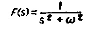

4.  $f(t) = e^{t^2}$  (не имеет преобразования Лапласа)
Рис. 13.1. Графики некоторых функций и их изображений по Лапласу.

где  $U\left(x,\,s\right)=\mathcal{L}\left[u\left(x,\,t\right)\right]$ . Правила преобразования производных  $u_{x}$  и  $u_{xy}$  вытекают из теоремы о дифференцировании интеграла по параметру

$$

\frac{d}{dx}\int_{a}^{b}f\left(x,\ y\right)dy=\int_{a}^{b}\frac{df}{dx}\left(x,\ y\right)dy,

$$ а формулы для преобразования производных  $u_t$  и  $u_{tt}$  можно получить интегрированием по частям.

# Свойство 3 (Теорема о свертке)

Свертка играет здесь ту же роль, что и в теории преобразования Фурье, но вводится несколько иначе.

# Определение конечной свертки

Конечная свертка двух функций f и g определяется формулами

$$

(f * g) (t) =

$$ \begin{cases} \int_0^t f(\tau) g(t-\tau) d\tau, \\ \int_0^t f(t-\tau) g(\tau) d\tau \end{cases}

$$

(Можна довести, що ці інтеграли рівні). Тут інтегрування здійснюється вздовж скінченного інтервалу від 0 до t, а не вздовж нескінченної ( $\infty$ , $+\infty$ ), як це було раніше з визначенням нескінченної згортки.

Ось приклад скінченної згортки двох функцій. Нехай

$$f(t) = t, \quad g(t) = t;$$

тоді

$$(f * g)(t) = \int_{0}^{t} \tau(t - \tau) d\tau = t^{3}/6.$$

Як і у випадку нескінченної згортки, її найважливіша властивість визначається формулою

(13.4)

$$\mathscr{L}[f * g] = \mathscr{L}[f] \mathscr{L}[g]$$

або еквівалентна формула

(13.5)

$$\mathscr{L}^{-1}\left\{ \left[\mathscr{L}\left[f\right]\mathscr{L}\left[g\right]\right\} = f*g. \right.$$

Ці формули дозволяють змінити перетворення Лапласа у випадках, коли образ можна представити як добуток $\mathscr{L}[f]$ і $\mathscr{L}[g]$ таких множників, для яких

Функції F і G легко знайти. Після пошуку функцій f і g можна знайти їхню згортку. Наприклад,

$$\mathcal{Z}^{-1}\left[\frac{1}{s} \cdot \frac{1}{s^2+1}\right] = \int_0^t \sin \tau \, d\tau = 1 - \cos t,$$

F(s) = \frac{1}{s} \xrightarrow{\mathcal{Z}^{-1}} f(t) = 1 \quad G(s) \xrightarrow{\mathcal{Z}^{-1}} g(t) = \sin t.

$$

Тепер ми готові до важливого змішаного виклику.

# Теплопровідність у напівнескінченному середовищі

Розглянемо глибокий резервуар з рідиною, і нехай бічна поверхня резервуара буде теплоізольованою. Нехай $u_0$ буде початковою температурою рідини, а температура повітря над рідиною —

Рис. 13.2. Схематичне представлення проблеми теплопровідності: a — тепло тече всередину, якщо ви(0, t) < 0, і назовні, якщо ви(0, t) > 0; b — резервуар настільки глибокий, що гранична умова внизу не впливає на розв'язок при значеннях x.

кістка дорівнює нулю (орієнтир температур) (див. рис. 13.2). Наше завдання — знайти температурне поле в рідині на різних глибинах і в різний час. Іншими словами, нам потрібно розв'язати проблему

(13.6)

$$
\begin{aligned}
(\text{УЧП})\quad & u_t = u_{xx}, && 0 < x < \infty,\; 0 < t < \infty, \\
(\Gamma \text{У})\quad & u_x(0,t) - u(0,t) = 0, && 0 < t < \infty, \\
(\text{НУ})\quad & u(x,0) = u_0, && 0 < x < \infty.
\end{aligned}
$$ Щоб розв'язати цю задачу, ми застосуємо перетворення Лапласа до змінної t. Зверніть увагу, що можна також застосувати перетворення Лапласа до змінної x, оскільки воно змінюється від 0 до $\infty$ . Після застосування перетворення

Ми отримуємо звичайне диференціальне рівняння за змінною X.

(13.7)

$$

(ODY) \quad sU(x) - u_0 = \frac{d^2U}{dx^2}, \quad 0 < x < \infty,

$$ (\Gamma Y) \quad \frac{dU}{dx}(0) = U(0)$$

(Ми перетворили лише рівняння та граничну умову, а не початкову умову.) Маємо звичайне диференціальне рівняння другого порядку, але з однією граничною умовою при x=0. Насправді існує ще одна гранична умова. Він визначається фізичними міркуваннями і фіксується як $U(x) \to 0$ , коли $x \to +\infty$ . Зверніть увагу, що для спрощення позначення ми опустили параметр s із аргументів функції U(x) всюди, оскільки рівняння (13.7) є диференціальним рівнянням лише відносно x.

Щоб розв'язати задачу (13.7), запишіть загальне рішення (загальний розв'язок однорідного + часткового розв'язку гетерогенного) TAC:

$$U(x) = c_1 e^{V_{5x}} + c_2 e^{-V_{5x}} + u_0/s.$$

Підставляючи цей вираз у граничну умову (13.7), можна визначити константи $c_1$ та $c_2$ (одразу зрозуміло, що $c_3 = 0$ ,

Рис. 13.3. Граф ймовірнісного інтеграла (eri) та його комплементарної функції (eric).

Інакше температура буде зростати нескінченно зі збільшенням координати X). Визначаючи сталу $c_2$ з граничної умови при x=0, отримуємо фінальний вираз для $U\left(x\right)$ (13.8)

$$U(x) = u_0 \left\{ \frac{e^{-V \widehat{s} x}}{s(V \widehat{s} + 1)} \right\} + \frac{1}{s}.$$

Залишається зробити останній крок. Щоб визначити температурне поле, потрібно обчислити $u\left(x,\,t\right)$ $$u(x, t) = \mathcal{L}^{-1}[U(x, s)]$$

(ми повернулися до написання всіх аргументів функції U(x, s)). Щоб повернути перетворення Лапласа, ми використаємо таблиці, наведені в додатку. У результаті ми отримуємо

(13.9)

$$u(x, t) = u_0 - u_0 \left[ \text{eric} \left( \frac{x}{2} \sqrt{t} \right) + \text{eric} \left( \sqrt{t} + \frac{x}{2} \sqrt{t} \right) e^{x+t} \right],$$

де

$$\operatorname{eric}(x) = \frac{2}{\sqrt{\pi}} \int_{x}^{\infty} e^{-\xi^{2}} d\xi$$

є функцією, доповнюючою до ймовірнісного інтеграла. Графіки цієї функції показані на рис. 13.3. Аналіз цього рішення P H C

13.4. Температура всередині напівнескінченного середовища в різний час.

Потребує дуже малих зусиль. Фіг. (13.4) представлено результати чисельного аналізу, отриманого на комп'ютері, оснащеному плоттером.

# ПРИМІТКИ

- 1. Перетворення Лапласа також можна звести до неоднорідного диференціального рівня з частковими множниками (для виконання методу диференціації різних рівнів можна звести до одного рівня), але можна звести його до рівня різних множників (метод диференціації можна звести до рівня коефіцієнтів заміщення). Таблиця 1. 13.2 У сфері захисту шкіри існує два методи.
- 2. Для виконання цих і межових завдань також проводиться трансформація Ганкеля і Мелліна, а також трансформація Лапласа в одному аспекті. Відтворення Лапласа підстановки оперативного множення формули

$$\mathscr{L}[y'] = s\mathscr{L}[y] - y(0),$$

Таблиця 13.2 Порівняння методів розділення перетворення Лапласа та змінних

| | Метод | |
|-------------------------|---------------------------|----------------------------------|
| |  Перетворення Лапласа |  <b>Розділення |</b>
| Гетерогенні PPP | Так | Так |
| Гетерогенні ГІ | Так | Так |
| Змінні ймовірності | Так | de' |
| Нелінійні рівняння | Так | Так |

а перетворення Ганкеля і Мелліна замінюють диференціальний оператор на множник. Наприклад, для перетворення Ганкеля, визначеного формулою

$$H[y] = \int_{0}^{\infty} r J_{o}(\xi r) y(r) dr,$$

справедливе співвідношення

$$H\left[y''\left(r\right)+\frac{1}{r}\ y'\left(r\right)\right]=-\xi^{2}H\left[y\right].$$

Таким чином можна розв'язати спеціальне диференціальне рівняння з змінними коефіцієнтами (рівняння Бесселя). 3. Перетворення Лапласа на змінній t можна інтерпретувати як проекцію площини xt на осі x, що призводить до У ц ь о м у

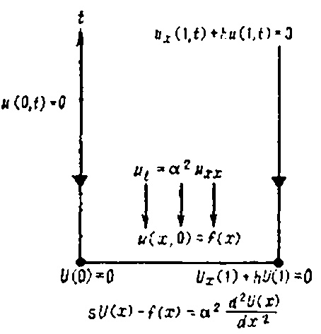

випадку початкові рівняння, граничні та початкові умови перетворюються на нове диференціальне рівняння та нові граничні умови (див. діаграму вище).

# ЗАВДАННЯ

1. Переконайтеся, що наступна формула для перетворення часткової похідної $u_t$ є істинною:

$$\mathscr{L}\left[u_{t}(x, t)\right] = sU(x, s) - u(x, 0).$$

2. Використати перетворення Лапласа для розв'язання задачі Коші

$$
\begin{aligned}
(\text{УЧП})\quad & u_t = \alpha^2 u_{xx}, && -\infty < x < \infty,\ 0 < t < \infty, \\
(\text{НУ})\quad & u(x,0) = \sin x, && -\infty < x < \infty.
\end{aligned}
$$

3. За допомогою перетворення Лапласа за змінною $t$ розв'язати задачу

$$
\begin{aligned}
(\text{УЧП})\quad & u_t = u_{xx}, && 0 < x < \infty,\ 0 < t < \infty, \\
(\text{ГУ})\quad & u(0,t) = \sin t, && 0 < t < \infty, \\
(\text{НУ})\quad & u(x,0) = 0, && 0 \leqslant x < \infty.
\end{aligned}
$$

Дайте фізичну інтерпретацію цієї задачі.

4. Розв'язати задачу з граничним значенням

(ОДА)

$$\frac{d^2U}{dx^2} - sU = A, \quad 0 < x < 1,$$

(\Gamma Y) \quad

$$ \begin{cases} \frac{dU}{dx} (0) = 0 \\ U(1) = 0. \end{cases}

$$

Лекція 14

# ПРИНЦИП ДЮАМЕЛЯ

МЕТА ЛЕКЦІЇ: Показати, як переклад Лапласа можна використовувати для ідентифікації характеристик диференціальних рівнів. Зокрема, за допомогою алгебранічного перетворення образів Лапласа, розвиток рівня часткового оберненого можна відкинути принципом погляду Дюамеля. Інтерпретація цього принципу в теорії найвищих диференціальних рівнів світу використовується для розробки певних завдань УПП.

технології.

Давайте подивимось, як трансформація Лапласа здійснюється спробою розвитку часткових диференціальних ліній, що дозволяє нам розкрити фізичну сутність різних розвитків. За допомогою трансформації Лапласа ми вже розробили принцип Дюамеля. Перше, що потрібно зробити — звернутися до принципу Дюамеля, ми бачимо проблему, яка часто є проблемою

# Теплопровідність у стрижні, кінці якого підтримуються при заданій температурі

Дуже часто необхідно знайти температуру всередині області, якщо відомо, що на межі області вона змінюється з часом відповідно до певного закону (граничні умови, залежні від часу).

На лівому кінці підтримується умова $u(0,t)=0$, а на правому кінці температура задається функцією $f(t)$.

Рис. 14.1. Граничні умови, що залежать від часу.

Наприклад, розглянемо термоізольований стержень, правий кінець якого підтримується у f(t) (див. рисунок 14.1). Потрібно вирішити цю проблему

(14.1)

$$

u_{t} = u_{xx}, \quad 0 < x < 1, \quad 0 < t < \infty,

$$ (\Gamma Y) \quad \begin{cases} u(0, t) = 0, \\ u(1, t) = f(t), \end{cases} \quad 0 < t < \infty,$$

(HY) \quad u(x, 0) = 0, \quad 0 \le x \le 1.

$$

Сподіваємося, що розв'язання цієї задачі (14.1) буде легким, оскільки ми знаємо розв'язок простішої задачі, де температура в кінці є сталою:

Насправді, якщо обидві задачі ((14.1) і (14.2)) розв'язуються одночасно за допомогою перетворення Лапласа, то отримаємо визначний результат: розв'язок задачі (14.1) виражається через розв'язання задачі (14.2).

Отже, розв'язуючи обидві задачі одночасно, ми отримуємо

# Легке завдання (14.2) (Постійні солдати)

Застосування перетворення -Лапласа до задачі (14.2)

$$

\frac{d^2W}{dx^2} - sW(x) = 0,

$$ W(0) = 0,$$

W(1) = 1/s

$$.

Пемеріль ODU

$$

W(x, s) = \frac{1}{s} \left[ \frac{\sinh(x \sqrt{s})}{\sinh(\sqrt{s})} \right].

$$

Пошук оберненого перетворення

$$

w(x, t) =

$$ = x + \frac{2}{\pi} \sum_{n=1}^{\infty} \frac{(-1)^n}{n} e^{-(n\pi)^2 t} \times$$ $\times \sin(n\pi x)$ (розв'язання задачі з постійним ГІ).

# Важке завдання (14.1) (Солдати, що залежать від часу)

Застосування перетворення Лапласа до задачі (14.1)

$$\frac{d^2U}{dx^2} - sU(x) = 0,$$

U\left( \mathbf{0}\right) =0,

$$ U(1) = F(s)$$.

$$U(x, s) = F(s) \left[ \frac{\sinh(x \sqrt{s})}{\sinh(\sqrt{s})} \right].$$

Розділіть і помножте на z

$$U(x, s) = F(s) \left\{ s \left[ \frac{\sinh(x \sqrt{s})}{s \sinh(s)} \right] \right\}.$$

Використовуючи співвідношення $\mathscr{L}[w_t] = sW - w(x, 0),$ отримуємо

$$U(x, s) = F(s) \mathcal{L}[w_t].$$

Відповідно,

$$u(x, t) = \mathcal{L}^{-1} \{ F(s) \mathcal{L}[w_t] \} =$$

= \mathcal{L}^{-1} [ F(s) ] * \mathcal{L}^{-1}[w_t] =

$$ = f(t) * w_t(t) =$$

= \int_0^t w_t(x, t-\tau) f(\tau) d\tau =

$$

(після інтегрування частинами)

$$

= \int_{0}^{t} w(x, t-\tau) f'(\tau) d\tau + f(0) w(x, t).

$$

(Розв'язок задачі з часово-залежними ГІ виражається через розв'язок задачі з постійними ГІ

розв'язано у задачах з константою

Отже, ми висловили розв'язок задач із граничними умовами, що змінюються в часі, через розв'язання задачі з постійними граничними умовами. Відповідні формули такі:

(14.3) 

плутанина у наступних формулах. Записати диференціальне рівняння в похідних у нових координатах (\ $, т), мы воспользуемся следующими формулами перехода;

$$

Наприклад, якщо dy/dx = B/2A = 3, то y - 3x = c, а отже $\xi(x, y) = y - 3x$ . Ця функція задовольняє умову $[\xi_x/\xi_y] = -3$ і, відповідно, повертає коефіцієнт $\overline{A}$ до нуля.

Отже, половина роботи виконана: ми знайшли нову координатну $\xi = \xi(x, y)$ , яка забезпечила рівність $\overline{A} = 0$ . Залишається знайти $\eta(x, y)$ таким чином, щоб перетворити коефіцієнт $\overline{B}$ на нуль.

Час зупинитися тут. Виявляється, що якщо вибрати $B^2-4AC=0$ і $\xi$ так, щоб $\overline{A}=0$ , то коефіцієнт $\overline{B}$ автоматично стане нулем 1). Тепер ми побачимо це.

Коефіцієнт $\overline{B}$ задається виразом

$$ \overline{B}^2 - 4\overline{A}\overline{C} = (B^2 - 4AC) (\xi_x \eta_y - \xi_y \eta_x)^2 - \Pi \rho u u. \ \rho e \partial.$$

\overline{B} = 2 \left( V \overline{A} \xi_x + V \overline{C} \xi_y \right) \left( V \overline{A} \eta_x + V \overline{C} \eta_y \right).

$$

Функциональная диаграмма на рис. 15.5 делает эти формулы совсем очевидными. Эта диаграмма особенно полезна при вычислении частных производных функций и и и по переменным Р И С

15.5 Диаграмма, иллюстрирующая функциональную зависимость переменных

 $ \xi $  и  $ \tau $ , поскольку  $ \xi $  зависит и от x, и от t. Переменная  $ \tau $  зависит только от t. Это все, что касается преобразований. Теперь подставим найденные выражения  $ u_t $ ,  $ u_x $  и  $ u_{vx} $  в уравнение (15 2) и получим

$$

\overline{B} = 2 \sqrt{\overline{A}} \left[ \sqrt{\overline{A}} \, \eta_x + \sqrt{\overline{C}} \, \eta_y \right].

$$

откуда

$$

u_{xy} + 2u_{xy} + u_{yy} = 0.

$$.

Следовательно, новая задача с начальным условием в персменных  $ \xi $  и  $ \tau $  имеет вид

(УЧП)

$$

\frac{dy}{dx} = -[\xi_x/\xi_y] = B/2A = 1.

$$

(НУ)  $ u(\xi, 0) = 1 - H(\xi), \quad -\infty < \xi < \infty. $ 

Так как  $ \xi = x $  при t = 0, то новые граничные условия совпадают со старыми. Эта задача была решена в лекции 12 с помощью интегрального преобразования Фурье, и ее решение записывается в виде

$$

y = x + c

$$

где  $ \phi(\beta) $  — начальное условие. Следовательно, в нашем случае

$$

\eta = y

$$

После подстановки

$$

\begin{cases}
 \xi = y - x, \\
 \eta = y
 \end{cases}

$$

получаем окончательный результат

(15.3)

$$

\overline{C} = A \eta_x^2 + B \eta_x \eta_y + C \eta_y^2 = 1,

$$ \overline{E} = A \eta_{xx} + B \eta_{xy} + C \eta_{yy} + D \eta_x + E \eta_y = 0,
$$

\begin{cases} \frac{1}{2} \left[ 1 + \operatorname{erf} \left( \frac{-\xi}{2\sqrt{D\tau}} \right) \right], & \xi < 0, \\ \frac{1}{2} \operatorname{erfc} \left( \frac{\xi}{2\sqrt{D\tau}} \right), & 0 \leq \xi. \end{cases}

$$ \overline{G} = G = 0.$$

\overline{A}u_{\xi\xi} + \overline{B}u_{\xi\eta} + \overline{C}u_{\eta\eta} + \overline{D}u_{\xi} + \overline{E}u_{\eta} + \overline{F}u = \overline{G}

$$

Графики этого решения для различных моментов времени изображены на рис. 15.6. Осталось сделать последний шаг — записать решение нашей задачи в координатах x и t. Подставляя

$$

u_{\eta} = f(\xi),

$$,  $ \tau = t $ 

в формулы (15.3), получаем

(15.4)

$$

u(\xi, \eta) = \eta f(\xi) + g(\xi),

$$ u(x, y) = yf(y-x) + g(y-x)$$

\begin{cases} \frac{1}{2} \left[ 1 + \operatorname{erf}\left(\frac{Vt - x}{2\sqrt{Dt}}\right) \right], & Vt > x, \\ \frac{1}{2} \operatorname{erfc}\left(\frac{x - Vt}{2\sqrt{Dt}}\right), & Vt \leq x. \end{cases}

$$u_{xx} + 2u_{xy} + u_{yy} = 0.$$

u(x, y) = y \sin(y-x) + (y-x)^2

$$ Au_{xx} + Bu_{xy} + Cu_{yy} + Du_x + Eu_y + Fu = G$$

\begin{array}{ll} u_t = u_{xx} - 2u_x, & -\infty < x < \infty, & 0 < t < \infty, \\ u(x, 0) = \sin x, & -\infty < x < \infty. \end{array}

$$u_{\xi\xi} + u_{\eta\eta} = \varphi(\xi, \eta, u, u_{\xi}, u_{\eta}).$$

\overline{A}u_{\xi\xi} + \overline{B}u_{\xi\eta} + \overline{C}u_{\eta\eta} + \overline{D}u_{\xi} + \overline{E}u_{\eta} + \overline{F}u = \overline{G}

$$ u_{\xi\eta} = \psi(\xi, \eta, u, u_{\xi}, u_{\eta}).$$

\begin{array}{ll} u_t = u_{xx} - 2u_x, & -\infty < x < \infty, \ 0 < t < \infty, \\ u(x, \ 0) = e^x \sin x, & -\infty < x < \infty. \end{array}

$$\frac{dy}{dx} = \frac{B - \sqrt{B^2 - 4AC}}{2A}$$

\xi(x, y) = \text{const}, \quad \eta(x, y) = \text{const}.

$$ \frac{dy}{dx} = -\sqrt{-4x^2} = -2ix,$$

\begin{array}{ll} (\text{YHI}) & u_t = -2u_x, \\ (\text{HY}) & u_t(x, 0) = e^{-x^2}. \end{array}

$$

також задаються комплексно-спряженим координатам

$$

# Конверсія 2

Наступне перетворення з $(\xi,\eta)$ на $(\alpha,\beta)$ виконується за формулами

$$

Проверьте ваш ответ.

4. Решите задачу

$$, $\beta = \frac{\xi - \eta}{2i}$ .

Внаслідок застосування другого перетворення, рівняння

$$ набуває остаточної форми

$$

Перевірте своє рішення. Як виглядає рішення в різні моменти часу?

ПРИМІТКА. Перехід до рухомої системи відліку дозволяє негайно відкинути член $ Vu_x $ у рівнянні конвективної дифузії. Після розв'язання нової проблеми

$$

де $\phi$ та $\phi$ використовуються для позначення правих сторін рівнянь у загальному вигляді. Замість того, щоб доводити, що ці дві трансформації дійсно ведуть до бажаного результату, давайте розглянемо простий приклад.

# Зведення рівняння $y^2u_{xx} + x^2u_{yy} = 0$ до його канонічної форми

Розглянемо рівняння

$$

у яких $A=y^2$ , B=0, $C=x^2$ , D=E=F=G=0. Дискримінантний $B^2-4AC$ дорівнює $-4x^2y^2$ , і ми зведемо це рівняння до канонічної форми в першому квадранті x>0, y>0.

КРОК 1 (Перше перетворення)

Запишемо характеристичні рівняння

$$ \frac{dy}{dx} = \frac{B + \sqrt{B^2 - 4AC}}{2A} = \frac{\sqrt{-4x^2y^2}}{2y^2} = i\frac{x}{y}$$

Замініть змінні $ \xi = x - Vt $ , $ \tau = t $ . У нашому випадку інтеграл можна обчислити явно

$$y^2 + ix^2 = \text{const},$$

Такий інтеграл уже зустрічався у лекції 12. Можливо, читачу буде зручніше звернутися до таблиць перетворення Фур'є.

# ОДНОВИМІРНЕ ХВИЛЬОВЕ РІВНЯННЯ (ГІПЕРБОЛІЧНІ РІВНЯННЯ)
МЕТАЛЕКЦІЇ: Показати, що коливання навантаження описуються рівнянням

$$

Від

$$

і що це рівняння є наслідком законів Ньютона. Також розглядаються інші типи хвильового рівняння:

$$ $\eta(x, y) = y^2 - ix^2.$ (Неважливо, яка з двох функцій називається $\xi$ , а яка — $\eta$ ; ви можете поміняти їх місцями, якщо хочете.) Після цього перетворення початкове рівняння набуває вигляду

$$

Ми не звертатимемо уваги на це рівняння (яке є комплексним гіперболічним рівнянням), а одразу перейдемо до другого перетворення.

КРОК 2. (Друга трансформація)

При здійсненні другої трансформації ми маємо

$$

\begin{split} u_{tt} &= \alpha^2 u_{xx} + F\left(x, \ t\right), \\ u_{tt} &= \alpha^2 u_{xx} - \beta u_t - \lambda u + F\left(x, \ t\right). \end{split}

$$

(реальна частина $\xi$ і $\eta$ ), $\beta = \frac{\xi - \eta}{2\iota} = x^2$ (уявна частина $\xi$ і $\eta$ ).

Щоб спростити нотацію, найкраще перепозначити $(\alpha,\beta)$ $(\xi,\eta)$ окремо і записати отримане $\epsilon$ перетворення як

$$ КРОК 3 (Отримання нового рівняння)

Нову канонічну форму можна отримати, обчисливши всі коефіцієнти $\overline{A}, \overline{B}, \overline{C}, \overline{D}, \overline{E}, \overline{F}$ і $\overline{G}$ у рівнянні

$$

До цього часу ми розглядали фізичні процеси, які описуються одномірними параболічними рівняннями (задачі дифузії). Тепер ми почнемо вивчати інший клас диференціальних рівнянь у похідних — гіперболічні рівняння. Почнемо з одновимірного хвильового рівняння, яке описує, зокрема, поперечні коливання струни.

# Вібрації струн

Розглянемо невеликі коливання струни з нерухомими кінцями. Припустимо, що струна щільно натягнута, зроблена з однорідного матеріалу і коливається в одній площині (рис. 16.1).

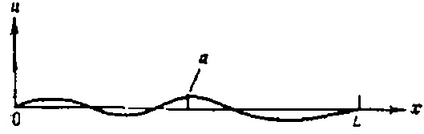

Фіг. 16.1. Поперечні коливання струни: a — зміщення струни з положення рівноваги.

Ігноруємо вплив гравітації на струну. Щоб побудувати математичну модель коливань струн, розглянемо всі сили, що діють на невелику частину струни (рис. 16.2). Виявляється, що хвильове рівняння — це не більше ніж закон руху Ньютона (зміна імпульсу дорівнює сумі діючих сил), застосований до струни. Дивлюся на рис. На рисунку 16-1 ми можемо представити сили, що діють на струну, у напрямках, перпендикулярних осі x.

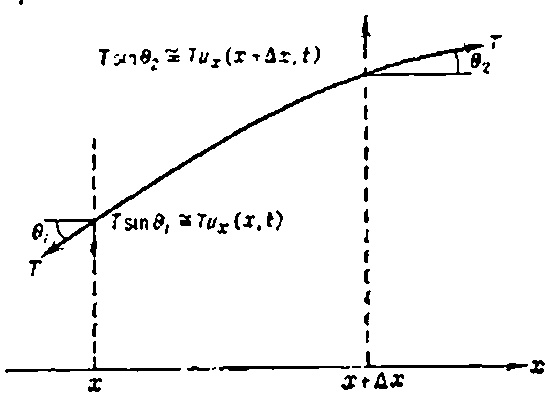

Фіг. 16.2. Невелика частина $ (x, x + \Delta x) $ осцилюючою струною.

1. Сила, що виникає через натяг струни ( $ \alpha^2 u_{xx} $ ). Значення поперечної компоненти сили натягу визначається відповідно до формули

Сила =

$$

за формулами (41.5) з $\xi = y^2$ та $\eta = x^2$ . Зробивши це, отримуємо канонічну форму еліптичного рівняння

$$ $ \simeq T [u_x(x + \Delta x, t) - u_x(x, t)]. $ 2. Внешняя сила F (x, t).

Зовнішня сила F(x, t), прикладена до струни, може довольно залежати від x і t. Нижче наведено деякі приклади зовнішніх сил:

а) гравитационная сила F(x, t) = -mg;

b) імпульси, розподілені вздовж струни та діючи на неї в різний час:

c) сили, що виникають внаслідок дії звукової хвилі на шкіру барабана (пізніше ми детально вивчаємо коливання мембрани, які описуються хвильовим рівнянням).

3. Сили тертя, що діють на струну (— $ \beta u_t $ ). Якщо струна вібрує у середовища, виникає сила опору, яка пропорційна швидкості $ u_t $ .

4. Возвращающая сила (- үи).

Ця сила спрямована протилежно зміщенню струни. Якщо зміщення u додатне, то сила від'ємна.

Якщо тепер застосувати рівняння руху Ньютона до невеликої ділянки струни, отримаємо

$$

# ПРИМІТКИ

1. Аналогічно можна класифікувати лінійні рівняння другого порядку з *трьох або більше змінних*, але для цього потрібен матричний аналіз. Наприклад, рівняння другого порядку з трьома змінними

$$

де $ \rho $ — лінійна густина струни. Поділимо обидві частини цього співвідношення на $ \Delta x $ і поставимо $ \Delta x $ — 0. Результатом є добре відоме телеграфне рівняння

(16.1)

$$

згідно з цією класифікацією, буде параболічним, а рівняння

$$

У цьому рівнянні слід поділити $ \alpha $ , $ \beta $ , $ \gamma $ і F(x,t) на $ \rho $ , але для простоти залишимо старі позначки для цих величин. Отримано бажане рівняння. Ось інтерпретація найпростішого хвильового рівняння

$$

- Гіперболічно.

2. Наш інтерес до класифікації диференціальних рівнянь у похідних пов'язаний із тим, що три основні типи рівнянь описують три різні типи фізичних явищ, і ми хотіли б отримати математичну класифікацію цих трьох класів фізичних явищ.

# ЗАВДАННЯ

1. Які з цих параболічних і еліптичних рівнянь записані у канонічній формі?

a) $u_t = u_{xx} + hu$,

б) $u_{xy} + u_{xx} + 3u = \sin x$,

в) $u_{xx} + 2u_{yy} = 0$,

г) $u_{xx} = \sin^2 x$?

2. Перетворіть параболічне рівняння $u_{xx} + 2u_{xy} + u_{yy} + u = 2$ до канонічної форми.

3. Перетворіть еліптичне рівняння $u_{xx} + 2u_{yy} + x^2 u_x = e^{-x^2/2}$ до канонічної форми.

# МЕТОД МОНТЕ-КАРЛО (ВСТУП)

МЕТА ЛЕКЦІЇ: Пояснити основні ідени, що лежать в основі методу Монте-Карло, і показати, як цей метод можна використовувати для розв'язання різних задач. Виявляється, що за допомогою азартних ігор можна змоделювати (загалом, на комп'ютері) наближені розв'язки реальних задач. Як простий приклад можна вказати обчислення інтеграла

$$

основанную на интуитивных соображениях.

# Інтуїтивна інтерпретація хвильового рівняння

Читач може запитати: чому рівняння типу (16.2) має описувати щось подібне до вібрацій скрипкової струни? Щоб зрозуміти це, необхідно зрозуміти Ф і

г. 16 3. Інтерпретація хвильового рівняння $ u_{tt} = \alpha^2 u_{xx} $ $ u_{tt} $ Equation (16.2) можна інтерпретувати так: прискорення струни, викликане натягом, у кожній точці більше, чим більша увігнутість струни $ u_{xx} $ у заданій точці (коефіцієнт пропорційності сталий $ \alpha^2 = T/\rho $ ) (див. рис. 133).
# ПОВАГА
1. Хвильове рівняння $ u_{tt} = \alpha^2 u_{xx} $ також описує поздовжні та крутильні коливання стрижня. У поздовжніх осцилях зміщення паралельні елементу, і значення поздовжнього зміщення відносно положення рівноваги позначається через $ u\left(x,\,t\right) $ . Такі коливання виникають, наприклад, коли молоток б'ють по кінці стрижня. Торсіональний

ные колебания

$$

кидаючи дротик у одиничний квадрат $\{(x, y): 0 < x < 1, 0 < y < 1\}$ Після приблизно 100 кидків відносна частина дротиків, що опускається нижче кривої $y = x^2$ , вважається приблизним значенням інтеграла. Узагальнення такої гри (з випадковим киданням дрогіка) завжди містить процедуру генерації послідовності випадкових чисел.

У цій лекції ми коротко опишемо метод Монте-Карло, а в наступній лекції покажемо, як його використовувати для розв'язання диференціальних рівнянь у похідних

Методи Монте-Карло зазвичай називають групою методів розв'язання детермінованих задач (тобто задач без випадковості), у яких суттєво використовуються елементи випадковості. Загальна філософія етнічних методів показана на рис. 42 1.

Ймовірнісна гра

Деторміноване завдання $\rho$ — розв'язання задачі (наприклад, обчислення інтеграла, розв'язання UBP тощо).

Результат = $\hat{p}$ Наближення p Рішення = p Рис. 42.1. Загальна теорія методу Монте-Карло.

# Обчислення інтеграла

Припустимо, ми хочемо обчислити інтеграл

$$

Тут *k* — це модуль Юнга, який характеризує еластичність матеріалу. Матеріали з великим модулем Юнга коливаються на вищих частотах. Звукові хвилі — це поздовжні хвилі.

2. Якщо лінійна густина струни $ \rho(x) $ залежить від координати, то хвильова аугура записується як

$$

(детерміноване завдання). Щоб використати метод Монте-Карло, потрібно винайти гру на удачу, яка дає приблизне значення цього інтеграла.

Звісно, можна придумати багато різних ігор. Остаточна версія залежить від точності розрахунків, простоти гри тощо. Очевидний варіант гри для обчислення інтегралу — кинути дротик у прямокутний $R = \{(x,y): a \le x \le b, 0 \le y \le \max f(x)\}$ (див. рис. 42.2)

Рис. 42 2. Обчислення інтегралу методом Монте-Карло.

Очевидно, якщо випадковим чином кинути близько 100 дротиків у прямокутник R, що містить графік функції, можна отримати оцінку значення інтеграла, помноживши площу прямокутника R на відносну кількість дротиків під графіком функції. Отже, результат нашої гри

$$

т. е. получается УЧП с переменными коэффициентами.

3. Оскільки хвильове рівняння $ u_{tt} = \alpha^2 u_{xx} $ містить похідну другого порядку часу, щоб отримати єдине розв'язання в точці t>0, необхідно вказати $ \partial sa $ початкові умови:

$$ — це інтегральний бал 1.

Щоб виконати ці обчислення на комп'ютері, нам потрібно якимось чином отримати послідовність випадкових точок (подивимось, як це буде зроблено пізніше), тобто наказати комп'ютеру «кидати дротики». Блок-схема на рис. 42.3 показує, як комп'ютер вирішить цю проблему.

**РИС.** 42.3. Блок-схема розрахунку інтегрального $\int_{a}^{b} f(x) dx$ методом Монте-Карло (100 кидків); $M = \max_{a} f(x)$ .

# Випадкові числа

Перш ніж перейти до рівняння Монте-Карло з частковими похідними, зупинимося на важливому питанні випадкових чисел. Щойно, обчислюючи інтеграл, нам потрібно було побудувати послідовність випадкових точок $P_i = (x_i, y_i)$ всередині прямокутника R. Іншими словами, x-координата точки P має бути випадковим числом з інтервалу [a, b], а $y_i$ від інтервалу [0, M]. Щоб знайти випадкові числа з цих інтервалів, звертаємося до послідовності випадкових чисел, рівномірно розподілених по сегменту [0, 1]. Тоді числа, рівномірно розподілені на сегменті [a, b], можна обчислити за формулою

$$

(початкове зміщення струни), $ u_t(x, 0) = g(x) $ (початкова швидкість струни).

Таким чином, хвильове рівняння відрізняється від рівняння теплопровідності, для якого потрібно встановити лише одну початкову умову.

4. За допомогою хвильового рівняння можна описати розподіл електричного струму в дроті. З законів Кірхгофа отримуємо таку систему двох рівнянь у похідних похідних першого порядку:

(16.3)

$$

Тепер, звичайно, виникає питання: як отримати послідовність випадкових чисел, $\{r_i: i=1,2,\ldots\}$ рівномірно розподілених на [0,1]? Найпоширенішим методом сьогодні є метод дедукцій (метод порівнянь). Використовуючи цей метод, отримуємо послідовність випадкових цілих чисел (наприклад, 2120, 1401, 177, 3013,...), потім ліворуч від кожного числа розміщується десяткова крапка, так що всі числа знаходяться між нулем і одним $(0,212; 0,1401; 0,0177; 0,3013; \ldots)$ .

Отже, щоб отримати послідовність випадкових цілих чисел (між 0 і P), ми використаємо метод віднімання.

# Отримання випадкових чисел за допомогою методу відрахування.

1. Як перше випадкове ціле число, обирайте будь-яке число, що знаходиться між 0 і P (число P обирається наперед).

2. Помножте це випадкове число на певне фіксоване число.

Попередньо обраний множник M.

3. Додайте до добутку деяке фіксоване ціле число *K*, обране заздалегідь.

4. Поділити отриману суму на P і залишок

Виберіть нове випадкове число.

Метод виведення можна записати у формі формули $r_{i+1} \equiv (Mr_i + K) \bmod P$ , що означає, що для отримання наступного $r_{i+1}$ потрібно взяти попередній $r_i$ , помножити його на M, додати результат на K, поділити суму на P і взяти решту поділу. Наприклад, якщо P = 100, M = 37, K = 16, $r_0 = 15$ , то отримується наступна послідовність випадкових чисел:

$$

где

ж — координата вдоль провода,

*t* — время,

i(x, t) — распределение тока вдоль провода, $ v\left(x,\ t\right) $ — распределение потенциала вдоль провода,

С -- емкость провода на единицу длины,

G — утечка на единицу длины,

Р — сопротивление на единицу длины,

-- индуктивность провода на единицу длины.

Рівняння (16.3) зазвичай називають системою телеграфних рівнянь. У такій формі вони зазвичай не використовуються. Щоб перетворити цю систему, диференціюйте перше рівняння на x, друге на t, помножте обидві частини на C і відніміть від першого. У результаті ми отримуємо

$$ Mr_1 + K = 2643$$

Воспользуемся теперь вторым уравнением из (16.3)

$$ r = 71$$

окончательно получаем

(16.4)

$$ Y$$

Це рівняння для струму, відоме як телеграфне рівняння, є гіперболічним рівнянням другого порядку (якщо, звісно, C і L не дорівнюють нулю, інакше рівняння стає параболічним).

Напряжение описывается точно таким же уравнением:

(16.5)

$$I = \int_{0}^{1} \int_{0}^{1} \int_{0}^{1} \int_{0}^{1} e^{-(x^{2}+y^{2}+z^{2}+\omega^{2})} dx dy dz dw,$$

Если G = R = 0, то уравнения (16.4)—(16.5) упрощаются:

(16.6)

$$I = \int_{0}^{1} e^{\sin x} dx.$$

# ЗАВДАННЯ - 1. Отримайте рівняння (16.5) для *and* з системи з двох рівнянь першого порядку (16.3)
- 2. Знаючи фізичне значення кожного члена хвильового рівняння, що ви можете сказати про поведінку в момент розв'язання наступної задачі:

(YYII)

$$r_{i+1} \equiv (3r_i + 4) \mod 7, \quad r_0 = 0.$$, $ 0 < x < 1 $ , $ 0 < t < \infty $ ,  
(ГУ)

$$I = \int_{0}^{1} \int_{0}^{1} \int_{0}^{1} e^{-(x^{2}+y^{2}+z^{2})} dx dy dz.$$

u(x,y) = g(x,y) =

$$

\begin{cases} u(0, t) = 0, & 0 < t < \infty, \\ u(1, t) = 0, & 0 < t < \infty, \end{cases}

$$

Після того, як цю конкретну задачу буде розв'язано методом Монте-Карло, ми розглянемо, як розв'язувати більш загальні задачі за допомогою цього методу.

Щоб проілюструвати метод Монте-Карло, розглянемо гру під назвою «Блукаючий п'яниця». Щоб грати в цю гру, потрібна таблиця з сіткою ліній, як показано на рис. 43.1.

Перейдем к описанию правил игры.

# Как играть в «Блуждающего пьяницу»?

КРОК 1. Блукання п'яниці починаються з довільної точки сітки (у нашому випадку — точки А).

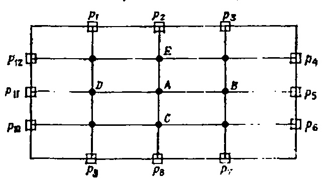

- Початкова точка - - внутрішні точки сітки - □ - Кінцева точка p;
- $g_i$ винагороди в m. $p_I$ Фіг. 43.1. Ігрове поле для гри «Блукаючий п'яниця».

КРОК 2. У кожному ході гри п'яний випадково переходить до однієї з чотирьох суміжних точок сітки (у нашому випадку сусідні точки для A — це точки B, C, D і E, і ймовірність досягти кожної з цих точок становить 0,25).

Таблица 43.1

Вероятность окончания случайного блуждания в граничной точке $p_i$ и величина вознаграждения $g_i$ | Граничная точка р і                        | $P_{\mathcal{A}}\left(p_{i}\right)$ — относительная доля блужданий, закончившихся в точке $p_{i}$ | $g_i$ — величина вознаграждения при достижении точки $p_i$ |  |  |
|-------------------------------------------------------|---------------------------------------------------------------------------------------------------|------------------------------------------------------------|--|--|
| 1 2 3 4 5 6 7 8 9 10 11 | 0,04 0,15 0,03 0,06 0,17 0,05 0,06 0,15 0,03 0,06 0,16 0,04      | 1 1 0 0 0 0 0 0 0                  |  |  |

ti

КРОК 3. Після переходу до наступної точки процес блукання відновлюється. Таким чином, п'яниця ходить від точки до точки, поки випадково не опиняється на межі $p_t$ . Тут це зупиняється, і ми записуємо номер точки $p_t$ . Це кінець однієї невимушеної прогулянки.

КРОК 4. Повторимо 1-3 рази достатньо і знайдемо відносну кількість прибуттів п'яниця в кожній з меж $p_i$ . Таблиця 1. 43.1 показує типові результати, отримані внаслідок 100 випадкових прогулянок.

КРОК B: Припустимо, що п'яниця отримує винагороду $g_i = g\left(p_i\right)$ (значення граничної умови в точці $p_i$ , якщо він досягає точки $p_i$ ) і припустимо, що мета гри — обчислити середній $R\left(A\right)$ винагороди за всі випадкові прогулянки, починаючи з точки A. Цей середній виграш визначається формулою

$$ Игра завершается, когда величина  $R\left(A\right)$  найдена. В соответствии с данными табл. 43.1 для  $R\left(A\right)$  получаем

$$

Теперь объясним, зачем нам понадобилось играть в такую игру.

# Для чего играть в «Блуждающего пьяницу»?

Виявляється, що середня винагорода, про яку щойно йдеться, є приблизним розв'язком проблеми Діріхле в точці A. Це цікаве спостереження базується на двох фактах.

1. Припустимо, що п'яниця почав свій шлях з точки, що лежить на Єрениці. Кожна така прогулянка одразу закінчується в одному й тому ж місці, і птах отримує винагороду $g_i$ . Отже, середня винагорода за кожну граничну точку дорівнює $g_i$ .

2. Тепер припустимо, що прогулянка починається з внутрішньої точки. Тоді стає зрозуміло, що середня винагорода за бал R(A) буде арифметичним середнім середніх нагород за чотири сусідні бали

$$

\begin{cases} u(x, 0) = \sin(\pi x), & 0 \le x \le 1, \\ u_t(x, 0) = 0. & 0 \le x \le 1, \end{cases}

$$

Давайте знову запитаємо себе: чому середнє значення винагороди R(A) наближається до розв'язання задачі Діріхле в точці A? Ми бачили, що значення R(A) задовольняє двох

уравнениям

$$ (во внутренних точках),  $R(A) = g_i$  (в граничных точках).

Если  $g_i$ —это значения функции g(x, y) из граничного условия в граничных точках  $p_i$ , то два наших уравнения точно совпадают с двумя уравнениями, которые были получены при решении задачи Дирихле методом конечных разностей. То есть величина R(A) соответствует величине  $u_{i,f}$  в разностных уравнениях

$$

(i, j)—внутренняя точка, $u_{ij} = g_{ij},$ $g_{ij}$ —значение решения в граничной точке (i, j).

Отже, значення R(A) дійсно наближає розв'язок рівняння часткових у точці A.

Тепер можна вважати, що гра «Блукаючий п'яниця» складається з трьох кроків.

# Розв'язання рівняння Лапласа за методом Монте-Карло

- Наступні правила дозволяють отримати розв'язок в одній внутрішній точці квадрата.
- КРОК 1. Давайте зробимо кілька випадкових прогулянок, починаючи з точки A і закінчуючи однією з прикордонних точок. Давайте відстежувати, скільки разів прогулянки закінчувалися на кожній межі.
- КРОК 2. Після завершення всіх прогулянок для кожної граничної точки ми обчислюємо відносну кількість прогулянок, які закінчилися в цій точці. Позначимо ці значення $P_A(p_i)$ .
  - КРОК 3. Обчислюємо наближений розв'язок u(A) за формулою $u(A) = g_1 P_A(p_1) + g_2 P_A(p_2) + \dots + g_N P_A(p_N)$ ,

де $g_i$ — значення функції g у точці $p_i$ , а N — кількість граничних точок.

Блукаючий п'яниця можна покращити, щоб розв'язати складнішу задачу. Нижче наведено приклад такого оновлення.

Розв'язок задачі Діріхле з змінними коефіцієнтами.

Рассмотрим эллиптическую краевую вадачу в квадрате

$$

Дайте физическую интерпретацию этой задачи.

4. Для уравнения  $ u_{tt} = u_{xx} $  найдите все решения вида

$$ $u_{xx} + (\sin x) u_{yy} = 0$ , $0 < x < \pi$ , $0 < y < \pi$ , $(\Gamma Y)$ $u(x, y) = g(x, y)$ на границе квадрата.

Щоб розв'язати цю задачу, замінимо $u_{xx}$ , $u_{yy}$ та $\sin x$ наступним чином:

$$

Будет ли решением сумма двух решений такого вида?

# ФОРМУЛА ДАЛАМБЕРА МЕТА ЛЕКЦІЇ: Построить решение задачи Коши для волнового уравнения

$$

и $_{yy}=u_{l+1,\ j}-2u_{l,\ j}+u_{l-1,\ j},$ (центральные разностные производные),

і підставляють їх у рівняння похідних похідних. Відповідна сітка показана на рис. 43.2. Розв'язавши отримане рівняння за $u_{i,l}$ , отримуємо

$$ Посмотрим внимательно на это уравнение. Коэффициенты при  $u_{i+1,\ j},\ u_i,\ j+i,\ u_l,\ j-1$  н  $u_{i-1},\ j$  положительны, и их сумма равна единице. Другими словами, решение  $u_i,\ j$  является взвешенным средним решений в четырех соседних точках. Следовательно, можно Р И С

. 43.2. Узлы сетки для случайного маршруга.

модифицировать «Блуждающего пьяницу» так, чтобы вероятности перехода в соседние точки были не 0,25, а равнялись бы коэффициенту в соответствующем члене. Другими словами, если пьяница находится в точке (i, j), то он переходит в точку

$$

Ця задача описує рух нескінченної струни за заданих початкових умов. Його розв'язав у 1750 році французький математик д'Аламбер. Формула Д'Аламбера

$$
 с вероятностью  $\frac{1}{2(1+\sin x_j)}$ ,  $(i, j-1)$  с вероятностью  $\frac{1}{2(1+\sin x_j)}$ ,  $(i+1, j)$  с вероятностью  $\frac{\sin x_j}{2(1+\sin x_j)}$ ,  $(i-1, j)$  с вероятностью  $\frac{\sin x_j}{2(1+\sin x_j)}$ .

В остальном игра не меняется. Модификация для других задач может оказаться более хитроумной, но основная идея остается той же. Читатель может заняться разработкой своих игр для решения других задач. Параболический случай рассмотрен в разделе «Задачи».
# ЗАУВАЖЕННЯ
1. Отметим, что если относительные частоты попадания  $P_A(p_l)$  известны, то можно легко найти величину  $u\left(A\right)$  при других граничных условиях  $g_l$ . Для этого достаточно подставить  $g_l$  в формулу

$$

полегшує пошук розв'язку, якщо початкові умови відомі. Крім того, це дозволяє дати цікаву фізичну інтерпретацію розв'язку мовою хвиль, що рухаються.

Як читач, ймовірно, пам'ятає, у параболічному випадку ми спочатку розв'язали задачі дифузії на скінченному відрізку (методом розділення змінних), а лише потім переходили до необмежених інтервалів (- $ \infty < x < \infty $ ), де застосовували перетворення Фур'є. У гіперболічному випадку ми зробимо навпаки. Почнемо з розв'язання одномірного хвильового рівняння на всій дійсній осі, тобто з задачі Коші

(17.1)

$$ а не разыгрывать вновь случайные прогулки.

2. Во многих случаях исследователя интересует решение уравнения с частными производными в одной точке. Если граница области сложна и уравнение зависит от трех или четырех независимых переменных, метод Монте-Карло может оказаться удобным. Методы Монте-Карло возникли при решении очень трудных задач диффузии нейтронов. Эти задачи невозможно решать аналитически.
# ЗАДАЧІ
1. Построить блок-схему игры «Блуждающий пьяница» для решения задачи

(УЧП) 
$$, $0 < x < 1$ , $0 < y < 1$ , (ГУ) $u(x, y) = g(x, y)$ на границе,

- у вузлах внутрішньої сітки, якщо кількість вузлів сітки довільна. 2. Напишіть програму для розв'язання задачі відповідно до блок-схеми з завдання 1.
- 3. Як модифікувати гру для вирішення проблеми

(УЧП)

$$

содержащей только начальные условия. Эту задачу можно было бы решить либо с помощью преобразования Фурье (по переменной t), либо с помощью преобразования Лапласа (по переменной t). Однако мы воспользуемся другим методом (методом канонических координат), который, как мы надеемся, заинтересует читателя. Этот метод базируется на тех же идеях, что и метод перехода к движущейся системе отсчета, с которым мы познакомились в лекции 15. Итак, приступим к решению задачи (17.1).

# Решение одномерного волнового уравнения. Формула Даламбера

Решение задачи (17.1) разобьем на несколько шагов:

ШАГ 1 (Замена координат (x, t) новыми каноническими координатами  $ (\xi, \eta) $ ).

Для решения задачи (17.1) воспользуемся тем, что если заменить две независимые переменные x и t новыми пространственновременными координатами

$$, $0 < x < 1$ , $0 < y < 1$ , (ГУ) $u(x, y) = g(x, y)$ на границе?

Как выглядит в этой игре случайная прогулка?

4. Можете ли вы так модифицировать игру, чтобы решить задачу

$$ \begin{array}{l} u_{xx} + u_{yy} = 0, \quad 0 < x < 1, \quad 0 < y < 1, \\ u(x, 1) = 0, \quad 0 < x < 1, \quad 0 < y < 1, \\ u(x, 0) = 0, \quad 0 < x < 1, \quad 0 < y < 1, \\ u(0, y) = 1, \quad \frac{\partial u}{\partial x}(1, y) = 0 \end{array}

$$

то уравнение

$$
\begin{aligned}
(\text{УЧП})\quad & u_t = \alpha^2 u_{xx} - \beta u_x - \gamma u, && 0 < x < 1,\ 0 < t < \infty, \\
(\text{ГУ})\quad & u(0,t) = f(t),\quad u(1,t) = g(t), && 0 < t < \infty, \\
(\text{НУ})\quad & u(x,0) = \varphi(x), && 0 \leqslant x \leqslant 1.
\end{aligned}
$$

преобразуется в уравнение

$$

ПРИМІТКА. Замінимо це рівняння на скінченну різницю Кренка–Ніколсона, виразимо $u_{i+1,j}$ через п'ять значень $u_{i+1,j-1}$ , $u_{i+1,j+1}$ , $u_{i,j+1}$ , $u_{i,j+1}$ , $u_{i,j+1}$ у суміжних точках.

# КАЛЬКУЛЮС ВАРІАЦІЙ (РІВНЯННЯ ЕЙЛЕРА–ЛАГРАНЖА)

МЕТА ЛЕКЦІЇ: Ввести поняття функціоналу (функцію з функції) і пояснити, як функціонали природно виникають у фізиці. Типовий функціонал є інтегралом

$$.

Це легко перевірити, якщо ви використовуєте формули перетворення координат:

(17.2)

$$

що є функцією функції y (припускається, що інтегративна функція $F\left(x,\,y,\,y'\right)$ задана). Приклад функціональності:

$$

Подставляя эти выражения для производных в волновое уравнение, получим

$$

Ми покажемо, як знайти функцію $\overline{y}(x)$ , яка мінімізує функціональність J[y]. Виявляється, що мінімізуюча функція має $\overline{y}$ задовольняти так зване рівняння Ейлера-Лагранжа. Це рівняння виконує ту ж роль, що й необхідна умова мінімуму

$$.. Первый шаг сделан.

КРОК 2 (Розв'язання трансформованого рівняння).

Перетворене рівняння легко розв'язати двома послідовними інтегруваннями (спочатку змінною ξ, а потім η). Після інтегрування на ξ отримуємо

$$

функції f(x) у точці x у диференціальному численні.

Варіаційне числення тісно пов'язане з диференціальними рівняннями, але, на жаль, більшість студентів його не вивчає. Ця лекція (і наступна) є вступом до варіаційного числення та показує, як можна розв'язувати диференціальні рівняння в похідних на основі варіаційних принципів.

Калькулюс варіацій виник одночасно з математичним аналізом у зв'язку з розв'язанням задач максимізації та мінімізації функцій функцій (які називаються функціоналами). Першою задачею варіаційного числення була задача брахістохрона, сформульована Йоганном Бернуллі у 1696 році.

Бернуллі показав, що час сходження записується у формі

$$

— произвольная функция от $ \eta $ .

Интегрирование последнего соотношения по **η** приводит к общему решению

$$

і, отже, є функцією $T\{y\}$ з функції. Оскільки багато функціоналів впорядковані таким чином, ми зосередимося на вивченні загальної функціональності

(44.1)

$$

де $ \phi(\eta) $ — примітивна функція $ \phi_1(\eta) $ , а $ \psi(\xi) $ — довільна функція. Отже, загальний розв'язок рівняння

$$

Тепер сформульуємо головну мету наших лекцій: знайти функцію, яка дає мінімум (або максимум) функціоналу (44.1). Стратегія пошуку буде такою ж, як при пошуку мінімуму функції в диференціальному численні. Там ми знайшли критичні точки функції за умовою f'(x) = 0. У варіаційному численні все буде трохи складніше, оскільки аргумент більше не є числовою змінною, а функцією. Однак загальний підхід залишається незмінним: ми обчислимо так звану функціональну похідну функції y(x) і прирівняємо її до нуля. Це нове рівняння буде аналогічним

$$

записывается в виде

(17.3)

$$

з диференціального числення, але тепер це буде звичайне диференціальне рівняння, відоме як рівняння Ейлера-Лагранжа. Нам просто потрібно знайти це рівняння і розв'язати з ним деякі проблеми.

Мінімізація функціональності

$$

де $ \phi(\eta) $ і $ \psi(\xi) $ є довільними функціями своїх аргументів. Наприклад, читач може перевірити, що

$$

Розглянемо задачу пошуку функції y(x), яка мінімізує функціональність

$$ $ u(\xi, \eta) = 1/\eta + tg \xi, $ $ u(\xi, \eta) = \eta^2 + e $ являются решениями уравнения $ u_{\mathrm{ }nh}=0 $ . Второй шаг сделан. $ \text{IIIA}\Gamma $ 3 (Возвращение к старым координатам x и t).

Для нахождения общего решения, т. е. всех решений уравнения $ u_{tt} = c^2 u_{xx} $ , подставим

$$

у класі гладких функцій, які задовольняють граничні умови

$$, $y(b) = B$ (див. рис. 44.2).

Нехай існує $y = \overline{y}(x)$ потрібна функція, і розглянемо малу варіацію функції $\overline{y}$ , тобто функцію $\overline{y} + \varepsilon \eta(x)$ , де $\varepsilon$ — мале число, а $\eta(x)$ — гладка функція, яка задовольняє

граничні умови $\eta(a) = \eta(b) = 0$ (див. рис. 44.2). Очевидно, що якщо обчислити інтеграл J з близької функції $y + \varepsilon \eta$ , то функціонал буде збільшуватися, тобто

$$

в решение

$$

за всі $\epsilon$ . Іншими словами, графік $\phi\left(\epsilon\right)=J\left[\overline{y}+\epsilon\eta\right]$ як функція, $\epsilon$ буде виглядати як рис. 44.3.

Фіг. 44.1. Завдання брахістохрани (змінна кількість завдань була скоригована).

Рис. 44.2. Варіація функції: a — варіація функції $\overline{y} = \overline{y}(x) + \epsilon \eta(x)$ ; $\delta$ є мінімізуючою функцією $\overline{y}(x)$ .

З Фіг. 44.3 Очевидно, що в цьому випадку необхідно обчислити похідну від

$$

В результате получаем

(17.4)

$$

Po E, поставити $\varepsilon = 0$ і прирівняти отриманий вираз до нуля, тобто

$$

Это общее решение волнового уравнения. С физической точки эрения оно интересно тем, что представляет сумму двух бегущих волн Р И С

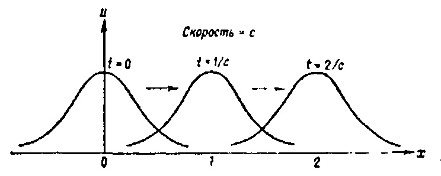

. 17.1. Волна  $ u(x, t) = e^{-(x-ct)^2} $  движется слева направо

произвольной формы, движущихся в прогивоположных направлениях со скоростью c. Например, функции

$$

= \int_{0}^{d} \left[\frac{\partial F}{\partial \overline{y}} \eta\left(x\right) + \frac{\partial F}{\partial \overline{y'}} \eta'\left(x\right)\right] dx = 0.

$$

(волна, Лвижущаяся слева направо),

$$

\frac{d\varphi(e)}{de} \equiv \int_{a}^{b} \left\{ \frac{\partial F}{\partial \overline{y}} - \frac{\partial}{\partial x} \left[ \frac{\partial F}{\partial \overline{y'}} \right] \right\} \, \eta(x) \, dx = 0.

$$

(волна, движущаяся справа налево),

$$

\frac{\partial F}{\partial \overline{y}} - \frac{d}{dx} \left[ \frac{\partial F}{\partial \overline{y'}} \right] = 0

$$

(две волны, движущиеся в противоположных направлениях)

являются типичными решениями волиового уравнения. На рисунке 17.1 изображена простейшая бегущая волна.

ШАГ 4 (Учет начальных условий).

Напомним читателю общий метод решения задачи Коши в теории обыкновенных дифференциальных уравнений. Сначала находят общее решение уравнения, а затем оно подставляется в начальные условия для того, чтобы найти конкретные значения произвольных постоянных. У нас ситуация аналогична. Для решения задачи Коши для волнового уравнения мы подставим общее решение

$$

\frac{\partial F}{\partial y} - \frac{d}{dx} \left[ \frac{\partial F}{\partial y'} \right] = 0

$$

(содержащее две произвольные функции) в начальные условия

$$

J[y] = \int_{0}^{1} [y^{2} + y'^{2}] dx.

$$

$ u_1(x, 0) = g(x), $ чтобы найти конкретные выражения для произвольных функций ф и ф. После подстановки получаем

(17.5)

$$

F_y - \frac{d}{dx} F_{y'} = 0,

$$

Если теперь проинтегрировать второе уравнение (17.5), то получится алгебранческая система двух уравнений относительно неизвестных функций  $ \varphi(x) $  и  $ \psi(x) $ . В самом деле, после интегрирования в пределах от  $ x_0 $  до x получаем

(17.6)

$$

\begin{aligned} F_y &= 2y, \ F_{y'} &= 2y'. \end{aligned}

$$

Решаем теперь уравнение (17.6) совместно с первым уравнением (17.5) и получаем следующие выражения для функций  $ \varphi(x) $  и  $ \psi(x) $ :

(17.7)

$$

2y - \frac{d}{dx}(2y') = 0,

$$ y'' - y = 0.
$$

Отже, загальне розв'язання задачі (17.1) задається формулою

(17.8)

$$ \overline{y}(x) = 0.42e^x - 0.42e^{-x}
$$

Мета досягнута. Ми отримали загальне розв'язання Вадачі (17.1). Розв'язок у вигляді (17.8) зазвичай називають формулою д'Аламбера. Читача запрошують самостійно слідкувати за розташуванням меж інтегрування, щоб переконатися, що вони змінюються з x-ct на x+ct. Проблема повністю вирішена.

Перед завершенням лекції ми наведемо кілька прикладів, які показують, як застосовувати формулу д'Аламбера до конкретних валахів.

# Приклади застосувань формули д'Аламбера

# 1. Рух синузондалних хвиль

Рассмотрим начальные условия вида

$$ J[y] = \int_a^b y \sqrt{1 + y'^2} \, dx,
$$ $ u_1(x, 0) = 0. $ По формуле Даламбера получаем решение

$$ \overline{y}(x) = \alpha \operatorname{ch}[(x-\beta)/\alpha],
$$

Її можна інтерпретувати так. Початкове переміщення струни $ u(x, 0) = \sin x $ поділяється на дві однакові частини

$$ \overline{y}(x) = 0.42e^x - 0.42e^{-x}
$$

H $ \frac{\sin x}{2} $ .

Кожна з частин поширюється зі швидкістю c у вигляді хвиль, що рухаються. Одна з хвиль рухається зліва направо, а інша — у протилежному напрямку. Читача запрошують замислитися, як виглядає отримана хвиля у цьому випадку.

# 2. Распространение простейшего прямоугольного импульса

В этом случае начальные условия задаются следующим образом:

$$ J[y] = \int_{0}^{1} [y^{2} + y'^{2}] dx.
$$ $ u_t(x, 0) = 0 $ (в остальных точках).

Оскільки початкове зміщення розділяється на дві півхвилі, що рухаються в протилежних напрямках, отриманий рух буде таким, як показано на рис. 17.2.

Фіг. 17.2. Початкове збурення розділяється на дві хвилі, що рухаються.

# 3. Задана начальная скорость

Тепер припустимо, що в початковий момент струна перебуває в рівноваговій позиції. Надамо струні початкову швидкість (як у фортепіано) форми $ \sin x $ , тобто

$$ \int\limits_{t_1}^{t_2}
$$

J\left[u\right] = \iint\limits_{D} F\left(x,\ y,\ u,\ u_{x},\ u_{y}\right) \, dx \, dy.

$$

Решение находим по формуле Даламбера

$$

F_{u} - \frac{\partial}{\partial x} F_{ux} - \frac{\partial}{\partial y} F_{uy} = 0.

$$

Оно представляет сумму двух бегущих косинусоидальных воли. Читатель должен спросить себя, кажется ли ему это решение разумным.

На этом лекция 17 заканчивается. В следующей лекции мы покажем, как формула Даламбера помогает дать интерпретацию в плоскости переменных x и t.
# ЗАУВАЖЕННЯ - 1. Общее решение уравнения с частными производными второго порядка содержит две произвольные функции, а общее решение обыкновенного дифференциального уравнения содержит две произвольные постоянные. Значит, у уравнения с частными производными больше решений, чем у обыкновенного дифференциального уравнения.
- 2 Замена переменных для приведения уравнения с частными производными к более простому виду является одним из общих методов теории. Новые координаты (ξ, η) принято называть каноническими координатами. Мы будем обращаться к ним и в дальнейшем, особенно при изучении гиперболических уравнений.
- 3 Метод нахождения общего решения уравнения с частными производными и подстановки этого решения в начальные условия не является общим методом решения уравнений с частными производными. Решение, которое рассматривается в данной лекции,— единственный пример использования этого метода. Обычно невозможно найти общее решение уравнения с частными производными, но даже если удается это сделать, оказывается очень сложным подставить это решение в краевые условия.

# ЗАДАЧН

1. Проверьте, что решение Даламбера (17-8) удовлетворяет начальным условиям задачи (17.1).

2. Подставьте (17.7) в общее решение  $ u(x, t) = \psi(x - ct) + \psi(x + \epsilon t) $  и получите формулу Даламбера.

3. Найдите решение задачи Коши:

$$

J[y] = \int_{0}^{1} \sqrt{1 + y'^{2}} dx.

$$

Как выглядит это решение в различные моменты времени? 4. Найдите решение задачи Коши:

(УЧП)

$$

\int_{t_{1}}^{t_{2}} [KE - PE] dt = \frac{1}{2} \int_{t_{1}}^{t_{2}} [m\dot{y}^{2} - ky^{2}] dt

$$

(НУ)

$$

J[y] = \int_{0}^{\pi/2} [y'^{2} - y^{2}] dx

$$

Постройте график решения в различные моменты времени. 5. Решая совместно уравнения (17.6) и первое уравнение из (17.5),

получите формулы (17.7).

# ФОРМУЛА ДАЛАМБЕРА (ПРОДОЛЖЕНИЕ)

ЦЕЛЬ ЛЕКЦИИ! Показать, как с помощью формулы Даламбера можно найти решение волнового уравнения на полуограниченной прямой

(УЧП)

$$

J[u] = \iint_D F[x, y, u, u_x, u_y) \, dx \, dy,

$$

(ГУ)  $ u(0, t) = 0, \quad 0 < t < \infty, $ 
(НУ)

$$

F_{u} - \frac{\partial}{\partial x} F_{uv} - \frac{\partial}{\partial y} F_{uv} = 0.

$$

Дополнительно дается интерпретация формулы Даламбера в координатной плоскости x, t.

На прошлой лекции было показано, что если заданы начальное смещение струны u(x, 0) = f(x) и начальная скорость  $ u_t(x, 0) = g(x) $ , то выражение

(18.i)

$$

u_{xx} + u_{yy} = f

$$

описывает смещение струны в произвольный момент времени. В этой лекции мы познакомим читателя с одной интересной интерпретацией этой формулы в плоскости переменных x и t (пространственновременная или фазовая плоскость) и покажем, как изменить формулу Даламбера, чтобы получить решение задачи о колебаниях полубесконечной струны.

Начнем с интерпретации формулы (18.1) в плоскости переменных x и t.

# Пространственно-временная интерпретация формулы Даламбера

На предыдущей лекции мы показали, что решение задачи Коши

(18.2)

$$

J[u] = \iint_{D} [u_{x}^{2} + u_{y}^{2} + 2uf] dx dy.

$$ J[u] = \int_{0}^{1} \int_{0}^{1} \left[ u_{1}^{2} + u_{y}^{2} \right] dx dy
$$

u(x, t) = \frac{1}{2} [f(x-ct) + f(x+ct)] + \frac{1}{2c} \int_{x-ct}^{x+ct} g(\xi) d\xi.

$$ u_{xx} + u_{yy} = 0
$$

u(x, 0) = f(x),

$$ u_{xx} + u_{yy} = 0
$$

u(x, t) = \frac{1}{2} [f(x-ct) + f(x+ct)].

$$ J[u] = \int_{0}^{1} \int_{0}^{1} \left[ u_{x}^{2} + u_{y}^{2} \right] dx dy
$$

x-ct=x_0-ct_0

$$

(PPP)

$$

(Y \text{ ЧП}) \qquad u_{tt} = c^2 u_{xx}, \quad -\infty < x < \infty, \quad 0 < t < \infty,

$$ J[u] = \iint_{D} [u] + u_{\eta} + 2uf ] dx dy.
$$

(HY) \qquad

$$ u_{xx} + u_{yy} = f
$$

J[u] = \int_{0}^{1} \int_{0}^{1} [u' + u' + 2uf] dx dy,

$$ J[u] = \int_{0}^{1} \int_{0}^{1} \left[ u_{x}^{2} + u_{y}^{2} + 2uf \right] dx dy,
$$

Фіг. 18.2 Розв'язок зображено на площині змінних x, t, а не u, x, як у попередній лекції.

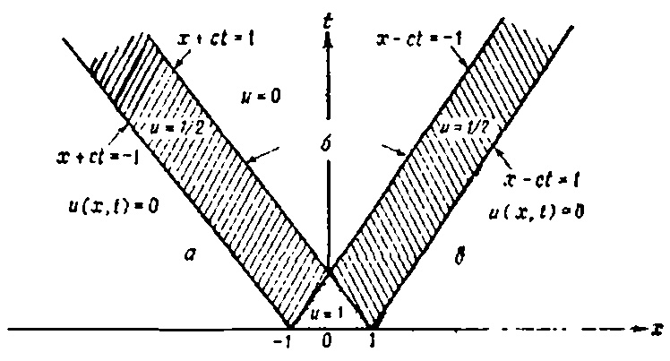

Фіг. 18.2. Розв'язок задачі Коші (18.2) у xt-площині a — це передній край хвилі, що рухається вліво; b — це задній край хвилі; b — це передній край хвилі, що рухається вправо

Тепер інтерпретуємо формулу д'Аламбера, де початкове зміщення дорівнює нулю, а початкова швидкість довільна.

СЛУЧАЙ 2 (Начальное смещение равно нулю, начальная скорость произвольна).

Рассмотрим начальные условия вида

$$ u_n(x, y) = a_1 \varphi_1(x, y) + a_2 \varphi_2(x, y) + \ldots + a_n \varphi_n(x, y),
$$ $ u_t(x, 0) = g(x). $ Решение в этом случае имеет вид

$$ \varphi_1(x, y) = xy(1-x)(1-y)
$$

Значення значення значення U в точці $ (x_{\mathrm{ }e},\ t_{\mathrm{ }e}) $ можна інтерпретувати як інтеграл початкової швидкості від $ x_{\mathrm{ }e}-ct_{\mathrm{ }e} $ до P і C

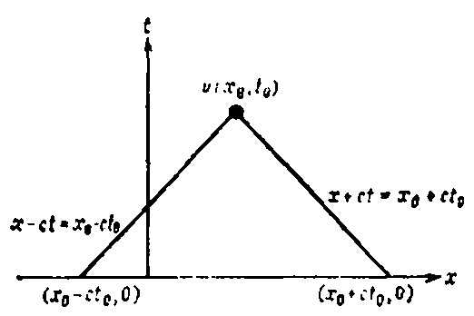

. 18.3. Интерпретация задачи с начальной скоростью в x1-плоскости. $ x_{\bullet}+ct_{\bullet} $ (рис. 18.3). Наприклад, рис. 18.4 надає графічне тлумачення розв'язку задачі

(13.4)

$$ u_{1}(x, y) = a_{1}xy(1-x)(1-y),
$$

u_{3}(x, y) = xy(1-x)(1-y)[a_{1} + a_{2}x + a_{3}y],

$$ \vdots

$$

u(x, t) = \frac{1}{2c} \int_{x-ct}^{x+ct} g(\xi) d\xi =

$$ J[u_n] = \int_0^1 \int_0^1 \left\{ \left[ \sum_{j=1}^n a_j \frac{\partial \varphi_j}{\partial x} \right]^2 + \left[ \sum_{j=1}^n a_j \frac{\partial \varphi_j}{\partial y} \right]^2 + 2f \sum_{j=1}^n a_j \varphi_j \right\} dx dy
$$

= \frac{1}{2c} \int_{x-ct}^{x+ct} 0 d\xi, \quad (x, t) \in \text{ области 1,}

$$ \frac{\partial J\left[u_{n}\right]}{\partial a_{1}} = 2 \int_{0}^{1} \int_{0}^{1} \left\{ \sum_{j=1}^{n} \left[ \frac{\partial \varphi_{j}}{\partial x} \frac{\partial \varphi_{j}}{\partial x} + \frac{\partial \varphi_{j}}{\partial y} \frac{\partial \varphi_{1}}{\partial y} \frac{\partial \}{\partial y} \right] a_{j} + f \varphi_{1} \right\} dx dy = 0,
$$

= \frac{1}{2c} \int_{x-ct}^{x+ct} d\xi, \quad (x, t) \in \text{ области 2,}

$$ Все это представляется изрядно сложным, но если переписать все эти уравнения в матричной форме, то получится система линейных уравнений

$$

= \frac{1}{2c} \int_{x-ct}^{-1} d\xi, \quad (x, t) \in \text{ области 3,}

$$ где  $A = (A_{IJ})$  матрица размером  $n \times n$ , элементы которой вычисляются по формулам

(45.3) 
$$

= \frac{1}{2c} \int_{x-ct}^{1} d\xi, \quad (x, t) \in \text{ области 4,}

$$ $b = (b_t)$  — вектор с компонентами

$$

= \frac{1}{2c} \int_{x-ct}^{x+ct} 0 d\xi, \quad (x, t) \in \text{ области 5,}

$$ а  $a=(a_i)$ — неизвестный вектор, компоненты которого являются коэффициентами в приближенном решении  $a_n(x,y)=a_1\varphi_1(x,y)+a_2\varphi_2(x,y)+\ldots+a_n\varphi_n(x,y)$ .

ШАГ 3. Решаем линейную систему Aa = b относительно коэффициентов  $a_1, a_2, \ldots, a_n$  и получаем приближенную минимизирующую функцию

$$

= \frac{1}{2c} \int_{x-ct}^{x+ct} d\xi, \quad (x, t) \in \text{ области 6.}

$$ а эначит, и приближенное решение задачи Дирихле.
# ЗАУВАЖЕННЯ
1. В этой лекции методом Ритца минимизировался функционал, вависящий от функции двух переменных. Точно так же можно минимизировать функционалы вида

$$

y(0) = 0, \quad y(1) = 1.

$$

\begin{array}{lll} (\text{Y}4\Pi) & u_{tt} = c^2 u_{xx}, & 0 < x < \infty, & 0 < t < \infty, \\ (\Gamma \text{Y}) & u(0, t) = 0, & 0 < t < \infty, \\ (\text{H}\text{Y}) & \begin{cases} u(x, 0) = f(x), \\ u_t(x, 0) = g(x). \end{cases} & 0 < x < \infty, \\ \end{array}

$$

\varphi_i(0) = 0,

$$ J[u] = \int_{0}^{1} \int_{0}^{1} [u^{2} + u^{2}_{y}] dx dy,
$$

# Розв'язання задачі для напівнескінченного рядка за допомогою формули д'Аламбера

Наше завдання — знайти хвильові рухи напівнескінченної струни, лівий кінець якої фіксований, за заданих початкових умов. Для розв'язання задачі (18.6) ми використаємо той самий метод, що й у пошуку загального розв'язку хвильового рівняння на всій лінії. Заміна загального розв'язку

$$ u_{xx} + u_{yy} = 1
$$

в начальные условия, находим (как в предыд, щей лекции)

(18.7)

$$ J[y] = \int_{0}^{1} [y^{2} + {y'}^{2}] dx, \ y(0) = 0, \ y(1) = 1,
$$

z(x) = (1 - x) y(x),

$$

"Теперь перед нами проблема, которой не было в задаче о бесконечной струне. Решение  $ u\left(x,\t\right) $  должно быть определено всюду только внутри первого квадранта  $ (x>0,\,t>0) $  плоскости переменных x и t. Значит, мы должны уметь вычислить функции

$$

u_{xx} + u_{yy} = 0

$$

при всех  $ -\infty < x-ct < \infty $ ,  $ \psi(x+ct) $  при всех  $ 0 < x+ct < \infty $ .

К сожалению, первая из формул (18.7) позволяет вычислять  $ \varphi(x-ct) $  только при  $ x-ct\geqslant 0 $ , поскольку в начальных данных функции f(x) и g(x) определены только для положительных значений аргумента.

Если  $ x-ct \geqslant 0 $ , то после подстановки (18.7) в общее решение

$$

J[u] = \int_{0}^{1} \int_{0}^{1} [u_{x}^{2} + u_{y}^{2}] dx dx.

$$

получаем

$$

u_{xx} + u_{yy} = \sin(\pi x)

$$ u(x, y) = \left[Ae^{\pi y} + Be^{-\pi y} - \frac{1}{n^2}\right] \sin(\pi x),
$$

\begin{split} u\left(x,\,t\right) &= \phi\left(x-ct\right) + \psi\left(x+ct\right) = \\ &= \frac{1}{2} \left[ f\left(x-ct\right) + f\left(x+ct\right) \right] + \frac{1}{2c} \int\limits_{x-ct}^{x+ct} g\left(\xi\right) \, d\xi. \end{split}

$$

\Дельта u + u^2 = 0

$$

\Delta u = 0

$$

Что же делать, если x < ct? Пришла пора воспользоваться граничным условием u(0,t)=0. С помощью этого граничного условия мы доопределяем функцию  $ \varphi(x-ct) $  при x < ct. Для этого подставим общее решение  $ u(x,t)=\varphi(x-ct)+\psi(x+ct) $  в граничное условие u(0,t)=0. В результате получим  $ \varphi(-ct)=-\psi(ct) $ ,

откуда

$$

\Delta u = 0

$$

Подстановка этого выражения для ф в общее решение дает

$$

\Delta u + \varepsilon u^2 = 0

$$

Комбинируя решения для x < ct и x > ct, окончательно получаем (см. рис. 18.6)

$$

\Дельта u + u^2 = 0

$$ \Delta u = 0 \rightarrow \Delta u + \varepsilon u^2 = 0 \rightarrow \Delta u + u^2 = 0
$$

\begin{cases} \frac{1}{2} \left[ f(x - ct) + f(x + ct) \right] + \frac{1}{2c} \int_{x - ct}^{x + ct} g(\xi) d\xi, & x \ge ct, \\ \frac{1}{2} \left[ f(x + ct) - f(ct - x) \right] + \frac{1}{2c} \int_{ct - x}^{x + ct} g(\xi) d\xi, & x < ct. \end{cases}

$$ u_0 \rightarrow u = \sum_{k=0}^{\infty} \varepsilon^k u_k \rightarrow u = \sum_{k=0}^{\infty} u_k
$$

\Delta u + cu^2 = 0,

$$

Этим завершается наша лекция. Интерпретация решения (18.8) будет приведена в замечаниях.

Рис. 18.6. Интерпретация задачи Коши для полуограниченной струны в xt-плоскости a—возмущение отражается от границы;  $ \delta $ —возмущение распространяется вдоль характеристики из точки ( $ x_0+ct_0 $ , 0).
# ЗАУВАЖЕННЯ
1. Решение (18.8) полностью соогветствует нашим представлениям о полубесконечной струне с граничным условием u(0, t) = 0. При  $ x \geqslant ct $  оно совпадает с формулой Даламбера для бесконечной струны. Если x < ct, то формула модифицируется таким образом, что в нее включается волна, отраженная от границы (при отражении знак волны меняется на противоположный).

2. Если граничное условие u(0, t) = 0 изменить на другое, то и решение (18.8), естественно, изменится. Можно получить в явном виде решения для граничных условий

$$

\Delta u + \varepsilon u^2 = 0

$$

или

$$

(46.1) u = u_0 + \varepsilon u_1 + \varepsilon^2 u_2 + \dots,

$$

Дополнительную информацию по этим вопросам читатель может найти в литературе, указанной в конце книги.

3. Прямые линии

$$

\Дельта u + u^2 = 0

$$

$ x - ct = \text{const} $ называются характеристиками. Возмущение распространяется вдоль характеристик. Понятие характеристики тесно связано с уравнениями гиперболического типа.
# ЗАДАЧІ
1. Решите смещанную задачу для полубесконечной струны

$$

\Delta u + u^2 = 0,

$$ \Delta u = 0, \quad 0 < r < 1, \quad 0 \le \theta < 2\pi,
$$

Постройте графики решения для разл чных моментов времени.

2. Щоб розв'язати попередню задачу, можна використати наступний алгоритм:

 а) продолжить начальные условия на всю действительную ось по формулам

$$ имеет только вулевое решение. - Прим. ред.

2) Здесь и ниже речь идет об отыскании одного из решений (второе таким методом не находится).— Прим ред.

3) Эта «ракета», во-первых, не при всех граничных условиях долетает до є=1 (где при опредсленных вещественных граничных условиях открывается мир комплексных решений) и, во-вторых, ни при каких в не долетает до второго вещественного решения, когда оно существует.— Прим. ред.

ции  $u_0$ ,  $u_1$ ,  $u_2$ , ..., входящие в степенной ряд (46.1). В оставшейся части лекции мы покажем, как этим методом можно решить различные краевые задачи.

# Решение нелинейного уравнения $\Delta u + u^2 = 0$ методом возмущений

Предположим, что нам нужно решить следующую нелинейную задачу Дирихле:

(46.2) 
$$ $ u_t(x, 0) = 0, -\infty < x < 0. $ b) середнє дві хвилі, що рухаються вліво і вправо (як це було в попередній лекції);

**в**) рассмотреть полученное решение при $ x \ge 0 $ .

Використовуючи цей алгоритм, побудуйте розв'язок для різних помножених на t, якщо початкова умова задана графічно.

3. Розв'язати змішану задачу для напівнескінченної струни

$$

Розглянемо цю нелінійну задачу як збурену лінійну задачу:

(46.3)

$$

Розв'язок якої $u_0(r, \theta) = r \cos \theta$ відомий. Як змінити $u_0(r, \theta)$ , щоб отримати рішення проблеми (46.2)? Як уже згадувалося, розглянемо клас задач $\Delta u + \epsilon u^2 = 0$ з граничними умовами і шукаємо розв'язок кожної задачі з цього класу у вигляді

(46.4)

$$

Воспользуйтесь методом, аналогичным рассмотренному в лекции. Дайте физическую интерпретацию этой задачи.

4. Предположим, что колебания струны описываются уравнением  $ u_{tt} = u_{xx} $ , начальное смещение изображено на рисунке, а начальная скорость равна нулю. Изобразите решение этой задачи в xt-плоскости. Обратите внимание на то, что начальные условия в этой задаче разрывны.

# ВОЛНОВОЕ УРАВНЕНИЕ И ГРАНИЧНЫЕ УСЛОВИЯ МЕТА ЛЕКЦІЇ: Познакомыть читателя с основными типами граничных условий для волнового уравнения

$$

Потім знаходимо розв'язок задачі (46.2), поклавши $\varepsilon = 1^{\circ}$ ).

Вираз (46.4), який претендує на розв'язок, буде замінений на обурену проблему

(PPP)

$$

на конечном отрезке.

В дальнейшем будут рассматриваться три основных типа граничных условий.

1. Заданный режим (граничные условия 1-го рода)

$$, 
(GI) $u(1, \theta) = \cos \theta$ .

У результаті ми отримуємо

$$

$ u(L, t) = g_2(t). $ 2. Заданные силы (граничные условия 2-го рода)

$$

u_0 (1, \theta) + \varepsilon u_1 (1, \theta) + \varepsilon^2 u_2 (1, \theta) + \ldots = \cos \theta.

$$

$ u_x(L, t) = g_2(t). $ 3. Упругое закрепление (граничные условия 3-го рода)

$$

P_{0}

$$

$ u_x(L, t) - \gamma_2 u(L, t) = g_2(t). $ Могут встречаться и произвольные комбинации этих трех типоз граничных условий. В лекции будет показан физический смысл этих граничных условий.

Итак, пока что мы рассмотрели единственный вид волнового движения—поперечные колебания струны. Читатель должен понимать, что это только один из видов волновых движений.

Ниже приведен перечень основных типов волн:

- 1. Звуковые волны (продольные волны).
- 2. Электромагнитные волны, в том числе световые.
- 3. Колебания твердых тел (продольные, поперечные и крутильные).
- 4. Волны вероятности в квантовой механике.
- 5. Волны на воде (поперечные волны).
- 6. Колебания струны (поперечные волны).

Цель нашей лекции — обсудить различные типы граничных условий, которые возникают при решении физических задач волнового характера. Мы остановимся только на одномерных задачах и линейных граничных условиях. Обычно различают граничные условия трех типов

1. Заданные режимы в граничных точках (граничные условия 1-го рода)

$$

\qquad u_{\theta}(r, \theta) = r \cos \theta,

$$

$ u(L, t) = g_2(t). $ 2. Заданные силы в граничных точках (граничные условия 2-го рода)

$$

\begin{cases} \Delta u_{1} = -u_{0}^{2}, \\ u_{1}(1, \theta) = 0, \\ u_{2}(1, \theta). \end{cases}

$$

$ u_x(L, t) = g_2(t). $ 3. Упругое закрепление в граничных точках (граничные условия 3-го рода)

$$

\begin{cases} \Delta u_{2} = -2u_{0}u_{1}, \\ u_{2}(1, \theta). \end{cases}

$$

$ u_x(L, t) - \gamma_2 u(L, t) = g_2(t). $ Мы начнем с граничных условий 1-го рода.

1. Заданные режимы в граничных точках.

Нам предстоит решить задачу вида

(19.1)

$$

P_{1}

$$ Щоб розв'язати *неоднорідне рівняння*, ми також звернемося до методу, який використовувався в теорії звичайних диференціальних рівнянь і складається з наступного:

- 1) знайти загальний розв'язок $y_n$ однорідного рівняння;
- 2) знайти часткове розв'язок $y_p$ гетерогенного рівняння;
- 3) Підставити $y_h + y_p$ у початкову умову та визначити константи.

Ми використаємо цей метод для розв'язання нашої проблеми. У нашій задачі $P_1$ загальний розв'язок однорідного рівняння $\Delta u=0$ має вигляд із розділеними змінними

$$

\begin{aligned} u_{tt} &= c^2 u_{xx}, & 0 < x < 1, & 0 < t < \infty, \\ u(0, t) &= g_1(t), & 0 < t < \infty, \\ u(1, t) &= g_2(t), & 0 < t < \infty, \\ (HY) &\begin{cases} u(x, 0) &= f(x), \\ u_t(x, 0) &= g(x), \end{cases} & 0 \leqslant x \leqslant 1, \end{aligned}

$$

Часткове (лише одне) розв'язок неоднорідного рівняння

$$

Ми розглядаємо у формі

$$

u_x(0, t) = 0, \quad u_x(L, t) = 0.

$$

Правильні частини форми $r^n$ , $r^n \cos{(n\theta)}$ , $r^n \sin{(n\theta)}$ ведуть до рішень $Ar^{n+2}$ , $Br^{n+2} \cos{(n\theta)}$ $Cr^{n+2} \sin{(n\theta)}$ відповідно.

Підставляючи функції $u_p(r, \theta)$ у гетерогенне рівняння, отримуємо A = -1/32, B = -1/24.

Отже,

$$

u_{x}(1, t) = \frac{1}{k} v(t) - (k - \text{модуль Юнга}).

$$

Щоб розв'язати задачу, $P_1$ має зробити останній крок — підставити загальне розв'язання $u(r, \theta) = u_h(r, \theta) + u_p(r, \theta)$ на граничні умови $u(1, \theta) = 0$ і знайти коефіцієнти $a_n$ і $b_n$ .

Після цього ми отримуємо

$$

u_{x}(0, t) = \frac{h}{T} u(0, t),

$$

Отже, $a_0=1/32$ , $a_2=1/24$ , і всі інші $a_n$ і $b_n$ дорівнюють нулю. Отже, рішення проблеми $P_1$ знайдено:

$$

u_{x}(L, t) = -\frac{h}{T} u(L, t).

$$

Функція $u_1(r, \theta)$ називається пертурбацією першого порядку до $u_4(r, \theta)$ . Додавши $u_0$ і $u_1$ , отримуємо новий підхід до розв'язання задачі (46.2):

(46.5)

$$

u_{x}(0, t) - \frac{h}{T}u(0, t) = 0,

$$

Щоб знайти збурення наступного порядку $u_{z}(r, \theta)$ , потрібно розв'язати задачу

$$

u_{x}(L, t) + \frac{h}{T}u(L, t) = 0.

$$ $\begin{cases} \Delta u_{1} = -2u_{0}u_{1}, \\ u_{2}(1, \theta) = 0, \end{cases}$ де $u_{\phi}(r,\theta)$ і $u_{1}(r,0)$ вже відомі, раніше знайдені функції. Звісно, виконувати всі ці алгебраїчні перетворення без допомоги комп'ютера надзвичайно складно. На щастя, вираз (46.5) є майже точним рішенням нашої проблеми. Насправді, якщо підставити цей вираз зліва від $\Delta u + u^{2}$ нашого нелінійного рівняння, отримаємо вираз, який майже всюди відрізняється від нуля в межах кола 0 < r < 1.

Окрім розв'язання нелінійних задач, теорія збурень може використовуватися для розв'язання задач у областях з неправильними межами (звісно, якщо нерегулярність не дуже велика). Давайте розглянемо простий приклад.

# Приклад задачі з порушеною межею

Осквернення можна знищити, не позбавляючи його права. Можна знайти розвиток рівня Лаплас посередині деформованого стовпа, оскільки пробурив рівень Лаплас у центрі круглої області. У застосуванні дозволено знайти потенціал у квадраті за кривою $r=1+\frac{1}{4}\sin\theta$ (за полярними координатами). Нехай потенціал у на межі заданий. Тобто, нам потрібно вирішити проблему

(46.6)

$$ u \left( 1 + \frac{1}{4} \sin \theta, \ \theta \right) = \cos \theta, \quad 0 \le \theta \le 2\pi.$$

\begin{aligned} u_x(0, T) &= \frac{h}{T} [u(0, t) - \theta_1(t)], \\ u_x(L, T) &= -\frac{h}{T} [u(L, t) - \theta_2(t)]. \end{aligned}

$$u\left(1+\frac{1}{4}\sin\theta,\ \theta\right)=\cos\theta$$

u(1+\epsilon\sin\theta, \theta) = \cos\theta, \quad 0 \le \epsilon \le 1/4.

$$

Этим мы завершаем обсуждение наиболее важных граничных условий, связанных с гиперболическими задачами. Следующие несколько лекций мы посвятим решению задач, содержащих полобные граничные условия.
# ЗАУВАЖЕННЯ
1. В лекции не рассматривалось граничное условие еще одного типа, когда струна подвергается действию силы, пропорциональной скорости и направленной в противоположном направ-

лении. Граничное условие такого типа (на левом конце) записывается в виде

$$

f(x+h) = f(x) + f'(x)h + f''(x)\frac{h^2}{2!} + \dots,

$$

2. Нелинейное упругое закрепление левого конца приводит к граничному условию вида

$$

u(1+\varepsilon\sin\theta,\ \theta)=u(1,\ \theta)+u_r(1,\ \theta)(\varepsilon\sin\theta)+u_{rr}(1,\ \theta)\frac{(\varepsilon\sin\theta)^2}{21}+\ldots

$$

где  $ \varphi(u) $  — произвольная функция величины u. Например, граничное условие

$$

\Delta u = 0, \quad 0 < r < 1 + \varepsilon \sin \theta,

$$

говорит о том, что возвращающая сила на левом конце пропорциональна кубу смещения (а не первой степени и, как это будет согласно закону Гука в линейном случае).

3. Если к нижнему концу пружины, совершающей продольные колебания, прикрепить массу *m*, то граничное условие следует задавать в виде

$$

Коли всі розрахунки будуть виконані, ми внесемо $\varepsilon=1/4$ у кінцеві результати. Звісно, здається, що цю задачу не можна легко розв'язати, але її можна звести до послідовності задач, у кожній з яких визначена одна з функцій $u_{\mathrm{ }e}$ , $u_{\mathrm{ }e}$ , ..., що включені у розклад

$$
# ЗАДАЧІ Опираясь на интуитивные представления о граничных условиях различных типов, изобразить в общих чертах решение задачи

$$

Після підстави ряду в (467) отримуємо таку послідовність задач для визначення функцій $u_a$ , $u_1$ , ...;

$$ \begin{cases} \Delta u_{0} = 0, & 0 < r < 1 \text{ (внутри круга),} \\ u_{0}(1, \theta) = \cos \theta, & u_{0}(r, \theta) = r \cos \theta, \end{cases}
$$

\begin{array}{ll} (\mathrm{Y} \, \Pi) & u_{tt} = c^2 u_{xx}, \quad 0 < x < 1, \quad 0 < t < \infty, \\ (\mathrm{\Gamma} \, \mathrm{Y}) & \left\{ \begin{array}{ll} u \, (0, \, t) = 0, \\ u \, (1, \, t) = \sin t, \end{array}

$$ \begin{cases} \Delta u_{1} = 0, & 0 < r < 1 \text{ (внутри круга),} \\ u_{1}(1, \theta) = -\sin \theta \frac{\partial u_{0}(1, \theta)}{\partial r} = -\sin \theta \cos \theta \end{cases}
$$

u = u_0 + \frac{1}{4}u_1 + \left(\frac{1}{4}\right)^2 u_1 + \cdots

$$ u_u + \frac{1}{4} u_t$$

\begin{array}{ll} u \, (x, \, 0) = 0, \\ u_{t} \, (x, \, 0) = 0, \end{array}

$$u_t = (1+x) u_{xx}, \\ u(x, 0) = q(x), \quad -\infty < x < \infty,$$

\right. & 0 \leqslant x \leqslant 1, \end{array}

$$Якщо розглянути рівняння з параметром

(46.11)
$$
u_t = (1 + \varepsilon x) u_{xx},
$$

і шукати його розв'язок у вигляді

$$
u = u_0 + \varepsilon u_1 + \varepsilon^2 u_2 + \cdots,
$$

то після підстановки отримуємо послідовність задач

$$
P_0:\ \begin{cases}
\dfrac{\partial u_0}{\partial t} = \dfrac{\partial^2 u_0}{\partial x^2}, \\
u_0(x,0) = \varphi(x),
\end{cases}
\qquad
P_1:\ \begin{cases}
\dfrac{\partial u_1}{\partial t} - \dfrac{\partial^2 u_1}{\partial x^2} = x\,\dfrac{\partial^2 u_0}{\partial x^2}, \\
u_1(x,0) = 0.
\end{cases}
$$

Зауважимо, що в перших двох задачах коефіцієнти сталі. Параметр $\varepsilon$ має бути достатньо малим, інакше нескінченний ряд може виявитися розбіжним.

#### ЗАДАЧИ

1. Подставьте разложение (46.8) в задачу (46.7) и получите последовательность задач $P_0,\ P_1,\ P_2,\ \dots$.

2. Покажите, что нелинейную задачу

$$
\begin{aligned}
\Delta u + u^2 &= 0, && 0 \leqslant r < 1,\ 0 \leqslant \theta < 2\pi, \\
u(1,\theta) &= \cos\theta, && 0 \leqslant \theta < 2\pi,
\end{aligned}
$$

можно свести к последовательности линейных задач $P_0,\ P_1,\ P_2$.

3. Подставьте приближенное решение (46.5) в нелинейную задачу 2 и оцените его точность.

4. Решите задачу $P_1$ из примера с возмущенной границей и проверьте, насколько хорошо приближенное решение

$$
u(r,\theta) = u_0(r,\theta) + \frac{1}{4}u_1(r,\theta)
$$

удовлетворяет соотношениям

$$
\Delta u = 0,
$$

$$
u\left(1 + \frac{1}{4}\sin\theta,\ \theta\right) = \cos\theta.
$$

# Лекція 47

# РОЗВ'ЯЗАННЯ ДИФЕРЕНЦІАЛЬНИХ РІВНЯНЬ У ПОХІДНИХ ПОХІДНИХ ЗА ДОПОМОГОЮ МЕТОДУ КОНФОРМНИХ ВІДОБРАЖЕНЬ

МЕТА ЛЕКЦІЇ: Показати, як деякі двовимірні граничні задачі можна перетворити на інші, простіші задачі за допомогою конформного відображення. Припустимо, наприклад, що ми хочемо розв'язати рівняння Лапласа

$$

\begin{cases} u(0, t) = 0, \\ u_x(1, t) = -u(1, t), \\ u(x, 0) = x, \\ u_t(x, 0) = 0. \end{cases}

$$

з певною граничною умовою в області комплексної форми (площина змінних x і y). Цю задачу можна перетворити на нову, в якій потрібно знайти розв'язок рівняння Лапласа

$$ у простішій області (площина змінних і і і).

У конформному відображенні рівняння Лапласа $\varphi_{xx}+\varphi_{yy}=0$ у координатній площині (x,y) повертається у рівняння Лапласа $\varphi_{nn}\dashv -\varphi_{vo}=0$ у координатній площині (u,v). Інші рівняння, такі як $\varphi_{xx}+2\varphi_{xy}+\varphi_{yy}=0$ , не мають такої властивості. Після розв'язання рівняння Лапласа $\varphi(u,v)$ у простій області (

наприклад, у колі, напівплощині, квадраті) знайдено, достатньо підставити вирази U=U(X, Y), V=V(X, Y) у цей розв'язок, і ми отримаємо розв'язок нашої задачі $\phi[u(x, y), v(x, y)]$ , вираженого через початкові змінні.

У цій лекції ми розглянемо:

1) про властивості конформних відображень,

2) як їх будувати (для деяких районів),

3) як розв'язувати задачі методом конформних відображень.

Однією з головних труднощів, що виникають при розв'язанні задач меж, є складна форма кордонів. Навіть межі відносно простої форми часто роблять задачу дуже складною для розв'язання. Звісно, можна спробувати розв'язати задачу за допомогою методів теорії збурень, але теорія збурень працює добре лише у випадках, коли межа близька до простої.

Однак існує спосіб розв'язати двовимірне рівняння Лапласа в областях з комплексною межею. Цей метод базується на конформних відображеннях.

Перш ніж почати розв'язувати задачі цим методом, давайте трохи ознайомимося з поняттям конформного відображення та комплексних змінних загалом.

# Комплексні функції та конформні відображення

У цій лекції ми ознайомимося лише з тими поняттями з теорії функцій комплексної змінної, які нам знадобляться пізніше. Представимо комплексне число z = x + iy як точку на площині комплексного xy (рис. 47.1).

Щоб ввести поняття конформного відображення, спершу ознайомимося з поняттям функції комплексної змінної

$$.

Тут z — це комплексна змінна (з деякої області площини z), а w — нова комплексна змінна, яка отримає значення відповідно до формули w = f(z) у новій комплексній площині w.

Наприклад, комплексна функція, визначена в *першому квадранті* комплексної z-площини, $w=z^2$ відображає цю область у всю півплощину v>0 у комплексній площині w.

Таблиця 47 2

| Площина d | $z \longrightarrow z^2$ | Площина S |
|--------------------------|-------------------------|------------------------------------------------------------|
| 0 | | 0 |
| <i>t</i> 1 → <i>t</i> | | -1 (2) |
|  Вісь x Перший квадрант | | Позитивна дійсна піввісь верхньої півплощини |

Таблиця 47.2 показує відповідність, яка встановлюється шляхом відображення $w=z^2$ між деякими точками на площинах z і w.

Рис. 47.1. Площина комплексної змінної $\boldsymbol{z}$ та некольорових формул бігунів Р И С У Н О

К 47.2. Відображення першого квадранта площини ${\bf z}$ у верхню півплощину ${\bf w}$ .

Інакше кажучи, якщо ми говоримо про комплексісні функції змінної w = f(z), то можна розглянути питання, як криві площини z перетворюються на криві в площині

Це питання не ставиться в теорії функцій дійсної змінної, з якою читач уже добре знайомий.

Перш ніж рухатися далі, давайте розглянемо, як $w=z^2$ складне відображення типів у еквівалентній дійсній формі. Дійсна форма показує, як початкові координати (x,y) у площині z перетворюються на нові координати (u,v) у площині w $w=z^2$ .

$$

\begin{cases} u(x, 0) = x, \\ u_t(x, 0) = 0. \end{cases}

$$

І давайте окремо прирівняємо реальні та уявні частини в цьому співвідношенні. У результаті ми отримуємо

$$ \begin{array}{ll} u=x^2-y^2,\\ v=2xy, \end{array}

$$

(действительная форма отображения $w=z^2$ ).

Ця форма нам знадобиться пізніше. У цьому прикладі це цікаво, оскільки показує, як гіперболи в площині z переходять до координатних прямих u = const і v = const у площині w.

Тепер перейдемо до вивчення одного конкретного типу функцій комплексної змінної, які виконують конформні відображення.

# Определение конформного отображения

Відображення w=f(z) комплексної площини z у комплексну площину w називається конформним у точці $z_{\bullet}$ площини z, якщо похідна $f'(z_{\bullet}) \neq 0$ . Відображення f(z) називається конформним у регіоні D, якщо $f'(z) \neq 0$ в кожній точці регіону D.

Наприклад, відображення $f(z) = z^2$ конформно всюди, крім z = 0, оскільки $z'(z) = 2z \neq 0$ для всіх $z \neq 0$ . З іншого боку, відображення $e^z$ конформно по всій площині z, оскільки скрізь $f'(z) = e^z \neq 0$ . Яке призначення конформних відображень? Відповідь полягає в тому, що при розв'язанні рівняння Лапласа $\phi_{xx} + \phi_{yy} = 0$ в межах деякої області площини змінних x і y, ми можемо розглядати цю площину як площину комплексної змінної z. Розглянемо комплексне відображення w = f(z) площини z у площину w, у якій введені координати (u, v). Коли w = f(z $\phi_{xy} + \phi_{uy} = 0$ ) відображається, рівняння Лапласа $\varphi_{xx} + \varphi_{yy} = 0$ перетворюється у нове диференціальне рівняння в похідних похідних, яке залежить від нових координат і v. To — рівняння, яке $\phi_{xx} + \phi_{uu} = 0$ повернеться у рівняння $\varphi_{nn} + \varphi_{nn} = 0$ . Таким чином, ми придумаємо ідею знайти конформне відображення, яке переносить область з комплексною межею у область з простою межею (нагадаємо, що відображення $w=z^*$ переносить межу першого квадранта площини z у фактичну вісь площини w).

Ось кілька прикладів, які покажуть, як можна розв'язати диференціальні рівняння у похідних за допомогою конформних відображень.

Уравнение Лапласа в верхней полуплоскости.

Припустимо, що нам потрібно розв'язати наступну задачу Діріхле у верхній половині видимості (рис. 47.3):

(47.1)

$$

можно найти стандартным методом разделения переменных. При этом оказывается, что решение  $ u\left(x,\,t\right) $ , представленное в виде ряда

$$

Один із способів розв'язання цієї проблеми — застосувати перетворення Фур'є до змінної x, але набагато краще конформно відобразити верхню половину площини у площину (u, v). Читачеві не буде складно побачити, що конформне відображення

$$

является суперпозицией простейших колебаний. Пространственная часть  $ X_n(x) $  каждого элементарного колебания является решением (собственной функцией) некоторой краевой задачи Штурма—Лиувилля.

Итак, мы научились решать волиовое уравнение  $ u_{II}=c^2u_{xx} $  на всей прямой  $ -\infty < x < \infty $ . Формула Даламбера представляет решение в виде суммы двух бегущих волн, распространяющихся в противоположные стороны. Если же рассматривать это же уравнение на ограниченном промежутке 0 < x < L, то бегущих волн уже не станет, так как они будут взаимодействовать с границами. Вместо них возникают другие волны, которые называют стоячими волнами. Посмотрим, например, что случится, если гитарную струну, закрепленную в точках x=0, x=L, привести в движение. Для ответа на этот вопрос нам необходимо решить следующую смешанную задачу гиперболического типа:

$$

Вона має такі властивості (див. RNS. 47.4).

1. Вона відображає верхню півплощину площини z у смуги $-\infty < u < \infty$ , $0 < v < \pi$ , у площині w.

Фіг. 47.3 Проблема граничного значення у верхній половині площі.

- 2. Ребро прямої y=0, -1 < x < 1, у площині z (де потенціал дорівнює 1), переходить у пряму $v=\pi,$ - $\infty < u < \infty$ , у площині w. - 3. Два промені x>1, y=0, і x<-1, y=0, у площині z проходять відповідно у позитивний і негативний

Читач повинен бути впевнений, що може підтвердити ці твердження.

Рис. 47.4. Перетворення складної задачі на легку за допомогою конформного відображення.

Важливість цих властивостей полягає в тому, що вони перетворюють початкову вадаху (47.1) на дуже просту задачу

(47.2)

$$ Розв'язок очевидний: $\varphi(u, v) = \frac{1}{\pi}v$ .

Тепер, щоб знайти розв'язок початкової задачі, потрібно пояснити v через x і y і підставити цей вираз на $q(u,v)=v'\pi$ . Після цього ми отримуємо

$$

Виявляється, що в цьому випадку хвилі, що рухаються, відбиваються від меж так, що отримані коливання стають непоширюючими, а зберігають форму в одному положенні, тобто Ф і

г. 20.1. Три типові стоячі хвилі: X(x) T(t).

Декілька прикладів стоячих хвиль показано на рис. 20.1. Якщо профілі цих стоячих хвиль відомі $ X_n(x) $ і природа коливань кожної хвилі $ T_n(t) $ , то розв'язок проблеми коливань гітарних струн є суперпозицією найпростіших коливань $ X_n(x)\,T_n(t) $ і

сывается в виде

$$ = \ln\left[\frac{z-1}{z+1}\right] + i \arg\left[\frac{z-1}{z+1}\right]$$

Залишилося лише обрати шанси $ c_n $ так, щоб при t = 0 початкові умови $ u\left(x,\ 0\right)=f\left(x\right) $ і $ u_t\left(x,\ 0\right)=g\left(x\right) $ були виконані.

Задачу о колебаниях гитарной струны мы решим методом разделения переменных.

# Розв'язання проблеми коливань обмеженої струни методом розділення змінних

Чтобы решить смешанную задачу

(УЧП)

$$v = \arg\left[\frac{z-1}{z+1}\right] = \arg\left[\frac{x+iy-1}{x+1+iy}\right] =$$

= \arg\left[\frac{2y}{x^2+y^2-1}\right]

$$ \varphi(x, y) = \frac{1}{\pi} \arctan\left[\frac{2y}{x^2 + y^2 - 1}\right].$$

\begin{cases} u(0, t) = 0, \\ u(L, t) = 0, \end{cases}

$$x^{2} + y^{2} = 1,$$

якщо потенціал на внутрішньому колі дорівнює одинці, а на зовнішньому колі дорівнює двом (рис. 47.5). Іншими словами, нам потрібно розв'язати проблему

(47.3)

$$ Проблема полягає в тому, щоб знайти конформне відображення, яке перетворює цю область на щось простіше, де нашу проблему легко розв'язати. У цьому випадку очевидно, що ця проста ділянка має бути кільцем. Відповідна експозиція Р И С У Н О

К 47.5. Конформне відображення на кільце.

Це вже не так очевидно, але існують довідники, де можна знайти дисплей із вказаними властивостями. Одним із найзагальних є «Довідник конформних відображень»

G. Kober 1), яка містить сотні конформних відображень між різними регіонами. Якщо читач витратить трохи часу і краще ознайомиться з конформними таблицями відображення, він знайде відповідне конформне відображення для задачі (47.3). У нашому конкретному випадку це буде образ виду

(47.4)

$$

де s=-0,146, а t=-6,85. У своїй еквівалентній дійсній формі це буде

(47.5)

$$

\begin{cases} u(x, 0) = f(x), \\ u_t(x, 0) = g(x), \end{cases}

$$

v = \gamma [y(x-t)],

$$ \gamma = 2t/[(x-t)^2 + y^2].$$

найдем сначала стоячне волны, т. е. решения вида

$$ \begin{aligned} \varphi_{uu} + \varphi_{vv} &= 0, & \text{в кольче,} \\ (\Gamma Y) & & & & & & & \\ (\Gamma Y) & & & & & & \\ (\Gamma Y) & & & & & \\ & & & & & \\ (\Gamma Y) & & & & & \\ & & & & \\ & & & & \\ & & & & \\ & & & & \\ & & & \\ & & & \\ & & & \\ & & & \\ & & & \\ & & & \\ & & \\ & & \\ & & \\ & & \\ & & \\ & & \\ & & \\ & & \\ & & \\ & & \\ & & \\ & & \\ & & \\ & & \\ & & \\ & & \\ & & \\ & & \\ & & \\ & & \\ & & \\ & & \\ & & \\ & & \\ & & \\ & & \\ & & \\ & & \\ & & \\ & & \\ & & \\ & & \\ & & \\ & & \\ & & \\ & & \\ & & \\ & & \\ & & \\ & & \\ & & \\ & & \\ & & \\ & & \\ & & \\ & & \\ & & \\ & & \\ & & \\ & & \\ & & \\ & & \\ & & \\ & & \\ & & \\ & & \\ & & \\ & & \\ & & \\ & & \\ & & \\ & & \\ & & \\ & & \\ & & \\ & & \\ & & \\ & & \\ & & \\ & & \\ & & \\ & & \\ & & \\ & & \\ & & \\ & & \\ & & \\ & & \\ & & \\ & & \\ & & \\ & & \\ & & \\ & & \\ & & \\ & & \\ & & \\ & & \\ & & \\ & & \\ & & \\ & & \\ & & \\ & & \\ & & \\ & & \\ & & \\ & & \\ & & \\ & & \\ & & \\ & & \\ & & \\ & & \\ & & \\ & & \\ & & \\ & & \\ & & \\ & & \\ & & \\ & & \\ & & \\ & & \\ & & \\ & & \\ & & \\ & & \\ & & \\ & & \\ & & \\ & & \\ & & \\ & & \\ & & \\ & & \\ & & \\ & & \\ & & \\ & & \\ & & \\ & & \\ & & \\ & & \\ & & \\ & & \\ & & \\ & & \\ & & \\ & & \\ & & \\ & & \\ & & \\ & & \\ & & \\ & & \\ & & \\ & & \\ & & \\ & & \\ & & \\ & & \\ & & \\ & & \\ & & \\ & & \\ & & \\ & & \\ & & \\ & & \\ & & \\ & & \\ & & \\ & & \\ & & \\ & & \\ & & \\ & & \\ & & \\ & & \\ & & \\ & & \\ & & \\ & & \\ & & \\ & & \\ & & \\ & & \\ & & \\ & & \\ & & \\ & & \\ & & \\ & & \\ & & \\ & & \\ & & \\ & & \\ & & \\ & & \\ & & \\ & & \\ & & \\ & & \\ & & \\ & & \\ & & \\ & & \\ & & \\ & & \\ & & \\ & & \\ & & \\ & & \\ & & \\ & & \\ & & \\ & & \\ & & \\ & & \\ & & \\ & & \\ & & \\ & & \\ & & \\ & & \\ & & \\ & & \\ & & \\ & & \\ & & \\ & & \\ & & \\ & & \\ & & \\ & & \\ & & \\ & & \\ & & \\ & & \\ & & \\ & & \\ & & \\ & & \\ & & \\ & & \\ & & \\ & & \\ & & \\ & & \\ & & \\ & & \\ & & \\ & & \\ & & \\ & & \\ & & \\ & & \\ & & \\ & & \\ & & \\ & & \\ & & \\ & & \\ & & \\ & & \\ & & \\ & & \\ & & \\ & & \\ & & \\ & & \\ & & \\ & & \\ & & \\ & & \\ & & \\ & & \\ & & \\ & & \\ & & \\ & & \\ & & \\ & & \\ & & \\ & & \\ & & \\ & & \\ & & \\ & & \\ & & \\ & & \\ & & \\ & & \\ & & \\ & & \\ & & \\ & & \\ & & \\ & & \\ & & \\ & & \\ & & \\ & & \\ & & \\ & & \\ & & \\ & & \\ & & \\ & & \\ & & \\ & & \\ & &$$

Підставляючи цей вираз у рівняння (20.1) і ділячи змінні, отримуємо дві звичайні диференціальні рівняння

$$\varphi(r) = a \ln r + b, \quad r = u^2 + v^2.$$

\varphi(u, v) = 0.57 \ln(u^2 + v^2) + 1

$$

где константа  $ \lambda $  — пока что любое действительное число —  $ \infty < \lambda < \infty $  .

Результаты исследования решений этих двух уравнений при различных значениях  $ \lambda $  приведены на рис 20.2.

Теперь мы должны *опбросить* те решения, которые либо неограничены при  $ t \to \infty $ , либо становятся тождественно равными нулю, если потребовать выполнения граничных условий u(0, t) = u(L, t) = 0.

В качестве упражнения читателю предлагается проверить, что нетривиальные и ограниченные решения можно получить только при отрицательных значениях параметра  $ \lambda $ . Таким образом, наша задача— найти такие значения констант A, B, C, D и отрица-

тельной константы  $ \lambda = -\beta^2 $ , чтобы выражение

(20.2)

$$

\varphi(x, y) = 0.57 \ln(u^2 + v^2) + 1,

$$

удовлетворяло граничным условиям. Если это удастся, то мы будем располагать множеством простейших колебаний струны, каждое из которых удовлетворяет уравнению с частными произ- Р И С

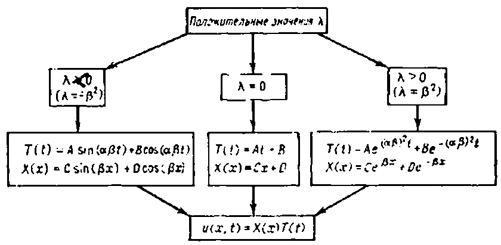

20.2. Построение стоячих воли при раздичных значениях параметра λ.

водными и граничным условиям. Затем останется только найти такую линейную комбинацию этих колебаний, чтобы сумма удовлетворяла начальным условиям при t=0.

Подстановка (20.2) в граничные условия $u(0, t) = u(L, t) = 0$ дает

$$
u(0, t) = X(0)T(t) = D\bigl[A\sin(\alpha\beta t) + B\cos(\alpha\beta t)\bigr] = 0 \Rightarrow D = 0,
$$

и

$$
u(L, t) = X(L)T(t) = C\sin(\beta L)\bigl[A\sin(\alpha\beta t) + B\cos(\alpha\beta t)\bigr] = 0 \Rightarrow \sin(\beta L) = 0.
$$

Другими словами, константа разделения $\beta$ должна удовлетворять уравнению $\sin(\beta L) = 0$, откуда

$$
\beta_n = \frac{n\pi}{L}, \qquad n = 0, 1, 2, \ldots
$$

Заметим, что если во втором уравнении (20.3) положить $C=0$, то получится тривиальное решение $X(x)T(t) \equiv 0$. Следовательно, мы нашли последовательность элементарных колебаний струны:

$$
u_n(x, t) = X_n(x)T_n(t) = \sin\!\left(\frac{n\pi x}{L}\right)\left[a_n \sin\!\left(\frac{n\pi \alpha t}{L}\right) + b_n \cos\!\left(\frac{n\pi \alpha t}{L}\right)\right].
$$

(20.4)

або

$$
u_n(x, t) = R_n \sin\!\left(\frac{n\pi x}{L}\right)\cos\!\left(\frac{n\pi \alpha (t - \delta_n)}{L}\right).
$$

Тут $a_n$, $b_n$, $R_n$ і $\delta_n$ — довільні сталі. Кожне таке елементарне коливання є стоячою хвилею.

Рис. 20.3. Стоячі хвилі $u_n(x, t) = X_n(x)T_n(t)$.

В нашей задаче уравнение и граничные условия линейны и однородны, поэтому произвольная сумма элементарных стоячих волн также является решением волнового уравнения и удовлетворяет граничным условиям. Мы должны теперь найти такую суперпозицию стоячих волн, чтобы она удовлетворяла также и начальным условиям, тогда получим решение нашей задачи. Подстановка суммы

$$

Зверніть увагу на зображення.

4. Розв'язати змішану задачу Діріхле-Неймана з кутовим порошком за допомогою розчину під кутом 45°

ПРИМІТКА. Комплексна функція $w = \ln z = \ln |z| + i \arg(z)$ відображає промінь $\theta = c_1$ у площині z у пряму $v = c_1$ , а коло $r = c_2$ у пряму $u = \ln c_2$ у площині w (див. рисунки).

# ТАБЛИЦІ ІНТЕГРАЛЬНИХ ПЕРЕТВОРЕНЬ

Таблиця A: Експоненціальне перетворення Фур'є,

Таблиця B: Перетворення синуса Фур'є.

Таблиця St Cosine Фур'є-перетворення.

Таблиця Dr скінченне перетворення Фур'є, таблиця та скінченне косинусне перетворення Фур'є.

Таблиця D: Трансформація Лапласа.

# Прийняті позначення $\delta\left(x\right)$ — дельта-функція,

$$

в начальные условия

$$

\begin{cases} 0, x < a, \\ 1, x \geqslant a, \end{cases}

$$

$ u_t(x, \theta) = g(x) $ приводит к двум уравнениям

$$

H(x-a) =

$$ Функція Хевісайду, $H(a-x) = \begin{cases} 1, & x \leqslant a, \\ 0, & x > a, \end{cases}$ дзеркальною функцією Хевісайду.

ТАБЛИЦЯ A. Експоненціальне перетворення Фур'є

$$

Воспользовавшись соотношениями ортогональности

$$

| 1. $f'(x)$ | iωF (ω) |
|------------------------------|-------------------------------------------------|
| 2. $f''(x)$ | $-\omega^2 F(\omega)$ |
| 3. fn (x), (n-та похідна) | $(i\omega)^n F(\omega)$ |
| 4. $f(ax), a > 0$ | $\frac{1}{a} F\left(\frac{\omega}{a}\right)$ |
| 5. $f(x-a)$ | $e^{-ia\omega}F(\omega)$ |
| 6. $e^{-a^2x^2}$ | $\frac{1}{a\sqrt{2}}e^{-\omega^2/4a^2}$ |
| 7. $e^{-a_1 x}$ | $\sqrt{\frac{2}{\pi}} \frac{a}{a^2 + \omega^2}$ |

20. гріх (ax)

8.

$$

9.

$$

\begin{cases} 0, & m \neq n, \\ L/2, & m = n, \end{cases}

$$

10.

$$ 11.

$$

находим коэффициенты $ a_n $ и $ b_n $ (20.5)

$$

12.

$$

Итак, задача решена. Ее решение записывается в виде

(20.6)

$$

13.

$$

а шанси $ a_n $ і $ b_n $ визначаються за формулами (20,5). Перед завершенням лекції дозвольте зробити кілька зауважень.
# ПОВАГА
1. Якщо початкова *швидкість* струни дорівнює нулю, тоді розв'язок (20.6) має вигляд

$$

14.

$$

І це можна інтерпретувати так. Припустимо, ми розклали початкове зміщення струни

$$

15.

$$

в ряд по синусам

$$

16.

$$

Тогда каждый член такого разложения должен совершать колебания

$$

17.

$$

Якщо ми підсумуємо всі ці коливання, отримаємо розв'язок нашої проблеми. Наприклад, припустимо, що

Початкове переміщення струни задається функцією $ f(x) = \sin(\pi x/L) + 0.5 \sin(3\pi x/ L) + 0,25 \sin(5\pi x/L) $ .

Повна відповідь системи на початкову умову такого типу дорівнює сумі відповідей на кожен терм, тобто

$$ 18. 
$$

2. Член із числом n у розкладі (20.6) називається ** модою осциляції** або ** p-тою гармонікою**. Використовуючи тригонометричні формули, ці гармоніки можна записати як

$$ 19.

$$

де $ R_n $ і $ \delta_n $ — нові довільні константи (амплітуда та фазовий кут). Ця нова форма представлення n-го моду виявляється більш корисною для аналізу коливань. Частота коливань od (рад/с) та моду визначаються відповідно до формули

$$

10.

$$

де T — натяг струни, p — лінійна густина струни. Зверніть увагу, що частота n-ї гармоніки у n разів більша за основну частоту (n=1). Ця властивість частоти не характерна для всіх типів коливань. Приємний звук струни скриму або гітари зумовлений множинністю обертонів основної частоти. У барабані частоти гармонік високого порядку не є кратними основної частоти коливань.
# ЗАВДАННЯ
1. Знайти розв'язок задачі (20.1), якщо початкові умови задаються формулами

$$

10.

$$ $ u_t(x, 0) = 0. $ Побудувати графіки розв'язків для різних моментів часу. Чи є це рішення періодичним у часі? Який у нього період?

2. Знайти розв'язок проблеми коливань струн (20.1) за початкових умов вигляду

$$

11.

$$ $ u_t(x, 0) = \sin(3\pi x/L). $ Как выглядит график решения в различные моменты времени?

- 3. Показати це, якщо на рис. 20.2 значення $ \lambda \geqslant 0 $ , тоді розв'язки X(x) T(t) будуть або необмеженими, або ідентичними нулю.
- Знайти розв'язок проблеми коливань струн за початкових умов вигляду

$$

12.

$$ $ u_1(x, 0) = (3\pi \alpha/L)\sin(3\pi x/L). $ 5. Гітарна струна довжиною L = 1 тягнеться за середню точку значенням h (див. рис.) Початкове положення струни можна встановити як

$$

13.

$$

14.

$$ 15.

$$

16.

$$

\begin{array}{lll} (\mathrm{Y} \Pi \Pi) & u_{tt} = \alpha^2 u_{xx} - \beta u_t, & 0 < x < 1, & 0 < t < \infty, \\ (\Gamma \mathrm{Y}) & \begin{cases} u \ (0, \ t) = 0, \\ u \ (1, \ t) = 0, \end{cases} & 0 < t < \infty, \\ (\mathrm{H} \mathrm{Y}) & \begin{cases} u \ (x, \ 0) = f \ (x), \\ u_1 \ (x, \ 0) = 0. \end{cases} & 0 \leqslant x \leqslant 1, \end{array}

$$

17.

$$ 18.

$$

19.

$$

\begin{array}{ll} (\mathrm{Y} \mathrm{H} \Pi) & u_{tt} = \alpha^2 u_{xx} + Kx, \quad 0 < x < 1, \ 0 < t < \infty, \\ (\mathrm{\Gamma} \mathrm{Y}) & \begin{cases} u \ (0, \ t) = 0, \\ u \ (1, \ t) = 0, \end{cases} & 0 < t < \infty, \\ (\mathrm{H} \mathrm{Y}) & \begin{cases} u \ (x, \ 0) = f \ (x), \\ u_t \ (x, \ 0) = 0. \end{cases} & 0 \leqslant x \leqslant 1, \end{array}

$$

19.

$$ 10.

$$

# ОСЦИЛЯЦІЇ ПУЧКА (РІВНЯННЯ ЧЕТВЕРТОГО ПОРЯДКУ В ЧАСТИННИХ ПОХІДНИХ)
МЕТА-ЛЕКЦІЯ: Показати, як проблема осциляції пучка веде до рівняння четвертого порядку і як ця задача розв'язується у випадку вільно спокійних кінців. Проводиться порівняння коливань променя з вібраціями струни скрипки.

Головна різниця між поперечними коливаннями тонкої балки та поперечними коливаннями струни полягає в тому, що промінь чинить опір згину. Не заглиблюючись у механіку тонких балок, припустимо, що, враховуючи опір згинання (замість рівняння хвилі) веде до рівняння четвертого порядку

(21.1)

$$

# ТАБЛИЦЯ B. Перетворення Спнуса-Фур'є $i \sqrt{\frac{\pi}{2}} [\delta(\omega+a) - \delta(\omega-a)]$ $$

rge $ \alpha^2 = K/\rho $ ,

K—модуль сдвига (чем больше K, тем жестче балка, тем выше частота колебаний),

р — линейная плотность балки (масса/ед. длины).

Оскільки це перший випадок, коли читач стикається з рівнянням, вищим за другий порядок у цій книзі, буде корисно розв'язати типову задачу коливань пучка. Пізніше ми ознайомимося з іншими проблемами теорії пучків.

# Свободно опирающаяся балка

Розглянемо невеликі коливання тонкої балки, кінці якої вільно лежать на двох опорах. Коли ми кажемо «вільно відпочивати», ми маємо на увазі, що кінці балки не рухаються, але

Клони пучка на кінцевих точках можна змінювати (кінці пучка фіксуються за допомогою штифтових пристроїв, рис. 21.1).

Совершенно ясно, что на концах балки должны выполняться граничные условия

$$ F(\omega) = \frac{?}{\pi} \int_{0}^{\infty} f(x) \sin(\omega x) dx$$ $ u(1, t) = 0, $ але зовсім не очевидно, що на кінцях балки мають бути виконані ще дві граничні умови:

$$ 0 < \omega < x$$ $ u_{xx}(1, t) = 0. $ Використовуючи теорію тонких балок, можна показати, що момент згинання в балці пропорційний значенню $ u_{xx} $ , а момент згинання на вільно лежачому кінці має дорівнювати P I C

.21.1. Свободно оппрающаяся балка.

Нуль вен. Відповідно, зображення, зображене на рис. 21.1 Осцилюючий пучок описується такою змішаною задачею (для простоти значення o вважається рівним одиниці):

(21.2)

$$f''(0)$$

2. $f(\alpha x)$ $$

\begin{aligned} & (\text{Y} \cdot \Pi) \quad u_{tt} = -u_{xxxx}, \quad 0 < x < 1, \quad 0 < t < \infty, \\ & \begin{cases} u \cdot (0, \ t) = 0, \\ u_{xx} \cdot (0, \ t) = 0, \\ u \cdot (1, \ t) = 0, \\ u_{xx} \cdot (1, \ t) = 0, \end{cases} \quad 0 < t < \infty, \\ & \begin{cases} u \cdot (x, \ 0) = f(x), \\ u_{1}(x, \ 0) = g(x). \end{cases} \quad 0 \leqslant x \leqslant 1, \end{aligned}

$$

3. $e^{-\alpha x}$ $$ 4.

$$

Щоб розв'язати цю задачу, ми використаємо метод розділення змінних. Ми будемо шукати лише періодичні розв'язки, тобто флуктуації

(21.3)

$$ [2/\pi\omega]^{1/2}$$

Зверніть увагу, що вибір розв'язку вигляду (21.3) фактично означає, що ми взяли константу розділення у методі розділення змінних як від'ємну.

Подставим теперь (21.3) в уравнение колебаний балки и получим уравнение для $ X\left(x\right) $ $$\frac{2}{\pi\omega} [1-\cos(\omega a)]$$

общее решение которого записывается в виде

$$1$$

Щоб визначити коефіцієнти C, D, E та F, підставляємо загальний розв'язок у граничні умови

$$e^{-1}a + \omega$$

\frac{1}{2}e^{-\alpha}\sin\omega

$$

\begin{split} u\left(0,\ t\right) &= 0 \Rightarrow X\left(0\right)T\left(t\right) = 0 \Rightarrow X\left(0\right) = 0 \Rightarrow C + E = 0 \\ u_{xx}\left(0,\ t\right) &= 0 \Rightarrow X''\left(0\right)T\left(t\right) = 0 \Rightarrow X''\left(0\right) = 0 \Rightarrow -C + E = 0 \\ u\left(1,\ t\right) &= 0 \Rightarrow D\sin\sqrt{\omega} + F\sin\sqrt{\omega} = 0, \\ u_{xx}\left(1,\ t\right) &= 0 \Rightarrow -D\sin\sqrt{\omega} + F\sin\sqrt{\omega} = 0. \end{split}

$$

\frac{1-e^{-a\omega}}{\omega}

$$ \frac{2}{\pi}F''(\omega)$$

F \sinh \sqrt{\omega} = 0,

$$f(x) = \int_{0}^{\infty} F(\omega) \cos(\omega x) d\omega \qquad \qquad F(x) = \frac{2}{\pi} \int_{0}^{\infty} f(x) \cos(\omega x) dx$$

D \sin \sqrt{\omega} = 0.

$$

1.

$$

F = 0

$$

# ТАБЛИЦЯ D. Скінченне перетворення синуса Фур'є

У скінченному перетворенні синуса Фур'є функція f(x), визначена в інтервалі $0 \le x \le \pi$ , перетворюється у послідовність $S_n$ , n = 1, 2 ... За формулою

$$

\omega_n = (n\pi)^2,

$$

Коли йдеться про таблиці, зручно розглядати змінну x як належну до інтервалу [0, l]. Будь-який інший чисельний інтервал [a, b] можна перетворити на $[0, \pi]$ за допомогою формули

$$

u_n(x, t) = X_n(x) T_n(t) = [a_n \sin(n\pi)^2 t + b_n \cos(n\pi)^2 t] \sin(n\pi x).

$$

У скінченному синусоїдальному перетворенні немає нічого загадкового: елементи послідовності $\mathcal{S}_n$ збігаються з коефіцієнтами в $\sin(nx)$ у розкладі функції f(x) у ряд Фур'є, тобто

$$

u(x, t) = \sum_{n=1}^{\infty} \left[ a_n \sin(n\pi)^2 t + b_n \cos(n\pi)^2 t \right] \sin(n\pi x)

$$ f(x) = \sum_{n=1}^{\infty} S_n \sin(nx)$$

u(x, 0) = f(x) = \sum_{n=1}^{\infty} b_n \sin(n\pi x),

$$ 0 \le x \le \pi$$

u_t(x, 0) = g(x) = \sum_{n=1}^{\infty} (n\pi)^2 a_n \sin(n\pi x).

$$

1.

$$

a_n = \frac{2}{(n\pi)^2} \int_0^1 g(x) \sin(n\pi x) dx,

$$

9.

$$

b_n = 2 \int_0^1 f(x) \sin(n\pi x) dx.

$$ $\frac{n}{n^2 + a^2} [1 - (-1)^n e^{ax}]$ 10. $\frac{\sin a (\pi - x)}{\sin a\pi}$ $\frac{2n}{\pi (n^2 + a^2)}$ ТАБЛИЦЯ E. Скінченне перетворення Косніуса Фур'є

У скінченному косинусному перетворенні Фур'є функція f(x), визначена на інтервалі $0 \le x \le \pi$ , перетворюється у послідовність $C_n$ , $n=0,\ 1,\ 2,\ \ldots$ , за формулою

$$

u(x, 0) = \sin(\pi x) + 0.5 \sin(3\pi x),

$$

Коли йдеться про таблиці, зручно розглядати змінну x як таку, що належить до інтервалу $[0,\pi]$ . Будь-який інший числовий інтервал [a,b] можна перетворити на $[0,\pi]$ за допомогою формули

$$

a_n=0

$$

У скінченному косинусному перетворенні немає нічого загадкового: елементи послідовності $C_n$ збігаються з коефіцієнтами, коли $\cos{(nx)}$ у косинусному розкладі функції f(x) у ряд Фур'є, тобто

$$

u(x, t) = \cos(\pi^2 t) \sin(\pi x) + 0.5 \cos(9\pi^2 t) \sin(3\pi x)

$$ f(x) = \frac{C_0}{2} + \sum_{n=1}^{\infty} C_n \cos(nx) \qquad C_n = \frac{2}{\pi} \int_{0}^{\pi} f(x) \cos nx \, dx$$

u(x, t) = \cos(\pi t) \sin(\pi x) + 0.5 \cos(3\pi t) \sin(3\pi x)

$$

1.

$$

u(0, t) = 0,

$$ -n^{2}C_{n} - \frac{2}{\pi} \{f'(0) - (-1)^{n} f'(n)\}$$

u(x, t) = \sum_{n=1}^{\infty} X_n(x) \left[ a_n \sin(\omega_n t) + b_n \cos(\omega_n t) \right],

$$ \begin{cases} 2, &n=0 \\ 0, &n=1, 2, \dots \end{cases}

$$

(\text{УЧП}) \quad u_{tt} + u_{xxxx} = 0, \quad 0 < x < 1, \quad 0 < t < \infty,

$$ \begin{cases} 1, & n=m \\ 0, & n\neq m \end{cases}

$$

(\text{ГУ}) \quad

$$x$$

\begin{cases} u(0, t) &= 0, \\ u_x(0, t) &= 0, \\ u_{xx}(1, t) &= 0, \\ u_{xxx}(1, t) &= 0, \end{cases}

$$ (\text{HV}) \quad 

$$

\begin{cases} u(x, 0) &= f(x), \\ u_t(x, 0) &= g(x). \end{cases}

$$ \quad 0 \leqslant x \leqslant 1,$$

6 M 601

ПРИМІТКА. Хоча власні функції, $ X_n(x) $ в цій задачі, вже не є звичайними синусами, згідно з загальною теорією Штурма-Лівілля, вони будуть ортогональними на сегменті [0, 1].

2. Знайти розв'язок для вільно лежачого балки на обох кінцях за початкових умов

$$u(x, 0) = \sin(\pi x),$$ $ u_t(x, 0) = \sin(\pi x). $ $ 0 \le x \le 1, $ 3. Решите задачу 2 с начальными условиями

$$ \begin{array}{l} u(x, 0) = 1 - x^2, \\ u_t(x, 0) = 0. \end{array}

$$

\quad 0 \le x \le 1,

$$

4. Пусть левый конец (x=0) балки жестко закреплен в стену, а правый конец (x=1) свободно опирается, как показано на рис. 21.3. Решите задачу для балки с такими граничными условиями и объясните, как найти собственные частоты колебаний в этом случае. Знать собственные частоты балок очень важно, чтобы избежать резонанса с внешними воздействиями.

Лекция 22

# ПЕРЕХОД К БЕЗРАЗМЕРНЫМ ПЕРЕМЕННЫМ МЕТА ЛЕКЦІЇ: Показать, каким образом краевые, начальные и другие виды физических задач можно записать в безразмерном виде. В конкретных областях знания (физике, химии, биологии или экономике) уравнения записываются по-разному.

Переход к безразмерным переменным позволяет привести уравнения к одному и тому же виду. Именно по этой причине при изучении уравнений с частными производными в математике стараются отвлекаться от физического смысла входящих в них параметров. Вот почему химик, физик или биолог должен преобразовать свое уравнение к той форме, которая принята в нашей книге.

Основная идея введения новых (безразмерных) переменных состоит в том, что после перехода к безразмерным переменным вадача становится чисто математической и уже не содержит

карактерных физических констант. Именно таким способом многие различные уравнения физики, биологии и химии, содержащие всякие нюансы, связанные с физическими параметрами, приводятся к одной и той же простой форме (см. рис. 22.1).

Познакомимся с этим преобразованием на простом примере.

Рис. 22.1. Некоторые задачи, приводящиеся к одной и той же безразмерной форме.

# Приведение диффузионной задачи к безразмерному виду

Начнем со смешанной задачи для отрезка с начальным условием на температуру  $u\left(x,\,0\right)=\sin\left(\pi x/L\right)$  и граничными температурами на концах  $T_1$  и  $T_2$ . Другими словами, мы решаем задачу

(22.1) 
$$

\begin{array}{ccccccccccccccccccccccccccccccccccc

$$

(см. рис. 22.2).

Рис. 22.2. Задача теплопроводности в плоскости переменных (х, т).

Наша цель — дать новую эквивалентную (22.1) постановку задачи таким образом, чтобы

в новой задаче не было никаких физических параметров (вроде α);

2) начальные и граничные условия стали проще.

Для осуществления этой цели, мы введем три новых безразмерных переменных U,  $ \xi $  и  $ \tau $ , чтобы заменить прежние u, x и t по схеме

$$

u \to U

$$

 (безразмерная температура),  $ x \to \xi $  (безразмерная длина),  $ t \to \tau $  (безразмерное время).

Мы проведем все три преобразования одновременно.

# Преобразование зависимой переменной $ u \rightarrow U $

Определим функцию U(x, t) по формуле

$$

U(x, t) = \frac{u(x, t) - T_1}{T_2 - T_1}

$$.

Ясно, что новая температура  $ U\left(x,\,t\right) $  безразмерна, поскольку мы делим градусы Цельсия на градусы Цельсия. Новые граничные условия для  $ U\left(x,\,t\right) $  при x=0 и x=L примут вид  $ U\left(0,\,t\right)=0 $  и  $ U\left(L,\,t\right)=1 $ . Давайте поставим задачу для новой функции  $ U\left(x,\,t\right) $ . После несложных преобразований задача (22.1) переходит в новую задачу

задачу 

$$

\begin{array}{ll} \text{(УЧП)} & U_t = \alpha^2 U_{xx}, \quad 0 < x < L, \quad 0 < t < \infty, \\ U_t = 0, \quad 0 < t < \infty, \\ U_t = 0, \quad 0 < t < \infty, \\ U_t = 0, \quad 0 < t < \infty, \\ U_t = 0, \quad 0 < t < \infty, \\ U_t = 0, \quad 0 < t < \infty, \\ U_t = 0, \quad 0 < t < \infty, \\ U_t = 0, \quad 0 < t < \infty, \\ U_t = 0, \quad 0 < t < \infty, \\ U_t = 0, \quad 0 < t < \infty, \\ U_t = 0, \quad 0 < t < \infty, \\ U_t = 0, \quad 0 < t < \infty, \\ U_t = 0, \quad 0 < t < \infty, \\ U_t = 0, \quad 0 < t < \infty, \\ U_t = 0, \quad 0 < t < \infty, \\ U_t = 0, \quad 0 < t < \infty, \\ U_t = 0, \quad 0 < t < \infty, \\ U_t = 0, \quad 0 < t < \infty, \\ U_t = 0, \quad 0 < t < \infty, \\ U_t = 0, \quad 0 < t < \infty, \\ U_t = 0, \quad 0 < t < \infty, \\ U_t = 0, \quad 0 < t < \infty, \\ U_t = 0, \quad 0 < t < \infty, \\ U_t = 0, \quad 0 < t < \infty, \\ U_t = 0, \quad 0 < t < \infty, \\ U_t = 0, \quad 0 < t < \infty, \\ U_t = 0, \quad 0 < t < \infty, \\ U_t = 0, \quad 0 < t < \infty, \\ U_t = 0, \quad 0 < t < \infty, \\ U_t = 0, \quad 0 < t < \infty, \\ U_t = 0, \quad 0 < t < \infty, \\ U_t = 0, \quad 0 < t < \infty, \\ U_t = 0, \quad 0 < t < \infty, \\ U_t = 0, \quad 0 < t < \infty, \\ U_t = 0, \quad 0 < t < \infty, \\ U_t = 0, \quad 0 < t < \infty, \\ U_t = 0, \quad 0 < t < \infty, \\ U_t = 0, \quad 0 < t < \infty, \\ U_t = 0, \quad 0 < t < \infty, \\ U_t = 0, \quad 0 < t < \infty, \\ U_t = 0, \quad 0 < t < \infty, \\ U_t = 0, \quad 0 < t < \infty, \\ U_t = 0, \quad 0 < t < \infty, \\ U_t = 0, \quad 0 < t < \infty, \\ U_t = 0, \quad 0 < t < \infty, \\ U_t = 0, \quad 0 < t < \infty, \\ U_t = 0, \quad 0 < t < \infty, \\ U_t = 0, \quad 0 < t < \infty, \\ U_t = 0, \quad 0 < t < \infty, \\ U_t = 0, \quad 0 < t < \infty, \\ U_t = 0, \quad 0 < t < \infty, \\ U_t = 0, \quad 0 < t < \infty, \\ U_t = 0, \quad 0 < t < \infty, \\ U_t = 0, \quad 0 < t < \infty, \\ U_t = 0, \quad 0 < t < \infty, \\ U_t = 0, \quad 0 < t < \infty, \\ U_t = 0, \quad 0 < t < \infty, \\ U_t = 0, \quad 0 < t < \infty, \\ U_t = 0, \quad 0 < t < \infty, \\ U_t = 0, \quad 0 < t < \infty, \\ U_t = 0, \quad 0 < t < \infty, \\ U_t = 0, \quad 0 < t < \infty, \\ U_t = 0, \quad 0 < t < \infty, \\ U_t = 0, \quad 0 < t < \infty, \\ U_t = 0, \quad 0 < t < \infty, \\ U_t = 0, \quad 0 < t < \infty, \\ U_t = 0, \quad 0 < t < \infty, \\ U_t = 0, \quad 0 < t < \infty, \\ U_t = 0, \quad 0 < t < \infty, \\ U_t = 0, \quad 0 < t < \infty, \\ U_t = 0, \quad 0 < t < \infty, \\ U_t = 0, \quad 0 < t < \infty, \\ U_t = 0, \quad 0 < t < \infty, \\ U_t = 0, \quad 0 < t < \infty, \\ U_t = 0, \quad 0 < t < \infty, \\ U_t = 0, \quad 0 < t < \infty, \\ U_t = 0, \quad 0 < t < \infty, \\ U_t = 0, \quad 0 < t < \infty, \\ U_t = 0, \quad 0 < t < \infty, \\ U_t = 0, \quad 0 < t < \infty, \\ U_t = 0, \quad 0 < t < \infty, \\ U_t = 0, \quad 0 < t < \infty, \\ U_t = 0, \quad 0 < t < \infty, \\ U_t

$$

Если угодно, то здесь можно остановиться, решить задачу для  $ U\left(x,\, t\right) $  и затем найти  $ u\left(x,\,t\right) $  по формуле

$$

u(x, t) = T_1 + (T_2 - T_1) U(x, t).

$$

Однако мы пойдем дальше и займемся преобразованием независимых переменных x и t.

# Преобразование пространственной координаты $ x \rightarrow \xi $

Представляется совершенно очевидным, как следует выбрать безразмерную переменную  $ \xi $ . Поскольку  $ 0 \leqslant x \leqslant L $ , полагаем

$$

\xi = x/L

$$.

После вычисления производных

$$

U_x = U_{\xi} \xi_x = \frac{1}{L} U_{\xi},

$$ U_{xx} = \frac{1}{L^2} U_{\xi\xi}$$

наступна задача стає очевидною (у змінних U, $ \xi $ , t):

$$\begin{array}{ll} (\text{YM}\Pi) & U_t = (\alpha/L)^2 \, U_{\xi\xi}, \quad 0 < \xi < 1, \quad 0 < t < \infty, \\ (22.3) & (\Gamma \text{Y}) & \begin{cases} U(0,\ t) = 0, \\ U(1,\ t) = 1, \\ U(\xi,\ 0) = \frac{\sin\left(\pi\xi\right) - T_1}{T_2 - T_1}, \quad 0 \leqslant \xi \leqslant 1. \end{cases}$$

Ми вже пройшли дві третини шляху. Останній крок пов'язаний із введенням безрозмірного часу $ \tau $ для виключення коефіцієнта $ [\alpha/L]^2 $ з диференціального рівняння.

# $ t \rightarrow \tau $ Перетворення часу

Як обрати час без розмірів? Це не так очевидно, як у випадку перших двох змінних. Однак, оскільки наша мета — виключити сталу $ [\alpha/L]^2 $ з рівняння (22.3), ми діятимемо наступним чином.

- 1. Спробуємо замінити вигляд $ \tau = ct $ , де c — невідома константа.
  - 2. Давайте розрахуємо $ u_t = u_{\tau} \tau_t = c u_{\tau} $ .
  - 3. Підставимо цю похідну у рівняння (22.3) і отримаємо

$$cu_{\mathbf{t}} = [\alpha/L]^2 u_{\xi\xi}.$$

Тому потрібно обрати $ c = [\alpha/L]^2 $ , тобто новий час слід вводити за формулою

$$\tau = [\alpha/L]^2 t.$$

Застосовуючи це перетворення до попередньої задачі (22.3), ми можемо повністю перейти до безрозмірних змінних U, $ \xi $ та $ \tau_i $ $$\begin{array}{cccccccccccccccccccccccccccccccccccc$$

Новая безразмерная система обладает следующими свойствами:

1. Уравнение не содержит параметров.

2. Граничные условия имеют простой вид.

3. Початкова умова суттєво не змінилася (тобто містить лише відомі функції).

4. Завдання стало простішим і компактнішим порівняно з оригінальним. Розв'язок цієї проблеми можна побудувати раз і назавжди, тож якщо читач перетворює свою початкову задачу (22.1) у безрозмірну форму (22.4) і знаходить її розв'язок $ U(\xi, \tau) $ у підручнику чи науковому журналі, то він може знайти розв'язок початкової задачі (22.1) простим перерахуванням

$$u(x, t) = T_1 + (T_2 - T_1) U(x/L, \alpha^2 t/L^2).$$

На цьому завершується наша дискусія проблеми перетворення задач у безрозмірний вигляд. Не існує універсальних правил, за якими слід вводити нові змінні, тут слід покладатися на фізичну інтуїцію і пробувати різні варіанти.

Завершимо цю лекцію простим прикладом перетворення задачі на безрозмірний вигляд, розв'язання нової задачі і повернення до початкових змінних.

# Приклад перетворення гіперболічної задачі на безрозмірний вигляд

Рассмотрим колеблющуюся струну

(22.5)

$$\begin{array}{ll} (\text{УЧП}) & u_{tt} = \alpha^2 u_{xx}, & 0 < x < L, & 0 < t < \infty, \\ u(0, t) = 0, & 0 < t < \infty, \\ u(L, t) = 0, & 0 < t < \infty, \\ u(X, 0) = \sin(\pi x/L) + (0.5)\sin(3\pi x/L), \\ u_t(x, 0) = 0. & \end{array}
$$

Перетворюючи пояснювальні змінні у безрозмірний вигляд (немає потреби трансформувати вас)

$$\xi = x/L$$, $ \tau = [\alpha/L] t $ получаем новую задачу

$$(\text{YYII}) \qquad u_{\tau\tau} = u_{\xi\xi}, \quad 0 < \xi < 1, \quad 0 < \tau < \infty, 1$$

(\text{\GammaY}) \quad

$$ \begin{cases} u(0, \tau) = 0, \\ u(1, \tau) = 0, \\ u(\xi, 0) = \sin(\pi\xi) + 0.5\sin(3\pi\xi), \\ u_{\xi}(\xi, 0) = 0, \end{cases}

$$

\quad 0 < \xi \leqslant 1,

$$ (\text{HY}) \quad 

$$

\begin{cases} u(\xi, 0) = \sin(\pi\xi) + 0.5\sin(3\pi\xi), \\ u_{\xi}(\xi, 0) = 0, \end{cases}

$$ \quad 0 \leqslant \xi \leqslant 1,$$

решением которой является функция

$$u(\xi, \tau) = \cos(\pi \tau) \sin(\pi \xi) + 0.5 \cos(3\pi \tau) \sin(3\pi \xi).$$

Якщо повернутися до координат x і t, розв'язок задачі (22.5) набуває вигляду

$$u(x, t) = \cos(\pi \alpha t/L)\sin(\pi x/L) + 0.5\cos(3\pi \alpha t/L)\sin(3\pi x/L).$$

# ПОВАГА - 1. Аналіз розмірності особливо важливий у чисельних методах, оскільки більшість програм написані для розв'язання загальних математичних задач і не передбачають використання великої кількості фізичних параметрів. Ті, хто хоче користуватися цими програмами, повинні перетворити свою задачу у відповідну форму, розв'язати її на комп'ютері, а потім довести числові результати до потрібного розміру.
- 2. Розмірний аналіз дозволяє математикам працювати з диференціальним рівнянням у похідних похідних, не виключаючи багатьох параметрів і констант, які не впливають на математичну суть задачі.
- 3. Не завжди потрібно конвертувати всі змінні у безрозмірний вигляд, іноді достатньо перетворити одну або дві змінні.
# ЗАВДАННЯ
1. Шляхом заміни змінних

$$\xi = x/L$$, $ \tau = [\alpha/L] t $ преобразуйте задачу (22.5) к безразмерному виду (22.6).

2. Найдите безразмерную форму для задачи

$$ \begin{array}{lll} (\text{Y} \, \Pi) & u_t = \alpha^2 u_{xx}, & 0 < x < L, \\ (\Gamma \, \text{Y}) & \left\{ \begin{array}{ll} u \, (0, \, t) = T_1, \\ u \, (L, \, t) = 0, \\ u \, (x, \, 0) = T_2, & 0 \leqslant x \leqslant L. \end{array}

$$

\right. \\ \end{array}

$$

3. С помощью замены

$$

U(x, t) = \frac{u(x, t) - T_1}{T_2 - T_1}

$$

преобразуйте задачу (22.1) в задачу (22.2).

4. Почему замена переменной  $ \tau = \alpha t $  приводит к исключению параметра  $ \alpha $  из волнового уравнения  $ u_{tt} = \alpha^2 u_{xx} $ ? В чем физический смысл этой замены? Напоминаем вам, что  $ \alpha $ —скорость

распространения волн. При поиске новых координат в большинстве случаев главную роль играет интуиция.

Как выбрать новую пространственную координату ξ, чтобы исключить и из уравнения

$$

u_t + vu_x = 0?

$$

Лекция 23

# КЛАССИФИКАЦИЯ УРАВНЕНИЙ С ЧАСТНЫМИ ПРОИЗВОДНЫМИ (КАНОНИЧЕСКАЯ ФОРМА ГИПЕРБОЛИЧЕСКОГО УРАВНЕНИЯ)
МЕТА ЛЕКЦІЇ: Показать, что линейное уравнение второго порядка с двумя независимыми переменными

$$

Au_{xx} + Bu_{xy} + Cu_{yy} + Du_x + Eu_y + Fu = G

$$

(A, B, C, D, E, F и G являются функциями x и y или могут быть константами) относится к одному из следующих типов:

- 1) гиперболическому (если  $ B^2 4AC > 0 $ ),
- 2) параболическому (если  $ B^2 4AC = $ ),
- 3) эллиптическому (если  $ 0 B^2 4AC < 0 $ ).

Показать, какие новые переменные  $ \xi = \xi(x, y) $  и  $ \eta = \eta(x, y) $  можно ввести вместо x и y, чтобы упростить исходное уравнение. В новых переменных  $ \xi $  и  $ \eta $  уравнение с частными производными приводится к одному из следующих видов (в вависимости от того, будет ли величина  $ B^2 - 4AC $  положительна, равна нулю или отрицательна):

- 1.  $ $$

\begin{cases} u_{\xi\xi} u_{\eta\eta} = \Psi(\xi,  \eta, u, u_{\xi}, u_{\eta}) і \text{(дві канонічні форми гіперболічного рівняння),} \end{cases}

$$ $
- 2.  $ u_{\eta\eta} = \Phi(\xi, \eta, u, u_{\xi}, u_{\eta}) $  (каноническая форма параболического уравнения),
- 3.  $ u_{\xi\xi} + u_{\eta\eta} = \Phi(\xi, \eta, u, u_{\xi}, u_{\eta}) $  (каноническая форма эллиптического уравнения),

где  $ \Phi $  и  $ \Psi $ —функции от частных производных первого порядка, зависимой переменной u и новых независимых переменных  $ \xi $  и  $ \eta $ . Конкретный вид функций  $ \Phi $  и  $ \Psi $  зависит от исходного уравнения.

У читателя может возникнуть мысль, что глава, посвященная классификации уравнений, должна размещаться в самом начале книги. Вероятно, это правильно, и многие книги действительно начинаются с этого материала. Однако правда и то, что многие студенты не могут с энтузиазмом изучать нечто такое, о чем у них нет никакого представления. Именно по этой причине мы отложили изучение темы, посвященной классификации уравнений с частными производными, до настоящего момента.

Наша задача - классифицировать все уравнения вида

(23 1) 

$$

Au_{xx} + Bu_{xy} + Cu_{yy} + Du_x + Eu_y + Fu = G,

$$

где A, B, C, D, E, F и G—вообще говоря, функции [x и y. Согласно предлагаемой схеме классификации уравнение называется

1) гиперболическим в точке  $ (x_0, y_0) $ , если  $ B^2(x_0, y_0) - 4A(x_0, y_0) \помножити на $  $ \помножити на C(x_0, y_0) > 0 $ 2) параболнческим в точке  $ (x_0, y_0) $ , если  $ B^2(x_0, y_0) - 4A(x_0, y_0) \помножити на C(x_0, y_0) = 0 $ ,

3) эллиптическим в точке  $ (x_0, y_0) $ , если  $ B^2(x_0, y_0) - 4A(x_0, y_0) \помножити на $  $ \помножити на C(x_0, y_0) < 0 $ и в зависимости от типа его можно привести к одной из канонических форм. Для того чтобы было легче разобраться в классификационной схеме, мы приведем четыре примера гиперболических, параболических и эллиптических уравнений.

# Примеры гиперболических, параболических и эллиптических уравнений 10

1. У равнение теплопроводности  $ u_t = u_{xx} $  — линейное уравнение второго порядка вида (23.1) с коэффициентами

$$

A=1

$$,  $ B=0 $ ,  $ C=0 $ ,  $ D=0 $ ,  $ E=-1 $ ,  $ F=0 $ ,  $ G=0 $ ,

так что  $ B^2-4AC=0 $  при всех x и t. Следовательно, это уравнение будет параболическим при всех x и t. В общем уравнении (23 1) переменная y играет роль времени t. Результат не изменится, если в общем уравнении поменять местами x и y.

2. Волновое уравнение  $ u_{1t} = u_{xx} $  также принадлежит классу уравнений вида (23.1) с коэффициентами

$$

A=1

$$,  $ B=0 $ ,  $ C=-1 $ ,  $ D=E=F=G=0 $ .

Так как  $ B^2 - 4AC = 4 $  для всех x и t, то это уравнение является еиперболическим при всех x и t.

1) Следует указать, что приведенные в примерах уравнения являются частными случаями более общих параболических, гиперболических в эллиптических уравнений, а основные их свойства характерны и для общего случая.

3. У равнение Лапласа  $ u_{xx} + u_{yy} = 0 $  является эллиптическим при всех x и y, так как  $ B^2 - 4AC = - 4 < 0 $ .

4. Линейное уравнение  $ xu_{xx} + u_{yy} = \sin x $  с переменными коэффициентами также принадлежит классу уравнений вида (23.1), но для него  $ B^2-4AC=-4x $  и, следовательно, уравнение будет эллиптическим при x > 0,

лараболическим при x=0, гиперболическим при x < 0.

Этот пример иллюстрирует тот факт, что тип уравнения о переменными коэффициентами может изменяться от точки к точке.

Читатель должен обратить внимание на следующее: тип уравнения (23.1) определяется только коэффициентами при вторых првизводных и никак не зависит ни от коэффициентов при первых производных и самой функции, ни от свободного члена.

Обратимся теперь к главной теме нашей лекции — приведению гиперболических уравнений к каноническому виду. Известно, что если в данной области пространства уравнение является гиперболическим, то вместо x и y можно ввести координаты  $ \xi $  и  $ \eta $ (характеристические переменные) таким образом, что уравнение примет простейшую форму

(23.2) 

$$

u_{\xi\eta} = \Phi(\xi, \eta, u, u_{\xi}, u_{\eta}).

$$

Это уравнение содержит только одну производную второго порядка  $ u_{\xi\eta} $ , а функция  $ \Phi(\xi,) \eta,u,u_{\xi},u_{\eta}) $  зависит только от новых независимых переменных § и η, зависимой переменной и и первых производных из и ип. Конкретный вид функции Ф зависит, конечно, от исходного уравнения и формул перехода к новым координатам § и п. Научимся отыскивать эти функции.

# Каноническая форма гиперболического уравнения

Рассмотрим уравнение общего вида

(23.3) 

$$

Au_{xx} + Bu_{xy} + Cu_{yy} + Du_x + Eu_y + Fu = G

$$

и пусть в интересующей нас области  $ B^2 - 4AC > 0 $ . Нам нужно ввести новые координаты 1)

$$

\xi = \xi(x, y),

$$ \eta = \eta(x, y)$$

тому в рівнянні (23.3) залишається лише одна часткова похідна другого порядку $ u_{\xi\eta} $ (не слід шукати заміну змінним, за допомогою якої гіперболічне вирівнювання

1) Необхідно, щоб це перетворення координат було локально оборотним і подвійно диференційованим. — Ед. Ед.

У цьому випадку це неможливо).

Вычислим сначала частные производные

$$ \begin{array}{c} u_x = u_\xi \xi_x + u_\eta \eta_x, \\ u_y = u_\xi \xi_y + u_\eta \eta_y, \\ (23.4) \ u_{xx} = u_{\xi\xi} \xi_x^2 + 2u_{\xi\eta} \xi_x \eta_x + u_{\eta\eta} \eta_x^2 + u_{\xi} \xi_{xx} + u_{\eta} \eta_{xx}, \\ u_{xy} = u_{\xi\xi} \xi_x^2 + u_{\xi\eta} (\xi_x \eta_y + \xi_y \eta_x) + u_{\eta\eta} \eta_x \eta_y + u_{\xi} \xi_{xy} + u_{\eta} \eta_{xy}, \\ u_{yy} = u_{\xi\xi} \xi_y^2 + 2u_{\xi\eta} \xi_y \eta_y + u_{\eta\eta} \eta_y^2 + u_{\xi} \xi_{yy} + u_{\eta} \eta_{yy}. \end{array}

$$

Підставляючи ці відношення до початкового рівняння (23.3), після простих, але громіздких обчислень отримуємо

(23.5)

$$\overline{A}u_{\xi\xi} + \overline{B}u_{\xi\eta} + \overline{C}u_{\eta\eta} + \overline{D}u_{\xi} + \overline{E}u_{\eta} + \overline{F}u = \overline{G},$$

\overline{A} = A\xi_{x}^{2} + B\xi_{x}\xi_{y} + C\xi_{y}^{2},

$$ \overline{B} = 2A\xi_{x}\eta_{y} + B(\xi_{x}\eta_{y} + \xi_{y}\eta_{x}) + 2C\xi_{y}\eta_{y},$$

\overline{C} = A\eta_{x}^{2} + B\eta_{x}\eta_{y} + C\eta_{y}^{2},

$$ \overline{D} = A\xi_{xx} + B\xi_{xy} + C\xi_{yy} + D\xi_{x} + E\xi_{y},$$

\overline{E} = A\eta_{xx} + B\eta_{xy} + C\eta_{yy} + D\eta_{x} + E\eta_{y},

$$ \overline{F} = F,$$

\overline{G} = G.

$$

Читателю предоставится возможность проделать эти выкладки при решении задач.

Наш следующий шаг—выбрать функции  $ \xi = \xi(x, y) $  и  $ \eta = \eta(x, y) $  таким образом, чтобы коэффициенты  $ \overline{A} $  и  $ \overline{C} $  обратились в нуль. Это позволит нам привести исходное уравиение к канонической форме. Итак, необходимо потребовать, чтобы

$$

\bar{A} = A\xi_x^2 + B\xi_x\xi_y + C\xi_y^2 = 0,

$$

 $ \bar{C} = A\eta_x^2 + B\eta_x\eta_y + C\eta_y^2 = 0. $ Эти уравнения можно представить в виде

$$

\begin{split} &A\left[\xi_{x}/\xi_{y}\right]^{2}+B\left[\xi_{x}/\xi_{y}\right]+C=0,\\ &A\left[\eta_{x}/\eta_{y}\right]^{2}+B\left[\eta_{x}/\eta_{y}\right]^{2}+C=0. \end{split}

$$ Разрешив их относительно  $[\xi_x/\xi_y]$  и  $[\eta_x/\eta_y]$ , получаем

(23.7) 
$$

\begin{bmatrix} \xi_x/\xi_y \end{bmatrix}

$$ = \frac{-B + \sqrt{B^2 - 4AC}}{2A}$$

(характеристические

$$[\eta_x/\eta_y] = \frac{-B - \sqrt{B^2 - 4AC}}{2A}$$

уравнения).

Кожне квадратичне рівняння для $ [\xi_x/\xi_y] $ і $ [\eta_x/\eta_y] $ має два ядра, але залишаємо лише одне, щоб вони відрізнялися.

Фіг. 23.1. Характеристики $ \xi(x, y) = c $ та $ \eta(x, y) = c $ .

Задача була зведена до знаходження двох функцій $ \xi(x, y) $ і $ \eta(x, y) $ , так що відношення $ [\xi_x/\xi_y] $ і $ [\eta_x/\eta_y] $ задовольняють рівняння (23.7). Дуже легко знайти такі функції 1) якщо звернути увагу на рис. 23.1. Щоб зрозуміти, як це можна зробити, розглянемо просте рівняння

$$u_{xx} - 4u_{yy} + u_x = 0.$$

Его характеристики определяются из уравнений

$$
\begin{aligned}
\frac{dy}{dx} &= -\frac{\xi_x}{\xi_y} = \frac{B - \sqrt{B^2 - 4AC}}{2A} = -2, \\
\frac{dy}{dx} &= -\frac{\eta_x}{\eta_y} = \frac{B + \sqrt{B^2 - 4AC}}{2A} = 2.
\end{aligned}
$$

Решая эти уравнения относительно у, получаем

$$y = -2x + c_1,$$

y = 2x + c_2.

$$

Чтобы найти  $ \xi $  и  $ \eta $ , разрешим полученные уравнения относительно констант  $ c_1 $  и  $ c_2 $ , оставляя их в правой части и перенося остальные слагаемые в левую.

Выражения, стоящие в левых частях, примем за искомые функции § и пр

$$

\xi = y + 2x = c_1,

$$ \eta = y - 2x = c_2.$$

1) См., например, Тихонов А. Н., Самарский А. А. Уравнения математической физики. — М.: Наука, 1972 и др. издания. — Прим. ред.

Очевидно, що функції $ \xi $ і $ \eta $ введені таким чином, задовольняють рівняння характеристик. Ці нові координати показані на рис. 23.2. На цьому наше обговорення того, як знайти нові координати, завершується. Останнє, що залишилося — визначити новий тип початкового рівняння.

Фіг. 23.2. Характеристичні координати рівняння $ u_{xx} - 4u_{uu} + u_x = 0 $ .

Це досить просто: знайти канонічну форму диференціального рівняння з частковими похідними, підставити нові координати $ \xi(x, y) $ і $ \eta(x,) y) $ у рівняння

$$\overline{A}u_{\xi\xi} + \overline{B}u_{\xi\eta} + \overline{C}u_{\eta\eta} + \overline{D}u_{\xi} + \overline{E}u_{\eta} + \overline{F}u = \overline{G}$$,

де $ \overline{A} $ , $ \overline{B} $ , $ \overline{C} $ , $ \overline{D} $ , $ \overline{E} $ , $ \overline{F} $ та $ \overline{G} $ визначаються формулами (23.6).

Прежде чем закончить лекцию, давайте на конкретном примере посмотрим, как «работает» общий метод приведения к каноническому виду.

Приведение гиперболического уравнения $ y^2u_{xx}-x^2u_{yy}=0 $ к канонической форме

Рассмотрим уравнение

$$y^2u_{xx}-x^2u_{yy}=0$$, $ x> $ , $ 0 y>0 $ ,

що є гіперболічним у першому квадранті. Знайдемо нові координати так, щоб початкове рівняння набуло канонічної форми.

ШАГ 1. Решаем уравнения характеристик

$$\frac{dy}{dx} = \frac{B + \sqrt{B^2 - 4AC}}{2A} = \frac{x}{y}$$

(напомним, что этот шаг

$$\frac{dy}{dx} = \frac{B - \sqrt{B^2 - 4AC}}{2A} = -\frac{x}{y}.$$

обеспечивает $ \overline{A} = \overline{C} = 0 $ ),

Фіг. 23.3. Нові координати карактора.

Інтегруючи ці звичайні диференціальні рівняння методом розділення змінних, ми отримуємо два неявних співвідношення (за бажанням можна виразити y через x)

$$y^2 - x^2 = \text{const},$$

y^2 + x^2 = \text{const}.

$$

Следовательно, новые координаты следует вводить по формулам

$$

\xi = y^2 - x^2

$$,  
 $ \eta = y^2 + x^2 $ .

Эти новые координаты изображены на рис. 23.3. Теперь следует получить новое уравнение. Вычислим все коэффициенты

 $ \widetilde{A} = 0 $  (так и должно быть; мы специально выбирали  $ \xi \xi $  и  $ \eta $  так, чтобы этот коэффициент обращался в нуль).

$$

\vec{B} = 2A\xi_x\eta_x + B(\xi_x\eta_y + \xi_y\eta_x) + 2C\xi_y\eta_y = -16x^2y^2

$$,

 $ \overline{C} = 0 $  (по той же причине, что и  $ \overline{A} = 0 $ ),

$$

\bar{D} = A\xi_{xx} + B\xi_{xy} + C\xi_{yy} + D\xi_x + E\xi_y = -2(x^2 + y^2)

$$ \widetilde{E} = A\eta_{xx} + B\eta_{xy} + C\eta_{yy} + D\eta_x + E\eta_y = 2(y^2 - x^2),$$

\tilde{F} = F = 0

$$,

$$

\overline{G} = G = 0

$$,

подставим их в уравнение

$$

\overline{A}u_{\xi\xi} + \overline{B}u_{\xi\eta} + \overline{C}u_{\eta\eta} + \overline{D}u + \overline{E}u_{\eta} + \overline{F}u = \overline{G}

$$

и получим

$$

u_{\xi\eta} = \frac{-(x^2 + y^2) u_{\xi} + (y^2 - x^2) u_{\eta}}{8x^2y^3}.

$$

ШАГ 2. Выражая, наконец, x и y через  $ \xi $  и  $ \eta $ , окончательно получаем

(23.8) 

$$

u_{\xi\eta} = \frac{\eta u_{\xi} - \xi u_{\eta}}{2(\xi^2 - \eta^2)}.

$$

Задача решена. Теперь мы знаем, что нужно сделать, чтобы найти новые координаты и привести уравнение к канонической форме.
# ЗАУВАЖЕННЯ
1. На самом деле для гиперболических уравнений существует две канонические формы. Вторую можно получить из первов заменой переменных вида

$$

\alpha = \alpha (\xi, \eta) = \xi + \eta,

$$

 $ \beta = \beta (\xi, \eta) = \xi - \eta. $ Воспользуемся этой заменой для преобразования уравнения (23.8). Так как

$$

\begin{array}{l} u_{\xi} = u_{\alpha}\alpha_{\xi} + u_{\beta}\beta_{\xi} = u_{\alpha} + u_{\beta}. \\ u_{\eta} = u_{\alpha}\alpha_{\eta} + u_{\beta}\beta_{\eta} = u_{\alpha} - u_{\beta}, \\ u_{\xi\eta} = u_{\alpha\alpha}\alpha_{\eta} + u_{\alpha\beta}\beta_{\eta} + u_{\beta\alpha}\alpha_{\eta} + u_{\beta\beta}\beta_{\eta} = u_{\alpha\alpha} - u_{\beta\beta}, \end{array}

$$ TO

(23 9) 

$$

u_{\alpha\alpha} - u_{\beta\beta} = \frac{-\beta u_{\alpha} - \alpha u_{\beta}}{2\alpha\beta}.

$$

При желании можно выразить  $ \alpha $  и  $ \beta $  через исходные координаты x и y. В результате получаем

$$

\alpha = \xi + \eta = (y^2 - x^2) + (y^2 + x^2) = 2y^3,

$$ \beta = \xi - \eta = (y^2 - x^2) - (y^2 + x^2) = -2x^2.$$

- Читач може запитати, чому необхідно класифікувати та зводити їх до канонічної форми диференціальних рівнянь у похідних похідних.
  - a) Поділ рівнянь на класи гіперболічних, параболічних та еліптичних відповідає поділу фізичних процесів на три основні класи: хвильовий, дифузійний і стаціонарний. Математичні особливості розв'язків цих трьох типів рівнянь є абсолютно різними.
  - b) У більшості праць, присвячених розв'язанню гіперболічних задач, припускається, що початкове рівняння записується у канонічній формі, тобто у вигляді

$$u_{\xi\xi} - u_{\eta\eta} = \Psi(\xi, \, \eta, \, u_{\xi}, \, u, u_{\eta}).$$

Якщо у нас є рівняння і ми хочемо отримати його розв'язок, ми повинні перетворити його у канонічну форму і використати відомі результати.

c) Для чисельного розв'язання канонічного гіперболічного рівняння було створено багато різних комп'ютерних програм.

Функція $ \Phi $ ( $ \xi $ , $ \xi \eta $ , u, $ u_{\xi} $ , $ u_{\eta} $ ) вводиться у VM $ \Theta $ як підпрограма, тому рівняння спочатку має бути канонічним. Як тільки розв'язок знайдено в нових координатах, його завжди можна перетворити назад на початкові координати.
# ЗАВДАННЯ - 1. Дізнайтеся, чи є наступні рівняння гіперболічними, параболічними чи еліптичними:
- : **a)** $ u_{xx} u_{xy} = 0 $ ,
  - 6) $ u_{tt} = u_{xx} + u_x + hu $ ,
  - **B)** $ u_{xx} + 3u_{yy} = \sin x $ ,
  - r) $ u_{xx} + u_{yy} = f(x, y) $ ,
  - $ \mathbf{D} ) \ u_{rr} + \frac{1}{r} u_r + \frac{1}{r^2} u_{\theta \theta} = f(r, \ \theta). $ - 2. Отримайте співвідношення (23,4), (23,5) та (23,6).
- 3. Переконайтеся, що рівняння

$$3u_{xx} + 7u_{xy} + 2u_{yy} = 0$$

гиперболического типа при всех x и y и найдите $ x a p a \kappa m e p u c $ - $ m u + e c \kappa u + e c \kappa u + e c \kappa u + e c \kappa u + e c \kappa u + e c \kappa u + e c \kappa u + e c \kappa u + e c \kappa u + e c \kappa u + e c \kappa u + e c \kappa u + e c \kappa u + e c \kappa u + e c \kappa u + e c \kappa u + e c \kappa u + e c \kappa u + e c \kappa u + e e c \kappa u + e c \kappa u + e c \kappa u + e c \kappa u + e c \kappa u + e c \kappa u + e c \kappa u + e c \kappa u + e c \kappa u + e c \kappa u + e c \kappa u + e c \kappa u + e c \kappa u + e c \kappa u + e c \kappa u + e c \kappa u + e c \kappa u + e c \kappa u + e c \kappa u + e c \kap u + e c \kap

pa u + e c \kappa u + e c \kappa u + e c \kappa u + e c \kappa u + e c \kappa u + e c \kappa u + e c \kappa u + e c \kappa u + e c \kappa u + e c \kappa u + e c \kappa u + e c \kappa u + e c \kappa u + e c \kappa u + e c \kappa u + e c \kappa u + e c \kappa u + e c \kappa u + e c \kappa u + e c \kappa u + e c \kappa u + e c \kappa u + e e c \kappa u + e c \kappa u + e c \kappa u + e c \kappa u + e c \kappa u + e c \kappa u + e c \kappa u + e c \kappa u + e c \kappa u + e c \kappa u + e c \kappa u + e c \kappa u + e c \kappa u + e c \kappa u + e c \kappa u + e c \kappa u + e c \kappa u + e c \kappa u + e c \kappa u + e c \kappa u + e c \kappa u + e c \kappa u + e c \kappa u + e c \kappa u + e c \kappa u + e c \kappa u + e c \kappa u + e c \kappa u + e c \kappa u + e c \kappa u + e c \kappa u + e c \kappa u + e c \kappa u + e c \kappa u + e c \kappa u + e c \kappa u + e c \kappa u + e c \kappa u + e c \kappa u + e c \kappa u + e u + e c \kappa u + e c \kappa u + e c \kappa u + e c \kappa u + e c \kappa u + e c \kappa u + e c \kappa u + e c \kappa u + e c \kappa u + e c \kappa u + e c \kappa u + e c \kappa u + e c \kappa u + e c \kappa u + e c \kappa u + e c \kappa u + e c \kappa u + e c \kappa u + e c \kappa u + e c \ kappa u + e c \kappa u + e c \kappa u + e c \kappa u + e c \kappa u + e c \kappa u + e c \kappa u + e c \kappa u + e c \kappa u + e c \kappa u + e c \kappa u + e c \kappa u + e c \kappa u + e c \kappa u + e c \kappa u + e c \kappa u + e c \kappa u + e c \kappa u + e c \kappa u + e e c \kappa u + e c \kappa u + e c \kappa u + e c \kappa u + e c \kappa u + e c \kappa u + e c \kappa u + e c \kappa u + e c \kappa u + e c \kappa u + e c \kappa u + e c \kappa u + e c \kappa u + e c \kappa u + e c \kappa u + e c \kappa u + e c \kappa u + e c \kappa u + e c \kappa u + e c \kappa u + e c \kappa u + e c \kappa u + e c \kappa u + e c \kappa u + e c \kappa u + e c \kappa u + e c \kappa u + e c \kappa u + e c \kappa u + e c \kappa u + e c \kappa u + e c \kappa u + e c \kappa u + e c \kappa u + e c \kappa u + e c \kappa u + e c \kappa u + e c \kappa u + e c \kappa u + e c \kappa u + e u + e c \kappa u + e c \kappa u + e c \kappa u + e c \kappa u + e c \kappa u + e c \kappa u + e c \kappa u + e c \kappa u + e c \kappa u + e c \kappa u + e c \kappa u + e c \kappa u + e c \kappa u + e c \kappa u + e c \kappa u + e c \kappa u + e c \kappa u + e c \kappa u + e c \kappa u + e c \ kappa u + e c \kappa u + e c \kappa u + e c \kappa u + e c \kappa u + e c \kappa u + e c \kappa u + e c \kappa u + e c \kappa u + e c \kappa u + e c \kappa u + e c \kappa u + e c \kappa u + e c \kappa u + e c $ 4. Приведите уравнение из предыдущей задачи к каноническому виду

$$u_{\xi\eta} = \Phi(\xi, \eta, u, u_1, u_2).$$

5. Продолжите вадачу 4 и приведите уравнение ко второй канонической форме

$$u_{\alpha\alpha} - u_{\beta\beta} = \Psi(\alpha, \beta, u, u_{\alpha}, u_{\beta}).$$

6. Найдите характеристики уравнения

$$u_{xx} + 4u_{xy} = 0.$$

Перетворіть рівняння на нові координати, розв'яжіть його і поверніться до координат x і y, щоб отримати розв'язок початкової здогадки.

# ХВИЛЬОВЕ РІВНЯННЯ У ВІЛЬНОМУ ПРОСТОРІ (ДВОВИМІРНІ ТА ТРИВИМІРНІ ЗАДАЧІ)
МЕТАЛЕКЦІЇ: Розв'яжіть задачу з початковими умовами

(УЧП)

$$u_{tt} = e^{2} (u_{xx} + u_{yy} + u_{zz}),
$$

\begin{cases} -\infty < x < \infty, \\ -\infty < y < \infty, \\ -\infty < z < \infty, \end{cases}

$$ (НУ) 
$$

\begin{cases} u(x, y, z, 0) = \varphi(x, y, z), \\ u_{t}(x, y, z, 0) = \psi(x, y, z) \end{cases}

$$ в трехмерном пространстве и показать, что полученное решение удовлетворяет *принципу Гюйгенса*. Для решения соответствующей двумерной задачи

(УЧП) 

$$

u_{tt} = c^2 (u_{xx} + u_{yy}), \quad

$$ \begin{cases} -\infty < x < \infty, \\ -\infty < y < \infty, \end{cases}

$$

(НУ) $ 

$$ Mr_1 + K = 2643$$

 $ використовується метод спуску, і доведено, що двовимірні розв'язки не задовольняють принцип Гюйгенса. І нарешті, використовуючи метод спуску, показано, що розв'язок одномірного рівняння виражається формулою д'Аламбера, з якою ми познайомилися раніше.

У попередніх лекціях ми розглядали задачу з початковими умовами для нескінченної вібруючої струни і показали, що її розв'язок задається формулою д'Аламбера. Читачеві має бути зрозуміло, що в тривимірному просторі одномірне хвильове рівняння описує плоскі хвилі. Наприклад, звукові або електромагнітні хвилі на достатньо великих відстанях від джерел можна вважати плоскими хвилями і, отже, описуватися одномірним рівнянням. Існує така термінологія:

- 1) одномірні хвилі називаються плоскими хвилями,
- 2) Двовимірні хвилі називають циліндричними хвилями.

3) тривимірні хвилі називаються сферичними хвилями.

Іншими словами, одномірне хвильове рівняння може описувати або плоскі хвилі в просторах більшої кількості розмірів, або коливання струн. Завдання лекції — узагальнити формулу д'Аламбера для випадку двох і трьох вимірів.

# Хвилі у тривимірному просторі

Розглянемо сферичні хвилі у тривимірному просторі за заданих початкових умов, тобто розв'яжемо задачу з початковими умовами

(24.1)

$$

\begin{cases} -\infty < x < \infty, \\ -\infty < y < \infty, \\ -\infty < z < \infty, \end{cases}

$$

(24.1)

$$

\begin{cases} u(x, y, z, 0) = \varphi(x, y, z), \\ u_{t}(x, y, z, 0) = \psi(x, y, z). \end{cases}

$$

P_{2}

$$

\begin{aligned} u_{tt} &= c^2 \Delta u, \\ (HY) & \begin{cases} u(x, y, z, 0) = 0, \\ u_t(x, y, z, 0) = \psi(x, y, z), \end{cases} \end{aligned}

$$

где экаком $ \Delta $ обозначен дифференциальный оператор

$$

Цю задачу можна розв'язати методом $ \Phi $ Юр'єра $ ^{1} $ ), і виявляється, що розв'язок можна представити у вигляді

$$

P_{1}

$$

где $ \overline{\psi} $ — *среднее* значение начального распределения $ \psi $ *по сфере* радиуса ct с центром в точке (x, y, z), т. е.

$$ $ + ct \cos \varphi $ ) $ (ct)^2 \sin \varphi d\varphi d\theta $ .

Аргументи функції $ \psi $ проходити по поверхні сфери, якщо значення $ \theta $ і $ \phi $ змінюються відповідно в межах $ [0, 2\pi] $ і $ [0, \pi] $ (рисунок 24.1). Цю формулу можна інтерпретувати так:

См Владимиров В. С. Уравнения математической физики. — М.: Наука, 1971 и др. издания. — Прим ред.

дующим образом: каждая точка пространства излучает расходящуюся (со скоростью c) сферическую волну, через t секунд точка с координатами (x, y, z) окажется под воздействием начального Р И С

. 24 1. Решение является средним значением начатьного распределения на сфере.

возмущения, сосредоточенного на сфере раднуса ct с центром в заданной точке (см. рис. 24.2).

Формула (24.3) дозволяє обчислити розв'язок задачі для більшості початкових умов на комп'ютері. Можливо, читачу буде цікаво знайти розв'язок для деяких простих функцій f.

Фіг. 24.2. Початкове збурення $ \psi $ поширюється з кожної точки у всіх напрямках.

Щоб отримати повне рішення, розглянемо другу половину проблеми

(24.4)

$$

\begin{aligned} (\text{YAII}) & u_{tt} = c^2 \Delta u, \\ (\text{HY}) & \begin{cases} u = 0, \\ u_t = \varphi, \end{cases} \end{aligned}

$$

u_h(r, \theta) = \sum_{n=0}^{\infty} r^n [a_n \cos(n\theta) + b_n \sin(n\theta)].

$$

\Delta u = -\frac{r^2}{2} - \frac{r^3}{2} \cos{(2\theta)}

$$

u = \frac{\partial}{\partial t} [t\overline{\varphi}].

$$

u_p(r, \theta) = Ar^4 + Br^4 \cos(2\theta).

$$

u(x, t) = \frac{1}{2c} \int_{x-ct}^{x+ct} \varphi(s) ds.

$$

u_p(r, \theta) = -\frac{r^4}{32} - \frac{r^4}{24} \cos(2\theta).

$$

u_t(x, t) = \frac{1}{2} [\varphi(x + ct) + \varphi(x - ct)].

$$

\sum_{n=0}^{\infty} [a_n \cos(n\theta) + b_n \sin(n\theta)] - \frac{1}{32} - \frac{1}{24} \cos(2\theta) = 0.

$$

(\text{УЧП}) \quad u_{tt} = c^2 \Delta u, \quad (x, y, z) \in \mathbb{R}^3,

$$

u_1(r, \theta) = \frac{1}{32} + \frac{1}{24}r^2\cos(2\theta) - \frac{r^4}{24}\cos(2\theta) - \frac{r^4}{32} = \frac{(r^4 - 1)}{32} - \frac{(r^4 - r^2)}{24}\cos(2\theta).

$$

(\text{HV}) \quad

$$

u = u_0 + u_1 = r \cos \theta - \frac{(r^4 - 1)}{32} - \frac{(r^4 - r^2)}{24} \cos (2\theta).

$$

\begin{cases} u = \varphi, \\ u_t = \psi \end{cases}

$$

P_{2}

$$

\Delta u = 0, \quad 0 < r < 1 + \frac{1}{4} \sin \theta,

$$

записывается в виде

$$

u \left( 1 + \frac{1}{4} \sin \theta, \ \theta \right) = \cos \theta, \quad 0 \le \theta \le 2\pi.

$$

где $ \overline{\phi} $ и $ \overline{\psi} $ — средние значения функций $ \phi $ и $ \psi $ на сфере раднусом ct с центром в точке (x, y, z).

Цей розв'язок зазвичай називають формулою Пуассона для хвильового рівняння у тривимірному просторі. Це природне узагальнення формули д'Аламбера на тривимірний випадок. Найважливішим у формулі Пуассона є те, що обидва інтеграли в $ \bar{\phi} $ і $ \bar{\psi} $ взяті з поверхні сфери. Цей факт дозволяє нам надати таку важливу інтерпретацію рішення.

У момент $ t=t_1 $ розв'язок u у (x,y,z) залежить лише від початкових розподілів сфери з радіусом $ ct_1 $ центрованим на (x,y,z) (рисунок 24.3). Тепер припустимо, що початкові розподіли $ \phi $ і $ \psi $ дорівнюють нулю всюди, крім малої сфери (див. рисунок 24.3). З часом радіус P И С

. 24.3. Схема поясияет, как начальное возмущение влияет на точку (к, ч, г).

Сфера, що оточує точку (x, y, z), зростає зі швидкістю c, так що через $ t_{\hat{z}} $ секунди ця сфера починає перетинати область початкового збурення, і тому розв'язок u(x, y, z, t) стає ненульовим. У $ t_{\hat{z}} < t < t_{\hat{a}} $ розв'язок U у (x, y, z) залишається ненульовим, оскільки сфера продовжує перетинати область початкового збурення, але на $ t=t_{\hat{a}} $ розв'язок знову стає нульовим. Іншими словами, розв'язок, що поширюється з початкової області збурення, має чітко визначену задню кромку. Цей загальний принцип відомий як принцип Гюйгенса для тривимірного простору. Виявляється, що передній край хвилі завжди чітко окреслений, але задній край чітко окреслений лише в просторах розмірності 3, 5, 7.... Ми вже знаємо з формули д'Аламбера, що початкові умови

$$

u\left(1+\frac{1}{4}\sin\theta,\ \theta\right)=\cos\theta

$$

приводят, вообще говоря, к нерезкому заднему фронту (поскольку формула Даламбера подразумевает интегрирование функции $ \psi(x) $ в пределах от x-ct до x+ct).

Покажем теперь, что принцип Гюйгенса неприменим к цилиндрическим волнам. Такого рода решения описывают волны на воде от точечного источника, когда задний фронт волны не резкий, а постепенно затухает до нуля.

# Двумерное волновое уравнение

Чтобы решить двумерную волновую задачу

(УЧП)

$$

u(1+\epsilon\sin\theta, \theta) = \cos\theta, \quad 0 \le \epsilon \le 1/4.

$$

f(x+h) = f(x) + f'(x)h + f''(x)\frac{h^2}{2!} + \dots,

$$

\begin{cases} -\infty < x < \infty, \\ -\infty < y < \infty, \end{cases}

$$

u(1+\varepsilon\sin\theta,\ \theta)=u(1,\ \theta)+u_r(1,\ \theta)(\varepsilon\sin\theta)+u_{rr}(1,\ \theta)\frac{(\varepsilon\sin\theta)^2}{21}+\ldots

$$

(НУ) $

$$ \begin{array}{l} u_{xx} + u_{yy} = 0, \quad 0 < x < 1, \quad 0 < y < 1, \\ u(x, 1) = 0, \quad 0 < x < 1, \quad 0 < y < 1, \\ u(x, 0) = 0, \quad 0 < x < 1, \quad 0 < y < 1, \\ u(0, y) = 1, \quad \frac{\partial u}{\partial x}(1, y) = 0 \end{array}

$$

 $ Розглянемо розв'язок тривимірної задачі за початкових умов, які залежать лише від двох змінних X і Y.

Сделав это, получим, что трехмерная формула

$$

\Delta u = 0, \quad 0 < r < 1 + \varepsilon \sin \theta,

$$

для розв'язку та опише циліндричні хвилі і, отже, дасть розв'язок двовимірної задачі. Цей метод називається методом спуску. Після всіх розрахунків ми отримуємо 1) (зовсім не тривіальне)

$$

u(1, \theta) + u_r(1, \theta) (\varepsilon \sin \theta) + u_{rr}(1, \theta) \frac{(\varepsilon \sin \theta)^2}{2!} + \dots = \cos \theta.

$$

Перед нами стоїть розв'язок двовимірного хвильового рівняння, і хоча, найімовірніше, його практичне застосування передбачає використання комп'ютера, цікаво аналізувати його з точки зору принципу Гюйгенса. У цьому розв'язці обидва інтеграли початкових збурень розглядаються вздовж внутрішньої частини (тут слово «внутрішнє» відіграє вирішальну роль) кола з радіусом cte e центр у точці (x, y). Іншими словами, якщо ми проаналізуємо це рішення так само, як у тривимірному випадку, то побачимо, що початкове збурення поширюється з чітко визначеним переднім краєм і розмитим заднім краєм. Отже, принцип Гюйгенса не виконується у просторі двох вимірів.

Нарешті, припустимо, що початкові збурення $ \phi $ і $ \phi $ залежать лише від однієї змінної. У цьому випадку виникають плоскі хвилі, і після застосування методу спуску отримуємо

&lt;sup>2) См., например, Тихонов А. Н., Самарский А. А. Уравнения математической физики. — М.: Наука, 1972 и др. издания. — Прим. ред.

хорошо известную формулу Даламбера

$$

(46.8) u = u_0 + \varepsilon u_1 + \varepsilon^2 u_2 + \dots.

$$

Слід зазначити, що в цьому випадку використання методу спуску вимагає нетривіальних розрахунків. За формулою д'Аламбера початкове зміщення f призводить до утворення гострого заднього краю, а початкова швидкість f його розмиває. Іншими словами, одномірний випадок є незвичайним тим, що принцип Гюйгенса виконується для початкових зсув і не застосовується для початкових швидкостей. Можна стверджувати, що загалом принцип Гюйгенса не виконується в одномірному випадку.
# ПОВАГА Ми не описували метод спуску детально, оскільки неможливо зупинитися на питанні, як зменшити розмірність інтегралів, включених у формули. Усі ці розрахунки можна знайти в навчальній літературі, перелік якої наведено наприкінці книги. Загальна ідея полягає в тому, що при розв'язанні задач у низьковимірному просторі можна використати відоме розв'язання подібної задачі у просторі вищої вимірності, а потім спростити його, припускаючи, що початкові та граничні умови не залежать від частини змінних. Читачеві має бути зрозуміло, що метод спуску можна застосувати не лише до розглянутої проблеми.
# ЗАВДАННЯ
1. Показати, що в одномірному випадку розв'язок задачі

$$

P_{0}

$$

\begin{cases} \Delta u_{0} = 0, & 0 < r < 1 \text{ (внутри круга),} \\ u_{0}(1, \theta) = \cos \theta, & u_{0}(r, \theta) = r \cos \theta, \end{cases}

$$

\begin{cases} u(x, \ 0) = \varphi(x), \\ u_t(x, \ 0) = 0 \end{cases}

$$

P_{1}

$$

\begin{cases} \Delta u_{1} = 0, & 0 < r < 1 \text{ (внутри круга),} \\ u_{1}(1, \theta) = -\sin \theta \frac{\partial u_{0}(1, \theta)}{\partial r} = -\sin \theta \cos \theta \end{cases}

$$

\begin{aligned} & (\forall \mathsf{Y}\Pi) \quad u_{tt} = c^2 u_{xx}, \\ & (\mathsf{H} \mathsf{Y}) \quad \begin{cases} u\left(x, \ 0\right) = 0, \\ u_t\left(x, \ 0\right) = \phi\left(x\right). \end{cases} \end{aligned}

$$

u = u_0 + \frac{1}{4}u_1 + \left(\frac{1}{4}\right)^2 u_1 + \cdots

$$

u_u + \frac{1}{4} u_t

$$

2. Результаты задачи 1 используйте для решения следующей задачи:

(УЧП)

$$

u_t = (1+x) u_{xx}, \\ u(x, 0) = q(x), \quad -\infty < x < \infty,

$$

(НУ)

$$

u_1 = (1 + \varepsilon_1) u_{xx}

$$

u = u_1 + \varepsilon u_1 + \varepsilon^2 u_2 + \cdots

$$

\begin{cases} u(x, 0) = x, \\ u_t(x, 0) = 0. \end{cases}

$$

P_{0}

$$

3. Проілюструвати та прокоментувати розв'язок тривимірної проблеми

(УЧП)

$$, $ (x,  y, z) \in R^3 $ , $ u = 0 $ $ u_t =

$$

g(x) = e^{-x^2}.

$$

 $ 4. Решите аналогичную (см. задачу 3) задачу для двумерного уравнения

(УЧП)

$$

(НУ)

$$

Зверніть увагу, що в перших двох задачах коефіцієнти є сталими. Читач повинен розуміти, що параметр b має бути достатньо малим, а необережний ряд може відрізнятися
# ЗАДАЧІ - 1. Подставьте разложение (46.8) в задачу (46.7) и получите последовательность задач $P_0,\ P_1,\ P_2,\ \dots$ . 2. Покажите, что нелинейную задачу

$$

5. Решите аналогичную (см. задачу 3) задачу для одномерных плоских волн

(УЧП)

$$

(НУ)

$$

- 6. Какова физическая природа того факта, что принцип Гюйгенса не справедлив в двумерном случае?
- 7. Воспользуйтесь формулой Лейбница

$$

u(r, \theta) = u_0(r, \theta) + \frac{1}{4}u_1(r, \theta)

$$

и продифференцируйте интеграл

$$

\Delta u = 0,

$$

по времени t.

# СКІНЧЕННІ ПЕРЕТВОРЕННЯ ФУР'Є (ПЕРЕТВОРЕННЯ СИНУСА ТА КОСИНУСА)
МЕТАЛЕКЦІЇ: Введіть два нових інтегральних перетворення (скінченні спіусні та косинусні перетворення):

$$

q_{xx} + \varphi_{uu} = 0

$$

(конечное синус-преобразование),

$$

q_{uu} + q_{vv} = 0

$$

(конечное косинус-преобразование),

(обратное синус-преобразование),

$$

w = f(z)

$$

(обратное косинус-преобразование),

та показати, як розв'язувати граничні проблеми (зокрема гетерогенні) за допомогою цих перетворень. Раніше ми ознайомилися з регулярними перетвореннями Фур'є та Лапласа і побачили, як застосування цих перетворень до рівняння з частковими похідними зводить задачу до розв'язання звичайного диференціального рівняння. Звичайне перетворення Фур'є означає, що змінна, яку потрібно перетворити, змінюється від $ -\infty $ до $ +\infty $ , тому воно використовується для розв'язання задач у вільному просторі (без меж). У цій лекції ми покажемо, як розв'язувати задачі граничних значень (з межами) шляхом перетворення обмежених змінних (це перший раз, коли ми стикаємося з такою трансформацією).

Давайте на деякий час забудемо про наші завдання і розберемося з самими трансформаціями. Дамо визначення перетворень, формули циркуляції та основні властивості. Для чого потрібні трансформації і як їх використовувати, ми дізнаємося трохи пізніше. Однак, коротко кажучи, суть інтегральних перетворень полягає у розкладі функцій, включених у задачу як

частотам, решении семейства задач для каждой частоты и после-

дующем суммировании всех полученных результатов.

Почнемо з функції f(x), визначеної на інтервалі [0, L]. Скінченні синусоїдальні та косинусоїдальні перетворення цієї функції визначаються формулами

Конечное синус-преобразование $ S[f] = S_n = \frac{2}{L} \int_{\sigma}^{L} f(x) \sin(n\pi x/L) dx $ $ n = 1, 2,  \dots $ $ C[f] = C_n = \frac{2}{L} \int_{\sigma}^{L} f(x) \cos(n\pi x/L) dx $ $ n = 0, 1, \dots $ Конечное косинус-преобразование

Читач, ймовірно, помітив, що ці перетворення не відрізняються від формул для визначення коефіцієнтів Фур'є, коли їх розкладають на ряд синусами або косинусами. Інверсійні формули для цих перетворень є типовими рядами Фур'є на синусах і косинусах.

Обратное синус-преобразование

Обратное косинус-преобразование

Отметим, что в обратном косинус-преобразовании суммирование начинается с n=0, а в синус-преобразовании — с n=1.

# Приклади синусоїдального перетворення

Пусть

$$

u + iv = (x + iy)^2 = x^2 - y^2 + 2ixy

$$

тогда

$$

\left\{

$$

Графік функції f(x) та її перетворення показані на рис. 25.1. Обернене перетворення записується як

$$

Чи знаєте ви, як виглядає графік цієї функції з сегментом [0, 1]? Подумай про це. Зверніть увагу, що синусоїдальне перетворення функції f(x) визначається лише для додатних цілих чисел n. Іншими словами, скінченний синус і косинус перетворюють функції у чисельні послідовності.

Рис. 25.1. Графики функции f(x) = 1 и ее преобразования.

# Свойства преобразований

Прежде чем приступить к решению задач, мы должны получить некоторые свойства этих преобразований.

Якщо you(x, t) — функція $ \partial \theta yx $ змінних, і ми виконуємо перетворення змінної x, то

$$

(действительная форма отображения $w=z^2$ ).

Ця форма нам знадобиться пізніше. У цьому прикладі це цікаво, оскільки показує, як гіперболи в площині z переходять до координатних прямих u = const і v = const у площині w.

Тепер перейдемо до вивчення одного конкретного типу функцій комплексної змінної, які виконують конформні відображення.

# Определение конформного отображения

Відображення w=f(z) комплексної площини z у комплексну площину w називається конформним у точці $z_{\bullet}$ площини z, якщо похідна $f'(z_{\bullet}) \neq 0$ . Відображення f(z) називається конформним у регіоні D, якщо $f'(z) \neq 0$ в кожній точці регіону D.

Наприклад, відображення $f(z) = z^2$ конформно всюди, крім точки z = 0, оскільки $z'(z) = 2z \neq 0$ для всіх $z \neq 0$ . З іншого боку, відображення $e^z$ конформно у всій z-площині, оскільки скрізь $f'(z) = e^z \neq 0$ . Яке призначення конформних відображень? Відповідь полягає в тому, що, розв'язуючи рівняння Лапласа $\phi_{xx} + \phi_{yy} = 0$ в певній області площини змінних x і y, ми можемо розглядати цю площину як площину комплексної змінної z. Розглянемо комплексне відображення w = f(z) площини z у площину w, у якій введені координати (u, v). Відображуючи w = f(z $\phi_{xy} + \phi_{uy} = 0$ ), рівняння Лапласа $\varphi_{xx} + \varphi_{yy} = 0$ перетворюється на нове диференціальне рівняння в частинних похідних, яке залежить від нових координат і v. До — рівняння, яке $\phi_{xx} + \phi_{uu} = 0$ повернеться у рівняння $\varphi_{nn} + \varphi_{nn} = 0$ . Отже, ми придумаємо ідею знайти конформне відображення, яке переносить область з комплексною межею у область з простою межею (нагадаємо, що відображення $w=z^*$ переносить межу першого квадранта площини z у дійсну вісь площини w).

Ось кілька прикладів, які покажуть, як можна розв'язати диференціальні рівняння у похідних за допомогою конформних відображень.

Уравнение Лапласа в верхней полуплоскости.

Припустимо, що нам потрібно розв'язати наступну задачу Діріхле у верхній половині видимості (рис. 47.3):

(47.1)

$$

(Зверніть увагу, що перетворення було виконано на змінній x, і отримана послідовність залежить лише від часу t.)

А как быть с производными? Ниже приводятся несколько полезных формул

$$

\begin{aligned} (Y & \Pi) & \varphi_{xx} + \varphi_{yy} = 0, & -\infty < x < \infty, & 0 < y < \infty, \\ (47.1) & \varphi(x, 0) = \begin{cases} 0, & |x| > 1, \\ 1, & |x| \le 1. \end{cases}

$$

w = \ln\left\{\frac{z-1}{z+1}\right\}

$$

\begin{split} S\left[u_{t}\right] &= \frac{dS\left[u\right]}{dt}, \quad S\left[u_{tt}\right] = \frac{d^{2}S\left[u\right]}{dt^{2}}, \\ S\left[u_{xx}\right] &= -\left[n\pi/L\right]^{2}S\left[u\right] + \frac{2n\pi}{L^{2}}\left[u\left(0,\ t\right) + (-1)^{n+2}u\left(L,\ t\right)\right], \\ C\left[u_{xx}\right] &= -\left[n\pi/L\right]^{2}C\left[u\right] - \frac{2}{L}\left[u_{x}\left(0,\ t\right) + (-1)^{n+1}u_{x}\left(L,\ t\right)\right]. \end{split}

(\text{УЧП}) \quad u_{tt} = u_{xx} + \sin(\pi x), \quad 0 < x < 1, \quad 0 < t < \infty,

$$

\begin{cases} (\text{УЧП}) & \varphi_{uu} + \varphi_{vv} = 0, \quad -\infty < u < \infty, \quad 0 < v < \pi, \\ (\text{47.2}) & \begin{cases} \varphi(u, 0) = 0, \\ \varphi(u, \pi) = 1. \end{cases}

$$

(\text{ГУ}) \quad

$$

w = u + iv = \ln\left[\frac{z-1}{z+1}\right] =

$$

\begin{cases} u(0, t) = 0, \\ u(1, t) = 0, \end{cases}

$$

= \ln\left[\frac{z-1}{z+1}\right] + i \arg\left[\frac{z-1}{z+1}\right]

$$

v = \arg\left[\frac{z-1}{z+1}\right] = \arg\left[\frac{x+iy-1}{x+1+iy}\right] =

$$

= \arg\left[\frac{x^2+y^2-1+i2y}{(x+1)^2+y^2}\right] =

$$

= \arg\left[\frac{2y}{x^2+y^2-1}\right]

$$

\begin{cases} u(x, 0) = 1, \\ u_t(x, 0) = 0, \end{cases}

$$

\varphi(x, y) = \frac{1}{\pi} \arctan\left[\frac{2y}{x^2 + y^2 - 1}\right].

$$

x^{2} + y^{2} = 1,

$$

Ми можемо розв'язати задачу наступними трьома кроками:

ШАГ І (Определение подходящего преобразования.)

Оскільки змінна x змінюється від 0 до 1, ми використаємо фінальне перетворення, а саме синусоїдальне перетворення; Пізніше стане зрозуміло, чому. Ми могли б розв'язати цю задачу, використовуючи перетворення Лапласа на змінній t (цей метод не відрізняється від скінченного синусоїдального перетворення за інтенсивністю праці).

КРОК 2 (Виконати конвертацію).

Для удобства будем использовать обозначение $ S_n(t) = S[u] $ . Применим синус-преобразование к исходному уравнению

$$

(x-1)^{2} + y^{2} = 9,

$$

и воспользуемся тождеством для синус-преобразования, получим

$$

\begin{aligned} & (\text{УЧП}) & \phi_{xx} + \phi_{yy} = 0, & \text{внутри } D, \\ & (\text{ГУ}) & \begin{cases} \varphi(x, y) = 1 & \text{на } x^2 + y^2 = 1, \\ \varphi(x, y) = 2 & \text{на } (x - 1)^2 + y^2 = 9. \end{cases} \end{aligned}

$$

\begin{split} \frac{d^2S_n\left(t\right)}{dt^2} &= -\left(\pi n\right)^2S_n\left(t\right) + 2n\pi\left[u\left(0,\ t\right) + \left(-1\right)^{n+1}u\left(1,\ t\right)\right] + D_n\left(t\right) = \\ &= -\left(n\pi\right)^2S_n\left(t\right) + D_n\left(t\right), \end{split}

$$

w = 2t \left[ \frac{z-s}{z-t} \right],

$$

где

$$

u = \gamma [(x-s)(x-t)-\gamma^2],

$$

v = \gamma [y(x-t)],

$$

\gamma = 2t/[(x-t)^2 + y^2].

$$

Якщо тепер перетворити початкові умови задачі на граничне значення, отримаємо початкові умови для звичайного диференціального рівняння

$$

\begin{aligned} \varphi_{uu} + \varphi_{vv} &= 0, & \text{в кольче,} \\ (\Gamma Y) & & & & & & & \\ (\Gamma Y) & & & & & & \\ (\Gamma Y) & & & & & \\ & & & & & \\ (\Gamma Y) & & & & & \\ & & & & \\ & & & & \\ & & & & \\ & & & & \\ & & & \\ & & & \\ & & & \\ & & & \\ & & & \\ & & & \\ & & \\ & & \\ & & \\ & & \\ & & \\ & & \\ & & \\ & & \\ & & \\ & & \\ & & \\ & & \\ & & \\ & & \\ & & \\ & & \\ & & \\ & & \\ & & \\ & & \\ & & \\ & & \\ & & \\ & & \\ & & \\ & & \\ & & \\ & & \\ & & \\ & & \\ & & \\ & & \\ & & \\ & & \\ & & \\ & & \\ & & \\ & & \\ & & \\ & & \\ & & \\ & & \\ & & \\ & & \\ & & \\ & & \\ & & \\ & & \\ & & \\ & & \\ & & \\ & & \\ & & \\ & & \\ & & \\ & & \\ & & \\ & & \\ & & \\ & & \\ & & \\ & & \\ & & \\ & & \\ & & \\ & & \\ & & \\ & & \\ & & \\ & & \\ & & \\ & & \\ & & \\ & & \\ & & \\ & & \\ & & \\ & & \\ & & \\ & & \\ & & \\ & & \\ & & \\ & & \\ & & \\ & & \\ & & \\ & & \\ & & \\ & & \\ & & \\ & & \\ & & \\ & & \\ & & \\ & & \\ & & \\ & & \\ & & \\ & & \\ & & \\ & & \\ & & \\ & & \\ & & \\ & & \\ & & \\ & & \\ & & \\ & & \\ & & \\ & & \\ & & \\ & & \\ & & \\ & & \\ & & \\ & & \\ & & \\ & & \\ & & \\ & & \\ & & \\ & & \\ & & \\ & & \\ & & \\ & & \\ & & \\ & & \\ & & \\ & & \\ & & \\ & & \\ & & \\ & & \\ & & \\ & & \\ & & \\ & & \\ & & \\ & & \\ & & \\ & & \\ & & \\ & & \\ & & \\ & & \\ & & \\ & & \\ & & \\ & & \\ & & \\ & & \\ & & \\ & & \\ & & \\ & & \\ & & \\ & & \\ & & \\ & & \\ & & \\ & & \\ & & \\ & & \\ & & \\ & & \\ & & \\ & & \\ & & \\ & & \\ & & \\ & & \\ & & \\ & & \\ & & \\ & & \\ & & \\ & & \\ & & \\ & & \\ & & \\ & & \\ & & \\ & & \\ & & \\ & & \\ & & \\ & & \\ & & \\ & & \\ & & \\ & & \\ & & \\ & & \\ & & \\ & & \\ & & \\ & & \\ & & \\ & & \\ & & \\ & & \\ & & \\ & & \\ & & \\ & & \\ & & \\ & & \\ & & \\ & & \\ & & \\ & & \\ & & \\ & & \\ & & \\ & & \\ & & \\ & & \\ & & \\ & & \\ & & \\ & & \\ & & \\ & & \\ & & \\ & & \\ & & \\ & & \\ & & \\ & & \\ & & \\ & & \\ & & \\ & & \\ & & \\ & & \\ & & \\ & & \\ & & \\ & & \\ & & \\ & & \\ & & \\ & & \\ & & \\ & & \\ & & \\ & & \\ & & \\ & & \\ & & \\ & & \\ & & \\ & & \\ & & \\ & & \\ & & \\ & & \\ & & \\ & & \\ & & \\ & & \\ & & \\ & & \\ & & \\ & & \\ & & \\ & & \\ & & \\ & & \\ & & \\ & & \\ & & \\ & & \\ & & \\ & & \\ & & \\ & & \\ & & \\ & & \\ & & \\ & & \\ & & \\ & & \\ & & \\ & & \\ & & \\ & & \\ & & \\ & & \\ & & \\ & & \\ & & \\ & & \\ & & \\ & & \\ & & \\ & & \\ & & \\ & & \\ & &

$$

\begin{cases} 4/n\pi, & n = 1, 3, \dots, \\ 0, & n = 2, 4, \dots, \end{cases}

$$

\varphi(r) = a \ln r + b, \quad r = u^2 + v^2.

$$

\varphi(u, v) = 0.57 \ln(u^2 + v^2) + 1

$$

\varphi(x, y) = 0.57 \ln(u^2 + v^2) + 1,

$$

Итак, решим теперь новое семейство задач Кощи:

(ОДУ)

$$

w = \ln \left[ \frac{z-1}{z+1} \right].

$$

z = re^{i\theta}

$$

\begin{cases} 1, & n = 1, \\ 0, & n = 2, 3, \dots, \end{cases}

$$

\begin{aligned} (\text{Y} \forall \Pi) & \qquad \phi_{\text{vx}} + \phi_{yy} = 0, \quad 0 < x < \infty, \quad 0 < y < \infty, \\ \left\{ \begin{array}{l} \phi(x, \ 0) = \begin{cases} 1, & 0 < x < 1, \\ 0, & 1 \leqslant x < \infty, \end{cases} \\ \phi(0, \ y) = \begin{cases} 1, & 0 < y < 1, \\ 0, & 1 \leqslant y < \infty. \end{cases} \end{aligned}

$$

\right.

$$

\begin{cases} S_n(0) = \begin{cases} 4/n\pi, & n = 1, 3, \dots, \\ 0, & n = 2, 4, \dots, \end{cases}

\begin{cases} \frac{dS_n(0)}{dt} = 0. \end{cases}

$$

H(x-a) =

$$

\begin{cases} 0, x < a, \\ 1, x \geqslant a, \end{cases}

$$

В результате получаем

$$,

где

$$

H(x-a) =

$$

\begin{cases} 0, & x < a, \\ 1, & x \geqslant a, \end{cases}

$$

\begin{cases} 0, & n = 2, 4, \dots, \\ (4/n\pi)\cos(n\pi t), & n = 3, 5, 7, \dots \end{cases}

$$

f(x) = \mathcal{F}^{-1}[F] = \frac{1}{\sqrt{2\pi}} \int_{-\infty}^{+\infty} F(\omega) e^{-i\omega x} d\omega \qquad F(\omega) = \mathcal{F}[f] = \frac{1}{\sqrt{2\pi}} \int_{-\infty}^{+\infty} f(x) e^{-i\omega x} dx

$$

Следовательно, решение нашей задачи можно представить в виде

$$

\begin{cases} 1, |x| < a \\ 0, |x| > a \end{cases}

$$
# ЗАУВАЖЕННЯ
1. Для решения задачи методом конечного синус- или косинуспреобразования краевые условия при x=0 и x=L должны иметь вид

$$

9.

$$

\begin{cases} 1, |x| < 1 \\ 0, |x| > 1 \end{cases}

$$

\begin{cases} u(0, t) = f(t) \\ u(L, t) = g(t) \end{cases}

$$

\delta(x-a)

$$

f(x) * g(x)

$$

\begin{array}{ll} (\mathrm{Y} \mathrm{U} \Pi) & u_t = u_{xx}, \quad 0 < x < 1, \quad 0 < t < \infty, \\ (\mathrm{\Gamma} \mathrm{Y} & \left\{ \begin{array}{ll} u_x \left( 0, \ t \right) = 0 \\ u_x \left( 1, \ t \right) = 0, \end{array}

$$

(1+x^2)^{-1}

$$

xe^{-a+x^4}, a > 0

$$

2. Решите в общем виде задачу

$$

H(x+a) - H(x-a)

$$

\frac{a}{x^2+a^2}

$$

\right. & 0 < t < \infty, \\ (\text{НУ}) & u(x, 0) = 0, \quad 0 \leqslant x \leqslant 1. \end{array}

$$

\frac{2ax}{(x^2+a^2)^2}

$$

\begin{cases} \cos(ax), |x| > \pi/2a \\ 0, |x| > \pi/2a \end{cases}

$$

# ПРИНЦИП СУПЕРПОЗИЦІЇ Є ОСНОВОЮ ТЕОРІЇ ЛІНІЙНИХ СИСТЕМ МЕТАЛЕКЦІЇ: Ознайомити читача з принципом суперпозиції та показати, як його можна використати для розкладання початкової задачі на підзадачі, потім розв'язання всіх підзадач одразу і, підсумуючи результати, знаходження розв'язку початкової проблеми. Ми також хочемо показати, що два основні методи розв'язання лінійних рівнянь — метод розділення змінних і метод інтегрального перетворення — використовують принцип суперпозиції.

Припустимо, що інженеру потрібно знайти відгук лінійної системи на вхідний ефект f. Загальний підхід до розв'язання задачі такий:

- 1) розкласти f на елементарні ефекти $ f = \sum f_k $ ;
- 2) знайти реакцію системи $ u_k $ на вплив $ f_k $ ;

3) сложить отклики $ u = \sum_{i=1}^{n} u_{i} $ .

Якщо система лінійна, то отримана сума є реакцією системи на вхідний ефект f. Це принцип суперпоезії (див. стор. 26.1).

Фіг. 26.1. Основна ідея принципу суперпоемації; L — диференціальний оператор; f — вхід; У—виходь.

Ця базова ідея може використовуватися для розв'язання складних змішаних задач, розбиваючи їх на прості підзавдання, які розв'язуються за допомогою

кожне з них, а потім підсумовування отриманих результатів (звісно, диференціальне рівняння і граничні умови мають бути лінійними).

# Розкладання змішаної задачі на дві простіші

Предположим, нам необходимо решить линейную задачу (обозначим ее P)

(УЧП)

$$

18.

$$

(Р) (ГУ)

$$

\begin{cases} 1-|x|, |x| < 1 \\ 0, |x| > 1 \end{cases}

$$

\begin{cases} u(0, t) = 0, \\ u(1, t) = 0, \\ u(x, 0) = \sin(2\pi x), \quad 0 \le x \le 1. \end{cases}

$$

\cos(ax)

$$

\frac{2}{\pi} \frac{\sin a\omega}{\omega}

$$

Перед нами неоднородное уравнение теплопроводности, так что метод разделения переменных неприменим. Можпо, конечно, воспользоваться конечным синус-преобразованием по переменной x или преобразованием Лапласа по переменной t, но вместо этого мы рассмотрим две подзадачи

$$

\frac{2}{\pi} \frac{\sin a\omega}{(\omega^2+a^2)^2}

$$

\frac{\pi}{2} e^{-a+\omega}

$$

\begin{cases} u(0, t) = 0, \\ u(1, t) = 0, \\ u(1, t) = 0, \end{cases}

$$

\frac{\pi}{2} e^{-a+\omega}

$$

\frac{\pi}{2} e^{-a+\omega}

$$

\frac{\pi}{2} e^{-a+\omega}

$$

\frac{\pi}{2} e^{-a+\omega}

$$

Каждая из этих задач легко решается и в то же время ясно, что $ \mathit{suma} $ решений задач $ P_1 $ и $ P_2 $ является решением исходной вадачи, т. е.

$$

\frac{2ax}{(x^2+a^2)^2}

$$

Решение задачи $ P_{i} $ Розв'язання задачі $ P_i $ Розв'язання задачі $ P_i $ Можна показати, що в загальному випадку розв'язок задачі

$$

\frac{\cos(ax), |x| > \pi/2a}{0, |x| > \pi/2a}

$$

\frac{1-|x|, |x| < 1}{0, |x| > 1}

$$

\begin{cases} u_t = u_{xx} + f(x, t), \\ u(0, t) = 0, \\ u(1, t) = 0, \\ u(x, 0) = \varphi(x) \end{cases}

$$

\cos(ax)

$$

\cos(ax)

$$

\frac{\pi}{2} [\delta(\omega+a) + \delta(\omega-a)]

$$

\begin{cases} u_t = u_{xx} + f(x, t), \\ u(0, t) = 0, \\ u(1, t) = 0, \\ u(x, 0) = 0 \end{cases}

$$

f(x) = \int_{0}^{\infty} F(\omega) \sin(\omega x) d\omega

$$

F(\omega) = \frac{?}{\pi} \int_{0}^{\infty} f(x) \sin(\omega x) dx

$$

0 < x < \infty

$$

\begin{cases} u_t = u_{xx}, \\ u(0, t) = 0, \\ u(1, t) = 0, \\ u(x, 0) = \varphi(x). \end{cases}

$$

0 < \omega < x

$$

f''(0)

$$

-\omega^2 F(\omega) + \frac{2}{\pi} \omega f(0)

$$

\frac{1}{\alpha} F\left(\frac{\omega}{\alpha}\right)

$$

проследим, как оно решается методом конечного синус-преобразования. Вот что мы должны сделать: разложить еходное воздействие f(x, t) на компоненты, найти отклик $ U_n $ на каждую компоненту, а затем сложить эти отклики. Математически это может быть и не совсем очевидно, но давайте внимательно проследим за ходом решения. Разложим входящие в уравнение с частными производными члены в ряды Фурье по синусам:

$$

\frac{2\omega}{\pi (\alpha^2 + \omega^2)}

$$

x^{-1/2}

$$

[2/\pi\omega]^{1/2}

$$

where

$$

\frac{2}{\pi\omega} [1-\cos(\omega a)]

$$

1

$$

e^{-1}a + \omega

$$

Зверніть увагу, по-перше, що коефіцієнти $ A_n $ , $ B_n $ $ F_n $ дійсно є функціями часу t, оскільки ми застосували синусоїдальне перетворення до функції двох змінних x, t, u, а по-друге, ми розклали вхідний ефект f(x,t) на прості компоненти $ F_n(t) $ . Тепер знайдіть відповіді $ U_n(t) $ для кожного компонента $ F_n(t) $ , потім додайте всі відповіді $ U_n(t) $ і отримайте розв'язок u(x,t).

Щоб знайти відповіді $ U_n(t) $ , необхідно робити невеликі розрахунки з коефіцієнтами $ A_n(t) $ і $ B_n(t) $ , щоб у вирази інтегрування була включена лише функція u, а не її похідні $ u_i $ і $ u_{xx} $ . Інтегруючи на частини, ми отримуємо

$$

\frac{1}{2}e^{-\alpha}\sin\omega

$$

\frac{1-e^{-a\omega}}{\omega}

$$

\begin{split} A_n(t) &= 2\int_0^1 u_t \sin(n\pi x) \, dx = \frac{d}{dt} \bigg[ 2\int_0^1 u(x, t) \sin(n\pi x) \, dx \bigg] = \frac{dU_n(t)}{dt} \,, \\ B_n(t) &= 2\int_0^1 u_{xx} \sin(n\pi x) \, dx = -(n\pi)^2 \, U_n(t) \,+ \\ &\quad + 2n\pi \, \big[ u(0, t) + (-1)^{n+1} \, u(1, t) \big], \end{split}

$$

\frac{2}{\pi}F''(\omega)

$$

f(x) = \int_{0}^{\infty} F(\omega) \cos(\omega x) d\omega \qquad \qquad F(x) = \frac{2}{\pi} \int_{0}^{\infty} f(x) \cos(\omega x) dx

$$

0 < x < \infty \qquad \qquad 0 < \omega < \infty

$$

\begin{cases} u(0, t) = 0, \\ u(1, t) = 0 \end{cases}

$$

j''(x)

$$

S_n = \frac{2}{\pi} \int_0^{\pi} f(x) \sin(nx) dx.

$$

в последнее соотношение, получаем

$$

y = \frac{\pi}{b - a} (x - a).

$$

и, следовательно, (26.1) принимает вид

$$

f(x) = \sum_{n=1}^{\infty} S_n \sin(nx).

$$

Поскольку это разложение является тождеством по x, его коэффициенты должны быть равны нулю, $ \tau $ . е.

$$

f(x) = \sum_{n=1}^{\infty} S_n \sin(nx)

$$.

Таким образом, мы получили связь между входом и выходом системы, между коэффициентами $ F_n $ и $ U_n $ . Прежде чем решать уравнения для $ U_n(t) $ , обратимся к начальному условию

$$

S_n = \frac{2}{\pi} \int_{0}^{\pi} f(x) \sin(nx) dx

$$

Если разложить u(x, 0) в ряд Фурье по синусам и приравнять его нулю:

$$

0 \le x \le \pi

$$

то определяются начальные условия для функции $ U_n\left(t\right) $ , т. е.

$$

n = 1, 2, ...

$$, $ n = 1,  2, \dots $ Мы получили разложение нашей смешанной задачи на ряд простых задач об отклике системы на элементарные входные воздействия:

(OДУ)

$$

f''(x)

$$

(HУ) $ U_n(0) = 0, n = 1, 2, ... $ Каждое из этих уравнений легко решается методом интегрирующего множителя (или с помощью преобразования Лапласа). В любом случае получаем

$$

\frac{\pi}{2} e^{ax}

$$

Таким образом, мы получили отклики $ U_n(t) $ на простейшие входные воздействия $ F_n(t) $ . Для получения решения исходной задачи осталось совершить последний шаг—сложить все отклики

$$

C_n = \frac{2}{\pi} \int_0^{\pi} f(x) \cos(nx) dx.

$$

Читатель, должно быть, заметил, что каждый отклик $ U_n(t) $ умножается на весовой множитель $ \sin(n\pi x) $ . Конечно, в разложении функции f(x, t) на компоненты $ F_n(t) $ присутствуют те же весовые множители.

# ЗАМЕЧАНИЕ

Використання скінченного синусоїдального перетворення дозволяє записати розв'язок у вигляді ряду, але для більшості інших інтегральних перетворень розв'язки представлені як інтеграли (неперервний розклад). Читача можна попросити дати інтерпретацію проблеми

$$

y = \frac{\pi}{b-a}(x-a).

$$

f(x) = \frac{C_0}{2} + \sum_{n=1}^{\infty} C_n \cos(nx).

$$

f(x) = \frac{C_0}{2} + \sum_{n=1}^{\infty} C_n \cos(nx) \qquad C_n = \frac{2}{\pi} \int_{0}^{\pi} f(x) \cos nx \, dx

$$

0 \le x \le \pi \qquad n = 0, 1, 2, \dots

$$

\begin{array}{ll} (\mathrm{Y} + \Pi) & u_{tt} = u_{xx} + \sin{(3\pi x)}, & 0 < x < 1, & 0 < t < \infty, \\ (\mathrm{\Gamma} \mathrm{Y}) & \left\{ \begin{array}{ll} u\left(0, \ t\right) = 0, \\ u\left(1, \ t\right) = 0, \\ \end{array}

$$

f''(x)

$$

-n^{2}C_{n} - \frac{2}{\pi} \{f'(0) - (-1)^{n} f'(n)\}

$$

\begin{array}{ll} u\left(x, \ 0\right) = \sin{(\pi x)}, \\ u_{t}\left(x, \ 0\right) = 0, \end{array}

$$

Для каждой из подзадач выберите метод решения по своему BKYCY,

3. Нехай $ u_1 $ і $ u_2 $ є розв'язками наступних рівнянь:

$$

a)

$$;  
b) $ u_t = u_{xx} + e^t $ ;

B)

$$

5. $\cos(mx), m=1, 2, \dots$ $$;  
F) $ u_t = u_{xx} + u^2 $ .

$$ $ \mathbf{\Pi} $ для яких рівнянь функція $ u_1 + u_2 $ також буде розв'язком? Які висновки ви можете зробити зі своїх відповідей?

4. Найдите четыре смещанные задачи, сумма решений которых дает решение следующей задачи:

$$

\begin{aligned} u_t &= u_{xx} + f(x, t), & 0 < x < 1, & 0 < t < \infty, \\ & \begin{cases} u(0, t) = g_1(t), \\ u(1, t) = g_2(t), \end{cases} & 0 < t < \infty, \\ & u(x, 0) = \varphi(x), & 0 \le x \le 1. \end{aligned}

$$

5. Решите задачу Коши

(OAY)

$$

x

$$

(HY) $ U_n(0) = 0. $ Можете ли вы проверить полученное решение?

6. Предположим, что функции $ u_1 $ и $ u_2 $ удовлетворяют линейным однородным граничным условиям

$$

\begin{cases} u_x(1, t) + h_2 u(1, t) = 0.  Чи відповідає функція u_i + u_i цим умовам? , .

Лекция 27

# РІВНЯННЯ ПЕРШОГО ПОРЯДКУ (ХАРАКТЕРИСТИЧНИЙ МЕТОД)
МЕТАЛЕКЦІЇ: Введіть поняття рівняння з похідними в похідних першого порядку (поки що ми розглядали рівняння другого порядку) і ознайомтеся з важливим методом розв'язання задач із початковими умовами — методом характеристик. Проблема, яку ми зараз розглянемо, виглядає так:

(УЧП)

| _                                |,   -\infty < x < \infty  ,   0 < t < \infty  ,

(HV)   u(x, 0) = \varphi(x), \quad -\infty < x < \infty.  

Слід одразу зазначити, що вперше ми розв'яжемо задачу з змінними коефіцієнтами. Виявляється, що якщо ми рухаємося з координат (x, t) на нові, характеристичні координати (s, \tau), то наша UFP перетвориться на звичайне диференціальне рівняння. Тоді можна розв'язати звичайне диференціальне рівняння, тобто знайти u(s, \tau) , і на останньому кроці виразити s і t за x і t і отримати u(x, t).

Напомним читателю, что, когда мы решали уравнение дифф

\Delta u = u_{xx} + u_{yy},   -\infty < x < \infty  ,   0 < t < \infty  

Константа \alpha^2 виконувала роль коефіцієнта дифузії, а v — швидкість середовища. Очевидно, якщо \alpha=0 (тобто дифузії немає), то розв'язок буде зсуватися як ціле число вздовж осі x зі швидкістю v (залишається лише конвекція). Іншими словами, якщо початкова умова — u(x,0)=\varphi(x) , то відповідне розв'язання рівняння

\Delta u = u_{rr} + \frac{1}{r}u_r + \frac{1}{r^2}u_{\theta\theta}

будет иметь вид   u(x, t) = \varphi(x-vt)  .

Це дає нам підстави вважати, що розв'язок рівняння першого порядку

\Delta u = u_{xx} + u_{yy} + u_{zz}

переносится вдоль потока со скоростью

\Delta u = u_{rr} + \frac{1}{r}u_r + \frac{1}{r^2}u_{\theta\theta} + u_{zz}.

Звісно, якщо a і b — константи, то розв'язок — це хвиля, що рухається з постійною швидкістю. Якщо a(x, t) та b(x, t)

Фіг. 27.1. Початкове значення в точці x впливає на розв'язок лише вздовж характеристики у площині змінних (x,t). Параметр s змінюється вздовж характеристик від нуля до нескінченності, починаючи з початкової лінії умови;   \tau — сталий за кожною характеристикою;   \tau змінюється вздовж початкової лінії стану.

зависят от x и t, то скорость потока изменяется как вдоль потока, так и во времени (читатель сможет увидеть, что начальная кривая сильно искажается). Здесь так много аналогий с конвекцией!

Вернемся к нашей основной задаче:

(УЧП)

\Delta u = u_{rr} + \frac{2}{r}u_r + \frac{1}{r^2}u_{\theta\theta} + \frac{\cot\theta}{r^2}

(НУ)   u(x, 0) = \varphi(x), -\infty < x < \infty.  

Розв'язок цього рівняння першого порядку базується на наступному фізичному факті: початкова умова в певній точці x переноситься на tx площину вздовж прямої, що

называется характеристи-кой (см. рис. 27.1)

Таким чином, наше рівняння відрізняється від інших рівнянь (наприклад, рівняння теплопровідності u_t = u_{xx}), для яких початкове значення в точці x впливає на розв'язок у всіх точках простору і в будь-який час. Якщо читач пам'ятає, то початковий P I S

. 27.2. Початкове збурення u\left(x,0\right) у точці породжує дві хвилі. Початкове збурення струни, згідно з хвильовим рівнянням, поширюється за двома характеристиками.

Верхня струна в точці X впливає на розв'язок уздовж \часткових ліній syx у площині TX (що відповідає двом хвилям, що рухаються) (див. рисунок 27.2).

Природно, ідея пропонує ввести дві нові координати s s і \tau (замість x і t), щоб

- s змінювалися вздовж характеристичних кривих,
- t змінюється вздовж початкової кривої (бажано вздовж лінії t=0).

Спочатку розглянемо нову координату s. Якщо s вибрано так, щоб задовольнити наведену умову, то рівняння

\Delta u = u_{rr} + \frac{2}{r}u_r + \frac{1}{r^2}u_{\theta\theta} + \frac{\cot\theta}{r^2}u_0 + \frac{1}{r^2\sin\theta}u_{\phi\phi}

превратится в обыкновенное дифференциальное уравнение К о н е О д

нак залишається питання, як знайти ці характеристики. Відповідь проста: ми оберемо характеристики \{[x(s), t(s)]: 0 < s < \infty\} так, щоб вони задовольняли систему

\begin{cases} \frac{dx}{ds} = a(x, t), \\ \frac{dt}{ds} = b(x, t). \end{cases}

$$

-\infty < x < +\infty

$$

-\infty < y < +\infty

$$

Ясно, что в этом случае

$$

-\infty < z < +\infty

$$

Другими словами, на характеристиках $ \{[x(s), t(s)]: 0 < s < \infty\} $ уравнение с частными производными становится обыкновенным дифференциальным уравнением. Поясним эти идеи на конкретном примере.

# ПРИМЕР

Припустимо, нам потрібно розв'язати наступну задачу Коші з сталими коефіцієнтами:

$$

\begin{array}{lll}

$$

\begin{array}{lll} (\forall \Pi \Pi) & u_x + u_t + 2u = 0, & -\infty < x < \infty, & 0 < t < \infty \\ (\forall \Psi) & u(x, 0) = \sin x, & -\infty < x < \infty. \end{array}

$$

-\infty & < x < +\infty & r \geqslant 0, \ 0 \leqslant \theta \leqslant 2\pi, \\

$$

\frac{dx}{ds} = 1, \quad \frac{dt}{ds} = 1, \quad 0 < s < \infty.

$$

-\infty & < y < +\infty & -\alpha \leqslant z \leqslant \alpha, \\

$$

x(s) = s + c_1, \quad t(s) = s + c_2.

$$

x(0) = \tau,

$$

-\infty & < z < +\infty & x = r \cos \theta, \\

$$

x = s + \tau

$$

x-t=\tau

$$

y = r \sin \theta, \\

$$

\frac{du}{ds} + 2u = 0, \quad 0 < s < \infty,

$$

u(0) = \sin \tau.

$$

z = z.

$$

u\left(s,\,\tau\right)=\sin\tau e^{-2s}

$$

\end{array}

$$

x = s + \tau

$$

s=t

$$

r \geqslant 0

$$

u(x, t) = \sin(x-t)e^{-xt}

$$

\Delta u = 0

$$

(\forall \Pi) \quad a(x, t) u_x + b(x, t) u_t + c(x, t) u = 0, \quad -\infty < x < \infty, \\ 0 < t < \infty,

$$

\Delta u + \lambda^2 u = 0

$$

u(x, 0) = f(x), \quad -\infty < x < \infty.

$$

\Delta u = k

$$

\frac{dx}{ds} = a(x, t), \qquad \frac{dt}{ds} = b(x, t).

$$

\Delta u + k(E - V)u = 0

$$

x = x (s, \tau),

$$

t = t (s, \tau).

$$

\frac{du}{ds} + c[x(s, \tau), t(s, \tau)]u = 0, 0 < s < \infty,

$$

(\text{УЧП})

$$

\frac{dx}{ds} = x

$$

\frac{dt}{ds} = 1

$$

x = \tau e^s,

$$

u_{tt} = c^2 \Delta u

$$

t = s.

$$

u_{tt} = c^2 \Delta u - hu_t

$$

\frac{du}{ds} + su = 0, \quad 0 < s < \infty,

$$

u_t = \alpha^2 u_{xx}

$$

u(0) = F(\tau).

$$

u_t = \alpha^2 u_{xx} - hu_x

$$

u(s, \tau) = F(\tau) e^{-s} \ell^2

$$

u_t = \alpha^2 u_{xx} - ku

$$

s=t

$$

u_t = \alpha^2 u_{xx} + f(x, t)

$$

u(x, t) = F(xe^{-t}) e^{-t^2/2}

$$

Уравнение одномерной диффузии Уравнение конвективной диффузии

Уравнение теплопроводности с поглощением Уравнение теплопроводности с источником

# **КРОССВОРД**

$$

u(x, t) = \sin(xe^{-t}) e^{-t^2/2}

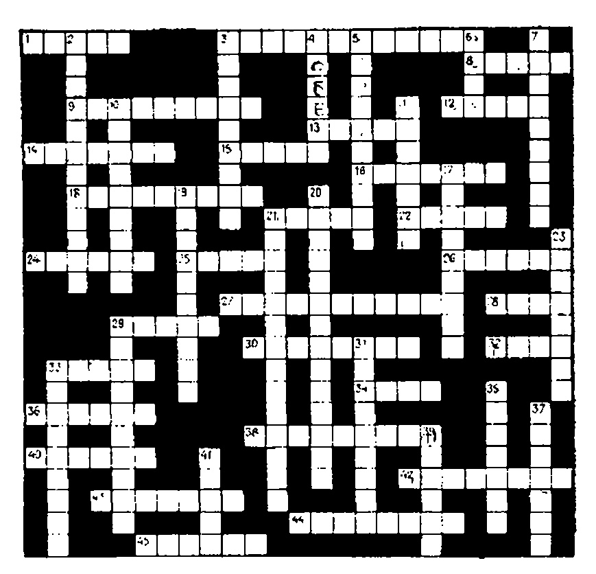

u_x + u_t = 0

$$, $-\infty < x < \infty$ , $0 < t < \infty$ , (НУ) $u(x, 0) = \cos x$ , $-\infty < x < \infty$ .

Как выглядит ее решение? Удовлетворяет ли оно уравнению и начальному условию?

2. Решите задачу

$$ \begin{array}{ll} ( \forall \forall \Pi ) & xu_x + tu_t + 2u = 0, \quad -\infty < x < \infty, \quad 1 < t < \infty, \\ ( H \forall ) & u \left( x, \ 1 \right) = \sin x, \quad -\infty < x < \infty. \end{array}

$$

Зверніть увагу, що процес починається з t=1. Які характеристики цього завдання? Побудуйте хронологію рішення для різних моментів часу. І, звісно, перевірте відповідь.

3. Решите многомерную задачу (поверхностные волны)

$$ \begin{array}{ll} (\mathrm{Y}\mathrm{H}\Pi) & au_x + bu_y + cu_t + du = 0, & -\infty < x < \infty, \\ & -\infty < y < \infty, \\ & 0 < t < \infty, \end{array}

$$

(\mathrm{H}\mathrm{Y}) \quad u\left(x,\,y,\,0\right) = e^{-(x^t + y^t)}, \quad -\infty < x < \infty, \quad -\infty < y < \infty, \end{array}

$$

где a, b, c и d-заданные константы. Ответ проверьте.

4. Решите задачу

$$

\begin{array}{ll} u_x + u_t + tu = 0, & -\infty < x < \infty, & 0 < t < \infty \\ u(x, 0) = F(x), & -\infty < x < \infty, & \end{array}

$$ и проверьте ответ.

5. Можно задавать решение u не только на линии t=0, но и на других кривых. И в самом деле, дифференциальное уравнение может не содержать времени в числе переменных (может зависеть только от пространственных переменных). Полытайтесь решить более общую задачу:

$$

(\text{УЧП}) \quad u_x + 2u_y + 2u = 0, \quad -\infty < x < \infty, \quad -\infty < y < \infty.

$$

Начальное условие задается в виде: u(x, y) = F(x, y) на кривой C: y = x (подразумевается, что функция F(x, y) задана).

# НЕЛИНЕЙНЫЕ УРАВНЕНИЯ ПЕРВОГО ПОРЯДКА (ЗАКОНЫ СОХРАНЕНИЯ)
МЕТА ЛЕКЦІЇ: Ввести понятие нелинейных уравнений первого порядка и показать, как некоторые из них (так называемые законы сохранения) можно использовать для описания физических явлений. Например, закон сохранения

$$

u_i + g(u)u_x = 0

$$

с начальным условием

$$

u(x, 0) = \varphi(x)

$$

используется для описания потока автомобилей на автостраде. Этот пример показывает, что уравнения с частными производными применимы не только в физике, биологии или технике. Более того, это нелинейное уравнение имеет разрывные решения, которые описывают ударные волны, распространяющиеся в потоке автомобилей вдоль дороги.

Одно из наиболее важных уравнений в частных производных — это закон сохранения

$$

u_t + f_x = 0.

$$

Этот закон утверждает, что увеличение некоторой физической величины  $u_t$  равно изменению потока— $f_x$  этой величины через поперечное сечение (поток, направленный слева направо, считается положительным). В динамике жидкости величина u(x,t) может обозначать плотность жидкости в точке x, а величина f(x,t)—поток жидкости (т. е. количество жидкости, протекающей через поперечное сечение в точке x в момент времени t). Мы не станем в этой лекции рассматривать динамику невязкой несжимаемой жидкости. Вместо этого мы покажем, как закон сохранения можно использовать для прогноза динамики дорожного движения (нас будет интересовать поток автомобилей, а не поток молекул воды).

Сначала займемся выводом закона сохранения.

# Вывод закона сохранения

Предположим, что автомобили движутся слева направо по скоростной автостраде, у которой нет боковых съездов и въездов. Обозначим

u(x, t) — плотность автомобилей в точке x (число автомобилей на единицу длины),

f(x, t) — ноток автомобилей в точке x (число автомобилей, проходящих через точку x в одну минуту).

Совершенно очевидно, что на участке дороги [a, b] изменение числа автомобилей (за единицу времени) дается следующими двумя выражениями:

Изменение числа автомобилей на  $[a, b] = \frac{d}{dt} \int_a^b u(x, t) dx$ 

И

Изменение числа автомобилей на  $[a,b] = f(a,t) - f(b,t) = -\int_{0}^{b} \frac{\partial f}{\partial x}(x,t)dx$ .

Последнее соотношение — следствие основной теоремы интегрального исчисления. Приравнивая эти два интеграла, получаем

$$

\int_{a}^{b} \frac{\partial u}{\partial t}(x, t) dx = -\int_{a}^{b} \frac{\partial f}{\partial x}(x, t) dx.

$$

Поскольку промежуток [a,b] произволен, делаем вывод, что подынтегральные функции равны, т е. выполняется закон сохранения

$$

u_t + f_x = 0.

$$

# Применение закона сохранения к задаче о дорожном движении

Уравнение  $u_t + f_x = 0$  по форме очень простое. Правда, в нем две неизвестные функции! Вопрос в том, как воспользоваться этим уравнением и что это нам даст5

В задачах дорожного движения пользуются экспериментально найденной зависимостью потока автомобилей f(u) от плотности автомобилей в данной точке u. Представляется очевидным, что если плотность u растет, то растет и поток f (по крайней мере в точке). Типичная модель дорожного движения задается формулой (см. рис. 28.1)

$$

f(u) = Au (1-u).

$$

Используются и другие модели:

- 1) f(u) = ku (линейный рост потока),
- 2)  $f(u) = u^2$  (квадратичный рост потока).

Рис. 28 1. Типичная зависимость потока от плотности.

Теперь мы подготовлены к тому, чтобы применить уравнение  $u_i+f_x=0$  к задаче дорожного движения. По правилу дифференцирования сложной функции  $f_x=\frac{df}{du}\,u_x$ ; значит, закон сохранения можно переписать в виде

$$

u_t + \frac{df}{du} u_x = u_t + g(u) u_x = 0.

$$

Пусть, например, зависимость потока от плотности квадратичная, т. е.  $f(u) = u^{2}$ , тогда закон сохранения принимает следующую форму:

$$

u_t + 2uu_x = 0.

$$

Если начальная плотность распределения автомобилей была  $u(x, 0) = \varphi(x)$ , то, чтобы найти плотность распределения в произвольный момент времени, необходимо решить задачу с начальным условием (задачу Коши):

$$

\begin{array}{lll} (\text{УЧП}) & u_t + 2uu_x = 0, & -\infty < x < \infty, & 0 < t < \infty, \\ (\text{HV}) & u\left(x, \ 0\right) = \varphi\left(x\right), & -\infty < x < \infty. \end{array}

$$ Займемся теперь решением нелинейной задачи Коши.

# Нелинейная задача с начальным условием (задача Коши)

Рассмотрим задачу

$$

\begin{array}{lll} (\mathsf{Y}\mathsf{P}\Pi) & u_t + g\left(u\right)u_x = 0, & -\infty < x < \infty, & 0 < t < \infty, \\ (\mathsf{H}\mathsf{Y}) & u\left(x, \ 0\right) = \varphi\left(x\right), & -\infty < x < \infty. \end{array}

$$ Вспомним предыдущую лекцию, где мы изучали уравнение конвективного переноса:

$$

u_t + vu_x = 0

$$.

У цьому рівнянні u(x, t) — це концентрація матерії в потоку, що рухається зі швидкістю v

$$

u_1 + g(u)u_x = 0

$$

и уравнением переноса. Будем считать, что частина воды в гочке $ x_0 $ движется со скоростью g(u) (вдоль по течению или против него). Тогда через t секунд координата частины будет

$$

x = x_0 + g(u) t

$$

 (уравнение характеристик).

Пам'ятайте, що концентрація u (x, t) не змінюється вздовж характеристики. Якщо ми знаємо початкову концентрацію $ u(x_a, 0) $ ,

Рис. 28.2. Характеристики уравнения $ u_t+g $ (u) $ u_x=0 $ ; a—общий вид характеристики, выходящей из т. ( $ x_0 $ , 0), вдоль характеристики решение остается постоянным и равным величине u ( $ x_0 $ , 0); b—пример характеристики, начинающейся из т. (2, 0), уравнения $ u_t+3uu_x=0 $ с u (2, 0)=1.

то уравнение характеристик принимает вид $ x = x_0 + g[u(x_0,  0)] t $ (уравнение характеристики, начинающейся в точке $ (x_0, 0) $ ).

Пусть, например, мы решаем задачу

(УЧП) 

$$

u_t + 3uu_x = 0

$$,  
(НУ) $ u(x, 0) =

$$

u_t = Du_{xx} - Vu_x.

$$

 $ Чтобы найти характеристику, выходящую из точки, например (2, 0), мы должны написать

$$

x = 2 + g[u(2, 0)]t =

$$

= $ 2 + g[1]t = $ = $ 2 + 3t $ .

Можна стверджувати, що розв'язок нашої задачі u(x, t) дорівнює одному на лінін x=2+3t, тобто u(2+3t, t)=1 для всіх t>0. Фіг. 28.2 показує характеристики загального випадку та цього конкретного завдання.

Тепер зрозуміло, що, знаючи характеристики в кожній точці і знаючи, що розв'язок за характеристиками не змінюється, можна отримати розв'язок $ u\left(x,\ t\right) $ у будь-який момент часу t. Ми не отримали явного виразу для $ u\left(x,\ t\right) $ через змінні x і t, але знання характеристик рівняння дозволяє розв'язати деякі цікаві задачі.

# Задача дорожного движения

Займемся моделью дорожного движения, в которой поток вычисляется по формуле $ f(u)=u^2 $ , а начальная плотность изо- Р И С

. 28.3. Начальная плотность автомобилей движущихся слева направо.

бражена на рис. 28.3. Другими словами, нам нужно решить задачу

$$

(\text{YUII}) \quad u_t + 2uu_x = 0, \quad -\infty < x < \infty, \quad 0 < t < \infty,

$$ (\text{HV}) \quad u(x, \ 0) =
$$

\begin{cases} 1, & x \leq 0, \\ 1 - x, & 0 < x < 1, \\ 0, & 1 \leq x. \end{cases}

$$ Начнем с определения характеристик, выходящих из точек вида $ (x_0, 0) $ . Для $ x_0 < 0 $ получаем

$$

x = x_0 + g [u(x_0, 0)] t =

$$

= $ x_0 + g [1] t = $ = $ x_0 + 2t $ .

Разрешая относительно t, находим уравнение характеристик

$$

t = \frac{1}{2} (x - x_0).

$$

Эти прямые линии изображены на рис. 28.4. Теперь рассмотрим точки $ 0 < x_0 < 1 $ . Здесь характеристики определяются следующими соотношениями:

$$

x = x_0 + g[u(x_0, 0)] t =

$$ = x_0 + g[(1 - x_0)] t =$$

= x_0 + 2(1 - x_0) t.

$$

Разремая последнее соотношение относительно t, получаем

$$

t = \frac{x - x_0}{2(1 - x_0)}.

$$

При $ 1 ≤ x_0 < ∞ $ характеристики

$$

x = x_0 + g[u(x_0, 0)]t =

$$

= $ x_0 + g[0]t = $ = $ x_0 $ приводят к вертикальным линиям, выходящим из точек хо. Все характеристики задачи изображены на рис. 28.4.

Рис. 28.4. Характеристики уравнения $ u_t + 2uu_x = 0 $ .

Ситуація на дорозі при 0 < t < 1/2 досить зрозуміла. Рис. 28.5 показує розв'язок нашої задачі в різні моменти часу. Зверніть увагу, що характеристики сходяться в одній точці t=1/2. Отже, щоб розв'язати задачу на t>1/2, потрібно використовувати інший метод. Коли характеристики сходяться в одній точці, говоримо про ударну хвилю (розрив розв'язку). Тепер потрібно відповісти на питання: на якій швидкості є передній край

ударной волны будет перемещаться вдоль автострады? Хотя это и не очевидно, но оказывается, что скорость распространения разрыва находится по формуле

$$

S = \frac{f(u_R) - f(u_L)}{u_R - u_L},

$$

где $ u_R $ и $ u_L $ —значения решения справа и слева от волнового фронта, а $ f(u_R) $ и $ f(u_L) $ —значения потока при этих плотностях.

Рис. 28.5. Плотность дорожного движения в различные моменты времени.

У нашому прикладі швидкість поширення щілини виявляється рівною одиниці. Насправді, якщо згадати цей $ f(u) = u^2 $ , то одразу отримуємо

$$

S = \frac{0-1}{0-1} = 1

$$.

Это означает, что при t>1/2 фронт волны будет перемещаться слева направо со скоростью единица.

Полное решение задачи

$$

(\text{Y} \, \Pi) \quad u_t + 2uu_x = 0, \quad -\infty < x < \infty,

$$ (\text{HY}) \quad u(x, \ 0) =
$$

\begin{cases} 1, & x \leq 0, \\ 1 - x, & 0 < x < 1, \\ 0, & 1 < x, \end{cases}

$$ изображено на рис. 28.5.
# ЗАУВАЖЕННЯ
1. Ударна хвиля в нашому прикладі виникає через те, що потік швидко зростає зі збільшенням густини u. Якщо потік заданий формулою f(u) = u, то рівняння було б у вигляді $ u_1+u_x=0 $ , і розв'язок цього рівняння представляє хвилю, що рухається вправо без спотворень. Якщо на мить замислитися над значенням формули f(u) = u, стає очевидно, що розв'язок рухатиметься таким чином.

2. Прямой подстановкой решения в виде

$$

u = \varphi(x - g(u) t)

$$

можно убедиться в том, что эта формула неявно определяет решение задачи

$$

\begin{array}{ll} u_t + g\left(u\right) u_x = 0, & -\infty < x < \infty, & 0 < t < \infty, \\ u\left(x, \ 0\right) = \varphi\left(x\right), & -\infty < x < \infty. \end{array}

$$ Например, решение задачи Коши

$$

(Y\Pi\Pi) \quad u_t + uu_x = 0,

$$ (HY) \quad u(x, 0) = x$$

неявно вадается соотношением

$$u = \varphi [x - g(u) t] =$$

= x - g(u) t = x - ut.

$$

У нашому конкретному випадку можливо отримати рішення у явній формі (у багатьох інших випадках це неможливо)

$$

u(x, t) = \frac{x}{1+t}.

$$

Проверьте, что эта функция действительно является решением нашей задачи.

# **ЗАДАЧИ**

1. Решите задачу Коши

$$

\begin{array}{lll} (\text{YUII}) & u_t + uu_x = 0, & -\infty < x < \infty, & 0 < t < \infty, \\ (\text{HV}) & u(x, \ 0) = \begin{cases} 0, & x < 0, \\ x, & 0 \leqslant x. \end{cases}

$$

Постройте график решения для различных моментов времени. Как вы интерпретируете это решение? Как выглядит соотношение между потоком и плотностью в этой задаче?

2. Решите задачу

$$

\begin{split} & (\text{УЧП}) \quad u_t + u^2 u_x = 0, \quad -\infty < x < \infty, \quad 0 < t < \infty, \\ & (\text{НУ}) \quad u_t(x, 0) = \begin{cases} 0, & x < 0, \\ x, & 0 \leqslant x. \end{cases}

$$

Какова здесь связь между потоком и плотностью? Совнадает ли поведение полученного решения с тем, что вы ожидали? Сравните решения задачи 1 и задачи 2.

3. Предположим, что невязкая жидкость течет по трубе и при этом просачивается через стенки по закону F(u) = ku (г/см·с). Закон сохранения (скорее закон изменения) в этом случае записывается в виде

$$

u_t + f_x = -F(u)

$$.

Знайдіть розв'язок цього рівняння, якщо f(u) = u і $ \varphi(x) = u $ (x, 0) (початковий розподіл задається загальним чином). Дайте тлумачення отриманого рішення.

4. Знайти розв'язок попереднього рівняння, якщо втрати визначаються функцією F(x, t) = 1/x. Перевірте розв'язок. Ви розумієте його фізичне значення?

5. Проверьте, что функция и, неявно заданная соотношением

$$

u = \varphi[x - g(u) t],

$$

является решением нелинейной задачи

$$

(\text{УЧП}) \quad \begin{array}{ll} u_1 + g(u) u_x = 0, \\ (\text{НУ}) & u(x, 0) = \varphi(x). \end{array}

$$ # СИСТЕМЫ УРАВНЕНИЙ С ЧАСТНЫМИ ПРОИЗВОДНЫМИ МЕТА ЛЕКЦІЇ: Познакомить читателя с тем фактом, что многие физические системы (особенно в динамике жидкости) нельзя описать одним уравнением. Для описания таких систем требуются системы связанных уравнений. В эти системы входят некоторые неизвестные функции, такие, как давление p(x, y, z, t), плотность $ \rho(x, y, z, t) $ , температура T(x, y, z, t) и их частные производные. Связи между этими функциями определяются физическими законами и наша задача — найти все эти функции одновременно.

В лекции будет показано, как можно решить линейную систему уравнений

$$

u_t + Au_x = 0

$$

если преобразовать ее в новую систему независимых уравнений

$$

v_1 + \Lambda v_x = 0,

$$

а затем независимо решить каждое уравнение этой системы.

У багатьох галузях науки існують системи величин, які взаємопов'язані не одним, а кількома відношеннями одночасно. Наприклад, у гідродинамікі це чотири рівняння

$$

u_t + uu_x + vu_y + \frac{1}{\rho} p_x = 0

$$

 (сохранение импульса вдоль оси $ x $ ), (29.1) $ v_t + uv_x + vv_y + \frac{1}{\rho} p_y = 0 $ (сохранение импульса вдоль оси $ y $ ), (сохранение массы), (сохранение массы), (сохранение массы), $ \left(\frac{p}{\rho^{\gamma}}\right)_t + u\left(\frac{p}{\rho^{\gamma}}\right)_x + v\left(\frac{p}{\rho^{\gamma}}\right)_y = 0 $ (сохранение энергии), $ p(x,  y, z, t) $ — давление в жидкости, $ u(x, y, z, t) $ — $ x $ -компонента скорости, $ v(x, y, z, t) $ — $ y $ -компонента скорости, $ \rho(x, y, z, t) $ — плотность жидкости.

Приведенная нелинейная система уравнений называется уравнениями Эйлера движения жидкости. Задача состоит в одновременном отыскании всех неизвестных функций р, и, v и р, которые удовлетворяли бы всем четырем уравнениям (вместе с начальными и граничными условиями).

Існують й інші причини вивчати системи рівнянь. У теорії звичайних диференціальних рівнянь (якщо читач пам'ятає) показано, що одне рівняння другого порядку можна представити як систему з двох рівнянь першого порядку. Хоча теорія диференціальних рівнянь у похідних не така проста, дуже часто одне рівняння з похідними у похідних порядків зводиться до системи диференціальних рівнянь першого порядку. Наприклад, телеграфне рівняння

$$

u_{tt} = c^2 u_{xx} + a u_t + b u

$$

путем введения трех новых переменных

$$

u_1 = u_1

$$ u_2 = u_2$$

u_3 = u_4

$$

можно свести к системе уравнений первого порядка

(29.2) 

$$

\begin{cases} \frac{\partial u_1}{\partial x} = u_2, \\ \frac{\partial a_1}{\partial t} = u_3, \\ \frac{\partial u_3}{\partial t} = c^2 \frac{\partial u_2}{\partial x} + au_3 + bu_4. \end{cases}

$$ Для того чтобы решать системы типа (29.2), необходимо хорошо знать такие понятия, как собственные значения и собственные векторы матрицы. По эфой причине мы предлагаем вниманию читателя краткий обзор линейной алгебры.

# Обзор линейной алгебры

Общий случай

Частный случай

Определение. Если А—квадратная матрица порядка n, то собственными значениями матрицы называются n корней характе-

Пусть 

$$

A =

$$ \begin{bmatrix} 1 & 1 \\ 4 & 1 \end{bmatrix}
$$.

ристического уравнения

$$\det\left(A-\lambda I\right)=0,$$

где $ \det(A-\lambda I) $ — определитель матрицы $ A-\lambda I $ .

Деякі власні значення можуть збігатися.

Тогда собственные значения являются корнями уравнения

$$\det
$$

\begin{bmatrix} 1-\lambda & 1\\ 4 & 1-\lambda \end{bmatrix}

$$ = (1-\lambda)^2 - 4 =$$

= \lambda^2 - 2\lambda - 3 = 0.

$$

Откуда 

$$

\lambda_1 = -1

$$, $ \lambda_2 = 3 $ .

Визначення. Якщо $ \lambda $ — власне значення матриці A, то відповідний власний вектор є таким ненульовим вектором, що задовольняє відношення

$$

Ax = \lambda x

$$.

Пример. Вектор $ X =

$$

u_t = -Vu_x

$$

 $ является собственным вектором, соответствующим собственному значению $ \lambda_2 = 3 $ , так как

$$

\begin{bmatrix} 1 & 1 \\ 4 & 1 \end{bmatrix}

$$ \begin{bmatrix} 1 \\ 2 \end{bmatrix}
$$

= 3

$$ \begin{bmatrix} 1 \\ 2 \end{bmatrix}
$$.

$$

Определение. Матрица $ A^{-1} $ называется обратной к матрице A, если

$$

AA^{-1} = A^{-1}A = I_1

$$

Пример, Обратной к

$$

A =

$$ \begin{bmatrix} 2 & -2 \\ 1 & 1 \end{bmatrix}
$$

является матрица

$$A^{-1} =
$$

\begin{bmatrix} 0.25 & 0.5 \\ -0.25 & 0.5 \end{bmatrix}

$$ ,$$

де I - одинична матриця.

поскольку

$$AA^{-1} = A^{-1}A =
$$

\begin{bmatrix} 1 & 0 \\ 0 & 1 \end{bmatrix}

$$ .$$

# Діагональна матриця

Нехай A — квадратна матриця порядку n і нехай всі її власні значення $ \lambda_1 $ , $ \lambda_2 $ ... $ \lambda_n $ різні. Побудуємо матрицю P так, щоб у неї були *стовпці* координати власних векторів (k-й стовпець містить власний вектор $ X_k $ , що відповідає власному значенню $ \lambda_k $ ), тобто

$$P =
$$

\begin{bmatrix} X_1 & X_{\tilde{2}} & \dots & X_n \\ X_{1} & X_{2} & \dots & X_n \end{bmatrix}

$$ =
$$

\begin{bmatrix} x_{11} & x_{1\tilde{2}} & \dots & x_{1n} \\ x_{21} & x_{22} & \dots & x_{2n} \\ \vdots & \vdots & \ddots & \vdots \\ x_{n1} & x_{n\tilde{3}} & \dots & x_{nn} \end{bmatrix}

$$ .$$

Тогда матрица Л, определяемая соотношением

$$\Lambda = P^{-1}AP,$$

где $ P^{-1} $ — обратная к матрице P, будет диагональной матрицей вида

$$\Lambda =
$$

\begin{bmatrix} \lambda_1 & & & \\ & \lambda_2 & 0 & \\ & & \ddots & \\ & & & \lambda_n \end{bmatrix}

$$ .$$

Например, у матрицы

$$A =
$$

\begin{bmatrix} 0 & 8 \\ 2 & 0 \end{bmatrix}

$$ собственные числа равны $ \lambda_ 1 = 4 $ и $ \lambda_2 = -4 $ , а собственные векторы соответственно

$$

X_1 =

$$ \begin{bmatrix} 2 \\ 1 \end{bmatrix}
$$

in $ X_2 =

$$

$$

 $ .

Значит, произведение

$$P^{-1}AP =
$$

\begin{bmatrix} 2 & -2 \\ 1 & 1 \end{bmatrix}

$$ ^{-1}
$$

\begin{bmatrix} 0 & 8 \\ 2 & 0 \end{bmatrix}

$$ \begin{bmatrix} 2 & -2 \\ 1 & 1 \end{bmatrix}
$$

= \\ =

$$ \begin{bmatrix} 1/4 & 1/2 \\ -1/4 & 1/2 \end{bmatrix}
$$

\begin{bmatrix} 0 & 8 \\ 2 & 0 \end{bmatrix}

$$ \begin{bmatrix} 2 & -2 \\ 1 & 1 \end{bmatrix}
$$

дорівнює діагональній матриці

$$\Lambda =
$$

\begin{bmatrix} 4 & 0 \\ 0 & -4 \end{bmatrix}

$$ .$$

(Читатель может проверить это самостоятельно.)

Тепер можна розв'язати просту систему з двох диференціальних рівнянь у похідних у похідних (з відповідними початковими умовами).

# Лінійне $ u_t + Au_x = 0 $ системне рішення.

Розглянемо задачу Коші для системи, що містить два рівняння та дві початкові умови:

(УЧП 1)

$$\frac{\partial u_1}{\partial t} + 8 \frac{\partial u_2}{\partial x} = 0$$,  
(29.3) (УЧП 2) $ \frac{\partial u_2}{\partial t} + 2 \frac{\partial u_1}{\partial x} = 0 $ , $ -\infty < x < \infty $ , $ 0 < t < \infty $ ,  
(HУ 1) $ u_1(x, 0) = f(x) $ ,  
(HУ 2) $ u_2(x, 0) = g(x) $ , $ -\infty < x < \infty $ .

Ця задача може відповідати визначенню $ u_1(x, t) $ тиску та густини $ u_2(x, t) $ як функції просторової координати x і часу t за відомими розподілами цих величин у початковий момент.

Запишемо систему рівнянь у матричній формі

$$ \begin{bmatrix} \frac{\partial u_1}{\partial t} \\ \frac{\partial u_2}{\partial t} \end{bmatrix}

$$

+

$$
\begin{bmatrix} 0 & 8 \\ 2 & 0 \end{bmatrix}
$$

\begin{bmatrix} \frac{\partial u_1}{\partial x} \\ \frac{\partial u_2}{\partial x} \end{bmatrix}

$$ =
$$

\begin{bmatrix} 0 \\ 0 \end{bmatrix}

$$ или $ (29 \ 4) $ 

$$

u_t + Au_s = 0

$$

где

$$

A =

$$ \begin{bmatrix} 0 & 8 \\ 2 & 0 \end{bmatrix}
$$, \quad u_1 =

$$ \begin{bmatrix} \frac{\partial u_1}{\partial t} \\ \frac{\partial u_2}{\partial t} \end{bmatrix}

$$, \quad u_x =

$$ \begin{bmatrix} \frac{\partial u_1}{\partial x} \\ \frac{\partial u_2}{\partial x} \end{bmatrix}

$$, \quad 0 =

$$ \begin{bmatrix} 0 \\ 0 \end{bmatrix}
$$.

$$

Введем новые неизвестные функции

$$

v =

$$ \begin{bmatrix} v_1 \\ v_2 \end{bmatrix}

$$

с помощью преобразования

$$u = Pv$$.

де P — матриця, стовпці якої містять власні вектори матриці A (матриця P, яку вже знають). Виявляється, що після такого перетворення буде отримана дуже проста система для визначення v (два рівняння відносно нового невідомого $ v_1 $ і $ v_2 $ виявляються незалежними). Це означає, що $ v_1 $ і $ v_2 $ легко знайти. Після $ v_1 $ і $ v_2 $ знайдено, згідно з формулою

$$u = Pv$$

находятся искомые функции и, и и2.

Спершу ж давайте розглянемо, як виглядає система визначення v. Диференціюючи дві частини співвідношення u = Pv, отримуємо

(29 5)

$$\frac{\partial u}{\partial t} = P \frac{\partial v}{\partial t},$$

\frac{\partial u}{\partial x} = P \frac{\partial v}{\partial x}.

$$

(Чтобы лучше понять дальнейшее изложение, читателю рекомендуется записать эти уравнен я в развернутой форме.)

Теперь подставим соотношения (29.5) в систему

$$

u_t + Au_x = 0

$$

и получим

$$

Pv_t + APv_x = 0.

$$

Если умножить теперь обе части последнего уравнения на $ P^{-1} $ , то получим

$$

v_t + P^{-1}APv_x = 0,

$$

или

$$

(29.6) v_t + \Lambda v_x = 0.

$$

Раньше мы уже видели, что для нашей матрицы

$$

\Lambda =

$$ \begin{bmatrix} 4 & 0 \\ 0 & -4 \end{bmatrix}
$$.

$$

Запишем (29.6) в развернутой форме

(29.7) 

$$

\frac{\frac{\partial v_1}{\partial t} + 4 \frac{\partial v_1}{\partial x} = 0, \\ \frac{\partial v_2}{\partial t} - 4 \frac{\partial v_2}{\partial x} = 0.

$$

Результатом є система з двох непов'язаних рівнянь, які можна розв'язати незалежно. Читач має знати, що розв'язки цих рівнянь — це хвилі, що рухаються

$$

v_1(x, t) = \varphi(x-4t),

$$

 $ v_2(x, t) = \psi(x+4t), $ где ф и ф-произвольные дифференцируемые функции.

Таким образом, мы нашли функции $ v_1 $ и $ v_2 $ . Для получения общего решения u нужно вычислить

$$

u = Pv =

$$ \begin{bmatrix} 2 & -2 \\ 1 & 1 \end{bmatrix}
$$

\begin{bmatrix} v_1 \\ v_2 \end{bmatrix}

$$ =$$

=

$$ \begin{bmatrix} 2 & -2 \\ 1 & 1 \end{bmatrix}
$$

\begin{bmatrix} \varphi(x - 4t) \\ \psi(x + 4t) \end{bmatrix}

$$ =$$

=

$$ \begin{bmatrix} 2\varphi(x - 4t) - 2\psi(x + 4t) \\ \varphi(x - 4t) + \psi(x + 4t) \end{bmatrix}
$$.

$$

Другими словами,

(29.8) 

$$

u_1(x, t) = 2\varphi(x-4t) - 2\psi(x+4t), u_2(x, t) = \varphi(x-4t) + \psi(x+4t).

$$

Следовательно, мы нашли общее решение системы двух уравнений (29.3).

Типичным решением (а их бесконечное число) могут быть, например, функции

$$

\phi(\xi) = \sin \xi, \ \psi(\xi) = \xi^2

$$

 (две произвольные функции)

и, следовательно,

$$

u_1(x, t) = 2 \sin(x-4t) - 2(x+4t)^2,

$$

 $ u_2(x, t) = \sin(x-4t) + (x+4t)^2. $ Подставим теперь общее решение (29.8) в начальные условия

$$

u_1(x, 0) = f(x),

$$

 $ u_2(x, 0) = g(x), $ в результате получаем

$$

2\varphi(x) - 2\psi(x) = f(x),

$$ \varphi(x) + \psi(x) = g(x),$$

откуда функци і ф и ф легко находятся:

$$\varphi(x) = \frac{1}{4} \left[ f(x) + 2g(x) \right],$$

\psi(x) = \frac{1}{4} \left[ 2g(x) - f(x) \right].

$$

**Тепе**рь можно написать решение задачи (29.3) в окончательном виде

$$

u_{1}(x, t) = 2\varphi(x-4t) - 2\psi(x+4t) =

$$ = \frac{1}{2} \left[ f(x-4t) + 2g(x-4t) \right] - \frac{1}{2} \left[ 2g(x+4t) - f(x+4t) \right],$$

(29.9)

$$u_{2}(x, t) = \varphi(x-4t) + \psi(x+4t) =$$

= \frac{1}{4} \left[ f(x-4t) + 2g(x-4t) \right] + \frac{1}{4} \left[ 2g(x+4t) - f(x+4t) \right].

$$
# ЗАУВАЖЕННЯ
1. Многие численные методы ориентированы на решение систем уравнений и, значит, многне программы для ЭВМ написаны так, чтобы решать системы уравнений первого порядка. По этой причине, прежде чем воспользоваться программои, приходится преобразовать свое уравнение высокого порядка в систему уравнений первого порядка.

2. Линейную систему

$$

u_t + A(x, t) u_x + B(x, t) u = 0

$$

можна розв'язати тим самим методом, що й система $ u_t + Au_x = 0 $ . Різниця полягає в тому, що в цьому випадку матриця P із власних векторів матриці A(x, t) буде функцією від x і t.
# ЗАДАЧІ
1. Запишите систему уравнений (29.2) в матричной форме

$$

Au_t + Bu_x + Cu = 0,

$$

где A, B и C-матрицы третьего порядка.

2. Найдите собственные векторы и собственные значения матрицы

$$

A =

$$ \begin{bmatrix} 1 & 1 \\ 4 & 1 \end{bmatrix}
$$.

$$

3. Воспользовавшись результатами задачи 2, решите систему

$$

\begin{cases} \frac{\partial u_1}{\partial t} + \frac{\partial u_1}{\partial x} + \frac{\partial u_2}{\partial x} = 0, \\ \frac{\partial u_2}{\partial t} + 4 \frac{\partial u_1}{\partial x} + \frac{\partial u_2}{\partial x} = 0. \end{cases}

$$ УКАЗАНИЕ. Запишите сначала систему в матричной форме.

4. Проверьте формулы (29.5), записав их в скалярной форме.

5. Проверьте, что функции $ u_1 $ и $ u_2 $ из (29.8) удовлетворяют обоим уравнениям (29.3).

# КОЛЕБАНИЯ МЕМБРАНЫ (ВОЛНОВОЕ УРАВНЕНИЕ В ПОЛЯРНЫХ КООРДИНАТАХ)
МЕТА ЛЕКЦІЇ: Показать, что колебания мембраны можно описать волновым уравнением

$$

u_{tt} = c^2 \left( u_{rr} + \frac{1}{r} u_r + \frac{1}{r^2} u_{\theta\theta} \right)

$$.

Если искать решение этого уравнения в виде стоячих волн:

$$

u(r, \theta, t) = P(r) \Theta(\theta) T(t),

$$

то оно распадается на три обыкновенных дифференциальных уравнения:

$$

T'' + \lambda^2 c^2 T = 0

$$

 (уравнение гармонических колебаний), $ r^2 R'' + rR' + (\lambda^2 r^2 - n^2) R = 0 $ (уравнение Бесселя), (уравнение гармонических колебаний).

Все произведения $ R(r) \Theta(\theta) T(t) $ решений этих трех обыкновенных дифференциальных уравнений описывают основные колебания мембраны, а функции $ R(r) \Theta(\theta) $ описывают форму мембраны. Чтобы найти колебания мембраны при произвольных начальных условиях, мы составим такую комбинацию фундаментальных решений, чтобы начальные условия удовлетворялись.

Цель этой лекции ясна—найти колебания круглой мембраны с заданными начальными и граничными условиями. Для простоты будем считать, что радиус мембраны равен единице, а смещение по границе равно нулю. Пусть $ u\left(r,\theta,t\right) $ обозначает возвышение точек мембраны под плоскостью равновесия. Нам необходимо решить задачу (см. рис. 30.1)

$$

\begin{array}{lll} (\text{УЧП}) & u_{tt} = c^2 \left( u_{rr} + \frac{1}{r} u_r + \frac{1}{r^2} u_{\theta\theta} \right), & 0 < r < 1, \ 0 < t < \infty, \\ (\text{ГУ}) & u = 0 & \text{при } r = 1, & 0 < t < \infty, \\ (\text{НУ}) & \begin{cases} u = f(r, \ \theta) \\ u_t = g(r, \ \theta) \end{cases} & \text{при } t = 0. \end{array}

$$ Щоб розв'язати цю задачу, згадаємо проблему коливань скрипкових струн із лекції 20, яку розв'язали суперпозицією нескінченної кількості простих коливань. Якщо ви використовуєте-

ся этим же подходом, то решения следует искать в виде

$$

u(r, \theta, t) = U(r, \theta) T(t)

$$.

Форма этих колебаний определяется функцией $ U(r, \theta) $ , а характер осцилляций — множителем T(t).

Подставив это представление в волновое уравнение (см. задачу 1), получим два уравнения

$$

\Delta U + \lambda^2 U = 0

$$

 (уравнение Гельм-гольца),

$$

T'' + \lambda^2 c^2 T = 0

$$

 (уравнение гармонических колебаний),

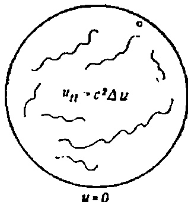

Рис. 30.1. Қолеблющаяся мембрана (гиперболическая смешанная задача).

где

$$

\Delta U = U_{rr} + \frac{1}{r} U_r + \frac{1}{r^2} U_{\theta\theta}.

$$

Зверніть увагу, що тут ми вимагаємо, щоб константа розділення була додатною (тому позначимо її $ \lambda^{2-1} $ )). Лише в цьому випадку функції T(t) будуть періодичними.

На следующем шаге мы решим уравнение Гельмгольца, но сначала разберемся с граничным условием для него. Чтобы найти его, подставим $ u(r,  \theta, t) = U(r, \theta) T(t) $ в граничное условие для мембраны

$$

u(1, \theta, t) = U(1, \theta) T(t) = 0, \quad 0 < t < \infty,

$$

или

$$

U(1, \theta) = 0.

$$

Следовательно, для того чтобы найти форму фундаментальных колебаний мембраны, необходимо решить задачу

$$

\Delta U + \lambda^2 U = 0,

$$ U(1, \theta) = 0.$$

\begin{cases} \Delta U + \mu u = 0 & \text{в круге,} \\ U = 0 & \text{на границе круга} \end{cases}

$$ при  $\mu \le 0$  имеет только тривиальное решение U=0. — Прим. ред.

1) Поскольку краевая задача

Это хорошо известная эллиптическая задача на собственные значения, и нам надо найти все  $\lambda$ , при которых она имеет ненуленые решения. Решения  $U\left(r,\,\theta\right)$  описывают форму фундаментальных колебаний мембраны, а собственные числа  $\lambda$  являются нулями некоторых функций Бесселя и пропорциональны частотам этих колебаний.

Итак, нам предстоит теперь решить задачу на собственные значения для уравнения Гельмгольца (эта задача очень важна и сама по себе). Будем решать ее тем же методом, что и другие линейные однородные уравнения с нулевыми граничными условиями, а именно методом разделения переменных.

# Решение задачи на собственные значения для уравнения Гельмгольца

Чтобы решить задачу

$$

\begin{array}{ll} (\mathsf{Y}\mathsf{H}\mathsf{\Pi}) & \Delta U + \lambda^2 U = 0, \\ (\mathsf{\Gamma}\mathsf{Y}) & U(1, \theta) = 0, \end{array}

$$ подставим

$$

U(r, \theta) = R(r) \Theta(\theta)

$$

в задачу Гельмгольца. Сделав это, получаем

$$

r^2R'' + rR' + (\lambda^2r^2 - n^2)R = 0

$$

 (уравнение Бесселя), $ R(1) = 0 $ , $ \Theta'' + n^2\Theta = 0 $ (Зроби все сам). Зверніть увагу, що ми обрали константу розбиття $ n^2 $ , $ n=0,. \ 1,\ 2,\ \ldots $ тому, що хочемо, щоб функції $ \Theta\left(\theta\right) $ були періодичними з періодом $ 2\pi $ . Очевидно, що форма мембрани є періодичною функцією $ \theta $ . Отже, щоб розв'язати задачу Гельмгольца, потрібно розв'язати два звичайних диференціальні рівняння

$$

r^2R'' + rR' + (\lambda^2r^2 - n^2) R = 0

$$, $ 0 < r < 1 $ , $ R(0) < \infty $ (физическое ограничение), $ R(1) = 0 $ , $ \Theta'' + n^2\Theta = 0 $ .

# Уравнение Бесселя

Уравнение

$$

r^2R'' + rR' + (\lambda^2r^2 - n^2)R = 0

$$

жорошо известно в теории обыкновенных дифференциальных уравнений. Это так называемое уравнение Бесселя. Оно имеет два

линейно-независимых решения $ R_{1}(r) = A J_{n}(\lambda r) $ функция Бесселя *первого* рода *п*-го порядка, $ R_{2}(r) = BY_{n}(\lambda r) $ функция Бесселя второго рода n-го порядка,

и, следовательно, общее решение этого уравнения представимо в виде

$$

R(r) = AJ_n(\lambda r) + BY_n(\lambda r).

$$

Зверніть увагу, що рішення залежать від параметрів n і $ \lambda $ , включених у рівняння. Деякі графіки функції Бесселя показані на рис. 30.2. Щоб визначити функції $ J_ n(\lambda r) $ і $ Y_n(\lambda r) $ , можливо

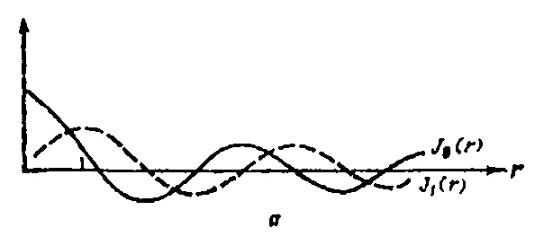

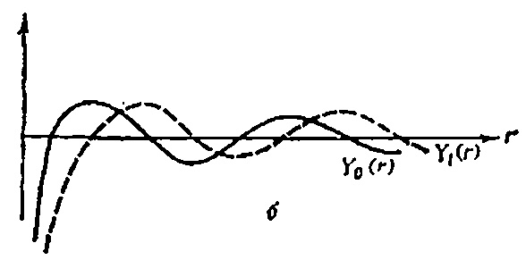

Рис. 30 2 Функции Бесселя. a — функции Бесселя первого рода; $ \pmb{\delta} $ — функции Бесселя второго рода.

використовуйте метод Фробеніуса, який дозволяє знаходити R(r) у вигляді силових рядів. Цей метод містить два лінійно незалежні ряди ступенів $ J_n(\lambda r) $ та $ Y_n(\lambda r) $ . Оскільки функція $ Y_n(\lambda r) $ не обмежена в r=0, ми обираємо розв'язок у вигляді

$$

R(r) = AJ_n(\lambda r).

$$

Последний шаг в определении $ R\left( r\right) $ связан с использованием граничного условия $ R\left( \mathbf{l}\right) =0 $ для определения всех $ \lambda $ (в данный

Таблица 30.1

| Корни | уравнений. | $ J_n(r) = 0 $ |
|-------|------------|--------------|
|-------|------------|--------------|

| Γ | 1 | n     |       |       |       |       |  |  |
|---|---|-------|-------|-------|-------|-------|--|--|
|   |   | 0     | 1     | 2     | 3     | 4     |  |  |
|   | 1 | 2,40  | 3,83  | 5,13  | 6,38  | 7,59  |  |  |
| ı | 2 | 5,52  | 7,02  | 8,42  | 9,76  | 11,06 |  |  |
| ľ | 3 | 8,65  | 10,17 | 11,62 | 13,02 | 14,37 |  |  |
|   | 4 | 11,79 | 13,32 | 14,80 | 16,22 | 17,62 |  |  |
|   | 5 | 14,93 | 16,47 | 17,96 | 19,41 | 20,83 |  |  |
|   | . | •     |       | •     |       | •     |  |  |
|   |   |       | •     |       | •     | •     |  |  |
|   | • | •     | •     | •     | •     | •     |  |  |

момент нас не интересует коэффициент A). Подставляя R (1) = 0, в R (r) = $ J_n $ ( $ \lambda r $ ), получаем $ J_n $ ( $ \lambda $ ) = 0. Другими словами, для того чтобы функция R (r) обращалась в нуль на границе круга, мы должны выбрать константу разделения так, чтобы она была корнем уравнения $ J_n $ (r) = 0, $ \tau $ . e.

$$

\lambda = k_{nm}

$$

где $ k_{nm} $ — m-й корень уравнения $ J_n(r) = 0 $ .

Таблиці цих коренів добре відомі, але їх можна обчислити на комп'ютері. Значення перших кількох коренів наведені в Таблиці 1. 30.1. Знаючи ці корені, ми можемо одразу побудувати розв'язок задачі граничного значення для рівняння Гельмгольца. Якщо власні значення $ \lambda = k_{nm} $ , то власні функції $ U_{ nm}(r) $ визначаються формулою

$$

U_{nm}(r, \theta) = J_n(k_{nm}r) [A \sin(n\theta) + B \cos(n\theta)].

$$

На рис. 30.3 изображены некоторые из этих функций для различных значений n и m. Общая форма функции $ U_{nm}(r,\theta) $ не зависит от значений констант A и B. Эти константы влияют только на амплитуду колебаний и расположение линии узлов относительно $ \theta=0 $ .

Каждая функция представляет собой фундаментальное колебание круглой мембраны с частотой

$$

f_{nm} = k_{nm}c/2\pi.

$$

Эти частоты мы нашли из решений

$$

T_{nm}(t) = A \sin(k_{nm}ct) + B \cos(k_{nm}ct)

$$

# уравнения

$$

T'' + k_{nm}^2 c^2 T = 0.

$$

Интересно отметить, что отношение частоты колебания $ U_{nm}(\mathbf{r}, \mathbf{\theta}) $ к частоте основного колебания $ U_{nt}(\ma

$$

sU(x) = -V \frac{dU}{dx}, \quad 0 < x < \infty,

$$

 \begin{cases} u(R_1, \theta) = g_1(\theta), \\ u(R_2, \theta) = g_2(\theta). \end{cases}

$$

U(0) = P/s.

$$

 \begin{cases} 2/3, & n=1, \\0 & \text{для всіх інших } n, \\ d_n=\begin{cases} -2/3, & n=1, \\0 & \text{для всіх інших} n. \end{cases}

$$

H(\xi) =

$$

 \begin{cases} 1, & 0 \le \theta < \pi, \\ 0, & \pi \le \theta < 2\pi. \end{cases}

$$

\begin{cases} 0, & \xi < 0, \\ 1, & \xi \geqslant 0. \end{cases}

$$

INL1448X (\Gamma Y) $ $ u(1, \varphi) = \cos(3\varphi) $ .

Используя тригонометрию, попытайтесь выразить $ \cos{(3\phi)} $ через $ \cos{\phi}, \, \cos^2{\phi}, \, \cos^3{\phi}, \, a $ затем скомбинируйте их так, чтобы по-

лучилось разложение

$$

\cos(3\varphi) = a_0 P_0(\cos\varphi) + a_1 P_1(\cos\varphi) + \dots

$$

5. Решите задачу Дирихле в шаре

$$

\Delta u = 0, \quad 0 < r < 1, \quad 0 \le \varphi \le \pi, \quad 0 \le \theta < 2\pi.

$$ u(1, \varphi) =
$$

\begin{cases} 1, & 0 \le \varphi \le \pi/2, \\ -1, & \pi/2 < \varphi \le \pi. \end{cases}

$$ В этой задаче верхняя полусфера нагрета (+1), а нижняя охлаждена (-1).

6. Найдите решение задачи Дирихле в шаре

(УЧП) 

$$

\Delta u = 0

$$, $ 1 < r < \infty $ , $ 0 \le \varphi \le \pi $ , $ 0 \le \theta < 2\pi $ , $ (\Gamma Y) $ $ u(1, \varphi) = 1 + \cos \varphi $ .

Проверьте ответ.

Лекция 36

# НЕОДНОРОДНАЯ ЗАДАЧА ДИРИХЛЕ (ФУНКЦИЯ ГРИНА)

МЕТА ЛЕКЦІЇ: Показати, як гетерогенну задачу Діріхле можна розв'язати за допомогою функції Гріна (вихідної функції). У цьому важливому методі права частина рівняння розглядається як певна вхідна дія і розкладається на неперервний набір дельтаподібних джерел, розподілених по заданій площі. Потім визначається відповідь системи на кожне таке джерело (функція Гріна), і всі відповіді підсумовуються (інтегровані). У результаті ми отримуємо повне розв'язання проблеми.

Достаточно общей задачей прикладной математики является определение потенциала в некоторой области пространства, если задано распределение источников f(x, y) енутри этой области. В электростатике потенциал (в вольтах) в области D обусловлен распределением зарядов с плотностью f(x, y) по этой области. Типичная задача — определение потенциала в круге в двумерном случае.

В такой задаче потенциал должен удовлетворять уравнению

Пуассона (например, с нулевыми граничными условиями)

(36.1) (УЧП) 

$$

u_{rr} + \frac{1}{r} u_r + \frac{1}{r^2} u_{\theta\theta} = f(r, \theta), \quad 0 \le r < 1, \quad 0 \le \theta < 2\pi,

$$

(ГУ) $ u(1, \theta) = 0, \quad 0 \le \theta \le 2\pi. $ Ми не випадково обрали нульові умови. Якщо б ми хотіли розв'язати задачу в загальному випадку, з ненульовими граничними умовами та неоднорідним рівнянням, то внесок неоднорідних граничних умов можна було б знайти за допомогою формули інтегралу Пуассона з лекції 33.

Чтобы получить хоть какое-то представление о неоднородных дифференциальных уравнениях, давайте рассмотрим графически решение следующей задачи для уравнения Пуассона:

(УЧП) 

$$

\Delta u = -q

$$, $ 0 < r < 1 $ , $ 0 \le \theta \le 2\pi $ ( $ q $ —положительная константа),

(HY) 

$$

u(1, \theta) = 0, \quad 0 \le \theta \le 2\pi.

$$

На межі потенціал (або температура, якщо ви бажаєте) утримується на нулі, а лапласіан дорівнює q у всіх точках області. Оскільки $ \Delta u\left(p\right) $ слугує мірою різниці між функцією $ u\left(p\right) $ і її середнім, рівняння Пуассона стверджує, що поверхня $ u\left(r\right) $ завжди опукла вниз. Інакше кажучи, вона виглядатиме як тонка мембрана з нерухомим краєм, яка здувається зверху вниз потоком повітря.

Якщо права частина рівняння f(x, y) змінюється від точки до точки, то опуклість також буде змінною функцією точки цієї області.

Перейдем теперь к главной части нашей лекции: определению функции Грина и решению уравнения (36.1).

Сначала, однако, мы должны ввести понятие потенциала точеных источников и стоков.

# Потенциалы точечных источников и стоков

Щоб розв'язати неоднорідне лінійне рівняння, достатньо розв'язати це рівняння за допомогою точкового джерела, оскільки розв'язок задачі в загальному випадку можна знайти, підсумувавши внески з точкових джерел. Наше завдання — визначити потенціал, який створює точкове джерело (або поглинач) у певній області. Ці джерела можна інтерпретувати по-різному. У теорії теплопровідності джерело можна розглядати як точку, де походить тепло, а дренаж — як точку, де поглинає тепло. В електростатиці джерело можна розглядати як окремий позитивний заряд (протон), а дренаж — як окремий негативний заряд (електрон). У будь-якому разі, незалежно від інтерпретації, ми знайдемо двовимірний потенціал і,

создаваемый единичным точечным источником (поиск трехмерного потенциала мы оставляем читателю в качестве упражнения).

Припустимо, що єдине точкове джерело +q розташоване в початку Clear that heat (або щось інше)

будет вытекать из области вдоль радиальных линий, и, следовательно, для везничны полного потока, протекающего через окружность радиуса r можно записать

Полный поток, вытекающий через окруж-

HOCTD 

$$

= -\int_{0}^{2\pi} u_{r}(r) r d\theta = -2\pi r u_{r}(r).

$$

Но полный поток должен совпадать с количеством тепла, созданного внутри круга (закон сохранения), т. е.

$$

-2\pi r u_r(r) = q.

$$

Решая это диф реренциальное уравнение относительно функции u(r), получаем Р И С

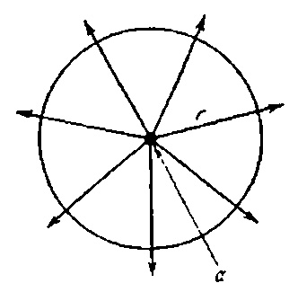

36 1 Радиальный поток тепла от точечного источника; a —тепло выделяется в начале координат.

$$

u(r) = \frac{-q}{2\pi} \ln r = \frac{q}{2\pi} \ln \frac{1}{r}.

$$

(Решение изображено на рис. 362)

В электростатике разность потенциа тов u(B) - u(A) равна работе, которую необходимо совершить, чтобы переместить единичный положительный заряд из точки A в точку B (рис. 36.2).

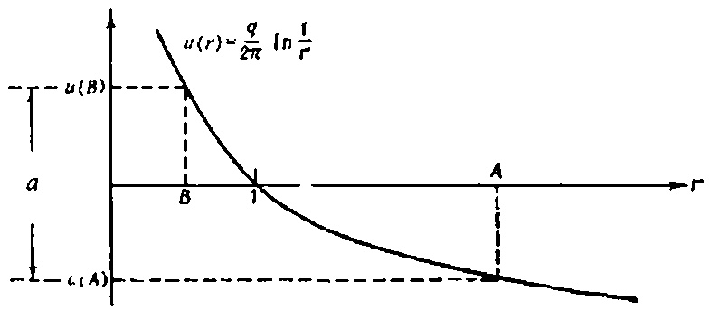

Рис. 36 2 Потенциал точечного заряда в двумерном случае. $ \alpha $ — работа, необходимая для перемещения единичного заряда из A в B

Стік можна інтерпретувати як від'ємне джерело, так що стік -q створює потенціал

$$

u\left(r\right)=-\frac{q}{2\pi}\ln\frac{1}{r}.

$$

Этим завершается обсуждение потенциалов точечных зарядов. Теперь мы готовы к решению неоднородного уравнения методом функции Грина.

# Уравнение Пуассона в круге

Займемся решением очень важной задачи

(36.2) 

$$

(Y \cup \Pi)

$$

 $ u_{rr} + \frac{1}{r} u_r + \frac{1}{r^2} u_{\theta\theta} = f(r, \theta), \quad 0 < r < 1, \quad 0 \le \theta \le 2\pi, $ $ (\Gamma Y) $ $ u(1, \theta) = 0, \quad 0 \le \theta \ le 2\pi. $ **М**етод функции Грина (метод функции источника) состоит из двух шагов.

1. Помещаем в точку $ (\rho, \varphi) $ точечный единичный заряд и находим потенциал $ G(r, \theta, \rho, \varphi) $ , который создается этим зарядом и обращается в нуль на границе.

2. Суммируем индивидуальные отклики $ G(r, \theta, \rho, \phi) $ , взвешенные правой частью (плотностью зарядов) $ f(r, \theta) $ , по всему кругу. В результате получаем искомое решение

$$

u\left(r,\;\theta\right) = \int_{0}^{2\pi} \int_{0}^{1} G\left(r,\;\theta,\;\rho,\;\varphi\right) f\left(\rho,\;\varphi\right) \rho \; d\rho \; d\varphi.

$$

Найдем теперь функцию источника для нашей задачи.

# Определение функции источника $ G(r, \theta, \rho, \phi) $ Замінимо праву частину $ f(r,\theta) $ рівняння точковим джерелом величини 1, розташованим у деякій довольно обраній точці $ (\rho, \varphi) $ . Математично точкове джерело представлене дельта-функцією $ \delta(r-\rho, \theta-\varphi)^1 $ ). Ми вважаємо, що дельта-функція дорівнює нулю всюди, крім точки $ (\rho, \varphi) $ , де розташований одиничний заряд. У мові сил дельта-функцію можна інтерпретувати як точкова одиниця сили, прикладена до точки $ (\rho, \varphi) $ . Наше завдання — знайти потенціал точкового заряду, якщо відомо, що він дорівнює нулю на межі. Функція, яка задовольняє ці умови, називається функцією Гріна або функцією джерела. Вона дорівнює *відповіді* системи в точці $ (r, \theta) $ на *джерело*, розташоване в точці $ (\rho, \varphi) $ . Складність розв'язання цієї проблеми полягає в тому, що бажаний потенціал має зрівнятися з нулем на кордоні. Якби не ця умова, потенціал можна було б легко знайти, адже ми вже знаємо, що

См.: Владимиров В. С. Обобщенные функции в математической физике — М.: Наука, 1976. — Прим ред.

потенциал точечного заряда равен

$$

\frac{1}{2\pi} \ln \left( \frac{1}{r} \right)

$$,

где r — расстояние от заряда до точки наблюдения.

Искомый потенциал может иметь следующий физический смысл:

1. В теории теплопроводности — это равновесная температура внутри круга, если тепловой источник размещается в точке (о. ф),

а на границе поддерживается ну-

левая температура.

- 2. Він описує відхилення мембрани від положення рівноваги, якщо відхилення на межі дорівнюють нулю, а в точці (p. f) мембрана зігнута до дуже великої висоти.
- 3. В електростатиці це розподіл потенціалу всередині кола, якщо точковий позитивний заряд розташований у точці $ (\rho, \phi) $ , а коло заземлене, а його потенціал підтримується на нулі.

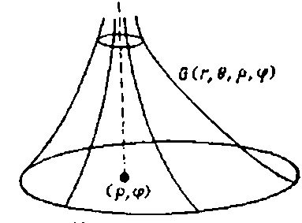

Единичная окружность РИС. 36 3. Функция Гряна 6 (г. 0. р, ф) точечного источника, расположенного в точке (р, ф).

Теперь найдем функцию Грина; она будет похожа на функцию, изображенную на рис. 36.3.

# Построение решения

ШАГ 1. Поскольку функция

$$

\frac{1}{2\pi} \ln \frac{1}{R}

$$

является потенциалом поля в точке $ p = (r, \varphi)  \theta) $ , которое создано единичным точечным зарядом, помещенным в точку $ Q = (\rho, \phi) $ , $ (R-paccmonnue\ between\ points\ P\ and\ Q) $ единственное, что нам осталось сделать—так изменить эту функцию, чтобы она обратилась в нуль на границе.

ЩАГ 2. Из эксперимента известно, что эквипотенциальные линии точечных зарядов (положительных или отрицательных) представляют собой окружности (рис. 36.4).

Основна ідея побудови функції Гріна така: потрібно розмістити інший (від'ємний) заряд поза колом так, щоб загальний потенціал на колі r = 1 був сталим. Для гему можна відняти цю константу з потенціалу і отримати нульовий потенціал на межі. Очевидно. Таким чином знайдений потенціал матиме всі властивості функції $ G(r, \theta, \rho, \phi) $ . Залишається незрозумілим, у якій точці за межами кола слід розмістити негативний заряд, щоб потенціал на колі став сталим. Можливо порівняльно P И С

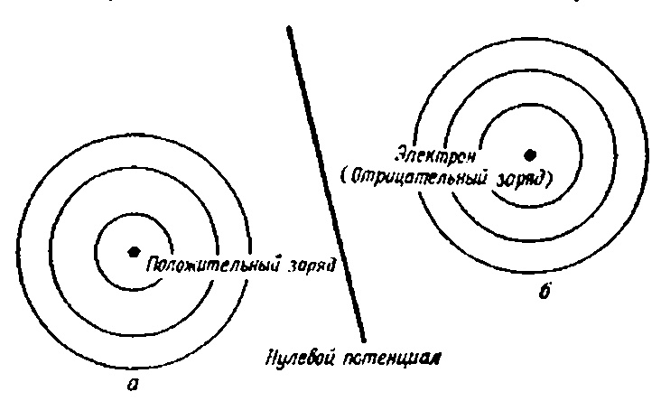

. 36 4. Потенциал поля, образованного двумя противоположно заряженными частицами; a, b— линии (окружности) постоянного потенциала.

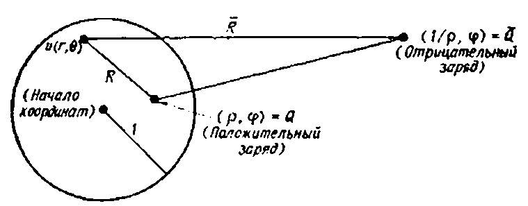

**РИС.** 36.5. Заряды Q в $ \overline{Q} $ дают постоянный потенциал на окружности r=1.

Легко побачити, що якщо негативний заряд розміщений у точці $ \bar{Q} = (\bar{\rho}, \bar{\phi}) = (1/\rho, \phi) $ , то повний потенціал

$$

u(r, \theta) = \frac{1}{2\pi} \ln 1/R - \frac{1}{2\pi} \ln 1/\overline{R}

$$

буде сталою на колі r=1 Тут відстані від зарядів до точки (g, c) позначаються R і $ \overline{R} $ (див. рис. 36.5). Можна показати, що величина потенціалу на колі r = 1 визначається виразом

$$

-\frac{1}{2\pi}\ln\rho

$$

 (положительная константа).

С учетом этого результата строим функцию Грина

(36.3) 

$$

G(r, \theta, \rho, \phi) = \frac{1}{2\pi} \ln 1/R - \frac{1}{2\pi} \ln 1/\overline{R} + \frac{1}{2\pi} \ln \rho,

$$

Потенциал положентельного заряда, расположенного в тенциал границы постоянного в тенциал границы постоянного в тенциал границы постоянного в тенциал границы постоянного в тенциал границы постоянного в тенциал границы постоянного в тенциал границы постоянного в тенциал границы постоянного в тенциал границы постоянного в тенциал границы постоянного в тенциал границы постоянного в тенциал границы постоянного в тенциал границы постоянного в тенциал границы постоянного в тенциал границы постоянного в тенциал границы постоянного в тенциал границы постоянного в тенциал границы постоянного в тенциал границы постоянного в тенциал границы постоянного в тенциал границы постоянного в тенциал границы постоянного в тенциал границы постоянного в тенциал границы постоянного в тенциал границы постоянного в тенциал границы постоянного в тенциал границы постоянного в тенциал границы постоянного в тенциал границы постоянного в тенциал границы постоянного в тенциал границы постоянного в тенциал границы постоянного в тенциал границы постоянного в тенциал границы постоянного в тенциал границы постоянного в тенциал границы постоянного в тенциал границы постоянного в тенциал границы постоянного в тенциал границы постоянного в тенциал границы постоянного в тенциал границы постоянного в тенциал границы постоянного в тенциал границы постоянного в тенциал границы постоянного в тенциал границы постоянного в тенциал границы постоянного в тенциал границы постоянного в тенциал границы постоянного в тенциал границы постоянного в тенциал границы постоянного в тенциал границы постоянного в тенциал границы постоянного в тенциал границы постоянного в тенциал границы постоянного в тенциал границы постоянного в тенциал границы постоянного в тенциал границы постоянного в тенциал границы постоянного в тенциал границы постоянного в тенциал границы постоянного в тенциал границы постоянного в тенциал границы постоян границы постоян границы постоян границы постоян границы постоян

где

$$

R = V \frac{r^2 - 2\rho r \cos(\theta - \phi) + \rho^2}{R},

$$ \overline{R} = V \frac{r^2 - 2\frac{r}{\rho}\cos(\theta - \phi) + 1/\rho^2}{r^2 - 2\frac{r}{\rho}\cos(\theta - \phi) + 1/\rho^2}$$

Формули, що виражають відстань між двома точками в полярних координатах. Щоб знайти розв'язок початкової проблеми, потрібно накласти всі імпульсні характеристики системи. Отже, переходимо до останнього кроку.

КРОК 3. Суперпозиція імпульсних характеристик Цей крок досить простий. З відношення

$$u(r, \theta) = \int_{0}^{2\pi} \int_{0}^{1} G(r, \theta, \rho, \varphi) f(\rho, \varphi) \rho d\rho d\varphi$$

получаем

(36.4)

$$u(r, \theta) = \frac{1}{2\pi} \int_{0}^{2\pi} \int_{0}^{1} \ln (\rho \overline{R}/R) f(\rho, \varphi) \rho d\rho d\varphi.$$

Формула (36.4) виражає розв'язок задачі Діріхле для рівняння Пуассона всередині кола через функцію Гріна цієї задачі. Якщо щільність заряду $ f(r, \theta) $ відома, то інтеграл можна обчислити, наприклад, чисельно.
# ЗАУВАЖЕННЯ
1. Задачу

$$ \begin{array}{lll} (\text{УЧ\Pi}) & \Delta u = 0, & 0 < r < 1, & 0 \leqslant \theta < 2\pi, \\ (\text{ГУ}) & u(1, \theta) = g(\theta), & 0 \leqslant \theta \leqslant 2\pi, \end{array}
$$

також можна розв'язати за допомогою методу *функції Гріна*. У цьому випадку рішення фіксується у формі

$$u(r, \theta) = \int_{0}^{2\pi} \frac{\partial G}{\partial r} (r, \theta, 1, \varphi) g(\varphi) d\varphi.$$

Останнє відношення можна надати більш обчислювально корисну форму, явно виставляючи вираз у $ \partial G/\partial r $ . Внаслідок цього ми отримуємо інтегральну формулу Пуассона, знайдену раніше в лекції 33.

(36.5)

$$u(r, \theta) = \frac{1}{2\pi} \int_{0}^{2\pi} \left[ \frac{1 - r^2}{1 - 2r\cos(\theta - \varphi) + r^2} \right] g(\varphi) d\varphi.$$

2. Решение общей задачи Дирихле

$$ \begin{array}{ll} (\text{УЧП}) & \Delta u = f(r, \theta), & 0 < r < 1, & 0 \le \theta < 2\pi, \\ (\text{ГУ}) & u(1, \theta) = g(\theta), & 0 < \theta \le 2\pi, \end{array}
$$

находится как сумма решений (36.4) и (36.5).

3. Метод функцій Гріна дозволяє отримати розв'язки багатьох задач у областях різних форм. Однак для кожної області і (точніше, для кожного оператора зліва від граничної умови) для кожного рівняння потрібно знайти власну функцію Гріна, і це не завжди легко зробити.

4. Щоб дійсно знайти розв'язок за формулою (36.4), у більшості випадків необхідно обчислити інтеграли на комп'ютері.
#TASKS: Знайти потенціал точкового джерела у тривимірному просторі.

2. Знайти функцію Гріна $ G(x, y, \xi, \eta) $ для рівняння Лапласа у верхній півплощині y > 0. Іншими словами, знайти потенціал у (x, y) у верхній півплощині, якщо заряд розташований у $ (\xi, \eta) $ , а потенціал на межі y=0 дорівнює нулю (див. рисунок).

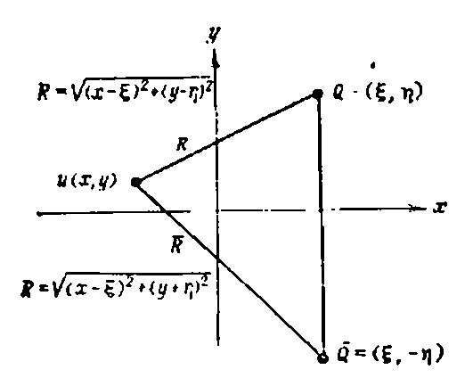

ПРИМІТКА. Якщо від'ємний заряд розмістити в точці $ \overline{Q} = (\xi,  -\eta) $ , очевидно, що негативний потенціал на прямій y = 0 буде нульовим. Те саме те, що функція Усмішки залежить від потенціалу цих двох зарядів.

- 3. Використовуючи результати задачі 2, знайдемо розв'язок рівняння Пуассона $ \Delta u = -k $ у верхній півплощині з умовою нульової межі.
- 4. Як би ви побудували функцію Зеленого для першого квадранта $ x>0,\ y>0 $ ?
- 5. Інший підхід до розв'язання рівняння Пуассона такий. Припустимо, ви хочете розв'язати проблему

(УЧП)

$$\Delta u = 1$$, $ 0 < r < 1 $ , $ 0 \le \theta < 2\pi $ , $ (\Gamma Y) $ $ u(1, \theta) = \sin \theta $ , $ 0 \le \theta \le 2\pi $ .

Сначала попытайтесь найти частное решение уравнения с помощью подстановки

$$u_p = (r, \theta) = Ar^2$$.

Потім підставляємо цей вираз у рівняння Пуассона і визначаємо константу $ A_{\cdot} $ числа $ u_p $ , що знаходиться в частині розв'язку, необхідно пожартувати поза розв'язком з огляду на $ u=w+u_p $ . Яка межа розуму, яку можна задовольнити функцією w? Знайте $ w(r, \theta) $ . Як вирішити проблему $ u(r, \theta) $ ? Зачекай. Retelno proanalizite vidpovid'. Зробіть перетин пеніса шкіри.

# Частина 5. ЧИСЕЛЬНІ ТА ПРИБЛИЗНІ МЕТОДИ

Лекция 37

# ЧИСЕЛЬНІ РОЗВ'ЯЗКИ (ЕЛІПТИЧНІ ЗАДАЧІ)

МЕТА ЛЕКЦІЇ: Показати, як диференціальні рівняння в похідних похідних можна звести до систем алгебраїчних рівнянь, якщо похідні з частковими похідними замінити на наближення з скінченними різницями. Розв'язання цієї системи алгебраїчних рівнянь ітеративним методом дозволяє отримати наближене розв'язок

Надається інформація про пакет ELLPACK, розроблений для розв'язання еліптичних приладів

задач общего вида на ЭВМ.

На сьогодні ми ознайомилися з кількома методами розв'язання лінійних диференціальних рівнянь у похідних похідних. Однак більшість рівнянь, з якими ми працювали, були дуже простими. Форми регіонів, у яких розв'язувалися проблеми, також були простими. Однак багато завдань не можна спростити настільки, щоб їх зводити до певного набору шаблонних завдань. Такі задачі слід розв'язувати приблизно чисельними методами. Прогрес у сфері високопродуктивних комп'ютерів призвів до створення нових чисельних методів. Сьогодні такі нелінійні проблеми гідродинаміки, теорії пружності та теорії потенціалу вже розв'язані, про які ніхто навіть не думав десять років тому.

Під загальною назвою «чисельні методи» поєднуються кілька різних підходів до розв'язання задач. Детальний опис усіх цих підходів можна знайти у книзі [4] з рекомендованого списку джерел. У цій та наступних двох лекціях ми покажемо, як розв'язувати еліптичні, гіперболічні та параболічні рівняння методом скінченної різниці.

Спершу ознайомимося з поняттям скінченних різниць, а потім покажемо, як їх використовувати для розв'язання задачі Діріхле в квадраті.

# Апроксимації скінченних різниць

Вспомним ряд Тейлора для функции f(x):

$$f(x+h) = f(x) + f'(x)h + \frac{f''(x)}{2!}h^2 + \dots$$

Якщо ми розірвемо цю суперечку на другому терміні, отримаємо

$$f(x+h) \cong f(x) + f'(x) h$$.

Откуда

$$(37.1) f'(x) \cong \frac{f(x+h)-f(x)}{h}.$$

Вираз праворуч називається похідною правої різниці. Вона апроксимує першу похідну f'(x) у точці x.

В разложении Тейлора функции $ f(\mathbf{r}) $ можно заменить h на -h и получить левую разностную производную

(37.2)

$$f'(x) \cong \frac{f(x) - f(x - h)}{h}$$.

Buyutan $ f(x - h) \cong f(x) - f'(x) h $ \nif $ f(x + h) \cong f( x) + f'(x) h $ ,

получаем центральную разностную производную

(37.3)

$$f'(x) \simeq \frac{1}{2h} [f(x+h) - f(x-h)].$$

Якщо в ряду Тейлора залишиться ще один член, то центральну різницю похідну для наближення f''(x) можна отримати точно таким самим способом

(37.4)

$$f''(x) \cong \frac{1}{h^2} [f(x+h) - 2f(x) + f(x-h)].$$

Тепер ми можемо розширити поняття наближення скінченних різниць до *часткових похідних*. Якщо виходити з розкладу Тейлора функції двох змінних

$$u(x+h, y) = u(x, y) + u_x(x, y)h + u_{xx}(x, y)\frac{h^2}{2!} + \dots,$$

u(x-h, y) = u(x, y) - u_x(x, y)h + u_{xx}(x, y)\frac{h^2}{2!} - \dots,

$$

можно получить следующие аппроксимации частных производных:

$$

\begin{split} u_x(x,\ y) & \cong \frac{u(x+h,\ y)-u(x,\ y)}{h}, \\ u_{xx}(x,\ y) & \cong \frac{1}{h^2} \big[ u(x+h,\ y)-2u(x,\ y)+u(x-h,y) \big], \\ u_u(x,\ y) & \cong \frac{u(x,\ y+k)-u(x,\ y)}{k}, \\ u_{uy}(x,\ y) & \cong \frac{1}{h^2} \big[ u(x,\ y+k)-2u(x,\ y)+u(x,\ y-k) \big]. \end{split}

$$ В этих формулах частные производные аппроксимируются правыми, центральными и левыми разностными производными, но в данной лекции мы будем пользоваться только центральными аппроксимациями.

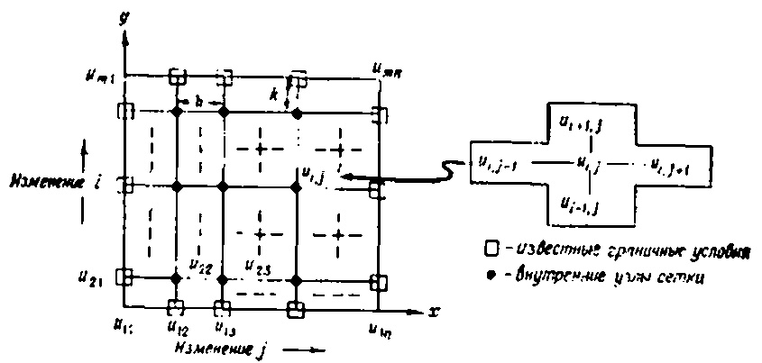

Рис. 37.1 Сетка для задачи Дирихле внутри квадрата.

Чтобы познакомиться с основными правилами использования конечно-разностных аппроксимаций, рассмогрим простую задачу Дирихле.

Решение задачи Дирихле методом конечных разностей

Пусть необходимо решить задачу Дирихле

(ЗЧП) 

$$

u_{xx} + u_{yy} = 0

$$, $ 0 < x < 1 $ , $ 0 < y < 1 $ , $ u = 0 $ , на верхней и боковых сторонах квадрата, $ u(x, 0) = \sin(x\pi) $ , $ 0 \le \le x \le 1 $ , $ y = 0 $ .

Построим в плоскости (x, y) сетку, как показано на рис. 37.1. Удобно (особенно, если мы собираемся применять ЭВМ)

непользовать следующие обозначения:

$$

\begin{split} u\left(x,\,y\right) &= u_{ij}\,,\\ u\left(x,\,y+k\right) &= u_{i+1,j}\,,\\ u\left(x,\,y-k\right) &= u_{i-1,j}\,,\\ u\left(x-h,\,y\right) &= u_{i,j-1}\,,\\ u\left(x+h,\,y\right) &= u_{i,j+1}\,,\\ u_{x}\left(x,\,y\right) &= \frac{1}{2h}\left(u_{i,j+1}-u_{i,j-1}\right)\,,\\ u_{y}\left(x,\,y\right) &= \frac{1}{2k}\left(u_{i+1,j}-u_{i-1,j}\right)\,,\\ u_{xx}\left(x,\,y\right) &= \frac{1}{h^{2}}\left(u_{i,j+1}-2u_{i,j}+u_{i,j-1}\right)\,,\\ u_{yy}\left(x,\,y\right) &= \frac{1}{h^{2}}\left(u_{i+1,j}-2u_{i,j}+u_{i-1,j}\right)\,. \end{split}

$$ Основная идея решения задачи Дирихле основана на замене частных производных в уравнении Лапласа

$$

u_{xx} + u_{yy} = 0

$$

их конечно-разностными аппроксимациями. Проделав это и воспользовавшись компактными обозначениями, получаем следующее разностное уравнение:

$$

\Delta u = \frac{1}{h^2} (u_{i,j+1} - 2u_{i,j} + u_{i,j-1}) + \frac{1}{k^2} (u_{i+1,j} - 2u_{i,j} + u_{i-1,j}) = 0.

$$

В случае когда h=k, уравнение Лапласа приводится к виду (37.6) $ (u_{i+1,j}+u_{i-1,j}+u_{i,j+1}+u_{i,j+1}-4u_{ij})=0. $ Разрешив его относительно $ u_{II} $ , получим

$$

u_{i,j} = \frac{1}{4} (u_{i+1,j} + u_{i-1,j} + u_{i,j+1} + u_{i,j-1}).

$$

Зверніть увагу, що в цьому співвідношенні всі значення $ u_{tj} $ беруть для внутрішніх вузлів сітки. Згідно з останнім співвідношенням, розв'язок $ u_{ij} $ апроксимується середнім значенням розв'язку у чотирьох сусідніх точках. Відповідно, ми можемо розробити чисельний метод для розв'язання цієї задачі.

Алгоритм численного решения задачи Дирихле (метод Либманна)

ШАГ 1. Присвоим величинам $ u_{ij} $ во внутренних узлах численное вначение, равное среднему всех значений граничных условий.

КРОК 2. Ми перерахуємо значення у всіх внутрішніх точках сітки, замінивши старе значення на середнє значення чотирьох суміжних точок. Не дуже важливо, як буде організовано підрахунок процесу, але зазвичай він здійснюється рядками (або колонками). Після кількох операцій процес збігається до приблизного розв'язання задачі. Швидкість збіжності цього алгоритму низька, але її можна збільшити кількома способами. Рекомендуємо зацікавленим читачам звернутися до книги [4] зі списку рекомендованої літератури.
# ЗАУВАЖЕННЯ
1. Если взять сетку с чегырьмя внутренними точками (m=n=4), то система (37.6) запишется в виде

$$

-4u_{22} + 0 + \sin(\pi/3) + u_{23} + u_{32} = 0,

$$ -4u_{23} + u_{22} + \sin(2\pi/3) + 0 + u_{33} = 0,$$

-4u_{32} + 0 + u_{22} + u_{33} + 0 = 0,

$$ -4u_{33} + u_{32} + u_{23} + 0 + 0 = 0.$$

Це потрібно вирішувати у зв'язку з $ u_{22} $ , $ u_{21} $ , $ u_{32} $ та $ u_{33} $ . Розв'язок такої системи можна знайти за допомогою *ітеративного методу*. Метод Лібмана також є одним із ітеративних методів.

- 2. Якщо зменшити кроки сітки на h і k (кількість вузлів сітки збільшиться), то отримаємо систему рівнянь типу (37,7), але більших розмірів.
- 3. Систему рівнянь (37.7) можна переписати у матричній формі

$$ \begin{bmatrix} -4 & 1 & 1 \\ 1 & -4 & 0 & 1 \\ 1 & 0 & -4 & 1 \\ 0 & 1 & 1 & -4 \end{bmatrix}
$$

\begin{bmatrix} u_{22} \\ u_{23} \\ u_{32} \\ u_{33} \end{bmatrix}

$$ =
$$

\begin{bmatrix} -\sin{(\pi/3)} \\ -\sin{(2\pi/3)} \\ 0 \\ 0 \end{bmatrix}

$$ =
$$

\begin{bmatrix} -0.86 \\ -0.86 \\ 0 \\ 0 \end{bmatrix}

$$.

$$

Зі збільшенням кількості рівнянь (наприклад, до 1000) матриця коефіцієнтів стає розрідженою, тобто містить багато нулів. Системи з розрідженими матрицями розв'язуються спеціальними методами. Зазвичай використовуються ітеративні методи, такі як метод Якобі, метод Гаусса-Зайделя або послідовний метод верхньої релаксації.

4. При розв'язанні задачі Неймана ті *похідні*, що входять до граничної умови, також слід замінити різницею апроксимаціями.

5. Таким чином ви зможете вирішувати проблеми

a)

$$

u_{xx} + u_{yy} = f(x, y)

$$

6)

$$

xu_{xx} + u_{yy} + 2u = \sin(x - y)

$$

B)

$$

\sin xu_{xx} + u_{xy} + 3u = 0

$$

(гетерогенні рівняння з змінними коефіцієнтами), (рівняння зі змінними коефіцієнтами).

6. Якщо область, в якій розв'язується задача, має неправильну форму, її можна покрити сіткою і наближити розв'язок у точках, найближчих до межі, інтерполюючи граничні умови. Після цього задачу вирішують звичайним способом (див. рисунок 37.2).

□ новые ГУ находятся интерполяцией ГУ на кривой Рис. 37 2.

- 7. Деякі журнали публікують тексти програм для розв'язання диференціальних рівнянь у похідних на комп'ютерах. Нижче наведено короткий список цих журналів:
  - a) Транзакції ACM на математичному програмному забезпеченні,
  - 6) Комп'ютерний журнал,
  - B) Numerische Mathematik,
  - r) БІТ

Крім того, нещодавно було розроблено пакет застосунків ELLPACK для розв'язання досить широкого класу задач на лінії прикордонних ліній. Цей пакет дозволить вам розв'язувати різноманітні дво- та тривимірні задачі у

різні координатні системи для довільних меж і спільних граничних умов. Користувачу пропонується широкий спектр різних методів розв'язання 1).
# ЗАДАЧІ - 1 Отримаємо наближення (39,4) для другої похідної f''(x) $f''(x) = \{f(x+h) 2f(x) + f(x-h)\}/h^2$ .
- 2. Виконайте дві ітерації задачі Діріхле (37.5) за ітеративним методом Лібмана.
- 3. До якої алгебранічної системи буде зведена задача Діріхле для рівнянь Пуассона в квадраті

$$

(УЧ\Pi)

$$ $u_{xx} + u_{yy} = f(x,y), \quad 0 < x < 1, \quad 0 < y < 1,$ $(\Gamma Y)$ $u(x,y) = g(x,y)$ на границе, если ее решать ме-

Скінченні відмінності? 4. Розв'язати задачу 3, якщо

(УЧП)

$$

u_{xx} + u_{yy} + 2u = 0

$$, $0 < x < 1$ , $0 < y < 1$ , (ГУ) $u(x, y) = g(x, y)$ на границе.

5. Как бы вы решали задачу Неймана внутри квадрата

(УЧП)

$$

u_{xx} + u_{yy} = 0

$$, $0 < x < 1$ , $0 < y < 1$ , на верхней, нижней и левой стороне квадрата,

$$ \begin{cases} u = 0 & \text{квадрата,} \\ \frac{\partial u}{\partial x}(1, y) = 1, & 0 \leqslant y \leqslant 1, \end{cases}
$$

методом конечных разностей?

6. Постройте блок-схему алеоритма решения задачи Дирихле в квадрате

$$

(\text{УЧП})

$$ $u_{xx} + u_{yy} = f(x, y), \quad 0 < x < 1, \quad 0 < y < 1,$ $(\text{ГУ})$ $u(x, y) = g(x, y)$ на границе,

- з довільною кількістю вузлів сітки. Якщо ви знаєте мову програмування, напишіть програму для виконання цих обчислень.
- 1) Російською мовою публікуються статті з чисельних методів розв'язання диференціальних рівнянь у численних журналах і збірках. Наприклад: «Журнал обчислювальної математики та математичної фізики», видавництво «Наука», «Журнал інженерної фізики», видавництво Академії наук БРСР, збірки серії «Обчислювальні методи і програмування», Видавництво Московського державного університету. Багато публікацій, переважно статей, присвячені наборам прикладних проблем. Як приклад, можна вказати: Горбунов-Посадов М. М., Карпов В. Я, Корягін та ін. Пакет SAFRA. Програмне забезпечення для обчислювальних експериментів. У: Пакети прикладних програм. Обчислювальний експеримент. Москва, Наука, 1983. Примітка. Переклад.

# МЕТАЛЕКЦІЯ ПРО ЯВНІ РІЗНИЦІ СХЕМ: Введіть поняття явної різниці та покажіть, як її можна використовувати для розв'язання гіперболічних і параболічних задач. Основна ідея полягає в тому, що після заміни рівняння типу

$$

u_t = u_{xx}

$$

Її апроксимація скінченної різниці дає формули, які явно виражають значення розв'язку за один момент часу через значення розв'язку в попередній момент часу. Таким чином, змішану задачу для параболічного або гіперболічного рівняння можна розв'язати, послідовно обчислюючи розв'язки для всіх наступних точок часу.

Явна схема не позбавлена недоліків. Якщо необхідно підвищити точність наближення похідних, то при зміні сегмента збільшується не лише обсяг обчислень, а й похибки округлення.

Попередня лекція була присвячена розв'язанню еліптичних задач на межі лінії (стаціонарних задач). У таких задачах необхідно знайти розв'язок диференціального рівняння в похідних у заданій області простору, якщо розв'язок або його похідна задано на межі області визначення Приблизне розв'язання еліптичних задач зводиться до розв'язку системи алгебраїчних рівнянь для значень функції у внутрішніх вузлах сітки. Іншими словами, значення розв'язку у всіх внутрішніх вузлах визначаються одночасно.

У цій лекції ми розглянемо диференціальні методи розв'язання задач, залежних від часу. Основна ідея полягає в тому, що якщо розв'язок відомий у початковий момент часу, то можливо знайти розв'язок за допомогою схеми підрахунку $t=\Delta t,\ 2\Delta t,\ 3\Delta t,\ldots$ Замінивши часткові похідні часу та просторову змінну на скінченнорізні похідні, можна отримати явні вирази для $u_{tj}$ через значення функції u у попередні моменти часу. Такий процес називається явною схемою підрахунку з тикуванням.

Щоб показати цей метод у дії, розглянемо типову задачу теплопровідності.

# Явная схема для уравнения теплопроводности

Розглянемо проблему теплопровідності у стрижні, початкова температура якого дорівнює нулю. Нехай температура лівого кінця фіксована, а на правому кінці відбувається теплообмін із навколишнім середовищем, щоб тепловий фланець був пропорційний P и с

. 38.1. Сетка для уравнения теплопроводности.

різниця температур між кінцем стрижня і середовищем. Нехай температура середовища задається функцією $g\left(t\right)$ . Іншими словами, ми розв'язуємо проблему

задачу (УЧП)

$$

u_t = u_{xx}, \quad 0 < x < 1, \quad 0 < t < \infty,

$$

(38.1) (ГУ)

$$ \begin{cases} u(0, t) = 1, \\ u_x(1, t) = -[u(1, t) - g(t)], \\ u(x, 0) = 0, \quad 0 \le x \le 1. \end{cases}

$$

Щоб розв'язати цю задачу, ми побудуємо прямокутну сітку методом скінченної різниці, вершини якої визначаються формулами (див. рис. 38.1)

$$x_j = jh$$, $ j = 0, 1, 2, ..., n $ , $ y_i = ik $ , $ i = 0, 1, 2, ..., m $ .

Зверніть увагу, що значення $ u_{ij} $ зліва і внизу сітки на рис. 38.1 відомі з граничних і початкових умов, і наша вадача полягає у знаходженні решти значень $ u_{ij} $ . Щоб розв'язати цю задачу, ми замінимо часткові похідні рівняння теплопровідності на їхні наближення з скінченними різницями

$$u_{t} = \frac{1}{k} [u(x, t+k) - u(x, t)] = \frac{1}{k} [u_{t+1,j} - u_{t,j}],$$

u_{xx} = \frac{1}{h^{2}} [u(x+h, t) - 2u(x, t) + u(x-h, t)] = \frac{1}{h^{2}} [u_{t,j+1} - 2_{t,j} + u_{t,j-1}].

$$

Подставим эти выражения в уравнение $ u_t = u_{xx} $ и разрешим получившееся уравнение относительно значений функции на верхнем временном слое. В результате получаем

(38.2) 

$$

u_{t+1,j} = u_{t,j} + \frac{k}{h^2} \left[ u_{t,j+1} - 2u_{t,j} + u_{t,j-1} \right].

$$

Це та формула, яку ми шукаємо, оскільки вона виражає розв'язок у певний момент часу через розв'язок у попередній момент часу (індекс *i* означає часову змінну). Фіг. 38.1 підкреслює значення, включені до цієї формули.

Тепер можна починати розрахунки. Однак спочатку потрібно апроксимувати похідну в граничній умові праворуч

$$

a_x(1, t) = -[u(1, t) - g(t)].

$$

В результате аппроксимации получаем

(38.3) 

$$

\frac{1}{h}[u_{t,n} - u_{t,n-1}] = -[u_{t,n} - g_t].

$$

где значения $ g_i = g(ik) $ известны. Здесь мы заменили $ u_x(1, t) $ левой разностной производной, поскольку правая разностная производная потребовала бы значений функции за пределами сетки. Из (38.3) находим

(38.4) 

$$

u_{t,n} = \frac{u_{t,n-1} - hg_t}{1 + h}.

$$

Формулы (38.2) и (38.4) позволяют начать вычисления.

Алгоритм вычислений по явной схеме

ШАГ 1. Находим решение на сеточном слое $ t = \Delta t $ , используя явную формулу (см. рис. 38.2)

$$

u_{2,j} = u_{1,j} + \frac{k}{h^2} [u_{1,j+1} - 2u_{1,j} + u_{1,j-1}], \quad j = 2, 3, \ldots, n-1.

$$

ШАГ 2. Величину $ u_{2,n} $ находим по формуле (38.4)

$$

u_{2,n} = \frac{u_{2,n-1} + hg_2}{1+h}.

$$

Після виконання кроків 1 і 2 ми отримуємо рішення для $ t=\Delta t $ . Щоб отримати розв'язок у $ t=2\Delta t $ (другий рядок знизу на рис. 38.2), повторіть кроки 1 і 2, рухаючись на одну лінію вгору, тобто збільшуючи t на 1 і використовуючи $ u_{t,j} $ з попередньої лінії. Розв'язок обчислюється таким самим способом у наступні $ t=3\Delta t,\ 4\Delta t\dots $ Для того чтобы помочь читателю в проведении расчетов по этому методу, на рис. 38.3 приведена достаточно подробная блоксхема алгоритма. Те, кто не очень хорошо знаком с блок-схемами.

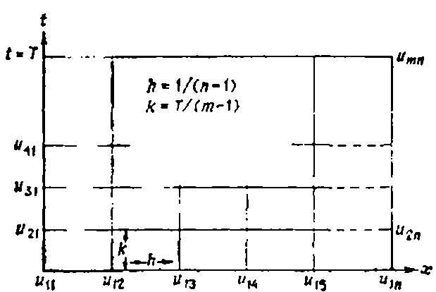

Рис. 38.2. Иллюстрация явной разностной схемы: n— число узлов сетки вдоль оси $ x;\ m $ — число узлов сетки вдоль оси $ y;\ h=1/(m-1),\ k=T/(m-1) $ могут счигать их промежуточным звеном между вычислительными алгоритмами и подробными программами для ЭВМ. Блок-схемы дают строгое описание процесса вычислений.
# ЗАУВАЖЕННЯ - Явна схема має серйозний недолік. Якщо часовий крок достатньо великий порівняно з кроком x, похибки округлення можуть стати настільки великими, що отриманий розв'язок втрачає сенс. Відношення кроків у t і x залежить від рівняння та граничних умов, але в загальному випадку крок у часі має бути значно меншим за крок у координаті. У книзі [4] доведено, що для застосування явної схеми необхідно виконати умову k/h2 ≤ 0,5.
- 2. Існує таке правило: якщо зменшити кількість кроків $ \Delta t $ і $ \Delta x $ , то похибка у наближенні часткових похідних за скінченними різницями також зменшиться, але чим менша сітка, тим більше обчислень потрібно виконати, і, відповідно, тим більшими будуть похибки округлення. Це явище ілюструється на рис. 38.5.
- 3. Для гіперболічної задачі

(УЧП) 

$$

u_{tt} = u_{xx}, \quad 0 < x < 1, \quad 0 < t < \infty,

$$

(ГУ) 

$$

\begin{cases} u(0, t) = g_1(t), \\ u(1, t) = g_2(t), \end{cases}

$$ \quad 0 < t < \infty,$$

(HY)

$$ \begin{cases} u(x, 0) = \varphi(x), \\ u_t(x, 0) = \psi(x), \end{cases}

$$

\quad 0 \leqslant x \leqslant 1,

$$

Також можливо побудувати явну різницю схеми. Для цього ми апроксимуємо $ u_{tt} $ і $ u_{xy} $ центральних різницьких пропозицій И С

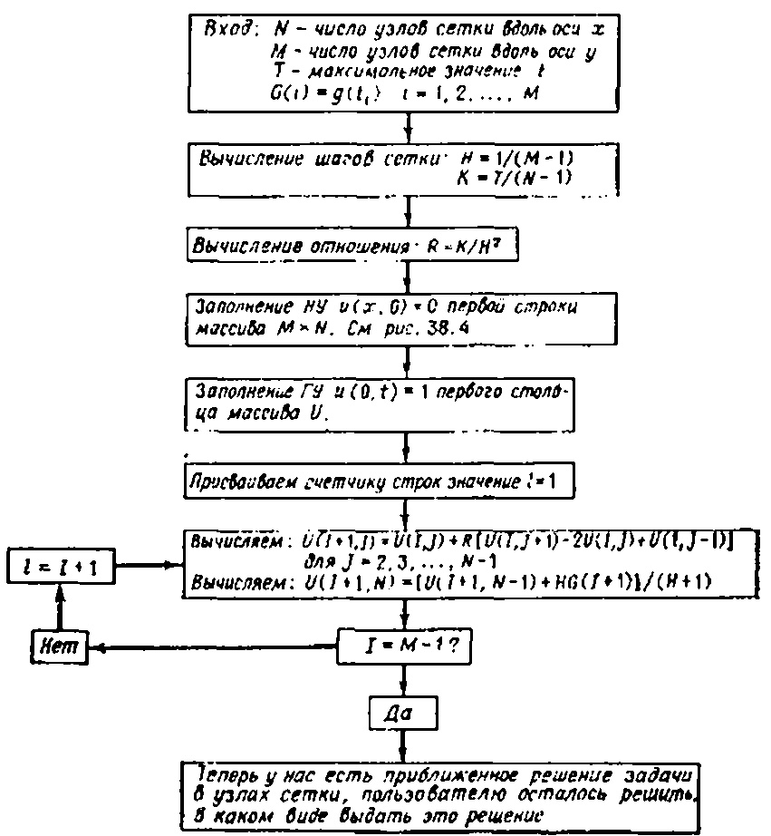

. 38.3. Алгоритм решения задачи по явной схеме.

водными

$$

u_{tt} \simeq \frac{1}{h^2} [u(x, t+k) - 2u(x, t) + u(x, t-k)],

$$ u_{xx} \simeq \frac{1}{h^2} [u(x+h, t) - 2u(x, t) + u(x-h, t)].$$

а начальное условие--- по схеме

$$u_t(x, 0) \approx \frac{1}{k} [u(x, k) - u(x, 0)] = \frac{1}{k} [u(x, k) - \varphi(x)].$$

В результате для вычисления величины u(x, t+k) получаем следующую явную схему:

(38.5)

$$u(x, t+k) = 2u(x, t) - u(x, t-k) + + (k/h)^2 [u(x+h, t) - 2u(x, t) + u(x-h, t)].$$

З (38.5) видно, що для обчислення розв'язку на заданому часовому шарі необхідно знати розв'язок на двох попередніх шарах. Отже, щоб почати рахувати, потрібно використовувати P И С

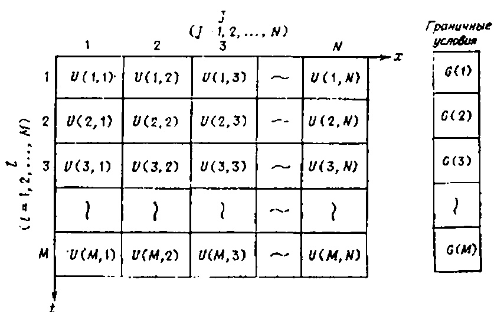

. 38.4. Использование массивов при реализации явной схемы.

начальным условнем на скорость

$$\frac{1}{k}\left[u\left(x,\,k\right)-\varphi\left(x\right)\right]=\psi\left(x\right),$$

з якої ми виводимо $ u(x,  k) = \varphi(x) + k\psi(x) $ , тобто цінність розв'язку на $ t = \Delta t $ . Розв'язок у наступні часи можна знайти за явною формулою (38.5).
# ЗАДАЧІ
1. Постройте явную конечно-разностную схему для задачи

(УЧП)

$$u_t = u_{xx}$$, $ 0 < x < 1 $ , $ 0 < t < \infty $ ,  
(ГУ)

$$ \begin{cases} u(0, t) = 0, \\ u(1, t) = 0, \\ u(x, 0) = \sin(\pi x), \quad 0 \le x \le 1. \end{cases}

$$

(HУ) $u(x, 0) = \sin(\pi x), \quad 0 \le x \le 1.$ Полагая $h = \Delta x = 0.1$ , найдите решение при $t_1 = 0.005$ , $t_2 = 0.010$ , $t_3 = 0.015$ . Постройте график полученного решения на сетке x = 0; 0.1; 0.2; 0.3; . .; 0.9: 1 при t = 0.015.

Фіг. 38.5. Залежність повної похибки від кроку сітки.

- 2. Розв'яжіть задачу 1 аналітично (ділячи змінні). Знайдіть значення розв'язку у вузлах сітки x=0; 0,1; 0,2; 0,3; ...; 0,9; 1 при t=0,015. Порівняйте ці результати з результатами чисельного розв'язку задачі 1. (Ви можете скористатися калькулятором або написати невелику комп'ютерну програму для табуляції аналітичного розв'язку.)
- 3. Відповідно до примітки 3, побудуйте блок-схему для розв'язання гіперболічної задачі.
- 4. Розв'яжіть задачу 1 з новою граничною умовою при x=1 $u_x(1, t) = -[u(1, t) 1].$ # СХЕМИ НЕЯВНИХ РІЗНИЦЬ (СХЕМА КРАНКА–НІКОЛСОНА)
МЕТАЛЕКЦІЇ: Показати, як задачі, що містять функції, залежні від часу, можна розв'язати за допомогою неявної різницької схеми. У цій схемі, як і в попередній схемі, часткові похідні замінюються скінченно-різницею, але $u_{l+1,\ J}$ більше не виражаються явно через значення на попередніх шарах. Тепер, щоб визначити значення $u_{l+1,\ J}$ , необхідно розв'язати систему рівнянь. Іншими словами, щоб визначити розв'язок на кожному часовому nage, необхідно розв'язати систему рівнянь.

Перевага неявних схем над явними полягає в тому, що в неявних схемах танг сітки можна зробити достатньо великим без страху, що помилки округлення «знищать» розв'язок.

Для розв'язання параболічної задачі ми використаємо відому схему *Кранк*-*Ніколсона*.

Як уже згадувалося в попередній лекції, щоб явна схема працювала надійно, часовий крок сітки має бути невеликим. Зокрема, якщо просте завдання для рівняння теплопровідності

(39.1)

$$ \begin{array}{ccccccccccccccccccccccccccccccccccc

$$

розв'язується за явною схемою, тоді кроки сітки $\Delta t$ і $\Delta x$ повинні задовольняти умову

$$

\frac{\Delta t}{(\Delta x)^2} \leqslant 0.5.

$$

Інакше метод буде чисельно нестабільним (а помилки округлення зростуть нескінченно). (Питання чисельної стабільності розглядаються у [53].) Іншими словами, якщо відстань сітки на осі x вибрана $\Delta x=0,1$ , то часовий крок $\Delta t$ не може бути більшим за $0.5\Delta x^2=0.005$ . Це означає, що ви можете пройти від t=0 до t=1, зробивши 200 кроків.

Однак існують такі схеми (неявні схеми), які дозволяють виконувати обчислення з набагато більшим кроком, тоді як

Правда, обсяг розрахунків, які виконуються на одному кроці, зростає. Такі схеми можна використовувати для виконання обчислень із досить великим кроком, але на кожному кроці потрібно розв'язати систему алгебраїмних рівнянь. Щоб проілюструвати цей метод, розв'яжемо наступну проблему теплопровідності.

# Неявная схема для уравнения теплопроводности

Рассмотрим задачу

(39 2)

$$

\begin{array}{ccccccccccccccccccccccccccccccccccc

$$

Використаємо наступні апроксимації скінченних різниць для часткових похідних $u_t$ та $u_{xx}$ :

$$

\begin{split} u_t(x,\ t) &= \frac{1}{k} \big[ u(x,\ t+k) - u(x,\ t) \big], \\ u_{xx}(x,\ t) &= \frac{\lambda}{h^2} \big[ u(x+h,\ t+k) - 2u(x,\ t+k) + u(x-h,\ t+k) \big] + \\ &\quad + \frac{(1-\lambda)}{h^2} \big[ u(x+h,\ t) - 2u(x,\ t) + u(x-h,\ t) \big], \end{split}

$$

де $\lambda$ взято з сегмента [0,1]. Зверніть увагу, що $u_{xx}$ наближається зваженим середнім центральних різницевих похідних у момент часу t і t+k. $\lambda=0.5$ отримується звичайне середнє для цих двох центральних похідних, і при $\lambda=0.75$ одна з різницевих похідних бере вагу 0,75, а інша — 0,25. У $\lambda=0$ отримується звичайна явна схема, яка була обговорена в попередній лекції.

Після заміни часткових похідних $u_t$ і $u_{xx}$ у задачі (39.2) отримуємо різницю (див. рисунок 39.1).

Разностное уравнение

$$

\frac{1}{k} (u_{i+1, j} - u_{i, j}) = \frac{\lambda}{h^2} (u_{i+1, j+1} - 2u_{i+1, j} + u_{i+i, j-1}) + \frac{(1-\lambda)}{h^2} (u_{i, j+1} - 2u_{i, j} + u_{i, j-1}),

$$

(39.3)

$$ (\Gamma Y) \begin{cases} u_{i, 1} = 0, & i = 1, 2, ..., m, \\ u_{i, n} = 0, & i = 1, 2, ..., m, \\ u_{i, j} = 1, & j = 2, ..., n-1. \end{cases}

$$

298

Перенесіть усі невідомі значення u з верхнього часового шару (i+1) на ліву частину рівняння (39.3) і отримайте (39.4)

$$

-\lambda r u_{i+1, j+1} + (1+2r\lambda) u_{i+1, j} - \lambda r u_{i+1, j-1} = = r(1-\lambda) u_{i, j+1} + [1-2r(1-\lambda)] u_{i, j} + r(1-\lambda) u_{i, j-1},

$$

де вводиться позначення $r = k/h^2$ . Зверніть увагу, що якщо i фіксоване, а j змінюється від 2 до n-1, співвідношення (39.4) визначають систему рівнянь n-2 з n-2 невідомим $u_{t+1,2}, u_{t+1,3},$

Фіг. 39.1. Сітка для схеми неявних різниць.

Фіг. 39.2. Шаблон неявної схеми $u_{i+1, 4}, \ldots, u_{i+1, n-1}$ , які є розв'язком проблеми у внутрішній

Mesh-вузли на часовому рівні $t=(i+1)\Delta t$ .
Фіг. 39.2 дає візуальне представлення структури кожного рівняння системи (39.4). Тепер перейдемо до розв'язку системи (39.4).

# Алгоритм розв'язання задачі (39.2)

КРОК 1. Виберіть якусь цінність $\lambda$ ( $0 \le \lambda \le 1$ ). Якщо $\lambda = 0$ , то рівняння (39.4) перетворюються на явні формули з лекції 38.

КРОК 2. Припустимо, наприклад, $h=\Delta x=0,2$ і $k=\Delta t=0,08$ (у цьому випадку $r=k/h^2=2$ ). У цьому випадку сітка містить 6 вузлів уздовж осі (4 внутрішні вузли) (див. рисунок 39.1). Візьмемо параметр ваги $\lambda=0,5$ (отримана схема називається схемою Кренка-Ніколсона). Відповідно до обчислювальної схеми (її зазвичай називають шаблоном), показаної на рис. На рисунку 39.2, рухаючись зліва направо (j=2,3,4,5) уздовж перших двох шарів (i=1), отримуємо наступні чотири рівняння:

$$

\begin{array}{l} -u_{21}+3u_{22}-u_{23}=u_{11}-u_{12}+u_{13}=1,\\ -u_{22}+3u_{23}-u_{24}=u_{12}-u_{13}+u_{14}=1,\\ -u_{23}+3u_{24}-u_{25}=u_{13}-u_{14}+u_{15}=1,\\ -u_{24}+3u_{25}-u_{26}=u_{14}-u_{15}+u_{16}=1. \end{array}

$$

Перепишем их в матричной форме

(39.5)

$$ \begin{bmatrix} 3 & -1 & 0 & 0 \\ -1 & 3 & -1 & 0 \\ 0 & -1 & 3 & -1 \\ 0 & 0 & -1 & 3 \end{bmatrix}
$$

\begin{bmatrix} u_{2\bar{z}} \\ u_{\bar{z}a} \\ u_{24} \\ u_{\bar{z}x} \end{bmatrix}

$$ =
$$

\begin{bmatrix} 1 \\ 1 \\ 1 \\ 1 \end{bmatrix}

$$.

$$

Матриця цієї системи називається тридіагональною. Щоб розв'язати систему з трьома діагоналями

$$ \begin{bmatrix} b_1 & c_1 & 0 & 0 & \dots & & & 0 \\ a_1 & b_2 & c_2 & 0 & \dots & & & 0 \\ 0 & a_{\bar{z}} & b_3 & c_3 & \dots & & & 0 \\ & & & & & & & & \\ \vdots & & & & & & & & \\ 0 & 0 & 0 & \dots & & & & a_{n-1} & b_n \end{bmatrix}

$$

\begin{bmatrix} x_1 \\ x_{\bar{z}} \\ x_{\bar{s}} \\ \vdots \\ x_n \end{bmatrix}

$$ =
$$

\begin{bmatrix} d_t \\ d_{\bar{z}} \\ d_{\bar{s}} \\ \vdots \\ \vdots \\ d_n \end{bmatrix}

$$ ,

$$

преобразуем ее в эквивалентную систему вида

$$ \begin{bmatrix} 1 & c_1^* & 0 & 0 & \dots & 0 \\ 0 & 1 & c_2^* & 0 & \dots & 0 \\ 0 & 0 & 1 & c_2^* & \dots & 0 \\ \vdots & \vdots & & & \vdots & \vdots \\ 0 & 0 & \dots & & 1 \end{bmatrix}

$$

\begin{bmatrix} x_1 \\ x_2 \\ x_3 \\ \vdots \\ x_n \end{bmatrix}

$$ =
$$

\begin{bmatrix} d_1^* \\ d_2^* \\ d_3^* \\ \vdots \\ d_n^* \end{bmatrix}

$$ .$$

где

$$c_1^* = c_1/b_1$$, $ c_{j+1}^* = \frac{c_{j+1}}{b_{j+1} - a_j c_j^*} $ , $ j = 1, 2, \ldots, n-2 $ , и $ d_1^* = d_1/b_1 $ , $ d_{j+1}^* = \frac{d_{j+1} - a_j d_j^*}{b_{j+1} - a_j c_j^*} $ , $ j = 1,  2, \ldots, n-1 $ .

У цьому перетворенні немає нічого дивного, оскільки друга система повністю еквівалентна першої. Матриця нової системи організована так, що цю систему дуже легко розв'язати. Розв'язуючи рівняння послідовно знизу вгору, отримуємо

$$x_n = d_n^*, \quad x_j = d_j^* - c_j^* x_{j+1}, \quad j = n-1, \ n-2, \ \dots, \ 2, \ 1.$$

Застосовуючи цей метод до системи чотирьох рівнянь (39,5), отримуємо розв'язок $ u_{22}=0,60 $ ; $ u_{23}=0,80 $ ; $ u_{24}=0,80 $ ; $ u_{23}=0,60 $ . Ми отримали наближені значення розв'язку у внутрішніх точках сітки на $ t=\Delta t $ . Тепер ми можемо зробити наступний крок у часі, але для цього нам доведеться розв'язати нову систему рівнянь.

У неявній схемі кількість обчислень на кожному кроці більша, ніж на явному, але хорошу точність можна отримати навіть при значно більшому кроці.
# ЗАВДАННЯ - 1. З диференціального рівняння (39.3) отримуємо рівняння (39.4).
- 2. Побудуємо неявну схему скінченної дельти для задачі

$$ \begin{array}{ll} (\mathrm{Y}\mathrm{H}\Pi) & u_t = u_{xx}, \quad 0 < x < 1, \quad 0 < t < \infty, \\ (\Gamma\mathrm{Y}) & \left\{ \begin{array}{ll} u_{\,0}(0, \ t) = 1, \\ u_{\,x}(1, \ t) + u_{\,}(1, \ t) = g_{\,}(t), \\ u_{\,x}(1, \ t) = 0, \quad 0 \leqslant \kappa \leqslant 1. \end{array}

$$

\right. & 0 < t < \infty, \end{array}

$$

3. Как с помощью неявной схемы решить задачу

(УЧП) 

$$

u_t = u_{xx} + u, \quad 0 < x < 1,

$$

(ГУ) $

$$ $ - 4. Как выглядит шаблон для уравнения (39.4), когда $ \lambda = 1 $ ?
- 5. Постройте блок-схему решения уравнения теплопроводности (39.2). Если есть возможность, то напишите программу для ЭВМ Было бы очень полезно решить эту задачу численно при различных значениях λ с начальным условием и (x, 0) = sin (πx). Сравните полученные при различных λ численные результаты с аналитическим решением, которое в данном случае имеет вид

$$

$$

6 Воспользовавшись формулами, приведенными в тексте, решите систему алгебраических уравнений (39.5).

Лекция 40

# СРАВНЕНИЕ АНАЛИТИЧЕСКИХ РЕШЕНИЙ С ЧИСЛЕННЫМИ МЕТА ЛЕКЦІЇ: Сравнить достоинства и недостатки аналитических и численных методов решения уравнений с частными производными. Приведена важная математическая задача об идентификации физических величин (параметрическая идентификация). В связи с этой задачей рассматривается один важный пример из биологии.

Вероятно, пришло время обсудить достоинства и недостатки аналитических и численных решений уравнений с частными производными. Сначала выясним, что мы подразумеваем под этими двумя типами решений.

# Аналитические решения

Под аналитическими решениями мы подразумеваем такие решения, в которых неизвестная функция и выражена через независимые переменные и параметры системы в виде формул, бесконечных рядов и интегралов.

# Численные решения

Під чисельним ми зрозуміємо чисельні розв'язки, отримані чисельно після приблизної заміни початкового рівняння іншим, простішим рівнянням. Наприклад, у методі скінченної різниці похідні виражаються через скінченні різниці, а розв'язок диференціального рівняння в похідних у похідних апроксимується розв'язком різницького рівняння. Результатом такої процедури зазвичай є таблиця значень розв'язків, а для деяких значень пояснювальних змінних.

Таблина 40.1

|                           | ×           |                  |           |          |          |     |     |     |           |                  |                  |
|---------------------------|-------------|------------------|-----------|----------|----------|-----|-----|-----|-----------|------------------|------------------|
|                           | 0           | 0,1              | 0,2       | 0,3      | 0,4      | 0,5 | 0,6 | 0,7 | 0,8       | 0,9              | 1                |
| 0 0,01 0,02 0,03 | 1 0 0 | 1 0,2 0,15 | 1 0,34 | l :   | :        | :   | !   | :   | 1 0,34 | 1 0,2 0,15 | 1 0 0 0 |
| ;                         |             | :                | :         | <b>:</b> | <b>:</b> | :   | :   | :   | :         | :                | :                |

Теперь, когда мы знаем, что подразумевается под решением каждого из этих типов, давайте сравним их между собой.

# **Сравнительный анализ численного** и аналитического решений

Рассмотрим простейшую смещанную параболическую задачу

(40.1) 

$$y^2 - x^2 = \text{const},$$

Розв'язок якого показано на рис. 40.1. Що краще — мати аналітичне рішення цієї проблеми?

(40.2) 

$$y^2 + x^2 = \text{const}.$$

или численное, представленное при $ \alpha = 1 $ в табл. 40.1?

Вопрос хороший, а ответ на него зависит от того, что мы хотим делать с этим решением дальше. Однако каждому из типов решений присущи очевидные преимущества.

# Преимущества аналитического решения

1. Очевидно, що розв'язок (40.2) є більш інформативним, ніж таблиця чисел. Якщо ми хочемо обчислити розв'язок у певній точці (x, t), ми можемо зробити це так точно, як хочемо, просто збільшуючи кількість членів ряду, які розглядаються. Водночас легко отримати оцінку зверху щодо значення допущеної помилки.

Рис. 40.1. Решение уравнения теплопроводности (40.1) в различные моменты времени.

- 2. Аналітичне розв'язання завжди дозволяє обчислити значення розв'язку в одній точці (x, t) без необхідності обчислювати значення розв'язків в інших точках, як це відбувається при розв'язанні задач із явними або неявними різницею схем.
- 3. Аналітичне рішення дозволяє визначити розв'язок у будь-якій точці, а не лише на вузлах сітки.
- 4. Найважливішою перевагою аналітичного розв'язку для нас є можливість простежити вплив фізичних параметрів, початкових і граничних умов на природу розв'язку.

Чисельні методи не виявляють цих регулярностей, оскільки дозволяють знаходити розв'язок лише за заданих параметрів — початкових і граничних умовах. Іноді важливо знати взаємозв'язок між параметрами моделі та розв'язком, особливо коли йдеться про оцінку фізичних параметрів за типом розв'язку. Наприклад, припустимо, що розв'язок і визначається експериментально, і ми знаємо аналітичний розв'язок

u = функция от параметров.

Тогда можно поставить вопрос об определении параметров нак функции входных данных по схеме

Параметры = функция от u = функция исходных данных.

Такая задача называется параметрической идентификацией. Для параметрической идентификации необходимо уметь решать уравнение с частными производными. Несколько позже в этой лекции мы приведем пример параметрической идентификации в биологии, но сначала посмотрим, чем же хороши численные решения.

# Преимущества численных решений

Головна перевага чисельних розв'язків полягає в тому, що їх можна отримати навіть якщо аналітичне рішення неможливо. Майже всі нелінійні диференціальні рівняння в похідних похідних потрібно розв'язувати чисельними методами, і більшість реальних моделей фізики, хімії, біології тощо є нелінійними. Як правило, лінійні моделі наближаються до нелінійних лише якщо в них відкинути нелінійні члени. Наприклад, ось кілька нелінійних рівнянь:

1) нелинейное волновое уравнение $ u_{tt} = u_{xx} + f(u) $ ;

2) уравнение реакции с нелинейной диффузией $ u_t = u_{xx} + f(u) $ ;

3) система Ходжкина—Хаксли $ $$u(x, t) =
$$ $ Аналитические решения для этих уравнений не известны ни при каких нелинейных функциях f и $ g^{(1)} $ . Поэтому общий подход к решению нелинейных (а в ряде случаев и линейных) задач обычно базируется на численных решениях.

Тепер давайте розглянемо приклад того, як можна використати аналітичне рішення для визначення фізичних параметрів. Детальніший опис цих завдань можна знайти у рекомендованій літературі.

# Параметрическая идентификация (в биологии)

Припустимо, що біолог намагається визначити швидкість, з якою $ (K^+) $ іони калію дифундують у екзоплазмовому розчині. Якщо ви знаєте цей коефіцієнт дифузії, можна багато сказати про те, як нервові імпульси передаються вздовж аксонів. Проблема в тому, що це співвідношення майже неможливо знайти прямим вимірюванням. Однак можливо знайти математичний

1) Это не так. В качестве примера можно привести уравнение $ u_{ii} = u_{xx} - \sin u_x - \Pi pum $ , ped.

связь между концентрацией поташа $ u\left(x,\,t\right) $ и коэффициентом диффузии $ D,\,\,a\,\, $ затем по измерениям величины $ u\left(x,\,t\right) $ определить величину D.

Біологи Ходжкін і Кейз виявили, що після розміщення гігантського аксону у спеціальному соляному розчині концентрація радіохктивного калію (**2K) вздовж аксону приблизно описується кривою в початковий момент

$$\vec{B} = 2A\xi_x\eta_x + B(\xi_x\eta_y + \xi_y\eta_x) + 2C\xi_y\eta_y = -16x^2y^2$$

.

Отже, параметри A і A слід обирати так, щоб крива відповідала експериментальним даним (наприклад, у сенсі методу найменших квадратів). Також було встановлено, що P И С

. 40.2. Начальная концентрация ионов ( $ ^{42}K $ ): a—теоретическая кривая; $ \delta $ —экспериментальные точки.

с течением времени ноны поташа под действием диффузии и конвекции растекаются вдоль аксона. Ходжкин и Кейс предположили, что концентрация и является решением следующей задачи с начальными данными для уравнения диффузии:

(40.3) 

$$\bar{D} = A\xi_{xx} + B\xi_{xy} + C\xi_{yy} + D\xi_x + E\xi_y = -2(x^2 + y^2)$$

Цю проблему вирішили у лекції 15, переключившись на рухому систему координат. Якщо читач пам'ятає, загальна схема методу виглядає так. Спочатку відкидаємо конвективний член і отримуємо розв'язок суто дифузійної задачі (при V = 0):

$$\widetilde{E} = A\eta_{xx} + B\eta_{xy} + C\eta_{yy} + D\eta_x + E\eta_y = 2(y^2 - x^2),$$

 = \frac{A\sqrt{a}}{\sqrt{a+4Dt}} e^{-[x^2/(a+4Dt)]},

$$\tilde{F} = F = 0$$

u(x, t) = \frac{A\sqrt{a}}{\sqrt{a+4Dt}}e^{-[(x-Vt)^{2}/(a+4Dt)]}.

$$\overline{G} = G = 0$$

SS = \sum_{i=1}^{n} [y_i - (a + bx_i)]^2.

$$\overline{A}u_{\xi\xi} + \overline{B}u_{\xi\eta} + \overline{C}u_{\eta\eta} + \overline{D}u + \overline{E}u_{\eta} + \overline{F}u = \overline{G}$$

u_t = \frac{1}{r} \frac{\partial}{\partial r} \left( Dr u_r - s \omega^2 r^2 u \right), \quad 0 < r < 1,

$$u_{\xi\eta} = \frac{-(x^2 + y^2) u_{\xi} + (y^2 - x^2) u_{\eta}}{8x^2y^3}.$$

Au_{xx} + Bu_{xy} + Cu_{yy} + Du_x + Eu_y + Fu = G

$$u_{\xi\eta} = \frac{\eta u_{\xi} - \xi u_{\eta}}{2(\xi^2 - \eta^2)}.$$

\begin{cases} 0, & t < x/V, \\ P, & t \ge x/V. \end{cases}

$$\alpha = \alpha (\xi, \eta) = \xi + \eta,$$

Конечно, все это очень просто! Не сложнее, чем сбрасывать что-нибудь на ленту транспортера, а затем наблюдать за его движением. Однако все становится очень интересным, если примесь диффундирует в среде. Чтобы разобраться в том, что про-исходит с движущейся волной при наличии диффузии, решим

следующую задачу

(15.2) 

$$
$$

 З формальною заміною змінних $ \xi = \xi(x, y) $ та $ \eta = \eta(x, y) $ (41.1) зводиться до тієї ж форми

(41.2)

$$
$$

где, как обычно, H(x) — функция Хевисайда Начальное распределение концентрации изображено на рис 15 4.

Рис. 15.3 Конвективная волна a—передиції фронт примеси,  $ \delta $ —на одну единицу вперед волнового фронта

Обратим внимание на то, что в задаче (15.2) мы отодвинули границу в —  $ \infty $  (теперь решается задача Коши), так что она не оказывает теперь влияние на оценку решение. Чтобы решить задачу (15.2), можно воспользоваться преобразованием Лапласа Р и с

. 15 4 Начальные условия в задаче конвективной диффузии.

ло переменной t или преобразованием Фурье по переменной x. Однако в этом случае гораздо интереснее поступить совсем по-другому Введем новую систему координат, которая движется вдоль старой со скоростью V. Другими словами, вместо системы координат, привязанной к берегу реки, мы рассмотрим систему координат, которая движется со скоростью фронта примеси (конечно, при налични диффузии фронт будет «смазан»). С точки зрения математики это означает, что мы заменяем пространственную координату x на новую  $ \xi = x - Vt $ .

Теперь ясно, что

когда  $ \xi = 0 $ , мы находимся па фронте распространяющейся примеси.

когда  $ \xi = 1 $ , мы находимся на одну единицу длины впереди фронта.

когда  $ \xi = -1 $ , мы находимся на одну единицу длины позади фронта.

Наша задача — преобразовать исходную задачу с НУ

$$
$$

 \overline{D} = A\xi_{xx} + B\xi_{xy} + C\xi_{yy} + D\xi_{x} + E\xi_{y},

$$
$$

 [\xi_x/\xi_y] = -B/2A

$$
$$

\xi(x, y) = c

$$
$$

\frac{dy}{dx} = -\left[\xi_x/\xi_y\right] = B_t 2A.

$$u_{\alpha\alpha} - u_{\beta\beta} = \frac{-\beta u_{\alpha} - \alpha u_{\beta}}{2\alpha\beta}.$$

\overline{B} = 2A\xi_x\eta_x + B(\xi_x\eta_y + \xi_y\eta_x) + 2C\xi_y\eta_y,

$$\alpha = \xi + \eta = (y^2 - x^2) + (y^2 + x^2) = 2y^3,$$

1) Завдяки рівності

І з $ B^2 - 4AC = 0 $ році , то

$$\beta = \xi - \eta = (y^2 - x^2) - (y^2 + x^2) = -2x^2.$$

Оскільки $ \xi_x/\xi_y = -B \ 2A = -2 \sqrt{A\tilde{C}}/2A = -\sqrt{C/A} $ останній вираз для B буде записаний як

$$u_{\xi\xi} - u_{\eta\eta} = \Psi(\xi, \, \eta, \, u_{\xi}, \, u, u_{\eta}).$$

І оскільки $ \overline{A} $ дорівнює нулю, то $ \overline{B} $ , звісно, також дорівнює нулю.

Оскільки при нашому виборі $ \xi $ обидва коефіцієнти $ \overline{A} $ і $ \overline{B} $ повертаються до нуля, ми можемо взяти будь-яку функцію як $ \eta $ (якщо вона не пропорційна координаті $ \xi $ ). У прикладі можна вибрати $ \eta = y $ .

Залишається знайти канонічну форму рівняння в нових координатах. Для цього потрібно просто підставити формули $ \xi $ і $ \eta $ (41.3) і знайти всі шанси $ \overline{A} $ , $ \overline{B} $ , $ \overline{C} $ , $ \overline{D} $ , $ \overline{E} $ , $ \overline{F} $ і $ \overline{G} $ . На цьому вивчення параболічного випадку завершується, але перш ніж перейти до іншої теми, розглянемо простий приклад.

# Перетворення параболічного рівняння $ u_{xx} + 2u_{xy} + u_{yy} = 0 $ у канонічну форму

Розглянемо рівняння

$$3u_{xx} + 7u_{xy} + 2u_{yy} = 0$$

Його коефіцієнти мають такі значення: A=1, B=2, C=1, D=E=F=G=0. Отже, $ B^2-4AC=0 $ для всіх значень x і y. Щоб знайти нові координати $ \xi $ і $ \eta $ та канонічну форму рівняння, ми рухаємося наступним чином.

КРОК 1. Запишемо *характеристичне рівняння* (тепер лише одне, а не два)

$$u_{\xi\eta} = \Phi(\xi, \eta, u, u_1, u_2).$$

Розв'язуючи це рівняння відносно y, отримуємо

$$u_{\alpha\alpha} - u_{\beta\beta} = \Psi(\alpha, \beta, u, u_{\alpha}, u_{\beta}).$$

,

Де — характеристика $ \xi = y - x $ визначена. Використання цієї характеристики забезпечує досягнення рівності $ \overline{A} = 0 $ . Координату $ \eta $ можна вибрати довільно (якщо вона не залежить від $ \xi $ ). Ми оберемо його наступним чином:

$$u_{xx} + 4u_{xy} = 0.$$

.

Нові координати

$$u_{tt} = e^{2} (u_{xx} + u_{yy} + u_{zz}),
$$

изображены на рис. 41 1.

Рис. 41.1. Новая система координат  $ \xi = y - x $ ,  $ \eta = y $ .

ШАГ 2. Осталось найти каноническую форму уравнения. Подставляя  $ \xi $  и  $ \eta $  в формулы для коэффициентов  $ \overline{A} $ ,  $ \overline{B} $ ,  $ \overline{C} $ ,  $ \overline{D} $ ,  $ \overline{E} $ ,  $ \overline{F} $  и  $ \overline{G} $ , получаем

 $ \overline{A} = 0 $  (так и должно быть; мы находили  $ \xi $  из условия равенства нулю этого коэффициента),

 $ \overline{B}=0 $  (мы уже раньше показали, что этог коэффициент также обращается в нуль),

(41.5) 

$$
$$

 \overline{D} = A \xi_{xx} + B \xi_{xy} + C \eta_{yy} + D \xi_x + E \xi_y = 0,

$$
$$

 Отже, нове рівняння

$$
$$

\xi = x - Vt

$$
$$

u(x, t) =

$$
(НУ) 
$$

 є загальним розв'язком рівняння

$$
$$

Перед нами решение задачи конвективной диффузии (15.2). Его очень легко интерпретировать, если представить, что мы движемся относительно графика, изображенного на рис. 15.6.

Рис. 15.6. Диффузня из области высокой концентрации в область низкой концентрации. Чем больше коэффициент диффузии, тем быстрее установится стационарное значение.

Другими словами, в зависимости от относительной величины D (коэффициента диффузии) и V (скорости потока) решение движется слева направо со скоростью V и в то же самое время передний фронт расплывается со скоростью, определяемой величиной D.

Рис. 15.7. Решение задачи конвективнои диффузии. Вещество одновременно движется и диффундирует.

(На рис. 15.7 показано, как расплывается передний фронт концентрации.)
# ЗАУВАЖЕННЯ Преобразование координат является важным методом решения уравнений с частными производными. Выбрав подходящую систему координат, можно существенно упростить уравнение.
# ЗАДАЧІ
1. Решите задачу Коши:

$$
$$

 Але тепер у $ B^2-4AC<0 $ . Переходячи до нових пояснювальних змінних, ми хочемо перетворити її у нову форму

$$
$$

2. Найдите решение задачи Коши для уравнения конвективной диффузии:

$$
$$

 Це можливо, але лише шляхом введення складних координат. Щоб знайти ці комплексні координати $ \xi $ і $ \eta $ , розв'яжемо характеристичні рівняння, так само як у гіперболічному випадку:

$$
$$

Воспользуйтесь преобразованием из лекции 8.

3. Найдите решение задачи переноса:

$$u_{tt} = c^2 (u_{xx} + u_{yy}), \quad
$$

 \frac{dy}{dx} = \sqrt{-4x^2} = 2ix

$$
$$

\\ -\infty < x < \infty, \quad 0 < t < \infty,

$$
$$

u_t = Du_{xx} - Vu_x, \quad -\infty < x < \infty, \quad 0 < t < \infty,

$$
$$

u(x, 0) = e^{-x^2}, \quad -\infty < x < \infty.

$$
$$

 y^2 u_{xx} + x^2 u_{yy} = 0,

$$
$$

\frac{dy}{dx} = \frac{B - \sqrt{B^2 - 4AC}}{2A} = -\frac{\sqrt{-4x^2y^2}}{2y^2} = -i\frac{x}{y},

$$

\begin{cases} -\infty < x < \infty, \\ -\infty < y < \infty, \\ -\infty < z < \infty, \end{cases}

$$

u(\xi, \tau) = \frac{1}{2\sqrt{D\pi\tau}} \int_{-\infty}^{+\infty} e^{-\beta^2} e^{-(\xi-\beta)^2/4D\tau} d\beta.

$$
$$

u_{tt} = \alpha^2 u_{xx}

$$P_{2}
$$

 u_{\xi\eta} = \psi(\xi, \eta, u, u_{\xi}, u_{\eta}).

$$

\begin{aligned} u_{tt} &= c^2 \Delta u, \\ (HY) & \begin{cases} u(x, y, z, 0) = 0, \\ u_t(x, y, z, 0) = \psi(x, y, z), \end{cases} \end{aligned}

$$

 \xi(x, y) = y^2, \quad \eta(x, y) = x^2.

$$
$$

T \sin \theta_2 - T \sin \theta_1 =

$$P_{1}
$$

\Delta x \rho u_{tt} = T \left[ u_x \left( x + \Delta x, \ t \right) - u_x \left( x, \ t \right) \right] + \Delta x F \left( x, \ t \right) - \frac{1}{\Delta x \rho u_t} \left( x, \ t \right) - \Delta x \gamma \dot{u} \left( x, \ t \right)

$$

где $ \overline{\psi} $ — *среднее* значение начального распределения $ \psi $ *по сфере* радиуса ct с центром в точке (x, y, z), т. е.

$$

u_{tt} = \alpha^{3} u_{xx} - \beta u_{t} - \gamma u + F(x, t).

$$

$$

(16.2) u_{tt} = \alpha^2 u_{xx},

$$

$$

u_{tt} = ku_{xx}

$$
$$

u_{tt} = \frac{\partial}{\partial x} [\alpha^2(x) u_x],

$$u_h(r, \theta) = \sum_{n=0}^{\infty} r^n [a_n \cos(n\theta) + b_n \sin(n\theta)].$$

u(x, 0) = f(x)

$$
$$

i_x + Cv_t + Gv = 0, \\ v_x + Li_t + Ri = 0,

$$
u = \frac{\partial}{\partial t} [t\overline{\varphi}].
$$

i_{xx} + Gv_x - CLi_{tt} - CRi_t = 0.

$$

u_p(r, \theta) = Ar^4 + Br^4 \cos(2\theta).

$$

v_{x} = -Li_{t} - Ri,

$$
u(x, t) = \frac{1}{2c} \int_{x-ct}^{x+ct} \varphi(s) ds.
$$

i_{t,s} = CLi_{tt} + (CR + GL)i_t + GRi.

$$

u_p(r, \theta) = -\frac{r^4}{32} - \frac{r^4}{24} \cos(2\theta).

$$

v_{xx} = CLv_{tt} + (CR + GL)v_t + GRv.

$$
u_t(x, t) = \frac{1}{2} [\varphi(x + ct) + \varphi(x - ct)].
$$

v_{tt} = \alpha^2 v_{xx}, \\ i_{tt} = \alpha^2 i_{xx}, \qquad \alpha^2 = 1/CL,

$$

\sum_{n=0}^{\infty} [a_n \cos(n\theta) + b_n \sin(n\theta)] - \frac{1}{32} - \frac{1}{24} \cos(2\theta) = 0.

$$

u_{tt} = u_{xx} - u_t

$$

u_1(r, \theta) = \frac{1}{32} + \frac{1}{24}r^2\cos(2\theta) - \frac{r^4}{24}\cos(2\theta) - \frac{r^4}{32} = \frac{(r^4 - 1)}{32} - \frac{(r^4 - r^2)}{24}\cos(2\theta).

$$

 Що ви можете сказати про точність?

4. Як отримати послідовність випадкових точок, що лежать всередині трикутника T?

5. Як отримати послідовність випадкових чисел, розподіл яких показаний на рисунку?

Іншими словами, як отримати послідовність чисел {0, 1, 2}, якщо ймовірність виникнення 0 і 2 дорівнює 0,25, а ймовірність появи 1 — 0,5?

Лекція 43

# РОЗВ'ЯЗАННЯ ДИФЕРЕНЦІАЛЬНИХ РІВНЯНЬ У ПОХІДНИХ ПОХІДНИХ МОНТЕ-КАРЛО

МЕТА ЛЕКЦІЇ: Показати, як побудувати таку гру, результатом якої є приблизне розв'язання диференціального рівняння. Одна з цих ігор (модель випадкової ходьби) веде до скінченної різниці апроксимації задачі Діріхле в квадраті. Цю модель можна узагальнити для отримання розв'язків інших задач.

У попередній лекції було сказано, що можливо винайти такі ігри на удачу, результатом яких є розв'язки (можливо, приблизні) задач для рівнянь з частковими коефіцієнтами проникнення. У цій лекції ми покажемо, як побудувати таку гру для наближеного розв'язання задачі Діріхле (PPP) $ u_{xx} + u_{yy} = 0 $ , 0 < x < 1, 0 < y < 1,

(GI)

$$

u = u_0 + u_1 = r \cos \theta - \frac{(r^4 - 1)}{32} - \frac{(r^4 - r^2)}{24} \cos (2\theta).

$$

 R(A) = g_1 P_A(p_1) + g_2 P_A(p_2) + \dots + g_{12} P_A(p_{12}).

$$
$$

 R(A) = 1 \cdot (0.04) + 1 \cdot (0.15) + 1 \cdot (0.03) + 0 \cdot (0.06) + \dot + 0 \cdot (0.04).

$$
$$

 R(A) = \frac{1}{4} [R(B) + R(C) + R(D) + R(E)]

$$
$$

 u_{i,j} = \frac{1}{4} \left[ u_{i-1,j} + u_{i+1,j} + u_{i,j-1} + u_{i,j+1} \right],

$$ \Delta u = 0, \quad 0 < r < 1 + \frac{1}{4} \sin \theta,$$

(PPP)

$$u \left( 1 + \frac{1}{4} \sin \theta, \ \theta \right) = \cos \theta, \quad 0 \le \theta \le 2\pi.$$

 u_{xx}=u_{l,\ j+1}-2u_{l,\ j}+u_{l,\ j-1},

$$u\left(1+\frac{1}{4}\sin\theta,\ \theta\right)=\cos\theta$$

 u_{i, j} = \frac{u_{i, j+1} + u_{i, j-1} + \sin x_j (u_{i+1, j} + u_{i-1, j})}{2 (1 + \sin x_j)}.

$$u(1+\epsilon\sin\theta, \theta) = \cos\theta, \quad 0 \le \epsilon \le 1/4.$$

(i, j+1)

$$
$$

 u(A) = g_1 P_A(p_1) + g_2 P_A(p_2) + \dots + g_N P_A(p_N),

$$
$$

 u_{xx} + u_{yy} = 0

$$
$$

 u_{xx} + x^2 u_{yy} = 0

$$

$$

(\text{UBP}) \qquad

$$

u(1+\varepsilon\sin\theta,\ \theta)=u(1,\ \theta)+u_r(1,\ \theta)(\varepsilon\sin\theta)+u_{rr}(1,\ \theta)\frac{(\varepsilon\sin\theta)^2}{21}+\ldots

$$

 5. Разработайте схему метода Монте-Карло для решения смешанной параболической задачи

$$

\Delta u = 0, \quad 0 < r < 1 + \varepsilon \sin \theta,

$$

 \right. \end{array}

$$

u(1, \theta) + u_r(1, \theta) (\varepsilon \sin \theta) + u_{rr}(1, \theta) \frac{(\varepsilon \sin \theta)^2}{2!} + \dots = \cos \theta.

$$

J[y] = \int_{b}^{a} F(x, y, y') dx,

$$

(46.8) u = u_0 + \varepsilon u_1 + \varepsilon^2 u_2 + \dots.

$$

J[y] = \int_{0}^{1} [y^{2}(x) + y'^{2}(x)] dx.

$$

P_{0}

$$

\frac{df(x)}{dx} = 0

$$
\begin{cases} \Delta u_{0} = 0, & 0 < r < 1 \text{ (внутри круга),} \\ u_{0}(1, \theta) = \cos \theta, & u_{0}(r, \theta) = r \cos \theta, \end{cases}
$$

T = \int_{0}^{T} dt = \int_{a}^{L} \frac{dt}{ds} ds = \int_{0}^{L} \frac{ds}{v} = \frac{1}{\sqrt{2mg}} \int_{0}^{L} \frac{ds}{\sqrt{y}} = \frac{1}{\sqrt{2mg}} \int_{a}^{b} \sqrt{\frac{1+y'^{2}}{y}} dy

$$
$$

J[y] = \int_{a}^{b} F(x, y, y') dx.

$$P_{1}
$$

\frac{df(x)}{dx} = 0

$$

\begin{cases} \Delta u_{1} = 0, & 0 < r < 1 \text{ (внутри круга),} \\ u_{1}(1, \theta) = -\sin \theta \frac{\partial u_{0}(1, \theta)}{\partial r} = -\sin \theta \cos \theta \end{cases}

$$

J[y] = \int_{a}^{y} F(x, y, y') dx

$$
$$

J[y] = \int_{a}^{b} F(x, y, y') dx

$$
$$

y(a) = A

$$
$$

J[\overline{y}] \leqslant J[\overline{y} + \varepsilon \eta]

$$ u_u + \frac{1}{4} u_t$$

\varphi(\varepsilon) = J[\bar{y} + \varepsilon \eta]

$$u_t = (1+x) u_{xx}, \\ u(x, 0) = q(x), \quad -\infty < x < \infty,$$

\frac{d\varphi\left(\varepsilon\right)}{d\varepsilon} = \frac{d}{d\varepsilon} J\left[\overline{y} + \varepsilon\eta\right]|_{\varepsilon=0} =

$$u_1 = (1 + \varepsilon_1) u_{xx}$$

(Читач має робити це самостійно.) Інтегруючи на частини, ми отримуємо

$$
$$

Оскільки цей інтеграл є нульовим у будь-якій функції $ \eta(x) $ , що задовольняє граничні умови $ \eta(a) = \eta(b) = 0 $ , ми Р и с

. 44 3. Граф функції $ J[y+] \in \eta $ ] в околиці $ \varepsilon = 0 $ .

Ми приходимо до висновку, що друга частина підоб'єктивного виразу має дорівнювати нулю, тобто

(44 2)

$$
$$

(Рівняння Ейлера–Лагранжа).

Рівняння (44 2) називається рівнянням Ейлера-Лагранжа, і хоча загалом воно здається комплексним, коли в нього підставляється конкретна функція F(x, y, y'), воно стає звичайним диференціальним рівнянням другого порядку відносно невідомої функції $ \overline{y}(x) $ . Отже, щоб визначити мінімізуючу функцію $ \overline{y} $ , необхідно розв'язати рівняння Ейлера-Лагранжа.

Отже, ми показали, що

якщо функція y(x) мінімізує функціональний $ J[y] = \int_a^b F(x, y, y') dx $ (у класі гладких функцій з граничними умовами y(a) = A; y(b) = B), то вона повинна задовольняти рівняння

$$
$$

(з граничною умовою).

(Щоб спростити позначення, ми прибрали лінію над $ \bar{y} $ .) Щоб проілюструвати теорію, наведемо приклад.

Пошук мінімальної функціональності $ J[y] = \int_{0}^{1} [y^2 + y'^2] dx $ .

Спробуємо знайти функцію y(x), яка проходить через точки (0,0) і (1,1) і мінімізує функціональність

$$

P_{0}

$$

З контексту зрозуміло, що шукана функція має бути диференційовною, оскільки інтегративний вираз залежить від y'. Щоб визначити $ \bar{y}(x) $ , запишемо рівняння Ейлера–Лагранжа (разом із граничною умовою y(0)=0 та y(1)=1).

$$, $ (x,  y, z) \in R^3 $ , $ u = 0 $ $ u_t =

$$

 $ y(0) = 0, $ $ y(1) = 1. $ Але $ F(x, y, y') = y^2 + y'^2 $ і, отже,

$$

 $ 4. Решите аналогичную (см. задачу 3) задачу для двумерного уравнения

(УЧП)

$$

 (Продифференцировали  $ F $  по  $ y $  и  $ y'. $ )

Уравнение Эйлера — Лагранжа принимает вид

$$

Зверніть увагу, що в перших двох задачах коефіцієнти є сталими. Читач повинен розуміти, що параметр b має бути достатньо малим, а необережний ряд може відрізнятися

# ЗАДАЧИ

- 1. Подставьте разложение (46.8) в задачу (46.7) и получите последовательность задач $P_0,\ P_1,\ P_2,\ \dots$ . 2. Покажите, что нелинейную задачу

$$

 откуда

$$

(НУ)

$$

 Решая это простое дифференциальное уравнение с граничными условиями y(0)=0 и y(1)=1, получаем

$$

u(r, \theta) = u_0(r, \theta) + \frac{1}{4}u_1(r, \theta)

$$

.

График этой функции изображен на рис. 44.4. Ясно, что любая другая гладкая функция, удовлетворяющая тем же граничным условиям, даст большее значение функционала J(y).

Рис. 44 4. Все допустимые гладкие кривые удовлетворяют граничным условиям y(0) = 0 и y(1) = 1: a—допустимая кривая;  $ \delta $ —минимизирующая функция  $ y(x) = 0.42e^x - 0.42e^{-x} $ .
# ЗАУВАЖЕННЯ
1. Уравнение Эйлера—Лагранжа аналогично равенству нулю производной в дифференциальном исчислении. Если читатель помнит, то на самом деле равенство нулю производной не является достаточным условием экстремума. Например, производная функции  $ f(x) = x^3 $  при x = 0 равна нулю, но эта точка не является нп точкой минимума, ни точкой максимума. Так же и с уравнением Эйлера—Лагранжа: оно является только необходимым условием экстремума, но не достаточным. Значит, экстремум может достигаться на других функциях. Очень часто, однако, решение уравнения Эйлера—Лагранжа по существу задачи дает локальный или даже глобальный минимум.

2. Если у (х) минимизирует функционал

$$

\Delta u = 0,

$$

 то площадь поверхности, образованной вращением кривой y(x) вокруг оси x, будет минимальной (рис. 44.5). Решением уравнения Эйлера — Лагранжа в этом случае будет

цепная линия

$$

q_{xx} + \varphi_{uu} = 0

$$

 где константы  $ \alpha $  и  $ \beta $  определяются из условий y(a) = A и y(b) = B (т. е. цепная линия должна проходить через заданные точки). Решить уравнение Эйлера—Лагранжа в данном случае достаточно трудно, поэтому мы рекомендуем читателю только проверить, что цепная линия ему удовлетворяет.

3. В этой лекции мы нашли, что функция

$$

q_{uu} + q_{vv} = 0

$$

 доставляет минимум функционалу

$$

$$

 При этом оказывается, что  $ J[\overline{y}] = 0.46 $ . Если подставить в функционал любую другую гладкую функцию, график которой проходит через точки (0, 0) и (1, 1), то значение функционала J[y] станет больше.

Рис. 44 5. Минимальная поверхность вращения.

4. Основные законы физики чаще всего формулируются на языке вариационных принципов, а не дифференциальных уравнений. В качестве примеров можно привести принцип Ферма (свет при распространении из одной точки в другую выбирает путь, которому соответствует наименьшее время распространения) или принцип Гамильтона (в консервативном поле частица движется так, что интеграл действия

$$

w = f(z)

$$

 (кинетическая энергия— потенциальная энергия)  $ dt $ 

будет минимальным). Таким образом, физические явления развиваются только так, что эти функционалы принимают минимальные значения.

 Основные идеи вариационного исчисления можно распространить на функционалы, зависящие от функции нескольких независимых переменных, вида

$$

$$

 Соответствующее уравнение Эйлера — Лагранжа для такого функционала будет уже уравнением с частными производными

$$

$$

 Такого рода функционалы мы рассмотрим в следующей лекции. Однако общая философия метода будет иной. Некоторым новым способом мы найдем функцию u(x, y), которая минимизирует функционал, а поскольку она является решением уравнения Эйлера — Лагранжа, то тем самым мы найдем решение уравнения с частными производными. Другими словами, мы будем искать решение уравнения с частными производными методом минимизации функционала. В этой лекции все было наоборот: задачу минимизации функционала, зависящего от функции одной переменной, мы сводили к решению уравнения Эйлера — Лагранжа. Методы решения дифференциальных уравнений путем минимизации соответствующих функционалов принято называть прямыми методами вариационного исчисления. Методы минимизации функционалов путем решения соответствующих уравнений Эйлера — Лагранжа называются непрямыми методами вариационного исчисления. Следующая лекция посвящена хорошо известному прямому методу Ритца.
# ЗАДАЧІ
1. Среди всех кривых, удовлетворяющих условиям y(0) = 0, и y(1) = 1, найдите ту, которая минимизирует функционал

$$

u + iv = (x + iy)^2 = x^2 - y^2 + 2ixy

$$

 Как вы интерпретируете получелный результат? Чему равна величина  $ J[\overline{y}] $ ? Каков смысл величины  $ J[\overline{y}] $ ?

2. Кинетическая энергия колеблющейся материальной точки определяется выражением  $ KE = \frac{1}{2} m\dot{y}^2 $ , где y = dy/dt, а потенциальная равна  $ PE = \frac{1}{2} ky^2 $ .

Принцип Гамильтона утверждает, что материальная точка будет двигаться так, что интеграл

$$

\left\{

$$

 будет минимален. Если этот закоп справедлив, то получите дифференциальное уравнение движения материальной точки.

3. Покажите, что в классе гладких функций, удовлетворяющих граничным условиям y(0)=0 и  $ y(\pi/2)=1 $ , минимум функционала

$$

Чи знаєте ви, як виглядає графік цієї функції з сегментом [0, 1]? Подумай про це. Зверніть увагу, що синусоїдальне перетворення функції f(x) визначається лише для додатних цілих чисел n. Іншими словами, скінченний синус і косинус перетворюють функції у чисельні послідовності.

РИС. 25.1. Графики функции f(x) = 1 и ее преобразования.

# Свойства преобразований

Прежде чем приступить к решению задач, мы должны получить некоторые свойства этих преобразований.

Якщо you(x, t) — функція $ \partial \theta yx $ змінних, і ми виконуємо перетворення змінної x, то

$$

 достигается на функции  $ \overline{y}(x) = \sin x $ . Вычислите  $ J(\sin x) $ . 4. Исходя из функционала

$$

(Зверніть увагу, що перетворення було виконано на змінній x, і отримана послідовність залежить лише від часу t.)

А как быть с производными? Ниже приводятся несколько полезных формул

$$

 получите уравнение Эйлера — Лагранжа

$$
$$

 # ВАРИАЦИОННЫЕ МЕТОДЫ РЕШЕНИЯ УРАВНЕНИЙ С ЧАСТНЫМИ ПРОИЗВОДНЫМИ МЕТА ЛЕКЦІЇ: Показать, как можно решать дифференциальное уравнение, рассматривая его как уравнение Эйлера—Лагранжа для некоторого функционала и находя некоторым новым методом функцию, минимизирующую этот функционал. Тогда минимизирующая функция будет решением уравнения с частными производными. Задача, конечно, состоит в том, чтобы найти такой функционал, для которого исходное уравнение является уравнением Эйлера—Лагранжа. Хорошо известен результат (теорема о минимуме энергии), который гласит, что нахождение решения и некоторой эллиптической краевой задачи

$$

w = \ln\left\{\frac{z-1}{z+1}\right\}

$$

, в области  $ D $ ,  $ u = 0 $ , на границе  $ D $ ,

эквивалентно нахождению такой функции u (тоже обращающейся в нуль на границе области D), которая минимизирует функционал потенинальной энергии

$$

$$

 То есть,  $ \Delta u = f $ —уравнение Эйлера—Лагранжа для J[u]. Функция, приближенно минимизирующая функционал J[u], ищется методом Ритца; тем самым мы получаем решение (приближениое) уравнения с частными производными. В этой лекции мы познакомимся с методом Ритца и посмотрим, как с помощью этого метода можно и и и и и и и уравнения.

Очень хорошо решать граничные задачи (как, например, задачу о закрепленной мембране) путем отыскания гладкой поверхности, которая минимизирует потенциальную энергию мембраны. То есть, если мы рассматриваем исходное уравнение как уравнение Эйлера — Лагранжа для искоторого функционала J[u], то решение дифференциального уравнения можно получить путем минимизации функционала (поскольку минимизирующая функция функционала является решением соответствующего уравнения

Эйлера — Лагранжа). В лекции 44 мы рассматривали такие функционалы, у которых уравнение Эйлера — Лагранжа было обыкновенным дифференциальным уравнением. В этой лекции рассматриваются функционалы, для которых уравнение Эйлера — Лагранжа относится к классу уравнений с частными производными. Например для функционала

$$

$$

 уравнение Эйлера—Лагранжа (подобно случаю обыкновенного дифференциального уравнения в последней лекции) имеет вид

$$

$$

 и, следовательно, для решения задачи Дирихле в единичном квадрате

(УЧП) 

$$

(\text{УЧП}) \quad u_{tt} = u_{xx} + \sin(\pi x), \quad 0 < x < 1, \quad 0 < t < \infty,

$$

,  $ 0 < x < 1 $ ,  $ 0 < y < 1 $ , (ГУ)  $ u = g $ , на границе квадрата,

можно, наоборот, найти такую функцию u(x, y), которая минимизирует J[u] и равна g на границе. Вероятно, не стоит удивляться тому, что функционал

$$

(\text{ГУ}) \quad

$$

 представляет собой потенциальную эпергию мембраны и фактически мы находим поверхность с минимальной потенциальной энерешей. Вопрос, конечно, состоит в следующем: если дано дифференциальное уравнение, как мы находим функционал, выражающий потенциальную энергию решения? Ответ на этот вопрос дает хорошо известная теорема (теорема о минимуме энергии), которая утверждает:

Решение и задачи Дирихле

$$

$$

  $ ^{\Lambda}u = f $  в области  $ ^{D} $   $ (ГУ) $   $ ^{U}=0 $  на границе  $ ^{D} $ 

является той же функциен, которая минимизирует (среди функций, удовлетворяющих граничному условию u=0) энергегический функционал

$$

$$

\begin{cases} u_{tx}, \quad 0 = \begin{cases} 1, \quad -1 < x < 1, \\ 0 \quad \text{в остальных точках,} \end{cases}

$$

= \ln\left[\frac{z-1}{z+1}\right] + i \arg\left[\frac{z-1}{z+1}\right]

$$

 и, следовательно, для решения задачи (45.1) достаточно найти функцию  $ \overline{u} $  (среди функций, обращающихся в нуль на граннце), минимизирующую  $ J\{u\} $ . Этим замечанием завершается первая часть лекции. В оставшейся части мы покажем, как находить минимизирующую функцию  $ \overline{u} $  для J[u], используя метод Ритца.

# Метод Ритца минимизации функционалов

Этот метод — один из многих вариационных методов, описанных в литературе по вариационному исчислению. Идея, предложенная математиком В. Ритцем, очень проста. Метод состоит из следующих шагов.

ШАГ 1. Выбираем n и функцию u, минимизирующую функционал

$$

= \arg\left[\frac{x^2+y^2-1+i2y}{(x+1)^2+y^2}\right] =

$$

 ищем в виде

$$

\begin{cases} u(x, 0) = 1, \\ u_t(x, 0) = 0, \end{cases}

$$

 где функции  $ \phi_1, \phi_2, \phi_3, \ldots, \phi_n $  принадлежат к классу достаточно хороших функций и все обращаются в нуль на границе, так что из них можно построить разумное приближение для решения задачи. Эти функции принято называть пробными функциями. Типичный набор пробных функций для задачи Дирихле в единичном квадрате приведен ниже:

$$

x^{2} + y^{2} = 1,

$$

 — обращаются в нуль на границе,  $ \varphi_2(x, y) = x\varphi_1(x, y), $   $ \varphi_3(x, y) = y\varphi_1(x, y), $   $ \varphi_4(x, y) = x^2\varphi_1(x, y), $   $ \varphi_5(x, y) = xy\varphi_1(x, y), $   $ \varphi_6(x, y) = y^2\varphi_1(x, y), $   $ \vdots $   $ \vdots $ 

Иными словами, первые четыре приближения имеют вид

$$

Решение задачи выполним за три следующих шага:

ШАГ І (Определение подходящего преобразования.)

Поскольку переменная x меняется от 0 до 1, мы воспользуемся конечным преобразованием, а именно синус-преобразованием; позже станет ясно почему. Мы могли бы решить эту задачу с помощью преобразования Лапласа по переменной t (по трудоемкости этот метод не отличается от конечного синус-преобразования).

ШАГ 2 (Выполнение преобразования).

Для удобства будем использовать обозначение  $ S_n(t) = S[u] $ . Применим синус-преобразование к исходному уравнению

$$

\begin{aligned} & u_{ti} = c^{2}u_{xx}, & -\infty < x < +\infty, & 0 < t < \infty, \\ & (\text{НУ}) & \begin{cases} u_{t}(x, 0) = 0, \\ u_{t}(x, 0) = \begin{cases} 1, & -1 < x < 1, \\ 0, & \text{в остальных случаях.} \end{cases} \end{aligned}

$$

и воспользуемся тождеством для синус-преобразования, получим

$$

в координатах (x, t).

Рис. 18.4. Решение задачи (18.4) в xt-плоскости.

Задача (18.4) описывает поведение струны, которой сообщается рачальная единичная скорость на отрезке -1 < x < 1. Смещение . .

описывается формулой Даламбера

$$

\begin{aligned} & (\text{УЧП}) & \phi_{xx} + \phi_{yy} = 0, & \text{внутри } D, \\ & (\text{ГУ}) & \begin{cases} \varphi(x, y) = 1 & \text{на } x^2 + y^2 = 1, \\ \varphi(x, y) = 2 & \text{на } (x - 1)^2 + y^2 = 9. \end{cases} \end{aligned}

$$

 является теперь функцией коэффициентов  $ a_1a_2\dots a_n $ . Следовательно, для того чтобы найти минимум функционала J, приравняем нулю частные производные

$$

$$

 Aa = b

$$

$$

 b_i = -\int_0^1 \int_0^1 f(x, y) \varphi_i(x, y) dx dy,

$$

где

$$

Это решение в различные моменты времени изображено на рис. 18.5.

Рис. 18.5. Решение задачи (18.4) в различные моменты времени.

Этим завершается наша интерпретация формулы Даламбера в плоскости переменных  $ \boldsymbol{x} $  и t. В оставшейся части лекции мы займемся решением смешанной задачи для полубесконечной струны:

(18.6) 

$$

u = \gamma [(x-s)(x-t)-\gamma^2],

$$

 Единственное отличие в том, что аппроксимирующие функции  $ \phi_1, \phi_2, \phi_3, \ldots, \phi_n $  должны удовлетворять граничным условиям:

$$

\gamma = 2t/[(x-t)^2 + y^2].

$$

 является иравнение Лапласа, но это доказательство проводится аналогично тому, как это делалось в лекции 44 для функционала, зависящего от функции одной переменной.

3. В книгах по вариационному исчислению показано, как строить энергетический функционал не только для уравнения Пуассона с граничным условием Дирихле u=0, но и для многих других дифференциальных уравнений и многих других типов граничных условий. Следовательно, большое число краевых задач можно решить, минимизируя соответствующие энергетические функционалы.

4. Чем большее значение п мы выбираем, тем меньшее значение  $ J[\bar{u}_n] $  получается. Значит, с увеличением n растет точность л приближенного решения дифференциального уравнения. Один из методов определения и, основан на последовательном вычислении функционала  $ J[u_n] $  для возрастающих значений n. Вычисления прекращаются, если с ростом п функционал перестает практически уменьшаться.

5. Если и велико, то проведение вычислений по методу Ритца требует привлечения ЭВМ. На рис. 45.2 (с. 345) приведена блок-

схема решения краевой задачи методом Ритца.

Пользователь должен позаботиться о подпрограмме, которая должна вычислять значения пробных функций. Такая подпрограмма может иметь вид:

SUBROUTINE BC (X.Y.PHI)

- SUBROUTINE PROVIDED BY THE USER TO C - EVALUATE THE - FUNCTIONS PHI(1), PHI(2), ..., PHI(N) DIMENSION PHI(20)

PHI(1) = X\*Y\*(1-X)\*(1-Y)

 $ PHI(2) = X^*PHI(1) $  (используемые функции)

PHI(3) = Y\*PHI(1)

PHI(N) = (что получится)RETURN END

# **ЗА**ДАЧИ

Найдите энергетический функционал для задачи

(УЧП) 

$$

Если теперь преобразовать начальные условия краевой задачи, то получим начальные условия для обыкновенного дифференциального уравнения

$$

,  $ 0 < x < 1 $ ,  $ 0 < y < 1 $ , (ГУ)  $ u = 0 $  на границе.

2. Как минимизировать функционал

$$

$$

 методом Ритца?

УКАЗАНИЕ. Если ввести новую функцию z(x):

$$

$$

 то можно заметить, что она удовлетворяет граничным условиям z(0) = 0 и z(1) = 0.1

- 3. Напишите программу для проведения вычислений по блоксхеме, изображенной на рис. 45 2.
- 4. Покажите, что уравнение

$$

\varphi(r) = a \ln r + b, \quad r = u^2 + v^2.

$$

 является уравнением Эйлера — Лагранжа для функционала

$$

\varphi(x, y) = 0.57 \ln(u^2 + v^2) + 1,

$$

 5. Задачу Дирихле

$$

Итак, решим теперь новое семейство задач Кощи:

(ОДУ)

$$

 где A=0.06 и B=0.04. Как найти потенциальную энергию этого решения? Мы рекомендуем читателю вспомнить синуспреобразование и самостоятельно получить решение  $ u\left(x,y\right) $ .

\*) При такой замене возникает особенность в т. x=1. Лучше ввести функцию z(x) по формуле z(x)=y(x)=x. Прим. ред.

Далсе. Приближенное решение  $ u_n(x,y) = a_1 \varphi_1 + a_2 \varphi_2 + \dots + a_n \varphi_n $ .
В это время можно численно найти эначение функционала  $ J[u_n] $ . Если необходимо найти значение решения  $ u_n(x,y) $  в некоторой точке, можно написать небольшую программу эля быполнения отой операции. При необходимости можно повторить вычисления по этой программе с другими значениями п Рис. 452. Блок-схема метода Ритца.

# РЕШЕНИЕ УРАВНЕНИЙ С ЧАСТНЫМИ ПРОИЗВОДНЫМИ МЕТОДАМИ ТЕОРИИ ВОЗМУЩЕНИЙ МЕТА ЛЕКЦІЇ: Показать, как различные сложные задачи (нелинейные уравнения с переменными коэффициентами, области неправильной формы и т. д.) можно решить методом возмущения более простых задач. Иными словами, мы хотим показать, как следует изменить решение простой задачи, чтобы оно давало приближенное решение трудной задачи.

Например, мы покажем, как нелинейную задачу

(УЧП) 

$$

w = \ln \left[ \frac{z-1}{z+1} \right].

$$

,  $ 0 < r < 1 $ ,  
(ГУ)  $ u(1, \theta) = \cos \theta $ ,  $ 0 \le \theta \le 2\pi $ .

Очень часто задачу, решение которой не известно, можно путем непрерывного изменения каких-то параметров свести к близкой, но легко решаемой задаче. Тогда и решение исходной задачи будет близко решению модифицирующей задачи.

Например, уравнение Лапласа

$$

\begin{cases} 1, & n = 1, \\ 0, & n = 2, 3, \dots, \end{cases}

$$

 в помощью семейства уравнений

$$
$$

,  $ 0 \le \varepsilon \le 1 $ ,

$$

\right.

$$

,  $ 0 < r < 1 $ ,  $ 0 \le \theta < 2\pi $ ,  $ u(1, \theta) = g(\theta) $ ,  $ 0 \le \theta < 2\pi $ ,

при одних граничных условиях (например,  $ g(\theta) = \cos \theta $ ) имеет два различных вещественных решения, а при других (например,  $ g(\theta) = A \cos \theta $  с A > 20,65) эта задача не имеет ни одного вещественного решения. — Прим. ред.

4) Краевая задача

можно непрерывно модифицировать в нелинейное уравнение  $ \Delta u = u^2 = 0 $  1).

На рис. 46.1 изображена схема решения нелинейной задачи путем сведения ее к решению уравнения Лапласа2)

$$

$$

 Рис. 46.1. Схема метода возмущении.

Чтобы найти решение возмущенного уравнения Лапласа

$$
$$

u(0, t) = f(t),

$$
$$

u_{x}(0, t) = 0.

$$

$$

x + ct = \text{const},

$$

$$

 $ 0 < r < 1, $   $ 0 \le \theta < 2\pi, $   $ u(1, 0) = 0, $   $ 0 \le \theta < 2\pi, $ 

нмеет два решения (одно — нулсьое, другое — нетривиальное), в то время как задача

$$

$$

 u(1, \theta) = 0, \quad 0 \le \theta < 2\pi,

$$
$$

 \begin{array}{ccccccccccccccccccccccccccccccccccc

$$
$$

\begin{array}{ccc} (\text{УЧ}\Pi) & \Delta u = 0, & 0 < r < 1, \\ (\text{ГУ}) & u(1, \theta) = \cos \theta, & 0 \leqslant \theta \leqslant 2\pi, \end{array}

$$

H(x-a) =

$$

u_{tt} = c^2 u_{xx}, \quad 0 < x < L, \quad 0 < t < \infty,

$$
\begin{cases} 0, x < a, \\ 1, x \geqslant a, \end{cases}
$$

u(0, t) = g_1(t),

$$

В результате получаем

$$

u_x(0, t) = g_1(t),

$$

H(x-a) =

$$

u_x(0, t) - \gamma_1 u(0, t) = g_1(t),

$$
\begin{cases} 0, & x < a, \\ 1, & x \geqslant a, \end{cases}
$$

u(0, t) = g_1(t),

$$
$$

u_x(0, t) = g_1(t),

$$f(x) = \mathcal{F}^{-1}[F] = \frac{1}{\sqrt{2\pi}} \int_{-\infty}^{+\infty} F(\omega) e^{-i\omega x} d\omega \qquad F(\omega) = \mathcal{F}[f] = \frac{1}{\sqrt{2\pi}} \int_{-\infty}^{+\infty} f(x) e^{-i\omega x} dx$$

u_x(0, t) - \gamma_1 u(0, t) = g_1(t),

$$
$$

 \begin{cases} \Delta u_{1} = -r^{2} \cos^{2} \theta = -\frac{r^{2}}{2} \left[1 + \cos(2\theta)\right] = -\frac{r^{2}}{2} - \frac{r^{2}}{2} \cos(2\theta), \\ u_{1}(1, \theta) = 0. \end{cases}

$$
\begin{cases} 1, |x| < a \\ 0, |x| > a \end{cases}
$$

 \Delta u = -\frac{r^2}{2} - \frac{r^3}{2} \cos{(2\theta)}

$$

# ЗАМЕЧ АНИЯ

1. Для решения задачи методом конечного синус- или косинуспреобразования краевые условия при x=0 и x=L должны иметь вид

$$

u_p(r, \theta) = Ar^4 + Br^4 \cos(2\theta).

$$

\begin{cases} 1, |x| < 1 \\ 0, |x| > 1 \end{cases}

$$

u_p(r, \theta) = -\frac{r^4}{32} - \frac{r^4}{24} \cos(2\theta).

$$
$$

\sum_{n=0}^{\infty} [a_n \cos(n\theta) + b_n \sin(n\theta)] - \frac{1}{32} - \frac{1}{24} \cos(2\theta) = 0.

$$
$$

Отметим, что если величина u(0, t) положительна, то величина  $ u_x(0, t) $  также положительна, если u(L, t) положительна, то  $ u_x(L, t) $

Рис. 19.6. Возникновение неоднородных граничных условий упругого закрепления: h—коэффициент упругости пружины.

отрицательна. Однородные граничные условия (19.2) можно записать в виде

(19.3) 

$$
$$

 P_{2}

$$ f(x) * g(x)$$

\Delta u = 0, \quad 0 < r < 1 + \frac{1}{4} \sin \theta,

$$(1+x^2)^{-1}$$

 досягається в кінцевій точці сімейства граничних умов виду (див. рисунок 46 3)

$$
$$

Tu_x(0, t) = -\beta u_t(0, t).

$$
$$

Tu_{x}(0, t) = \varphi[u(0, t)],

$$ \frac{a}{x^2+a^2}$$

Tu_{x}(0, t) = -hu^{3}(0, t)

$$\frac{2ax}{(x^2+a^2)^2}$$

mu_{tt}(L, t) = -ku_x(L, t) + mg.

$$
$$

 P_{0}

$$

$$

 Отже, розв'язуючи кожну з задач Дірікла всередині кола для функцій $ u_0 $ , $ u_1 $ , $ u_2 $ , отримуємо розв'язок

(46.9)

$$

18.

$$

Задачі Діріхле в деформованій області (зверніть увагу, що тут

Ми вже взяли $ \epsilon = 1/4 $ :)

Як вправу, читача просять знайти пертурбацію першого порядку $ u_1 $ і перевірити, наскільки добре є приблизне розв'язання

$$

\begin{cases} 1-|x|, |x| < 1 \\ 0, |x| > 1 \end{cases}

$$

 якщо розглянути рівняння з параметром

(46.11)

$$
$$

і побачити його розв'язок у вигляді

$$
$$

Підставляючи цю декомпозицію на (46.11), отримуємо таку послідовність завдань

$$
$$

u_{x}(0, t) = \frac{h}{T} [u(0, t) - \theta_{1}(t)]

$$ \frac{2}{\pi} \frac{\sin a\omega}{\omega}$$

u_{tt} = u_{xx}, \quad 0 < x < 1, \quad 0 < t < \infty,

$$\frac{2}{\pi} \frac{\sin a\omega}{(\omega^2+a^2)^2}$$

 \Delta u = 0,

$$
$$

 q_{uu} + q_{vv} = 0

$$
$$

w = f(z)

$$
$$

 \left\{

$$
$$

 \Rightarrow.

$$ \frac{\pi}{2} e^{-a+\omega}$$

 \begin{aligned} (Y & \Pi) & \varphi_{xx} + \varphi_{yy} = 0, & -\infty < x < \infty, & 0 < y < \infty, \\ (47.1) & \varphi(x, 0) = \begin{cases} 0, & |x| > 1, \\ 1, & |x| \le 1. \end{cases}

$$ \frac{\pi}{2} e^{-a+\omega}$$

w = \ln\left\{\frac{z-1}{z+1}\right\}

$$\frac{2ax}{(x^2+a^2)^2}$$

\begin{cases} (\text{УЧП}) & \varphi_{uu} + \varphi_{vv} = 0, \quad -\infty < u < \infty, \quad 0 < v < \pi, \\ (\text{47.2}) & \begin{cases} \varphi(u, 0) = 0, \\ \varphi(u, \pi) = 1. \end{cases}

$$\frac{\cos(ax), |x| > \pi/2a}{0, |x| > \pi/2a}$$

u(x, t) = \sum_{n=1}^{\infty} c_n X_n(x) T_n(t),

$$
$$

u_{tt} = \alpha^2 u_{xx}, \quad 0 < x < L, \quad 0 < t < \infty,

$$
$$

(\Gamma Y)

$$
$$

 Щоб візуально зрозуміти, як працює ця функція, ми радимо читачеві побудувати її за кількома лініями y=c.

У другому прикладі ми перетворюємо область між двома неконцентричними колами у кільце.

Задача Діріхле в області між двома некопоцентричними колами

Припустимо, ви хочете знайти потенціал між двома колами

$$

\cos(ax)

$$

\quad 0 < t < \infty,

$$

\frac{\pi}{2} [\delta(\omega+a) + \delta(\omega-a)]

$$

(HY)

$$
$$

 u = \gamma [(x-s)(x-t)-\gamma^2],

$$
$$

\quad 0 \le x \le L,

$$
$$

u(x, t) = X(x) T(t).

$$ F(\omega) = \frac{?}{\pi} \int_{0}^{\infty} f(x) \sin(\omega x) dx$$

T'' - \alpha^2 \lambda T = 0,

$$
$$

X'' - \lambda X = 0,

$$
$$

u(x, t) = [C \sin(\beta x) + D \cos(\beta x)][A \sin(\alpha \beta t) + B \cos(\alpha \beta t)]

$$
$$

\beta_n = \frac{n\pi}{L}, \quad n = 0, 1, 2, \ldots

$$
$$

u_n(x, t) = X_n(x) T_n(t) = \sin(n\pi x/L) [a_n \sin(n\pi at/L) + b_n \cos(n\pi at/L)],

$$ f''(0)$$

u_n(x, t) = R_n \sin\left(\frac{n\pi x}{L}\right) \cos\left(\frac{n\pi\alpha (t - \delta_n)}{L}\right).

$$ \frac{1}{\alpha} F\left(\frac{\omega}{\alpha}\right)$$

H(x-a) =

$$\frac{2\omega}{\pi (\alpha^2 + \omega^2)}$$

Функція Хевісайду,

$$ [2/\pi\omega]^{1/2}$$

 \begin{cases} 0, & x < a, \\ 1, & x \geqslant a, \end{cases}

$$\frac{2}{\pi\omega} [1-\cos(\omega a)]$$

f(x) = \mathcal{F}^{-1}[F] = \frac{1}{\sqrt{2\pi}} \int_{-\infty}^{+\infty} F(\omega) e^{-i\omega x} d\omega \qquad F(\omega) = \mathcal{F}[f] = \frac{1}{\sqrt{2\pi}} \int_{-\infty}^{+\infty} f(x) e^{-i\omega x} dx

$$ e^{-1}a + \omega$$

 \begin{cases} 1, |x| < a \\ 0, |x| > a \end{cases}

$$\frac{1}{2}e^{-\alpha}\sin\omega$$

 \delta(x-a)

$$
$$

a_{n} = \frac{2}{n\pi\alpha} \int_{0}^{L} g(x) \sin(n\pi x/L) dx, \\ b_{n} = \frac{2}{L} \int_{0}^{L} f(x) \sin(n\pi x/L) dx.

$$
$$

u(x, t) = \sum_{n=1}^{\infty} \sin(n\pi x/L) \left[ a_n \sin(n\pi \alpha t/L) + b_n \cos(n\pi \alpha t/L) \right],

$$
$$

u(x, t) = \sum_{n=1}^{\infty} b_n \sin(n\pi x/L) \cos(n\pi\alpha t/L)

$$
$$

u(x, \theta) = f(x)

$$ f(x) = \int_{0}^{\infty} F(\omega) \cos(\omega x) d\omega \qquad \qquad F(x) = \frac{2}{\pi} \int_{0}^{\infty} f(x) \cos(\omega x) dx$$

f(x) = \sum_{n=1}^{\infty} b_n \sin(n\pi x/L).

$$
$$

u_n(x, t) = b_n \sin(n\pi x/L) \cos(n\pi\alpha t/L).

$$
$$

u(x, t) = \sin(\pi x/L)\cos(\pi \alpha t/L) + 0.5\sin(3\pi x/L)\cos(3\pi \alpha t/L) + 0.25\sin(5\pi x/L)\cos(5\pi \alpha t/L).

$$
$$

R_n \sin(n\pi x/L) \cos[n\pi\alpha(t-\delta_n)/L],

$$
$$

\omega_n = \frac{n\pi\alpha}{L} = \frac{n\pi}{L} \sqrt{\frac{T}{\rho}},

$$ S_n = \frac{2}{\pi} \int_0^{\pi} f(x) \sin(nx) dx.$$

u(x, 0) = \sin(\pi x/L) + 0.5 \sin(3\pi x/L),

$$y = \frac{\pi}{b - a} (x - a).$$

u(x, 0) = 0,

$$f(x) = \sum_{n=1}^{\infty} S_n \sin(nx).$$

u(x, 0) = \sin(3\pi x/L),

$$f(x) = \sum_{n=1}^{\infty} S_n \sin(nx)$$

u(x, 0) =

$$S_n = \frac{2}{\pi} \int_{0}^{\pi} f(x) \sin(nx) dx$$

\begin{cases} 2hx, & 0 \le x \le 0.5, \\ 2h(1-x), & 0.5 \le x \le 1. \end{cases}

$$0 \le x \le \pi$$

 К а

кие движения будет совершать струна, если ее отпустить? 6. Решите задачу о затухающих колебаниях струны

$$n = 1, 2, ...$$

 \frac{2ax}{(x^2+a^2)^2}

$$f''(x)$$

Представляется ли вам разумным полученное решение? Удовлетворяет ли оно уравнению с частными производными, граничным и начальным условиям?

7. Как вы будете решать неоднородное уравнение с заданными начальными и граничными условиям?

$$\frac{\pi}{2} e^{ax}$$

 \cos(ax)

$$C_n = \frac{2}{\pi} \int_0^{\pi} f(x) \cos(nx) dx.$$

 \frac{\pi}{2} [\delta(\omega+a) + \delta(\omega-a)]

$$y = \frac{\pi}{b-a}(x-a).$$

f(x) = \int_{0}^{\infty} F(\omega) \sin(\omega x) d\omega

$$ f(x) = \frac{C_0}{2} + \sum_{n=1}^{\infty} C_n \cos(nx) \qquad C_n = \frac{2}{\pi} \int_{0}^{\pi} f(x) \cos nx \, dx$$

 0 < x < \infty

$$
$$

1.

$$
$$

 \frac{1}{\alpha} F\left(\frac{\omega}{\alpha}\right)

$$
$$

 x^{-1/2}

$$

f''(x)

$$

5. $ H(a-x) $ 

$$

\begin{array}{ll} u\left(x, \ 0\right) = \sin{(\pi x)}, \\ u_{t}\left(x, \ 0\right) = 0, \end{array}

$$

6. $ x^{-1} $ 

$$

a)

$$

7. $ \frac{x}{x^2+a^2} $ 

$$

5. $\cos(mx), m=1, 2, \dots$ $$

 9. $ \arctan \frac{a}{x} $ 

$$ $ \mathbf{\Pi} $ для яких рівнянь функція $ u_1 + u_2 $ також буде розв'язком? Які висновки ви можете зробити зі своїх відповідей?

4. Найдите четыре смещанные задачи, сумма решений которых дает решение следующей задачи:

$$

Откуда получаем два уравнения

$$
$$

 0 < x < \infty \qquad \qquad 0 < \omega < \infty

$$
$$

j''(x)

$$

5. Решите задачу Коши

(OAY)

$$

S_n = \frac{2}{\pi} \int_0^{\pi} f(x) \sin(nx) dx.

$$

(HY) $ U_n(0) = 0. $ Можете ли вы проверить полученное решение?

6. Предположим, что функции $ u_1 $ и $ u_2 $ удовлетворяют линейным однородным граничным условиям

$$

y = \frac{\pi}{b - a} (x - a).

$$
\begin{cases}  u_x(1, t) + h_2 u(1, t) = 0.  Будет ли функция   u_i + u_i   удовлетворять этим условиям? , .

Лекция 27

# УРАВНЕНИЯ ПЕРВОГО ПОРЯДКА (МЕТОД ХАРАКТЕРИСТИК)

ЦЕЛЬ ЛЕКЦИИ: Ввести понятие уравнения с частными производными первого порядка (до сих пор мы рассматривали уравнения второго порядка) и познакомиться с важным методом решения задач с начальными условиями—методом характеристик. Задача, которой мы теперь займемся, имеет вид

(УЧП)

$$

f(x) = \sum_{n=1}^{\infty} S_n \sin(nx).

$$

$$

 S_n = \frac{2}{\pi} \int_{0}^{\pi} f(x) \sin(nx) dx

$$

Сразу же отметим, что впервые мы будем решать задачу с переменными коэффициентами. Оказывается, если от координат (x, t) перейти к новым, характеристическим координатам   (s, \tau)  , то наше УЧП превратится в обыкновенное дифференциальное уравнение. Затем можно решить обыкновенное дифференциальное уравнение, т. е. найти   u(s, \tau)  , а на последнем шаге выразить s и t через x и t и получить u(x, t).

Напомним читателю, что, когда мы решали уравнение дифф

$$

Воспользовавшись ортогональностью семейства функции (sin (nnx)) на отреже [0, 1], находим формулы для коэффициентов

(21.6) 

$$

константа   \alpha^2   играла роль коэффициента диффузии, а v—была скоростью среды. Очевидно, что если   \alpha=0   (т. е. диффузии нет), то решение будет смещаться как целое вдоль оси x со скоростью v (у нас осталась только конвекция). Другими словами, если начальное условие   u(x,0)=\varphi(x)  , то соответствующее решение уравнения

$$

 \frac{\pi}{2} e^{ax}

$$

будет иметь вид   u(x, t) = \varphi(x-vt)  .

Это дает нам основания думать, что решение уравнения первого порядка

$$

C_n = \frac{2}{\pi} \int_0^{\pi} f(x) \cos(nx) dx.

$$

переносится вдоль потока со скоростью

$$

y = \frac{\pi}{b-a}(x-a).

$$

Конечно, если a и b—константы, то решение представляет собой бегущую с постоянной скоростью волну. Если же a(x, t) и b(x, t)

$$

f(x) = \frac{C_0}{2} + \sum_{n=1}^{\infty} C_n \cos(nx).

$$

РИС. 27.1. Начальное значение в точке x оказывает влияние на решение только вдоль характеристики в плоскости переменных (x,t). Параметр s изменяется вдоль характеристик от нуля до бесконечности, начиная с линии начального условия;   \tau   постоянна вдоль каждой характеристики;   \tau   изменяется вдоль линии начального условия.

зависят от x и t, то скорость потока изменяется как вдоль потока, так и во времени (читатель сможет увидеть, что начальная кривая сильно искажается). Здесь так много аналогий с конвекцией!

Вернемся к нашей основной задаче:

(УЧП)

$$

 0 \le x \le \pi \qquad n = 0, 1, 2, \dots

$$

(НУ)   u(x, 0) = \varphi(x), -\infty < x < \infty.  

Решение этого линейного уравнения первого порядка основывается на следующем физическом факте: начальное условие в некоторой точке x переносится в tx-плоскости вдоль линии, которая

называется характеристи-кой (см. рис. 27.1)

Этим наше уразнение отличается от других уравнений (таких, как уравнение теплопроводности   u_t = u_{xx}  ), для которых начальное значение в точке x оказывает влияние на решение во всех точках пространства и во все моменты времени. Если читатель помнит, то начальное сме- Р И С

$$

f''(x)

$$

. 27.2. Начальное возмущение   u\left(x,0\right)   в точке порождает две волны. Начальное возмущение струны согласно волновому уравнению распространяется вдоль двух характеристик.

щение скрипичной струны в точке x оказывает влияние на решение вдоль   \partial syx   линий в tx-плоскости (соответствующих двум бегущим волнам) (см. рис. 27.2).

Естественно, напрашивается идея ввести две новые координаты s и   \tau   (вместо x и t) так, чтобы

- s изменялась вдоль характеристических кривых,
- т изменялась вдоль начальной кривой (желательно вдоль линии t=0).

Рассмотрим сначала новую координату s. Если s выбрать так, что она удовлетворяет приведенному выше условию, то уравнение

$$

2. $ \frac{a_{0}}{2} + \sum_{n=1}^{\infty} a_{n} \cos(nx) $ $ a_{n} $ 3. $ f(n-x) $ $ (-1)^{n} \frac{2}{\pi} C_{n} $ 4. 1

$$

превратится в обыкновенное дифференциальное уравнение К о н

$$

 5.  $ \cos(mx), m=1, 2, \dots $ 

$$

ечно, остается открытым вопрос, как найти эти характеристики. Ответ прост: мы выберем характеристики   \{[x(s), t(s)]: 0 < s < \infty\}   так, чтобы они удовлетворяли системе

$$

 \begin{cases}

ТАБЛИЦЯ F. Перетворення Лапласа

| F(s) = \mathscr{L}[f(t)] |
|----------------------------------|
| 1/с, с > 0 |
| \frac{1}{s-a} , s>a |
| \frac{a}{s^2 + a^2},  s > 0 |
| \frac{s}{s^2 + a^2},  s > 0 |
| \frac{a}{s^2 - a^2},  s >  a  |
| \frac{s}{s^2-a^2},  s> a  |
| \frac{b}{(s-a)^2+b^2},  s>a |
| \frac{s-a}{(s-a)^2+b^2},  s>a |
| \frac{n!}{8^{n+1}}  <>0 |
| \frac{n!}{(s-a)^{n+1}},  s > a |
| \frac{e^{-as}}{s} , s>0 |
| e^{-as}F(s) . |
| F(s-a) |
| F(s) G(s) |

| _                                |

| 15. f^{(n)}(t) , (n-похідна) | s^{n}F(s) - s^{n-1}f(0) - \dots - f^{(n-1)}(0) |
|------------------------------------------------------------------------|--------------------------------------------------|
| 16. ж. (at) | \frac{1}{a}F\left(\frac{s}{a}\right),  a>0 |
| 17. \int_{0}^{t} f(\tau) d\tau | \frac{1}{s} F(s) |
| 18. ERF (T/2A) | \frac{1}{s} e^{a^2s^2} erfe (AS) |
| 19. Ерік (A/2 <b>V</b> <del>T</del> ) | \frac{1}{s}e^{-a} |
| 20. J_{\theta}(at) | (s^2+a^2)^{1/2} |
| 21. \delta(t-a) | e^{-sa} |
| 22. \frac{1}{\sqrt{\pi t}} \exp\left(-\frac{a^2}{4t}\right) | \frac{e^{-a/s}}{\sqrt{s}},  a \ge 0 |
| 23. \frac{1}{\sqrt{nt}} - ae^{a^2t} \operatorname{eric} (a \sqrt{t}) | \frac{1}{\sqrt{s}+a} |

# Додаток 2

# ПРЕДСТАВЛЕННЯ ЛАПЛАСІАНА В РІЗНИХ СИСТЕМАХ КООРДИНАТ

\Delta u = u_{xx} + u_{yy} \Delta u = u_{rr} + \frac{1}{r}u_r + \frac{1}{r^2}u_{\theta\theta} \Delta u = u_{xx} + u_{yy} + u_{zz} \Delta u = u_{rr} + \frac{1}{r}u_r + \frac{1}{r^2}u_{\theta\theta} + u_{zz} \Delta u = u_{rr} + \frac{2}{r}u_r + \frac{1}{r^2}u_{\theta\theta} + \frac{\cot\theta}{r^2} \Delta u = u_{rr} + \frac{2}{r}u_r + \frac{1}{r^2}u_{\theta\theta} + \frac{\cot\theta}{r^2}u_0 + \frac{1}{r^2\sin\theta}u_{\phi\phi}

У тривимірній сферичній системі координат

# Декартова система координат

-\infty < x < +\infty -\infty < y < +\infty -\infty < z < +\infty

# Циліндрична система координат

 \begin{array}{lll}
 -\infty & < x < +\infty & r \geqslant 0, \ 0 \leqslant \theta \leqslant 2\pi, \\
 -\infty & < y < +\infty & -\alpha \leqslant z \leqslant \alpha, \\
 -\infty & < z < +\infty & x = r \cos \theta, \\
 y = r \sin \theta, \\
 z = z.
 \end{array}
 ## Сферична система координат

r \geqslant 0, 0 \leqslant \theta \leqslant 2\pi , 0 \leqslant \varphi \leqslant \pi , x = r \sin \varphi \cos \theta , y = r \sin \varphi \sin \theta , z = r \cos \varphi .

# Еліптичні типові рівняння

\Delta u = 0 \Delta u + \lambda^2 u = 0 \Delta u = k \Delta u + k(E - V)u = 0

Рівняння Лапласа Рівняння Гельмгольца Рівняння Пуассона-Шредінгера

# Рівняння гіперболічного типу

 \begin{array}{l} u_{tt} = c^2 u_{xx} \\ u_{tt} = c^2 u_{xx} - h u_t \\ u_{tt} = c^2 u_{xx} - h u_t - k u \\ u_{tt} = c^2 u_{xx} + f(x, t) \end{array}

 u_{tt} = c^2 \Delta u u_{tt} = c^2 \Delta u - hu_t

Рівняння коливання струни Рівняння коливання з тертям

Телеграфне рівняння

Рівняння коливань під впливом зовнішньої сили

Багатовимірне хвильове рівняння з тертям

# Параболічні типові рівняння

u_t = \alpha^2 u_{xx} u_t = \alpha^2 u_{xx} - hu_x u_t = \alpha^2 u_{xx} - ku u_t = \alpha^2 u_{xx} + f(x, t) Уравнение одномерной диффузии Уравнение конвективной диффузии

Уравнение теплопроводности с поглощением Уравнение теплопроводности с источником

# **КРОССВОРД**

Горизонтальна 1. Характеристики векторного поля. 3. Накладання. 8. Довжина. 9. Оператор Лаплас. 12. Поширення обурення. 13. Довжина вектора. 14. Робота функцій прокладки. 15. Множина \int \Delta u = 0 множина точок, на яких будується схема різниці. 16. |u|_{\Gamma} = \varphi Завдання \_\__\\_\__ 22. Рух рідини описується рівняннями \_\_\_\_\___ Стокс. 24 Функція f(x) = f(-x), якщо f(x) = f(-x). 25. Французький математик, автор методу ділення змінних. 26. Тонкий натягнутий дріт. 27. Будь-яке нетривіальне розв'язання задачі Штурма-Ліувіля називається \_\__ 28. Французький математик, на честь якого названа задача з початковою умовою. 29. Основний принцип геометричної оптики називається принципом \_\__\__\_ 30. Колишня назва студентської книги записів. 32. Математик, який запропонував прямий метод розв'язання варіаційних задач. 33. Функцію джерела також називають функцією \_\__\_ 34. Гармоніка. 36. Площа літака D = \{r \colon R_1 \leqslant r \leqslant R_2\} . 38. Англійський математик і механік. 40. Головна характеристика періодичної функції. 42. Хвилі в середовищі поширюються відповідно до принципу \_\_\_ 43. Спектральний параметр. 44. Узагальнення поняття функції. 45. Множина частот під час розкладу функції.

Вертикальний

поля.

2. Термофізичні характеристики матерії. 3. Радянський математик, академік, автор найвідомішого підручника з рівнянь математичної фізики. 4. Задача з граничними умовами третього типу називається задачею \_\_\__\_\___\___

K(x,s) у інтегральному перетворенні F(s) = \int_{a}^{b} K(x, s) f(s) ds 7. Значення, яке не змінюється під час трансформацій. 10. Характеристики векторного поля. 11. Французький математик. 13. Стю-

Функція піни H(t) = \begin{cases} 0, & t < 0 \\ 1, & t \ge 0 \end{cases}$ називається функцією 19. Відображення складної площини,

Той, що зберігає кути між кривими, називається \_\__\_\_. 20. Лінія у фазовому просторі, вздовж якої розв'язок не змінюється. 21. Дисплей 23. Зміна функції. 29. Функція з функції. 31. Комп'ютер. 33. Наука про просторові форми. 35. Французький математик, на честь якого названо один із принципів розв'язання неоднорідних диференціальних рівнянь. 37. Німецький астроном, на честь якого названо клас циліндричних функцій. 39. Великий англійський математик, фізик, механік і астроном. 41. Інтегральна характеристика вектора

# Джерела ()

# Головне

- Бідадзе А. В. Рівняння математичної фізики.— Москва: Наука, 1976.
- Володимиров В. С. Рівняння математичної фізики.— Москва: Наука, 1971.
 Кошляков Н. С., Глінер Е. Б., Смірнов М. М. Рівняння в зокрема математичній фізиці.— Москва: Вища школа, 1970.
- 4. Самарський, А. А. Вступ до чисельних методів. Москва, Наукове видавництво, 1982.
- 5. Смирнов В. І. Курс, виший математіки, т. 2.— М.: Наука, 1967.
- 6. Тихонов А. Н., Самарський А. А. Рівняння математичної фізики. Москва, Наукове видання, 1972.

# Додатково

- 7. Задача Адамара Дж. Коші для лінійних диференціальних рівнянь у похідних похідних гіперболічного типу. Москва, Наукове видання, 1978.
- Арсенін В. Я. Методи математичної фізики та спеціальні функції. Москва; Наука, 1974.
- 9. Арфкен Г. Математичні методи у фізиці.— Москва: Атомиздат, 1970.
- 10. Берс Л., Джон Ф., Шехтер Б. Диференціальні рівняння з частинними похідними. Москва, видавництво Мир, 1966.
- 11. Бінадзе, А. В. Крайові задачі для еліптичних рівнянь другого порядку.— Москва: Наука, 1966.
- 12. Бідадзе А. В. Деякі класи диференціальних рівнянь у похідних похідних. Москва, Наукове видання, 1981.
- 13. Біцадзе А. В., Калініченко Д. К. Збірка задач з рівнянь математичної фізики. Москва, Наука, 1977.
- 14. Будак Б. М., Самарський А. А., Тихонов А. Н. Сборник задач по математичній фізиці [Збірка задач математичної фізики]. Москва, Наукове видання, 1972.
- Вазов В., Форсайт Дж. Методи різниці для розв'язання диференціальних рівнянь у похідних похідних.— Москва: Іл, 1963
- Нові методи розв'язання еліптичних рівнянь [Нові методи розв'язання еліптичних рівнянь]. Москва, Гостехіддат, 1948.
 Векуа, І. Н. Узагальнені аналітичні функції. Москва, Фізматгиз, 1959.
- Володимиров В. С. Узагальнені функції в математичній фізиці, Москва, Наука, 1976.
- 19. Володимиров В. С. та ін. Збірка задач з рівнянь математичної фізики. — Москва: Наука, 1974.
- Годунов С. К. Рівняння математичної фізики.— Москва: Наука, 1971.
 Годунов С. К., Рябенський В. С. Схеми різниці.— Москва: Наука, 1977.
- Гордін: задача Л. Коші для гіперболічних рівнянь.— Москва: IL, 1961. Джеффріс Г., Спірлс Б. Методи математичної фізики. т. 1-3, — Москва: Мир,
- 1970.
- 24. Зоммерфельд А. Рівняння в часткових похідних математичної фізики.— Москва: Іл, 1950. 25. Кализкін, Н. Н. Численільна методика.— М.: Наука, 1978.
- 25 Курант Р., Гілберт Д. Методи математичної фізики. т. 1-2, - Москва: Гостехиздат, 1951.
- 27. Курант Р. Рівняння з частковими виробництвами. Москва, Видавництво Мир, 1964.
- 28. Лаврентьєв М. А., Шабат Б. В. Методи теорії функцій комплексної змінної. - Москва: Наука, 1965.
- 29. Ладиженська О. А. Прикордонні задачі математичної фізики. Москва: Наука,
- Ладиженська О. А. Змішана задача для гіперболічних рівнянь.— Москва: Фізматгиз, 1953.

Список був складений редактором перекладу.

- Ладиженська О. А., Солоняков В. А., Уралцева Н. Н. Лінійні та кварілінні рівняння параболічного типу.— Москва: Наука, 1967.
- 32. Ладиженська О. А., Уралцева Н. Н. Лінійні та квазілінійні рівняння еліптичного типу. - Москва: Наука, 1964, 1973.
- Лебедєв Н. Н., Скальська М. П., Уфляйнд Ю. С. Сборник задах по математичній фізиці.— Москва: Гостехиддат, 1965.
- 34. Лайонс, Дж.— Л. Деякі методи розв'язання задач з нелінійними краями.— М.З. Мір. 1972.
- 35. Лайонс Дж.—Л., Maggenes E. Neobreed Grancinum Problems та їх застосування. Москва, Видавництво Мир, 1971. 36. Марчук Г. І. Методи обчислювальної математики. Москва, Наукове видання, 1980.
- Мізохата С. Теорія рівнянь з приватними виробниками. — Москва: Мир, 1977.
- 38. Міранда К. Рівняння з частковими похідними еліптичного типу.— Москва: Іл, 1957.
- Михайлов, В. П. Диференціальні рівняння в похідних з похідними. — Москва: Наука, 1976.
- Міклін С. Г. Курс математичної фізики.— Москва: Наука, 1968.
 Міхлін, С. Г. Лінійні диференціальні рівняння. — Москва; Вишня школа, 1977.
- Морс П. М., Фецибах X, Методи теоретичної фізики. т. 1-2.— Москва: IL, 1958.
- 43. Меттьюз Дж., Вокер Р. Математичні методи фізики.— Москва: Атомиздат, 1972.
- Лекції Нагумо М. з сучасної теорії рівнянь у приватних виробництвах Москва, видавництво Мвр, 1967. 45. Обен, Дж.-П. Приблизне розв'язання еліптичних граничних задач.— Москва:
- Мір, 1977. 46. Петровський І. Г. Лекції з рівнянь із частковими похідними. — Москва: Фізматгиз, 1961.
- 47. Положий Г. Н. Еквалізація математичної фізики.— Москва: Вища школа.
- 48. Рід М., Саймон Б. Методи сучасної математичної фізики.— Москва: Мир,
- т. 1-1977, т. 2-1978, т. 3, 4-1982. Ріхамаєр Р. Принципи сучасної математичної фізики.— Москва: Мир,
- 50. Ріхтмаєр Р., Мортон К. Методи різниці для розв'язання задач з граничними значеннями.— Москва:
- Мір, 1972,
- Рождественський Б. Л., Япенко, Н. Н. Системи квазіполіцейських рівнянь та їх застосування в газовій динаміці.— Москва: Наука, 1978.
- 52, Самарський А. А. Теорія різницьких схем. Москва, Наука, 1977.
- 53. Самарський А. А., Андрєєв В. Б. Різниці для еліптичних рівнянь--- Москва, Наука, 1976.
- 54. Смірнов В. І. Курс вищої математики.— Москва: Наука, 1974.
- 55. Смірнов М. М. Дегенеративні еліптичні та гіперболічні рівняння.-- Москва: Наука, 1966.
- 56, Смірнов М. М. Диференціальні рівняння у похідних другого порядку, -- Мінськ: Видавництво БДУ, 1974.
- 57. Смірнов М. М. Проблеми рівнянь математичної фізики. Москва, Наукове видавництво, 1965.
- 58. Соболєв С. Л. Пекаки primeneniya funktsional'nogo analiza v matematicheskoi fizike [Застосування функціонального аналізу в математичній фізиці]. Ленінград: Видавництво ЛГУ, 1950, Новосибірськ: СБ АН РСРСР, 1962.
- Соболєв, С. Л. Рівняння математичної фізики.— М · Наука, 1966.
- Траптер К. Дж. Інтегральні перетворення у математичній фізиці.— Москва: Гостехиддат, 1957.
- 61. Трев Ф. Лекції з теорії диференціальних рівнянь у похідних похідних.— Москва: Мир, 1965.

- Трікомі Ф. Лекції з диференціальних рівнянь у похідних похідних. Москва, IL Publ., 1957.
 Фрідман А. Рівняння з частковими похідними параболічного типу. — Москва: Мир, 1968.
- Германдер Л. Лінійні диференціальні оператори з частковими похідними.— Москва: Мир. 1965.
- 65. Шварц Л. Математичні методи фізичних наук.— Москва: Мир, 1965.
- 66. Шилов Г. Е. Математичний аналіз. Спеціальний курс. Москва, Фізмат-гіз видавництво, 1960.
- 67. Щилов, Г. Е. Математичний аналіз. Другий спеціальний курс.— Москва: Наука, 1965.
- 68. Яненко Н. Н. Метод дробових щагів для розв'язання багатовимірних задач математичної фізики.— Новосибірськ: Наука, 1967.

# ІНДЕКС ІМЕНІ

Бернуллі 329, Бессель 106, Буффон 322, Ніколсон 296, Ньютон 296

Гамільтон 335, 336 Гаусс 286 Гельмгольц 223 Грін 10 Гук 147 Гюйгенс 177, 181 Пуассон 180, 235

Д'Аламбер 126–129, Діріхле 85, 240, Дюамель 107, 108, 110–112, Рітц 338, 340, Робін 240, Родюг 268

** Seidel 286

Сімсон 320 Стокс 8, 180

Кіз 305, 306 Крхгоф 124

Кірхгоф 124 Кранк 296 Крістоффель 363 Ферма 335 Фур'є 24, 25, 36, 41, 74, 84, 91

Гакслі 304, Ханкел 105, 106, Хевісайд 82, 115, 116, Ходжкін 304-306

Лагранж 329 Ламм 307 Лаплас 8, 50, 98-107 Лежандр 235 Лельбніц 180 Лібман 285 Ліувіль 51, 58, 66, 148

Шварц 363 Шредінгер 8 Штурм 51, 58, 66, 148

Ейлер 84, 215, 329

**М**аксвелл 8 Меллін 105, 106

10sr (Молодий) 124

Navier 8 Neumann 240, 286

Jacobi 286

# ІНДЕКС ПРЕДМЕТІВ

Матрична алгебра 215, 216 Аналітичне розв'язання 301 Наближення сплайну 10

Позачасовий час 165

Калькулюс варіацій 329 Методи варіацій 10 Зовнішня похідна 79 Хвилі, що рухаються, 149

– квартира 177 – стоячи 222

сферичний 178

— ударні 210 циліндричні 177, 182

Гармонік 84, 154 Сферичний 265 градієнів 22 Граничні умови 17, 22, 23, 26

— лінійний 26

— однорідні 36, 46 — гетерогенні 26, 49, 50

Дельта-функція 276 Діагоналізація матриці 216 Задача дифузії 113, 163 Дифузійний потік 114 — член 113 Дифузія 113

Задача ** 147 – Діріхле 242, 243, 246

- Діріхле - Нойман 364 - Кірхгоф 124

- Коуу 69, 95, 116, 126, 207

— мінімізація 10 — Нойман 243—245

Ньютон 52, 121

— на брахістохроні 329 Штурму — Ліувіль 51, 58, 59, 66,

Закон збереження енергії 31, 114, 205

— Теплопередача Ньютона 8 246

— Фур'є 24, 25 Звукові хвилі 124 Момент згинання 157 Інтеграл Фур'є 87 Інтегральні перетворення 9, 73.76. Рівняння 10

Класифікація UCP 308 Крутильні осциляції 123 Поздовжні 123 Конвективні хвилі 116 Конвективний транспорт 113 — Член 113 Конвекція 113 Скінченні різниці 282 Канонічні координати 127, 132 — Полярні 233, 235-238 Сферичні 233, 235, 236, 239, 266 Циліндричні 233, 235, 236, 239 — еліптичний 239 Неперервний набір 96 Косинусне перетворення 73 — скінченне 185, 186 — Обернене 75, 185, 186 Коефіцієнт дифузії 119 — теплопередача 23 Задача граничного значення 240, 241

Лапласіан 233 Лінійність 11

— — Еліптичний тренажер 241

Метод дедукції 319 – Лібман 285, 286 – Монте-Карло 316 – Рітц 338, 340 – Сімпсон 320 спуск 182 – Фур'є 36 Режим коливання 154 Модуль Юнга 124, 145

Початковий зсув 231 Початкові умови 18

Оператор Лапласа 233 Ортогональність 41, 84, 90

- Ходжкіна - Гакслі 304

Власні вектори 67, 215, 217

Випадкові номери 319

Змішане завдання 19

— enachenia 54, 215, 216 Відгук 96 функція 10, 65 Конформне відображення 253, 356 Крістоффель-Шварц 363 — частота 162 Спектральна функція 76, 77 — неперервна 77 — частота 85 Stock 274 Параметрична ідентифікація 304 Змінна залежна 8 Стоячі хвилі 148, 149 Суперпозиція 97, 193, 223 — незалежна 8 Схема підрахунку тікання 289 Щільність матеріалу 30 — явна 289 Многочлен Лежандра 265 Кранк–Ніколсон 296, 299, 328 Порядок рівняння 10 Потенціал Pewtop 266 з круговою симетрією 240. сферично-симетрична 240 циліндрично симетрична 270 Температурна характеристика 69 Теорема Діріхле 85 Правило Лейбніца 180–Стокс 180 Перетворення залежних змінних Теорія збурень 10 Тепловий імпульс 96 інтеграл 9, 73, 76 Теплоємність 30 — координати 9 — Лаплас 50, 75, 98—107, 115, 116, теплопровідність 25, 30, 33 126 Точкове джерело 274 — обернене 75 — Меллін 105, 106 — Ханкель 76, 105, 106 — обернене 76. Питома теплоємність 34 — Фур'є 74, 75, 83, 85, 89, 91 Вирівнювання Бесселя 106, 224, 239 — хвиля 8, 142, 169, 234 — — скінченне 185 — нелінійне 304 — пряме 88, 116, 126 — обернене 88, 74, 75 гармонічні коливання 223 — Гельмгольц 223, 224, 235 Принцип Гамільтона 335, 336 — Гюйгенс 177, 181 — Дюамель 107, 108, 110, 112 Рух Ньютона 8 дифузія 18, 197 - Суперлосоцитності 191, 196, 250 конвектива 19, 63, 113, 119, 120 ** - Ферма 335** - Ламм 307 - Лаплас 8, 170, 235, 258, 285, 363 - Лежандр 239, 268 Змінне розділення 9, 191 лінійне 11 - гіперболічне 11, 12, 121, 169 Розклад власних функцій 10, 66 - параболічне 11, 12, 14, 169 - еліптичне 11, 12, 169 - Максвелл 8 - Нав'є - Стокс 8 Згортка 90, 93 неліцейних [] гетерогенних 11, 19, 65. — скінченна 102 Гравітаційна сила 122 гомогенна P Пуассон 235. – --- ранкового перетворення 122 синусоїдального перетворення 75 постпост 285 скінченне 185, 186, 193 зворотне 75, 185, 186 реакції з нелінійною дифузією Система телеграфних рівнянь 124 — з прямокутними коефіцієнтами 60.

170

з частковими похідними 7

Телеграф 8, 123, 125, 215

Зберігання тепла 16

| _ | tep | Lonre | Доступність води | 8, | 16, | 30, | 169. |
|---|-----|-------|----------|----|-----|-----|------|
| | | 234. | | • | • | • | , |

- характеристики 202, 208

— Шредінгер, 8 років

— Ейлер 215, 256, 268

— Ейлер-Лагранж 329, 330, **33**2

Стан Діріхле 240

- Neumann 240 - Robin 240

Сингулярний диференціал 268

Гріна 10, 96, 196, 273, 276

д'Аламбер 126-132

- додатково до ймовірнісного інтеграла 80

Неточника 96, 276

– неперіодичні 77 – періодичні 77 – Хевісайд 82, 115, 116, 365. Фур'є-образ 88, 89, 91, 93

Формула д'Аламбера 180, 183

— Лейбніц 184

Джерела 99, 100

- Пуассон 180

— — інтеграл 248, 249, 251

— Родріга 268

— Ейлер 84, 85 Фундаментальне рішення 37 Функціональність 329

Функція Бесселя 224, 225

Чисельні методи 9 Кількість персемних 11

Рівнопотенціальні лінії 277

Ядро перетворення 73 – перетворення Пуассона 252

# ЗМІСТ

| З редагування | Гора | Переклад |
|------------------|------------|-------------------------------------------------------------------|
| Передмова | viye | ****** |
| | | |
| Частина 1. | Введено | |
| Лекція | 1. | Вступ до теорії диференціальних рівнянь з похідними похідними |
| Частина 2. | Діф | Завдання з синтезу |
| Лекція | 2. | Задачі типу дифузії (параболічні рівняння) |
| Лекція | 3. | Граничні умови в задачах дифузії |
| Лекція | 4. | Виведення рівняння теплопровідності , |
| Лекція | 5. | Розщеплення змінних |
| Лекція | 6. | Перетворення неоднорідних граничних умов у одно- |
| | | Родичі |
| Лекція | 7. | Розв'язання складніших задач методом розділення змін- |
| Тторене ~ | o |  Перетворити комплексні рівняння у просту форму |
|  Лекція-лекція | o. | Перетворення комплексних рівнянь у простий вигляд |
| Мексика | σ, | Власні функції , |
| Pection | 10 | Інтегральні перетворення (перетворення синусів і козіпус- |
| Боулз | 10. | ) |
| Лекція | 11. | Перетворення рядів і четвірок |
| Лекіня | 12 | Перетворення Фур'є та його застосування до розв'язку |
| * 10HM 11 /1 | , | Рівняння з похідними похідними |
| Лекція | 13. | Перетворення Лапласа |
| Лекція | 14. | Принцип Дюамеля |
| Лекчич | 15. | Принцип Дюамеля |
| | | |
| Частина 3. | Guipe | Проблеми |
| Лекпея | 16. | Одномірне хвильове рівняння (гіперболічні еквалізації) |
| | | |
| Лекція | 17. | Формула Д'Аламбера |
| Лекція | 18. | Формула Д'Аламбера (продовження) |
| Лекція | 19. | Рівняння води та граничні умови |
| Лекція | 20. | Вібрації обмеженої струни (стоячі хвилі) 14 |
| Лекція | 21. | Осциляції пучка (рівняння часткового виробника |
| | | Четвертий порядок) |
| | | Перехід на безрозмірні змінні |
| Лекція | 23. | Класифікація диференціальних рівнянь у похідних |
| | | (Канонічна форма гіперболічного рівняння) 10 |
| Лекція | 24. | Хвильове рівняння у вільному просторі (двовимірне |
| _ | ~ <b>-</b> | та тривимірні задачі) |
| Лекція | 25. | Скінченні перетворення Фур'є (синус і косинус до - |
| | 00 | Освіта) |
| | | Принцип суперпозиції — основи теорії динамічних систем 19 |
| | | Рівняння першого порядку (характеристичний метод) 19 |
| Лекція | 28. | Нединамічні рівняння першого порядку (закони збереження |
| t. | 00 | Ньяя) , |
| <b>Лекція</b> | 29. | Системи диференціальних рівнянь у похідних 2 |
| <b>Розділ</b> | | Мембранні осциляції (покращення хвиль у Polar 2000 Godinates) |
| | | БУУУУММаалака аа аа аа аа аа |

| Частина 4. Еліптичні задачі | 233 |
|-------------------------------------------------------------------------------------|--------------------------|
| Лекція 31. Лапласнан (інтутивна олісанація) | 233 240 248 255 |
| гармоніки) | 264 273 |
| Частина 5. Чисельні та наближені методи | 282 |
| Лекція 37. Чисельні розв'язки (еліптичні задачі) | 282 289 |
| Lsson) | 296 301 |
| Рівняння) | 308 316 |
| Монте-Карло | 322 329 |
| Лекція 45. Варіаційні методи розв'язання диференціальних рівнянь у похідних похідних | 338 |
| Лекція 46. Розв'язок рівнянь часткових похідних теоретиків збурень | 346 |
| Лекція 47. Розв'язання диференціальних рівнянь у похідних похідних за методом конформних відображень | 355 |
| Додаток 1 | 365 |
| Додаток 2 | 371 |
| Spinning 3 | 373 |
| Джерела | 375 |
| Індекс назв | 378 |
| Індекс предметів | 379 |

# Дорогий читачу!

Будь ласка, надсилайте свої коментарі щодо змісту приладів, його конструкції, якості перекладу та іншого за адресою: 129820, Москва, I-110, GSP. 1-й Рижський провулок, 2, видавництво «Мир».

# Фарлоу Стейпле

# ДИФЕРЕНЦІАЛЬНІ РІВНЯННЯ В ПОХІДНИХ ПОХІДНИХ ДЛЯ НАУКОВЦІВ І ІНЖЕНЕРІВ

Науковий редактор М. В. Хатунцева-молодший науковий редактор Е. І. Качулина Художник В. Е. Карпов Художній редактор В. І. Шаповалов Технічний редактор Т. А. Максимова Коректор Т. І. Стіфсева

# UB No 5289

Набор 27.12.84. Подано до публікації 01.07.85. Формат $60\times90^{1}$ є. Папір книги. журналу. Печатка висока. Літературний Гарінтура. Том L2 — бум. n, Usl. Печ. с. 24. Стан. Cr.-Ott. 24. Уч.-изд. л. 19.69, Ізд. No 1/3807. Тираж 5 000 примірників. Замовлення L6 241. Ціна 1 ранд. 70 тис.

MIR 129820, GSP, Москва, I-110, 1-й Рижський провулок, 2

Надруковано в Ленінградській друкарні No 6 Ордена Червоного Прапора Праці Ленінградської асоціації «Технічний король» імені Євга. Соколова Союзполіграф при Державному комітеті СРСР з видавничої справи, друкарства та книжкової торгівлі, 193144, Ленінград, вулиця Моісеєнко, 10, з матрицями Ордена Жовтневого Регулюта та Ордена Червоного Прапора Праці МПО «Перша зразкова друкарня» імені А. А. Жданога Союзполіграфірому при Державному комітеті СССГ з видавничої, друкарської та книжкової торгівлі, 113054, Москам, Валовія, 28