ЧАСТКОВО ДИФЕРЕНЦІАЛ РІВНЯННЯ для Вчені та Інженери

Стенлі Дж. Фарлоу, професор математики, Університет Мену

# С. Фарлоу

# РІВНЯННЯ З ПОХІДНИМИ ПОХІДНИМИ ДЛЯ НАУКОВЦІВ І ІНЖЕНЕРІВ

Перекладено з англійської **A.I.** Плісом

Редактор

С. І. Похожаєва

5| 66K 22.161.6 φ24 υ ΥΠΚ 517.2

# Фарлоу С.

F 24 Рівняння з частими похідними для науковців та інженерів. Москва, видавництво Мир, 1985, 384 с.

King's American Mathematician, який є підручником з теорії диференціальних рівнянь у похідних похідних. Він характеризується компактністю, ясністю та ясністю подачі, а також неформальним підходом до подачі матеріалу. Вона містить багато ілюстрацій, графіків і діаграм, але замість суворих доказів часто даються роздуми, засновані на інтуїції або аналогіях.

Для інженерів і нематематиків — біологів, диміків, а також студентів університету. $\Phi = \frac{1702050000-380}{041(01)-85} 26-85, \text{ q. 1}$ BBK 22.161.6

Редакційна колегія журналу Literature on Mathematical Sciences

© переклад російською, Мир, 1985

© John Wiley & Sons, Inc. 1982. Всі права захищені. Авторизований переклад з англомовного видання, опублікований John Wiley & Sons, Inc.

# З РЕДАКТОРА ПЕРЕКЛАДУ

Книга, запропонована для читачів, слід розглядати як підручник для курсів: «Диференціальні рівняння в похідних похідних» та «Рівняння математичної фізики» для студентів технічних університетів. Вона також буде корисною для інженерів різних спеціальностей. У книзі представлено традиційні методи розв'язання диференціальних рівнянь у похідних похідних, включаючи деякі чисельні методи. Водночас особлива увага приділяється методу розділення змінних і методу інтегральних перетворень, і цю частину книги можна використовувати на практичних заняттях в університетах

Орієнтація книги на широку «нематематичну» аудиторію визначила стиль викладання розглянутих питань: інтуїтивний підхід і велика увага до фізичного значення не лише самих рівнянь, а й меж і початкових умов для різних задач. Вважається, що читачі знайомі лише з основами диференціального та інтегрального числення та елементами теорії звичайних диференціальних рівнянь.

Фахівці можуть не задовольнитися інтуїтивним описом певних понять і методів автором, але більш суворий виклад неминуче призведе до ускладнення книги і звузить коло її читачів, що, очевидно, не було наміром автора.

Більшим запереченням може бути відсутність загальних результатів щодо задач для диференціальних рівнянь у похідних з змінними коефіцієнтами, включно з рівняннями вищого порядку. Однак читач має чітко розуміти, що ця книга є вступним курсом з теорії диференціальних рівнянь у часткових похідних. Питання лінійної теорії диференціальних рівнянь, які автор не включив, можна знайти в літературі, наведеній наприкінці книги.

Матеріал книги подається автором з великою методологічною майстерністю. Однак не все було однаково успішним, і винний читач знайде це, наприклад, у вивченні принципу Дюамеля, сферичних заповітів та деяких інших уривків у книзі.

Без сумніву, запропонована книга С. Фарлоу знайде читача не лише серед студентів і інженерів, а й серед викладачів, які можуть багато чого навчитися з конкретного способу презентації та розробки спеціальних математичних курсів.

# ПЕРЕДМОВА

За останні кілька років спостерігається значне зростання кількості учнів, які починають вивчати диференціальні рівняння з похідними у своїх одинадцятих класах. Крім того, багато з них спеціалізуються на сферах, де інтуїція важливіша за математичну строгість. Тому, пишучи цю книгу, я прагнув створити текст, який стимулює інтуїтивне мислення читачів, не втрачаючи при цьому значної математичної строгості. Можливо, на одному полюсі, подати предмет на високому рівні «епсилон-дельта», але тоді, як це зазвичай буває, студенти не знатимуть, що робити з отриманою інформацією. Інша крайність — повне ігнорування математичних тонкощів, але тоді ні учні, ні вчителі не знатимуть, як діяти. Я намагався знайти розумний компроміс між цими крайнощами.

Ця книга виникла з курсу лекцій, які я читав протягом останніх п'яти років. Розташування матеріалу не є загальноприйнятим — вони майже незалежні один від одного

Друг лекцій.

Основна увага приділяється двом найважливішим аналітичним методам: розділенню змінних та інтегральним перетворенням. Також представлені деякі нестандартні розділи, такі як метод Монте-Карло, варіаційне числення, теорія керування, теорія потенціалів, інтегральні рівняння. Це пов'язано з тим, що більшості студентів доведеться стикатися з цими питаннями під час навчання, і якщо вони не ознайомляться з ними зараз, навряд чи коли-небудь систематично їх вивчатимуть.

Цю книгу можна використовувати як навчальний посібник для одно- або двосеместрового курсу як для початківців, так і для старших студентів. Читачі повинні знати лише диференціальне та інтегральне числення та звичайні диференціальні рівняння. Матеріал більшості лекцій подається в одному-двох уроках. Типовий односеместровий курс може включати лекції 1-13, 15-17, 19-20, 22-23, 25-27, 30-32, 37-39. Усі 47 лекцій легко читати протягом двох семестрів. Водночас часу буде достатньо для вирішення проблем.

Автор вдячний Вайлі за пропозицію написати книгу, а також рецензентам — професорам Крісу Рорресу та М. Куршиду Алі, які зробили низку корисних коментарів до тексту книги. Будь-які пропозиції щодо подальшого покращення цього підручника будуть вдячні як від учнів, так і від викладачів. Я також вдячний Дороті, Сюзан, Александер і Дезі Фарлоу.

Стенлі Дж. Фарлоу

# ВСТУП ДО ТЕОРІЇ ДИФЕРЕНЦІАЛЬНИХ РІВНЯНЬ У ПОХІДНИХ ПОХІДНИХ

МЕТА ЛЕКЦІЇ: Показати, що таке диференціальні рівняння в похідних похідних, де і як вони виникають і як їх розв'язують. Коротко розгляньте методи класифікації рівнянь і надайте список базових понять, які будуть детально вивчені на наступних лекціях.

Більшість фізичних явищ у таких сферах, як гідродинаміка, електрика та магнетизм, механіка, оптика та теплопередача, загалом можна описати за допомогою рівнянь у похідних похідних (PNP). Більшість рівнянь у математичній фізиці є диференціальними рівняннями з похідними похідними. Правда, з деякими спрощеними припущеннями ці рівняння зводяться до звичайних диференціальних рівнянь, але повний опис таких систем неминуче призводить до використання диференціальних рівнянь у похідних похідних.

# Що таке часткові диференціальні рівняння?

Рівняння з частковими похідними — це рівняння, яке містить диференціали у похідних похідних. На відміну від звичайних диференціальних рівнянь (TAC), де невідома функція залежить лише від однієї змінної, у рівняннях часткових похідних вона залежить від кількох змінних (наприклад, температура u(x, t) залежить від координати x і часу t).

Тепер наведемо деякі з найважливіших диференціальних рівнянь у похідних похідних. Для спрощення запису ми використаємо наступні нотації

$$u_t \equiv \frac{\partial u}{\partial t}$$, $u_x \equiv \frac{\partial u}{\partial x}$ , $u_{xx} \equiv \frac{\partial^2 u}{\partial x^2}$ , ...

# Деякі диференціальні рівняння в похідних похідних

$$u_t = u_{xx}$$

(одновимірне рівняння теплопровідності), $u_t = u_{xx} + u_{yy}$ (двовимірне рівняння теплопровідності), $u_{rr} + \frac{1}{r}u_r + \frac{1}{r^2}u_{00} = 0$ (рівняння Лапласа за полярними координатами), $u_{tt} = u_{xx} + u_{yy} + u_{zz}$ (тривимірне хвильове рівняння), $u_{tt} = u_{xx} + zu_t + \beta u$ (телеграфне рівняння).

# Примітки щодо наведених прикладів

У всіх наведених вище прикладах функція невідома і залежить від більше ніж однієї змінної. Змінна і (яку ми диференціюємо) називається залежною змінною. Змінні, за якими відбувається диференціювання, називаються незалежними змінними. Наприклад, у рівнянні.

$$u_t = u_{xx}$$

Залежна змінна u(x, t) є функцією двох незалежних змінних x і t; та в рівнянні

$$u_t = u_{rr} + \frac{1}{r} u_r + \frac{1}{r^2} u_{00}$$

змінна $u(r, \theta, t)$ залежить від $r, \theta, t$ .

# Чому необхідно вивчати диференціальні рівняння у похідних похідних?

Більшість фізичних законів природи можна сформулювати через рівняння з похідними похідними. Прикладами є рівняння Максвелла, закон теплопередачі Ньютона, рівняння Нав'є-Стокса, рівняння руху Ньютона та рівняння Шредінгера в кватичній механіці. У всіх цих рівняннях фізичні явища описуються мовою просторових і часових похідних. Похідні з'являються в рівняннях, оскільки вони описують найважливіші фізичні величини (такі як швидкість, прискорення, сила, тертя, потік, струм тощо). Таким чином, виникають диференціальні рівняння в частинних похідних, які містять невідому функцію, яку потрібно визначити.

Мета цієї книги — показати читачеві:

1. Як сформулювати фізичну задачу у формі диференціального рівняння у похідних похідних (побудова математичної моделі).

2. Як розв'язати диференціальне рівняння в похідних (з урахуванням початкових і граничних умов).

Перш ніж перейти до побудови математичних моделей, давайте коротко розглянемо методи розв'язання рівнянь у похідних похідних.

# Як розв'язати диференціальні рівняння в похідних похідних?

Гарне питання. Виявляється, існує цілий арсенал методів, придатних для практичного використання. Найважливішими є ті, у яких диференціальні рівняння з похідними похідними зводяться до звичайних диференціальних рівнянь. Перелічимо десять методів розв'язання диференціальних рівнянь у похідних похідних:

1. Метод розділення змінних. Рівняння з факторами, отриманими з n незалежними змінними, зводиться до n звичайних-

диференціальнірівняння 1).

2. Метод інтегральних перетворень. Рівняння в похідних з n незалежними змінними зводиться до рівняння з похідними у (n-1) незалежних змінних; Відповідно, рівняння з частковими похідними з двома незалежними змінними можна звести до звичайного диференціального рівняння $^2$ ).

3. Метод перетворення координат. Початкове диференціальне рівняння в похідних похідних зводиться до звичайного рівняння з частковими похідними або до іншого, простішого рівняння у похідних похідних шляхом відповідного перетворення координат (наприклад, обертання осей координат тощо).

4. Перетворення залежної змінної. Початкове диференціальне рівняння в похідних похідних перетворюється у таке рівняння з похідними похідними для іншої невідомої функції, яка

легше розв'язати, ніж початкові 3).

5. Чисельні методи. Початкове диференціальне рівняння в похідних похідних зводиться до системи різницей, яку розв'язують методом ітерацій на комп'ютері. У багатьох випадках це єдиний спосіб розв'язати диференціальне рівняння з похідними похідними. Окрім різницьких методів для розв'язання рівнянь з частковими про-

e) Ефективніше використовувати загальні перетворення незалежних і залежних змінних, включаючи похідні. Ед.

4) Це стосується повного розділення змінних. При частковому розділенні змінних одне диференціальне рівняння в похідних похідних зводиться до кількох рівнянь у часткових похідних з меншою кількістю незалежних змінних. — Ед. Ед.

2) Це відбувається у випадку одномірного інтегрального перетворення. У випадку k-вимірного інтегрального перетворення LCP з n незалежними змінними зводиться до рівняння часткових з n—k незалежними змінними. — Ед. Ед.

Існують також інші чисельні методи, зокрема ті, що базуються на наближенні розв'язків за поліноміальними поверхнями (наближення за сплайнами).

6. Метод теорії збурень. Початкова нелінійна задача зводиться до послідовності лінійних задач, апрокенн-

нелінійна задача 1).

- 7. Метод функцій Гріна. Початкові та граничні умови замінюються системою найпростіших джерел, і задача розв'язується для кожного найпростішого джерела. Повне розв'язання початкової задачі отримується шляхом підсумовування розв'язків елементарних джерел.
- 8. Метод інтегральних рівнянь. Рівняння з частковими похідними зводяться до інтегрального рівняння (рівняння, в якому невідома функція знаходиться під знаком інтеграла). Існує багато різних методів розв'язання інтегральних рівнянь.
- 9. Варіаційні методи. Замість рівняння з частковими похідними диференціальними розв'язують задачу мінімізації. Виявляється, що функція, яка дає мінімум певному виразу (наприклад, загальній енергії системи), одночасно є розв'язком початкового рівняння похідниху похідних 2.
- 10. Метод розкладу за власними функціями. Розв'язок рівняння часткових похідних шукається як послідовність власних функцій. Ці власні функції знаходяться як розв'язки так званої задачі власних значень, що відповідає початковій задачі для рівняння часткових похідних.

# Типи рівнянь у похідних похідних

Рівняння в похідних похідних можна класифікувати за багатьма характеристиками. Класифікація рівнянь важлива, оскільки, як виявилося, кожен клас має свою загальну теорію та методи розв'язання рівнянь.

Тут ми наведемо шість основних методів класифікації

рівняння.

1. Порядок рівняння. Порядок рівняння — це найвищий порядок часткових похідних, включених до рівняння. Наприклад,

Примітка. Ед.

1) Точніше, це метод лінеаризації нелінійних задач. Загальна теорія збурень містить лінійні та нелінійні теорії збурень, кожна з яких, у свою чергу, є регулярною та особливою. — Ед. Ед.

Ці методи застосовні до спеціальних задач, що зумовлено існуванням відповідних виразів — функціоналів для цих задач.

Застосовувався раніше

$$u_t = u_{xx}$$

(рівняння другого порядку), $u_t = u_x$ (рівняння першого порядку), $u_1 = uu_{xxx} + \sin x$ (рівняння трьох порядків).

2. Кількість змінних. Кількість змінних — це кількість незалежних змінних. Наприклад,

$$u_t = u_{xx}$$

(рівняння з двома змінними $x$ і $t$ ), $u_t = u_{rr} + \frac{1}{r} u_r + \frac{1}{r^2} u_{\theta\theta}$ (рівняння з трьома змінними $r$ ,

3. Лінійність. Рівняння з частковими похідними можуть бути лінійними та нелінійними. У лінійних рівняннях залежна змінна та всі її часткові похідні включаються лінійно, зокрема, вони не множаться одна на одну, не множаться в квадраті тощо). Точніше, лінійне рівняння другого порядку з двома незалежними змінними є рівнянням вигляду

$$(1.1) Au_{xx} + Bu_{xy} + Cu_{yy} + Du_x + Eu_y + Fu = G$$

де A, B, C, D, E, F і G — це константи або задані функції пояснювальних змінних x і y.

$$u_{tt} = e^{-t}u_{xx} + \sin t$$

(лінійне рівняння), $uu_{xx} + u_t = 0$ (нелінійне рівняння), $u_{xx} + yu_{yy} = 0$ (лінійне рівняння), $xu_x + yu_y + u^2 = 0$ (нелінійне рівняння).

- 4. Однорідність. Рівняння (1.1) називають однорідним, якщо права частина G(x, y) ідентична нулю для всіх x і y. Якщо G(x, y) не ідентичне нулю, то рівняння називають неоднорідним.
- 5. Типи шансів. Якщо коефіцієнти A, B, C, D, E і F рівняння (1.1) є сталими, то це рівняння називається рівнянням зі сталими коефіцієнтами (інакше рівнянням зі змінними коефіцієнтами).
- 6. Три основні типи лінійних рівнянь. Усі лінійні рівняння з частковими похідними другого порядку виду (1.1) належать до одного з трьох типів: а) параболічних, б) гіперболічних, в) еліптичних.

Параболічний тип. Рівняння параболічного типу описують процеси теплопровідності та дифузії і визначаються умовою $B^2 - 4AC = 0$ .

Гіперболічний тип. Рівняння гіперболічного типу описів

осцилюючі системи та хвильові рухи визначаються умовою $B^2-4AC>0$ .

Еліпічний тип. Рівняння еліптичного типу описують усталені процеси і визначаються умовним $B^2-4AC<0$ . Приклади

a)

$$u_i = u_{xx}$$, $B^2 - 4AC = 0$ (параболічна), (гіперболічна), (гіперболічна), (гіперболічна $y > 0$ ), (гіперболічна), (еліптична), (еліптична), параболічна на $y = 0$ , гіперболічна на $y < 0$ .

(У випадку змінних коефіцієнтів тип рівняння може змінюватися від точки до точки.)

# ЗАУВАЖЕННЯ

- 1. Загалом, значення $B^2-4AC$ є функцією незалежних змінних. Відповідно, базовий тип рівняння може змінюватися в межах визначення рівняння, хоча це не є обов'язковим.
- 2. У рівнянні (1.1) незалежними змінними є x і y. У багатьох задачах однією з двох незалежних змінних є час, і рівняння (1.1) можна записати через x і t.

PHC 1.1. Діаграма класифікації диференціальних рівнянь у похідних похідних.

3. Рис. 1.1. Представлено діаграму класифікації для диференціальних рівнянь у похідних похідних.

# ЗАВДАННЯ

- 1. Класифікуємо наступні рівняння відповідно до всіх характеристик, зазначених у днаграмі на рис. 1.1:
 - a) $u_t = u_{xx} + 2u_x + u$ ,

6) $u_t = u_{xx} + e^{-t}$ , B) $u_{xx} + 3u_{xy} + u_{yy} = \sin x$ , $u_{tt} = uu_{xxx} + e^{-t}$ .

- 2. Скільки розв'язків $u_1 = u_{xx}$ рівняння існує? Спробуйте знайти рішення, як $u(x, t) = e^{a\lambda + bt}$ .
- 3. Якщо функції $u_1(x, t)$ і $u_2(x, t)$ задовольняють рівняння (1.1), чи задовольняє сума цих функцій його? Доведи це.
- 4. Ймовірно, найпростіше диференціальне рівняння в похідних —

$$\frac{\partial u(x, y)}{\partial x} = 0.$$

Чи можете ви розв'язати це рівняння? (Знайдіть усі функції, що задовольняють це рівняння.)

5. Що можна сказати про рівняння

$$\frac{\partial^2 u(x, y)}{\partial x \partial y} = 0$$

?

Чи можете ви знайти всі розв'язки цього рівняння? Скільки їх? Порівняйте з кількістю розв'язків звичайного диференціального рівняння

$$\frac{d^2y}{dx^2} = 0.$$

# ЗАДАЧІ ТИПУ ДИФУЗІЇ (ПАРАБОЛІЧНІ РІВНЯННЯ)

МЕТА ЛЕКЦІЇ: Показати, як параболічні рівняння використовуються для розв'язання задач теплопровідності та дифузії. Наведено кілька прикладів параболічних рівнянь, а також пояснюється фізичне значення різних членів $(u_1, u_2, u_3, u_4, u_6)$ , включених у ці рівняння.

На конкретному прикладі розглядається основна ідея зміщеної задачі для параболічного рівняння. Одна з головних цілей цієї лекції — надати читачеві інтуїтивне уявлення

Розуміння параболічних проблем.

Почнемо з розгляньмо просту фізичну задачу і те, як її можна описати математичною моделлю з рівнянням у похідних похідних.

Потім ми ускладнимо задачу і покажемо, як нові фізичні умови призводять до появи нових рівнянь у похідних похідних. У цій лекції диференціальні рівняння не виводяться і не розв'язуються. Про це ми поговоримо пізніше.

# Простий експеримент з теплопровідністю

Припустимо, що ми провели простий експеримент, який розбили на такі кроки:

КРОК 1. Візьміть достатньо довгий (скажімо, $L=2\,\mathrm{m}$ ) стрижень (наприклад, мідний) діаметром $2\,\mathrm{cm}$ , бічна поверхня (але не кінці) якої термічно ізольована. Замість стрижня можна використовувати мідну трубку, покриту теплоізоляцією зовні та зсередини.

Іншими словами, тепло може проходити лише через кінці стрижня і не може проходити через його бічну поверхню.

КРОК 2. Тепер помістимо цей стрижень у пристрій із фіксованою температурою $T_{\mathfrak{o}}$ (градуси Цельсія) на достатньо довгий час, щоб температура всередині стрижня стала

Так само, як і температура пристрою. Для простоти припустимо, що температура пристрою $T_0 = 10^{\circ}$ C.

КРОК 3. Давайте витягнемо стрижень з нашого пристрою у певний момент часу, що зручно взяти як нуль t = 0, і приєднаємо до нього дві термопари з кінців. Завдання цих елементів — підтримувати фіксовані температури $T_1$ і $T_2$ на кінцях (наприклад, $T_1=0^{\circ}$ C і $T_2=50^{\circ}$ C). Іншими словами, два термостати постійно контролюють температуру на кінцях стрижня, і якщо температура відхиляється від встановлених значень $T_1$ і $T_2$ , активуються потужні нагрівальні або охолоджувальні елементи (пристрої) для відповідного регулювання температури. Наш експеримент ілюструє RPS, 2 1,

Рис. 2.1. Схема експерименту: a — це термопара, яка підтримує встановлену температуру $T_1$ на лівому кінці стрижня; $\delta$ — це термопара, яка підтримує встановлену температуру $T_2$ на правому кінці стрижня.

КРОК 4. Тепер ми будемо слідкувати за температурним профілем у стрижні за допомогою пристрою візуалізації. Чому ми хочемо провести такий експеримент? Це інше питання, про яке ми поговоримо пізніше.

Це кінець опису нашого експерименту.

Головна мета цієї лекції — показати, як цю фізичну проблему та її модифікації можна змоделювати мовою параболічних рівнянь.

# Математична модель теплопровідності

Опис нашої фізичної проблеми вимагає трьох типів відносин.

- 1. Рівняння з частковими похідними, які описують фізичне явище теплопровідності.
- 2. Граничні умови, що описують процеси теплопередачі на межах.
- 3. Початкові твердження, які описують стан системи на початку процесу.

# Рівняння теплопровідності

Базове одновимірне рівняння теплопровідності записується у вилці

(2.1)

$$u_t = \alpha^2 u_{xx}, \quad 0 < x < L, \quad 0 < t < \infty.$$

Це рівняння пов'язує значення $u_t$ — швидкість зміни температури з часом (виміряна в градусах/с)

та величину $u_{xx}$ — це увігнутий профілю температури u(x, t) (який є мірою різниці між температурою в заданій точці та температурою в сусідніх точках).

Рис. 2.2. Стрілки показують зміну температури відповідно до рівняння $u_t = \alpha^2 u_{xx}$ .

Це рівняння буде виведено з базового рівняння збереження тепла в наступних лекціях, але наразі ми розглянемо його заданим. Це рівняння каже, що температура $u\left(x,\ t\right)$ (у певній точці t у певній точці x стрижня) зростає $(u_t>0)$ або зменшується $(u_t<0)$ залежно від того, чи є друга похідна $u_{xx}$ позитивною чи негативною. Фіг. Рисунок 2.2 ілюструє зміну температури в різних точках на елементі.

Давайте подивимось, як значення $u_{xx}$ можна інтерпретувати мовою теплопровідності. Припустимо, ми наблизимо значення $u_{xx}$ фінальних постів

$$u_{xx}(x, t) \cong \frac{1}{\Delta x^2} [u(x + \Delta x, t) - 2u(x, t) + u(x - \Delta x, t)].$$

Це співвідношення можна переписати у вигляді

$$u_{\lambda x}(x, t) \simeq \frac{2}{\Delta x^2} \left[ \frac{u(x + \Delta x, t) + u(x - \Delta x, t)}{2} - u(x, t) \right].$$

Тепер ми можемо дати наступну інтерпретацію значення $u_{xx}$ .

1. Якщо температура u(x, t) менша за середнє значення температури у двох сусідніх точках, то $u_{xx} > 0$ (тут загальний тепловий потік по осі x додатний).

2. Якщо температура u(x, t) дорівнює середньому значенню температур у двох сусідніх точках, то $u_{xx} = 0$ (тут загальний тепловий потік по осі x дорівнює нулю).

3. Якщо температура $u\left(x,\ t\right)$ вища за середню температуру у двох сусідніх точках, то $u_{xx}<0$ (тут — повний потік

тепла вздовж осі x є від'ємною).

Усе це ілюструється на рис. 2.2. Іншими словами, якщо температура в точці x більша за середню температуру у двох сусідніх точках $x - \Delta x$ і $x + \Delta x$ , то температура в точці x зменшиться. Відповідно, точна швидкість зниження температури, а саме величина $u_t$ , пропорційна цій різниці. Коефіцієнт пропорційності $\alpha^2$ визначається властивостями матеріалу. Ми розглянемо цю константу детальніше у майбутніх лекціях.

# Граничні умови (ГІ)

Усі фізичні проблеми характеризуються наявністю певних меж. Отже, щоб рухатися вперед, ми повинні включити межі в математичну модель, щоб адекватно описати фізичну проблему. У нашому експерименті граничні умови (ГІ) дуже прості. Оскільки температура на кінцях x=0 і x=L завжди залишається сталою і дорівнює $T_1$ та $T_2$ , можливо записати

(2.2)

$$\left\{ \begin{array}{l} u\left(0,\ t\right) = T_{t}, \\ u\left(L,\ t\right) = T_{2}, \end{array} \right. \quad 0 < t < \infty,$$

# Початкові умови (NU)

Усі фізичні процеси мають починатися у певний момент часу (зазвичай приймається як нуль t=0), тому ми повинні встановити фізичні умови саме в цю точку. Відтоді, як ми почали контролювати температуру з моменту, коли паличка мала постійну температуру $T_{\mathrm{ }o}$ , ми

(2.3)

$$u(x, 0) = T_0, \quad 0 \le x \le L$$

Тепер ми створили математичну модель експерименту. Система співвідношень (2.1), (2.2) та (2.3) називається задачею зміщення для рівняння теплопровідності і зазвичай записується як

(2.4)

$$\begin{aligned} & (\text{YUII}) \quad u_t = \alpha^2 u_{xx}, & 0 < x < L, \ 0 < t < \infty, \\ & \left( \Gamma \text{Y} \right) \quad \begin{cases} u \ (0, \ t) = T_1, \\ u \ (L, \ t) = T_2, \end{cases} & 0 < t < \infty, \\ & (\text{HY}) \quad u \ (x, \ 0) = T_0, \quad 0 \leqslant x \leqslant L. \end{aligned}$$

Цікаво, що це зовсім не очевидно: чи існує одна функція u(x, t), яка задовольняє умови (2.4), і чи описує ця функція температуру в стрижні? Отже, наше безпосереднє завдання — знайти цю функцію u(x, t) з (2.4).

Перш ніж завершити цю лекцію, давайте розглянемо деякі варіації основної проблеми. Почнемо з невеликих змін рівняння теплопровідності.

# Деякі рівняння дифузійного типу

Теплопередача через бічну поверхню пропорційна різниці температур

Рівняння

$$u_t = \alpha^2 u_{xx} - \beta (u - u_0)$$

Описує теплопровідність елемента, враховуючи не лише дифузію теплових $\alpha^2 u_{xx}$ вздовж елемента, а й теплопередачу через бічну поверхню елемента. Відтік тепла ( $\beta > 0$ ) або його приплив ( $\beta < 0$ ) пропорційний різниці між температурою u стрижня та температурою навколишнього середовища $u_0$ ( $\beta$ — це сталий коефіцієнт пропорційності). Якщо коефіцієнт $\beta$ великий порівняно з $\alpha^2$ , то теплопотік уздовж стрижня буде малим порівняно з

Протікання через бічну поверхню, і тому тепло буде проходити через неї відповідно до закону $u_t = -\beta (u - u_a)$ .

У хімії, де величина відіграє роль концентрації, рівняння

$$u_1 = \alpha^2 u_{xx} - \beta (u - u_0)$$

означає, що швидкість зміни $u_i$ кількості речовини залежить як від дифузії $\alpha^2 u_{xx}$ (у напрямку осі x), так і від появи ( $\beta < 0$ ) або розпаду ( $\beta > 0$ ) речовини в хімічній реакції, і пропорційна різниці між двома концентраціями u і $u_{\theta}$ .

# Внутрішнє джерело тепла

Неоднородне рівняння

$$u_t = \alpha^2 u_{xx} + f(x, t)$$

відповідає випадку, коли всередині елемента є джерело тепла (розташоване вздовж усього елемента і діє в будь-який момент t). Наприклад, може бути так, що дріт з електричним струмом проходить через стрижень і опір є постійним джерелом тепла f(x,t) = K.

# Рівняння конвективної дифузії

Припустимо, що домішка поширюється вздовж потоку, що рухається зі швидкістю v. Очевидно, що концентрація $u\left(x,\,t\right)$ домішок змінюється залежно від x (позитивний напрямок осі x обирається вздовж потоку) і часу t. Швидкість зміни концентрації $u_t$ визначається рівнянням конвективної дифузії

$$u_t = \alpha^2 u_{xx} - v u_x.$$

Термін $\alpha^2 u_{xx}$ описує внесок дифузії, а $vu_x$ — конвективний компонент. Що важливіше, дифузія або конвекція залежить від співвідношення $\alpha^2$ до v. Димові частинки піднімаються конвективно через рух гарячого повітря і одночасно розсіюють через вихорові рухи повітря. Окрім цих модифікацій рівняння теплопровідності, можливо змінювати граничні умови на кінцях стрижня відповідно до фізичної ситуації. Деякі з цих змін ми обговоримо у третій лекції.

# ЗАУВАЖЕННЯ

Рівняння теплопровідності $u_t = \alpha^2(x) u_{xx}$ з змінним коефіцієнтом $\alpha(x)$ відповідає задачі, в якій дифузія залежить від x (тобто матеріал є гетерогенним). Наприклад, мідь і сталь—

PHC. 2.3.

Пластини контактують, як показано на рис. 2.3. Припустимо, що температура $u(0,t)=0^{\circ}$ C підтримується на лівому боці міді, а температура $u(L,t)=20^{\circ}$ C — з правого боку сталі, тоді рівняння, що описує теплопровідність у цій системі, виглядає так:

$$u_t = \alpha^2(x) \, u_{_{\! A \, X}}, \quad 0 < x < L,$$

де

$$
\alpha(x) = \begin{cases}
\alpha_1, & \text{коефіцієнт дифузії в міді}, \quad 0 < x < L/2, \\
\alpha_2, & \text{коефіцієнт дифузії в сталі}, \quad L/2 < x < L.
\end{cases}
$$

# ЗАВДАННЯ

1. Якщо початкова температура в стрижні

$$u(x, 0) = \sin \pi x, \quad 0 \leqslant x \leqslant 1,$$

а граничні умови такі:

$$
u(0, t) = 0, \qquad u(1, t) = 0.
$$

Тоді як поводитиметься температура в стрижні $U(x, t)$ при $t > 0$ ? 2. Припустимо, що в стрижні є постійне внутрішнє джерело тепла, так що рівняння теплопровідності в стрижні записується як

$$u_t = \alpha^2 u_{xx} + 1, \quad 0 < x < 1.$$

Припустимо, що ми зафіксували температуру на межі з значеннями u(0, t) = 0 і u(1, t) = 1. Якою буде стаціонарна температура у стрижні? Іншими словами, який c-незалежний розподіл U(x, t) перешкоджує u(x, t)?

3. Припустимо, що металевий стрижень втрачає тепло через бічну поверхню згідно з рівнянням

$$u_1 = \alpha^2 u_{xx} - \beta u$$, $0 < x < 1$ .

І припустимо, що ми підтримуємо кінці стрижня при температурах U(0, T) = 1, U(1, T) = 1. Знайдіть стаціонарний розподіл температури по стрижню. Побудуйте графік цього розподілу. У яких моментах відбувається тепловий потік?

4. Припустимо, що термоізольований металевий стрижень довжини L = 1 має початкову температуру $\sin(3\pi x)$ , а фіксовану температуру — 0 і $10\,^{\circ}$ C на лівому та правому кінцях.

# Лекція 3

# ГРАНИЧНІ УМОВИ В ЗАДАЧАХ ДИФУЗІЙНОГО ТИПУ

МЕТА ЛЕКЦІЇ: Показати, як виникають різні граничні умови у задачах теплопровідності та дифузії, а також ввести важливе поняття теплового потоку.

Розглядаються три найважливіші типи граничних умов:

- 1. u = g(t) (температура задається на межі),
- $2. \ \frac{\partial u}{\partial n} + \lambda u = g\left(t\right)$ (встановлення температури навколишнього середовища);

n — вектор зовнішньої нормалі до межі), $3. \frac{\partial u}{\partial n} = g(t)$ (визначений тепловий потік через межу).

У задачах теплопровідності зазвичай використовують три основні типи граничних умов. Ця лекція наводить приклади того, як різні фізичні умови експерименту призводять до різних типів граничних умов.

# Граничні умови першого виду (температура задається на межі)

Розглянемо тепловий потік в одномірному стрижні, показаний на рис. 3 1, і припустимо, що температура кінців змінюється відповідно до законів $g_1(t)$ і $g_2(t)$ .

Фіг. 31. Температура буде відновлена на межі.

Як згадувалося в попередній лекції, кожен пристрій, що підтримує встановлену температуру на кінцях, складається з термостата та нагрівального елемента для підтримки відповідних теплових умов. Проблеми з граничними умовами першого виду дуже поширені. У деяких випадках складність полягає у пошуку контролерів граничних умов, тобто температур $g_1(t)$ та $g_2(t)$ меж, які призводять до певної зміни температури всередині стрижня. Наприклад, у металургії часто необхідно обирати граничні умови контролю, щоб температура металу всередині печі змінювалася з часом, а температурний градієнт був невеликим.

Фіг. 3.2. Зниження температури на межі.

Граничні умови першого виду також виникають у багатовимірних задачах теплопровідності. Як приклад можна навести цікаву задачу визначення температурного поля всередині кругового диска з радіусом *R* (див. рис. 3.2), коли гранична температура задається у полярних координатах формулою $u(R, \theta, t) = \cos t \sin \theta$ .

Звісно, щоб розв'язати задачу, потрібно знати початкову температуру, але в цьому випадку початкові умови перестають впливати на розв'язок через дуже короткий час, і отримана температура всередині диска визначається лише значеннями температури на межі.

# Граничні умови другого виду (задана температура навколишнього середовища)

Припустимо, що ми знову розглядаємо термічно ізольований мідний стержень, але тепер відмовляємося від заданого температурного режиму на кінцях стрижня. Натомість давайте наблизимо кінці стрижня до контакту з двома середовищами. Нехай температура одного з них $g_1(t)$ , а іншого $g_2(t)$ . Іншими словами, припустимо, що лівий кінець стрижня поміщений у контейнер із рідиною, температура якої змінюється відповідно до закону $g_1(t)$ . А правий кінець поміщається в іншу рідину з температурою $g_2(t)$ (рис. 3, 3)

Рис. 3.3. Конвективна теплопередача через межі, a — це рідина при температурі $g_1(t)$ , $\delta$ — рідина при температурі $g_2(t)$ .

Задаючи граничні умови такого типу, ми не можемо вважати, що граничні температури стрижня збігаються з температурами рідини. Але ми знаємо закон Ньютона: якщо температура одного з кінців стрижня менша за температуру відповідної рідини, тепло потече в стрижень зі швидкістю, пропорційною різницям температур. Іншими словами, для одномірного стрижня з межами x=0 і x=1 закон теплопередачі Ньютона формулюється так:

(3.1)

$$\{$$

вихідний тепловий потік на $x=0$ дорівнює $h\left[u\left(0,\,t\right)-g_{1}\left(t\right)\right]$ , вихідний тепловий потік при $x=L$ дорівнює $h\left[u\left(L,\,t\right)-g_{2}\left(t\right)\right]$ ,

де h — коефіцієнт теплопередачі, який показує, скільки калорій проходить через межу за одну секунду при різниці температур у один градус. Вихідний потік дорівнює кількості кало-

Пройшов крізь палочний спис за одну секунду. Зверніть увагу, що вихідний тепловий потік буде позитивним на кінці стрижня, де температура стрижня вища за температуру навколишнього середовища. Рівняння (3.1) разом із відомим законом теплопровідності Фур'є тепер можна використовувати для отримання Р и с

. 3.4. Ілюстрація закону Фур'є: $\frac{\partial u}{\partial n} > 0$ означає, що тепло надходить у цю область; $\frac{\partial u}{\partial n} < 0$ означає, що тепло виходить із цієї зони; n — напрямок зовнішньої нормалі; $\frac{\partial u}{\partial n} -$ Зміна температури в напрямку N; $\frac{\partial u}{\partial n} = -\frac{\partial u}{\partial (-n)}$ є похідною у напрямку внутрішньої нормальної — це похідна, взята $\mathbf{e}$ протилежному знаку протилежного знака пормалі.

граничні умови. Закон Фур'є дає друге представлення (перше міститься у (3.1)) для вихідного теплового потоку. Прирівнюючи ці два вирази до потоку, ми отримуємо граничні умови, які шукаємо. Сформулюємо закон Фур'є (встановлений експериментально):

(3.2) Тепловий потік, що проходить через межу площі, пропорційний нормальній похідній температури у напрямку внутрішньої норми.

Цей закон стверджує, що якщо температура швидко підвищується у напрямку зовнішньої температури до межі D (рисунок 3.4), то потік буде текти з навколишнього середовища до області D.

У нашій одновимірній задачі закон Фур'є має вигляд:

(3.3)

$$\begin{cases} \text{вытекающий поток тепла при } x=0 \text{ равен } k \frac{\partial u}{\partial x}, \\ \text{вытекающий поток тепла при } x=' \text{ равен } -k \frac{\partial u}{\partial x}, \end{cases}$$

де k — теплопровідність матеріалу, яка є мірою того, наскільки добре матеріал проводить тепло. Погано провідні матеріали мають коефіцієнт близький до нуля в одиницях GHS, тоді як мідь та алюміній мають значення значно вище нуля.

Фіг. 3.5. Ще одна ілюстрація закону Чотирьох.

Закон Фур'є (3.3) фактично описує теплопровідність всюди всередині стрижня, а не лише на його межі; Наприклад, (див. рис. 3.5).

(3.4) Потік, що проходить через точку

$$x$$

зліва направо $=-k\frac{\partial n}{\partial x}$ Закон Фур'є (3.4) стверджує: якщо $u_x < 0$ , то в точці $x_0$ тепло тече зліва направо, якщо $u_x > 0$ , то в точці $x_0$ тепло тече справа наліво. (Тепло завжди переходить від вищих температур до нижчих.)

Нарешті, якщо використовувати вирази (3.1) і (3.3) для теплового потоку, то отримуємо бажані граничні умови для задачі, описаної на рис. 3.3, у чисто математичній формі

$$(\Gamma Y) \quad \begin{cases} \frac{\partial u\left(0,\,t\right)}{\partial x} = \frac{h}{k}\left[u\left(0,\,t\right) - g_{1}\left(t\right)\right], \\ \frac{\partial u\left(L,\,t\right)}{\partial x} = -\frac{h}{k}\left[u\left(L,\,t\right) - g_{2}\left(t\right)\right]. \end{cases} \quad 0 < t < \infty,$$

Дуже часто константа h/k позначається як $\lambda$ , а граничні умови теплового потоку на межі записуються у вигляді

(3.5)

$$u_{x}(0, t) = \lambda [u(0, t) - g_{1}(t)], u_{x}(L, t) = -\lambda [u(L, t) - g_{2}(t)].$$

Для випадку вищих розмірностей отримують подібні граничні умови. Наприклад, якщо межа кругового диска осяяна рухомою рідиною з температурою $g(\theta,t)$ , то граничні умови записуються як

$$\frac{\partial u}{\partial r}(R, \theta, t) = -\frac{h}{k} [u(R, \theta, t) - g(\theta, t)].$$

Тут $\frac{\partial u}{\partial r}(R, \theta, t)$ позначає зовнішню нормальну похідну (у позитивному напрямку r-осі) значення u, обчислену в точці $(R, \theta)$ межі. Ми назвемо такі граничні умови лінійними (оскільки вони лінійні в U і $u_r$ ), але неоднорідними, оскільки функція $g(\theta, t)$ знаходиться праворуч.

# Граничні умови третього виду (враховуючи потік; зокрема, враховується випадок термічно ізольованих меж)

Жоден потік не проходить через термоізольовані межі, тому нормальна похідна (зовнішня чи внутрішня) має зрівнятися з нулем на межі, оскільки потік пропорційний нормальній похідній. У випадку одномірного елемента з ізольованими кінцями x=0 і x=L, граничні умови мають вигляд

$$u_{\lambda}(0, t) = 0,$$ $u_{\lambda}(L, t) = 0.$ $0 < t < \infty,$ У двовимірній області ізоляція межі означає, що нормальна похідна температури на межі перетворюється на нуль. Припустимо, наприклад, що круглий диск термічно ізольований уздовж межі. Тоді граничну умову слід записати так: $u_r(R, \theta, t) = 0$ для всіх $0 \le \theta < 2\pi$ і всіх $0 < t < \infty$ .

З іншого боку, якщо вказати кількість тепла, що проходить через межу нашого диска, то граничні умови набувають вигляду

$$u_r(R, \theta, t) = f(\theta, t),$$

де f(0, t) — це кількість тепла, що переходить у круглий диск із зовнішнього джерела.

Тепер проілюструємо різні типи граничних умов.

# Типові граничні умови для задачі одномірної теплопровідності

Припустимо, що у нас є мідний стрижень довжиною 200 см, бікова поверхня якого термічно ізольована, а початкова температура становить 0 °C. Припустимо також, що верхній кінець стрижня x=0 термічно ізольований, а нижній кінець x=200 змивається рухомою водою, яка має постійну температуру $g_2(t)=20$ °C (див. рис. 3.6).

Фіг. 3.6. Змішане завдання.

Математична модель цієї задачі описується наступними чотирма відношеннями:

$$(3.6)
\begin{aligned}
(\text{УЧП})\quad & u_t = \alpha^2 u_{xx}, && 0 < x < 200,\ 0 < t < \infty, \\
(\text{ГУ})\quad & u_x(0,t) = 0, && 0 < t < \infty, \\
& u_x(200,t) = -\frac{h}{k}\left[u(200,t) - 20\right], && 0 < t < \infty, \\
(\text{НУ})\quad & u(x,0) = 0^\circ\mathrm{C}, && 0 \leqslant x \leqslant 200.
\end{aligned}
$$

де $\alpha^2 = 1,16$ см 2/с — теплова дифузія міді;

k = 0,93 кал/см·с·°C — теплопровідність міді;

h — коефіцієнт теплопередачі. Визначення цього співвідношення — велика проблема. Він вимірюється швидкістю виходу тепла від другого кінця стрижня до води. Це залежить від швидкості потоку води, стану поверхні, яку слід змивати тощо.

Читач може спробувати провести експеримент, щоб визначити

ділення значення цього коефіцієнта.

# ЗАУВАЖЕННЯ

1. Типова задача внутрішньої теплопровідності для квадрата показана на рис. 3.7.

У цій задачі початкова температура $u\left(x,\,y,\,t\right)$ при t = 0 задається всередині квадрата, і рівняння з похідними з частковими має вигляд Р и с

. 3.7. Типові граничні умови для задачі дифузії в квадраті: a — кількість тепла, $f_1(t)$ проходить через межу; b — термоізольована межа; a — це навколишня температура Равії $10^{\circ}$ C; z — температура підтримується рівною $10^{\circ}$ C.

а граничні умови будуть виконані на $0 < t < \infty$ і визначатимуть температуру в будь-який момент. Якою б не була ця температура, вона повинна відповідати граничним умовам, зазначеним на рис. 3.7.

2. Зверніть увагу, що гранична умова

$$u_r(R, \theta, t) = -\frac{h}{k} [u(R, \theta, t) - g(\theta, t)]$$

На колі не означає, що гранична температура дорівнює $g(\theta,t)$ , але якщо коефіцієнт теплопередачі h великий, то ці умови фактично еквівалентні вимогі $g(\theta,t)$ температури на межі.

# ЗАВДАННЯ

1. Намалюйте контури графіків для розв'язання змішаної задачі (3.6) для різних моментів часу. Чи відповідають ваші графи визначеним граничним умовам? Яка стаціонарна температура стрижня? Очевидно, ваша відповідь базується на інтуїції?

2. Як би ви інтерпретували наступне змішане завдання?

$$
\begin{aligned}
(\text{УЧП})\quad & u_t = \alpha^2 u_{xx}, && 0 < x < 1,\ 0 < t < \infty, \\
(\text{ГУ})\quad & u(0,t) = 0,\quad u_x(1,t) = 1, && 0 < t < \infty, \\
(\text{НУ})\quad & u(x,0) = \sin(\pi x), && 0 \leqslant x \leqslant 1.
\end{aligned}
$$

Чи можете ви графічно показати рішення цієї проблеми в різні моменти часу? Чи буде це рішення, як правило, стаціонарним? Це очевидно?

3. Яку фізичну інтерпретацію ви можете дати проблемі

$$
\begin{aligned}
(\text{УЧП})\quad & u_t = \alpha^2 u_{xx}, && 0 < x < 1,\ 0 < t < \infty, \\
(\text{ГУ})\quad & u_x(0,t) = 0,\quad u_x(1,t) = 0, && 0 < t < \infty, \\
(\text{НУ})\quad & u(x,0) = \sin(\pi x), && 0 \leqslant x \leqslant 1.
\end{aligned}
$$

Чи можете ви графічно показати рішення цієї проблеми в різні моменти часу?

Що можна сказати про стабільну температуру?

4. Припустимо, що бічна поверхня металевого стрижня не ізольована і має початкову температуру 20°C, але температура одного кінця стає 50°C. Потім стрижень промивають рідиною з температурою 30°C. Як виглядає змішана задача, що відповідає цьому випадку?

# ВИВЕДЕННЯ РІВНЯННЯ ТЕПЛОПРОВІДНОСТІ

МЕТА ЛЕКЦІЇ: Показати, як можна отримати одномірне рівняння теплопровідності

$$u_t = \alpha^2 u_{xx} + f(x, t),$$

спираючись лише на фундаментальний закон збереження кількості тепла. Розглядається залежність швидкості теплопередачі від основних термофізичних параметрів: теплопровідності, теплоємності та густини матеріалу. Розглядаються різні модифікації базового рівняння теплопровідності.

У кожній галузі знань існує набір базових принципів, правильність яких очевидна. Усі інші твердження мають бути виведені з цих базових принципів. Звісно, те, що очевидно одній людині, може здатися сумнівним для іншої. Історія будь-якої науки полягає у постійному пошуку більш фундаментальних принципів, що лежать в основі цієї науки. Основні принципи мають бути настільки універсальними, щоб ніхто не сумнівався.

? — Припущення A — Припущення B — Припущення C — Припущення D — ?
Рис. 4.1. Аксіоматичний метод.

Наприклад, одна людина може вважати, що всі факти певної науки можна вивести з одного базового припущення, яке ми позначимо як B. На основі припущення B вона або вона може довести теорему C, що призведе до теореми D, а яка, у свою чергу, призведе до доведення багатьох інших теорем (див. рисунок 4.1). Ось як виглядає прогрес у науці — дослідник може отримувати все більше нових результатів. Найвидатніші фізики, хіміки та біологи або саме на цьому шляху.

З іншого боку, замість доведення нових теорем можна спробувати, якщо можливо, знайти новий принцип (назвемо його A), який є більш фундаментальним за B. Припущення A природно вважається більш фундаментальним, ніж B.

Якщо B можна вивести з A. Отже, якщо можна знайти новий принцип A, тоді межа наших знань зміщується до сфери більш фундаментальних ідей про певну науку. У теорії теплопровідності основним принципом є закон збереження енергії (теплова енергія). Усі інші твердження випливають із цього базового принципу (рис. 4.2).

Закон збереження енергії

$$u_t = \alpha^2 u_{xx} + f(x,t)$$

Інші властивості теплопровідності Рис. 4.2. Енергозбереження: наріжний камінь теплопровідності.

Звісно, ми могли б забути цю лекцію і використати рівняння теплопровідності як фундаментальне поняття (дехто може так подумати, якщо це очевидно), але тоді ми обдуримо більш серйозних студентів, адже закон збереження вважається найфундаментальнішим принципом у науці. Науковці, моделюючи свої задачі, часто записують відношення, що виражають закони збереження, а потім переписують їх у вигляді рівнянь у похідних похідних.

Повернемося до головної мети нашої лекції — вивести рівняння теплопровідності з рівняння збереження енергії.

# Виведення рівняння теплопровідності

Розглянемо однорідний стрижень довжини L, щодо якого зробимо такі припущення:

1. Стрижень виготовлений з одного однорідного провідного матеріалу.

Фіг. 4.3. Тонкий тепловий стержень.

2. Бікова поверхня стрижня термічно ізольована (тепло може поширюватися лише вздовж осі x).

3. Стрижень тонка, тобто температура всіх точок у кожному поперечному перерізі стрижня є сталою. Якщо розглядати частину вудки на сегменті $[x, x+\Delta x]$ і використовувати

закон збереження кількості тепла, тоді можна написати:

(4.1) Загальна зміна кількості тепла на сегменті $[x, x + \Delta x] =$ дорівнює загальній кількості тепла, що пройшло через межі + Нульова кількість тепла, утвореного всередині сегмента $[x, x + \Delta x]$ .

Оскільки загальна кількість тепла (у калоріях) всередині сегмента $\{x, x + \Delta x\}$ в будь-який момент часу t обчислюється формулою:

Загальна кількість тепла всередині сегмента $[x, x+\Delta x] = \int\limits_{-\infty}^{x+\Delta x} coAu$ (s, t) ds,

де c — питома теплоємність матеріалу (показує здатність матеріалу накопичувати тепло),

Щільність матеріалу,

A — це площа поперечного перерізу стрижня.

**va**con збереження енергії (4.1) можна надати у такій математичній формі:

(4.2)

$$\frac{d}{dt} \int_{x}^{x+\Delta x} c\rho Au(s, t) ds = c\rho A \int_{x}^{x+\Delta x} u_{t}(s, t) ds = eA \left[ u_{x}(x+\Delta x, t) - u_{x}(x, t) \right] + A \int_{x+\Delta x}^{x+\Delta x} f(s, t) ds.$$

**де** k — теплопровідність матеріалу (вказує на здатність матеріалу проводити тепло), f(x, t) — об'ємна потужність зовнішнього джерела тепла (калорії/см·с).

Задача полягає в тому, щоб записати рівняння (4.2) у формі, яка не містить інтегралів. Щоб розв'язати цю задачу, нагадаємо читачеві теорему про середнє значення з ходу інтегральної нечисельності.

# Теорема про значення

Якщо функція f(x) є неперервною на сегменті [a, b], то існує принаймні одна точка $\xi \in [a, b]$ така, що

$$\int_{a}^{b} f(x) dx = f(\xi) (b-a).$$

Застосовуючи цей результат до рівняння (4.2), ми отримуємо наступний результат

$$coAu_{t}(\xi, t) \Delta x = kA\{u_{x}(x + \Delta x, t) - u_{x}(x, t)\} + Af(\xi, t) \Delta x,$$

x < \xi < x + \Delta x, або u_t(\xi, t) = \frac{k}{c\rho} \left\{ \frac{u_x(x + \Delta x, t) - u_x(x, t)}{\Delta x} \right\} + \frac{1}{c\rho} f(\xi, t).

$$

Спрямовуючи $\Delta x$ до 0, отримуємо потрібне рівняння

(4.3)

$$ u_t(x, t) = \alpha^2 u_{xx}(x, t) + F(x, t),
$$ де

$$ \alpha^{2}=\frac{k}{c\rho}
$$ — коефіцієнт теплової дифузії, $F\left(x,\ t\right)=\frac{1}{c\rho}f\left(x,\ t\right)$ — густина джерел тепла.

Ми могли б зупинитися на цьому. Однак ми також розглянемо випадок, коли бічна поверхня стрижня не термічно ізольована. Припустимо, що кількість теплового потоку через бічну поверхню стрижня в цьому випадку пропорційна різниці між температурою стрижня u(x,t) і температурою навколишнього середовища, яка залишається сталою і дорівнює нулю. У цьому випадку закон збереження кількості тепла веде до рівняння

$$ (4.4) u_t = \alpha^2 u_{xx} - \beta u + F(x, t),
$$ де $\beta$ — коефіцієнт пропорційності потоку через бічну поверхню.

# ЗАУВАЖЕННЯ

1. Як зазначалося вище, константа k називається теплопровідністю речовини і чисельно дорівнює кількості тепла (у калоріях), що проходить за секунду через пластину товщиною 1 см і площею поперечного перерізу 1 см³ при різниці температур на протилежних гранях пластини рівною 1°C. Числові значення теплопровідності для різних матеріалів можна знайти в довідниках з фізики або хімії. Типові значення теплопровідності варіюються від 1 (для міді) до значень, близьких до нуля для хороших теплоізоляторів. Якщо стрижень зроблений із однорідного матеріалу, то значення k не залежить від x. Для деяких матеріалів значення k залежить від температури, і тому рівняння теплопровідності в цьому випадку стає нелінійним:

$$ u_{t} = \frac{1}{c\rho} \frac{\partial}{\partial x} \{ k (u) | u_{x} \}.
$$ Однак найчастіше теплопровідність k дуже слабо впливає на температуру u, і цю нелінійність можна ігнорувати.

2. Значення c зазвичай називають питомою теплоємністю речовини. Він характеризує здатність речовини зберігати теплову енергію. Наприклад, запечена картопля має високу теплоємність, оскільки може зберігати велику кількість тепла на одиницю маси (саме тому вона зберігає високу температуру так довго). Чисельна теплоємність дорівнює кількості калорій тепла, які потрібно передати 1 граму речовини, щоб підвищити її температуру на 1°C. Для більшості розглянутих задач значення c можна вважати сталим, не записуючи ні x, ні i. Значення питомої теплоємності для конкретних матеріалів можна знайти у фізичних довідниках.

3. Одиниці вимірювання основних величин, включених у рівняння

теплопровідність (у системі GHS) наступна:

i-температура (градуси Цельсія), $u_t$ — швидкість зміни температури (°C/s), $u_x$ — нахил температурної кривої (°C/см), $u_{xx}$ — опуклість температурної кривої (°C/см²),

c = щільність тепла (калор/г $\cdot$ °C)

k — теплопровідність (кал/см $\cdot$ при $\cdot$ °C), $\rho$ — щільність (г/см3), $\alpha^2$ — це теплова дифузія (см²/с).

4. Слід зазначити, що теплова дифузія матеріалу $\alpha^2 = \frac{k}{\epsilon \rho}$ прямо пропорційна теплопровідності матеріалу і обернено пропорційна густині $\rho$ та питому теплоємності $\epsilon$ ; Ми сподіваємося, що цей зв'язок відповідає інтуїтивним ідеям читача.

# ЗАВДАННЯ

1. Підставити розмірність кожної з $u,\ u_t,\ \dots$ величин у рівняння

$$ u_t = \alpha^2 u_{xx} - \beta u
$$ і переконайтеся, що всі терміни мають однаковий розмір ${}^{\circ}\mathrm{C}/c$ .

2. Підставити розмірність кожної з величин у рівняння

$$ u_t = \alpha^2 u_{xx} - v u_x,
$$ де $\upsilon$ вимірюється в одиницях швидкості, і переконайтеся, що всі терми мають однакову розмірність.

3 Отримаємо рівняння теплопровідності

$$ u_{t} = \frac{1}{c\rho} \frac{\partial}{\partial x} [h(x) u_{x}] + f(x, t)
$$ Для випадку, коли теплопровідність $k\left( x\right)$ залежить від координати X.

4. Припустимо, що u(x, t) — це значення концентрації речовини в потоку, що рухається зі швидкістю v. Припустимо, що концентрація змінюється внаслідок процесів дифузії та конвекції. Виведемо рівняння

$$ u_1 = \alpha^2 u_{xx} - v u_x,
$$ Виходячи з того, що в будь-який момент часу в певному $[x, x + \Delta x]$ сегменті матерії не з'являється і не зникає.

ПРИМІТКА. Закон збереження матерії виглядає так:

Зміни маси речовини на сегменті $[x, x + \Delta x] =$ = Зміна внаслідок дифузії через межі + Зміна внаслідок переносу через межі.

Лекція 5

# ЗМІННЕ РОЗДІЛЕННЯ

МЕТА ЛЕКЦІЇ: Познайомити читача з потужним методом розділення змінних і показати, як цей метод можна використати для розв'язання добре відомої проблеми дифузії. Оскільки цей метод створює труднощі для деяких учнів (головним чином через громіздкі алгебранічні перетворення), ми супроводжуємо презентацію інтуїтивними міркуваннями.

Основна ідея методу полягає в тому, щоб розкласти початкову умову на найпростіші компоненти, знайти відгук системи на кожен найпростіший компонент і підсумувати всі відповіді. Таким чином можна знайти відповідь на довільну початкову умову.

Існуючий метод поділу змінних певною мірою зменшує можливість такої інтерпретації методу, але все ж не виключає його.

Метод розділення змінних є одним із найвідоміших методів розв'язання зсувних задач і використовується, якщо:

- 1. Рівняння є лінійним і однорідним (не обов'язково з постійними коефіцієнтами).
 - 2. Граничні умови визначаються як

$$ \alpha u_x(0, t) + \beta u(0, t) = 0, \qquad \gamma u_x(1, t) + \delta u(1, t) = 0.
$$ де $\alpha$, $\beta$, $\gamma$ і $\delta$ — константи (граничні умови, задані в такій формі, називаються лінійними однорідними граничними умовами).

Метод був створений за часів Фур'є (зазвичай відомий як метод Фур'є) і, здається, є найпопулярнішим (де це застосовно).

Рис. 5.1. Схематичне представлення задачі дифузії.

Замість того, щоб вивчати метод у загальному випадку, давайте спочатку розглянемо конкретну задачу (загальний випадок обговоримо пізніше). Розглянемо змішану задачу типу дифузії: щоб знайти розв'язок

(PPP)

$$ u_t = \alpha^2 u_{xx}
$$ , $0 < x < 1$ , $0 < t < \infty$ ,

що задовольняє граничні умови

(GI)

$$ \begin{cases} u(0, t) = 0, & 0 < t < \infty, \\ u(1, t) = 0, & 0 < t < \infty, \end{cases}

$$ та початкова умова

(ГУ)

$$ u(x, 0) = \varphi(x), 0 \le x \le 1.
$$ Перш ніж почати розділяти змінні, давайте дамо фізичну інтерпретацію нашої проблеми. Отже, існує стрижень скінченної довжини, кінці якого підтримуються при сталій температурі, рівній нулю (насправді кінці можна підтримувати при значно вищій температурі, значення якої вважається початковою точкою). Додаткові дані про завдання подаються як початкова умова. Наша мета — знайти розподіл температури $u\left(x,t\right)$ в наступний час.

# Загальні принципи методу розділення змінних

Для найпростішого диференціального рівняння в похідних похідних розділення змінних є пошуком розв'язків у вигляді

$$ u(x, t) = X(x)T(t),
$$ де X(x) — це функція, що залежить лише від змінної x, а T(t) — функція, що залежить лише від t. Це розв'язок у певному сенсі є найпростішим, оскільки температура u(x, t), представлена у такій формі, зберігатиме «форму» профілю у різний час часу t (див. рисунок 5.2).

РИСУНОК 5.2 Графік функції X(x)T(t) у різних точках часу t.

Загальна ідея полягає в тому, щоб знайти нескінченну кількість таких часткових диференціальних розв'язків (які задовольняють граничні умови

$$ u(0, t) = 0, \qquad u(1, t) = 0.
$$ Для цього підставляємо розв'язки (5.1) у ці граничні умови. У результаті отримуємо

$$ u(0, t) = B e^{-\lambda^2 \alpha^2 t} = 0 \Rightarrow B = 0,
$$ u(1, t) = A e^{-\lambda^2 \alpha^2 t}\sin \lambda = 0 \Rightarrow \sin \lambda = 0.
$$

Отже,

$$
\lambda_n = n\pi, \qquad n = 1, 2, \ldots
$$

Зверніть увагу, що друга гранична умова могла б виконуватися і при $A=0$ , але тоді розв'язок (5.1) був би тривіально нульовим.

Фіг. 5.3. Фундаментальне рішення $n_n(x, t) = A_n e^{-(\pi n \alpha)^{n/t}} \sin{(\pi n x)}$ .

Тепер, коли ми зробили другий крок, маємо нескінченний набір ознак

(5.2)

$$u_n(x, t) = A_n e^{-(n\pi\alpha)^2 t} \sin(n\pi x), \quad n = 1, 2 \dots$$

кожна з яких задовольняє рівняння з частковими похідними та граничними умовами). Отримані функції — це будівельні блоки, з яких ми будемо створювати рішення нашої проблеми. Це рішення буде певною сумою

2) Зверніть увагу, що функції $u_n$ і $u_{-n}$ відрізняються лише знаком.

цих найпростіших функцій. Конкретний тип суми залежить від початкового стану. Фіг. Рисунок 5.3 показує графіки кількох таких фундаментальних функцій

КРОК 3. (Пошук розв'язку, який задовольняє рівняння, межу та початкові умови.)

Останній (і, ймовірно, найцікавіший з математичної точки зору) крок — знайти таку суму фундаментальних розв'язків

$$u(x, t) = \sum_{n=1}^{\infty} A_n e^{-(n\pi\alpha)^n t} \sin(n\pi x),$$

тобто при виборі таких коефіцієнтів $A_n$ , що функція задовольнятиме початкову умову

$$u\left( x,\ 0\right) =\varphi\left( x\right) .$$

Підставляючи суму в початковому стані, отримуємо

(5.3)

$$q(x) = \sum_{n=1}^{\infty} A_n \sin(n\pi x).$$

Це рівняння підводить нас до цікавого питання: чи можна розкласти початкову температуру $\phi(x)$ на ряд елементарних функцій вигляду

$$A_1 \sin(\pi x) + A_2 \sin(2\pi x) + A_3 \sin(3\pi x) + \dots$$

?

Позитивну відповідь на це питання дав французький математик Жозеф Фур'є. Виявилося, що для достатньо хороших функцій така декомпозиція можлива $^1$ ). Тоді виникає нове питання: знайти коефіцієнти розкладу $A_n$ ?

Насправді це дуже просто. Для цього використаємо властивість системи функцій

$$\{\sin(n\pi x)\}_{n=1}^{\infty}.$$

відомий як ортогональність.

У нашому випадку (див. завдання 2) ці функції задовольняють умови

$$\int_{0}^{1} \sin(m\pi x) \sin(n\pi x) dx = \begin{cases} 0, & m \neq n, \\ 1/2, & m = n. \end{cases}$$

Умови розкладу функцій у рядах Фур'є наведені в лекції 11. Для глибшого ознайомлення з цим питанням можна звернутися до численних освітніх літератур (див., наприклад: Г. П. Толстов, Серія Фур'є. — Москва: Наука, 1980). — Ед. Ед.

Ця властивість чітко показана на рис. 5.4, яка показує графіки деяких функцій із цієї системи.

Отже, ми хочемо знайти коефіцієнти у розкладі

$$\varphi(x) = A_1 \sin(\pi x) + A_2 \sin(2\pi x) + A_3 \sin(3\pi x) + \dots$$

РИСУНОК 5.4. Послідовність ортогональних функцій

Помножте обидві сторони цього співвідношення на $\sin{(m\pi x)}$ (m — довільне ціле число) і інтегруйте від нуля до одиниці. У результаті ми отримуємо

$$\int_{0}^{1} \varphi(x) \sin(m\pi x) \, dx = A_{m} \int_{0}^{1} \sin^{2}(m\pi x) \, dx = \frac{A_{m}}{2}$$

(усі інші члени зрівнялися з нулем через ортогональність). Розв'язуючи рівняння відносно $A_m$ , отримуємо

$$A_m = 2 \int_0^1 \varphi(x) \sin(m\pi x) dx.$$

Отже, отримано, що розв'язок записується у вигляді

(5.4)

$$u(x, t) = \sum_{n=1}^{\infty} A_n e^{-(n\pi\alpha)^2 t} \sin(\pi n x),$$

де коефіцієнти $A_n$ визначаються формулами

$$A_n = 2\int_0^1 \varphi(x) \sin(\pi nx) dx$$

Ви можете переконатися, що отримане рішення задовольняє всі умови початкової задачі. На цьому завершується третій крок.

Багато студентів розчаровані, коли бачать, наскільки складним виглядає рішення, і майже не намагаються дивитися на нього знову (виглядає дуже погано). Однак це рішення не здаватиметься таким складним, якщо ви витратите час на його аналіз. Насправді, складніша форма розв'язку робить його більш інформативним. Нижче наведено кілька нотаток, які допоможуть вам інтерпретувати це рішення.

# ЗАУВАЖЕННЯ

Зверніть увагу, що єдина різниця між синусоїдальним розкладом функції φ(x) і розв'язком (5.4) — це наявність часового фактора e-(nπα)31 у кожному члені ряду. Отже, якщо початкова умова має просту декомпозицію, наприклад, вигляду

$$\varphi(x) = \sin(\pi x) + \frac{1}{2}\sin(3\pi x),$$

тоді рішення можна негайно записати

$$u(x, t) = e^{-(\pi\alpha)^2 t} \sin(\pi x) + \frac{1}{2} e^{-(3\pi\alpha)^2 t} \sin(3\pi x).$$

У цьому випадку очевидно, що якщо ми розкладемо $\phi(x)$ на ряд Фур'є вздовж синусів, то отримуємо

$$A_1 = 1,$$ $A_2 = 0,$ $A_3 = 1/2,$ $A_4 = A_5 = \dots = 0.$ - 2. Розв'язок (5.4) можна інтерпретувати так: ми представляємо початкову температуру $\varphi(x)$ як суму найпростіших функцій виду $A_n \sin(\pi nx)$ ; кожна така функція породжує відповідь $A_n e^{-(\pi n\alpha)^2 t} \sin(\pi nx)$ . Сумуючи всі такі відповіді, отримуємо розв'язок, який відповідає початковій умові $u(x, 0) = \varphi(x)$ .
- 3. Кожен член у декомпозиції

$$u(x, t) = A_1 e^{-(\pi\alpha)^2 t} \sin(\pi x) + A_2 e^{-(2\pi\alpha)^2 t} \sin(2\pi x) + \cdots$$

є функцією від x і t. Зверніть увагу, що внесок членів з великими числами в t>0 дуже малий через множник $e^{-(n\pi\alpha)^2 t}$ . Відповідно, після закінчення досить великого Р и с

. 5.5. У задачах дифузії вищі порядки терміни швидко затухають; $\phi(x)$ — початкова температура. Слід зазначити, що по-перше, у розчині зникають високі частоти — по-перше, зникли найбільші коливання міді.

Повний розв'язок приблизно збігається з першим членом, який є півхвилі синусоїди, що з часом згасає (рис. 1). 5.5.)

# ЗАВДАННЯ

1. Показати, що функції

$$u(x, t) = e^{-\lambda^2 \alpha' t} \left[ A \sin(\lambda x) + B \cos(\lambda x) \right]$$

задовольняють рівняння $u_l = \alpha^2 u_{xx}$ для довільних значень A, B і $\lambda$ .

2. Покажи це

$$\int_0^1 \sin(m\pi x) \sin(n\pi x) dx = \begin{cases} 0, & m \neq n, \\ 1/2, & m = n. \end{cases}$$

ПРИМІТКА. Використання ідентичності

$$\sin(mx)\sin(nx) = \frac{1}{2}[\cos(m-n)x - \cos(m+n)x].$$

3. Знайти розклад у рядах Фур'є синусами функції $\varphi(x) = 1$ на сегменті [0, 1]. Побудуйте перші три терміни розкладу.

Використовуючи результати завдання 3, знайдіть розв'язок наступної змішаної задачі:

(PPP)

$$u_t = u_{xx}$$ $0 < x < 1$ , 
(GI)

$$\begin{cases} u(0, t) = 0, \\ u(1, t) = 0, \end{cases}$$ $0 < t < \infty$ , 
(НУ) $u(x, 0) = 1, \quad 0 \le x \le 1$ .

(Зверніть увагу, що ця проблема фізично не має значення, оскільки припускається, що температура на кінцях стрижня миттєво знижується з одного до нуля $\phi(x)$ .

5. Знайти розв'язок проблеми 4, якщо початкова умова встановлена у вигляді

$$u(x, 0) = \sin(2\pi x) + \frac{1}{3}\sin(4\pi x) + \frac{1}{5}\sin(6\pi x).$$

6. Розв'яжіть задачу 4, якщо початкова умова $u\left( x,\ 0\right) =x-x^{2},\quad 0< x<1.$ Лекція 6

# ПЕРЕТВОРЕННЯ НЕОДНОРІДНИХ ГРАНИЧНИХ УМОВ У ОДНОРІДНІ ГРАНИЧНІ УМОВИ

МЕТА ЛЕКЦІЇ: Показати, як виникає змішана задача

$$
\begin{aligned}
(\text{УЧП})\quad & u_t - a^2 u_{xx} = f(x,t), \\
(\text{ГУ})\quad & \alpha_1 u_x(0,t) + \beta_1 u(0,t) = g_1(t), \\
& \alpha_2 u_x(L,t) + \beta_2 u(L,t) = g_2(t), \\
(\text{НУ})\quad & u(x,0) = \varphi(x).
\end{aligned}
$$

можна звести до задачі вигляду

$$U_{t} - \alpha^{2}U_{xx} = F(x, t),$$ \alpha_{1}U_{x}(0, t) + \beta_{1}U(0, t) = 0,
$$ \alpha_{2}U_{x}(L, t) + \beta_{2}U(L, t) = 0,$$ U(x, 0) = \varphi(x)
$$ з нульовими граничними умовами. Цей новий виклик можна подолати

- 1. Шляхом ділення змінних (якщо нова задача виявиться однорідною, тобто F(x, t) = 0).
- 2. Методом інтегральних перетворень і розкладу власними функціями, якщо $F(x, t) \neq 0$ .

Метод розділення змінних, про який йшлося в попередній лекції, є досить потужним, а розв'язки, отримані за його допомогою, подаються у зручній формі. Однак читач повинен розуміти, що цей метод не застосовний до всіх задач. Щоб метод розділення змінних був застосовним, граничні умови мають бути лінійними, однорідними, тобто представленими як

(6.1)

$$ \begin{aligned} \alpha_1 u_x(0, t) + \beta_1 u(0, t) &= 0, \\ \alpha_2 u_x(L, t) + \beta_2 u(L, t) &= 0. \end{aligned}

$$ Мета цієї лекції — показати, як виникає задача з неоднорідними граничними умовами форми

(6.2)

$$ \begin{aligned} & (\mathsf{Y}\mathsf{Ch}\Pi) & u_t = \alpha^2 u_{xx}, \\ & (\mathsf{\Gamma}\mathsf{Y}) і \begin{cases} \alpha_1 u_x \, (0, \, t) + \beta_1 u \, (0, \, t) = g_1 \, (t) \\ \alpha_2 u_x \, (L, \, t) + \beta_2 u \, (L, \, t) = g_2 \, (t) \end{cases} \text{ (гетерогенний } \mathsf{\Gamma}\mathsf{Y}), \\ & (\mathsf{H}\mathsf{Y}) і u \,  (x, \, 0) = \varphi \, (x) \end{aligned}
$$ можна розв'язати, зведивши її до задачі з однорідними граничними умовами.

Нове завдання можна розв'язати іншими методами

(наприклад, шляхом розкладу за власними функціями).

Почнемо з надзвичайно простого прикладу перетворення гетерогенних граничних умов на однорідні.

# Перетворення неоднорідних граничних умов у однорідні граничні умови

Розглянемо проблему поширення тепла в термоізольованому стрижні, кінці якого підтримуються при сталих температурах $k_1$ і $k_2$, тобто

$$
\begin{aligned}
(\text{УЧП})\quad & u_t = \alpha^2 u_{xx}, && 0 < x < L,\ 0 < t < \infty, \\
(6.3)\ (\text{ГУ})\quad & u(0,t) = k_1,\quad u(L,t) = k_2, && 0 < t < \infty, \\
(\text{НУ})\quad & u(x,0) = \varphi(x), && 0 \leqslant x \leqslant L.
\end{aligned}
$$

Складність цієї задачі полягає в тому, що, оскільки граничні умови в ній є гетерогенними, ми не можемо розв'язати її шляхом розділення змінних. Однак очевидно, що в $t \to \infty$ розв'язок нашої задачі схиляється до стаціонарного розв'язку, який лінійно (вздовж x) змінюється від температури $k_1$ до температури $k_2$ (рис. 6.1). Іншими словами, розумно припустити, що температуру в нашій задачі можна представити як суму

# з двох термів

$$ u\left(x,\,t\right)=
$$ стаціонарна $+$ тимчасова $=$ $\uparrow$ $\uparrow$ Частина розв'язку, що залежить від $HY$ і має тенденцію до нуля з помноженням на $=\left[k_1+\frac{x}{L}\left(k_2-k_1\right)\right]+U\left(x,\,t\right).$ У цьому випадку наше завдання — знайти температуру переходу $U\left( x,\,t\right) .$ Заміна

$$ u(x, t) = \left[k_1 + \frac{x}{L}(k_2 - k_1)\right] + U(x, t)
$$ У початковій задачі (6.3) ми отримуємо нову задачу відносно невідомої функції $U\left(x,\ t\right)$ . Ви можете вирішити проблему Р и с

. 6.1. Розв'язання задачі (6.3) у різний час часу a- початкова температура $u\left(x,\ 0\right)=\phi\left(x\right);$ b - стаціонарна температура $u\left(x,\ \infty\right)=k_{1}+\frac{x}{L}\left(k_{2}-k_{1}\right);$ b - перехідна температура.

Відносно нова невідома функція $U\left(x,\,t\right)$ і додає її до стаціонарного розв'язку, що дає бажану функцію $u\left(x,\,t\right)$ . Виконавши ці прості перетворення з (6.3),

Ми отримаємо

(6.4)

$$ \begin{aligned}
$$

U_t &= \alpha^2 U_{xx}, && 0 < x < L, \\

$$ U(0,t) &= 0,\quad U(L,t) = 0, && 0 < t < \infty, \\

$$ U(x,0) &= \varphi(x) - \left[k_1 + \frac{x}{L}(k_2 - k_1)\right] = \overline{\varphi}(x).

$$
\end{aligned}
$$ де $\overline{\phi}(x)$ — нова, але відома початкова умова.

Ця задача стосується не лише однорідного рівняння, а, на щастя, однорідних граничних умов, що дозволяє розв'язувати її методом розділення змінних. Насправді, читач, ймовірно, пам'ятає рішення:

(6.5)

$$ U(x, t) = \sum_{n=1}^{\infty} a_n e^{-(n\pi\alpha)^4 t} \sin(n\pi x/L),
$$ рей

$$ a_n = \frac{2}{L} \int_{-\infty}^{L} \overline{\phi}(\xi) \sin(\pi n\xi/L) d\xi.
$$ Це все для сердечників із фіксованою температурою на кінцях. А як щодо більш реалістичних GU з правою стороною, залежною від часу? Основні ідеї тут ті ж, що й у попередній задачі, але вони набагато складніші.

# Перетворення граничних умов, залежних від часу, у нульові

Розглянемо типову задачу

(PPP)

$$ u_t = \alpha^2 u_{xx}
$$ , $0 < x < L$ , $0 < t < \infty$ , $0 < t < \infty$ , $0 < t < \infty$ , $0 < t < \infty$ , $0 < t < \infty$ , $0 < t < \infty$ , $0 < t < \infty$ , $0 < t < \infty$ , $0 < t < \infty$ , $0 < t < \infty$ , $0 < t < \infty$ , $0 < t < \infty$ , $0 < t < \infty$ , $0 < t < \infty$ , $0 < t < \infty$ , $0 < t < \infty$ , $0 < t < \infty$ , $0 < t < \infty$ , $0 < t < \infty$ , $0 < t < \infty$ , $0 < t < \infty$ , $0 < t < \infty$ , $0 < t < \infty$ , $0 < t < \infty$ , $0 < t < \infty$ , $0 < t < \infty$ , , $0 < t < \infty$ , $0 < t < \infty$ , $0 < t < \infty$ , $0 < t < \infty$ , $0 < t < \infty$ , $0 < t < \infty$ , $0 < t < \infty$ , $0 < t < \infty$ , $0 < t < \infty$ , $0 < t < \infty$ , $0 < t < \infty$ , $0 < t < \infty$ , $0 < t < \infty$ , $0 < t < \infty$ , $0 < t < \infty$ , $0 < t < \infty$ , $0 < t < \infty$ , $0 < t < \infty$ , $0 < t < \infty$ , $0 < t < \infty$ , $0 < t < \infty$ , $0 < t < \infty$ , $0 < t < \infty$ , $0 < t < \infty$ , $0 < t < \infty$ , $0 < t < \infty$ , $0 < t < \infty$ , $0 < t < \infty$ , $0 < t < \infty$ , $0 < t < \infty$ , $0 < t < \infty$ , $0 < t < \infty$ , $0 < t < \infty$ , $0 < t < \infty$ , $0 < t < \infty$ , $0 < t < \infty$ , $0 < t < \infty$ , $0 < t < \infty$ , $0 < t < \infty$ , $0 < t < \infty$ , $0 < t < \infty$ , $0 < t < \infty$ , $0 < t < \infty$ , $0 < t < \infty$ , $0 < t < \infty$ , $0 < t < \infty$ , $0 < t < \infty$ , $0 < t < \infty$ , $0 < t < \infty$ , $0 < t < \infty$ , $0 < t < \infty$ , $0 < t < \infty$ , $0 < t < \infty$ , $0 < t < \infty$ , $0 < t < \infty$ , $0 < t < \infty$ , $0 < t < \infty$ , $0 < t < \infty$ , $0 < t < \infty$ , $0 < t < \infty$ , $0 < t < \infty$ , $0 < t < \infty$ , $0 < t < \infty$ , $0 < t < \infty$ , $0 < t < \infty$ , $0 < t < \infty$ , $0 < t < \infty$ , $0 < t < \infty$ , $0 < t < \infty$ , $0 < t < \infty$ , $0 < t < \infty$ , $0 < t < \infty$ , $0 < t < \infty$ , $0 < t < \infty$ , $0 < t < \infty$ , $0 < t < \infty$ , $0 < t < \infty$ , $0 < t < \infty$ , $0 < t < \infty$ , $0 < t < \infty$ , $0 < t < \infty$ , $0 < t < \infty$ , $0 < t < \infty$ , $0 < t < \infty$ , $0 < t < \infty$ , $0 < t < \infty$ , $0 < t < \infty$ , $0 < t < \infty$ , $0 < t < \infty$ , $0 < t < \infty$ , $0 < t < \infty$ , $0 < t < \infty$ , $0 < t < \infty$ , $0 < t < \infty$ , $0 < t < \infty$ , $0 < t < \infty$ , $0 < t < \infty$ , $0 < t < \infty$ , $0 < t < \infty$ , $0 < t < \infty$ , $0 < t < \infty$ , $0 < t < \infty$ , $0 < t < \infty$ , $0 < t < \infty$ , $0 < t < \infty$ , $0 < t < \infty$ , $0 < t < \infty$ , $0 < t < \infty$ , $0 < t < \infty$ , $0 < t < \infty$ , , $0 < t < \infty$ , $0 < t < \infty$ , $0 < t < \infty$ , $0 < t < \infty$ , $0 < t < \infty$ , $0 < t < \infty$ , $0 < t < \infty$ , $0 < t < \infty$ , $0 < t < \infty$ , $0 < t < \infty$ , $0 < t < \infty$ , $0 < t < \infty$ , $0 < t < \infty$ , $0 < t < \infty$ , $0 < t < \infty$ , $0 < t < \infty$ , $0 < t < \infty$ , $0 < t < \infty$ , $0 <$ Щоб перетворити ці граничні умови на нульові умови, ми (після деяких спроб і помилок) зупинилися на такій формі розв'язку:

(6.7)

$$ u(x, t) = A(t)[1-x/L] + B(t)[x/L] + U(x, t),
$$ де функції $A\left(t\right)$ і $B\left(t\right)$ обираються так, що «квазі-стаціонарна» частина розв'язку (6.7)

(6.8)

$$ S(x, t) = A(t)[1 - x/L] + B(t)[x/L]
$$ задовольняло граничні умови початкової задачі. У цьому випадку функція $U\left(x,\ t\right)$ задовольнятиме однорідні граничні умови.

Підставляючи функцію S(x, t) у граничні умови

$$ S(0, t) = g_1(t),
$$ $S_x(L, t) + hS(L, t) = g_2(t)$ призводить до двох рівнянь, з яких можна визначити A(t) і B(t). У результаті ми отримуємо

(6.9)

$$ A(t) = g_1(t), B(t) = \frac{g_1(t) + Lg_2(t)}{1 + Lh}.
$$ Отже.

$$ u(x, t) = g_1(t) [1 - x/L] + \frac{g_1(t) + Lg_2(t)}{1 + Lh} [x/L] + U(x, t).
$$ Якщо ми підставимо ці вирази для you(x, t) у початкову задачу (це просять читача), отримаємо нову задачу для невідомої функції U(x, t):

$$ \begin{array}{llllllllllllllllllllllllllllllllllll

$$

Тепер ми стикаємося з новою проблемою однорідних граничних умов (на жаль, рівняння стало гетерогенним). Ми не можемо розв'язати цю задачу методом розділення змінних, але якщо читач погоджується чекати, то за кілька лекцій він ознайомиться з розв'язком цієї задачі методом цілісних перетворень і розкладання за власними функціями.

# ЗАУВАЖЕННЯ .

1. Як зазначалося раніше, мета цієї лекції — навчити читача, як перетворювати задачі з неунірольними граничними умовами на задачі з нульовими граничними умовами. Після цього може статися, що нове диференціальне рівняння в похідних похідних стане однорідним. Якщо це станеться, ми можемо вважати себе щасливцями, оскільки в цьому випадку проблему можна розв'язати методом розділення змінних (див. перший приклад з цієї лекції). Якщо перетворене рівняння виявиться гетерогенним, тоді нову задачу потрібно розв'язати іншим методом.

2. Лінійні неоднорідні граничні умови найзагальної форми

$$ \alpha_1 u_x(0, t) + \beta_1 u(0, t) = g_1(t),

$$ $\alpha_2 u_x(L, t) + \beta_2 u(L, t) = g_2(t)$ Ви також можете перетворити умови на нульові граничні умови, використовуючи метод, описаний у другому прикладі. Звісно, нове рівняння, ймовірно, буде гетерогенним.

- 3. Деякі методи розв'язку не містять вимог щодо унікальності граничних умов і, отже, не потребують попередніх перетворень. Пізніше, коли ми ознайомимося з перетворенням Лапласа, побачимо, що нульові граничні умови є необов'язковими (у випадку нульових граничних умов розв'язок дещо простіший, ніж в інших випадках).
- 4. Для граничних умов типу

$$ u(0, t) = g_1(t),

$$ $u(L, t) = g_2(t)$ Метод, описаний у другому прикладі, призводить до наступної форми розв'язання задач:

$$ u(x, t) = \left\{ g_1(t) + \frac{x}{L} \left[ g_2(t) - g_1(t) \right] \right\} + U(x, t).

$$ # ЗАВДАННЯ

1. Знайти розв'язок наступної змішаної задачі:

$$

\begin{array}{lll} (\text{УЧП}) & u_t = \alpha^2 u_{xx} + x \cos t, & 0 < x < 1, \\ (\Gamma \text{У}) & \begin{cases} u \ (0, \ t) = 1, \\ u_x \ (1, \ t) + hu \ (1, \ t) = 1, \end{cases} & 0 < t < \infty, \\ (\text{HY}) & u \ (x, \ 0) = \sin (\pi x), & 0 \leqslant x \leqslant 1, \end{array}
$$ попередньо перетворюючи його на задачу з нульовими граничними умовами. Чи відповідає рішення, яке ви отримуєте, вашим задумам щодо цієї проблеми?

Завдання

(PPP)

$$ u_t = u_{xx}, \quad 0 < x < 1,
$$ (GI)

$$ \begin{cases} u(0, t) = 0, & 0 < t < \infty, \\ u(1, t) = 1, & 0 < t < \infty, \end{cases}

$$ (НУ) $u(x, 0) = x^2, \quad 0 \le x \le 1,$ Перетворіть у задачу з нульовими граничними умовами і розв'яжіть її. Як виглядатиме рішення у різних

Миті часу? Чи відповідає це вашим інтуїтивним ідеям? Що таке стаціонарне рішення? Як виглядає перехідне рішення?

3. Завдання

$$
\begin{aligned}
(\text{УЧП})\quad & u_t = u_{xx}, && 0 < x < 1,\ 0 < t < \infty, \\
(\text{ГУ})\quad & u_x(0,t) = 0,\quad u_x(1,t) + h u(1,t) = 1, && 0 < t < \infty, \\
(\text{НУ})\quad & u(x,0) = \sin(\pi x), && 0 \leqslant x \leqslant 1.
\end{aligned}
$$

Перетворимо на задачу з нульовими граничними умовами. Чи буде нове рівняння однорідним?

Лекція 7

# РОЗВ'ЯЗАННЯ СКЛАДНІШИХ ЗАДАЧ ШЛЯХОМ РОЗДІЛЕННЯ ЗМІННИХ

МЕТА ЛЕКЦІЇ: Показати, як більш складні проблеми теплопровідності можна розв'язати методом розділення змінних. У цій лекції ми головним чином розглядаємо такі задачі, розв'язання яких дозволить читачеві краще ознайомитися з методом ділення змінних. Сподіваємося, що читач зможе екстраполювати викладені тут ідеї для власних завдань.

У тій же лекції читач ознайомиться з задачею за її власними функціями, або, як її ще називають, проблемою Штурма-Ліувіля. Обговорюються деякі властивості проблеми Штурма-Ліувіля.

Як згадувалося вище, мета цієї лекції — розв'язати змішану задачу шляхом розділення змінних. Можливо, саме таким методом читач вирішить свою проблему. Водночас ми сподіваємося, що він зможе перенести метод, розглянутий у цій лекції, для власних завдань.

Почнемо з одномірної задачі теплопровідності, в якій одна з граничних умов містить похідну.

# Задача теплопровідності з похідною в граничній умові

Розглянемо пристрій, показаний на рис. 7.1. Припустимо, що верхній кінець стрижня підтримується при нульовій температурі, тобто u(0, t) = 0, а нижній кінець занурений у воду, температура якої також стала і дорівнює нулю (у цьому випадку — нуль Р и с

. 7.1. Схематичне представлення зсувної задачі.

Рис. 7.2. Природа кривих, які задовольняють

$$ (\Gamma Y) =
$$ \begin{cases} u(0, t) = 0, \\ u_x(1, t) = -hu(1, t). \end{cases}

$$ відповідає певній еталонній температурі). Теплообмін між стрижнем і водою відбувається згідно із законом Ньютона, який записується у x=1 як наступна гранична умова:

$$ u_x(1, t) = -hu(1, t).
$$ Тепер припустимо, що початкова температура стрижня дорівнює u(x, 0) = x, але одразу при t > 0 включаємо граничні умови. Щоб визначити температуру в стрижні, необхідно розв'язати проблему зміщення

$$ \begin{aligned}
(\text{УЧП})\quad & u_t = \alpha^2 u_{xx}, && 0 < x < 1,\ 0 < t < \infty, \\
(7.1)\ (\text{ГУ})\quad & u(0,t) = 0,\quad u_x(1,t) + h u(1,t) = 0, && 0 < t < \infty, \\
(\text{НУ})\quad & u(x,0) = x, && 0 \leq x \leq 1.
\end{aligned}
$$ Щоб використати метод розділення змінних, розбиємо процес розв'язання на кілька етапів.

**КРОК** 1. (Перетворення диференціального рівняння в похідних у два звичайних диференціальних рівняння)

Підставляючи u(x, t) = X(x)T(t) у рівняння (7.1), отримуємо $XT' = \alpha^2 X''T$ Поділивши інші частини цього рівняння на $\alpha^2 XT$ отримуємо

$$ \frac{T'}{\alpha^2 T} = \frac{X''}{X} .
$$ Оскільки ліва частина останнього рівняння залежить лише від часу, а права — лише від x (і оскільки x і t незалежні), обидві сторони рівняння мають бути константами. Прирівнюючи обидві частини до однієї сталої $\mu$ , отримуємо

(7.2)

$$ T' - \mu \alpha^{2} T = 0, X'' - \mu X = 0.
$$ Процес розщеплення змінних завершено.

КРОК 2. (Визначення константи відокремлення)

По-перше, константа і не повинна бути додатною, інакше $^{1}$ ) функція $T\left( t\right)$ буде зростати експоненційно, що призведе до нескінченного підвищення температури u=XT. Очевидно, що таке рішення не має фізичного значення.

По-друге, припустимо, що $\mu = 0$ . Тоді

$$ X'' = 0
$$ і, отже.

$$ X(x) = A + \hat{B}x.
$$ Однак, оскільки граничні умови вимагають, що

$$ u(0, t) = X(0) T(t) = 0,
$$ $u(1, t) = (hX(1) + X'(1)) T(t) = 0,$ Ми одразу дійшли висновку, що

$$ X(0) = 0
$$ $\Rightarrow A = 0$ $X'(1) + hX(1) = 0$ $\Rightarrow B = 0$ .

Це означає, що $u(x, t) \equiv 0$ . Іншими словами, лише нульове розв'язання відповідає нульовій константі розділення. Ми відкинемо його, оскільки нас цікавлять ненульові розв'язки.

Якщо, нарешті, $\mu < 0$ , можна поставити $\mu = -\lambda^2$ і переписати рівняння (7.2) у вигляді

$$ T' + \lambda^2 \alpha^2 T = 0,
$$ X' + \lambda^2 X = 0.$$

1) Розв'язок X(x) відповідної задачі з граничним значенням буде лише тривіальним, X(x) = 0. — Ед. Ед.

Загальні розв'язки цих рівнянь легко знайти:

$$T(t) = Ae^{-(\lambda \alpha)^2 t},$$ X(x) = B\sin(\lambda x) + C\cos(\lambda x).
$$ Отже, будь-яка функція провідника

(7.3)

$$ u(x, t) = e^{-(\lambda \alpha)^2 t} [A \sin(\lambda x) + B \cos(\lambda x)]
$$ при будь-яких значеннях $\lambda$ A і B задовольняє рівняння (читач може перевірити це самостійно простою заміною).

Тепер нам потрібно з'ясувати, які з цих функцій задовольняють граничним умовам

(7.4)

$$ u(0, t) = 0, u_x(1, t) + hu(1, t) = 0.
$$ Підстановка розв'язків виду (7.3) у граничні умови (7.4) дозволяє знайти відношення, яким мають задовольняти значення $\lambda$ , $\Lambda$ та B:

$$ Be^{-(\lambda\alpha)^2 t} = 0 \Rightarrow B = 0,
$$ $A\lambda e^{-(\lambda\alpha)^2 t} \cos \lambda + hAe^{-(\lambda\alpha)^2 t} \sin \lambda = 0.$ Після простих алгебранхічних перетворень останнє рівняння зводиться до вигляду

$$ tg \lambda = -\lambda/\hbar
$$ .

Іншими словами, щоб визначити $\lambda$ , потрібно знайти точки перетину графів функцій tg $\lambda$ і — $\lambda/h$ (рисунок 7.3).

Числові значення значень $\lambda_1$ , $\lambda_2$ , ... можна знайти за допомогою комп'ютера, якщо задано значення h Р и с

. 7.3. Перетин графів функцій $tg(\lambda)$ і $-\lambda/h$ .

викликати власні значення задачі граничного значення

(7.5)

$$ X'' + \lambda^{2}X = 0,
$$ \begin{cases} X(0) = 0 \\ X'(1) + hX(1) = 0. \end{cases}

$$ Іншими словами, з цими значеннями параметра $\lambda$ існують нетривіальні розв'язки задачі (7.5). Власні значення задачі (7.5) визначаються як корені рівняння $\log \lambda = -\lambda/h$ . Їхні числові значення знаходилися на комп'ютері для випадку h = 1. Таблиця 7.1 показує результати розрахунків перших кількох власних значень.

| n | $\lambda_B$ | rt . | $\lambda_n$ |
|-------------|----------------------|--------|----------------|
| 1 2 3 | 2,02 4,91 7,98 | 4 5 | 11,08 14,20 |

Розв'язки задачі (7.5), що відповідають власним значенням $\lambda_n$ , називаються власними функціями $X_n(x)$ . Для розглянутого завдання власні функції виглядають так:

$$ X_n(x) = \sin(\lambda_n x)
$$ і зображені на рис. 7.4.

Рис. 7.4. Власні функції $X_n(x)$ завдання (7.5) при h=1; Усі власні функції задовольняють граничні умови.

КРОК 3, (Пошук фундаментальних рішень)

Тепер у нас є нескінченний набір функцій (фундаментальних розв'язків) у нашому розпорядженні

$$ u_n(x, t) = X_n(x) T_n(t) = e^{-(\lambda_n x)^2 t} \sin(\lambda_n x),
$$ кожна з яких задовольняє рівняння та граничні умови. Залишився ще один крок — загалом

$$ u(x, t) = \sum_{n=1}^{\infty} a_n X_n(x) T_n(t) =
$$ = \sum_{n=1}^{\infty} a_n e^{-(\lambda_n c t^2 t)} \sin(\lambda_n x)$$

Вибрати коефіцієнти $a_n$ так, щоб функція u(x, t) задовольняла початкову умову u(x, 0) = x (у цьому випадку функція u(x, t) задовольнятиме рівняння та граничні умови, оскільки, по-перше, кожен член суми їх задовольняє, а по-друге, і рівняння, і граничні умови є лінійними та однорідними).

Отже, ймовірність $a_n$ слід визначати з цієї умови

(7 6)

$$u(x, 0) = x = \sum_{n=1}^{\infty} a_n \sin(\lambda_n x).$$

Ми маємо зробити останній крок.

КРОК 4. (Розклад початкової умови на ряд за власними функціями)

Щоб знайти коефіцієнти $a_n$ у розкладі (7,6) на власні функції, помножте обидві частини цього співвідношення на $\sin(\lambda_m x)$ і інтегруйте від 0 до 1. У результаті ми отримуємо

$$\int_{0}^{2} \xi \sin(\lambda_{m} \xi) d\xi = \sum_{n=1}^{\infty} a_{n} \int_{0}^{1} \sin(\lambda_{n} \xi) \sin(\lambda_{m} \xi) d\xi =$$ = a_{m} \int_{0}^{1} \sin^{2}(\lambda_{m} \xi) d\xi =
$$ = a_{m} \left( \frac{\lambda_{m} - \sin \lambda_{m} \cos \lambda_{m}}{2\lambda_{m}} \right).$$

Розв'язавши останнє відношення відносно $a_m$ і замінивши m на n, отримуємо бажаний результат:

(7.7)

$$a_n = \frac{2\lambda_n}{(\lambda_n - \sin \lambda_n \cos \lambda_n)} \int_0^{\infty} \xi \sin (\lambda_n \xi) d\xi.$$

Таблиця 7.2.

# Шанси $a_n$ у формулі (7.8)

| n | an | n | $a_n$ |
|-------------|-----------------------|---------------|----------------|
| 1 2 3 | 0,24 0,22-0,03  | <b>4</b> 5 | -0.11-0.09  |

Отже, розв'язок задачі (7.1) записується у вигляді

(7.8)

$$u(x, t) = \sum_{n=1}^{\infty} a_n e^{-i\lambda_n \alpha_n^{2} t} \sin(\lambda_n x),$$

де коефіцієнти $a_n$ задаються формулами (7.7). Перші п'ять коефіцієнтів $a_n$ нашої задачі були знайдені чисельно. Їхні значення наведені в Таблиці 1. 7.2.

Рис. 7.5. Графічне представлення функції (7.8); межа умовно задовольняється у всі моменти часу.

Відповідно, перші три члени розв'язання змішаної задачі

(7.9)

$$\begin{aligned} u_t &= u_{xx}, & 0 < x < 1, & 0 < t < \infty, \\ u_t &= 0, & 0 < t < \infty, \\ u_x &= 0, & 0 < t < \infty, \\ u_x &= 0, & 0 < t < \infty, \\ u_x &= 0, & 0 < t < \infty, \\ u_x &= 0, & 0 < t < \infty, \\ u_x &= 0, & 0 < t < \infty, \\ u_x &= 0, & 0 < t < \infty, \\ u_x &= 0, & 0 < t < \infty, \\ u_x &= 0, & 0 < t < \infty, \\ u_x &= 0, & 0 < t < \infty, \\ u_x &= 0, & 0 < t < \infty, \\ u_x &= 0, & 0 < t < \infty, \\ u_x &= 0, & 0 < t < \infty, \\ u_x &= 0, & 0 < t < \infty, \\ u_x &= 0, & 0 < t < \infty, \\ u_x &= 0, & 0 < t < \infty, \\ u_x &= 0, & 0 < t < \infty, \\ u_x &= 0, & 0 < t < \infty, \\ u_x &= 0, & 0 < t < \infty, \\ u_x &= 0, & 0 < t < \infty, \\ u_x &= 0, & 0 < t < \infty, \\ u_x &= 0, & 0 < t < \infty, \\ u_x &= 0, & 0 < t < \infty, \\ u_x &= 0, & 0 < t < \infty, \\ u_x &= 0, & 0 < t < \infty, \\ u_x &= 0, & 0 < t < \infty, \\ u_x &= 0, & 0 < t < \infty, \\ u_x &= 0, & 0 < t < \infty, \\ u_x &= 0, & 0 < t < \infty, \\ u_x &= 0, & 0 < t < \infty, \\ u_x &= 0, & 0 < t < \infty, \\ u_x &= 0, & 0 < t < \infty, \\ u_x &= 0, & 0 < t < \infty, \\ u_x &= 0, & 0 < t < \infty, \\ u_x &= 0, & 0 < t < \infty, \\ u_x &= 0, & 0 < t < \infty, \\ u_x &= 0, & 0 < t < \infty, \\ u_x &= 0, & 0 < t < \infty, \\ u_x &= 0, & 0 < t < \infty, \\ u_x &= 0, & 0 < t < \infty, \\ u_x &= 0, & 0 < t < \infty, \\ u_x &= 0, & 0 < t < \infty, \\ u_x &= 0, & 0 < t < \infty, \\ u_x &= 0, & 0 < t < \infty, \\ u_x &= 0, & 0 < t < \infty, \\ u_x &= 0, & 0 < t < \infty, \\ u_x &= 0, & 0 < t < \infty, \\ u_x &= 0, & 0 < t < \infty, \\ u_x &= 0, & 0 < t < \infty, \\ u_x &= 0, & 0 < t < \infty, \\ u_x &= 0, & 0 < t < \infty, \\ u_x &= 0, & 0 < t < \infty, \\ u_x &= 0, & 0 < t < \infty, \\ u_x &= 0, & 0 < t < \infty, \\ u_x &= 0, & 0 < t < \infty, \\ u_x &= 0, & 0 < t < \infty, \\ u_x &= 0, & 0 < t < \infty, \\ u_x &= 0, & 0 < t < \infty, \\ u_x &= 0, & 0 < t < \infty, \\ u_x &= 0, & 0 < t < \infty, \\ u_x &= 0, & 0 < t < \infty, \\ u_x &= 0, & 0 < t < \infty, \\ u_x &= 0, & 0 < t < \infty, \\ u_x &= 0, & 0 < t < \infty, \\ u_x &= 0, & 0 < t < \infty, \\ u_x &= 0, & 0 < t < \infty, \\ u_x &= 0, & 0 < t < \infty, \\ u_x &= 0, & 0 < t < \infty, \\ u_x &= 0, & 0 < t < \infty, \\ u_x &= 0, & 0 < t < \infty, \\ u_x &= 0, & 0 < t < \infty, \\ u_x &= 0, & 0 < t < \infty, \\ u_x &= 0, & 0 < t < \infty, \\ u_x &= 0, & 0 < t < \infty, \\ u_x &= 0, & 0 < t < \infty, \\ u_x &= 0, & 0 < t < \infty, \\ u_x &= 0, & 0 < t < \infty, \\ u_x &= 0, & 0 < t < \infty, \\ u_x &= 0, & 0 < t < \infty, \\ u_x &= 0, & 0 < t$$

мають вигляд

$$u(x, t) = = 0.24e^{-4t} \sin(2.02x) + 0.22e^{-24t} \sin(4.9x) - 0.03e^{-48.3t} \sin(7.98x) + \dots$$

Фіг. На рисунку 7-5 показані графіки цього розв'язку для кількох точок часу. Рекомендуємо читачеві відповісти на такі питання: Чи відповідає тип рішення, яке ви отримуєте, з вашими інтуїтивними ідеями? Чи виконуються граничні умови?

# ЗАУВАЖЕННЯ

Задача власних значень (7.5) є особливим випадком більш загальної задачі, яку зазвичай називають проблемою Штурма-Ліувіля:

(7.10)

$$\begin{aligned} & (\text{ОДУ}) \quad [p(x)y']' - q(x)y + \lambda r(x)y = 0, \quad 0 < x < 1, \\ & (\alpha_1 y(0) + \beta_1 y'(0) = 0, \\ & (\alpha_2 y(1) + \beta_1 y'(1) = 0. \end{aligned}$$

Якщо розв'язати задачу з однорідними граничними умовами методом розділення змінних, то функції X(x) завжди знаходяться як розв'язки деякої задачі Штурма–Ліувіля. Очевидно, що задача власних значень (7.5) є особливим випадком задачі (7.10).

Перелічимо основні властивості задачі (7.10), які були встановлені Штурмом і Ліувілем за певних природних обмежень.

функції p(x), q(x) та r(x).

1. Існує нескінченна послідовність власних значень, що задовольняють нерівності

$$\lambda_1 < \lambda_2 < \lambda_3 < \ldots < \lambda_n < \ldots \to \infty$$.

2. Кожне власне значення $\lambda_n$ відповідає одній (точній до константного множника) ненульовій власній функції $y_n(x)$ .

3. Якщо $y_n(x)$ і $y_m(x)$ дві різні власні функції, що відповідають різним власним значенням $\lambda_n$ і $\lambda_m$ , то вони є ортогональними з вагою r(x) на сегменті [0, 1], тобто вони задовольняють це відношення

$$\int_{0}^{1} r(x) y_{n}(x) y_{m}(x) dx = 0.$$

Більше деталей про проблему Штурма-Ліувіля можна знайти в літературі, наведеній наприкінці книги.

1) Див., наприклад, Тіхоног А. Н., Самарський А. А. Рівняння математичної фізики. — Москва: Наука, 1972. — ред. Ед.

# ЗАВДАННЯ

1. Розв'язати наступну задачу для рівняння теплопровідності методом розкладу

(PPP)

$$u_1 = u_{xx}, \quad 0 < x < 1, \quad 0 < t < \infty,$$

(GI)

$$\begin{cases} u(0, t) = 0, \\ u_x(1, t) = 0, \\ u(x, 0) = x, \quad 0 \le x \le 1. \end{cases}$$

Чи відповідає рішення, яке ви знаходите, з інтонативними представленнями? Що таке стаціонарне рішення?

2. Знайдіть власні цінності та функції проблеми Ассолта-Ліувіля

(ODY)

$$X' + \lambda X = 0, \quad 0 < x < 1,$$

(FY) $\begin{cases} X(0) = 0, \\ X'(1) = 0. \end{cases}$ Задайте специфічні вирази для функцій p(x), q(x) та r(x) із загальної задачі Штурма–Ліувіля для цього випадку.

3. Розв'язати задачу теплопровідності для планки з термоізольованими межами

(PPP)

$$u_t = u_{xx}, \quad 0 < x < 1, \quad 0 < t < \infty,$$

(GI)

$$\begin{cases} u_x (0, t) = 0, \\ u_x (1, t) = 0, \end{cases} \quad 0 < t < \infty,$$

(ГУ) $u(x, 0) = x, \quad 0 \le x \le 1.$ Чи відповідає рішення, яке ви отримуєте, з вашою інтерпретацією цієї проблеми? Що таке стаціонарне рішення? Яке його фізичне значення?

4. Знайдіть власні цінності та функції завдань

(ОДА)

$$X'' + \lambda X = 0, \quad 0 < x < 1,$$

(GI) $\begin{cases} X'(0) = 0, \\ X'(1) = 0. \end{cases}$ ## ПЕРЕТВОРЕННЯ СКЛАДНИХ РІВНЯНЬ У ПРОСТУ ФОРМУ

МЕТА ЛЕКЦІЇ Показати, як PPP для функції u(x, t) можна перетворити на простіший PPP для нової функції w(x, t). Вибір правильної трансформації зазвичай базується на ненавмисному намірі. У нашій лекції

$$u_t = \alpha^2 u_{xx} - \beta u,$$ u_t = \alpha^2 u_{xx} - v u_x, \quad (v = \text{const})
$$ переходимо до найпростішого рівняння теплопровідності

$$ w_1 = \alpha^2 w_{xx}
$$ внаслідок відповідних перетворень

$$ u(x, t) = e^{-\beta t} w(x, t)
$$ u(x, t) = e^{\epsilon t (1 - \delta t - 2) 2\alpha^2} w(x, t).$$

Розв'язавши просте рівняння теплопровідності за функцією $\omega(x,t)$ , ми можемо знайти розв'язки початкових рівнянь, перетворивши функцію $\omega(x,t)$ відповідно до цих формул (звісно, ці перетворення слід застосовувати і до початкових і граничних умов).

Після прочитання двох останніх лекцій читач може створити враження, що метод розділення змінних застосовується *лише* до рівняння

$$u_1 = \alpha^2 u_{xx}$$

Насправді рівняння теплопотоку є найпростішим, але не єдиним параболічним рівнянням, яке можна розв'язати методом розділення змінних. Як уже згадувалося, якщо рівняння є лінійним і однорідним, його можна розв'язати, поділивши змінні. Наприклад, двовимірна задача теплопровідності в колі описується рівнянням

$$u_t = \alpha^2 \left[ u_{rr} + \frac{1}{r} u_r + \frac{1}{r^2} u_{\theta\theta} \right],$$

І хоча це рівняння з *змінними коефіцієнтами*, його можна звести до трьох звичайних диференціальних рівнянь.

У цій лекції ми покажемо читачеві, що іноді, замість того, щоб безпосередньо розв'язувати диференціальне рівняння в похідних, краще перетворити його на простіше рівняння, яке можна розв'язати методом розділення змінних або іншим методом. Наступний приклад ілюструє цей підхід.

# Перетворення проблеми з перенесенням бічної поверхні у проблему з термічно ізольованою бічною поверхнею

Розглянемо наступне завдання:

(8.1)

$$u_{t} = \alpha^{2}u_{xx} - \beta u, \quad 0 < x < 1, \quad 0 < t < \infty,$$ \begin{cases} u(0, t) = 0, \\ u(1, t) = 0, \\ u(x, 0) = \varphi(x), \quad 0 \le x \le 1, \end{cases}

$$ (8.1)

$$

(FY) \quad

$$ \begin{cases} u(0, t) = 0, \\ u(x, 0) = \varphi(x), \quad 0 \le x \le 1, \end{cases}

$$ де термін $-\beta u$ описує потік тепла через бічну поверхню стрижня (рис. 8.1).

Рис. 81. Задача теплопровідності, описана рівнянням $u_t = \alpha^t u_{\lambda\lambda} - \beta u$ : $\alpha$ — це втрата гепле через поверхню Боха; $\delta$ – дифузія вздовж стрижня.

Наша мета — ввести нову температурну $w\left(x,\ t\right)$ замість $u\left(x,\ t\right)$ , щоб рівняння для $w\left(x,\ t\right)$ стало простішим за початкове рівняння

$$ u_t = \alpha^2 u_{xx} - \beta u
$$ .

Це досить загальний метод розв'язання диференціальних рівнянь у частинних похідних, але вибір відповідного перетворення базується на інтуїтивних уявленнях про поведінку розв'язків початкового рівняння. Наприклад, у задачі (8.1) температура u(x, t) у кожній точці $x_0$ змінюється внаслідок двох факторів:

- 1) дифузія тепла вздовж стрижня (через компонентний $\alpha^2 u_{xx}$ ),
- 2) теплопередача через бічну поверхню стрижня (через член RI).

Найважливішим елементом нашого міркування є наступне: якщо не було дифузії вздовж стрижня ( $\alpha = 0$ ),

тоді температура в кожній точці стрижня експоненційно знижується до нуля згідно із законом

$$ u(x_0 t) = u(x_0, 0) e^{-\beta t}
$$ .

Виходячи з цього спостереження, запитаємо, чи можна розв'язок проблеми (8.1) представити як утворення двох факторів

$$ (8.2) u(x, t) = e^{-\beta t}w(x, t)
$$ або:

$$

\begin{pmatrix}
 Температура елемента з \\
 Неізольовані боком
 Поверхня

$$ де w(x, t) описує розподіл температури, що виникає лише через дифузію. Давайте подивимось, що станеться, якщо підставити цей вираз для температури у задачу (8.1). Після виконання відповідних розрахунків (читач може зробити їх сам), ми отримаємо

Нова задача майже точно така ж, як і оригінальна, але більше не має додатку 6u. Тому замість розв'язання задачі (8.1) ми розв'язуємо перетворену задачу (8.3), а потім множимо отриманий розв'язок w(x, t) на $e^{-\beta t}$ . У нашому випадку розв'язок задачі (8.3) вже було отримано раніше методом розділення змінних, тому ми можемо одразу записати

(8.4)

$$ w(x, t) = \sum_{n=1}^{\infty} a_n e^{-(n\pi\alpha)^{\frac{n}{2}}t} \sin(n\pi x),
$$ a_n = 2 \int_0^{\infty} \phi(\xi) \sin(n\pi \xi) d\xi,$$

і, отже, розв'язок початкової задачі (8.1) має вигляд

$$u(x, t) = e^{-\beta t}w(x, t).$$

Нижче, у розділі «Нотатки», наведено ще один приклад проблеми, розв'язаної цим методом.

# ПРИМІТКИ

1. Вирішити проблему

$$
\begin{aligned}
u_t &= u_{xx} - u, && 0 < x < 1,\ 0 < t < \infty, \\
u(0,t) &= 0,\quad u(1,t) = 0, && 0 < t < \infty, \\
u(x,0) &= \sin(\pi x) + 0.5\sin(3\pi x), && 0 \leqslant x \leqslant 1.
\end{aligned}
$$

За методом, описаним вище, ми

- a) тимчасово відкинути конвективний член u у початковому рівнянні.
- b) записати розв'язок змішаної задачі без конвективного члена

$$ u(x, t) = e^{-\pi^2 t} \sin(\pi x) + 0.5e^{-(3\pi)^2 t} \sin(3\pi x),
$$ c) помножимо це розв'язання на конвективний фактор $e^{-\beta t}=e^{-t}$ отримаємо остаточне розв'язання початкової задачі

$$ u(x, t) = e^{-t} \left[ e^{-\pi^2 t} \sin(\pi x) + 0.5e^{-(3\pi)^2 t} \sin(3\pi x) \right].
$$ 2. Рівняння конвективної дифузії

$$ u_t = \alpha^2 u_{xx} - v u_x
$$ (коефіцієнт і є константою) також можна перетворити у вигляд

$$ w_t = \alpha^2 w_{xx}.
$$ Відповідне перетворення має вигляд

$$ u(x, t) = e^{v(x-vt/2)/2\alpha^2}w(x, t).
$$ Це перетворення підкреслює експоненціальний фактор, який повністю зумовлений рухом середовища. Зверніть увагу, що цей множник описує хвилю, що поширюється зліва направо зі швидкістю $\upsilon/2$ . Читач матиме можливість скористатися цією трансформацією.

# ЗАВДАННЯ

1. Розв'язати задачу конвективної дифузії

$$
\begin{aligned}
(\text{УЧП})\quad & u_t = u_{xx} - u_x, && 0 < x < 1,\ 0 < t < \infty, \\
(\text{ГУ})\quad & u(0,t) = 0,\quad u(1,t) = 0, && 0 < t < \infty, \\
(\text{НУ})\quad & u(x,0) = e^{x/2}, && 0 \leqslant x \leqslant 1.
\end{aligned}
$$

методом перетворення до простішого рівняння. На що схожий розв'язок? Можна дати таку інтерпретацію цієї задачі: $u(x,t)$ — концентрація деякої речовини в рухомому середовищі, яке рухається зліва направо зі швидкістю $v = 1$; початковий розподіл концентрації задається функцією $e^{x/2}$, а на межах концентрація підтримується нульовою. Чи відповідає ваш розв'язок такій інтерпретації?

2. Розв'язати задачу

$$
\begin{aligned}
(\text{УЧП})\quad & u_t = u_{xx} - u + x, && 0 < x < 1,\ 0 < t < \infty, \\
(\text{ГУ})\quad & u(0,t) = 0,\quad u(1,t) = 1, && 0 < t < \infty, \\
(\text{НУ})\quad & u(x,0) = 0, && 0 \leqslant x \leqslant 1.
\end{aligned}
$$

- а) перетворивши неоднорідні граничні умови на однорідні;
- б) перетворивши вихідне рівняння на нове рівняння без члена $-u$;
- в) розв'язавши задачу, що виникає після цих перетворень.

3. Розв'язати задачу

$$
\begin{aligned}
(\text{УЧП})\quad & u_t = u_{xx} - u, && 0 < x < 1,\ 0 < t < \infty, \\
(\text{ГУ})\quad & u(0,t) = 0,\quad u(1,t) = 0, && 0 < t < \infty, \\
(\text{НУ})\quad & u(x,0) = \sin(\pi x), && 0 \leqslant x \leqslant 1.
\end{aligned}
$$

застосовуючи метод розділення змінних безпосередньо до вихідного рівняння, не виконуючи жодних попередніх перетворень. Чи збігається отриманий розв'язок з розв'язком, знайденим раніше після заміни

$$
u(x,t) = e^{-t}w(x,t)
$$

?

# РОЗВ'ЯЗАННЯ НЕОДНОРІДНИХ УЧП МЕТОДОМ РОЗКЛАДУ ЗА ВЛАСНИМИ ФУНКЦІЯМИ

ЦІЛЬ ЛЕКЦІЇ: Навчитися розв'язувати змішані задачі вигляду

$$
\begin{aligned}
(\text{УЧП})\quad & u_t = \alpha^2 u_{xx} + f(x,t), && 0 < x < 1,\ 0 < t < \infty, \\
(\text{ГУ})\quad & \alpha_1 u_x(0,t) + \beta_1 u(0,t) = 0, && 0 < t < \infty, \\
& \alpha_2 u_x(1,t) + \beta_2 u(1,t) = 0, && 0 < t < \infty, \\
(\text{НУ})\quad & u(x,0) = \varphi(x), && 0 \leqslant x \leqslant 1.
\end{aligned}
$$

Розв'язок неоднорідного УЧП можна шукати у вигляді ряду

$$
u(x,t) = \sum_{n=1}^{\infty} T_n(t) X_n(x).
$$

де $X_n(x)$ — власні функції відповідної однорідної задачі

$$
\begin{aligned}
(\text{УЧП})\quad & u_t = \alpha^2 u_{xx}, && 0 < x < 1,\ 0 < t < \infty, \\
(\text{ГУ})\quad & \alpha_1 u_x(0,t) + \beta_1 u(0,t) = 0, && 0 < t < \infty, \\
& \alpha_2 u_x(1,t) + \beta_2 u(1,t) = 0, && 0 < t < \infty, \\
(\text{НУ})\quad & u(x,0) = \varphi(x), && 0 \leqslant x \leqslant 1.
\end{aligned}
$$

А функції $T_n(t)$ визначаються як розв'язки деяких звичайних диференціальних рівнянь.

На лекції 6 ми ознайомилися з тим, як перетворювати неоднорідні граничні умови на однорідні. На жаль, рівняння залишається гетерогенним, і ми стоїмо перед завданням

$$ (9.1) \quad u_{t} = \alpha^{2} u_{xx} + f(x, t), \quad 0 < x < 1, \quad 0 < t < \infty,
$$ (9.1) \quad (\Gamma Y) \quad
$$ \begin{cases} \alpha_{1} u_{x}(0, t) + \beta_{1} u(0, t) = 0, \\ \alpha_{2} u_{x}(1, t) + \beta_{2} u(1, t) = 0, \\ u(x, 0) = \varphi(x), \quad 0 \le x \le 1. \end{cases}

$$ Мета нашої лекції — опанувати метод розв'язання таких задач. Цей метод аналогічний методу варіації довільних констант.

теорія звичайних диференціальних рівнянь називається методом розкладу за власними функціями.

Ідея методу надзвичайно проста. Відомо, що розв'язок задачі (9.1) при f(x, t) = 0 (так звана відповідна однорідна задача) записується як ряд

$$ u\left(x,\ t\right)=\sum_{n=1}^{\infty}a_{n}e^{-\left(\lambda_{n}\alpha\right)^{2}}/X_{n}\left(x\right),
$$ де $X_n(x)$ — власні функції задачі Штурма-Ліувіля,

(9.2)

$$ X'' + \lambda^2 X = 0, \\ \alpha_1 X'(0) + \beta_1 X(0) = 0, \\ \alpha_2 X'(1) + \beta_2 X(1) = 0.
$$ Запитаймо себе, чи можна також шукати розв'язок гетерогенної проблеми (9.1) у вигляді серії власних функцій, але більш загальної форми

$$ u(x, t) = \sum_{n=1}^{\infty} T_n(t) X_n(x).
$$ Існують певні фізичні підстави для такого припущення. Насправді терміни f(x,t) описують джерело тепла, розташоване всередині стрижня. Це означає, що залежність рішення від часу не буде виражена показниками

$$ e^{-(\lambda_n\alpha)^2 t}
$$ ,

Це стосувалося однорідного завдання, але з деякими іншими функціями.

Щоб показати цей метод у дії і не ускладнювати подання деталями, ми застосуємо його до розв'язання однієї дуже простої задачі.

# Построзв'язання методом демаркації за власними функціями,

Розглянемо гетерогенну проблему

(9.3) (PY)

$$ \begin{aligned} u_t &= \alpha^2 u_{xx} + f(x, t), & 0 < x < 1, & 0 < t < \infty, \\ u(0, t) &= 0, & 0 < t < \infty, \\ u(1, t) &= 0, & 0 < t < \infty, \\ u(x, 0) &= \varphi(x), & 0 \leqslant x \leqslant 1. \end{aligned}

$$ Процес розв'язання задачі подається у вигляді послідовності наступних кроків.

КРОК 1. Основна ідея методу полягає в розкладанні густини джерела f(x, t) на ряд власними функціями

$$ f(x, t) = f_1(t) X_1(x) + f_2(t) X_2(x) + \dots + f_n(t) X_n(x) + \dots
$$ а також визначити реакції системи $u_n\left(x,\,t\right)$ на вплив кожного компонента $f_n\left(t\right)X_n\left(x\right)$ . Якщо знайти всі відповіді, рішення проблеми виглядатиме так:

$$ u(x, t) = \sum_{n=1}^{\infty} u_n(x, t).
$$ Головна складність цього методу — розклад густини джерела на компоненти $f_n(t)\,X_n(x)$ . Виявляється, що $X_n(x)$ факторами в цій задачі є власними векторами системи Штурма–Ліувіля, які виникають при розв'язанні відповідної однорідної задачі методом розділення змінних, а саме

$$ \begin{array}{c} u_t = \alpha^2 u_{xx} \quad \text{(отметим, что } f(x, \ t) = 0), \\ u(0, \ t) = 0, \\ u(1, \ t) = 0, \\ u(x, \ 0) = \varphi(x). \end{array}
$$ Завдання Штурма-Ліувіля в цьому випадку виглядає так:

$$ X'' + \lambda^2 X = 0,
$$ $X(0) = 0,$ $X(1) = 0,$ а його розв'язки є функціями

$$ X_n(x) = \sin(n\pi x), \quad n = 1, 2, 3 \dots
$$ Отже, розклад на густину джерела представлений як ряд

$$ (9.5) \ f(x,t) = f_1(t) \sin(\pi x) + f_2(t) \sin(2\pi x) + \dots + f_n(t) \sin(n\pi x) + \dots
$$ $\mathcal{U}$ нарешті, щоб знайти функції $f_n(t)$ , помножте обидві сторони останнього відношення на $\sin(m\pi x)$ і інтегруйте від 0 до 1 за координатою x.

У результаті ми отримуємо

$$ \int_{0}^{1} f(x, t) \sin(m\pi x) dx = \sum_{n=1}^{\infty} f_{n}(t) \int_{0}^{1} \sin(m\pi x) \sin(n\pi x) dx =
$$ = \frac{1}{2} f_{m}(t)$$

або (після заміни t на p)

(9.6)

$$f_{n}(t) = 2 \int_{0}^{1} f(x, t) \sin(n\pi x) dx.$$

Останнє співвідношення встановлює співвідношення між коефіцієнтами $f_n(t)$ і часткою джерела тепла f(x, t).

КРОК 2. (Пошук $u_n(x, t) = X_n(x) T_n(t)$ реакції на вхідний вплив $f_n(t) X_n(x)$ .)

Замінимо густину джерела на його розклад у рядок

$$f(x, t) = \sum_{n=1}^{\infty} f_n(t) \sin(n\pi x)$$

і намагатися знайти індивідуальні відповіді, тобто функції, $T_{\mathbf{n}}(t)$ у

$$u(x, t) = \sum_{n=1}^{\infty} T_n(t) \sin(n\pi x).$$

Оскільки розв'язок задачі має вигляд

$$u(x, t) = \sum_{n=1}^{\infty} T_n(t) \sin(n\pi x),$$

потім підставимо цей вираз у початкову задачу

$$u_{t} = \alpha^{2} u_{xx} + \sum_{n=1}^{\infty} f_{n}(t) \sin(n\pi x),$$ u(0, t) = 0,
$$ u(1, t) = 0,$$ u(x, 0) = \varphi(x),
$$ У результаті ми отримаємо

$$ \sum_{n=1}^{\infty} T'_n(t) \sin(n\pi x) = -\alpha^2 \sum_{n=1}^{\infty} (n\pi)^2 T_n(t) \sin(n\pi x) + + \sum_{n=1}^{\infty} f_n(t) \sin(\pi n\lambda),
$$ (9.7)

$$ \sum_{n=1}^{\infty} T_n(t) \sin 0 = 0
$$ (задовольняється ідентично), $\sum_{n=1}^{\infty} T_n(t) \sin (n\pi) = 0$ (задовольняється ідентично), $\sum_{n=1}^{\infty} T_n(0) \sin (n\pi x) = \phi(x)$ .

Переписування рівняння та початкової умови

(PPP)

$$ \sum_{n=1}^{\infty} [T'_n + (n\pi\alpha)^2 T_n - f_n(t)] \sin(n\pi x) = 0,
$$ (НУ)

$$ \sum_{n=1}^{\infty} T_n(0) \sin(n\pi x) = \varphi(x),
$$ можна побачити, що функції $T_n(\ell)$ є розв'язками задачі Коші

(9.8)

$$ T_{n} + (n\pi\alpha)^{2} T_{n} = f_{n}(t),
$$ T_{n}(0) = 2 \int_{0}^{1} \varphi(\xi) \sin(n\pi\xi) d\xi = a_{n}.$$

Усі ці TAC легко розв'язати, а їхні рішення записуються у вигляді

(99)

$$T_n(t) = a_n e^{-(n\pi\alpha)^2 t} + \int_0^t e^{-(n\pi\alpha)^2 (t-\tau)} f_n(\tau) d\tau,$$

З того місця, де легко отримати повне розв'язання проблеми (9.3):

(9.10)

$$u(x, t) = \sum_{n=1}^{\infty} T_n(t) \sin(n\pi x) =$$ = \sum_{n=1}^{\infty} \left[ a_n e^{-(n\pi\alpha)^n t} \sin(n\pi x) \right] + \sum_{n=1}^{\infty} \left[ \sin(n\pi x) \int_0^t e^{-(n\pi\alpha)^n (t-\tau)} f_n(\tau) d\tau \right]
$$ Перехідна частина (обумовлена стаціонарною частиною (умовлена початковою умовою) правою частиною f(x, t)).

Розв'язок (9.10) показує, що температурна реакція складається з двох частин: перша частина зумовлена початковими умовами, а друга — густиною джерела f(x,t). Зверніть увагу, що термін «стаціонарна частина» не є найкращим описом другої частини температурної реакції, оскільки він не означає, що ця частина не залежить від часу (стаціонарний стан може бути періодичним, якщо f(x, t) є періодичною функцією часу t).

Проблема повністю вирішена. Перш ніж перейти до наступної теми, давайте покажемо, як використовувати описаний вище метод для розв'язання

Конкретне завдання.

70

# Розв'язання конкретної задачі методом декомпозиції за власними функціями

Розглянемо просту задачу

(9.11)

$$ \begin{aligned} u_t &= \alpha^2 u_{xx} + \sin{(3\pi x)}, & 0 < x < 1, \\ (\mathbf{FY}) & \begin{cases} u(0, t) &= 0, \\ u(1, t) &= 0, \end{cases} & 0 < t < \infty, \\ (\mathbf{HY}) & u(x, 0) &= \sin{(\pi x)}, & 0 \leq x \leq 1. \end{aligned}

$$ Наша мета — обчислити коефіцієнти $T_n(t)$ при розкладі

$$ u\left(x,\,t\right)=\sum_{n=1}^{\infty}\,T_{n}\left(t\right)\sin\left(n\pi x\right)
$$ (Власні функції цієї задачі $X_n(x)$ збігатися з власними функціями попереднього). Якщо підставити цю декомпозицію на початкову задачу, отримаємо наступну задачу Коші для визначення функцій $T_n(t)$ :

$$ T_n + (n\pi\alpha)^2 T_n = \int_n (t) = 2 \int_0^1 \sin(3\pi x) \sin(n\pi x) dx =
$$ \begin{cases} 1 &n = 3, \\ 0 & n \neq 3, \end{cases}

$$ T_n(0) = 2 \int_0^1 \sin(n\xi) \sin(n\pi\xi) d\xi =
$$ \begin{cases} 1 &n = 1, \\ 0 & n \neq 1. \end{cases}

$$

Перепишем эти уравнения последовательно для n=1, 2...

$$
\begin{aligned}
(n=1)\quad & T_1' + (\pi\alpha)^2 T_1 = 0, && T_1(0) = 1, && T_1(t) = e^{-(\pi\alpha)^2 t}, \\
(n=2)\quad & T_2' + (2\pi\alpha)^2 T_2 = 0, && T_2(0) = 0, && T_2(t) = 0, \\
(n=3)\quad & T_3' + (3\pi\alpha)^2 T_3 = 4, && T_3(0) = 0, && T_3(t) = \frac{1}{(3\pi\alpha)^2}\left[1 - e^{-(3\pi\alpha)^2 t}\right], \\
(n\geqslant 4)\quad & T_n' + (n\pi\alpha)^2 T_n = 0, && T_n(0) = 0, && T_n(t) = 0.
\end{aligned}
$$

Отже, розв'язок задачі можна записати у вигляді

$$u(x, t) = e^{-(\pi\alpha)^2 t} \sin(\pi x) + \frac{1}{(3\pi\alpha)^2} [1 - e^{-(3\pi\alpha)^2 t}] \sin(3\pi x).$$

(9.12)

# ЗАУВАЖЕННЯ

1. Метод розкладу власних функцій є одним із найпотужніших методів розв'язання неоднорідних диференціальних рівнянь у похідних похідних. Пізніше, коли ми ознайомимося з інтегральними перетвореннями, побачимо, що існують й інші методи розв'язання задач такого типу.

2. Власні функції $X_n(x)$ , за допомогою якої виконується розклад, залежать від задачі, яку потрібно розв'язати, точніше від рівнянь і граничних умов. Читача просять розв'язати задачу 4 наприкінці лекції, щоб перевірити, чи дійсно він навчився знаходити власні функції $X_n(x)$ .

3. Якщо читач пам'ятає основні факти з теорії звичайних диференціальних рівнянь, то він знає, що розв'язки, що відповідають неоднорідним членам вигляду

$$P_n(x) e^{\alpha x}
$$ \begin{cases} \sin{(\beta x)}, \\ \cos{(\beta x)}, \end{cases}
$$ можно найти методом неопределенных коэффициентов. То же самое и здесь. Задача (9.11) может быть решена таким же способом.

# ЗАДАЧИ

1. Подставьте разложение (46.8) в задачу (46.7) и получите последовательность задач $P_0,\ P_1,\ P_2,\ \dots$.

2. Покажите, что нелинейную задачу

$$
\begin{aligned}
\Delta u + u^2 &= 0, && 0 \leqslant r < 1,\ 0 \leqslant \theta < 2\pi, \\
u(1,\theta) &= \cos\theta, && 0 \leqslant \theta < 2\pi,
\end{aligned}
$$

можно свести к последовательности линейных задач $P_0,\ P_1,\ P_2$.

3. Подставьте приближенное решение (46.5) в нелинейную задачу 2 и оцените его точность.

4. Решите задачу $P_1$ из примера с возмущенной границей и проверьте, насколько хорошо приближенное решение

$$
u(r,\theta) = u_0(r,\theta) + \frac{1}{4}u_1(r,\theta)
$$

удовлетворяет соотношениям

$$
\Delta u = 0,
$$

$$
u\left(1 + \frac{1}{4}\sin\theta,\ \theta\right) = \cos\theta.
$$

# Лекція 47

# РОЗВ'ЯЗАННЯ ДИФЕРЕНЦІАЛЬНИХ РІВНЯНЬ У ПОХІДНИХ ПОХІДНИХ ЗА ДОПОМОГОЮ МЕТОДУ КОНФОРМНИХ ВІДОБРАЖЕНЬ

МЕТА ЛЕКЦІЇ: Показати, як деякі двовимірні граничні задачі можна перетворити на інші, простіші задачі за допомогою конформного відображення. Припустимо, наприклад, що ми хочемо розв'язати рівняння Лапласа

$$

Щоб візуально зрозуміти, як працює ця функція, ми радимо читачеві побудувати її за кількома лініями y=c.

У другому прикладі ми перетворюємо область між двома неконцентричними колами у кільце.

Задача Діріхле в області між двома некопоцентричними колами

Припустимо, ви хочете знайти потенціал між двома колами

$$

з певною граничною умовою в області комплексної форми (площина змінних x і y). Цю задачу можна перетворити на нову, в якій потрібно знайти розв'язок рівняння Лапласа

$$

$$

.

Тут z — це комплексна змінна (з деякої області площини z), а w — нова комплексна змінна, яка отримає значення відповідно до формули w = f(z) у новій комплексній площині w.

Наприклад, комплексна функція, визначена в *першому квадранті* комплексної z-площини, $ w=z^2 $ відображає цю область у всю півплощину v>0 у комплексній площині w.

Таблиця 47 2

| Площина d | $ z \longrightarrow z^2 $ | Площина S |
|--------------------------|-------------------------|------------------------------------------------------------|
| 0 | | 0 |
| <i>t</i> 1 → <i>t</i> | | -1 (2) |
|  Вісь x Перший квадрант | | Позитивна дійсна піввісь верхньої півплощини |

Таблиця 47.2 показує відповідність, яка встановлюється шляхом відображення $ w=z^2 $ між деякими точками на площинах z і w.

$$

$$

Рис. 47.1. Площина комплексної змінної $ \boldsymbol{z} $ та некольорових формул бігунів Р И С У Н

$$

\begin{aligned} & (\text{УЧП}) & \phi_{xx} + \phi_{yy} = 0, & \text{внутри } D, \\ & (\text{ГУ}) & \begin{cases} \varphi(x, y) = 1 & \text{на } x^2 + y^2 = 1, \\ \varphi(x, y) = 2 & \text{на } (x - 1)^2 + y^2 = 9. \end{cases} \end{aligned}
$$

ОК 47.2. Відображення першого квадранта площини $ {\bf z} $ у верхню півплощину $ {\bf w} $ .

Інакше кажучи, якщо ми говоримо про комплексісні функції змінної w = f(z), то можна розглянути питання, як криві площини z перетворюються на криві в площині

Це питання не ставиться в теорії функцій дійсної змінної, з якою читач уже добре знайомий.

Перш ніж рухатися далі, давайте розглянемо, як $ w=z^2 $ складне відображення типів у еквівалентній дійсній формі. Дійсна форма показує, як початкові координати (x,y) у площині z перетворюються на нові координати (u,v) у площині w $ w=z^2 $ .

$$(HY)
$$

І давайте окремо прирівняємо реальні та уявні частини в цьому співвідношенні. У результаті ми отримуємо

$$
w = 2t \left[ \frac{z-s}{z-t} \right],
$$

(действительная форма отображения $ w=z^2 $ ).

Ця форма нам знадобиться пізніше. У цьому прикладі це цікаво, оскільки показує, як гіперболи в площині z переходять до координатних прямих u = const і v = const у площині w.

Тепер перейдемо до вивчення одного конкретного типу функцій комплексної змінної, які виконують конформні відображення.

# Определение конформного отображения

Відображення w=f(z) комплексної площини z у комплексну площину w називається конформним у точці $ z_{\bullet} $ площини z, якщо похідна $ f'(z_{\bullet}) \neq 0 $ . Відображення f(z) називається конформним у регіоні D, якщо $ f'(z) \neq 0 $ в кожній точці регіону D.

Наприклад, відображення $ f(z) = z^2 $ конформно всюди, крім z = 0, оскільки $ z'(z) = 2z \neq 0 $ для всіх $ z \neq 0 $ . З іншого боку, відображення $ e^z $ конформно по всій площині z, оскільки скрізь $ f'(z) = e^z \neq 0 $ . Яке призначення конформних відображень? Відповідь полягає в тому, що при розв'язанні рівняння Лапласа $ \phi_{xx} + \phi_{yy} = 0 $ в межах деякої області площини змінних x і y, ми можемо розглядати цю площину як площину комплексної змінної z. Розглянемо комплексне відображення w = f(z) площини z у площину w, у якій введені координати (u, v). Коли w = f(z $ \phi_{xy} + \phi_{uy} = 0 $ ) відображається, рівняння Лапласа $ \varphi_{xx} + \varphi_{yy} = 0 $ перетворюється у нове диференціальне рівняння в похідних похідних, яке залежить від нових координат і v. To — рівняння, яке $ \phi_{xx} + \phi_{uu} = 0 $ повернеться у рівняння $ \varphi_{nn} + \varphi_{nn} = 0 $ . Таким чином, ми придумаємо ідею знайти конформне відображення, яке переносить область з комплексною межею у область з простою межею (нагадаємо, що відображення $ w=z^* $ переносить межу першого квадранта площини z у фактичну вісь площини w).

Ось кілька прикладів, які покажуть, як можна розв'язати диференціальні рівняння у похідних за допомогою конформних відображень.

Уравнение Лапласа в верхней полуплоскости.

Припустимо, що нам потрібно розв'язати наступну задачу Діріхле у верхній половині видимості (рис. 47.3):

(47.1)

$$
$$

Один із способів розв'язання цієї проблеми — застосувати перетворення Фур'є до змінної x, але набагато краще конформно відобразити верхню половину площини у площину (u, v). Читачеві не буде складно побачити, що конформне відображення

$$
u = \gamma [(x-s)(x-t)-\gamma^2],
$$

Вона має такі властивості (див. RNS. 47.4).

1. Вона відображає верхню півплощину площини z у смуги $ -\infty < u < \infty $ , $ 0 < v < \pi $ , у площині w.

$$
$$

РИСУНОК 47.3 Проблема граничного значення у верхній половині площі.

- 2. Ребро прямої y=0, -1 < x < 1, у площині z (де потенціал дорівнює 1), переходить у пряму $ v=\pi, $ - $ \infty < u < \infty $ , у площині w. - 3. Два промені x>1, y=0, і x<-1, y=0, у площині z проходять відповідно у позитивний і негативний

Читач повинен бути впевнений, що може підтвердити ці твердження.

$$
\quad 0 \le x \le L,$$

Рис. 47.4. Перетворення складної задачі на легку за допомогою конформного відображення.

Важливість цих властивостей полягає в тому, що вони перетворюють початкову вадаху (47.1) на дуже просту задачу

(47.2)

$$u(x, t) = X(x) T(t).$$

Виявляється, що в цьому випадку хвилі, що рухаються, відбиваються від меж так, що отримані коливання стають непоширюючими, а зберігають форму в одному положенні, тобто Р

$$T'' - \alpha^2 \lambda T = 0,$$

ИС. 20.1. Три типові стоячі хвилі: X(x) T(t).

Декілька прикладів стоячих хвиль показано на рис. 20.1. Якщо профілі цих стоячих хвиль відомі $ X_n(x) $ і природа коливань кожної хвилі $ T_n(t) $ , то розв'язок проблеми коливань гітарних струн є суперпозицією найпростіших коливань $ X_n(x)\,T_n(t) $ і

сывается в виде

$$X'' - \lambda X = 0,$$

Залишилося лише обрати шанси $ c_n $ так, щоб при t = 0 початкові умови $ u\left(x,\ 0\right)=f\left(x\right) $ і $ u_t\left(x,\ 0\right)=g\left(x\right) $ були виконані.

Задачу о колебаниях гитарной струны мы решим методом разделения переменных.

# Розв'язання проблеми коливань обмеженої струни методом розділення змінних

Чтобы решить смешанную задачу

(УЧП)

$$u(x, t) = [C \sin(\beta x) + D \cos(\beta x)][A \sin(\alpha \beta t) + B \cos(\alpha \beta t)]$$

$$\beta_n = \frac{n\pi}{L}, \quad n = 0, 1, 2, \ldots$$

$$u_n(x, t) = X_n(x) T_n(t) = \sin(n\pi x/L) [a_n \sin(n\pi at/L) + b_n \cos(n\pi at/L)],$$

$$u_n(x, t) = R_n \sin\left(\frac{n\pi x}{L}\right) \cos\left(\frac{n\pi\alpha (t - \delta_n)}{L}\right).$$

\begin{cases} u(0, t) = 0, \\ u(L, t) = 0, \end{cases}

$$u(x, t) = \sum_{n=1}^{\infty} \sin(n\pi x/L) \left[ a_n \sin(n\pi \alpha t/L) + b_n \cos(n\pi \alpha t/L) \right]$$

$$
H(x-a) =
$$

якщо потенціал на внутрішньому колі дорівнює одинці, а на зовнішньому колі дорівнює двом (рис. 47.5). Іншими словами, нам потрібно розв'язати проблему

(47.3)

$$u(x, \theta) = f(x),$$

де s=-0,146, а t=-6,85. У своїй еквівалентній дійсній формі це буде

(47.5)

$$\sum_{n=1}^{\infty} b_n \sin(n\pi x/L) = f(x),$$

$$
\begin{cases} 0, & x < a, \\ 1, & x \geqslant a, \end{cases}
$$

$$\sum_{n=1}^{\infty} a_n (n\pi \alpha/L) \sin(n\pi x/L) = g(x).$$

найдем сначала стоячне волны, т. е. решения вида

$$
f(x) = \mathcal{F}^{-1}[F] = \frac{1}{\sqrt{2\pi}} \int_{-\infty}^{+\infty} F(\omega) e^{-i\omega x} d\omega \qquad F(\omega) = \mathcal{F}[f] = \frac{1}{\sqrt{2\pi}} \int_{-\infty}^{+\infty} f(x) e^{-i\omega x} dx
$$

Підставляючи цей вираз у рівняння (20.1) і ділячи змінні, отримуємо дві звичайні диференціальні рівняння

$$\int_{0}^{L} \sin(m\pi x/L) \sin(n\pi x/L) dx =
$$

$$
\begin{cases} 1, |x| < a \\ 0, |x| > a \end{cases}
$$

$$
$$

$$
\begin{cases} 1, |x| < 1 \\ 0, |x| > 1 \end{cases}
$$

$$
$$

$$
$$

$$a_{n} = \frac{2}{n\pi\alpha} \int_{0}^{L} g(x) \sin(n\pi x/L) dx, \\ b_{n} = \frac{2}{L} \int_{0}^{L} f(x) \sin(n\pi x/L) dx.$$

$$
(1+x^2)^{-1}
$$

$$u(x, t) = \sum_{n=1}^{\infty} \sin(n\pi x/L) \left[ a_n \sin(n\pi \alpha t/L) + b_n \cos(n\pi \alpha t/L) \right],$$

$$
xe^{-a+x^4}, a > 0
$$

\begin{aligned} (\text{Y} \forall \Pi) & \qquad \phi_{\text{vx}} + \phi_{yy} = 0, \quad 0 < x < \infty, \quad 0 < y < \infty, \\ \left\{ \begin{array}{l} \phi(x, \ 0) = \begin{cases} 1, & 0 < x < 1, \\ 0, & 1 \leqslant x < \infty, \end{cases} \\ \phi(0, \ y) = \begin{cases} 1, & 0 < y < 1, \\ 0, & 1 \leqslant y < \infty. \end{cases} \end{aligned}

$$u(x, t) = \sum_{n=1}^{\infty} b_n \sin(n\pi x/L) \cos(n\pi\alpha t/L)$$

$$u(x, \theta) = f(x)$$

Зверніть увагу на зображення.

$$
\frac{a}{x^2+a^2}
$$

$$f(x) = \sum_{n=1}^{\infty} b_n \sin(n\pi x/L).$$

4. Розв'язати змішану задачу Діріхле-Неймана з кутовим порошком за допомогою розчину під кутом 45°

$$
\frac{2ax}{(x^2+a^2)^2}
$$

ПРИМІТКА. Комплексна функція $ w = \ln z = \ln |z| + i \arg(z) $ відображає промінь $ \theta = c_1 $ у площині z у пряму $ v = c_1 $ , а коло $ r = c_2 $ у пряму $ u = \ln c_2 $ у площині w (див. рисунки).

$$u_n(x, t) = b_n \sin(n\pi x/L) \cos(n\pi\alpha t/L).$$

# ТАБЛИЦІ ІНТЕГРАЛЬНИХ ПЕРЕТВОРЕНЬ

Таблиця A: Експоненціальне перетворення Фур'є,

Таблиця B: Перетворення синуса Фур'є.

Таблиця St Cosine Фур'є-перетворення.

Таблиця Dr скінченне перетворення Фур'є, таблиця та скінченне косинусне перетворення Фур'є.

Таблиця D: Трансформація Лапласа.

# Прийняті позначення $ \delta\left(x\right) $ — дельта-функція,

$$
\begin{cases} \cos(ax), |x| > \pi/2a \\ 0, |x| > \pi/2a \end{cases}
$$

$$u(x, t) = \sin(\pi x/L)\cos(\pi \alpha t/L) + 0.5\sin(3\pi x/L)\cos(3\pi \alpha t/L) + 0.25\sin(5\pi x/L)\cos(5\pi \alpha t/L).$$

$$
\begin{cases} 1-|x|, |x| < 1 \\ 0, |x| > 1 \end{cases}
$$

$$R_n \sin(n\pi x/L) \cos[n\pi\alpha(t-\delta_n)/L],$$

$$\omega_n = \frac{n\pi\alpha}{L} = \frac{n\pi}{L} \sqrt{\frac{T}{\rho}},$$

Воспользовавшись соотношениями ортогональности

$$
\frac{2}{\pi} \frac{\sin a\omega}{\omega}
$$

9.

$$u(x, 0) = \sin(\pi x/L) + 0.5 \sin(3\pi x/L),$$

10.

$$
\frac{2}{\pi} \frac{\sin a\omega}{(\omega^2+a^2)^2}
$$

находим коэффициенты $ a_n $ и $ b_n $ (20.5)

$$u(x, 0) = 0,$$

Итак, задача решена. Ее решение записывается в виде

(20.6)

$$
\frac{\pi}{2} e^{-a+\omega}
$$

а шанси $ a_n $ і $ b_n $ визначаються за формулами (20,5). Перед завершенням лекції дозвольте зробити кілька зауважень.

# ЗАУВАЖЕННЯ

1. Якщо початкова *швидкість* струни дорівнює нулю, тоді розв'язок (20.6) має вигляд

$$u(x, 0) = \sin(3\pi x/L),$$

І це можна інтерпретувати так. Припустимо, ми розклали початкове зміщення струни

$$
\frac{\pi}{2} e^{-a+\omega}
$$

в ряд по синусам

$$u(x, 0) =
$$

Тогда каждый член такого разложения должен совершать колебания

$$
\frac{\pi}{2} e^{-a+\omega}
$$

Якщо ми підсумуємо всі ці коливання, отримаємо розв'язок нашої проблеми. Наприклад, припустимо, що

Початкове переміщення струни задається функцією $ f(x) = \sin(\pi x/L) + 0.5 \sin(3\pi x/ L) + 0,25 \sin(5\pi x/L) $ .

Повна відповідь системи на початкову умову такого типу дорівнює сумі відповідей на кожен терм, тобто

$$
\begin{cases} 2hx, & 0 \le x \le 0.5, \\ 2h(1-x), & 0.5 \le x \le 1. \end{cases}
$$

2. Член із числом n у розкладі (20.6) називається ** модою осциляції** або ** p-тою гармонікою**. Використовуючи тригонометричні формули, ці гармоніки можна записати як

$$
\frac{\pi}{2} e^{-a+\omega}
$$

де $ R_n $ і $ \delta_n $ — нові довільні константи (амплітуда та фазовий кут). Ця нова форма представлення n-го моду виявляється більш корисною для аналізу коливань. Частота коливань od (рад/с) та моду визначаються відповідно до формули

$$

Какие движения будет совершать струна, если ее отпустить? 6. Решите задачу о затухающих колебаниях струны

$$

де T — натяг струни, p — лінійна густина струни. Зверніть увагу, що частота n-ї гармоніки у n разів більша за основну частоту (n=1). Ця властивість частоти не характерна для всіх типів коливань. Приємний звук струни скриму або гітари зумовлений множинністю обертонів основної частоти. У барабані частоти гармонік високого порядку не є кратними основної частоти коливань.

# ЗАВДАННЯ

1. Знайти розв'язок задачі (20.1), якщо початкові умови задаються формулами

$$
\frac{\pi}{2} e^{-a+\omega}
$$

 $ u_t(x, 0) = 0. $ Побудувати графіки розв'язків для різних моментів часу. Чи є це рішення періодичним у часі? Який у нього період?

2. Знайти розв'язок проблеми коливань струн (20.1) за початкових умов вигляду

$$
$$

 $ u_t(x, 0) = \sin(3\pi x/L). $ Как выглядит график решения в различные моменты времени?

- 3. Показати це, якщо на рис. 20.2 значення $ \lambda \geqslant 0 $ , тоді розв'язки X(x) T(t) будуть або необмеженими, або ідентичними нулю.
- Знайти розв'язок проблеми коливань струн за початкових умов вигляду

$$
\frac{2ax}{(x^2+a^2)^2}
$$

 $ u_1(x, 0) = (3\pi \alpha/L)\sin(3\pi x/L). $ 5. Гітарна струна довжиною L = 1 тягнеться за середню точку значенням h (див. рис.) Початкове положення струни можна встановити як

$$
$$

14.

$$
\frac{\cos(ax), |x| > \pi/2a}{0, |x| > \pi/2a}
$$

16.

$$

Представляется ли вам разумным полученное решение? Удовлетворяет ли оно уравнению с частными производными, граничным и начальным условиям?

7. Как вы будете решать неоднородное уравнение с заданными начальными и граничными условиям?

$$

17.

$$
\frac{1-|x|, |x| < 1}{0, |x| > 1}
$$

19.

$$
$$

19.

$$
$$

# ОСЦИЛЯЦІЇ ПУЧКА (РІВНЯННЯ ЧЕТВЕРТОГО ПОРЯДКУ В ЧАСТИННИХ ПОХІДНИХ)

МЕТА ЛЕКЦІЇ: Показати, як проблема осциляції пучка веде до рівняння четвертого порядку і як ця задача розв'язується у випадку вільно спокійних кінців. Проводиться порівняння коливань променя з вібраціями струни скрипки.

$$
$$

Головна різниця між поперечними коливаннями тонкої балки та поперечними коливаннями струни полягає в тому, що промінь чинить опір згину. Не заглиблюючись у механіку тонких балок, припустимо, що, враховуючи опір згинання (замість рівняння хвилі) веде до рівняння четвертого порядку

(21.1)

$$
\frac{\pi}{2} [\delta(\omega+a) + \delta(\omega-a)]
$$

rge $ \alpha^2 = K/\rho $ ,

K—модуль сдвига (чем больше K, тем жестче балка, тем выше частота колебаний),

р — линейная плотность балки (масса/ед. длины).

Оскільки це перший випадок, коли читач стикається з рівнянням, вищим за другий порядок у цій книзі, буде корисно розв'язати типову задачу коливань пучка. Пізніше ми ознайомимося з іншими проблемами теорії пучків.

# Свободно опирающаяся балка

Розглянемо невеликі коливання тонкої балки, кінці якої вільно лежать на двох опорах. Коли ми кажемо «вільно відпочивати», ми маємо на увазі, що кінці балки не рухаються, але

Клони пучка на кінцевих точках можна змінювати (кінці пучка фіксуються за допомогою штифтових пристроїв, рис. 21.1).

Совершенно ясно, что на концах балки должны выполняться граничные условия

$$u_{tt} = -\alpha^2 u_{xxxx},$$

 $ u(1, t) = 0, $ але зовсім не очевидно, що на кінцях балки мають бути виконані ще дві граничні умови:

$$
f(x) = \int_{0}^{\infty} F(\omega) \sin(\omega x) d\omega
$$

 $ u_{xx}(1, t) = 0. $ Використовуючи теорію тонких балок, можна показати, що момент згинання в балці пропорційний значенню $ u_{xx} $ , а момент згинання на вільно лежачому кінці має дорівнювати P I C

$$u(0, t) = 0,$$

.21.1. Свободно оппрающаяся балка.

Нуль вен. Відповідно, зображення, зображене на рис. 21.1 Осцилюючий пучок описується такою змішаною задачею (для простоти значення o вважається рівним одиниці):

(21.2)

$$
0 < x < \infty
$$

2. $ f(\alpha x) $ 

$$u_{xx}(0, t) = 0,$$

3. $ e^{-\alpha x} $ 

$$
$$

Щоб розв'язати цю задачу, ми використаємо метод розділення змінних. Ми будемо шукати лише періодичні розв'язки, тобто флуктуації

(21.3)

$$
-\omega^2 F(\omega) + \frac{2}{\pi} \omega f(0)
$$

Зверніть увагу, що вибір розв'язку вигляду (21.3) фактично означає, що ми взяли константу розділення у методі розділення змінних як від'ємну.

Подставим теперь (21.3) в уравнение колебаний балки и получим уравнение для $ X\left(x\right) $ 

$$
$$

общее решение которого записывается в виде

$$
\frac{1}{\alpha} F\left(\frac{\omega}{\alpha}\right)
$$

Щоб визначити коефіцієнти C, D, E та F, підставляємо загальний розв'язок у граничні умови

$$
$$

$$
\frac{2\omega}{\pi (\alpha^2 + \omega^2)}
$$

$$
$$

$$
x^{-1/2}
$$

$$u(x, t) = X(x) [A \sin(\omega t) + B \cos(\omega t)].$$

$$X^{(1V)} - \omega^2 X = 0,$$

$$X(x) = C\cos\sqrt{\omega}x + D\sin\sqrt{\omega}x + E \cosh\sqrt{\omega}x + F \sinh\sqrt{\omega}x.$$

$$
$$

$$
$$

$$
$$

$$

Откуда получаем два уравнения

$$

$$
  
$$

$$
0 < x < \infty \qquad \qquad 0 < \omega < \infty
$$

$$

Решая их, находим

$$

$$
,  
 $\sin \sqrt{\omega} = 0 \Rightarrow \omega = (n\pi)^2$ ,  $n = 1, 2, \dots$ 

Другими словами, *собственные частоты* свободно опирающейся балки равны

$$

$$
S_n = \frac{2}{\pi} \int_0^{\pi} f(x) \sin(nx) dx.
$$

$$

а фундаментальные решения и, (удовлетворяют уравнению и граничным условиям (21.2)) записываются в виде

$$

$$
y = \frac{\pi}{b - a} (x - a).
$$

$$

А теперь, поскольку уравнение и граничные условия линейны и однородны, можно утверждать, что сумма

(21.4) 
$$

$$
f(x) = \sum_{n=1}^{\infty} S_n \sin(nx).
$$

$$

также удовлетворяет уравнению и граничным условиям. Единственное, что нам осталось—это выбрать коэффициенты  $a_n$  и  $b_n$  так, чтобы удовлетворить начальным условиям. Подставляя (21.4) в начальные условия, получаем

(21.5) 
$$

$$
S_n = \frac{2}{\pi} \int_{0}^{\pi} f(x) \sin(nx) dx
$$

$$
$$

$$
n = 1, 2, ...
$$

$$

Воспользовавшись ортогональностью семейства функции (sin (nnx)) на отреже [0, 1], находим формулы для коэффициентов

(21.6) 
$$

$$
$$

$$
\frac{\pi}{2} e^{ax}
$$

$$

Таким образом, решение задачи имеет вид (21.4), а коэффициенты  $a_n$  и  $b_n$  вычисляются по формулам (21.6)

Чтобы помочь читателю разобраться в этой задаче, приведем простой пример.

## Модель колеблющейся балки

Рассмотрим свободно опирающуюся балку, изображенную на рис. 21.2. Пусть начальные условия таковы:

$$

$$
C_n = \frac{2}{\pi} \int_0^{\pi} f(x) \cos(nx) dx.
$$

$$
  
 $u_1(x, 0) = 0$ 

Мы могли бы найти решение, подставив функции f(x) и g(x) в формулы (21.6), однако легко видеть, что

$$

$$
y = \frac{\pi}{b-a}(x-a).
$$

$$
 для всех  $n=1,\,2,\,\ldots,$   $b_1=1,\,b_2=0,\,b_3=0,5$   $b_n=0,\,n=4,\,5,\,\ldots$ 

Следовательно, решение имеет вид

$$

$$
f(x) = \frac{C_0}{2} + \sum_{n=1}^{\infty} C_n \cos(nx).
$$

$$
.

Интересно сравнить это решение с решением для струны при тех же начальных условиях. Если заглянуть в лекцию 20, там можно найти решение соответствующей задачи для струны:

$$

$$
0 \le x \le \pi \qquad n = 0, 1, 2, \dots
$$

$$
.

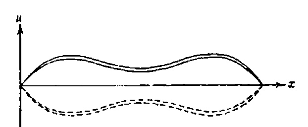

РИС 21.2. Простые колебания свободно опирающейся балки.

Другими словами, балка колеблется на более высоких частотах, чем струна. Отметим, что в том и другом случаях высшие частоты кратны основным частотам колебаний.

## ЗАМЕЧАНИЯ

- 1. Вообще говоря, балку можно закрепить тремя способами:
  - а) оставить свободной (незакрепленной),
  - б) свободно опереть.
  - в) жестко закрепить.

Схематически эти способы закрепления изображены на рис. 21.3.

2. Еще одна важная задача — колебания балки с заделанным концом (см. рис. 213). Благодаря нестандартным граничным условиям

$$

$$
  
 $u_x(0, t) = 0,$   
 $u_{xx}(1, t) = 0,$   
 $u_{xx}(1, t) = 0,$ 

решение уже не будет выражаться в виде ряда из произведений синусов и косинусов. Оно будет иметь более сложную структуру

$$

(\text{УЧП}) \quad u_{tt} + u_{xxxx} = 0, \quad 0 < x < 1, \quad 0 < t < \infty,

$$

где собственные функции  $X_n(x)$  являются линейными комбинациями синусов, косинусов, гиперболических синусов и гиперболических косинусов. Решение этой задачи можно найта в руководствах по теории упругости.

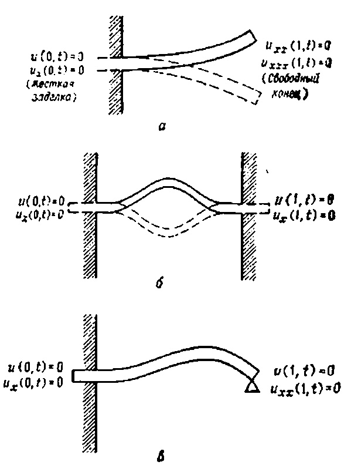

РИС. 21.3. Типичные задачи для балки: a—защемленная балка; b—балка, жестко заделанная с обоих концов; a—левый конец жестко заделан, правый свободно опирается.

#### ЗАДАЧИ

1. Решите задачу для балки с закрепленным концом.

$$

(\text{ГУ}) \quad

$$

$$

$$
$$

\begin{cases} u(0, t) &= 0, \\ u_x(0, t) &= 0, \\ u_{xx}(1, t) &= 0, \\ u_{xxx}(1, t) &= 0, \end{cases}

$$
\begin{cases}

ТАБЛИЦЯ F. Перетворення Лапласа

$$

$$
|----------------------------------|
| 1/с, с > 0 |
$$

$$
$$

\begin{cases} u(x, 0) &= f(x), \\ u_t(x, 0) &= g(x). \end{cases}

$$
$$

$$
$$

6 M 601

ПРИМІТКА. Хоча власні функції, $ X_n(x) $ в цій задачі, вже не є звичайними синусами, згідно з загальною теорією Штурма-Лівілля, вони будуть ортогональними на сегменті [0, 1].

2. Знайти розв'язок для вільно лежачого балки на обох кінцях за початкових умов

$$
$$

 $ u_t(x, 0) = \sin(\pi x). $ $ 0 \le x \le 1, $ 3. Решите задачу 2 с начальными условиями

$$
$$

\quad 0 \le x \le 1,

$$
$$

$$
$$

(см. рис. 22.2).

РИС. 22.2. Задача теплопроводности в плоскости переменных (х, т).

Наша цель — дать новую эквивалентную (22.1) постановку задачи таким образом, чтобы

в новой задаче не было никаких физических параметров (вроде α);

2) начальные и граничные условия стали проще.

Для осуществления этой цели, мы введем три новых безразмерных переменных U,  $ \xi $  и  $ \tau $ , чтобы заменить прежние u, x и t по схеме

$$
$$

 (безразмерная температура),  $ x \to \xi $  (безразмерная длина),  $ t \to \tau $  (безразмерное время).

Мы проведем все три преобразования одновременно.

# Преобразование зависимой переменной $ u \rightarrow U $

Определим функцию U(x, t) по формуле

$$
$$

U(x, t) = \frac{u(x, t) - T_1}{T_2 - T_1}

$$
$$

.

Ясно, что новая температура  $ U\left(x,\,t\right) $  безразмерна, поскольку мы делим градусы Цельсия на градусы Цельсия. Новые граничные условия для  $ U\left(x,\,t\right) $  при x=0 и x=L примут вид  $ U\left(0,\,t\right)=0 $  и  $ U\left(L,\,t\right)=1 $ . Давайте поставим задачу для новой функции  $ U\left(x,\,t\right) $ . После несложных преобразований задача (22.1) переходит в новую задачу

задачу 

$$
| F(s-a) |
| F(s) G(s) |

$$

Если угодно, то здесь можно остановиться, решить задачу для  $ U\left(x,\, t\right) $  и затем найти  $ u\left(x,\,t\right) $  по формуле

$$

| 15. f^{(n)}(t) , (n-похідна) | s^{n}F(s) - s^{n-1}f(0) - \dots - f^{(n-1)}(0) |
|------------------------------------------------------------------------|--------------------------------------------------|
| 16. ж. (at) | \frac{1}{a}F\left(\frac{s}{a}\right),  a>0 |
$$

u(x, t) = T_1 + (T_2 - T_1) U(x, t).

$$
$$

Однако мы пойдем дальше и займемся преобразованием независимых переменных x и t.

# Преобразование пространственной координаты $ x \rightarrow \xi $

Представляется совершенно очевидным, как следует выбрать безразмерную переменную  $ \xi $ . Поскольку  $ 0 \leqslant x \leqslant L $ , полагаем

$$
| 19. Ерік (A/2 <b>V</b> <del>T</del> ) | \frac{1}{s}e^{-a} |
$$

\xi = x/L

$$
$$

.

После вычисления производных

$$
$$

U_x = U_{\xi} \xi_x = \frac{1}{L} U_{\xi},

$$
$$

 U_{xx} = \frac{1}{L^2} U_{\xi\xi}

$$

# Додаток 2

# ПРЕДСТАВЛЕННЯ ЛАПЛАСІАНА В РІЗНИХ СИСТЕМАХ КООРДИНАТ

$$

\begin{array}{ll} (\text{YM}\Pi) & U_t = (\alpha/L)^2 \, U_{\xi\xi}, \quad 0 < \xi < 1, \quad 0 < t < \infty, \\ (22.3) & (\Gamma \text{Y}) & \begin{cases} U(0,\ t) = 0, \\ U(1,\ t) = 1, \\ U(\xi,\ 0) = \frac{\sin\left(\pi\xi\right) - T_1}{T_2 - T_1}, \quad 0 \leqslant \xi \leqslant 1. \end{cases}

$$

У тривимірній сферичній системі координат

$$

cu_{\mathbf{t}} = [\alpha/L]^2 u_{\xi\xi}.

$$

$$

\tau = [\alpha/L]^2 t.

$$

$$

\begin{array}{cccccccccccccccccccccccccccccccccccc

$$

# Декартова система координат

$$

u(x, t) = T_1 + (T_2 - T_1) U(x/L, \alpha^2 t/L^2).

$$

# Циліндрична система координат

 \begin{array}{lll}
$$

\begin{array}{ll} (\text{УЧП}) & u_{tt} = \alpha^2 u_{xx}, & 0 < x < L, & 0 < t < \infty, \\ u(0, t) = 0, & 0 < t < \infty, \\ u(L, t) = 0, & 0 < t < \infty, \\ u(X, 0) = \sin(\pi x/L) + (0.5)\sin(3\pi x/L), \\ u_t(x, 0) = 0. & \end{array}

$$
$$

\xi = x/L

$$
$$

(\text{YYII}) \qquad u_{\tau\tau} = u_{\xi\xi}, \quad 0 < \xi < 1, \quad 0 < \tau < \infty, 1

$$
$$

 \begin{cases} u(0, \tau) = 0, \\ u(1, \tau) = 0, \\ u(\xi, 0) = \sin(\pi\xi) + 0.5\sin(3\pi\xi), \\ u_{\xi}(\xi, 0) = 0, \end{cases}

$$
$$

 (\text{HY}) \quad 

$$
 \end{array}
 ## Сферична система координат

$$

\begin{cases} u(\xi, 0) = \sin(\pi\xi) + 0.5\sin(3\pi\xi), \\ u_{\xi}(\xi, 0) = 0, \end{cases}

$$

# Еліптичні типові рівняння

$$

 \quad 0 \leqslant \xi \leqslant 1,

$$

Рівняння Лапласа Рівняння Гельмгольца Рівняння Пуассона-Шредінгера

# Рівняння гіперболічного типу

$$

u(\xi, \tau) = \cos(\pi \tau) \sin(\pi \xi) + 0.5 \cos(3\pi \tau) \sin(3\pi \xi).

$$

$$

u(x, t) = \cos(\pi \alpha t/L)\sin(\pi x/L) + 0.5\cos(3\pi \alpha t/L)\sin(3\pi x/L).

$$

Рівняння коливання струни Рівняння коливання з тертям

Телеграфне рівняння

Рівняння коливань під впливом зовнішньої сили

Багатовимірне хвильове рівняння з тертям

# Параболічні типові рівняння

u_t = \alpha^2 u_{xx} u_t = \alpha^2 u_{xx} - hu_x u_t = \alpha^2 u_{xx} - ku u_t = \alpha^2 u_{xx} + f(x, t) Уравнение одномерной диффузии Уравнение конвективной диффузии

Уравнение теплопроводности с поглощением Уравнение теплопроводности с источником

# **КРОССВОРД**

$$

\xi = x/L

$$

Горизонтальна 1. Характеристики векторного поля. 3. Накладання. 8. Довжина. 9. Оператор Лаплас. 12. Поширення обурення. 13. Довжина вектора. 14. Робота функцій прокладки. 15. Множина \int \Delta u = 0 множина точок, на яких будується схема різниці. 16. |u|_{\Gamma} = \varphi Завдання \_\__\\_\__ 22. Рух рідини описується рівняннями \_\_\_\_\___ Стокс. 24 Функція f(x) = f(-x), якщо f(x) = f(-x). 25. Французький математик, автор методу ділення змінних. 26. Тонкий натягнутий дріт. 27. Будь-яке нетривіальне розв'язання задачі Штурма-Ліувіля називається \_\__ 28. Французький математик, на честь якого названа задача з початковою умовою. 29. Основний принцип геометричної оптики називається принципом \_\__\__\_ 30. Колишня назва студентської книги записів. 32. Математик, який запропонував прямий метод розв'язання варіаційних задач. 33. Функцію джерела також називають функцією \_\__\_ 34. Гармоніка. 36. Площа літака D = \{r \colon R_1 \leqslant r \leqslant R_2\} . 38. Англійський математик і механік. 40. Головна характеристика періодичної функції. 42. Хвилі в середовищі поширюються відповідно до принципу \_\_\_ 43. Спектральний параметр. 44. Узагальнення поняття функції. 45. Множина частот під час розкладу функції.

Вертикальний

поля.

2. Термофізичні характеристики матерії. 3. Радянський математик, академік, автор найвідомішого підручника з рівнянь математичної фізики. 4. Задача з граничними умовами третього типу називається задачею \_\_\__\_\___\___

K(x,s) у інтегральному перетворенні F(s) = \int_{a}^{b} K(x, s) f(s) ds 7. Значення, яке не змінюється під час трансформацій. 10. Характеристики векторного поля. 11. Французький математик. 13. Стю-

Функція піни H(t) = \begin{cases} 0, & t < 0 \\ 1, & t \ge 0 \end{cases}
$$

 \begin{array}{lll} (\text{Y} \, \Pi) & u_t = \alpha^2 u_{xx}, & 0 < x < L, \\ (\Gamma \, \text{Y}) & \left\{ \begin{array}{ll} u \, (0, \, t) = T_1, \\ u \, (L, \, t) = 0, \\ u \, (x, \, 0) = T_2, & 0 \leqslant x \leqslant L. \end{array}

\[
\mathcal{F}_s[f](\omega) = \frac{2}{\pi}\int_0^\infty f(t)\sin(\omega t)\,dt,
\]

\[
\mathcal{F}_s^{-1}[F](t) = \int_0^\infty F(\omega)\sin(\omega t)\,d\omega.
\]

\[
\mathcal{F}_c[f](\omega) = \frac{2}{\pi}\int_0^\infty f(t)\cos(\omega t)\,dt,
\]

\[
\mathcal{F}_c^{-1}[F](t) = \int_0^\infty F(\omega)\cos(\omega t)\,d\omega.
\]

\[
\mathcal{F}[f](\omega) = \frac{1}{\sqrt{2\pi}}\int_{-\infty}^{\infty} f(x)e^{-i\omega x}\,dx,
\]

\[
\mathcal{F}^{-1}[F](x) = \frac{1}{\sqrt{2\pi}}\int_{-\infty}^{\infty} F(\omega)e^{i\omega x}\,d\omega.
\]

\[
S_n = \frac{2}{L}\int_0^L f(x)\sin\!\left(\frac{n\pi x}{L}\right) dx,
\]

\[
f(x) = \sum_{n=1}^{\infty} S_n \sin\!\left(\frac{n\pi x}{L}\right).
\]

\[
C_n = \frac{2}{L}\int_0^L f(x)\cos\!\left(\frac{n\pi x}{L}\right) dx,
\]

\[
f(x) = \frac{C_0}{2} + \sum_{n=1}^{\infty} C_n \cos\!\left(\frac{n\pi x}{L}\right).
\]

\[
\mathcal{L}[f](s) = \int_0^\infty e^{-st}f(t)\,dt,
\]

\[
\mathcal{L}^{-1}[F](t) = \frac{1}{2\pi i}\int_{\gamma-i\infty}^{\gamma+i\infty} e^{st}F(s)\,ds.
\]

\[
H\{f\}(\xi) = F_n(\xi) = \int_0^\infty r J_n(\xi r) f(r)\,dr,
\]

\[
H^{-1}[F_n](r) = \int_0^\infty \xi J_n(\xi r) F_n(\xi)\,d\xi.
\]

$$u(\xi, \tau) = \cos(\pi \tau) \sin(\pi \xi) + 0.5 \cos(3\pi \tau) \sin(3\pi \xi).$$

$$u(x, t) = \cos(\pi \alpha t/L)\sin(\pi x/L) + 0.5\cos(3\pi \alpha t/L)\sin(3\pi x/L).$$

$$\xi = x/L$$

$$
$$

$$
$$

$$
$$

$$
$$

$$
$$

тому в рівнянні (23.3) залишається лише одна часткова похідна другого порядку $ u_{\xi\eta} $ (не слід шукати заміну змінним, за допомогою якої гіперболічне вирівнювання

1) Необхідно, щоб це перетворення координат було локально оборотним і подвійно диференційованим. — Ед. Ед.

У цьому випадку це неможливо).

Вычислим сначала частные производные

$$
\right. \\ \end{array}$$

Підставляючи ці відношення до початкового рівняння (23.3), після простих, але громіздких обчислень отримуємо

(23.5)

$$U(x, t) = \frac{u(x, t) - T_1}{T_2 - T_1}$$

$$u_t + vu_x = 0?$$

$$Au_{xx} + Bu_{xy} + Cu_{yy} + Du_x + Eu_y + Fu = G$$

$$Au_{xx} + Bu_{xy} + Cu_{yy} + Du_x + Eu_y + Fu = G,$$

$$A=1$$

$$A=1$$

$$u_{\xi\eta} = \Phi(\xi, \eta, u, u_{\xi}, u_{\eta}).$$

$$Au_{xx} + Bu_{xy} + Cu_{yy} + Du_x + Eu_y + Fu = G$$

$$\xi = \xi(x, y),$$

$$\eta = \eta(x, y)$$

$$
$$

$$
$$

\begin{split} &A\left[\xi_{x}/\xi_{y}\right]^{2}+B\left[\xi_{x}/\xi_{y}\right]+C=0,\\ &A\left[\eta_{x}/\eta_{y}\right]^{2}+B\left[\eta_{x}/\eta_{y}\right]^{2}+C=0. \end{split}

$$
$$

$$
$$

$$
$$

\begin{bmatrix} \xi_x/\xi_y \end{bmatrix}

$$
$$

$$\overline{A}u_{\xi\xi} + \overline{B}u_{\xi\eta} + \overline{C}u_{\eta\eta} + \overline{D}u_{\xi} + \overline{E}u_{\eta} + \overline{F}u = \overline{G},$$

(характеристические

$$\overline{A} = A\xi_{x}^{2} + B\xi_{x}\xi_{y} + C\xi_{y}^{2},$$

уравнения).

Кожне квадратичне рівняння для $ [\xi_x/\xi_y] $ і $ [\eta_x/\eta_y] $ має два ядра, але залишаємо лише одне, щоб вони відрізнялися.

$$\overline{B} = 2A\xi_{x}\eta_{y} + B(\xi_{x}\eta_{y} + \xi_{y}\eta_{x}) + 2C\xi_{y}\eta_{y},$$

РИС. 23.1. Характеристики $ \xi(x, y) = c $ та $ \eta(x, y) = c $ .

Задача була зведена до знаходження двох функцій $ \xi(x, y) $ і $ \eta(x, y) $ , так що відношення $ [\xi_x/\xi_y] $ і $ [\eta_x/\eta_y] $ задовольняють рівняння (23.7). Дуже легко знайти такі функції 1) якщо звернути увагу на рис. 23.1. Щоб зрозуміти, як це можна зробити, розглянемо просте рівняння

$$\overline{C} = A\eta_{x}^{2} + B\eta_{x}\eta_{y} + C\eta_{y}^{2},$$

Его характеристики определяются из уравнений

$$\overline{D} = A\xi_{xx} + B\xi_{xy} + C\xi_{yy} + D\xi_{x} + E\xi_{y},$$

Решая эти уравнения относительно у, получаем

$$\overline{E} = A\eta_{xx} + B\eta_{xy} + C\eta_{yy} + D\eta_{x} + E\eta_{y},$$

$$\overline{F} = F,$$

$$\overline{G} = G.$$

$$\bar{A} = A\xi_x^2 + B\xi_x\xi_y + C\xi_y^2 = 0,$$

$$
$$

1) См., например, Тихонов А. Н., Самарский А. А. Уравнения математической физики. — М.: Наука, 1972 и др. издания. — Прим. ред.

Очевидно, що функції $ \xi $ і $ \eta $ введені таким чином, задовольняють рівняння характеристик. Ці нові координати показані на рис. 23.2. На цьому наше обговорення того, як знайти нові координати, завершується. Останнє, що залишилося — визначити новий тип початкового рівняння.

$$
$$

РИС. 23.2. Характеристичні координати рівняння $ u_{xx} - 4u_{uu} + u_x = 0 $ .

Це досить просто: знайти канонічну форму диференціального рівняння з частковими похідними, підставити нові координати $ \xi(x, y) $ і $ \eta(x,) y) $ у рівняння

$$
$$

,

де $ \overline{A} $ , $ \overline{B} $ , $ \overline{C} $ , $ \overline{D} $ , $ \overline{E} $ , $ \overline{F} $ та $ \overline{G} $ визначаються формулами (23.6).

Прежде чем закончить лекцию, давайте на конкретном примере посмотрим, как «работает» общий метод приведения к каноническому виду.

Приведение гиперболического уравнения $ y^2u_{xx}-x^2u_{yy}=0 $ к канонической форме

Рассмотрим уравнение

$$
$$

, $ x> $ , $ 0 y>0 $ ,

що є гіперболічним у першому квадранті. Знайдемо нові координати так, щоб початкове рівняння набуло канонічної форми.

ШАГ 1. Решаем уравнения характеристик

$$
$$

(напомним, что этот шаг

$$

Разрешив их относительно  $[\xi_x/\xi_y]$  и  $[\eta_x/\eta_y]$ , получаем

(23.7) 
$$

обеспечивает $ \overline{A} = \overline{C} = 0 $ ),

$$
$$

РИС. 23.3. Нові карактеристичні координати.

Інтегруючи ці звичайні диференціальні рівняння методом розділення змінних, ми отримуємо два неявних співвідношення (за бажанням можна виразити y через x)

$$
$$

$$
$$

$$
$$

$$
= \frac{-B + \sqrt{B^2 - 4AC}}{2A}$$

$$[\eta_x/\eta_y] = \frac{-B - \sqrt{B^2 - 4AC}}{2A}$$

$$

$$

$$u_{xx} - 4u_{yy} + u_x = 0.$$

$$\begin{vmatrix} \frac{dy}{dx} = -[\xi_x/\xi_y] = \frac{B - \sqrt{B^2 - 4AC}}{2A} = -2, \\ \frac{dy}{dx} = -[\eta_x/\eta_y] = \frac{B^{\frac{1}{2}} + \sqrt{B^2 - 4AC}}{2A} = 2.$$

$$y = -2x + c_1,$$

$$y = 2x + c_2.$$

$$\xi = y + 2x = c_1,$$

$$\eta = y - 2x = c_2.$$

$$

$$

$$\overline{A}u_{\xi\xi} + \overline{B}u_{\xi\eta} + \overline{C}u_{\eta\eta} + \overline{D}u_{\xi} + \overline{E}u_{\eta} + \overline{F}u = \overline{G}$$

$$y^2u_{xx}-x^2u_{yy}=0$$

$$\frac{dy}{dx} = \frac{B + \sqrt{B^2 - 4AC}}{2A} = \frac{x}{y}$$

$$\frac{dy}{dx} = \frac{B - \sqrt{B^2 - 4AC}}{2A} = -\frac{x}{y}.$$

$$

$$

$$y^2 - x^2 = \text{const},$$

$$y^2 + x^2 = \text{const}.$$

$$\xi = y^2 - x^2$$

$$\vec{B} = 2A\xi_x\eta_x + B(\xi_x\eta_y + \xi_y\eta_x) + 2C\xi_y\eta_y = -16x^2y^2$$

\begin{array}{l} u_{\xi} = u_{\alpha}\alpha_{\xi} + u_{\beta}\beta_{\xi} = u_{\alpha} + u_{\beta}. \\ u_{\eta} = u_{\alpha}\alpha_{\eta} + u_{\beta}\beta_{\eta} = u_{\alpha} - u_{\beta}, \\ u_{\xi\eta} = u_{\alpha\alpha}\alpha_{\eta} + u_{\alpha\beta}\beta_{\eta} + u_{\beta\alpha}\alpha_{\eta} + u_{\beta\beta}\beta_{\eta} = u_{\alpha\alpha} - u_{\beta\beta}, \end{array}

$$\bar{D} = A\xi_{xx} + B\xi_{xy} + C\xi_{yy} + D\xi_x + E\xi_y = -2(x^2 + y^2)$$

$$\widetilde{E} = A\eta_{xx} + B\eta_{xy} + C\eta_{yy} + D\eta_x + E\eta_y = 2(y^2 - x^2),$$

$$\tilde{F} = F = 0$$

$$\overline{G} = G = 0$$

$$\overline{A}u_{\xi\xi} + \overline{B}u_{\xi\eta} + \overline{C}u_{\eta\eta} + \overline{D}u + \overline{E}u_{\eta} + \overline{F}u = \overline{G}$$

$$u_{\xi\eta} = \frac{-(x^2 + y^2) u_{\xi} + (y^2 - x^2) u_{\eta}}{8x^2y^3}.$$

- Читач може запитати, чому необхідно класифікувати та зводити їх до канонічної форми диференціальних рівнянь у похідних похідних.
  - a) Поділ рівнянь на класи гіперболічних, параболічних та еліптичних відповідає поділу фізичних процесів на три основні класи: хвильовий, дифузійний і стаціонарний. Математичні особливості розв'язків цих трьох типів рівнянь є абсолютно різними.
  - b) У більшості праць, присвячених розв'язанню гіперболічних задач, припускається, що початкове рівняння записується у канонічній формі, тобто у вигляді

$$u_{\xi\eta} = \frac{\eta u_{\xi} - \xi u_{\eta}}{2(\xi^2 - \eta^2)}.$$

Якщо у нас є рівняння і ми хочемо отримати його розв'язок, ми повинні перетворити його у канонічну форму і використати відомі результати.

c) Для чисельного розв'язання канонічного гіперболічного рівняння було створено багато різних комп'ютерних програм.

Функція $ \Phi $ ( $ \xi $ , $ \xi \eta $ , u, $ u_{\xi} $ , $ u_{\eta} $ ) вводиться у VM $ \Theta $ як підпрограма, тому рівняння спочатку має бути канонічним. Як тільки розв'язок знайдено в нових координатах, його завжди можна перетворити назад на початкові координати.

# ЗАВДАННЯ

- 1. Дізнайтеся, чи є наступні рівняння гіперболічними, параболічними чи еліптичними:
- : **a)** $ u_{xx} u_{xy} = 0 $ ,
  - 6) $ u_{tt} = u_{xx} + u_x + hu $ ,
  - **B)** $ u_{xx} + 3u_{yy} = \sin x $ ,
  - r) $ u_{xx} + u_{yy} = f(x, y) $ ,
  - $ \mathbf{D} ) \ u_{rr} + \frac{1}{r} u_r + \frac{1}{r^2} u_{\theta \theta} = f(r, \ \theta). $ - 2. Отримайте співвідношення (23,4), (23,5) та (23,6).
- 3. Переконайтеся, що рівняння

$$\alpha = \alpha (\xi, \eta) = \xi + \eta,$$

гиперболического типа при всех x и y и найдите $ x a p a \kappa m e p u c $ - $ m u + e c \kappa u + e c \kappa u + e c \kappa u + e c \kappa u + e c \kappa u + e c \kappa u + e c \kappa u + e c \kappa u + e c \kappa u + e c \kappa u + e c \kappa u + e c \kappa u + e c \kappa u + e c \kappa u + e c \kappa u + e c \kappa u + e c \kappa u + e c \kappa u + e c \kappa u + e e c \kappa u + e c \kappa u + e c \kappa u + e c \kappa u + e c \kappa u + e c \kappa u + e c \kappa u + e c \kappa u + e c \kappa u + e c \kappa u + e c \kappa u + e c \kappa u + e c \kappa u + e c \kappa u + e c \kappa u + e c \kappa u + e c \kappa u + e c \kappa u + e c \kappa u + e c \kap u + e c \kap

pa u + e c \kappa u + e c \kappa u + e c \kappa u + e c \kappa u + e c \kappa u + e c \kappa u + e c \kappa u + e c \kappa u + e c \kappa u + e c \kappa u + e c \kappa u + e c \kappa u + e c \kappa u + e c \kappa u + e c \kappa u + e c \kappa u + e c \kappa u + e c \kappa u + e c \kappa u + e c \kappa u + e c \kappa u + e c \kappa u + e e c \kappa u + e c \kappa u + e c \kappa u + e c \kappa u + e c \kappa u + e c \kappa u + e c \kappa u + e c \kappa u + e c \kappa u + e c \kappa u + e c \kappa u + e c \kappa u + e c \kappa u + e c \kappa u + e c \kappa u + e c \kappa u + e c \kappa u + e c \kappa u + e c \kappa u + e c \kappa u + e c \kappa u + e c \kappa u + e c \kappa u + e c \kappa u + e c \kappa u + e c \kappa u + e c \kappa u + e c \kappa u + e c \kappa u + e c \kappa u + e c \kappa u + e c \kappa u + e c \kappa u + e c \kappa u + e c \kappa u + e c \kappa u + e c \kappa u + e c \kappa u + e c \kappa u + e c \kappa u + e u + e c \kappa u + e c \kappa u + e c \kappa u + e c \kappa u + e c \kappa u + e c \kappa u + e c \kappa u + e c \kappa u + e c \kappa u + e c \kappa u + e c \kappa u + e c \kappa u + e c \kappa u + e c \kappa u + e c \kappa u + e c \kappa u + e c \kappa u + e c \kappa u + e c \kappa u + e c \ kappa u + e c \kappa u + e c \kappa u + e c \kappa u + e c \kappa u + e c \kappa u + e c \kappa u + e c \kappa u + e c \kappa u + e c \kappa u + e c \kappa u + e c \kappa u + e c \kappa u + e c \kappa u + e c \kappa u + e c \kappa u + e c \kappa u + e c \kappa u + e c \kappa u + e e c \kappa u + e c \kappa u + e c \kappa u + e c \kappa u + e c \kappa u + e c \kappa u + e c \kappa u + e c \kappa u + e c \kappa u + e c \kappa u + e c \kappa u + e c \kappa u + e c \kappa u + e c \kappa u + e c \kappa u + e c \kappa u + e c \kappa u + e c \kappa u + e c \kappa u + e c \kappa u + e c \kappa u + e c \kappa u + e c \kappa u + e c \kappa u + e c \kappa u + e c \kappa u + e c \kappa u + e c \kappa u + e c \kappa u + e c \kappa u + e c \kappa u + e c \kappa u + e c \kappa u + e c \kappa u + e c \kappa u + e c \kappa u + e c \kappa u + e c \kappa u + e c \kappa u + e c \kappa u + e u + e c \kappa u + e c \kappa u + e c \kappa u + e c \kappa u + e c \kappa u + e c \kappa u + e c \kappa u + e c \kappa u + e c \kappa u + e c \kappa u + e c \kappa u + e c \kappa u + e c \kappa u + e c \kappa u + e c \kappa u + e c \kappa u + e c \kappa u + e c \kappa u + e c \kappa u + e c \ kappa u + e c \kappa u + e c \kappa u + e c \kappa u + e c \kappa u + e c \kappa u + e c \kappa u + e c \kappa u + e c \kappa u + e c \kappa u + e c \kappa u + e c \kappa u + e c \kappa u + e c \kappa u + e c $ 4. Приведите уравнение из предыдущей задачи к каноническому виду

$$
$$

5. Продолжите вадачу 4 и приведите уравнение ко второй канонической форме

$$
$$

6. Найдите характеристики уравнения

$$
$$

Перетворіть рівняння на нові координати, розв'яжіть його і поверніться до координат x і y, щоб отримати розв'язок початкової здогадки.

# ХВИЛЬОВЕ РІВНЯННЯ У ВІЛЬНОМУ ПРОСТОРІ (ДВОВИМІРНІ ТА ТРИВИМІРНІ ЗАДАЧІ)

МЕТА ЛЕКЦІЇ: Розв'язати задачу з початковими умовами

(УЧП)

$$
$$

$$
$$

\begin{cases} -\infty < x < \infty, \\ -\infty < y < \infty, \\ -\infty < z < \infty, \end{cases}

$$
$$

$$u_{\alpha\alpha} - u_{\beta\beta} = \frac{-\beta u_{\alpha} - \alpha u_{\beta}}{2\alpha\beta}.$$

$$\alpha = \xi + \eta = (y^2 - x^2) + (y^2 + x^2) = 2y^3,$$

\begin{cases} u(x, y, z, 0) = \varphi(x, y, z), \\ u_{t}(x, y, z, 0) = \psi(x, y, z) \end{cases}

$$\beta = \xi - \eta = (y^2 - x^2) - (y^2 + x^2) = -2x^2.$$

$$u_{\xi\xi} - u_{\eta\eta} = \Psi(\xi, \, \eta, \, u_{\xi}, \, u, u_{\eta}).$$

$$3u_{xx} + 7u_{xy} + 2u_{yy} = 0$$

$$u_{\xi\eta} = \Phi(\xi, \eta, u, u_1, u_2).$$

(НУ) $ $$

содержащей только начальные условия. Эту задачу можно было бы решить либо с помощью преобразования Фурье (по переменной t), либо с помощью преобразования Лапласа (по переменной t). Однако мы воспользуемся другим методом (методом канонических координат), который, как мы надеемся, заинтересует читателя. Этот метод базируется на тех же идеях, что и метод перехода к движущейся системе отсчета, с которым мы познакомились в лекции 15. Итак, приступим к решению задачи (17.1).

# Решение одномерного волнового уравнения. Формула Даламбера

Решение задачи (17.1) разобьем на несколько шагов:

ШАГ 1 (Замена координат (x, t) новыми каноническими координатами  $ (\xi, \eta) $ ).

Для решения задачи (17.1) воспользуемся тем, что если заменить две независимые переменные x и t новыми пространственновременными координатами

$$ $ використовується метод спуску, і доведено, що двовимірні розв'язки не задовольняють принцип Гюйгенса. І нарешті, використовуючи метод спуску, показано, що розв'язок одномірного рівняння виражається формулою д'Аламбера, з якою ми познайомилися раніше.

У попередніх лекціях ми розглядали задачу з початковими умовами для нескінченної вібруючої струни і показали, що її розв'язок задається формулою д'Аламбера. Читачеві має бути зрозуміло, що в тривимірному просторі одномірне хвильове рівняння описує плоскі хвилі. Наприклад, звукові або електромагнітні хвилі на достатньо великих відстанях від джерел можна вважати плоскими хвилями і, отже, описуватися одномірним рівнянням. Існує така термінологія:

- 1) одномірні хвилі називаються плоскими хвилями,
- 2) Двовимірні хвилі називають циліндричними хвилями.

3) трехмерные волны называются сферическими волнами.

Іншими словами, одномірне хвильове рівняння може описувати або плоскі хвилі в просторах більшої кількості розмірів, або коливання струн. Завдання лекції — узагальнити формулу д'Аламбера для випадку двох і трьох вимірів.

# Хвилі у тривимірному просторі

Розглянемо сферичні хвилі у тривимірному просторі за заданих початкових умов, тобто розв'яжемо задачу з початковими умовами

(24.1)

$$u_{\alpha\alpha} - u_{\beta\beta} = \Psi(\alpha, \beta, u, u_{\alpha}, u_{\beta}).$$

(24.1)

$$u_{xx} + 4u_{xy} = 0.$$

$$u_{tt} = e^{2} (u_{xx} + u_{yy} + u_{zz}),
$$

$$
$$

где экаком $ \Delta $ обозначен дифференциальный оператор

$$
$$

$$
$$

$$
$$

 $ + ct \cos \varphi $ ) $ (ct)^2 \sin \varphi d\varphi d\theta $ .

Аргументи функції $ \psi $ проходити по поверхні сфери, якщо значення $ \theta $ і $ \phi $ змінюються відповідно в межах $ [0, 2\pi] $ і $ [0, \pi] $ (рисунок 24.1). Цю формулу можна інтерпретувати так:

См Владимиров В. С. Уравнения математической физики. — М.: Наука, 1971 и др. издания. — Прим ред.

дующим образом: каждая точка пространства излучает расходящуюся (со скоростью c) сферическую волну, через t секунд точка с координатами (x, y, z) окажется под воздействием начального Р И С

$$
(НУ) 
$$

. 24 1. Решение является средним значением начатьного распределения на сфере.

возмущения, сосредоточенного на сфере раднуса ct с центром в заданной точке (см. рис. 24.2).

Формула (24.3) дозволяє обчислити розв'язок задачі для більшості початкових умов на комп'ютері. Можливо, читачу буде цікаво знайти розв'язок для деяких простих функцій f.

$$
$$

РИС. 24.2. Початкове збурення $ \psi $ поширюється з кожної точки у всіх напрямках.

Щоб отримати повне рішення, розглянемо другу половину проблеми

(24.4)

$$
$$

$$
$$

$$
$$

$$
$$

$$u_{tt} = c^2 (u_{xx} + u_{yy}), \quad
$$

$$
$$

$$
$$

$$
$$

$$
$$

(\text{УЧП}) \quad u_{tt} = c^2 \Delta u, \quad (x, y, z) \in \mathbb{R}^3,

$$
$$

(\text{HV}) \quad

$$

\begin{cases} -\infty < x < \infty, \\ -\infty < y < \infty, \\ -\infty < z < \infty, \end{cases}

$$

$$
$$

\begin{cases} u = \varphi, \\ u_t = \psi \end{cases}

$$P_{2}
$$

$$

\begin{aligned} u_{tt} &= c^2 \Delta u, \\ (HY) & \begin{cases} u(x, y, z, 0) = 0, \\ u_t(x, y, z, 0) = \psi(x, y, z), \end{cases} \end{aligned}

$$

$$
$$

$$P_{1}
$$

$$

где $ \overline{\psi} $ — *среднее* значение начального распределения $ \psi $ *по сфере* радиуса ct с центром в точке (x, y, z), т. е.

$$

$$

$$

$$

$$

$$
$$

$$u_h(r, \theta) = \sum_{n=0}^{\infty} r^n [a_n \cos(n\theta) + b_n \sin(n\theta)].$$

$$
$$

$$
u = \frac{\partial}{\partial t} [t\overline{\varphi}].
$$

\begin{cases} -\infty < x < \infty, \\ -\infty < y < \infty, \end{cases}

$$

u_p(r, \theta) = Ar^4 + Br^4 \cos(2\theta).

$$

$$
u(x, t) = \frac{1}{2c} \int_{x-ct}^{x+ct} \varphi(s) ds.
$$

$$

u_p(r, \theta) = -\frac{r^4}{32} - \frac{r^4}{24} \cos(2\theta).

$$

(НУ) $ $$
\frac{d\varphi(e)}{de} \equiv \int_{a}^{b} \left\{ \frac{\partial F}{\partial \overline{y}} - \frac{\partial}{\partial x} \left[ \frac{\partial F}{\partial \overline{y'}} \right] \right\} \, \eta(x) \, dx = 0.
$$ $ Розглянемо розв'язок тривимірної задачі за початкових умов, які залежать лише від двох змінних X і Y.

Сделав это, получим, что трехмерная формула

$$
u_t(x, t) = \frac{1}{2} [\varphi(x + ct) + \varphi(x - ct)].
$$

для розв'язку та опише циліндричні хвилі і, отже, дасть розв'язок двовимірної задачі. Цей метод називається методом спуску. Після всіх розрахунків ми отримуємо 1) (зовсім не тривіальне)

$$

\sum_{n=0}^{\infty} [a_n \cos(n\theta) + b_n \sin(n\theta)] - \frac{1}{32} - \frac{1}{24} \cos(2\theta) = 0.

$$

Перед нами стоїть розв'язок двовимірного хвильового рівняння, і хоча, найімовірніше, його практичне застосування передбачає використання комп'ютера, цікаво аналізувати його з точки зору принципу Гюйгенса. У цьому розв'язці обидва інтеграли початкових збурень розглядаються вздовж внутрішньої частини (тут слово «внутрішнє» відіграє вирішальну роль) кола з радіусом cte e центр у точці (x, y). Іншими словами, якщо ми проаналізуємо це рішення так само, як у тривимірному випадку, то побачимо, що початкове збурення поширюється з чітко визначеним переднім краєм і розмитим заднім краєм. Отже, принцип Гюйгенса не виконується у просторі двох вимірів.

Нарешті, припустимо, що початкові збурення $ \phi $ і $ \phi $ залежать лише від однієї змінної. У цьому випадку виникають плоскі хвилі, і після застосування методу спуску отримуємо

&lt;sup>2) См., например, Тихонов А. Н., Самарский А. А. Уравнения математической физики. — М.: Наука, 1972 и др. издания. — Прим. ред.

хорошо известную формулу Даламбера

$$

u_1(r, \theta) = \frac{1}{32} + \frac{1}{24}r^2\cos(2\theta) - \frac{r^4}{24}\cos(2\theta) - \frac{r^4}{32} = \frac{(r^4 - 1)}{32} - \frac{(r^4 - r^2)}{24}\cos(2\theta).

$$

Слід зазначити, що в цьому випадку використання методу спуску вимагає нетривіальних розрахунків. За формулою д'Аламбера початкове зміщення f призводить до утворення гострого заднього краю, а початкова швидкість f його розмиває. Іншими словами, одномірний випадок є незвичайним тим, що принцип Гюйгенса виконується для початкових зсув і не застосовується для початкових швидкостей. Можна стверджувати, що загалом принцип Гюйгенса не виконується в одномірному випадку.

# ЗАУВАЖЕННЯ

Метод спуску ми не викладали детально, оскільки неможливо зупинитися на питанні, як можна зменшити розмірність інтегралів, включених у формули. Усі ці розрахунки можна знайти в навчальній літературі, перелік якої наведено наприкінці книги. Загальна ідея полягає в тому, що при розв'язанні задач у низьковимірному просторі можна використати відоме розв'язання подібної задачі у просторі вищої вимірності, а потім спростити його, припускаючи, що початкові та граничні умови не залежать від частини змінних. Читачеві має бути зрозуміло, що метод спуску можна застосувати не лише до розглянутої проблеми.

# ЗАВДАННЯ

1. Показати, що в одномірному випадку розв'язок задачі

$$

u = u_0 + u_1 = r \cos \theta - \frac{(r^4 - 1)}{32} - \frac{(r^4 - r^2)}{24} \cos (2\theta).

$$

$$
$$

$$
$$

$$
$$

$$ \Delta u = 0, \quad 0 < r < 1 + \frac{1}{4} \sin \theta,$$

$$u \left( 1 + \frac{1}{4} \sin \theta, \ \theta \right) = \cos \theta, \quad 0 \le \theta \le 2\pi.$$

\begin{aligned} & (\forall \mathsf{Y}\Pi) \quad u_{tt} = c^2 u_{xx}, \\ & (\mathsf{H} \mathsf{Y}) \quad \begin{cases} u\left(x, \ 0\right) = 0, \\ u_t\left(x, \ 0\right) = \phi\left(x\right). \end{cases} \end{aligned}

$$u\left(1+\frac{1}{4}\sin\theta,\ \theta\right)=\cos\theta$$

$$u(1+\epsilon\sin\theta, \theta) = \cos\theta, \quad 0 \le \epsilon \le 1/4.$$

$$
$$

$$
$$

$$
$$

$$
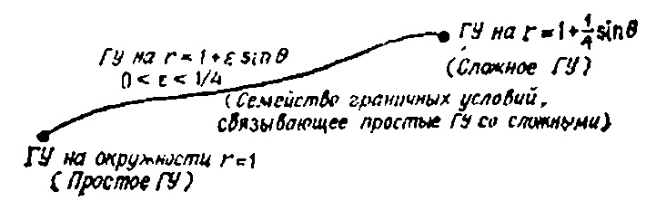
$$

$$

u(1+\varepsilon\sin\theta,\ \theta)=u(1,\ \theta)+u_r(1,\ \theta)(\varepsilon\sin\theta)+u_{rr}(1,\ \theta)\frac{(\varepsilon\sin\theta)^2}{21}+\ldots

$$

$$

\Delta u = 0, \quad 0 < r < 1 + \varepsilon \sin \theta,

$$

$$

u(1, \theta) + u_r(1, \theta) (\varepsilon \sin \theta) + u_{rr}(1, \theta) \frac{(\varepsilon \sin \theta)^2}{2!} + \dots = \cos \theta.

$$

\begin{cases} u(x, 0) = x, \\ u_t(x, 0) = 0. \end{cases}

$$

(46.8) u = u_0 + \varepsilon u_1 + \varepsilon^2 u_2 + \dots.

$$

$$

P_{0}

$$

3. Проілюструвати та прокоментувати розв'язок тривимірної проблеми

(УЧП)

$$
\begin{cases} \Delta u_{0} = 0, & 0 < r < 1 \text{ (внутри круга),} \\ u_{0}(1, \theta) = \cos \theta, & u_{0}(r, \theta) = r \cos \theta, \end{cases}
$$

$$
$$

$$P_{1}
$$

(НУ)

$$

\begin{cases} \Delta u_{1} = 0, & 0 < r < 1 \text{ (внутри круга),} \\ u_{1}(1, \theta) = -\sin \theta \frac{\partial u_{0}(1, \theta)}{\partial r} = -\sin \theta \cos \theta \end{cases}

$$

5. Решите аналогичную (см. задачу 3) задачу для одномерных плоских волн

(УЧП)

$$
$$

- 6. Какова физическая природа того факта, что принцип Гюйгенса не справедлив в двумерном случае?
- 7. Воспользуйтесь формулой Лейбница

$$
$$

и продифференцируйте интеграл

$$
$$

по времени t.

# СКІНЧЕННІ ПЕРЕТВОРЕННЯ ФУР'Є (ПЕРЕТВОРЕННЯ СИНУСА ТА КОСИНУСА)

МЕТА ЛЕКЦІЇ: Ввести два нові інтегральні перетворення (скінченні перетворення спіуса та косинуса):

$$ u_u + \frac{1}{4} u_t$$

(конечное синус-преобразование),

$$u_t = (1+x) u_{xx}, \\ u(x, 0) = q(x), \quad -\infty < x < \infty,$$

(конечное косинус-преобразование),

$$u_1 = (1 + \varepsilon_1) u_{xx}$$

(обратное синус-преобразование),

$$
$$

(обратное косинус-преобразование),

та показати, як розв'язувати граничні проблеми (зокрема гетерогенні) за допомогою цих перетворень. Раніше ми ознайомилися з регулярними перетвореннями Фур'є та Лапласа і побачили, як застосування цих перетворень до рівняння з частковими похідними зводить задачу до розв'язання звичайного диференціального рівняння. Звичайне перетворення Фур'є означає, що змінна, яку потрібно перетворити, змінюється від $ -\infty $ до $ +\infty $ , тому воно використовується для розв'язання задач у вільному просторі (без меж). У цій лекції ми покажемо, як розв'язувати задачі граничних значень (з межами) шляхом перетворення обмежених змінних (це перший раз, коли ми стикаємося з такою трансформацією).

Давайте на деякий час забудемо про наші завдання і розберемося з самими трансформаціями. Дамо визначення перетворень, формули циркуляції та основні властивості. Для чого потрібні трансформації і як їх використовувати, ми дізнаємося трохи пізніше. Однак, коротко кажучи, суть інтегральних перетворень полягає у розкладі функцій, включених у задачу як

частотам, решении семейства задач для каждой частоты и после-

дующем суммировании всех полученных результатов.

Почнемо з функції f(x), визначеної на інтервалі [0, L]. Скінченні синусоїдальні та косинусоїдальні перетворення цієї функції визначаються формулами

Конечное синус-преобразование $ S[f] = S_n = \frac{2}{L} \int_{\sigma}^{L} f(x) \sin(n\pi x/L) dx $ $ n = 1, 2, \dots $ $ C[f] = C_n = \frac{2}{L} \int_{\sigma}^{L} f(x) \cos(n\pi x/L) dx $ $ n = 0, 1, \dots $ Конечное косинус-преобразование

Читач, ймовірно, помітив, що ці перетворення не відрізняються від формул для визначення коефіцієнтів Фур'є, коли їх розкладають на ряд синусами або косинусами. Інверсійні формули для цих перетворень є типовими рядами Фур'є на синусах і косинусах.

Обратное синус-преобразование

$$
$$

$$
$$

Обратное косинус-преобразование

Отметим, что в обратном косинус-преобразовании суммирование начинается с n=0, а в синус-преобразовании — с n=1.

# Приклади синусоїдального перетворення

Пусть

$$

P_{0}

$$

тогда

$$, $ (x,  y, z) \in R^3 $ , $ u = 0 $ $ u_t =

$$

Графік функції f(x) та її перетворення показані на рис. 25.1. Обернене перетворення записується як

$$

 $ 4. Решите аналогичную (см. задачу 3) задачу для двумерного уравнения

(УЧП)

$$

(действительная форма отображения $ w=z^2 $ ).

Ця форма нам знадобиться пізніше. У цьому прикладі це цікаво, оскільки показує, як гіперболи в площині z переходять до координатних прямих u = const і v = const у площині w.

Тепер перейдемо до вивчення одного конкретного типу функцій комплексної змінної, які виконують конформні відображення.

# Определение конформного отображения

Відображення w=f(z) комплексної площини z у комплексну площину w називається конформним у точці $ z_{\bullet} $ площини z, якщо похідна $ f'(z_{\bullet}) \neq 0 $ . Відображення f(z) називається конформним у регіоні D, якщо $ f'(z) \neq 0 $ в кожній точці регіону D.

Наприклад, відображення $ f(z) = z^2 $ конформно всюди, крім точки z = 0, оскільки $ z'(z) = 2z \neq 0 $ для всіх $ z \neq 0 $ . З іншого боку, відображення $ e^z $ конформно у всій z-площині, оскільки скрізь $ f'(z) = e^z \neq 0 $ . Яке призначення конформних відображень? Відповідь полягає в тому, що, розв'язуючи рівняння Лапласа $ \phi_{xx} + \phi_{yy} = 0 $ в певній області площини змінних x і y, ми можемо розглядати цю площину як площину комплексної змінної z. Розглянемо комплексне відображення w = f(z) площини z у площину w, у якій введені координати (u, v). Відображуючи w = f(z $ \phi_{xy} + \phi_{uy} = 0 $ ), рівняння Лапласа $ \varphi_{xx} + \varphi_{yy} = 0 $ перетворюється на нове диференціальне рівняння в частинних похідних, яке залежить від нових координат і v. До — рівняння, яке $ \phi_{xx} + \phi_{uu} = 0 $ повернеться у рівняння $ \varphi_{nn} + \varphi_{nn} = 0 $ . Отже, ми придумаємо ідею знайти конформне відображення, яке переносить область з комплексною межею у область з простою межею (нагадаємо, що відображення $ w=z^* $ переносить межу першого квадранта площини z у дійсну вісь площини w).

Ось кілька прикладів, які покажуть, як можна розв'язати диференціальні рівняння у похідних за допомогою конформних відображень.

Уравнение Лапласа в верхней полуплоскости.

Припустимо, що нам потрібно розв'язати наступну задачу Діріхле у верхній половині видимості (рис. 47.3):

(47.1)

$$

Зверніть увагу, що в перших двох задачах коефіцієнти є сталими. Читач повинен розуміти, що параметр b має бути достатньо малим, а необережний ряд може відрізнятися

# ЗАДАЧИ

- 1. Подставьте разложение (46.8) в задачу (46.7) и получите последовательность задач $P_0,\ P_1,\ P_2,\ \dots$ . 2. Покажите, что нелинейную задачу

$$

$$

(НУ)

$$

\begin{aligned} (Y & \Pi) & \varphi_{xx} + \varphi_{yy} = 0, & -\infty < x < \infty, & 0 < y < \infty, \\ (47.1) & \varphi(x, 0) = \begin{cases} 0, & |x| > 1, \\ 1, & |x| \le 1. \end{cases}

$$

u(r, \theta) = u_0(r, \theta) + \frac{1}{4}u_1(r, \theta)

$$

w = \ln\left\{\frac{z-1}{z+1}\right\}

$$

\Delta u = 0,

$$

\begin{split} S\left[u_{t}\right] &= \frac{dS\left[u\right]}{dt}, \quad S\left[u_{tt}\right] = \frac{d^{2}S\left[u\right]}{dt^{2}}, \\ S\left[u_{xx}\right] &= -\left[n\pi/L\right]^{2}S\left[u\right] + \frac{2n\pi}{L^{2}}\left[u\left(0,\ t\right) + (-1)^{n+2}u\left(L,\ t\right)\right], \\ C\left[u_{xx}\right] &= -\left[n\pi/L\right]^{2}C\left[u\right] - \frac{2}{L}\left[u_{x}\left(0,\ t\right) + (-1)^{n+1}u_{x}\left(L,\ t\right)\right]. \end{split}

$$

q_{xx} + \varphi_{uu} = 0

$$

 M

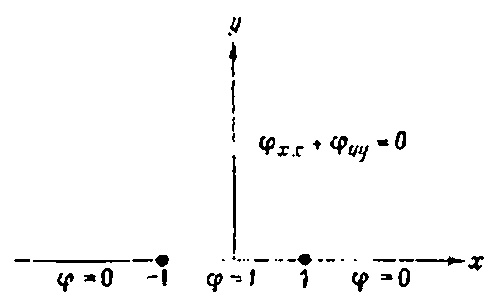

ATHBLK1188X M

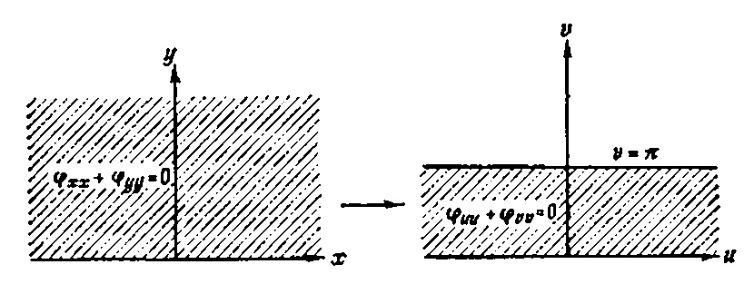

ATHBLK1189X

\begin{cases} (\text{УЧП}) & \varphi_{uu} + \varphi_{vv} = 0, \quad -\infty < u < \infty, \quad 0 < v < \pi, \\ (\text{47.2}) & \begin{cases} \varphi(u, 0) = 0, \\ \varphi(u, \pi) = 1. \end{cases}

$$

w = f(z)

$$

w = u + iv = \ln\left[\frac{z-1}{z+1}\right] =

$$
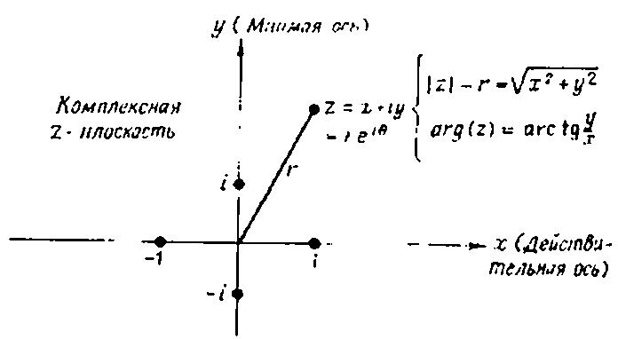
$$

\begin{cases} u(0, t) = 0, \\ u(1, t) = 0, \end{cases}

$$
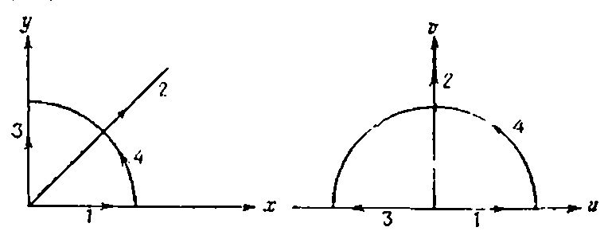
$$

= \ln\left[\frac{z-1}{z+1}\right] + i \arg\left[\frac{z-1}{z+1}\right]

$$

u + iv = (x + iy)^2 = x^2 - y^2 + 2ixy

$$

v = \arg\left[\frac{z-1}{z+1}\right] = \arg\left[\frac{x+iy-1}{x+1+iy}\right] =

$$

\left\{

$$

= \arg\left[\frac{x^2+y^2-1+i2y}{(x+1)^2+y^2}\right] =

$$

Чи знаєте ви, як виглядає графік цієї функції з сегментом [0, 1]? Подумай про це. Зверніть увагу, що синусоїдальне перетворення функції f(x) визначається лише для додатних цілих чисел n. Іншими словами, скінченний синус і косинус перетворюють функції у чисельні послідовності.

РИС. 25.1. Графики функции f(x) = 1 и ее преобразования.

# Свойства преобразований

Прежде чем приступить к решению задач, мы должны получить некоторые свойства этих преобразований.

Якщо you(x, t) — функція $ \partial \theta yx $ змінних, і ми виконуємо перетворення змінної x, то

$$

= \arg\left[\frac{2y}{x^2+y^2-1}\right]

$$

(Зверніть увагу, що перетворення було виконано на змінній x, і отримана послідовність залежить лише від часу t.)

А как быть с производными? Ниже приводятся несколько полезных формул

$$

\begin{cases} u(x, 0) = 1, \\ u_t(x, 0) = 0, \end{cases}

$$
$$

\varphi(x, y) = \frac{1}{\pi} \arctan\left[\frac{2y}{x^2 + y^2 - 1}\right].

$$

w = \ln\left\{\frac{z-1}{z+1}\right\}

$$

x^{2} + y^{2} = 1,

$$

$$

(x-1)^{2} + y^{2} = 9,

$$

$$

\begin{aligned} & (\text{УЧП}) & \phi_{xx} + \phi_{yy} = 0, & \text{внутри } D, \\ & (\text{ГУ}) & \begin{cases} \varphi(x, y) = 1 & \text{на } x^2 + y^2 = 1, \\ \varphi(x, y) = 2 & \text{на } (x - 1)^2 + y^2 = 9. \end{cases} \end{aligned}

$$

$$

\begin{split} \frac{d^2S_n\left(t\right)}{dt^2} &= -\left(\pi n\right)^2S_n\left(t\right) + 2n\pi\left[u\left(0,\ t\right) + \left(-1\right)^{n+1}u\left(1,\ t\right)\right] + D_n\left(t\right) = \\ &= -\left(n\pi\right)^2S_n\left(t\right) + D_n\left(t\right), \end{split}

$$

(\text{УЧП}) \quad u_{tt} = u_{xx} + \sin(\pi x), \quad 0 < x < 1, \quad 0 < t < \infty,

$$

 M

ATHBLK1203X

w = 2t \left[ \frac{z-s}{z-t} \right],

$$

$$

u = \gamma [(x-s)(x-t)-\gamma^2],

$$

$$

v = \gamma [y(x-t)],

$$

= \ln\left[\frac{z-1}{z+1}\right] + i \arg\left[\frac{z-1}{z+1}\right]

$$

\gamma = 2t/[(x-t)^2 + y^2].

$$

= \arg\left[\frac{x^2+y^2-1+i2y}{(x+1)^2+y^2}\right] =

$$

\begin{aligned} \varphi_{uu} + \varphi_{vv} &= 0, & \text{в кольче,} \\ (\Gamma Y) & & & & & & & \\ (\Gamma Y) & & & & & & \\ (\Gamma Y) & & & & & \\ & & & & & \\ (\Gamma Y) & & & & & \\ & & & & \\ & & & & \\ & & & & \\ & & & & \\ & & & \\ & & & \\ & & & \\ & & & \\ & & & \\ & & & \\ & & \\ & & \\ & & \\ & & \\ & & \\ & & \\ & & \\ & & \\ & & \\ & & \\ & & \\ & & \\ & & \\ & & \\ & & \\ & & \\ & & \\ & & \\ & & \\ & & \\ & & \\ & & \\ & & \\ & & \\ & & \\ & & \\ & & \\ & & \\ & & \\ & & \\ & & \\ & & \\ & & \\ & & \\ & & \\ & & \\ & & \\ & & \\ & & \\ & & \\ & & \\ & & \\ & & \\ & & \\ & & \\ & & \\ & & \\ & & \\ & & \\ & & \\ & & \\ & & \\ & & \\ & & \\ & & \\ & & \\ & & \\ & & \\ & & \\ & & \\ & & \\ & & \\ & & \\ & & \\ & & \\ & & \\ & & \\ & & \\ & & \\ & & \\ & & \\ & & \\ & & \\ & & \\ & & \\ & & \\ & & \\ & & \\ & & \\ & & \\ & & \\ & & \\ & & \\ & & \\ & & \\ & & \\ & & \\ & & \\ & & \\ & & \\ & & \\ & & \\ & & \\ & & \\ & & \\ & & \\ & & \\ & & \\ & & \\ & & \\ & & \\ & & \\ & & \\ & & \\ & & \\ & & \\ & & \\ & & \\ & & \\ & & \\ & & \\ & & \\ & & \\ & & \\ & & \\ & & \\ & & \\ & & \\ & & \\ & & \\ & & \\ & & \\ & & \\ & & \\ & & \\ & & \\ & & \\ & & \\ & & \\ & & \\ & & \\ & & \\ & & \\ & & \\ & & \\ & & \\ & & \\ & & \\ & & \\ & & \\ & & \\ & & \\ & & \\ & & \\ & & \\ & & \\ & & \\ & & \\ & & \\ & & \\ & & \\ & & \\ & & \\ & & \\ & & \\ & & \\ & & \\ & & \\ & & \\ & & \\ & & \\ & & \\ & & \\ & & \\ & & \\ & & \\ & & \\ & & \\ & & \\ & & \\ & & \\ & & \\ & & \\ & & \\ & & \\ & & \\ & & \\ & & \\ & & \\ & & \\ & & \\ & & \\ & & \\ & & \\ & & \\ & & \\ & & \\ & & \\ & & \\ & & \\ & & \\ & & \\ & & \\ & & \\ & & \\ & & \\ & & \\ & & \\ & & \\ & & \\ & & \\ & & \\ & & \\ & & \\ & & \\ & & \\ & & \\ & & \\ & & \\ & & \\ & & \\ & & \\ & & \\ & & \\ & & \\ & & \\ & & \\ & & \\ & & \\ & & \\ & & \\ & & \\ & & \\ & & \\ & & \\ & & \\ & & \\ & & \\ & & \\ & & \\ & & \\ & & \\ & & \\ & & \\ & & \\ & & \\ & & \\ & & \\ & & \\ & & \\ & & \\ & & \\ & & \\ & & \\ & & \\ & & \\ & & \\ & & \\ & & \\ & & \\ & & \\ & & \\ & & \\ & & \\ & & \\ & & \\ & & \\ & & \\ & & \\ & & \\ & & \\ & & \\ & & \\ & & \\ & & \\ & & \\ & & \\ & & \\ & & \\ & & \\ & & \\ & & \\ & & \\ & & \\ & & \\ & & \\ & & \\ & & \\ & & \\ & & \\ & & \\ & & \\ & & \\ & & \\ & & \\ & & \\ & & \\ & & \\ & & \\ & & \\ & & \\ & & \\ & & \\ & & \\ & & \\ & & \\ & & \\ & & \\ & & \\ & & \\ & & \\ & & \\ & &

$$

\begin{cases} u(x, 0) = 1, \\ u_t(x, 0) = 0, \end{cases}

$$

\begin{cases} 4/n\pi, & n = 1, 3, \dots, \\ 0, & n = 2, 4, \dots, \end{cases}

$$

x^{2} + y^{2} = 1,

$$

\varphi(r) = a \ln r + b, \quad r = u^2 + v^2.

$$

Решение задачи выполним за три следующих шага:

ШАГ І (Определение подходящего преобразования.)

Поскольку переменная x меняется от 0 до 1, мы воспользуемся конечным преобразованием, а именно синус-преобразованием; позже станет ясно почему. Мы могли бы решить эту задачу с помощью преобразования Лапласа по переменной t (по трудоемкости этот метод не отличается от конечного синус-преобразования).

ШАГ 2 (Выполнение преобразования).

Для удобства будем использовать обозначение  $ S_n(t) = S[u] $ . Применим синус-преобразование к исходному уравнению

$$

\varphi(u, v) = 0.57 \ln(u^2 + v^2) + 1

$$

и воспользуемся тождеством для синус-преобразования, получим

$$

\varphi(x, y) = 0.57 \ln(u^2 + v^2) + 1,

$$

\begin{aligned} & (\text{УЧП}) & \phi_{xx} + \phi_{yy} = 0, & \text{внутри } D, \\ & (\text{ГУ}) & \begin{cases} \varphi(x, y) = 1 & \text{на } x^2 + y^2 = 1, \\ \varphi(x, y) = 2 & \text{на } (x - 1)^2 + y^2 = 9. \end{cases} \end{aligned}

$$

w = \ln \left[ \frac{z-1}{z+1} \right].

$$

$$

z = re^{i\theta}

$$

$$

\begin{cases} 1, & n = 1, \\ 0, & n = 2, 3, \dots, \end{cases}

$$

где

$$

\begin{aligned} (\text{Y} \forall \Pi) & \qquad \phi_{\text{vx}} + \phi_{yy} = 0, \quad 0 < x < \infty, \quad 0 < y < \infty, \\ \left\{ \begin{array}{l} \phi(x, \ 0) = \begin{cases} 1, & 0 < x < 1, \\ 0, & 1 \leqslant x < \infty, \end{cases} \\ \phi(0, \ y) = \begin{cases} 1, & 0 < y < 1, \\ 0, & 1 \leqslant y < \infty. \end{cases} \end{aligned}

$$

u = \gamma [(x-s)(x-t)-\gamma^2],

$$

$$

\gamma = 2t/[(x-t)^2 + y^2].

$$

$$

Если теперь преобразовать начальные условия краевой задачи, то получим начальные условия для обыкновенного дифференциального уравнения

$$

$$

$$

\begin{cases} S_n(0) = \begin{cases} 4/n\pi, & n = 1, 3, \dots, \\ 0, & n = 2, 4, \dots, \end{cases}

$$

$$

$$

\varphi(r) = a \ln r + b, \quad r = u^2 + v^2.

$$

$$

\varphi(x, y) = 0.57 \ln(u^2 + v^2) + 1,

$$

$$

Итак, решим теперь новое семейство задач Кощи:

(ОДУ)

$$

$$

w = \ln \left[ \frac{z-1}{z+1} \right].

$$

\begin{cases} \frac{dS_n(0)}{dt} = 0. \end{cases}

$$

\begin{cases} 1, & n = 1, \\ 0, & n = 2, 3, \dots, \end{cases}

$$

$$
$$

$$

\right.

$$

$$
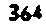
$$

,

где

$$
$$

$$
$$

$$
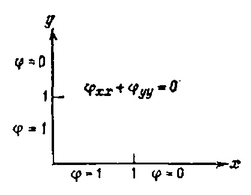
$$

$$
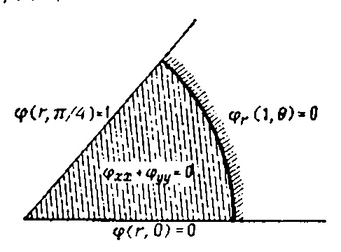
$$

$$
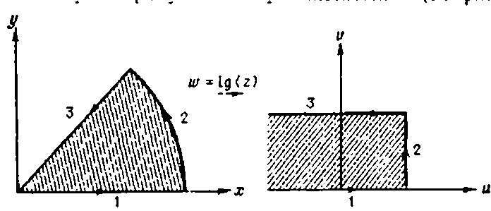
$$

$$
$$

$$
$$

9.

$$

H(x-a) =

$$

$$
\begin{cases} 0, x < a, \\ 1, x \geqslant a, \end{cases}
$$

\begin{cases} u(0, t) = f(t) \\ u(L, t) = g(t) \end{cases}

$$

В результате получаем

$$

$$

H(x-a) =

$$

f(x) * g(x)

$$
\begin{cases} 0, & x < a, \\ 1, & x \geqslant a, \end{cases}
$$

$$
$$

$$f(x) = \mathcal{F}^{-1}[F] = \frac{1}{\sqrt{2\pi}} \int_{-\infty}^{+\infty} F(\omega) e^{-i\omega x} d\omega \qquad F(\omega) = \mathcal{F}[f] = \frac{1}{\sqrt{2\pi}} \int_{-\infty}^{+\infty} f(x) e^{-i\omega x} dx$$

2. Решите в общем виде задачу

$$
$$

$$
\begin{cases} 1, |x| < a \\ 0, |x| > a \end{cases}
$$

$$

# ЗАМЕЧ АНИЯ

1. Для решения задачи методом конечного синус- или косинуспреобразования краевые условия при x=0 и x=L должны иметь вид

$$

$$

\begin{cases} 1, |x| < 1 \\ 0, |x| > 1 \end{cases}

$$

$$
$$

# ПРИНЦИП СУПЕРПОЗИЦІЇ Є ОСНОВОЮ ТЕОРІЇ ЛІНІЙНИХ СИСТЕМ

МЕТА ЛЕКЦІЇ: Ознайомити читача з принципом суперпозиції та показати, як його можна використати для розкладання початкової задачі на підзадачі, потім розв'язання всіх підзадач одночасно і, підсумувавши отримані результати, знаходження рішення початкової задачі. Ми також хочемо показати, що два основні методи розв'язання лінійних рівнянь — метод розділення змінних і метод інтегрального перетворення — використовують принцип суперпозиції.

Припустимо, що інженеру потрібно знайти відгук лінійної системи на вхідний ефект f. Загальний підхід до розв'язання задачі такий:

- 1) розкласти f на елементарні ефекти $ f = \sum f_k $ ;
- 2) знайти реакцію системи $ u_k $ на вплив $ f_k $ ;

3) сложить отклики $ u = \sum_{i=1}^{n} u_{i} $ .

Якщо система лінійна, то отримана сума є реакцією системи на вхідний ефект f. Це принцип суперпоезії (див. стор. 26.1).

$$
$$

РИС. 26.1. Основна ідея принципу суперпоенції; L — диференціальний оператор; f — вхід; У—виходь.

Ця базова ідея може використовуватися для розв'язання складних змішаних задач, розбиваючи їх на прості підзавдання, які розв'язуються за допомогою

кожне з них, а потім підсумовування отриманих результатів (звісно, диференціальне рівняння і граничні умови мають бути лінійними).

# Розкладання змішаної задачі на дві простіші

Предположим, нам необходимо решить линейную задачу (обозначим ее P)

(УЧП)

$$
$$

(Р) (ГУ)

$$ f(x) * g(x)$$

$$(1+x^2)^{-1}$$

\begin{cases} u(0, t) = 0, \\ u(1, t) = 0, \\ u(x, 0) = \sin(2\pi x), \quad 0 \le x \le 1. \end{cases}

$$
$$

$$
$$

$$ \frac{a}{x^2+a^2}$$

$$\frac{2ax}{(x^2+a^2)^2}$$

$$
$$

$$

$$

$$

18.

$$

\begin{cases} u(0, t) = 0, \\ u(1, t) = 0, \\ u(1, t) = 0, \end{cases}

$$

\begin{cases} 1-|x|, |x| < 1 \\ 0, |x| > 1 \end{cases}

$$

$$
$$

$$
$$

$$
$$

$$ \frac{2}{\pi} \frac{\sin a\omega}{\omega}$$

$$\frac{2}{\pi} \frac{\sin a\omega}{(\omega^2+a^2)^2}$$

$$
$$

$$
$$

$$
$$

$$
$$

$$ \frac{\pi}{2} e^{-a+\omega}$$

\begin{cases} u_t = u_{xx} + f(x, t), \\ u(0, t) = 0, \\ u(1, t) = 0, \\ u(x, 0) = \varphi(x) \end{cases}

$$ \frac{\pi}{2} e^{-a+\omega}$$

$$\frac{2ax}{(x^2+a^2)^2}$$

\cos(ax)

$$\frac{\cos(ax), |x| > \pi/2a}{0, |x| > \pi/2a}$$

$$
$$

\begin{cases} u_t = u_{xx} + f(x, t), \\ u(0, t) = 0, \\ u(1, t) = 0, \\ u(x, 0) = 0 \end{cases}

$$
$$

$$
$$

$$

\cos(ax)

$$

$$

\frac{\pi}{2} [\delta(\omega+a) + \delta(\omega-a)]

$$

$$
$$

\begin{cases} u_t = u_{xx}, \\ u(0, t) = 0, \\ u(1, t) = 0, \\ u(x, 0) = \varphi(x). \end{cases}

$$
$$

$$
$$

f''(0)

$$ F(\omega) = \frac{?}{\pi} \int_{0}^{\infty} f(x) \sin(\omega x) dx$$

$$
$$

$$
$$

$$
$$

$$
$$

$$ f''(0)$$

$$ \frac{1}{\alpha} F\left(\frac{\omega}{\alpha}\right)$$

$$\frac{2\omega}{\pi (\alpha^2 + \omega^2)}$$

$$ [2/\pi\omega]^{1/2}$$

$$\frac{2}{\pi\omega} [1-\cos(\omega a)]$$

$$ e^{-1}a + \omega$$

$$\frac{1}{2}e^{-\alpha}\sin\omega$$

$$
$$

$$
$$

\begin{split} A_n(t) &= 2\int_0^1 u_t \sin(n\pi x) \, dx = \frac{d}{dt} \bigg[ 2\int_0^1 u(x, t) \sin(n\pi x) \, dx \bigg] = \frac{dU_n(t)}{dt} \,, \\ B_n(t) &= 2\int_0^1 u_{xx} \sin(n\pi x) \, dx = -(n\pi)^2 \, U_n(t) \,+ \\ &\quad + 2n\pi \, \big[ u(0, t) + (-1)^{n+1} \, u(1, t) \big], \end{split}

$$
$$

$$
$$

$$ f(x) = \int_{0}^{\infty} F(\omega) \cos(\omega x) d\omega \qquad \qquad F(x) = \frac{2}{\pi} \int_{0}^{\infty} f(x) \cos(\omega x) dx$$

$$
$$

$$
$$

\begin{cases} u(0, t) = 0, \\ u(1, t) = 0 \end{cases}

$$
$$

$$
$$

$$ S_n = \frac{2}{\pi} \int_0^{\pi} f(x) \sin(nx) dx.$$

$$y = \frac{\pi}{b - a} (x - a).$$

$$f(x) = \sum_{n=1}^{\infty} S_n \sin(nx).$$

$$f(x) = \sum_{n=1}^{\infty} S_n \sin(nx)$$

$$S_n = \frac{2}{\pi} \int_{0}^{\pi} f(x) \sin(nx) dx$$

$$0 \le x \le \pi$$

$$n = 1, 2, ...$$

$$f''(x)$$

$$\frac{\pi}{2} e^{ax}$$

$$C_n = \frac{2}{\pi} \int_0^{\pi} f(x) \cos(nx) dx.$$

0 \le x \le \pi

$$y = \frac{\pi}{b-a}(x-a).$$

$$ f(x) = \frac{C_0}{2} + \sum_{n=1}^{\infty} C_n \cos(nx) \qquad C_n = \frac{2}{\pi} \int_{0}^{\pi} f(x) \cos nx \, dx$$

$$
$$

f''(x)

$$
$$

$$
$$

$$

f''(x)

$$

$$

\begin{array}{ll} u\left(x, \ 0\right) = \sin{(\pi x)}, \\ u_{t}\left(x, \ 0\right) = 0, \end{array}

$$

$$

a)

$$

$$

5. $\cos(mx), m=1, 2, \dots$ $$

$$ $ \mathbf{\Pi} $ для яких рівнянь функція $ u_1 + u_2 $ також буде розв'язком? Які висновки ви можете зробити зі своїх відповідей?

4. Найдите четыре смещанные задачи, сумма решений которых дает решение следующей задачи:

$$

$$
$$

$$
$$

$$

5. Решите задачу Коши

(OAY)

$$

\begin{array}{ll} (\mathrm{Y} + \Pi) & u_{tt} = u_{xx} + \sin{(3\pi x)}, & 0 < x < 1, & 0 < t < \infty, \\ (\mathrm{\Gamma} \mathrm{Y}) & \left\{ \begin{array}{ll} u\left(0, \ t\right) = 0, \\ u\left(1, \ t\right) = 0, \\ \end{array}

$$

(HY) $ U_n(0) = 0. $ Можете ли вы проверить полученное решение?

6. Предположим, что функции $ u_1 $ и $ u_2 $ удовлетворяют линейным однородным граничным условиям

$$

$$
\begin{cases}  u_x(1, t) + h_2 u(1, t) = 0.  Будет ли функция   u_i + u_i   удовлетворять этим условиям? , .

Лекция 27

# УРАВНЕНИЯ ПЕРВОГО ПОРЯДКА (МЕТОД ХАРАКТЕРИСТИК)

ЦЕЛЬ ЛЕКЦИИ: Ввести понятие уравнения с частными производными первого порядка (до сих пор мы рассматривали уравнения второго порядка) и познакомиться с важным методом решения задач с начальными условиями—методом характеристик. Задача, которой мы теперь займемся, имеет вид

(УЧП)

$$

$$

$$

$$

Сразу же отметим, что впервые мы будем решать задачу с переменными коэффициентами. Оказывается, если от координат (x, t) перейти к новым, характеристическим координатам   (s, \tau)  , то наше УЧП превратится в обыкновенное дифференциальное уравнение. Затем можно решить обыкновенное дифференциальное уравнение, т. е. найти   u(s, \tau)  , а на последнем шаге выразить s и t через x и t и получить u(x, t).

Напомним читателю, что, когда мы решали уравнение дифф

$$

Для каждой из подзадач выберите метод решения по своему BKYCY,

3. Нехай $ u_1 $ і $ u_2 $ є розв'язками наступних рівнянь:

$$

константа   \alpha^2   играла роль коэффициента диффузии, а v—была скоростью среды. Очевидно, что если   \alpha=0   (т. е. диффузии нет), то решение будет смещаться как целое вдоль оси x со скоростью v (у нас осталась только конвекция). Другими словами, если начальное условие   u(x,0)=\varphi(x)  , то соответствующее решение уравнения

$$

;  
b) $ u_t = u_{xx} + e^t $ ;

B)

$$

будет иметь вид   u(x, t) = \varphi(x-vt)  .

Это дает нам основания думать, что решение уравнения первого порядка

$$

;  
F) $ u_t = u_{xx} + u^2 $ .

$$

переносится вдоль потока со скоростью

$$

$$

Конечно, если a и b—константы, то решение представляет собой бегущую с постоянной скоростью волну. Если же a(x, t) и b(x, t)

$$

\begin{aligned} u_t &= u_{xx} + f(x, t), & 0 < x < 1, & 0 < t < \infty, \\ & \begin{cases} u(0, t) = g_1(t), \\ u(1, t) = g_2(t), \end{cases} & 0 < t < \infty, \\ & u(x, 0) = \varphi(x), & 0 \le x \le 1. \end{aligned}

$$

РИС. 27.1. Начальное значение в точке x оказывает влияние на решение только вдоль характеристики в плоскости переменных (x,t). Параметр s изменяется вдоль характеристик от нуля до бесконечности, начиная с линии начального условия;   \tau   постоянна вдоль каждой характеристики;   \tau   изменяется вдоль линии начального условия.

зависят от x и t, то скорость потока изменяется как вдоль потока, так и во времени (читатель сможет увидеть, что начальная кривая сильно искажается). Здесь так много аналогий с конвекцией!

Вернемся к нашей основной задаче:

(УЧП)

$$

$$

(НУ)   u(x, 0) = \varphi(x), -\infty < x < \infty.  

Решение этого линейного уравнения первого порядка основывается на следующем физическом факте: начальное условие в некоторой точке x переносится в tx-плоскости вдоль линии, которая

называется характеристи-кой (см. рис. 27.1)

Этим наше уразнение отличается от других уравнений (таких, как уравнение теплопроводности   u_t = u_{xx}  ), для которых начальное значение в точке x оказывает влияние на решение во всех точках пространства и во все моменты времени. Если читатель помнит, то начальное сме- Р И С

$$

x

$$

. 27.2. Начальное возмущение   u\left(x,0\right)   в точке порождает две волны. Начальное возмущение струны согласно волновому уравнению распространяется вдоль двух характеристик.

щение скрипичной струны в точке x оказывает влияние на решение вдоль   \partial syx   линий в tx-плоскости (соответствующих двум бегущим волнам) (см. рис. 27.2).

Естественно, напрашивается идея ввести две новые координаты s и   \tau   (вместо x и t) так, чтобы

- s изменялась вдоль характеристических кривых,
- т изменялась вдоль начальной кривой (желательно вдоль линии t=0).

Рассмотрим сначала новую координату s. Если s выбрать так, что она удовлетворяет приведенному выше условию, то уравнение

$$

$$

превратится в обыкновенное дифференциальное уравнение К о н

$$

| _                                |,   -\infty < x < \infty  ,   0 < t < \infty  ,

$$

ечно, остается открытым вопрос, как найти эти характеристики. Ответ прост: мы выберем характеристики   \{[x(s), t(s)]: 0 < s < \infty\}   так, чтобы они удовлетворяли системе

$$

(HV)   u(x, 0) = \varphi(x), \quad -\infty < x < \infty.

$$

$$

\Delta u = u_{xx} + u_{yy},   -\infty < x < \infty  ,   0 < t < \infty

$$

$$

\Delta u = u_{rr} + \frac{1}{r}u_r + \frac{1}{r^2}u_{\theta\theta}

$$
$$

\Delta u = u_{xx} + u_{yy} + u_{zz}

$$
$$

\Delta u = u_{rr} + \frac{1}{r}u_r + \frac{1}{r^2}u_{\theta\theta} + u_{zz}.

$$ -\infty < y < +\infty$$

 M

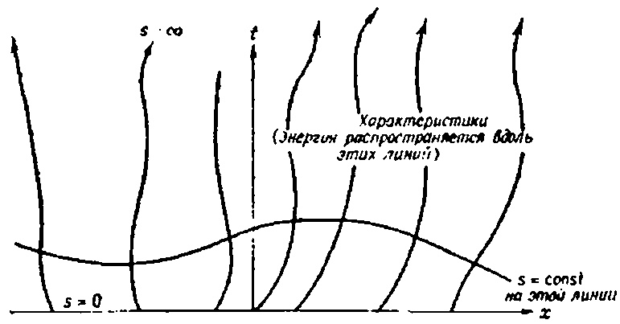

ATHBLK1343X

\Delta u = u_{rr} + \frac{2}{r}u_r + \frac{1}{r^2}u_{\theta\theta} + \frac{\cot\theta}{r^2}

$$
$$

 M

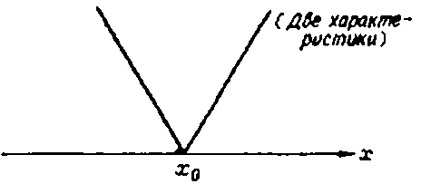

ATHBLK1345X

\Delta u = u_{rr} + \frac{2}{r}u_r + \frac{1}{r^2}u_{\theta\theta} + \frac{\cot\theta}{r^2}u_0 + \frac{1}{r^2\sin\theta}u_{\phi\phi}

$$
$$

 M

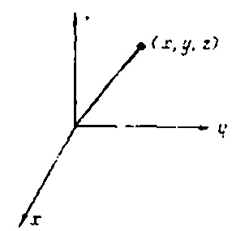

ATHBLK1347X M

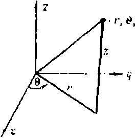

ATHBLK1348X M

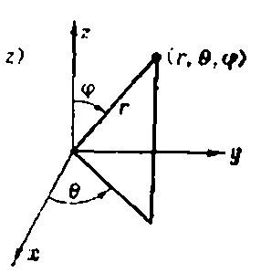

ATHBLK1349X

\begin{cases} \frac{dx}{ds} = a(x, t), \\ \frac{dt}{ds} = b(x, t). \end{cases}

$$

x(s) = s + c_1, \quad t(s) = s + c_2.

$$

$$

$$

$$

$$

$$

$$

$$
$$

$$
$$

$$

\frac{du}{ds} + 2u = 0, \quad 0 < s < \infty,

$$

\begin{array}{lll} (\forall \Pi \Pi) & u_x + u_t + 2u = 0, & -\infty < x < \infty, & 0 < t < \infty \\ (\forall \Psi) & u(x, 0) = \sin x, & -\infty < x < \infty. \end{array}

$$

$$

-\infty & < x < +\infty & r \geqslant 0, \ 0 \leqslant \theta \leqslant 2\pi, \\

$$

$$

\frac{dx}{ds} = 1, \quad \frac{dt}{ds} = 1, \quad 0 < s < \infty.

$$

$$

-\infty & < y < +\infty & -\alpha \leqslant z \leqslant \alpha, \\

$$

$$

x(s) = s + c_1, \quad t(s) = s + c_2.

$$

$$

x(0) = \tau,

$$

s=t

$$

-\infty & < z < +\infty & x = r \cos \theta, \\

$$

u(x, t) = \sin(x-t)e^{-xt}

$$

x = s + \tau

$$

(\forall \Pi) \quad a(x, t) u_x + b(x, t) u_t + c(x, t) u = 0, \quad -\infty < x < \infty, \\ 0 < t < \infty,

$$

x-t=\tau

$$

u(x, 0) = f(x), \quad -\infty < x < \infty.

$$

y = r \sin \theta, \\

$$

\frac{dx}{ds} = a(x, t), \qquad \frac{dt}{ds} = b(x, t).

$$

\frac{du}{ds} + 2u = 0, \quad 0 < s < \infty,

$$

x = x (s, \tau),

$$

u(0) = \sin \tau.

$$

$$

z = z.

$$ (\text{УЧП})

$$

u\left(s,\,\tau\right)=\sin\tau e^{-2s}

$$

\frac{dx}{ds} = x

$$

\end{array}

$$

$$

x = s + \tau

$$

x = \tau e^s,

$$

s=t

$$

t = s.

$$

u(x, t) = \sin(x-t)e^{-xt}

$$

\frac{du}{ds} + su = 0, \quad 0 < s < \infty,

$$

\Delta u = 0

$$

u(0) = F(\tau).

$$

(\forall \Pi) \quad a(x, t) u_x + b(x, t) u_t + c(x, t) u = 0, \quad -\infty < x < \infty, \\ 0 < t < \infty,

$$

u(s, \tau) = F(\tau) e^{-s} \ell^2

$$

\Delta u + \lambda^2 u = 0

$$

s=t

$$

u(x, 0) = f(x), \quad -\infty < x < \infty.

$$

u(x, t) = F(xe^{-t}) e^{-t^2/2}

$$

\Delta u = k

$$

Уравнение одномерной диффузии Уравнение конвективной диффузии

Уравнение теплопроводности с поглощением Уравнение теплопроводности с источником

# Діагональна матриця

Нехай A — квадратна матриця порядку n і нехай всі її власні значення $ \lambda_1 $ , $ \lambda_2 $ ... $ \lambda_n $ різні. Побудуємо матрицю P так, щоб у неї були *стовпці* координати власних векторів (k-й стовпець містить власний вектор $ X_k $ , що відповідає власному значенню $ \lambda_k $ ), тобто

$$X_1 =
$$

$$

$$

\begin{bmatrix} X_1 & X_{\tilde{2}} & \dots & X_n \\ X_{1} & X_{2} & \dots & X_n \end{bmatrix}

$$
\begin{bmatrix} 2 \\ 1 \end{bmatrix}
$$

$$

$$

$$
$$

\begin{bmatrix} x_{11} & x_{1\tilde{2}} & \dots & x_{1n} \\ x_{21} & x_{22} & \dots & x_{2n} \\ \vdots & \vdots & \ddots & \vdots \\ x_{n1} & x_{n\tilde{3}} & \dots & x_{nn} \end{bmatrix}

$$U(x) = \int_{0}^{\infty} u(x, t) e^{-st} dt$$

$$P^{-1}AP =
$$

Тогда матрица Л, определяемая соотношением

$$

$$

где $ P^{-1} $ — обратная к матрице P, будет диагональной матрицей вида

$$
\begin{bmatrix} 2 & -2 \\ 1 & 1 \end{bmatrix}
$$

$$

$$

\begin{bmatrix} \lambda_1 & & & \\ & \lambda_2 & 0 & \\ & & \ddots & \\ & & & \lambda_n \end{bmatrix}

$$
^{-1}
$$

$$

$$

Например, у матрицы

$$
\begin{bmatrix} 0 & 8 \\ 2 & 0 \end{bmatrix}
$$

$$

$$

$$
\begin{bmatrix} 2 & -2 \\ 1 & 1 \end{bmatrix}
$$

$$

$$

$$
= \\ =
$$

in $ X_2 =

$$ Функція Хевісайду, $H(a-x) = \begin{cases} 1, & x \leqslant a, \\ 0, & x > a, \end{cases}$ дзеркальною функцією Хевісайду.

ТАБЛИЦЯ A. Експоненціальне перетворення Фур'є

$$ $ .

Значит, произведение

$$

$$

$$
\begin{bmatrix} 1/4 & 1/2 \\ -1/4 & 1/2 \end{bmatrix}
$$

$$

$$

$$
\begin{bmatrix} 0 & 8 \\ 2 & 0 \end{bmatrix}
$$

$$

$$

$$
\begin{bmatrix} 2 & -2 \\ 1 & 1 \end{bmatrix}
$$

$$

$$

$$
$$

$$\Lambda =
$$

равно диагональной матрице

$$

$$

$$
\begin{bmatrix} 4 & 0 \\ 0 & -4 \end{bmatrix}
$$

$$

$$

(Читатель может проверить это самостоятельно.)

Тепер можна розв'язати просту систему з двох диференціальних рівнянь у похідних у похідних (з відповідними початковими умовами).

# Лінійне $ u_t + Au_x = 0 $ системне рішення.

Розглянемо задачу Коші для системи, що містить два рівняння та дві початкові умови:

(УЧП 1)

$$
.$$

,  
(29.3) (УЧП 2) $ \frac{\partial u_2}{\partial t} + 2 \frac{\partial u_1}{\partial x} = 0 $ , $ -\infty < x < \infty $ , $ 0 < t < \infty $ ,  
(HУ 1) $ u_1(x, 0) = f(x) $ ,  
(HУ 2) $ u_2(x, 0) = g(x) $ , $ -\infty < x < \infty $ .

Ця задача може відповідати визначенню $ u_1(x, t) $ тиску та густини $ u_2(x, t) $ як функції просторової координати x і часу t за відомими розподілами цих величин у початковий момент.

Запишем систему уравнений в матричной форме

$$\frac{\partial u_1}{\partial t} + 8 \frac{\partial u_2}{\partial x} = 0$$

+

$$
$$

$$

$$

\begin{bmatrix} \frac{\partial u_1}{\partial x} \\ \frac{\partial u_2}{\partial x} \end{bmatrix}

$$

\begin{bmatrix} \frac{\partial u_1}{\partial t} \\ \frac{\partial u_2}{\partial t} \end{bmatrix}

$$

$$

 + 

$$

$$
\begin{bmatrix} 0 & 8 \\ 2 & 0 \end{bmatrix}
$$

$$

$$

$$

\begin{bmatrix} \frac{\partial u_1}{\partial x} \\ \frac{\partial u_2}{\partial x} \end{bmatrix}

$$

$$

$$

$$
=
$$

$$

$$

 \begin{bmatrix} 0 & 8 \\ 2 & 0 \end{bmatrix}

$$
\begin{bmatrix} 0 \\ 0 \end{bmatrix}
$$

$$

$$

 \begin{bmatrix} \frac{\partial u_1}{\partial t} \\ \frac{\partial u_2}{\partial t} \end{bmatrix}

$$
$$

$$u_t + Au_s = 0$$

 \begin{bmatrix} \frac{\partial u_1}{\partial x} \\ \frac{\partial u_2}{\partial x} \end{bmatrix}

$$A =
$$

$$

$$

.

$$
\begin{bmatrix} 0 & 8 \\ 2 & 0 \end{bmatrix}
$$

$$

$$

$$
, \quad u_1 =
$$

с помощью преобразования

$$

$$

.

де P — матриця, стовпці якої містять власні вектори матриці A (матриця P, яку вже знають). Виявляється, що після такого перетворення буде отримана дуже проста система для визначення v (два рівняння відносно нового невідомого $ v_1 $ і $ v_2 $ виявляються незалежними). Це означає, що $ v_1 $ і $ v_2 $ легко знайти. Після $ v_1 $ і $ v_2 $ знайдено, згідно з формулою

$$

\begin{bmatrix} \frac{\partial u_1}{\partial t} \\ \frac{\partial u_2}{\partial t} \end{bmatrix}

$$

находятся искомые функции и, и и2.

Спершу ж давайте розглянемо, як виглядає система визначення v. Диференціюючи дві частини співвідношення u = Pv, отримуємо

(29 5)

$$

$$

$$
, \quad u_x =
$$

$$

$$

$$

\begin{bmatrix} \frac{\partial u_1}{\partial x} \\ \frac{\partial u_2}{\partial x} \end{bmatrix}

$$

$$

$$

$$
, \quad 0 =
$$

$$

$$

$$
\begin{bmatrix} 0 \\ 0 \end{bmatrix}
$$

$$

$$

$$
.$$

$$v =
$$

$$

$$

$$

\begin{bmatrix} v_1 \\ v_2 \end{bmatrix}

$$

.

$$

$$

$$
$$

$$u = Pv$$

$$u = Pv$$

$$\frac{\partial u}{\partial t} = P \frac{\partial v}{\partial t},$$

$$\frac{\partial u}{\partial x} = P \frac{\partial v}{\partial x}.$$

$$u_t + Au_x = 0$$

$$Pv_t + APv_x = 0.$$

\begin{bmatrix} v_1 \\ v_2 \end{bmatrix}

$$v_t + P^{-1}APv_x = 0,$$

$$(29.6) v_t + \Lambda v_x = 0.$$

$$\Lambda =
$$

$$

$$

$$
\begin{bmatrix} 4 & 0 \\ 0 & -4 \end{bmatrix}
$$

$$

$$

$$
.$$

$$\frac{\frac{\partial v_1}{\partial t} + 4 \frac{\partial v_1}{\partial x} = 0, \\ \frac{\partial v_2}{\partial t} - 4 \frac{\partial v_2}{\partial x} = 0.$$

.

$$v_1(x, t) = \varphi(x-4t),$$

$$u = Pv =
$$

$$

$$

$$
\begin{bmatrix} 2 & -2 \\ 1 & 1 \end{bmatrix}
$$

$$

$$

$$

\begin{bmatrix} v_1 \\ v_2 \end{bmatrix}

$$

$$

$$

$$
=$$

$$=
$$

$$

$$

$$
\begin{bmatrix} 2 & -2 \\ 1 & 1 \end{bmatrix}
$$

откуда функци і ф и ф легко находятся:

$$

$$

$$
\begin{bmatrix} \varphi(x - 4t) \\ \psi(x + 4t) \end{bmatrix}
$$

$$

$$

$$
=$$

$$=
$$

(29.9)

$$

$$

$$
\begin{bmatrix} 2\varphi(x - 4t) - 2\psi(x + 4t) \\ \varphi(x - 4t) + \psi(x + 4t) \end{bmatrix}
$$

$$

$$

$$
.$$

$$u_1(x, t) = 2\varphi(x-4t) - 2\psi(x+4t), u_2(x, t) = \varphi(x-4t) + \psi(x+4t).$$

$$\phi(\xi) = \sin \xi, \ \psi(\xi) = \xi^2$$

$$u_1(x, t) = 2 \sin(x-4t) - 2(x+4t)^2,$$

$$u_1(x, 0) = f(x),$$

$$2\varphi(x) - 2\psi(x) = f(x),$$

.

$$\varphi(x) + \psi(x) = g(x),$$

$$\varphi(x) = \frac{1}{4} \left[ f(x) + 2g(x) \right],$$

\begin{cases} \frac{\partial u_1}{\partial t} + \frac{\partial u_1}{\partial x} + \frac{\partial u_2}{\partial x} = 0, \\ \frac{\partial u_2}{\partial t} + 4 \frac{\partial u_1}{\partial x} + \frac{\partial u_2}{\partial x} = 0. \end{cases}

$$\psi(x) = \frac{1}{4} \left[ 2g(x) - f(x) \right].$$

$$u_{1}(x, t) = 2\varphi(x-4t) - 2\psi(x+4t) =$$

$$= \frac{1}{2} \left[ f(x-4t) + 2g(x-4t) \right] - \frac{1}{2} \left[ 2g(x+4t) - f(x+4t) \right],$$

$$u_{2}(x, t) = \varphi(x-4t) + \psi(x+4t) =$$

$$= \frac{1}{4} \left[ f(x-4t) + 2g(x-4t) \right] + \frac{1}{4} \left[ 2g(x+4t) - f(x+4t) \right].$$

$$u_t + A(x, t) u_x + B(x, t) u = 0$$

$$Au_t + Bu_x + Cu = 0,$$

$$A =
$$

$$

$$

$$
\begin{bmatrix} 1 & 1 \\ 4 & 1 \end{bmatrix}
$$

$$

.

$$

$$

$$

$$

\begin{cases} \frac{\partial u_1}{\partial t} + \frac{\partial u_1}{\partial x} + \frac{\partial u_2}{\partial x} = 0, \\ \frac{\partial u_2}{\partial t} + 4 \frac{\partial u_1}{\partial x} + \frac{\partial u_2}{\partial x} = 0. \end{cases}

$$

$$

$$

$$
$$

$$u_{tt} = c^2 \left( u_{rr} + \frac{1}{r} u_r + \frac{1}{r^2} u_{\theta\theta} \right)$$

$$u(r, \theta, t) = P(r) \Theta(\theta) T(t),$$

$$T'' + \lambda^2 c^2 T = 0$$

$$
$$

$$

$$

$$
\begin{array}{lll} (\text{УЧП}) & u_{tt} = c^2 \left( u_{rr} + \frac{1}{r} u_r + \frac{1}{r^2} u_{\theta\theta} \right), & 0 < r < 1, \ 0 < t < \infty, \\ (\text{ГУ}) & u = 0 & \text{при } r = 1, & 0 < t < \infty, \\ (\text{НУ}) & \begin{cases} u = f(r, \ \theta) \\ u_t = g(r, \ \theta) \end{cases} & \text{при } t = 0. \end{array}
$$

$$

$$

$$
$$

$$u(r, \theta, t) = U(r, \theta) T(t)$$

$$\Delta U + \lambda^2 U = 0$$

$$T'' + \lambda^2 c^2 T = 0$$

$$\Delta U = U_{rr} + \frac{1}{r} U_r + \frac{1}{r^2} U_{\theta\theta}.$$

\begin{array}{ll} (\mathsf{Y}\mathsf{H}\mathsf{\Pi}) & \Delta U + \lambda^2 U = 0, \\ (\mathsf{\Gamma}\mathsf{Y}) & U(1, \theta) = 0, \end{array}

$$u(1, \theta, t) = U(1, \theta) T(t) = 0, \quad 0 < t < \infty,$$

$$U(1, \theta) = 0.$$

$$\Delta U + \lambda^2 U = 0,$$

$$U(1, \theta) = 0.$$

$$
$$

$$

$$

$$
\begin{cases} \Delta U + \mu u = 0 & \text{в круге,} \\ U = 0 & \text{на границе круга} \end{cases}
$$

$$

$$

$$

$$

$$

\begin{array}{ll} (\mathsf{Y}\mathsf{H}\mathsf{\Pi}) & \Delta U + \lambda^2 U = 0, \\ (\mathsf{\Gamma}\mathsf{Y}) & U(1, \theta) = 0, \end{array}

$$

$$

$$

$$
$$

$$U(r, \theta) = R(r) \Theta(\theta)$$

$$r^2R'' + rR' + (\lambda^2r^2 - n^2)R = 0$$

$$r^2R'' + rR' + (\lambda^2r^2 - n^2) R = 0$$

$$r^2R'' + rR' + (\lambda^2r^2 - n^2)R = 0$$

$$R(r) = AJ_n(\lambda r) + BY_n(\lambda r).$$

$$R(r) = AJ_n(\lambda r).$$

$$\lambda = k_{nm}$$

$$U_{nm}(r, \theta) = J_n(k_{nm}r) [A \sin(n\theta) + B \cos(n\theta)].$$

$$f_{nm} = k_{nm}c/2\pi.$$

$$T_{nm}(t) = A \sin(k_{nm}ct) + B \cos(k_{nm}ct)$$

$$T'' + k_{nm}^2 c^2 T = 0.$$

$$sU(x) = -V \frac{dU}{dx}, \quad 0 < x < \infty,$$

$$U(0) = P/s.$$

$$H(\xi) =
$$

$$

 \begin{cases} 1, & 0 \le \theta < \pi, \\ 0, & \pi \le \theta < 2\pi. \end{cases}

$$

$$
\begin{cases} 0, & \xi < 0, \\ 1, & \xi \geqslant 0. \end{cases}
$$

$$
$$

$$\cos(3\varphi) = a_0 P_0(\cos\varphi) + a_1 P_1(\cos\varphi) + \dots$$

$$\Delta u = 0, \quad 0 < r < 1, \quad 0 \le \varphi \le \pi, \quad 0 \le \theta < 2\pi.$$

$$u(1, \varphi) =
$$

$$

$$

$$
\begin{cases} 1, & 0 \le \varphi \le \pi/2, \\ -1, & \pi/2 < \varphi \le \pi. \end{cases}
$$

$$

$$

$$
$$

$$\Delta u = 0$$

$$u_{rr} + \frac{1}{r} u_r + \frac{1}{r^2} u_{\theta\theta} = f(r, \theta), \quad 0 \le r < 1, \quad 0 \le \theta < 2\pi,$$

$$\Delta u = -q$$

$$u(1, \theta) = 0, \quad 0 \le \theta \le 2\pi.$$

$$= -\int_{0}^{2\pi} u_{r}(r) r d\theta = -2\pi r u_{r}(r).$$

$$-2\pi r u_r(r) = q.$$

$$u(r) = \frac{-q}{2\pi} \ln r = \frac{q}{2\pi} \ln \frac{1}{r}.$$

$$u\left(r\right)=-\frac{q}{2\pi}\ln\frac{1}{r}.$$

$$(Y \cup \Pi)$$

$$u\left(r,\;\theta\right) = \int_{0}^{2\pi} \int_{0}^{1} G\left(r,\;\theta,\;\rho,\;\varphi\right) f\left(\rho,\;\varphi\right) \rho \; d\rho \; d\varphi.$$

$$\frac{1}{2\pi} \ln \left( \frac{1}{r} \right)$$

$$\frac{1}{2\pi} \ln \frac{1}{R}$$

$$u(r, \theta) = \frac{1}{2\pi} \ln 1/R - \frac{1}{2\pi} \ln 1/\overline{R}$$

$$-\frac{1}{2\pi}\ln\rho$$

$$G(r, \theta, \rho, \phi) = \frac{1}{2\pi} \ln 1/R - \frac{1}{2\pi} \ln 1/\overline{R} + \frac{1}{2\pi} \ln \rho,$$

$$R = V \frac{r^2 - 2\rho r \cos(\theta - \phi) + \rho^2}{R},$$

$$\overline{R} = V \frac{r^2 - 2\frac{r}{\rho}\cos(\theta - \phi) + 1/\rho^2}{r^2 - 2\frac{r}{\rho}\cos(\theta - \phi) + 1/\rho^2}$$

$$u(r, \theta) = \int_{0}^{2\pi} \int_{0}^{1} G(r, \theta, \rho, \varphi) f(\rho, \varphi) \rho d\rho d\varphi$$

(Y \cup \Pi)

$$u(r, \theta) = \frac{1}{2\pi} \int_{0}^{2\pi} \int_{0}^{1} \ln (\rho \overline{R}/R) f(\rho, \varphi) \rho d\rho d\varphi.$$

$$
$$

$$

$$

$$
\begin{array}{lll} (\text{УЧ\Pi}) & \Delta u = 0, & 0 < r < 1, & 0 \leqslant \theta < 2\pi, \\ (\text{ГУ}) & u(1, \theta) = g(\theta), & 0 \leqslant \theta \leqslant 2\pi, \end{array}
$$

$$

$$

$$
$$

$$u(r, \theta) = \int_{0}^{2\pi} \frac{\partial G}{\partial r} (r, \theta, 1, \varphi) g(\varphi) d\varphi.$$

$$u(r, \theta) = \frac{1}{2\pi} \int_{0}^{2\pi} \left[ \frac{1 - r^2}{1 - 2r\cos(\theta - \varphi) + r^2} \right] g(\varphi) d\varphi.$$

$$
$$

$$

$$

$$
\begin{array}{ll} (\text{УЧП}) & \Delta u = f(r, \theta), & 0 < r < 1, & 0 \le \theta < 2\pi, \\ (\text{ГУ}) & u(1, \theta) = g(\theta), & 0 < \theta \le 2\pi, \end{array}
$$

$$

$$

$$
$$

$$\Delta u = 1$$

$$u_p = (r, \theta) = Ar^2$$

Формули, що виражають відстань між двома точками в полярних координатах. Щоб знайти розв'язок початкової проблеми, потрібно накласти всі імпульсні характеристики системи. Отже, переходимо до останнього кроку.

КРОК 3. Суперпозиція імпульсних характеристик Цей крок досить простий. З відношення

$$f(x+h) = f(x) + f'(x)h + \frac{f''(x)}{2!}h^2 + \dots$$

получаем

(36.4)

$$f(x+h) \cong f(x) + f'(x) h$$

Формула (36.4) виражає розв'язок задачі Діріхле для рівняння Пуассона всередині кола через функцію Гріна цієї задачі. Якщо щільність заряду $ f(r, \theta) $ відома, то інтеграл можна обчислити, наприклад, чисельно.

# ЗАУВАЖЕННЯ

1. Задачу

$$(37.1) f'(x) \cong \frac{f(x+h)-f(x)}{h}.$$

також можна розв'язати за допомогою методу *функції Гріна*. У цьому випадку рішення фіксується у формі

$$f'(x) \cong \frac{f(x) - f(x - h)}{h}$$

Останнє відношення можна надати більш обчислювально корисну форму, явно виставляючи вираз у $ \partial G/\partial r $ . Внаслідок цього ми отримуємо інтегральну формулу Пуассона, знайдену раніше в лекції 33.

(36.5)

$$f'(x) \simeq \frac{1}{2h} [f(x+h) - f(x-h)].$$

2. Решение общей задачи Дирихле

$$f''(x) \cong \frac{1}{h^2} [f(x+h) - 2f(x) + f(x-h)].$$

находится как сумма решений (36.4) и (36.5).

3. Метод функцій Гріна дозволяє отримати розв'язки багатьох задач у областях різних форм. Однак для кожної області і (точніше, для кожного оператора зліва від граничної умови) для кожного рівняння потрібно знайти власну функцію Гріна, і це не завжди легко зробити.

4. Щоб дійсно знайти розв'язок за формулою (36.4), у більшості випадків необхідно обчислити інтеграли на комп'ютері.

# ЗАВДАННЯ

Найти потенциал точечного источника в трехмерном пространстве.

2. Знайти функцію Гріна $ G(x, y, \xi, \eta) $ для рівняння Лапласа у верхній півплощині y > 0. Іншими словами, знайти потенціал у (x, y) у верхній півплощині, якщо заряд розташований у $ (\xi, \eta) $ , а потенціал на межі y=0 дорівнює нулю (див. рисунок).

$$u(x+h, y) = u(x, y) + u_x(x, y)h + u_{xx}(x, y)\frac{h^2}{2!} + \dots,$$

ПРИМІТКА. Якщо від'ємний заряд розмістити в точці $ \overline{Q} = (\xi, -\eta) $ , очевидно, що негативний потенціал на прямій y = 0 буде нульовим. Те саме те, що функція Усмішки залежить від потенціалу цих двох зарядів.

- 3. Використовуючи результати задачі 2, знайдемо розв'язок рівняння Пуассона $ \Delta u = -k $ у верхній півплощині з умовою нульової межі.
- 4. Як би ви побудували функцію Зеленого для першого квадранта $ x>0,\ y>0 $ ?
- 5. Інший підхід до розв'язання рівняння Пуассона такий. Припустимо, ви хочете розв'язати проблему

(УЧП)

$$u(x-h, y) = u(x, y) - u_x(x, y)h + u_{xx}(x, y)\frac{h^2}{2!} - \dots,$$

, $ 0 < r < 1 $ , $ 0 \le \theta < 2\pi $ , $ (\Gamma Y) $ $ u(1, \theta) = \sin \theta $ , $ 0 \le \theta \le 2\pi $ .

Сначала попытайтесь найти частное решение уравнения с помощью подстановки

$$
$$

.

Потім підставляємо цей вираз у рівняння Пуассона і визначаємо константу $ A_{\cdot} $ числа $ u_p $ , що знаходиться в частині розв'язку, необхідно пожартувати поза розв'язком з огляду на $ u=w+u_p $ . Яка межа розуму, яку можна задовольнити функцією w? Знайте $ w(r, \theta) $ . Як вирішити проблему $ u(r, \theta) $ ? Зачекай. Retelno proanalizite vidpovid'. Зробіть перетин пеніса шкіри.

# Частина 5. ЧИСЕЛЬНІ ТА ПРИБЛИЗНІ МЕТОДИ

Лекция 37

# ЧИСЕЛЬНІ РОЗВ'ЯЗКИ (ЕЛІПТИЧНІ ЗАДАЧІ)

МЕТА ЛЕКЦІЇ: Показати, як диференціальні рівняння в похідних похідних можна звести до систем алгебраїчних рівнянь, якщо похідні з частковими похідними замінити на наближення з скінченними різницями. Розв'язання цієї системи алгебраїчних рівнянь ітеративним методом дозволяє отримати наближене розв'язок

Надається інформація про пакет ELLPACK, розроблений для розв'язання еліптичних приладів

задач общего вида на ЭВМ.

На сьогодні ми ознайомилися з кількома методами розв'язання лінійних диференціальних рівнянь у похідних похідних. Однак більшість рівнянь, з якими ми працювали, були дуже простими. Форми регіонів, у яких розв'язувалися проблеми, також були простими. Однак багато завдань не можна спростити настільки, щоб їх зводити до певного набору шаблонних завдань. Такі задачі слід розв'язувати приблизно чисельними методами. Прогрес у сфері високопродуктивних комп'ютерів призвів до створення нових чисельних методів. Сьогодні такі нелінійні проблеми гідродинаміки, теорії пружності та теорії потенціалу вже розв'язані, про які ніхто навіть не думав десять років тому.

Під загальною назвою «чисельні методи» поєднуються кілька різних підходів до розв'язання задач. Детальний опис усіх цих підходів можна знайти у книзі [4] з рекомендованого списку джерел. У цій та наступних двох лекціях ми покажемо, як розв'язувати еліптичні, гіперболічні та параболічні рівняння методом скінченної різниці.

Спершу ознайомимося з поняттям скінченних різниць, а потім покажемо, як їх використовувати для розв'язання задачі Діріхле в квадраті.

# Апроксимації скінченних різниць

Вспомним ряд Тейлора для функции f(x):

$$

$$

Якщо ми розірвемо цю суперечку на другому терміні, отримаємо

$$

\begin{split} u_x(x,\ y) & \cong \frac{u(x+h,\ y)-u(x,\ y)}{h}, \\ u_{xx}(x,\ y) & \cong \frac{1}{h^2} \big[ u(x+h,\ y)-2u(x,\ y)+u(x-h,y) \big], \\ u_u(x,\ y) & \cong \frac{u(x,\ y+k)-u(x,\ y)}{k}, \\ u_{uy}(x,\ y) & \cong \frac{1}{h^2} \big[ u(x,\ y+k)-2u(x,\ y)+u(x,\ y-k) \big]. \end{split}

$$

.

Откуда

$$

$$

Вираз праворуч називається похідною правої різниці. Вона апроксимує першу похідну f'(x) у точці x.

В разложении Тейлора функции $ f(\mathbf{r}) $ можно заменить h на -h и получить левую разностную производную

(37.2)

$$
$$

.

Buyutan $ f(x - h) \cong f(x) - f'(x) h $ \nif $ f(x + h) \cong f( x) + f'(x) h $ ,

получаем центральную разностную производную

(37.3)

$$u_{xx} + u_{yy} = 0$$

Якщо в ряду Тейлора залишиться ще один член, то центральну різницю похідну для наближення f''(x) можна отримати точно таким самим способом

(37.4)

$$
$$

Тепер ми можемо розширити поняття наближення скінченних різниць до *часткових похідних*. Якщо виходити з розкладу Тейлора функції двох змінних

$$

$$

$$

\begin{split} u\left(x,\,y\right) &= u_{ij}\,,\\ u\left(x,\,y+k\right) &= u_{i+1,j}\,,\\ u\left(x,\,y-k\right) &= u_{i-1,j}\,,\\ u\left(x-h,\,y\right) &= u_{i,j-1}\,,\\ u\left(x+h,\,y\right) &= u_{i,j+1}\,,\\ u_{x}\left(x,\,y\right) &= \frac{1}{2h}\left(u_{i,j+1}-u_{i,j-1}\right)\,,\\ u_{y}\left(x,\,y\right) &= \frac{1}{2k}\left(u_{i+1,j}-u_{i-1,j}\right)\,,\\ u_{xx}\left(x,\,y\right) &= \frac{1}{h^{2}}\left(u_{i,j+1}-2u_{i,j}+u_{i,j-1}\right)\,,\\ u_{yy}\left(x,\,y\right) &= \frac{1}{h^{2}}\left(u_{i+1,j}-2u_{i,j}+u_{i-1,j}\right)\,. \end{split}

$$

$$

$$

$$
$$

\begin{split} u_x(x,\ y) & \cong \frac{u(x+h,\ y)-u(x,\ y)}{h}, \\ u_{xx}(x,\ y) & \cong \frac{1}{h^2} \big[ u(x+h,\ y)-2u(x,\ y)+u(x-h,y) \big], \\ u_u(x,\ y) & \cong \frac{u(x,\ y+k)-u(x,\ y)}{k}, \\ u_{uy}(x,\ y) & \cong \frac{1}{h^2} \big[ u(x,\ y+k)-2u(x,\ y)+u(x,\ y-k) \big]. \end{split}

$$u_{xx} + u_{yy} = 0$$

$$\Delta u = \frac{1}{h^2} (u_{i,j+1} - 2u_{i,j} + u_{i,j-1}) + \frac{1}{k^2} (u_{i+1,j} - 2u_{i,j} + u_{i-1,j}) = 0.$$

$$u_{i,j} = \frac{1}{4} (u_{i+1,j} + u_{i-1,j} + u_{i,j+1} + u_{i,j-1}).$$

$$-4u_{22} + 0 + \sin(\pi/3) + u_{23} + u_{32} = 0,$$

$$-4u_{23} + u_{22} + \sin(2\pi/3) + 0 + u_{33} = 0,$$

\begin{split} u\left(x,\,y\right) &= u_{ij}\,,\\ u\left(x,\,y+k\right) &= u_{i+1,j}\,,\\ u\left(x,\,y-k\right) &= u_{i-1,j}\,,\\ u\left(x-h,\,y\right) &= u_{i,j-1}\,,\\ u\left(x+h,\,y\right) &= u_{i,j+1}\,,\\ u_{x}\left(x,\,y\right) &= \frac{1}{2h}\left(u_{i,j+1}-u_{i,j-1}\right)\,,\\ u_{y}\left(x,\,y\right) &= \frac{1}{2k}\left(u_{i+1,j}-u_{i-1,j}\right)\,,\\ u_{xx}\left(x,\,y\right) &= \frac{1}{h^{2}}\left(u_{i,j+1}-2u_{i,j}+u_{i,j-1}\right)\,,\\ u_{yy}\left(x,\,y\right) &= \frac{1}{h^{2}}\left(u_{i+1,j}-2u_{i,j}+u_{i-1,j}\right)\,. \end{split}

$$-4u_{32} + 0 + u_{22} + u_{33} + 0 = 0,$$

$$-4u_{33} + u_{32} + u_{23} + 0 + 0 = 0.$$

$$
$$

$$

$$

$$
\begin{bmatrix} -4 & 1 & 1 \\ 1 & -4 & 0 & 1 \\ 1 & 0 & -4 & 1 \\ 0 & 1 & 1 & -4 \end{bmatrix}
$$

$$

$$

$$

\begin{bmatrix} u_{22} \\ u_{23} \\ u_{32} \\ u_{33} \end{bmatrix}

$$

$$

$$

$$
=
$$

$$

$$

$$
\begin{bmatrix} -\sin{(\pi/3)} \\ -\sin{(2\pi/3)} \\ 0 \\ 0 \end{bmatrix}
$$

$$

$$

Це потрібно вирішувати у зв'язку з $ u_{22} $ , $ u_{21} $ , $ u_{32} $ та $ u_{33} $ . Розв'язок такої системи можна знайти за допомогою *ітеративного методу*. Метод Лібмана також є одним із ітеративних методів.

- 2. Якщо зменшити кроки сітки на h і k (кількість вузлів сітки збільшиться), то отримаємо систему рівнянь типу (37,7), але більших розмірів.
- 3. Систему рівнянь (37.7) можна переписати у матричній формі

$$
=
$$

$$

$$

\begin{bmatrix} u_{22} \\ u_{23} \\ u_{32} \\ u_{33} \end{bmatrix}

$$
\begin{bmatrix} -0.86 \\ -0.86 \\ 0 \\ 0 \end{bmatrix}
$$

$$

.

$$

$$

u_{xx} + u_{yy} = f(x, y)

$$

$$

xu_{xx} + u_{yy} + 2u = \sin(x - y)

$$

$$

\sin xu_{xx} + u_{xy} + 3u = 0

$$

$$
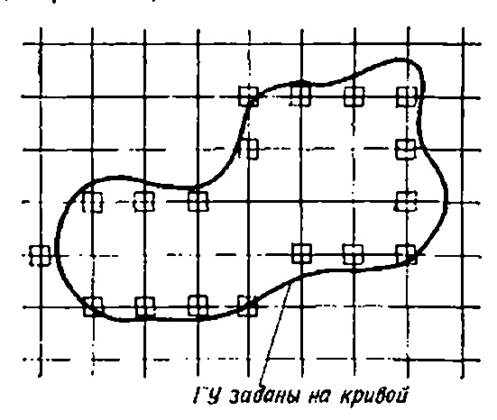
$$

Зі збільшенням кількості рівнянь (наприклад, до 1000) матриця коефіцієнтів стає розрідженою, тобто містить багато нулів. Системи з розрідженими матрицями розв'язуються спеціальними методами. Зазвичай використовуються ітеративні методи, такі як метод Якобі, метод Гаусса-Зайделя або послідовний метод верхньої релаксації.

4. При розв'язанні задачі Неймана ті *похідні*, що входять до граничної умови, також слід замінити різницею апроксимаціями.

5. Таким чином ви зможете вирішувати проблеми

a)

$$

(УЧ\Pi)

$$

6)

$$

u_{xx} + u_{yy} + 2u = 0

$$

B)

$$

u_{xx} + u_{yy} = 0

$$

(гетерогенні рівняння з змінними коефіцієнтами), (рівняння зі змінними коефіцієнтами).

6. Якщо область, в якій розв'язується задача, має неправильну форму, її можна покрити сіткою і наближити розв'язок у точках, найближчих до межі, інтерполюючи граничні умови. Після цього задачу вирішують звичайним способом (див. рисунок 37.2).

$$

$$

□ новые ГУ находятся интерполяцией ГУ на кривой

РИС. 37 2.

- 7. Деякі журнали публікують тексти програм для розв'язання диференціальних рівнянь у похідних на комп'ютерах. Нижче наведено короткий список цих журналів:
  - a) Транзакції ACM на математичному програмному забезпеченні,
  - 6) Комп'ютерний журнал,
  - B) Numerische Mathematik,
  - r) БІТ

Крім того, нещодавно було розроблено пакет застосунків ELLPACK для розв'язання досить широкого класу задач на лінії прикордонних ліній. Цей пакет дозволить вам розв'язувати різноманітні дво- та тривимірні задачі у

різні координатні системи для довільних меж і спільних граничних умов. Користувачу пропонується широкий спектр різних методів розв'язання 1).

# ЗАВДАННЯ

- 1 Отримати наближення (39,4) для другої похідної f''(x) $ f''(x) = \{f(x+h) 2f(x) + f(x-h)\}/h^2 $ .
- 2. Виконайте дві ітерації задачі Діріхле (37.5) за ітеративним методом Лібмана.
- 3. До якої алгебранічної системи буде зведена задача Діріхле для рівнянь Пуассона в квадраті

$$
\begin{cases} u = 0 & \text{квадрата,} \\ \frac{\partial u}{\partial x}(1, y) = 1, & 0 \leqslant y \leqslant 1, \end{cases}
$$

 $ u_{xx} + u_{yy} = f(x,y), \quad 0 < x < 1, \quad 0 < y < 1, $ $ (\Gamma Y) $ $ u(x,y) = g(x,y) $ на границе, если ее решать ме-

Скінченні відмінності? 4. Розв'язати задачу 3, якщо

(УЧП)

$$

$$

, $ 0 < x < 1 $ , $ 0 < y < 1 $ , (ГУ) $ u(x, y) = g(x, y) $ на границе.

5. Как бы вы решали задачу Неймана внутри квадрата

(УЧП)

$$

(\text{УЧП})

$$

, $ 0 < x < 1 $ , $ 0 < y < 1 $ , на верхней, нижней и левой стороне квадрата,

$$

u_t = u_{xx}

$$

методом конечных разностей?

6. Постройте блок-схему алеоритма решения задачи Дирихле в квадрате

$$
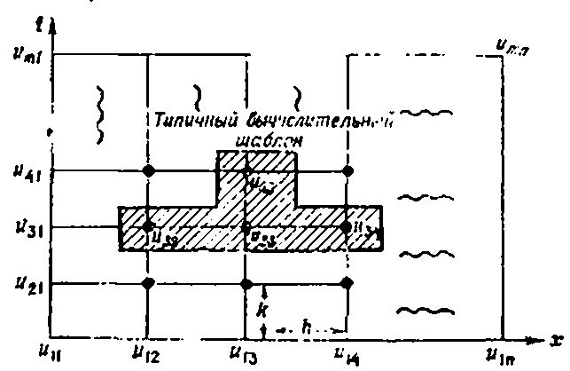
$$

 $ u_{xx} + u_{yy} = f(x, y), \quad 0 < x < 1, \quad 0 < y < 1, $ $ (\text{ГУ}) $ $ u(x, y) = g(x, y) $ на границе,

- з довільною кількістю вузлів сітки. Якщо ви знаєте мову програмування, напишіть програму для виконання цих обчислень.
- 1) Російською мовою публікуються статті з чисельних методів розв'язання диференціальних рівнянь у численних журналах і збірках. Наприклад: «Журнал обчислювальної математики та математичної фізики», видавництво «Наука», «Журнал інженерної фізики», видавництво Академії наук БРСР, збірки серії «Обчислювальні методи і програмування», Видавництво Московського державного університету. Багато публікацій, переважно статей, присвячені наборам прикладних проблем. Як приклад, можна вказати: Горбунов-Посадов М. М., Карпов В. Я, Корягін та ін. Пакет SAFRA. Програмне забезпечення для обчислювальних експериментів. У: Пакети прикладних програм. Обчислювальний експеримент. Москва, Наука, 1983. Примітка. Переклад.

# ЯВНІ СХЕМИ РІЗНИЦІ

МЕТА ЛЕКЦІЇ: Ввести концепцію явної різницької схеми та показати, як її можна використовувати для розв'язання гіперболічних і параболічних задач. Основна ідея полягає в тому, що після заміни рівняння типу

$$

u_t = u_{xx}, \quad 0 < x < 1, \quad 0 < t < \infty,

$$

Її апроксимація скінченної різниці дає формули, які явно виражають значення розв'язку за один момент часу через значення розв'язку в попередній момент часу. Таким чином, змішану задачу для параболічного або гіперболічного рівняння можна розв'язати, послідовно обчислюючи розв'язки для всіх наступних точок часу.

Явна схема не позбавлена недоліків. Якщо необхідно підвищити точність наближення похідних, то при зміні сегмента збільшується не лише обсяг обчислень, а й похибки округлення.

Попередня лекція була присвячена розв'язанню еліптичних задач на межі лінії (стаціонарних задач). У таких задачах необхідно знайти розв'язок диференціального рівняння в похідних у заданій області простору, якщо розв'язок або його похідна задано на межі області визначення Приблизне розв'язання еліптичних задач зводиться до розв'язку системи алгебраїчних рівнянь для значень функції у внутрішніх вузлах сітки. Іншими словами, значення розв'язку у всіх внутрішніх вузлах визначаються одночасно.

У цій лекції ми розглянемо диференціальні методи розв'язання задач, залежних від часу. Основна ідея полягає в тому, що якщо розв'язок відомий у початковий момент часу, то можливо знайти розв'язок за допомогою схеми підрахунку $ t=\Delta t,\ 2\Delta t,\ 3\Delta t,\ldots $ Замінивши часткові похідні часу та просторову змінну на скінченнорізні похідні, можна отримати явні вирази для $ u_{tj} $ через значення функції u у попередні моменти часу. Такий процес називається явною схемою підрахунку з тикуванням.

Щоб показати цей метод у дії, розглянемо типову задачу теплопровідності.

# Явная схема для уравнения теплопроводности

Розглянемо проблему теплопровідності у стрижні, початкова температура якого дорівнює нулю. Нехай температура лівого кінця фіксована, а на правому кінці відбувається теплообмін із навколишнім середовищем, щоб тепловий фланець був пропорційний P И

$$

$$

С. 38.1. Сетка для уравнения теплопроводности.

різниця температур між кінцем стрижня і середовищем. Нехай температура середовища задається функцією $ g\left(t\right) $ . Іншими словами, ми розв'язуємо проблему

задачу (УЧП)

$$

\begin{cases} u(0, t) = 1, \\ u_x(1, t) = -[u(1, t) - g(t)], \\ u(x, 0) = 0, \quad 0 \le x \le 1. \end{cases}

$$

(38.1) (ГУ)

$$

$$

Щоб розв'язати цю задачу, ми побудуємо прямокутну сітку методом скінченної різниці, вершини якої визначаються формулами (див. рис. 38.1)

$$
$$

, $ j = 0, 1, 2, ..., n $ , $ y_i = ik $ , $ i = 0, 1, 2, ..., m $ .

Зверніть увагу, що значення $ u_{ij} $ зліва і внизу сітки на рис. 38.1 відомі з граничних і початкових умов, і наша вадача полягає у знаходженні решти значень $ u_{ij} $ . Щоб розв'язати цю задачу, ми замінимо часткові похідні рівняння теплопровідності на їхні наближення з скінченними різницями

$$x_j = jh$$

$$u_{t} = \frac{1}{k} [u(x, t+k) - u(x, t)] = \frac{1}{k} [u_{t+1,j} - u_{t,j}],$$

$$u_{xx} = \frac{1}{h^{2}} [u(x+h, t) - 2u(x, t) + u(x-h, t)] = \frac{1}{h^{2}} [u_{t,j+1} - 2_{t,j} + u_{t,j-1}].$$

$$u_{t+1,j} = u_{t,j} + \frac{k}{h^2} \left[ u_{t,j+1} - 2u_{t,j} + u_{t,j-1} \right].$$

$$a_x(1, t) = -[u(1, t) - g(t)].$$

$$\frac{1}{h}[u_{t,n} - u_{t,n-1}] = -[u_{t,n} - g_t].$$

$$u_{t,n} = \frac{u_{t,n-1} - hg_t}{1 + h}.$$

$$u_{2,j} = u_{1,j} + \frac{k}{h^2} [u_{1,j+1} - 2u_{1,j} + u_{1,j-1}], \quad j = 2, 3, \ldots, n-1.$$

$$u_{2,n} = \frac{u_{2,n-1} + hg_2}{1+h}.$$

$$u_{tt} = u_{xx}, \quad 0 < x < 1, \quad 0 < t < \infty,$$

$$
$$

$$

$$

$$

\begin{cases} u(0, t) = g_1(t), \\ u(1, t) = g_2(t), \end{cases}

$$

$$

$$

$$
\quad 0 < t < \infty,$$

$$
$$

$$

$$

$$

\begin{cases} u(x, 0) = \varphi(x), \\ u_t(x, 0) = \psi(x), \end{cases}

$$

\begin{cases} u(0, t) = g_1(t), \\ u(1, t) = g_2(t), \end{cases}

$$

$$

$$
\quad 0 \leqslant x \leqslant 1,$$

(HY)

$$u_{tt} \simeq \frac{1}{h^2} [u(x, t+k) - 2u(x, t) + u(x, t-k)],$$

\quad 0 \leqslant x \leqslant 1,

$$u_{xx} \simeq \frac{1}{h^2} [u(x+h, t) - 2u(x, t) + u(x-h, t)].$$

$$u_t(x, 0) \approx \frac{1}{k} [u(x, k) - u(x, 0)] = \frac{1}{k} [u(x, k) - \varphi(x)].$$

$$u(x, t+k) = 2u(x, t) - u(x, t-k) + + (k/h)^2 [u(x+h, t) - 2u(x, t) + u(x-h, t)].$$

а начальное условие--- по схеме

$$\frac{1}{k}\left[u\left(x,\,k\right)-\varphi\left(x\right)\right]=\psi\left(x\right),$$

В результате для вычисления величины u(x, t+k) получаем следующую явную схему:

(38.5)

$$u_t = u_{xx}$$

З (38.5) видно, що для обчислення розв'язку на заданому часовому шарі необхідно знати розв'язок на двох попередніх шарах. Отже, щоб почати рахувати, потрібно використовувати P И С

$$
$$

. 38.4. Использование массивов при реализации явной схемы.

начальным условнем на скорость

$$

$$

з якої ми виводимо $ u(x, k) = \varphi(x) + k\psi(x) $ , тобто цінність розв'язку на $ t = \Delta t $ . Розв'язок у наступні часи можна знайти за явною формулою (38.5).

# ЗАВДАННЯ

1. Постройте явную конечно-разностную схему для задачи

(УЧП)

$$

\begin{cases} u(0, t) = 0, \\ u(1, t) = 0, \\ u(x, 0) = \sin(\pi x), \quad 0 \le x \le 1. \end{cases}

$$

, $ 0 < x < 1 $ , $ 0 < t < \infty $ ,  
(ГУ)

$$

$$

(HУ) $ u(x, 0) = \sin(\pi x), \quad 0 \le x \le 1. $ Полагая $ h = \Delta x = 0.1 $ , найдите решение при $ t_1 = 0.005 $ , $ t_2 = 0.010 $ , $ t_3 = 0.015 $ . Постройте график полученного решения на сетке x = 0; 0.1; 0.2; 0.3; . .; 0.9: 1 при t = 0.015.

$$
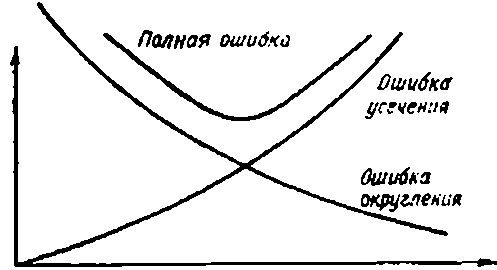
$$

РИС. 38.5. Залежність повної похибки від кроку сітки.

- 2. Розв'яжіть задачу 1 аналітично (ділячи змінні). Знайдіть значення розв'язку у вузлах сітки x=0; 0,1; 0,2; 0,3; ...; 0,9; 1 при t=0,015. Порівняйте ці результати з результатами чисельного розв'язку задачі 1. (Ви можете скористатися калькулятором або написати невелику комп'ютерну програму для табуляції аналітичного розв'язку.)
- 3. Відповідно до примітки 3, побудуйте блок-схему для розв'язання гіперболічної задачі.
- 4. Розв'яжіть задачу 1 з новою граничною умовою при x=1 $ u_x(1, t) = -[u(1, t) 1]. $ # СХЕМИ НЕЯВНИХ РІЗНИЦЬ (СХЕМА КРАНКА–НІКОЛСОНА)

МЕТА ЛЕКЦІЇ: Показати, як можна розв'язувати задачі, що містять функції, залежні від часу, використовуючи неявну різницю схеми. У цій схемі, як і в попередній схемі, часткові похідні замінюються скінченно-різницею, але $ u_{l+1,\ J} $ більше не виражаються явно через значення на попередніх шарах. Тепер, щоб визначити значення $ u_{l+1,\ J} $ , необхідно розв'язати систему рівнянь. Іншими словами, щоб визначити розв'язок на кожному часовому nage, необхідно розв'язати систему рівнянь.

Перевага неявних схем над явними полягає в тому, що в неявних схемах танг сітки можна зробити достатньо великим без страху, що помилки округлення «знищать» розв'язок.

Для розв'язання параболічної задачі ми використаємо відому схему *Кранк*-*Ніколсона*.

Як уже згадувалося в попередній лекції, щоб явна схема працювала надійно, часовий крок сітки має бути невеликим. Зокрема, якщо просте завдання для рівняння теплопровідності

(39.1)

$$

$$

розв'язується за явною схемою, тоді кроки сітки $ \Delta t $ і $ \Delta x $ повинні задовольняти умову

$$

\begin{array}{ccccccccccccccccccccccccccccccccccc

$$

Інакше метод буде чисельно нестабільним (а помилки округлення зростуть нескінченно). (Питання чисельної стабільності розглядаються у [53].) Іншими словами, якщо відстань сітки на осі x вибрана $ \Delta x=0,1 $ , то часовий крок $ \Delta t $ не може бути більшим за $ 0.5\Delta x^2=0.005 $ . Це означає, що ви можете пройти від t=0 до t=1, зробивши 200 кроків.

Однак існують такі схеми (неявні схеми), які дозволяють виконувати обчислення з набагато більшим кроком, тоді як

Правда, обсяг розрахунків, які виконуються на одному кроці, зростає. Такі схеми можна використовувати для виконання обчислень із досить великим кроком, але на кожному кроці потрібно розв'язати систему алгебраїмних рівнянь. Щоб проілюструвати цей метод, розв'яжемо наступну проблему теплопровідності.

# Неявная схема для уравнения теплопроводности

Рассмотрим задачу

(39 2)

$$

\frac{\Delta t}{(\Delta x)^2} \leqslant 0.5.

$$

Використаємо наступні апроксимації скінченних різниць для часткових похідних $ u_t $ та $ u_{xx} $ :

$$

\begin{array}{ccccccccccccccccccccccccccccccccccc

$$

де $ \lambda $ взято з сегмента [0,1]. Зверніть увагу, що $ u_{xx} $ наближається зваженим середнім центральних різницевих похідних у момент часу t і t+k. $ \lambda=0.5 $ отримується звичайне середнє для цих двох центральних похідних, і при $ \lambda=0.75 $ одна з різницевих похідних бере вагу 0,75, а інша — 0,25. У $ \lambda=0 $ отримується звичайна явна схема, яка була обговорена в попередній лекції.

Після заміни часткових похідних $ u_t $ і $ u_{xx} $ у задачі (39.2) отримуємо різницю (див. рисунок 39.1).

Разностное уравнение

$$

\begin{split} u_t(x,\ t) &= \frac{1}{k} \big[ u(x,\ t+k) - u(x,\ t) \big], \\ u_{xx}(x,\ t) &= \frac{\lambda}{h^2} \big[ u(x+h,\ t+k) - 2u(x,\ t+k) + u(x-h,\ t+k) \big] + \\ &\quad + \frac{(1-\lambda)}{h^2} \big[ u(x+h,\ t) - 2u(x,\ t) + u(x-h,\ t) \big], \end{split}

$$

(39.3)

$$

\frac{1}{k} (u_{i+1, j} - u_{i, j}) = \frac{\lambda}{h^2} (u_{i+1, j+1} - 2u_{i+1, j} + u_{i+i, j-1}) + \frac{(1-\lambda)}{h^2} (u_{i, j+1} - 2u_{i, j} + u_{i, j-1}),

$$

298

Перенесіть усі невідомі значення u з верхнього часового шару (i+1) на ліву частину рівняння (39.3) і отримайте (39.4)

$$

(39.3)

$$

де вводиться позначення $ r = k/h^2 $ . Зверніть увагу, що якщо i фіксоване, а j змінюється від 2 до n-1, співвідношення (39.4) визначають систему рівнянь n-2 з n-2 невідомим $ u_{t+1,2}, u_{t+1,3}, $

$$

(\Gamma Y) \begin{cases} u_{i, 1} = 0, & i = 1, 2, ..., m, \\ u_{i, n} = 0, & i = 1, 2, ..., m, \\ u_{i, j} = 1, & j = 2, ..., n-1. \end{cases}

$$

РИС. 39.1. Сітка для схеми неявних різниць.

$$

-\lambda r u_{i+1, j+1} + (1+2r\lambda) u_{i+1, j} - \lambda r u_{i+1, j-1} = = r(1-\lambda) u_{i, j+1} + [1-2r(1-\lambda)] u_{i, j} + r(1-\lambda) u_{i, j-1},

$$

РИС. 39.2. Шаблон неявної схеми $ u_{i+1, 4}, \ldots, u_{i+1, n-1} $ , які є розв'язком проблеми у внутрішній

ренних узлах сетки на временном слое $ t=(i+1)\Delta t $ .

Фіг. 39.2 дає візуальне представлення структури кожного рівняння системи (39.4). Тепер перейдемо до розв'язку системи (39.4).

# Алгоритм розв'язання задачі (39.2)

КРОК 1. Виберіть якусь цінність $ \lambda $ ( $ 0 \le \lambda \le 1 $ ). Якщо $ \lambda = 0 $ , то рівняння (39.4) перетворюються на явні формули з лекції 38.

КРОК 2. Припустимо, наприклад, $ h=\Delta x=0,2 $ і $ k=\Delta t=0,08 $ (у цьому випадку $ r=k/h^2=2 $ ). У цьому випадку сітка містить 6 вузлів уздовж осі (4 внутрішні вузли) (див. рисунок 39.1). Візьмемо параметр ваги $ \lambda=0,5 $ (отримана схема називається схемою Кренка-Ніколсона). Відповідно до обчислювальної схеми (її зазвичай називають шаблоном), показаної на рис. На рисунку 39.2, рухаючись зліва направо (j=2,3,4,5) уздовж перших двох шарів (i=1), отримуємо наступні чотири рівняння:

$$
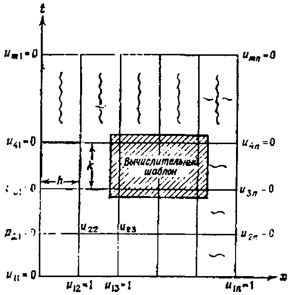
$$

Перепишем их в матричной форме

(39.5)

$$
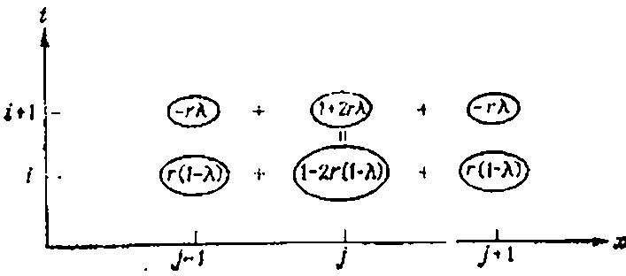
$$

$$

\begin{array}{l} -u_{21}+3u_{22}-u_{23}=u_{11}-u_{12}+u_{13}=1,\\ -u_{22}+3u_{23}-u_{24}=u_{12}-u_{13}+u_{14}=1,\\ -u_{23}+3u_{24}-u_{25}=u_{13}-u_{14}+u_{15}=1,\\ -u_{24}+3u_{25}-u_{26}=u_{14}-u_{15}+u_{16}=1. \end{array}

$$

\begin{bmatrix} u_{2\bar{z}} \\ u_{\bar{z}a} \\ u_{24} \\ u_{\bar{z}x} \end{bmatrix}

$$

$$

$$

$$

$$
\begin{bmatrix} 3 & -1 & 0 & 0 \\ -1 & 3 & -1 & 0 \\ 0 & -1 & 3 & -1 \\ 0 & 0 & -1 & 3 \end{bmatrix}
$$

$$

$$

Матриця цієї системи називається тридіагональною. Щоб розв'язати систему з трьома діагоналями

$$

\begin{bmatrix} u_{2\bar{z}} \\ u_{\bar{z}a} \\ u_{24} \\ u_{\bar{z}x} \end{bmatrix}

$$

$$

$$

\begin{bmatrix} x_1 \\ x_{\bar{z}} \\ x_{\bar{s}} \\ \vdots \\ x_n \end{bmatrix}

$$
=
$$

$$

$$

$$
\begin{bmatrix} 1 \\ 1 \\ 1 \\ 1 \end{bmatrix}
$$

\begin{bmatrix} d_t \\ d_{\bar{z}} \\ d_{\bar{s}} \\ \vdots \\ \vdots \\ d_n \end{bmatrix}

$$

.

$$

$$

$$

преобразуем ее в эквивалентную систему вида

$$

\begin{bmatrix} b_1 & c_1 & 0 & 0 & \dots & & & 0 \\ a_1 & b_2 & c_2 & 0 & \dots & & & 0 \\ 0 & a_{\bar{z}} & b_3 & c_3 & \dots & & & 0 \\ & & & & & & & & \\ \vdots & & & & & & & & \\ 0 & 0 & 0 & \dots & & & & a_{n-1} & b_n \end{bmatrix}

$$

$$

$$

\begin{bmatrix} x_1 \\ x_2 \\ x_3 \\ \vdots \\ x_n \end{bmatrix}

$$

\begin{bmatrix} x_1 \\ x_{\bar{z}} \\ x_{\bar{s}} \\ \vdots \\ x_n \end{bmatrix}

$$

$$

$$

$$
=
$$

\begin{bmatrix} d_1^* \\ d_2^* \\ d_3^* \\ \vdots \\ d_n^* \end{bmatrix}

$$

$$

$$

\begin{bmatrix} d_t \\ d_{\bar{z}} \\ d_{\bar{s}} \\ \vdots \\ \vdots \\ d_n \end{bmatrix}

$$

где

$$

,

$$

, $ c_{j+1}^* = \frac{c_{j+1}}{b_{j+1} - a_j c_j^*} $ , $ j = 1, 2, \ldots, n-2 $ , и $ d_1^* = d_1/b_1 $ , $ d_{j+1}^* = \frac{d_{j+1} - a_j d_j^*}{b_{j+1} - a_j c_j^*} $ , $ j = 1, 2, \ldots, n-1 $ .

У цьому перетворенні немає нічого дивного, оскільки друга система повністю еквівалентна першої. Матриця нової системи організована так, що цю систему дуже легко розв'язати. Розв'язуючи рівняння послідовно знизу вгору, отримуємо

$$

$$

Застосовуючи цей метод до системи чотирьох рівнянь (39,5), отримуємо розв'язок $ u_{22}=0,60 $ ; $ u_{23}=0,80 $ ; $ u_{24}=0,80 $ ; $ u_{23}=0,60 $ . Ми отримали наближені значення розв'язку у внутрішніх точках сітки на $ t=\Delta t $ . Тепер ми можемо зробити наступний крок у часі, але для цього нам доведеться розв'язати нову систему рівнянь.

У неявній схемі кількість обчислень на кожному кроці більша, ніж на явному, але хорошу точність можна отримати навіть при значно більшому кроці.

# ЗАВДАННЯ

- 1. Из дифференциального уравнения (39.3) получите уравнение (39.4).
- 2. Постройте неявную конечно-разностную схему для задачи

$$

\begin{bmatrix} 1 & c_1^* & 0 & 0 & \dots & 0 \\ 0 & 1 & c_2^* & 0 & \dots & 0 \\ 0 & 0 & 1 & c_2^* & \dots & 0 \\ \vdots & \vdots & & & \vdots & \vdots \\ 0 & 0 & \dots & & 1 \end{bmatrix}

$$

$$

$$

$$

\begin{bmatrix} x_1 \\ x_2 \\ x_3 \\ \vdots \\ x_n \end{bmatrix}

$$

$$

$$

$$
=
$$

 $ - 4. Как выглядит шаблон для уравнения (39.4), когда $ \lambda = 1 $ ?
- 5. Постройте блок-схему розв'язки рівняння теплопровідності (39.2). Якщо есть возможность, то напишите программу для ЭВМ Було бы очень полезно решить эту задачу численно при различных значениях λ с начальным условием и (x, 0) = sin (πx). Сравните полученные при различных λ численные результаты с аналитическим решением, яке в данном случае имеет вид

$$
u_{\xi\eta} = \frac{\eta u_{\xi} - \xi u_{\eta}}{2(\xi^2 - \eta^2)}.
$$

6 Воспользовавшись формулами, приведенными в тексте, решите систему алгебраических уравнений (39.5).
Лекція 40
# СРАВНЕНИЕ АНАЛИТИЧЕСКИХ РЕШЕНИЙ С ЧИСЛЕННЫМИ МЕТА ЛЕКЦІЇ: Сравнить достоинства и недостатки аналитических и численных методов розв'язки уравнений з частинними похідними. Приведена важная математическая задача об идентификации физических величин (параметрическая идентификация). В связи с цієї задачей рассматривается один важный пример из биологии.

Вероятно, пришло время обсудить достоинства и недостатки аналитических и численных решений уравнений з частинними похідними. Сначала выясним, що мы подразумеваем под этими двумя типами решений.

# Аналитические розв'язки

Под аналитическими решениями мы подразумеваем такие розв'язки, в которых неизвестная функція и выражена через независимые змінні и параметры системи в виде формул, бесконечных рядов и интегралов.

# Численные розв'язки

Під чисельним ми зрозуміємо чисельні розв'язки, отримані чисельно після приблизної заміни початкового рівняння іншим, простішим рівнянням. Наприклад, у методі скінченної різниці похідні виражаються через скінченні різниці, а розв'язок диференціального рівняння в похідних у похідних апроксимується розв'язком різницького рівняння. Результатом такої процедури зазвичай є таблиця значень розв'язків, а для деяких значень пояснювальних змінних.

Таблина 40.1

| | × | | | | | | | | | | |
|---------------------------|-------------|------------------|-----------|----------|----------|-----|-----|-----|-----------|------------------|------------------|
| | 0 | 0,1 | 0,2 | 0,3 | 0,4 | 0,5 | 0,6 | 0,7 | 0,8 | 0,9 | 1 |
| 0 0,01 0,02 0,03 | 1 0 0 | 1 0,2 0,15 | 1 0,34 | l : | : | : | ! | : | 1 0,34 | 1 0,2 0,15 | 1 0 0 0 |
| ; | | : | : | <b>:</b> | <b>:</b> | : | : | : | : | : | : |

Теперь, когда мы знаем, що подразумевается под решением каждого из цих типов, давайте сравним их между собой.

# **Сравнительный анализ численного** и аналитического решений

Рассмотрим простейшую смещанную параболическую задачу

(40.1)

$$

Задача решена. Теперь мы знаем, что нужно сделать, чтобы найти новые координаты и привести уравнение к канонической форме.

# ЗАМЕЧАНИЯ

1. На самом деле для гиперболических уравнений существует две канонические формы. Вторую можно получить из первов заменой переменных вида

$$

Розв'язок якого показано на рис. 40.1. Що краще — мати аналітичне рішення цієї проблеми?

(40.2)

$$
\alpha = \alpha (\xi, \eta) = \xi + \eta,
$$

или численное, представленное при $ \alpha = 1 $ в табл. 40.1?

Вопрос хороший, а ответ на него зависит от того, що мы хотим делать с этим решением дальше. Однако каждому из типов решений присущи очевидные преимущества.

# Преимущества аналитического розв'язки

1. Очевидно, що розв'язок (40.2) є більш інформативним, ніж таблиця чисел. Якщо ми хочемо обчислити розв'язок у певній точці (x, t), ми можемо зробити це так точно, як хочемо, просто збільшуючи кількість членів ряду, які розглядаються. Водночас легко отримати оцінку зверху щодо значення допущеної помилки.

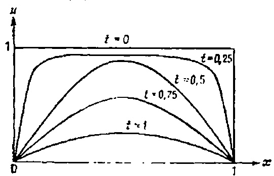

Рис. 40.1. Розв'язок рівняння теплопровідності (40.1) в различные моменты времени.

- 2. Аналітичне розв'язання завжди дозволяє обчислити значення розв'язку в одній точці (x, t) без необхідності обчислювати значення розв'язків в інших точках, як це відбувається при розв'язанні задач із явними або неявними різницею схем.
- 3. Аналітичне рішення дозволяє визначити розв'язок у будь-якій точці, а не лише на вузлах сітки.
- 4. Найважливішою перевагою аналітичного розв'язку для нас є можливість простежити вплив фізичних параметрів, початкових і граничних умов на природу розв'язку.

Чисельні методи не виявляють цих регулярностей, оскільки дозволяють знаходити розв'язок лише за заданих параметрів — початкових і граничних умовах. Іноді важливо знати взаємозв'язок між параметрами моделі та розв'язком, особливо коли йдеться про оцінку фізичних параметрів за типом розв'язку. Наприклад, припустимо, що розв'язок і визначається експериментально, і ми знаємо аналітичний розв'язок

u = функція от параметров.

Тогда можна поставить вопрос об определении параметров нак функції входных данных по схеме

Параметры = функція от u = функція исходных данных.

Такая задача називається параметрической идентификацией. Для параметрической идентификации необходимо уметь решать уравнение з частинними похідними. Несколько позже в цієї лекции мы приведем пример параметрической идентификации в биологии, но сначала посмотрим, чем же хороши численные розв'язки.

# Преимущества численных решений

Головна перевага чисельних розв'язків полягає в тому, що їх можна отримати навіть якщо аналітичне рішення неможливо. Майже всі нелінійні диференціальні рівняння в похідних похідних потрібно розв'язувати чисельними методами, і більшість реальних моделей фізики, хімії, біології тощо є нелінійними. Як правило, лінійні моделі наближаються до нелінійних лише якщо в них відкинути нелінійні члени. Наприклад, ось кілька нелінійних рівнянь:

1) нелинейное хвильове рівняння $ u_{tt} = u_{xx} + f(u) $ ;

2) уравнение реакции с нелинейной диффузией $ u_t = u_{xx} + f(u) $ ;

3) система Ходжкина—Хаксли $ 

$$

$$

 $ Аналитические розв'язки для цих уравнений не известны ни при каких нелинейных функциях f и $ g^{(1)} $ . Поэтому общий подход к решению нелинейных (а в ряде случаев и линейных) задач обычно базируется на численных решениях.

Тепер давайте розглянемо приклад того, як можна використати аналітичне рішення для визначення фізичних параметрів. Детальніший опис цих завдань можна знайти у рекомендованій літературі.

# Параметрическая идентификация (в биологии)

Припустимо, що біолог намагається визначити швидкість, з якою $ (K^+) $ іони калію дифундують у екзоплазмовому розчині. Якщо ви знаєте цей коефіцієнт дифузії, можна багато сказати про те, як нервові імпульси передаються вздовж аксонів. Проблема в тому, що це співвідношення майже неможливо знайти прямим вимірюванням. Однак можливо знайти математичний

1) Це не так. В качестве примера можна привести уравнение $ u_{ii} = u_{xx} - \sin u_x - \Pi pum $ , ped.

связь между концентрацией поташа $ u\left(x,\,t\right) $ и коэффициентом диффузии $ D,\,\,a\,\, $ затем по измерениям величины $ u\left(x,\,t\right) $ определить величину D.

Біологи Ходжкін і Кейз виявили, що після розміщення гігантського аксону у спеціальному соляному розчині концентрація радіохктивного калію (**2K) вздовж аксону приблизно описується кривою в початковий момент

$$ .

Отже, параметри A і A слід обирати так, щоб крива відповідала експериментальним даним (наприклад, у сенсі методу найменших квадратів). Також було встановлено, що P И С

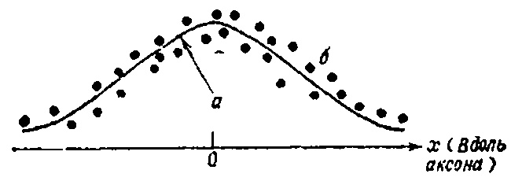

. 40.2. Начальная концентрация ионов ( $ ^{42}K $ ): a—теоретическая кривая; $ \delta $ —экспериментальные точки.

с течением времени ноны поташа под действием диффузии и конвекции растекаются вдоль аксона. Ходжкин и Кейс предположили, що концентрация и является решением следующей задачи с начальными данными для уравнения диффузии:

(40.3)

$$ Цю проблему вирішили у лекції 15, переключившись на рухому систему координат. Якщо читач пам'ятає, загальна схема методу виглядає так. Спочатку відкидаємо конвективний член і отримуємо розв'язок суто дифузійної задачі (при V = 0):

$$ TO

(23 9) 

$$

= \frac{A\sqrt{a}}{\sqrt{a+4Dt}} e^{-[x^2/(a+4Dt)]},

$$
u_{\alpha\alpha} - u_{\beta\beta} = \frac{-\beta u_{\alpha} - \alpha u_{\beta}}{2\alpha\beta}.
$$

u(x, t) = \frac{A\sqrt{a}}{\sqrt{a+4Dt}}e^{-[(x-Vt)^{2}/(a+4Dt)]}.

$$

При желании можно выразить  $ \alpha $  и  $ \beta $  через исходные координаты x и y. В результате получаем

$$

SS = \sum_{i=1}^{n} [y_i - (a + bx_i)]^2.

$$
\alpha = \xi + \eta = (y^2 - x^2) + (y^2 + x^2) = 2y^3,
$$

u_t = \frac{1}{r} \frac{\partial}{\partial r} \left( Dr u_r - s \omega^2 r^2 u \right), \quad 0 < r < 1,

$$ \beta = \xi - \eta = (y^2 - x^2) - (y^2 + x^2) = -2x^2.$$

Au_{xx} + Bu_{xy} + Cu_{yy} + Du_x + Eu_y + Fu = G

$$u_{\xi\xi} - u_{\eta\eta} = \Psi(\xi, \, \eta, \, u_{\xi}, \, u, u_{\eta}).$$

\begin{cases} 0, & t < x/V, \\ P, & t \ge x/V. \end{cases}

$$3u_{xx} + 7u_{xy} + 2u_{yy} = 0$$

Конечно, все це очень просто! Не сложнее, чем сбрасывать що-нибудь на ленту транспортера, а затем наблюдать за его движением. Однако все становится очень интересным, якщо примесь диффундирует в среде. Чтобы разобраться в том, що про-исходит с движущейся волной при наличии диффузии, решим

следующую задачу

(15.2)

$$u_{\xi\eta} = \Phi(\xi, \eta, u, u_1, u_2).$$

З формальною заміною змінних $ \xi = \xi(x, y) $ та $ \eta = \eta(x, y) $ (41.1) зводиться до тієї ж форми

(41.2)

$$u_{\alpha\alpha} - u_{\beta\beta} = \Psi(\alpha, \beta, u, u_{\alpha}, u_{\beta}).$$

где, как обычно, H(x) — функція Хевисайда Начальное распределение концентрации изображено на рис 15 4.

Рис. 15.3 Конвективная волна a—передиції фронт примеси, $ \delta $ —на одну единицу вперед волнового фронта

Обратим внимание на то, що в задаче (15.2) мы отодвинули границу в — $ \infty $ (теперь решается задача Коши), так що она не оказывает теперь влияние на оценку розв'язок. Чтобы решить задачу (15.2), можна воспользоваться преобразованием Лапласа Р И С

. 15 4 початкові умови в задаче конвективной диффузии.

ло переменной t или преобразованием Фурье по переменной x. Однако в цьому случае гораздо интереснее поступить совсем по-другому Введем новую систему координат, яка движется вдоль старой со скоростью V. Другими словами, вместо системи координат, привязанной к берегу реки, мы рассмотрим систему координат, яка движется со скоростью фронта примеси (конечно, при налични диффузии фронт буде «смазан»). С точки зрения математики це означает, що мы заменяем пространственную координату x на новую $ \xi = x - Vt $ .

Теперь ясно, що

когда $ \xi = 0 $ , мы находимся па фронте распространяющейся примеси.

когда $ \xi = 1 $ , мы находимся на одну единицу длины впереди фронта.

когда $ \xi = -1 $ , мы находимся на одну единицу длины позади фронта.

Наша задача — преобразовать исходную задачу с НУ

$$u_{xx} + 4u_{xy} = 0.$$

\overline{D} = A\xi_{xx} + B\xi_{xy} + C\xi_{yy} + D\xi_{x} + E\xi_{y},

$$u_{tt} = e^{2} (u_{xx} + u_{yy} + u_{zz}),
$$

[\xi_x/\xi_y] = -B/2A

$$ \xi(x, y) = c

$$ \frac{dy}{dx} = -\left[\xi_x/\xi_y\right] = B_t 2A.

$$ (НУ) 
$$

\overline{B} = 2A\xi_x\eta_x + B(\xi_x\eta_y + \xi_y\eta_x) + 2C\xi_y\eta_y,

$$ 1) Завдяки рівності

І з $ B^2 - 4AC = 0 $ році , то

$$ Оскільки $ \xi_x/\xi_y = -B \ 2A = -2 \sqrt{A\tilde{C}}/2A = -\sqrt{C/A} $ останній вираз для B буде записаний як

$$ в трехмерном пространстве и показать, что полученное решение удовлетворяет *принципу Гюйгенса*. Для решения соответствующей двумерной задачи

(УЧП) 

$$

І оскільки $ \overline{A} $ дорівнює нулю, то $ \overline{B} $ , звісно, також дорівнює нулю.

Оскільки при нашому виборі $ \xi $ обидва коефіцієнти $ \overline{A} $ і $ \overline{B} $ повертаються до нуля, ми можемо взяти будь-яку функцію як $ \eta $ (якщо вона не пропорційна координаті $ \xi $ ). У прикладі можна вибрати $ \eta = y $ .

Залишається знайти канонічну форму рівняння в нових координатах. Для цього потрібно просто підставити формули $ \xi $ і $ \eta $ (41.3) і знайти всі шанси $ \overline{A} $ , $ \overline{B} $ , $ \overline{C} $ , $ \overline{D} $ , $ \overline{E} $ , $ \overline{F} $ і $ \overline{G} $ . На цьому вивчення параболічного випадку завершується, але перш ніж перейти до іншої теми, розглянемо простий приклад.

# Перетворення параболічного рівняння $ u_{xx} + 2u_{xy} + u_{yy} = 0 $ у канонічну форму

Розглянемо рівняння

$$
u_{tt} = c^2 (u_{xx} + u_{yy}), \quad
$$

Його коефіцієнти мають такі значення: A=1, B=2, C=1, D=E=F=G=0. Отже, $ B^2-4AC=0 $ для всіх значень x і y. Щоб знайти нові координати $ \xi $ і $ \eta $ та канонічну форму рівняння, ми рухаємося наступним чином.

КРОК 1. Запишемо *характеристичне рівняння* (тепер лише одне, а не два)

$$ \begin{cases} -\infty < x < \infty, \\ -\infty < y < \infty, \end{cases}

$$

Розв'язуючи це рівняння відносно y, отримуємо

$$

\begin{cases} -\infty < x < \infty, \\ -\infty < y < \infty, \\ -\infty < z < \infty, \end{cases}

$$,

Де — характеристика $ \xi = y - x $ визначена. Використання цієї характеристики забезпечує досягнення рівності $ \overline{A} = 0 $ . Координату $ \eta $ можна вибрати довільно (якщо вона не залежить від $ \xi $ ). Ми оберемо його наступним чином:

$$

\begin{cases} u(x, y, z, 0) = \varphi(x, y, z), \\ u_{t}(x, y, z, 0) = \psi(x, y, z). \end{cases}

$$.

Нові координати

$$
P_{2}
$$

изображены на рис. 41 1.

Рис. 41.1. Новая система координат $ \xi = y - x $ , $ \eta = y $ .

ШАГ 2. Осталось найти каноническую форму уравнения. Подставляя $ \xi $ и $ \eta $ в формулы для коефіцієнтів $ \overline{A} $ , $ \overline{B} $ , $ \overline{C} $ , $ \overline{D} $ , $ \overline{E} $ , $ \overline{F} $ и $ \overline{G} $ , получаем $ \overline{A} = 0 $ (так и должно быть; мы находили $ \xi $ из условия равенства нулю цього коэффициента), $ \overline{B}=0 $ (мы уже раньше показали, що этог коефіцієнт також обращается в нуль),

(41.5)

$$

\begin{aligned} u_{tt} &= c^2 \Delta u, \\ (HY) & \begin{cases} u(x, y, z, 0) = 0, \\ u_t(x, y, z, 0) = \psi(x, y, z), \end{cases} \end{aligned}

$$

\overline{D} = A \xi_{xx} + B \xi_{xy} + C \eta_{yy} + D \xi_x + E \xi_y = 0,

$$

Цю задачу можна розв'язати методом $ \Phi $ Юр'єра $ ^{1} $ ), і виявляється, що розв'язок можна представити у вигляді

$$

Отже, нове рівняння

$$
P_{1}
$$

\xi = x - Vt

$$

где $ \overline{\psi} $ — *среднее* значение начального распределения $ \psi $ *по сфере* радиуса ct с центром в точке (x, y, z), т. е.

$$

u(x, t) =

є загальним розв'язком рівняння П

еред нами розв'язок задачи конвективной диффузии (15.2). Его очень легко интерпретировать, якщо представить, що мы движемся относительно графика, изображенного на рис. 15.6.

Рис. 15.6. Диффузня из области высокой концентрации в область низкой концентрации. Чем больше коефіцієнт дифузії, тем быстрее установится стационарное значение.

Другими словами, в зависимости от относительной величины D (коэффициента диффузии) и V (скорости потока) розв'язок движется слева направо со скоростью V и в то же самое время передний фронт расплывается со скоростью, определяемой величиной D.

Рис. 15.7. Розв'язок задачи конвективнои диффузии. Вещество одновременно движется и диффундирует.

(На рис. 15.7 показано, как расплывается передний фронт концентрации.)

# ЗАМЕЧАНИЯ

Преобразование координат является важным методом розв'язки уравнений з частинними похідними. Выбрав подходящую систему координат, можна существенно упростить уравнение.

# ЗАДАЧИ

1. Решите задачу Коши:

$$

\begin{aligned} (\text{YAII}) & u_{tt} = c^2 \Delta u, \\ (\text{HY}) & \begin{cases} u = 0, \\ u_t = \varphi, \end{cases} \end{aligned}

$$

Але тепер у $ B^2-4AC<0 $ . Переходячи до нових пояснювальних змінних, ми хочемо перетворити її у нову форму

$$
u_h(r, \theta) = \sum_{n=0}^{\infty} r^n [a_n \cos(n\theta) + b_n \sin(n\theta)].
$$

2. Найдите розв'язок задачи Коши для уравнения конвективной диффузии:

$$

\Delta u = -\frac{r^2}{2} - \frac{r^3}{2} \cos{(2\theta)}

$$

Це можливо, але лише шляхом введення складних координат. Щоб знайти ці комплексні координати $ \xi $ і $ \eta $ , розв'яжемо характеристичні рівняння, так само як у гіперболічному випадку:

$$
u = \frac{\partial}{\partial t} [t\overline{\varphi}].
$$

Воспользуйтесь преобразованием из лекции 8.

3. Найдите розв'язок задачи переноса:

$$

u_p(r, \theta) = Ar^4 + Br^4 \cos(2\theta).

$$

\frac{dy}{dx} = \sqrt{-4x^2} = 2ix

$$
u(x, t) = \frac{1}{2c} \int_{x-ct}^{x+ct} \varphi(s) ds.
$$

\\ -\infty < x < \infty, \quad 0 < t < \infty,

$$

u_p(r, \theta) = -\frac{r^4}{32} - \frac{r^4}{24} \cos(2\theta).

$$

u_t = Du_{xx} - Vu_x, \quad -\infty < x < \infty, \quad 0 < t < \infty,

$$
u_t(x, t) = \frac{1}{2} [\varphi(x + ct) + \varphi(x - ct)].
$$

u(x, 0) = e^{-x^2}, \quad -\infty < x < \infty.

$$

\sum_{n=0}^{\infty} [a_n \cos(n\theta) + b_n \sin(n\theta)] - \frac{1}{32} - \frac{1}{24} \cos(2\theta) = 0.

$$

y^2 u_{xx} + x^2 u_{yy} = 0,

$$

u_1(r, \theta) = \frac{1}{32} + \frac{1}{24}r^2\cos(2\theta) - \frac{r^4}{24}\cos(2\theta) - \frac{r^4}{32} = \frac{(r^4 - 1)}{32} - \frac{(r^4 - r^2)}{24}\cos(2\theta).

$$

\frac{dy}{dx} = \frac{B - \sqrt{B^2 - 4AC}}{2A} = -\frac{\sqrt{-4x^2y^2}}{2y^2} = -i\frac{x}{y},

$$

u = u_0 + u_1 = r \cos \theta - \frac{(r^4 - 1)}{32} - \frac{(r^4 - r^2)}{24} \cos (2\theta).

$$

u(\xi, \tau) = \frac{1}{2\sqrt{D\pi\tau}} \int_{-\infty}^{+\infty} e^{-\beta^2} e^{-(\xi-\beta)^2/4D\tau} d\beta.

$$ u_{tt} = \alpha^2 u_{xx}

$$ u_{\xi\eta} = \psi(\xi, \eta, u, u_{\xi}, u_{\eta}).

$$

P_{2}

$$

\xi(x, y) = y^2, \quad \eta(x, y) = x^2.

$$
\Delta u = 0, \quad 0 < r < 1 + \frac{1}{4} \sin \theta,
$$

T \sin \theta_2 - T \sin \theta_1 =

$$

записывается в виде

$$

\Delta x \rho u_{tt} = T \left[ u_x \left( x + \Delta x, \ t \right) - u_x \left( x, \ t \right) \right] + \Delta x F \left( x, \ t \right) - \frac{1}{\Delta x \rho u_t} \left( x, \ t \right) - \Delta x \gamma \dot{u} \left( x, \ t \right)

$$
u \left( 1 + \frac{1}{4} \sin \theta, \ \theta \right) = \cos \theta, \quad 0 \le \theta \le 2\pi.
$$

u_{tt} = \alpha^{3} u_{xx} - \beta u_{t} - \gamma u + F(x, t).

$$

где $ \overline{\phi} $ и $ \overline{\psi} $ — средние значения функций $ \phi $ и $ \psi $ на сфере раднусом ct с центром в точке (x, y, z).

Цей розв'язок зазвичай називають формулою Пуассона для хвильового рівняння у тривимірному просторі. Це природне узагальнення формули д'Аламбера на тривимірний випадок. Найважливішим у формулі Пуассона є те, що обидва інтеграли в $ \bar{\phi} $ і $ \bar{\psi} $ взяті з поверхні сфери. Цей факт дозволяє нам надати таку важливу інтерпретацію рішення.

У момент $ t=t_1 $ розв'язок u у (x,y,z) залежить лише від початкових розподілів сфери з радіусом $ ct_1 $ центрованим на (x,y,z) (рисунок 24.3). Тепер припустимо, що початкові розподіли $ \phi $ і $ \psi $ дорівнюють нулю всюди, крім малої сфери (див. рисунок 24.3). З часом радіус P И С

. 24.3. Схема поясияет, как начальное возмущение влияет на точку (к, ч, г).

Сфера, що оточує точку (x, y, z), зростає зі швидкістю c, так що через $ t_{\hat{z}} $ секунди ця сфера починає перетинати область початкового збурення, і тому розв'язок u(x, y, z, t) стає ненульовим. У $ t_{\hat{z}} < t < t_{\hat{a}} $ розв'язок U у (x, y, z) залишається ненульовим, оскільки сфера продовжує перетинати область початкового збурення, але на $ t=t_{\hat{a}} $ розв'язок знову стає нульовим. Іншими словами, розв'язок, що поширюється з початкової області збурення, має чітко визначену задню кромку. Цей загальний принцип відомий як принцип Гюйгенса для тривимірного простору. Виявляється, що передній край хвилі завжди чітко окреслений, але задній край чітко окреслений лише в просторах розмірності 3, 5, 7.... Ми вже знаємо з формули д'Аламбера, що початкові умови

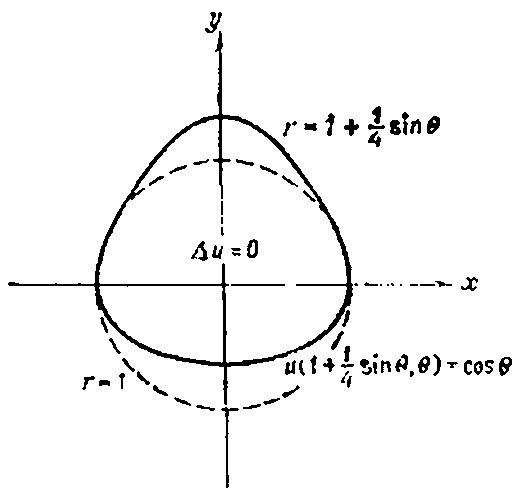

$$

(16.2) u_{tt} = \alpha^2 u_{xx},

$$
u\left(1+\frac{1}{4}\sin\theta,\ \theta\right)=\cos\theta
$$

u_{tt} = ku_{xx}

$$

приводят, вообще говоря, к нерезкому заднему фронту (поскольку формула Даламбера подразумевает интегрирование функции $ \psi(x) $ в пределах от x-ct до x+ct).

Покажем теперь, что принцип Гюйгенса неприменим к цилиндрическим волнам. Такого рода решения описывают волны на воде от точечного источника, когда задний фронт волны не резкий, а постепенно затухает до нуля.

# Двумерное волновое уравнение

Чтобы решить двумерную волновую задачу

(УЧП)

$$

u_{tt} = \frac{\partial}{\partial x} [\alpha^2(x) u_x],

$$
u(1+\epsilon\sin\theta, \theta) = \cos\theta, \quad 0 \le \epsilon \le 1/4.
$$

u(x, 0) = f(x)

$$

f(x+h) = f(x) + f'(x)h + f''(x)\frac{h^2}{2!} + \dots,

$$

i_x + Cv_t + Gv = 0, \\ v_x + Li_t + Ri = 0,

$$ i_{xx} + Gv_x - CLi_{tt} - CRi_t = 0.

$$ v_{x} = -Li_{t} - Ri,

i_{t,s} = CLi_{tt} + (CR + GL)i_t + GRi.

$$

u(1+\varepsilon\sin\theta,\ \theta)=u(1,\ \theta)+u_r(1,\ \theta)(\varepsilon\sin\theta)+u_{rr}(1,\ \theta)\frac{(\varepsilon\sin\theta)^2}{21}+\ldots

$$

v_{xx} = CLv_{tt} + (CR + GL)v_t + GRv.

$$

\Delta u = 0, \quad 0 < r < 1 + \varepsilon \sin \theta,

$$

v_{tt} = \alpha^2 v_{xx}, \\ i_{tt} = \alpha^2 i_{xx}, \qquad \alpha^2 = 1/CL,

$$

u(1, \theta) + u_r(1, \theta) (\varepsilon \sin \theta) + u_{rr}(1, \theta) \frac{(\varepsilon \sin \theta)^2}{2!} + \dots = \cos \theta.

$$

u_{tt} = u_{xx} - u_t

$$

(46.8) u = u_0 + \varepsilon u_1 + \varepsilon^2 u_2 + \dots.

$$

Що ви можете сказати про точність?

4. Як отримати послідовність випадкових точок, що лежать всередині трикутника T?

5. Як отримати послідовність випадкових чисел, розподіл яких показаний на рисунку?

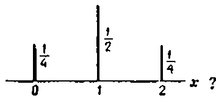

Іншими словами, як отримати послідовність чисел {0, 1, 2}, якщо ймовірність виникнення 0 і 2 дорівнює 0,25, а ймовірність появи 1 — 0,5?

Лекція 43

# РОЗВ'ЯЗАННЯ ДИФЕРЕНЦІАЛЬНИХ РІВНЯНЬ У ПОХІДНИХ ПОХІДНИХ МОНТЕ-КАРЛО

МЕТА ЛЕКЦІЇ: Показати, як побудувати таку гру, результатом якої є приблизне розв'язання диференціального рівняння. Одна з цих ігор (модель випадкової ходьби) веде до скінченної різниці апроксимації задачі Діріхле в квадраті. Цю модель можна узагальнити для отримання розв'язків інших задач.

У попередній лекції було сказано, що можливо винайти такі ігри на удачу, результатом яких є розв'язки (можливо, приблизні) задач для рівнянь з частковими коефіцієнтами проникнення. У цій лекції ми покажемо, як побудувати таку гру для наближеного розв'язання задачі Діріхле (PPP) $ u_{xx} + u_{yy} = 0 $ , 0 < x < 1, 0 < y < 1,

(GI)

$$

P_{0}

$$

R(A) = g_1 P_A(p_1) + g_2 P_A(p_2) + \dots + g_{12} P_A(p_{12}).

$$
\begin{cases} \Delta u_{0} = 0, & 0 < r < 1 \text{ (внутри круга),} \\ u_{0}(1, \theta) = \cos \theta, & u_{0}(r, \theta) = r \cos \theta, \end{cases}
$$

R(A) = 1 \cdot (0.04) + 1 \cdot (0.15) + 1 \cdot (0.03) + 0 \cdot (0.06) + \dot + 0 \cdot (0.04).

$$

\begin{cases} u(x, \ 0) = \varphi(x), \\ u_t(x, \ 0) = 0 \end{cases}

$$

R(A) = \frac{1}{4} [R(B) + R(C) + R(D) + R(E)]

$$
P_{1}
$$

u_{i,j} = \frac{1}{4} \left[ u_{i-1,j} + u_{i+1,j} + u_{i,j-1} + u_{i,j+1} \right],

$$

\begin{cases} \Delta u_{1} = 0, & 0 < r < 1 \text{ (внутри круга),} \\ u_{1}(1, \theta) = -\sin \theta \frac{\partial u_{0}(1, \theta)}{\partial r} = -\sin \theta \cos \theta \end{cases}

$$

(PPP)

$$ u_{xx}=u_{l,\ j+1}-2u_{l,\ j}+u_{l,\ j-1},

$$ u_{i, j} = \frac{u_{i, j+1} + u_{i, j-1} + \sin x_j (u_{i+1, j} + u_{i-1, j})}{2 (1 + \sin x_j)}.

$$

u = u_0 + \frac{1}{4}u_1 + \left(\frac{1}{4}\right)^2 u_1 + \cdots

$$

(i, j+1)

$$
u_u + \frac{1}{4} u_t
$$

u(A) = g_1 P_A(p_1) + g_2 P_A(p_2) + \dots + g_N P_A(p_N),

$$

2. Результаты задачи 1 используйте для решения следующей задачи:

(УЧП)

$$

u_{xx} + u_{yy} = 0

$$
u_t = (1+x) u_{xx}, \\ u(x, 0) = q(x), \quad -\infty < x < \infty,
$$

u_{xx} + x^2 u_{yy} = 0

$$

(НУ)

$$

(\text{UBP}) \qquad

$$
u_1 = (1 + \varepsilon_1) u_{xx}
$$

5. Разработайте схему метода Монте-Карло для розв'язки смешанной параболической задачи

$$

u = u_1 + \varepsilon u_1 + \varepsilon^2 u_2 + \cdots

$$

\right. \end{array}

$$ J[y] = \int_{b}^{a} F(x, y, y') dx,

$$ J[y] = \int_{0}^{1} [y^{2}(x) + y'^{2}(x)] dx.

$$

P_{0}

$$

\frac{df(x)}{dx} = 0

$$, $ (x,  y, z) \in R^3 $ , $ u = 0 $ $ u_t =

$$

T = \int_{0}^{T} dt = \int_{a}^{L} \frac{dt}{ds} ds = \int_{0}^{L} \frac{ds}{v} = \frac{1}{\sqrt{2mg}} \int_{0}^{L} \frac{ds}{\sqrt{y}} = \frac{1}{\sqrt{2mg}} \int_{a}^{b} \sqrt{\frac{1+y'^{2}}{y}} dy

$$
g(x) = e^{-x^2}.
$$

J[y] = \int_{a}^{b} F(x, y, y') dx.

$$

 $ 4. Решите аналогичную (см. задачу 3) задачу для двумерного уравнения

(УЧП)

$$

\frac{df(x)}{dx} = 0

$$

Зверніть увагу, що в перших двох задачах коефіцієнти є сталими. Читач повинен розуміти, що параметр b має бути достатньо малим, а необережний ряд може відрізнятися

# ЗАДАЧИ

- 1. Подставьте разложение (46.8) в задачу (46.7) и получите последовательность задач $P_0,\ P_1,\ P_2,\ \dots$ . 2. Покажите, что нелинейную задачу

$$

J[y] = \int_{a}^{y} F(x, y, y') dx

$$

(НУ)

$$

J[y] = \int_{a}^{b} F(x, y, y') dx

$$

u(r, \theta) = u_0(r, \theta) + \frac{1}{4}u_1(r, \theta)

$$

y(a) = A

$$

\Delta u = 0,

$$

J[\overline{y}] \leqslant J[\overline{y} + \varepsilon \eta]

$$

q_{xx} + \varphi_{uu} = 0

$$

\varphi(\varepsilon) = J[\bar{y} + \varepsilon \eta]

$$

q_{uu} + q_{vv} = 0

$$

\frac{d\varphi\left(\varepsilon\right)}{d\varepsilon} = \frac{d}{d\varepsilon} J\left[\overline{y} + \varepsilon\eta\right]|_{\varepsilon=0} =

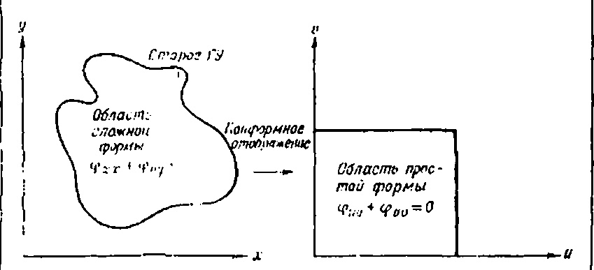

(Читач має робити це самостійно.) Інтегруючи на частини, ми отримуємо

$$

w = f(z)

$$

Оскільки цей інтеграл є нульовим у будь-якій функції $ \eta(x) $ , що задовольняє граничні умови $ \eta(a) = \eta(b) = 0 $ , ми Р и с

. 44 3. Граф функції $ J[y+] \in \eta $ ] в околиці $ \varepsilon = 0 $ .

Ми приходимо до висновку, що друга частина підоб'єктивного виразу має дорівнювати нулю, тобто

(44 2)

(Рівняння Ейлера–Лагранжа).

Рівняння (44 2) називається рівнянням Ейлера-Лагранжа, і хоча загалом воно здається комплексним, коли в нього підставляється конкретна функція F(x, y, y'), воно стає звичайним диференціальним рівнянням другого порядку відносно невідомої функції $ \overline{y}(x) $ . Отже, щоб визначити мінімізуючу функцію $ \overline{y} $ , необхідно розв'язати рівняння Ейлера-Лагранжа.

Отже, ми показали, що

якщо функція y(x) мінімізує функціональний $ J[y] = \int_a^b F(x, y, y') dx $ (у класі гладких функцій з граничними умовами y(a) = A; y(b) = B), то вона повинна задовольняти рівняння

(з граничною умовою).

(Щоб спростити позначення, ми прибрали лінію над $ \bar{y} $ .) Щоб проілюструвати теорію, наведемо приклад.

Пошук мінімальної функціональності $ J[y] = \int_{0}^{1} [y^2 + y'^2] dx $ .

Спробуємо знайти функцію y(x), яка проходить через точки (0,0) і (1,1) і мінімізує функціональність

$$

u + iv = (x + iy)^2 = x^2 - y^2 + 2ixy

$$

З контексту зрозуміло, що шукана функція має бути диференційовною, оскільки інтегративний вираз залежить від y'. Щоб визначити $ \bar{y}(x) $ , запишемо рівняння Ейлера–Лагранжа (разом із граничною умовою y(0)=0 та y(1)=1).

$$

\left\{

$$ $ y(0) = 0, $ $ y(1) = 1. $ Але $ F(x, y, y') = y^2 + y'^2 $ і, отже,

$$

Чи знаєте ви, як виглядає графік цієї функції з сегментом [0, 1]? Подумай про це. Зверніть увагу, що синусоїдальне перетворення функції f(x) визначається лише для додатних цілих чисел n. Іншими словами, скінченний синус і косинус перетворюють функції у чисельні послідовності.

РИС. 25.1. Графики функции f(x) = 1 и ее преобразования.

# Свойства преобразований

Прежде чем приступить к решению задач, мы должны получить некоторые свойства этих преобразований.

Якщо you(x, t) — функція $ \partial \theta yx $ змінних, і ми виконуємо перетворення змінної x, то

$$

(Продифференцировали $ F $ по $ y $ и $ y'. $ )

Уравнение Эйлера — Лагранжа принимает вид

$$

(Зверніть увагу, що перетворення було виконано на змінній x, і отримана послідовність залежить лише від часу t.)

А как быть с производными? Ниже приводятся несколько полезных формул

$$

откуда

$$ Решая це простое дифференциальное уравнение с граничными условиями y(0)=0 и y(1)=1, получаем

$$ .

График цієї функції изображен на рис. 44.4. Ясно, що любая другая гладкая функція, удовлетворяющая тем же граничным условиям, даст большее значение функционала J(y).

Рис. 44 4. Все допустимые гладкие кривые удовлетворяют граничным условиям y(0) = 0 и y(1) = 1: a—допустимая кривая; $ \delta $ —минимизирующая функція $ y(x) = 0.42e^x - 0.42e^{-x} $ .
# ЗАУВАЖЕННЯ
1. Уравнение Эйлера—Лагранжа аналогично равенству нулю производной в дифференциальном исчислении. Якщо читатель помнит, то на самом деле равенство нулю производной не является достаточным условием экстремума. Наприклад, производная функції $ f(x) = x^3 $ при x = 0 равна нулю, но ця точка не является нп точкой минимума, ни точкой максимума. Так же и с уравнением Эйлера—Лагранжа: оно является лише необходимым условием экстремума, но не достаточным. Значит, экстремум может достигаться на других функциях. Очень часто, однако, розв'язок уравнения Эйлера—Лагранжа по существу задачи дает локальный или даже глобальный минимум.

2. Якщо у (х) минимизирует функционал

$$ то площадь поверхности, образованной вращением кривой y(x) вокруг оси x, буде минимальной (рис. 44.5). Решением уравнения Эйлера — Лагранжа в цьому случае буде

цепная линия

$$ где константы $ \alpha $ и $ \beta $ определяются из условий y(a) = A и y(b) = B (т. е. цепная линия должна проходить через заданные точки). Решить уравнение Эйлера—Лагранжа в данном случае достаточно трудно, поэтому мы рекомендуем читателю лише проверить, що цепная линия ему удовлетворяет.

3. В цієї лекции мы нашли, що функція

$$ доставляет минимум функционалу

$$

(\text{УЧП}) \quad u_{tt} = u_{xx} + \sin(\pi x), \quad 0 < x < 1, \quad 0 < t < \infty,

$$

При цьому оказывается, що $ J[\overline{y}] = 0.46 $ . Якщо подставить в функционал любую другую гладкую функцию, график которой проходит через точки (0, 0) и (1, 1), то значение функционала J[y] станет больше.

Рис. 44 5. Минимальная поверхность вращения.

4. Основные законы физики чаще всего формулируются на языке вариационных принципов, а не дифференциальных уравнений. В качестве примеров можна привести принцип Ферма (свет при распространении из одной точки в другую выбирает путь, которому соответствует наименьшее время распространения) или принцип Гамильтона (в консервативном поле частица движется так, що интеграл действия

$$

(\text{ГУ}) \quad

$$

(кинетическая энергия— потенциальная энергия) $ dt $ буде минимальным). Таким образом, физические явления развиваются лише так, що эти функционалы принимают минимальные значения.

 Основные идеи вариационного исчисления можна распространить на функционалы, зависящие от функції нескольких независимых змінних, вида

$$ Соответствующее уравнение Эйлера — Лагранжа для такого функционала буде уже уравнением з частинними похідними

$$ Такого рода функционалы мы рассмотрим в следующей лекции. Однако общая философия метода буде иной. Некоторым новым способом мы найдем функцию u(x, y), яка минимизирует функционал, а поскольку она является решением уравнения Эйлера — Лагранжа, то тем самым мы найдем розв'язок уравнения з частинними похідними. Другими словами, мы будем искать розв'язок уравнения з частинними похідними методом минимизации функционала. В цієї лекции все було наоборот: задачу минимизации функционала, зависящего от функції одной переменной, мы сводили к решению уравнения Эйлера — Лагранжа. Методы розв'язки дифференциальных уравнений путем минимизации соответствующих функционалов принято называть прямыми методами вариационного исчисления. Методы минимизации функционалов путем розв'язки соответствующих уравнений Эйлера — Лагранжа називаються непрямыми методами вариационного исчисления. Следующая лекция посвящена хорошо известному прямому методу Ритца.
# ЗАДАЧІ
1. Среди всех кривых, удовлетворяющих условиям y(0) = 0, и y(1) = 1, найдите ту, яка минимизирует функционал

$$ Как вы интерпретируете получелный результат? Чему равна величина $ J[\overline{y}] $ ? Каков смысл величины $ J[\overline{y}] $ ?

2. Кинетическая энергия колеблющейся материальной точки определяется выражением $ KE = \frac{1}{2} m\dot{y}^2 $ , где y = dy/dt, а потенциальная равна $ PE = \frac{1}{2} ky^2 $ .

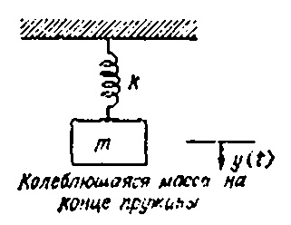

Принцип Гамильтона утверждает, що материальная точка буде двигаться так, що интеграл

$$ буде минимален. Якщо цей закоп справедлив, то получите дифференциальное уравнение движения материальной точки.

3. Покажите, що в классе гладких функцій, удовлетворяющих граничным условиям y(0)=0 и $ y(\pi/2)=1 $ , минимум функционала

$$ достигается на функції $ \overline{y}(x) = \sin x $ . Вычислите $ J(\sin x) $ . 4. Исходя из функционала

$$ получите уравнение Эйлера — Лагранжа

$$ # ВАРИАЦИОННЫЕ МЕТОДЫ РОЗВ'ЯЗКИ УРАВНЕНИЙ З ЧАСТИННИМИ ПОХІДНИМИ МЕТА ЛЕКЦІЇ: Показать, как можна решать дифференциальное уравнение, рассматривая его как уравнение Эйлера—Лагранжа для некоторого функционала и находя некоторым новым методом функцию, минимизирующую цей функционал. Тогда минимизирующая функція буде решением уравнения з частинними похідними. Задача, конечно, состоит в том, чтобы найти такой функционал, для которого исходное уравнение является уравнением Эйлера—Лагранжа. Хорошо известен результат (теорема о минимуме энергии), який гласит, що нахождение розв'язки и некоторой эллиптической краевой задачи

$$ , в области $ D $ , $ u = 0 $ , на границе $ D $ ,

эквивалентно нахождению такой функції u (тоже обращающейся в нуль на границе области D), яка минимизирует функционал потенинальной энергии

$$

Ми можемо розв'язати задачу наступними трьома кроками:

ШАГ І (Определение подходящего преобразования.)

Оскільки змінна x змінюється від 0 до 1, ми використаємо фінальне перетворення, а саме синусоїдальне перетворення; Пізніше стане зрозуміло, чому. Ми могли б розв'язати цю задачу, використовуючи перетворення Лапласа на змінній t (цей метод не відрізняється від скінченного синусоїдального перетворення за інтенсивністю праці).

КРОК 2 (Виконати конвертацію).

Для удобства будем использовать обозначение $ S_n(t) = S[u] $ . Применим синус-преобразование к исходному уравнению

$$

То есть, $ \Delta u = f $ —уравнение Эйлера—Лагранжа для J[u]. Функція, приближенно минимизирующая функционал J[u], ищется методом Ритца; тем самым мы получаем розв'язок (приближениое) уравнения з частинними похідними. В цієї лекции мы познакомимся с методом Ритца и посмотрим, как с помощью цього метода можна и и и и и и и уравнения.

Очень хорошо решать граничные задачи (как, наприклад, задачу о закрепленной мембране) путем отыскания гладкой поверхности, яка минимизирует потенциальную энергию мембраны. То есть, якщо мы рассматриваем исходное уравнение как уравнение Эйлера — Лагранжа для искоторого функционала J[u], то розв'язок дифференциального уравнения можна получить путем минимизации функционала (поскольку минимизирующая функція функционала является решением соответствующего уравнения

Эйлера — Лагранжа). В лекции 44 мы рассматривали такие функционалы, у которых уравнение Эйлера — Лагранжа було обыкновенным дифференциальным уравнением. В цієї лекции рассматриваются функционалы, для которых уравнение Эйлера — Лагранжа относится к классу уравнений з частинними похідними. Наприклад для функционала

$$

и воспользуемся тождеством для синус-преобразования, получим

$$

уравнение Эйлера—Лагранжа (подобно случаю обыкновенного дифференциального уравнения в последней лекции) имеет вид

$$ и, отже, для розв'язки задачи Дирихле в единичном квадрате

(УЧП)

$$ , $ 0 < x < 1 $ , $ 0 < y < 1 $ , (ГУ) $ u = g $ , на границе квадрата,

можна, наоборот, найти такую функцию u(x, y), яка минимизирует J[u] и равна g на границе. Вероятно, не стоит удивляться тому, що функционал

$$ представляет собой потенциальную эпергию мембраны и фактически мы находим поверхность с минимальной потенциальной энерешей. Вопрос, конечно, состоит в следующем: якщо дано дифференциальное уравнение, как мы находим функционал, выражающий потенциальную энергию розв'язки? Ответ на цей вопрос дает хорошо известная теорема (теорема о минимуме энергии), яка утверждает:

Розв'язок и задачи Дирихле

$$

где

$$ $ ^{\Lambda}u = f $ в области $ ^{D} $ $ (ГУ) $ $ ^{U}=0 $ на границе $ ^{D} $ является той же функциен, яка минимизирует (среди функцій, удовлетворяющих граничному условию u=0) энергегический функционал

$$ \begin{cases} u_{tx}, \quad 0 = \begin{cases} 1, \quad -1 < x < 1, \\ 0 \quad \text{в остальных точках,} \end{cases}

$$ и, отже, для розв'язки задачи (45.1) достаточно найти функцию $ \overline{u} $ (среди функцій, обращающихся в нуль на граннце), минимизирующую $ J\{u\} $ . Этим замечанием завершается первая часть лекции. В оставшейся части мы покажем, как находить минимизирующую функцию $ \overline{u} $ для J[u], используя метод Ритца.

# Метод Ритца минимизации функционалов

Цей метод — один из многих вариационных методов, описанных в литературе по вариационному исчислению. Идея, предложенная математиком В. Ритцем, очень проста. Метод состоит из следующих шагов.

ШАГ 1. Выбираем n и функцию u, минимизирующую функционал

$$

Якщо тепер перетворити початкові умови задачі на граничне значення, отримаємо початкові умови для звичайного диференціального рівняння

$$

ищем в виде

$$ где функції $ \phi_1, \phi_2, \phi_3, \ldots, \phi_n $ принадлежат к классу достаточно хороших функцій и все обращаются в нуль на границе, так що из них можна построить разумное приближение для розв'язки задачи. Эти функції принято называть пробными функциями. Типичный набор пробных функцій для задачи Дирихле в единичном квадрате приведен ниже:

$$ — обращаются в нуль на границе, $ \varphi_2(x, y) = x\varphi_1(x, y), $ $ \varphi_3(x, y) = y\varphi_1(x, y), $ $ \varphi_4(x, y) = x^2\varphi_1(x, y), $ $ \varphi_5(x, y) = xy\varphi_1(x, y), $ $ \varphi_6(x, y) = y^2\varphi_1(x, y), $ $ \vdots $ $ \vdots $ Иными словами, первые четыре приближения имеют вид

$$ \begin{aligned} & u_{ti} = c^{2}u_{xx}, & -\infty < x < +\infty, & 0 < t < \infty, \\ & (\text{НУ}) & \begin{cases} u_{t}(x, 0) = 0, \\ u_{t}(x, 0) = \begin{cases} 1, & -1 < x < 1, \\ 0, & \text{в остальных случаях.} \end{cases} \end{aligned}

$$ в координатах (x, t).

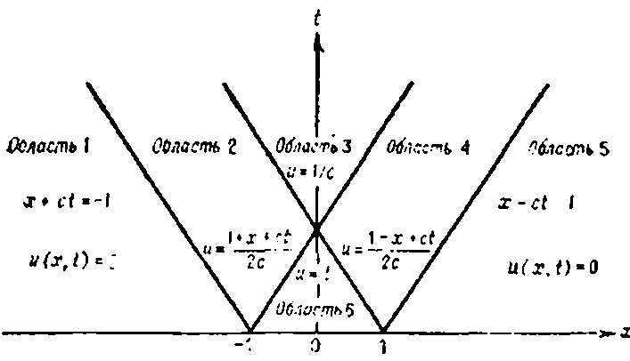

Рис. 18.4. Розв'язок задачи (18.4) в xt-плоскости.

Задача (18.4) описывает поведение струны, которой сообщается рачальная единичная скорость на отрезке -1 < x < 1. Смещение . .

описывается формулой Даламбера

$$

Итак, решим теперь новое семейство задач Кощи:

(ОДУ)

$$

является теперь функцией коефіцієнтів $ a_1a_2\dots a_n $ . Отже, для того чтобы найти минимум функционала J, приравняем нулю частные производные

$$ Aa = b

$$ b_i = -\int_0^1 \int_0^1 f(x, y) \varphi_i(x, y) dx dy,

$$ Це розв'язок в различные моменты времени изображено на рис. 18.5.

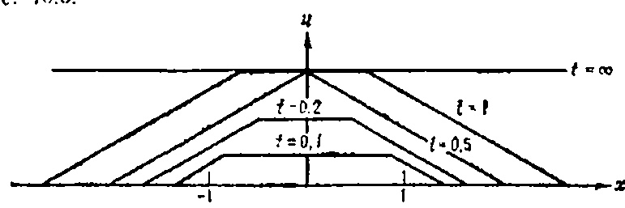

Рис. 18.5. Розв'язок задачи (18.4) в различные моменты времени.

Этим завершается наша интерпретация формулы Даламбера в плоскости змінних $ \boldsymbol{x} $ и t. В оставшейся части лекции мы займемся решением смешанной задачи для полубесконечной струны:

(18.6)

$$ Единственное отличие в том, що аппроксимирующие функції $ \phi_1, \phi_2, \phi_3, \ldots, \phi_n $ повинні удовлетворять граничным условиям:

$$

\right.

$$

является иравнение Лапласа, но це доказательство проводится аналогично тому, как це делалось в лекции 44 для функционала, зависящего от функції одной переменной.

3. В книгах по вариационному исчислению показано, как строить энергетический функционал не лише для уравнения Пуассона с граничным условием Дирихле u=0, но и для многих других дифференциальных уравнений и многих других типов граничных условий. Отже, большое число краевых задач можна решить, минимизируя соответствующие энергетические функционалы.

4. Чем большее значение п мы выбираем, тем меньшее значение $ J[\bar{u}_n] $ получается. Значит, с увеличением n растет точность л приближенного розв'язки дифференциального уравнения. Один из методов определения и, основан на последовательном вычислении функционала $ J[u_n] $ для возрастающих значений n. Обчислення прекращаются, якщо с ростом п функционал перестает практически уменьшаться.

5. Якщо и велико, то проведение вычислений по методу Ритца требует привлечения ЭВМ. На рис. 45.2 (с. 345) приведена блок-

схема розв'язки краевой задачи методом Ритца.

Пользователь повинен позаботиться о подпрограмме, яка должна вычислять значения пробных функцій. Такая подпрограмма может иметь вид:

SUBROUTINE BC (X.Y.PHI)

- SUBROUTINE PROVIDED BY THE USER TO C - EVALUATE THE - FUNCTIONS PHI(1), PHI(2), ..., PHI(N) DIMENSION PHI(20)

PHI(1) = X\*Y\*(1-X)\*(1-Y) $ PHI(2) = X^*PHI(1) $ (используемые функції)

PHI(3) = Y\*PHI(1)

PHI(N) = (що получится)RETURN END

# **ЗА**ДАЧИ

Найдите энергетический функционал для задачи

(УЧП)

, $ 0 < x < 1 $ , $ 0 < y < 1 $ , (ГУ) $ u = 0 $ на границе.

2. Как минимизировать функционал

$$ методом Ритца?

УКАЗАНИЕ. Якщо ввести новую функцию z(x):

$$ то можна заметить, що она удовлетворяет граничным условиям z(0) = 0 и z(1) = 0.1

- 3. Напишите программу для проведения вычислений по блоксхеме, изображенной на рис. 45 2.
- 4. Покажите, що уравнение я

вляется уравнением Эйлера — Лагранжа для функционала

5. Задачу Дирихле г

де A=0.06 и B=0.04. Как найти потенциальную энергию цього розв'язки? Мы рекомендуем читателю вспомнить синуспреобразование и самостоятельно получить розв'язок $ u\left(x,y\right) $ .

\*) При такой замене возникает особенность в т. x=1. Лучше ввести функцию z(x) по формуле z(x)=y(x)=x. Прим. ред.

Далсе. Приближенное розв'язок $ u_n(x,y) = a_1 \varphi_1 + a_2 \varphi_2 + \dots + a_n \varphi_n $ .
В це время можна численно найти эначение функционала $ J[u_n] $ . Якщо необходимо найти значение розв'язки $ u_n(x,y) $ в некоторой точке, можна написать небольшую программу эля быполнения отой операции. При необходимости можна повторить обчислення по цієї программе с другими значениями п Рис. 452. Блок-схема метода Ритца.

# РОЗВ'ЯЗОК УРАВНЕНИЙ З ЧАСТИННИМИ ПОХІДНИМИ МЕТОДАМИ ТЕОРИИ ВОЗМУЩЕНИЙ МЕТА ЛЕКЦІЇ: Показать, как различные сложные задачи (нелинейные уравнения с змінними коэффициентами, области неправильной формы и т. д.) можна решить методом возмущения более простых задач. Иными словами, мы хотим показать, как следует изменить розв'язок простой задачи, чтобы оно давало приближенное розв'язок трудной задачи.

Наприклад, мы покажем, как нелинейную задачу

(УЧП)

$$ , $ 0 < r < 1 $ , 
(ГУ) $ u(1, \theta) = \cos \theta $ , $ 0 \le \theta \le 2\pi $ .

Очень часто задачу, розв'язок которой не известно, можна путем непрерывного изменения каких-то параметров свести к близкой, но легко решаемой задаче. Тогда и розв'язок исходной задачи буде близко решению модифицирующей задачи.

Наприклад, рівняння Лапласа

$$ в помощью семейства уравнений

$$

H(x-a) =

$$, $ 0 \le \varepsilon \le 1 $ ,

$$
\begin{cases} 0, x < a, \\ 1, x \geqslant a, \end{cases}
$$, $ 0 < r < 1 $ , $ 0 \le \theta < 2\pi $ , $ u(1, \theta) = g(\theta) $ , $ 0 \le \theta < 2\pi $ ,

при одних граничных условиях (наприклад, $ g(\theta) = \cos \theta $ ) имеет два различных вещественных розв'язки, а при других (наприклад, $ g(\theta) = A \cos \theta $ с A > 20,65) ця задача не имеет ни одного вещественного розв'язки. — Прим. ред.

4) Краевая задача

можна непрерывно модифицировать в нелинейное уравнение $ \Delta u = u^2 = 0 $ 1).

На рис. 46.1 изображена схема розв'язки нелинейной задачи путем сведения ее к решению уравнения Лапласа2)

$$

В результате получаем

$$

Рис. 46.1. Схема метода возмущении.

Чтобы найти розв'язок возмущенного уравнения Лапласа

$$

H(x-a) =

$$

u(0, t) = f(t),

$$
\begin{cases} 0, & x < a, \\ 1, & x \geqslant a, \end{cases}
$$

u_{x}(0, t) = 0.

$$

\begin{cases} 0, & n = 2, 4, \dots, \\ (4/n\pi)\cos(n\pi t), & n = 3, 5, 7, \dots \end{cases}

$$

x + ct = \text{const},

$$
f(x) = \mathcal{F}^{-1}[F] = \frac{1}{\sqrt{2\pi}} \int_{-\infty}^{+\infty} F(\omega) e^{-i\omega x} d\omega \qquad F(\omega) = \mathcal{F}[f] = \frac{1}{\sqrt{2\pi}} \int_{-\infty}^{+\infty} f(x) e^{-i\omega x} dx
$$ $ 0 < r < 1, $ $ 0 \le \theta < 2\pi, $ $ u(1, 0) = 0, $ $ 0 \le \theta < 2\pi, $ нмеет два розв'язки (одно — нулсьое, другое — нетривиальное), в то время как задача

$$

Следовательно, решение нашей задачи можно представить в виде

$$

u(1, \theta) = 0, \quad 0 \le \theta < 2\pi,

$$
\begin{cases} 1, |x| < a \\ 0, |x| > a \end{cases}
$$

\begin{array}{ccccccccccccccccccccccccccccccccccc

$$

# ЗАМЕЧ АНИЯ

1. Для решения задачи методом конечного синус- или косинуспреобразования краевые условия при x=0 и x=L должны иметь вид

$$

\begin{array}{ccc} (\text{УЧ}\Pi) & \Delta u = 0, & 0 < r < 1, \\ (\text{ГУ}) & u(1, \theta) = \cos \theta, & 0 \leqslant \theta \leqslant 2\pi, \end{array}

$$

\begin{cases} 1, |x| < 1 \\ 0, |x| > 1 \end{cases}

$$

u_{tt} = c^2 u_{xx}, \quad 0 < x < L, \quad 0 < t < \infty,

$$ u(0, t) = g_1(t),

$$ u_x(0, t) = g_1(t),

$$

\delta(x-a)

$$

u_x(0, t) - \gamma_1 u(0, t) = g_1(t),

$$

\begin{array}{ll} (\mathrm{Y} \mathrm{U} \Pi) & u_t = u_{xx}, \quad 0 < x < 1, \quad 0 < t < \infty, \\ (\mathrm{\Gamma} \mathrm{Y} & \left\{ \begin{array}{ll} u_x \left( 0, \ t \right) = 0 \\ u_x \left( 1, \ t \right) = 0, \end{array}

$$

u(0, t) = g_1(t),

$$
(1+x^2)^{-1}
$$

u_x(0, t) = g_1(t),

$$

xe^{-a+x^4}, a > 0

$$

u_x(0, t) - \gamma_1 u(0, t) = g_1(t),

$$

H(x+a) - H(x-a)

$$

\begin{cases} \Delta u_{1} = -r^{2} \cos^{2} \theta = -\frac{r^{2}}{2} \left[1 + \cos(2\theta)\right] = -\frac{r^{2}}{2} - \frac{r^{2}}{2} \cos(2\theta), \\ u_{1}(1, \theta) = 0. \end{cases}

$$
\frac{a}{x^2+a^2}
$$

\Delta u = -\frac{r^2}{2} - \frac{r^3}{2} \cos{(2\theta)}

$$

\right. & 0 < t < \infty, \\ (\text{НУ}) & u(x, 0) = 0, \quad 0 \leqslant x \leqslant 1. \end{array}

$$

u_p(r, \theta) = Ar^4 + Br^4 \cos(2\theta).

$$
\frac{2ax}{(x^2+a^2)^2}
$$

u_p(r, \theta) = -\frac{r^4}{32} - \frac{r^4}{24} \cos(2\theta).

$$

\begin{cases} \cos(ax), |x| > \pi/2a \\ 0, |x| > \pi/2a \end{cases}

$$

\sum_{n=0}^{\infty} [a_n \cos(n\theta) + b_n \sin(n\theta)] - \frac{1}{32} - \frac{1}{24} \cos(2\theta) = 0.

Отметим, що якщо величина u(0, t) положительна, то величина $ u_x(0, t) $ також положительна, якщо u(L, t) положительна, то $ u_x(L, t) $

Рис. 19.6. Возникновение неоднородных граничных условий упругого закрепления: h—коефіцієнт упругости пружины.

отрицательна. Однородные граничні умови (19.2) можна записать в виде

(19.3)

$$

18.

$$

P_{2}

$$

\begin{cases} 1-|x|, |x| < 1 \\ 0, |x| > 1 \end{cases}

$$

\Delta u = 0, \quad 0 < r < 1 + \frac{1}{4} \sin \theta,

$$ досягається в кінцевій точці сімейства граничних умов виду (див. рисунок 46 3)

$$ Tu_x(0, t) = -\beta u_t(0, t).

$$

\cos(ax)

$$

Tu_{x}(0, t) = \varphi[u(0, t)],

$$
\frac{2}{\pi} \frac{\sin a\omega}{\omega}
$$

Tu_{x}(0, t) = -hu^{3}(0, t)

$$

Перед нами неоднородное уравнение теплопроводности, так что метод разделения переменных неприменим. Можпо, конечно, воспользоваться конечным синус-преобразованием по переменной x или преобразованием Лапласа по переменной t, но вместо этого мы рассмотрим две подзадачи

$$

mu_{tt}(L, t) = -ku_x(L, t) + mg.

$$
\frac{2}{\pi} \frac{\sin a\omega}{(\omega^2+a^2)^2}
$$

P_{0}

$$

\frac{\pi}{2} e^{-a+\omega}

$$

Отже, розв'язуючи кожну з задач Дірікла всередині кола для функцій $ u_0 $ , $ u_1 $ , $ u_2 $ , отримуємо розв'язок

(46.9)

$$ Задачі Діріхле в деформованій області (зверніть увагу, що тут

Ми вже взяли $ \epsilon = 1/4 $ :)

Як вправу, читача просять знайти пертурбацію першого порядку $ u_1 $ і перевірити, наскільки добре є приблизне розв'язання

$$ якщо розглянути рівняння з параметром

(46.11)

$$

\frac{\pi}{2} e^{-a+\omega}

$$

і побачити його розв'язок у вигляді

$$
\frac{\pi}{2} e^{-a+\omega}
$$

Підставляючи цю декомпозицію на (46.11), отримуємо таку послідовність завдань

$$

\frac{\pi}{2} e^{-a+\omega}

$$

u_{x}(0, t) = \frac{h}{T} [u(0, t) - \theta_{1}(t)]

$$
\frac{\pi}{2} e^{-a+\omega}
$$

u_{tt} = u_{xx}, \quad 0 < x < 1, \quad 0 < t < \infty,

$$

Каждая из этих задач легко решается и в то же время ясно, что $ \mathit{suma} $ решений задач $ P_1 $ и $ P_2 $ является решением исходной вадачи, т. е.

$$

\Delta u = 0,

$$
\frac{2ax}{(x^2+a^2)^2}
$$

q_{uu} + q_{vv} = 0

$$

Решение задачи $ P_{i} $ Розв'язання задачі $ P_i $ Розв'язання задачі $ P_i $ Можна показати, що в загальному випадку розв'язок задачі

$$

w = f(z)

$$
\frac{\cos(ax), |x| > \pi/2a}{0, |x| > \pi/2a}
$$

\left\{

$$

\frac{1-|x|, |x| < 1}{0, |x| > 1}

$$

\Rightarrow.

$$ \begin{aligned} (Y & \Pi) & \varphi_{xx} + \varphi_{yy} = 0, & -\infty < x < \infty, & 0 < y < \infty, \\ (47.1) & \varphi(x, 0) = \begin{cases} 0, & |x| > 1, \\ 1, & |x| \le 1. \end{cases}

$$ w = \ln\left\{\frac{z-1}{z+1}\right\}

$$

\cos(ax)

$$

\begin{cases} (\text{УЧП}) & \varphi_{uu} + \varphi_{vv} = 0, \quad -\infty < u < \infty, \quad 0 < v < \pi, \\ (\text{47.2}) & \begin{cases} \varphi(u, 0) = 0, \\ \varphi(u, \pi) = 1. \end{cases}

$$

\frac{\pi}{2} [\delta(\omega+a) + \delta(\omega-a)]

$$

u(x, t) = \sum_{n=1}^{\infty} c_n X_n(x) T_n(t),

$$ u_{tt} = \alpha^2 u_{xx}, \quad 0 < x < L, \quad 0 < t < \infty,

$$ (\Gamma Y)

$$

f(x) = \int_{0}^{\infty} F(\omega) \sin(\omega x) d\omega

$$

Щоб візуально зрозуміти, як працює ця функція, ми радимо читачеві побудувати її за кількома лініями y=c.

У другому прикладі ми перетворюємо область між двома неконцентричними колами у кільце.

Задача Діріхле в області між двома некопоцентричними колами

Припустимо, ви хочете знайти потенціал між двома колами

$$
F(\omega) = \frac{?}{\pi} \int_{0}^{\infty} f(x) \sin(\omega x) dx
$$

\quad 0 < t < \infty,

$$

0 < x < \infty

$$

(HY)

$$ u = \gamma [(x-s)(x-t)-\gamma^2],

$$ \quad 0 \le x \le L,

$$

0 < \omega < x

$$

u(x, t) = X(x) T(t).

$$

-\omega^2 F(\omega) + \frac{2}{\pi} \omega f(0)

$$

T'' - \alpha^2 \lambda T = 0,

$$
\frac{1}{\alpha} F\left(\frac{\omega}{\alpha}\right)
$$

X'' - \lambda X = 0,

$$

проследим, как оно решается методом конечного синус-преобразования. Вот что мы должны сделать: разложить еходное воздействие f(x, t) на компоненты, найти отклик $ U_n $ на каждую компоненту, а затем сложить эти отклики. Математически это может быть и не совсем очевидно, но давайте внимательно проследим за ходом решения. Разложим входящие в уравнение с частными производными члены в ряды Фурье по синусам:

$$

u(x, t) = [C \sin(\beta x) + D \cos(\beta x)][A \sin(\alpha \beta t) + B \cos(\alpha \beta t)]

$$
\frac{2\omega}{\pi (\alpha^2 + \omega^2)}
$$

\beta_n = \frac{n\pi}{L}, \quad n = 0, 1, 2, \ldots

$$

x^{-1/2}

$$

u_n(x, t) = X_n(x) T_n(t) = \sin(n\pi x/L) [a_n \sin(n\pi at/L) + b_n \cos(n\pi at/L)],

$$
[2/\pi\omega]^{1/2}
$$

u_n(x, t) = R_n \sin\left(\frac{n\pi x}{L}\right) \cos\left(\frac{n\pi\alpha (t - \delta_n)}{L}\right).

$$

where

$$

H(x-a) =

$$
\frac{2}{\pi\omega} [1-\cos(\omega a)]
$$

Функція Хевісайду,

$$

1

$$

\begin{cases} 0, & x < a, \\ 1, & x \geqslant a, \end{cases}

$$
e^{-1}a + \omega
$$

f(x) = \mathcal{F}^{-1}[F] = \frac{1}{\sqrt{2\pi}} \int_{-\infty}^{+\infty} F(\omega) e^{-i\omega x} d\omega \qquad F(\omega) = \mathcal{F}[f] = \frac{1}{\sqrt{2\pi}} \int_{-\infty}^{+\infty} f(x) e^{-i\omega x} dx

$$

Зверніть увагу, по-перше, що коефіцієнти $ A_n $ , $ B_n $ $ F_n $ дійсно є функціями часу t, оскільки ми застосували синусоїдальне перетворення до функції двох змінних x, t, u, а по-друге, ми розклали вхідний ефект f(x,t) на прості компоненти $ F_n(t) $ . Тепер знайдіть відповіді $ U_n(t) $ для кожного компонента $ F_n(t) $ , потім додайте всі відповіді $ U_n(t) $ і отримайте розв'язок u(x,t).

Щоб знайти відповіді $ U_n(t) $ , необхідно робити невеликі розрахунки з коефіцієнтами $ A_n(t) $ і $ B_n(t) $ , щоб у вирази інтегрування була включена лише функція u, а не її похідні $ u_i $ і $ u_{xx} $ . Інтегруючи на частини, ми отримуємо

$$

\begin{cases} 1, |x| < a \\ 0, |x| > a \end{cases}

$$
\frac{1}{2}e^{-\alpha}\sin\omega
$$

\delta(x-a)

$$

\frac{1-e^{-a\omega}}{\omega}

$$

a_{n} = \frac{2}{n\pi\alpha} \int_{0}^{L} g(x) \sin(n\pi x/L) dx, \\ b_{n} = \frac{2}{L} \int_{0}^{L} f(x) \sin(n\pi x/L) dx.

$$ u(x, t) = \sum_{n=1}^{\infty} \sin(n\pi x/L) \left[ a_n \sin(n\pi \alpha t/L) + b_n \cos(n\pi \alpha t/L) \right],

$$ u(x, t) = \sum_{n=1}^{\infty} b_n \sin(n\pi x/L) \cos(n\pi\alpha t/L)

$$

\frac{2}{\pi}F''(\omega)

$$

u(x, \theta) = f(x)

$$
f(x) = \int_{0}^{\infty} F(\omega) \cos(\omega x) d\omega \qquad \qquad F(x) = \frac{2}{\pi} \int_{0}^{\infty} f(x) \cos(\omega x) dx
$$

f(x) = \sum_{n=1}^{\infty} b_n \sin(n\pi x/L).

$$

0 < x < \infty \qquad \qquad 0 < \omega < \infty

$$

u_n(x, t) = b_n \sin(n\pi x/L) \cos(n\pi\alpha t/L).

$$ u(x, t) = \sin(\pi x/L)\cos(\pi \alpha t/L) + 0.5\sin(3\pi x/L)\cos(3\pi \alpha t/L) + 0.25\sin(5\pi x/L)\cos(5\pi \alpha t/L).

$$ R_n \sin(n\pi x/L) \cos[n\pi\alpha(t-\delta_n)/L],

$$

j''(x)

$$

\omega_n = \frac{n\pi\alpha}{L} = \frac{n\pi}{L} \sqrt{\frac{T}{\rho}},

$$
S_n = \frac{2}{\pi} \int_0^{\pi} f(x) \sin(nx) dx.
$$

u(x, 0) = \sin(\pi x/L) + 0.5 \sin(3\pi x/L),

$$

в последнее соотношение, получаем

$$

u(x, 0) = 0,

$$
y = \frac{\pi}{b - a} (x - a).
$$

u(x, 0) = \sin(3\pi x/L),

$$

и, следовательно, (26.1) принимает вид

$$

u(x, 0) =

$$
f(x) = \sum_{n=1}^{\infty} S_n \sin(nx).
$$

\begin{cases} 2hx, & 0 \le x \le 0.5, \\ 2h(1-x), & 0.5 \le x \le 1. \end{cases}

$$

Поскольку это разложение является тождеством по x, его коэффициенты должны быть равны нулю, $ \tau $ . е.

$$

К а

кие движения буде совершать струна, якщо ее отпустить? 6. Решите задачу о затухающих колебаниях струны

$$
f(x) = \sum_{n=1}^{\infty} S_n \sin(nx)
$$

\frac{2ax}{(x^2+a^2)^2}

$$.

Таким образом, мы получили связь между входом и выходом системы, между коэффициентами $ F_n $ и $ U_n $ . Прежде чем решать уравнения для $ U_n(t) $ , обратимся к начальному условию

$$

Представляется ли вам разумным полученное розв'язок? Удовлетворяет ли оно уравнению з частинними похідними, граничным и начальным условиям?

7. Как вы будете решать неоднородное уравнение с заданными начальными и граничными условиям?

$$
S_n = \frac{2}{\pi} \int_{0}^{\pi} f(x) \sin(nx) dx
$$

\cos(ax)

$$

Если разложить u(x, 0) в ряд Фурье по синусам и приравнять его нулю:

$$

\frac{\pi}{2} [\delta(\omega+a) + \delta(\omega-a)]

$$

то определяются начальные условия для функции $ U_n\left(t\right) $ , т. е.

$$

f(x) = \int_{0}^{\infty} F(\omega) \sin(\omega x) d\omega

$$
n = 1, 2, ...
$$

0 < x < \infty

$$, $ n = 1,  2, \dots $ Мы получили разложение нашей смешанной задачи на ряд простых задач об отклике системы на элементарные входные воздействия:

(OДУ)

$$

1.

$$

(HУ) $ U_n(0) = 0, n = 1, 2, ... $ Каждое из этих уравнений легко решается методом интегрирующего множителя (или с помощью преобразования Лапласа). В любом случае получаем

$$

\frac{1}{\alpha} F\left(\frac{\omega}{\alpha}\right)

$$
\frac{\pi}{2} e^{ax}
$$

x^{-1/2}

$$

Таким образом, мы получили отклики $ U_n(t) $ на простейшие входные воздействия $ F_n(t) $ . Для получения решения исходной задачи осталось совершить последний шаг—сложить все отклики

$$

5. $ H(a-x) $ $$
C_n = \frac{2}{\pi} \int_0^{\pi} f(x) \cos(nx) dx.
$$

6. $ x^{-1} $ $$

Читатель, должно быть, заметил, что каждый отклик $ U_n(t) $ умножается на весовой множитель $ \sin(n\pi x) $ . Конечно, в разложении функции f(x, t) на компоненты $ F_n(t) $ присутствуют те же весовые множители.

# ЗАМЕЧАНИЕ

Використання скінченного синусоїдального перетворення дозволяє записати розв'язок у вигляді ряду, але для більшості інших інтегральних перетворень розв'язки представлені як інтеграли (неперервний розклад). Читача можна попросити дати інтерпретацію проблеми

$$

7. $ \frac{x}{x^2+a^2} $ $$
y = \frac{\pi}{b-a}(x-a).
$$

9. $ \arctan \frac{a}{x} $ $$

f(x) = \frac{C_0}{2} + \sum_{n=1}^{\infty} C_n \cos(nx).

$$

Откуда получаем два уравнения

$$
f(x) = \frac{C_0}{2} + \sum_{n=1}^{\infty} C_n \cos(nx) \qquad C_n = \frac{2}{\pi} \int_{0}^{\pi} f(x) \cos nx \, dx
$$

0 < x < \infty \qquad \qquad 0 < \omega < \infty

$$

0 \le x \le \pi \qquad n = 0, 1, 2, \dots

$$

j''(x)

$$ S_n = \frac{2}{\pi} \int_0^{\pi} f(x) \sin(nx) dx.

$$ y = \frac{\pi}{b - a} (x - a).

$$

f''(x)

$$

f(x) = \sum_{n=1}^{\infty} S_n \sin(nx).

$$
-n^{2}C_{n} - \frac{2}{\pi} \{f'(0) - (-1)^{n} f'(n)\}
$$

S_n = \frac{2}{\pi} \int_{0}^{\pi} f(x) \sin(nx) dx

$$

\begin{array}{ll} u\left(x, \ 0\right) = \sin{(\pi x)}, \\ u_{t}\left(x, \ 0\right) = 0, \end{array}

$$

Воспользовавшись ортогональностью семейства функції (sin (nnx)) на отреже [0, 1], находим формулы для коефіцієнтів

(21.6)

$$

a)

$$

\frac{\pi}{2} e^{ax}

$$

5. $\cos(mx), m=1, 2, \dots$ $$

C_n = \frac{2}{\pi} \int_0^{\pi} f(x) \cos(nx) dx.

$$ $ \mathbf{\Pi} $ для яких рівнянь функція $ u_1 + u_2 $ також буде розв'язком? Які висновки ви можете зробити зі своїх відповідей?

4. Найдите четыре смещанные задачи, сумма решений которых дает решение следующей задачи:

$$

y = \frac{\pi}{b-a}(x-a).

$$ f(x) = \frac{C_0}{2} + \sum_{n=1}^{\infty} C_n \cos(nx).

$$ 0 \le x \le \pi \qquad n = 0, 1, 2, \dots

$$

5. Решите задачу Коши

(OAY)

$$

f''(x)

$$

(HY) $ U_n(0) = 0. $ Можете ли вы проверить полученное решение?

6. Предположим, что функции $ u_1 $ и $ u_2 $ удовлетворяют линейным однородным граничным условиям

$$

2. $ \frac{a_{0}}{2} + \sum_{n=1}^{\infty} a_{n} \cos(nx) $ $ a_{n} $ 3. $ f(n-x) $ $ (-1)^{n} \frac{2}{\pi} C_{n} $ 4. 1

$$
\begin{cases} u_x(1, t) + h_2 u(1, t) = 0.  Чи відповідає функція u_i + u_i цим умовам? , .

Лекция 27

# УРАВНЕНИЯ ПЕРВОГО ПОРЯДКА (МЕТОД ХАРАКТЕРИСТИК)

МЕТА ЛЕКЦІЇ: Ввести поняття диференціального рівняння з похідними в похідних першого порядку (поки що ми розглядали рівняння другого порядку) і ознайомитися з важливим методом розв'язання задач із початковими умовами — методом характеристик. Проблема, яку ми зараз розглянемо, виглядає так:

(УЧП)

5.  \cos(mx), m=1, 2, \dots   \begin{cases}
